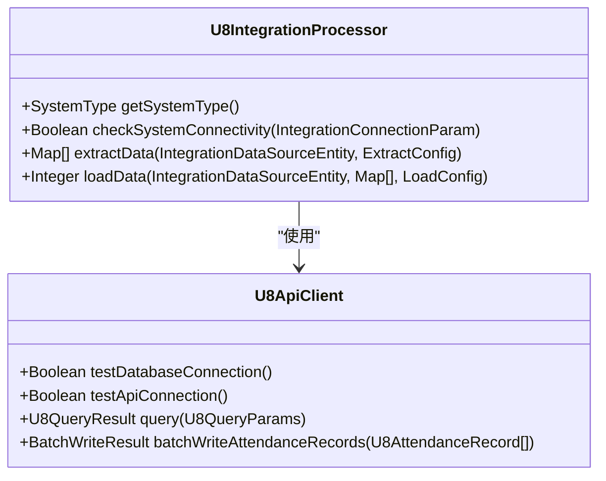
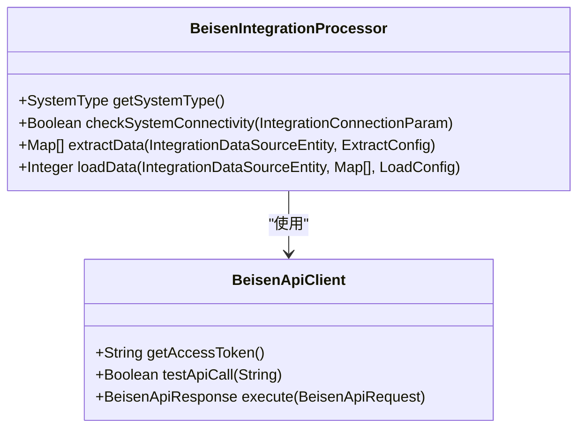
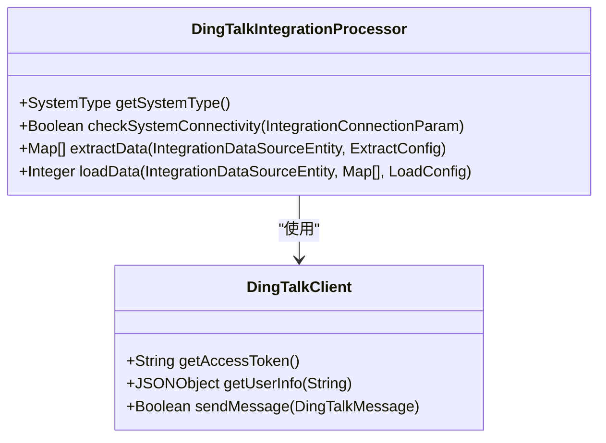
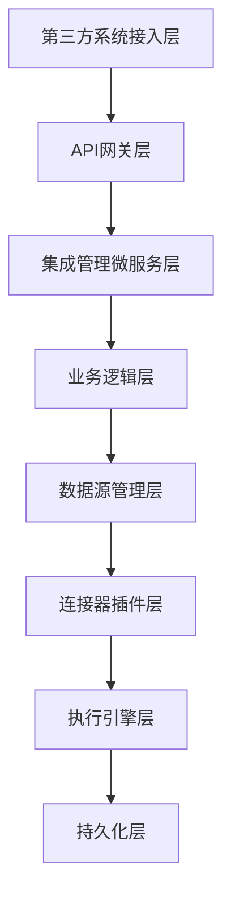

# 第三方系统适配器

<cite>
**本文档引用文件**   
- [spec.md](file://openspec\changes\archive\completed-proposals\implement-third-party-system-integration\specs\third-party-system-integration\spec.md)
- [第三方系统集成实现方案.md](file://documentation\03-业务模块\第三方系统集成实现方案.md)
- [smart-workflow.md](file://documentation\technical\smart-workflow.md)
- [EMPLOYEE_VS_USER_COMPARISON.md](file://documentation\archive\reports-2025-12-04\EMPLOYEE_VS_USER_COMPARISON.md)
</cite>

## 目录
1. [引言](#引言)
2. [ERP系统集成适配器](#erp系统集成适配器)
3. [HR系统集成适配器](#hr系统集成适配器)
4. [OA系统集成适配器](#oa系统集成适配器)
5. [系统架构与实现机制](#系统架构与实现机制)
6. [数据同步策略](#数据同步策略)
7. [安全与合规性](#安全与合规性)
8. [配置与管理](#配置与管理)
9. [监控与告警](#监控与告警)
10. [总结](#总结)

## 引言

本文档详细阐述了IoE Dream智能管理系统中第三方系统适配器的实现机制。该系统旨在通过标准化的适配器框架，实现与主流ERP、HR和OA系统的无缝集成，从而构建一个统一的企业级数据协同平台。适配器的设计遵循微服务架构原则，采用插件化扩展机制，支持多种第三方系统的连接与数据同步。

**Section sources**
- [spec.md](file://openspec\changes\archive\completed-proposals\implement-third-party-system-integration\specs\third-party-system-integration\spec.md#L1-L50)

## ERP系统集成适配器

ERP系统集成适配器是IoE Dream系统与企业资源规划（ERP）系统进行数据交互的核心组件。它支持多种主流ERP系统，包括用友U8、金蝶K3、SAP和Oracle ERP，通过API接口或数据库直连的方式实现数据同步。

### 用友U8适配器

用友U8适配器支持API接口和数据库直连两种连接方式。在连接测试时，系统会同时验证数据库连接和API连接的可用性。对于数据提取，适配器支持分页查询，并能根据配置的字段和过滤条件获取增量数据。数据加载采用批量处理机制，确保高效的数据写入。

**Diagram sources **
- [spec.md](file://openspec\changes\archive\completed-proposals\implement-third-party-system-integration\specs\third-party-system-integration\spec.md#L309-L336)
- [第三方系统集成实现方案.md](file://documentation\03-业务模块\第三方系统集成实现方案.md#L1567-L1688)

### 金蝶K3适配器

金蝶K3适配器支持K3 Cloud和K3 Wise版本，能够同步供应商信息、客户信息、物料信息和销售订单等核心业务数据。适配器采用高性能数据提取引擎，支持并发处理和流式处理，确保在处理大量数据时的性能和稳定性。

**Section sources**
- [spec.md](file://openspec\changes\archive\completed-proposals\implement-third-party-system-integration\specs\third-party-system-integration\spec.md#L310-L336)

## HR系统集成适配器

HR系统集成适配器负责与人力资源管理系统进行数据集成，支持北森HR、Moka HR等主流HR系统。适配器实现了员工数据的全生命周期管理，包括入职、在职、离职等各个阶段的数据同步。

### 北森HR适配器

北森HR适配器支持北森核心HR和人才管理云，能够实现员工信息、组织架构、薪资数据和绩效数据的双向同步。适配器采用OAuth2认证机制，确保数据访问的安全性。在数据提取时，适配器会调用北森API获取员工数据，并进行必要的数据转换和清洗。

**Diagram sources **
- [spec.md](file://openspec\changes\archive\completed-proposals\implement-third-party-system-integration\specs\third-party-system-integration\spec.md#L337-L367)
- [第三方系统集成实现方案.md](file://documentation\03-业务模块\第三方系统集成实现方案.md#L1753-L1818)

### Moka HR适配器

Moka HR适配器支持Moka招聘和绩效管理，能够同步候选人信息、招聘流程和绩效评估结果。适配器实现了智能数据验证机制，包括身份证号验证、银行卡号验证和手机号验证，确保数据的准确性和完整性。

**Section sources**
- [spec.md](file://openspec\changes\archive\completed-proposals\implement-third-party-system-integration\specs\third-party-system-integration\spec.md#L337-L367)

## OA系统集成适配器

OA系统集成适配器负责与企业办公自动化（OA）系统进行集成，支持钉钉、企业微信、飞书等主流OA平台。适配器实现了审批流程集成和消息通知推送机制，提升了企业协同办公的效率。

### 钉钉OA适配器

钉钉OA适配器支持审批流程同步、通讯录同步、日程安排同步和消息通知。在连接测试时，适配器会验证access_token的获取和用户信息的获取。对于消息通知，适配器支持向指定用户或部门发送消息，并能处理发送结果的反馈。

**Diagram sources **
- [第三方系统集成实现方案.md](file://documentation\03-业务模块\第三方系统集成实现方案.md#L1832-L1918)

### 企业微信OA适配器

企业微信OA适配器支持企业微信的审批流程和消息通知功能。适配器能够将IoE Dream系统中的审批请求同步到企业微信，并在审批完成后将结果回写到IoE Dream系统。消息通知支持文本、图片和链接等多种格式。

**Section sources**
- [spec.md](file://openspec\changes\archive\completed-proposals\implement-third-party-system-integration\specs\third-party-system-integration\spec.md#L365-L380)

## 系统架构与实现机制

IoE Dream系统的第三方系统集成采用微服务架构，核心服务包括API网关、集成管理微服务、执行引擎和持久化层。集成管理微服务负责数据源管理和任务调度，执行引擎负责任务的异步执行和状态监控。

### 微服务架构

系统采用Spring Boot 3.5.8 + Java 17的技术栈，严格遵循四层架构规范：Controller → Service → Manager → DAO。各微服务通过Nacos进行服务发现和配置管理，确保系统的高可用性和可扩展性。

**Diagram sources **
- [第三方系统集成实现方案.md](file://documentation\03-业务模块\第三方系统集成实现方案.md#L113-L193)

### 插件化架构

系统采用SPI（Service Provider Interface）机制实现插件化架构，允许动态加载和卸载第三方系统处理器。每个适配器实现`IntegrationDataSourceProcessor`接口，提供连接测试、数据提取和数据加载等核心功能。

**Section sources**
- [design.md](file://openspec\changes\archive\completed-proposals\implement-third-party-system-integration\design.md#L86-L113)

## 数据同步策略

数据同步策略是第三方系统集成的核心，系统支持多种同步方式，包括全量同步、增量同步和双向同步。同步任务可以按计划执行，也可以手动触发。

### 增量同步

系统支持基于时间戳、数据库日志、触发器和API轮询的增量同步方式。增量同步能够有效减少数据传输量，提高同步效率。例如，用友U8适配器可以根据最后更新时间获取增量数据，确保数据的实时性。

**Section sources**
- [spec.md](file://openspec\changes\archive\completed-proposals\implement-third-party-system-integration\specs\third-party-system-integration\spec.md#L329-L336)

### 双向同步

双向同步允许数据在IoE Dream系统和第三方系统之间相互同步。系统提供冲突解决策略，包括以ERP为准、以本地为准和手动解决。数据版本控制功能记录数据变更历史，支持数据回滚。

**Section sources**
- [spec.md](file://openspec\changes\archive\completed-proposals\implement-third-party-system-integration\specs\third-party-system-integration\spec.md#L324-L328)

## 安全与合规性

安全与合规性是第三方系统集成的重要考虑因素。系统采用多种安全机制，包括数据加密存储、权限分级控制、审计日志记录和数据脱敏展示，确保敏感数据的安全。

### 敏感数据保护

系统对身份证、银行卡、薪资等敏感信息采用AES加密存储，确保数据在存储过程中的安全性。权限分级控制机制允许不同角色查看不同敏感级别的数据，防止数据泄露。

**Section sources**
- [spec.md](file://openspec\changes\archive\completed-proposals\implement-third-party-system-integration\specs\third-party-system-integration\spec.md#L352-L356)

### 智能数据验证

系统实现智能数据验证机制，包括身份证号验证、银行卡号验证、手机号验证和邮箱地址验证。这些验证机制确保数据的准确性和完整性，防止无效数据进入系统。

**Section sources**
- [spec.md](file://openspec\changes\archive\completed-proposals\implement-third-party-system-integration\specs\third-party-system-integration\spec.md#L357-L361)

## 配置与管理

系统提供友好的配置界面，支持字段映射和业务规则配置。用户可以通过界面配置数据源、创建集成任务和设置调度计划，无需编写代码即可完成复杂的集成任务。

### 数据源配置

用户在配置数据源时，需要提供系统名称、系统类型、连接参数和环境信息。系统支持多种连接方式，包括API URL、用户名、密码和数据库名称。配置完成后，系统会自动测试连接，确保配置的正确性。

**Section sources**
- [第三方系统集成实现方案.md](file://documentation\03-业务模块\第三方系统集成实现方案.md#L752-L783)

### 任务管理

用户可以通过界面创建、启动、取消和监控集成任务。任务配置包括源数据源、目标数据源、提取配置、加载配置和通知配置。系统支持定时任务和手动任务，满足不同的业务需求。

**Section sources**
- [第三方系统集成实现方案.md](file://documentation\03-业务模块\第三方系统集成实现方案.md#L803-L831)

## 监控与告警

系统提供实时监控和告警功能，基于Prometheus + Grafana的监控体系，能够收集和展示集成任务的性能指标。当任务执行失败或性能瓶颈出现时，系统会通过邮件、Webhook等方式发送告警通知。

### 监控指标

系统监控的关键指标包括任务执行速度、内存使用、网络延迟和错误率。这些指标帮助管理员及时发现和解决潜在问题，确保系统的稳定运行。

**Section sources**
- [design.md](file://openspec\changes\archive\completed-proposals\implement-third-party-system-integration\design.md#L76-L85)

### 告警机制

系统支持多渠道告警通知，包括邮件、钉钉、企业微信和飞书。告警规则可以自定义，例如当任务执行时间超过阈值或错误率超过一定比例时触发告警。

**Section sources**
- [design.md](file://openspec\changes\archive\completed-proposals\implement-third-party-system-integration\design.md#L76-L85)

## 总结

IoE Dream系统的第三方系统适配器通过标准化的框架和灵活的配置，实现了与主流ERP、HR和OA系统的无缝集成。适配器采用微服务架构和插件化设计，支持多种连接方式和数据同步策略，确保了系统的高可用性和可扩展性。通过严格的安全机制和智能的数据验证，系统保障了数据的安全性和准确性。未来，系统将继续扩展支持更多的第三方系统，进一步提升企业数据协同的能力。