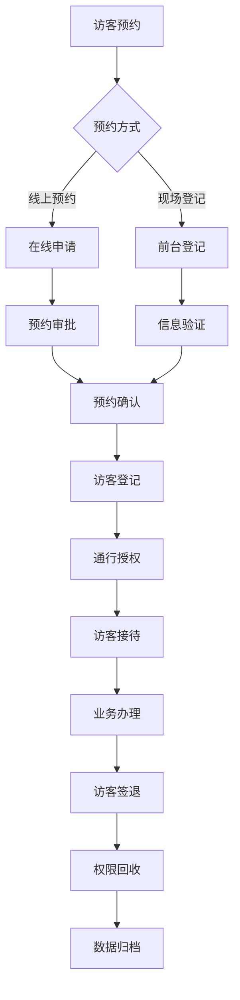
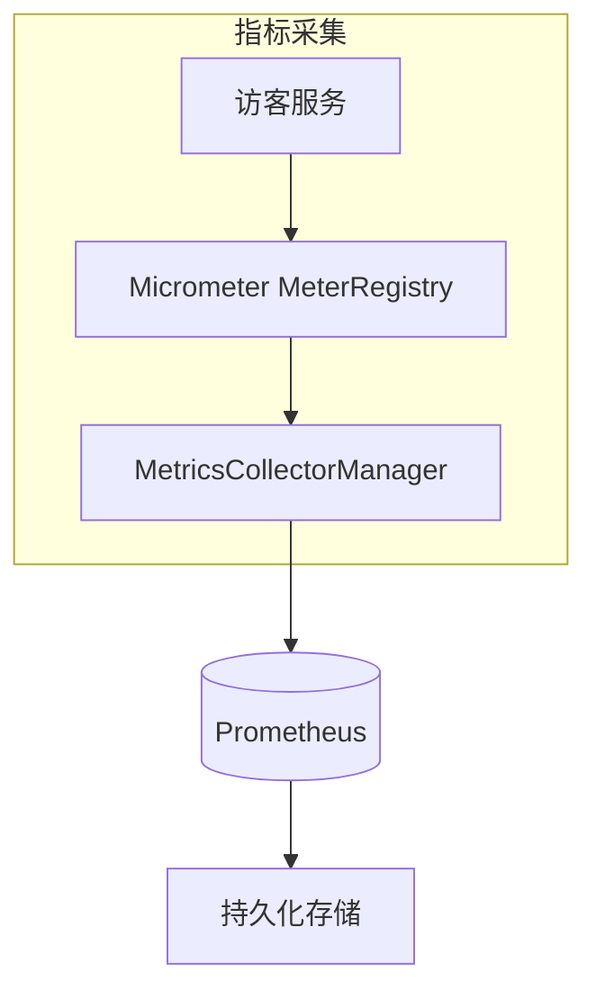
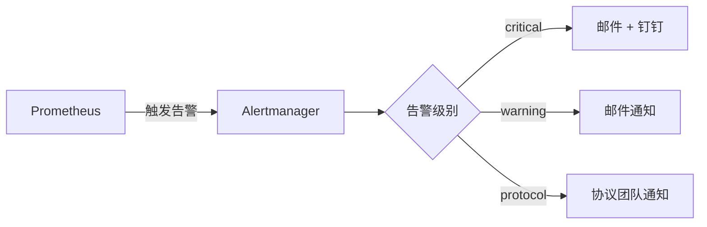

# 业务监控指标

<cite>
**本文档引用文件**  
- [visitor-module-architecture.md](file://documentation\03-业务模块\访客\visitor-module-architecture.md)
- [protocol_alerts.yml](file://deployment\monitoring\prometheus\rules\protocol_alerts.yml)
- [prometheus.yml](file://deployment\monitoring\prometheus\prometheus.yml)
- [alertmanager.yml](file://deployment\monitoring\alertmanager\alertmanager.yml)
- [application-monitoring.yml](file://microservices\ioedream-gateway-service\src\main\resources\application-monitoring.yml)
- [MetricsCollectorManager.java](file://microservices\microservices-common\src\main\java\net\lab1024\sa\common\monitor\manager\MetricsCollectorManager.java)
- [AccessServiceMetrics.java](file://documentation\04-部署运维\门禁服务监控告警机制.md)
</cite>

## 目录
1. [引言](#引言)
2. [核心业务指标体系](#核心业务指标体系)
3. [Micrometer指标注册与持久化](#micrometer指标注册与持久化)
4. [告警规则与阈值设置](#告警规则与阈值设置)
5. [指标命名规范与标签设计](#指标命名规范与标签设计)
6. [总结](#总结)

## 引言

本文件旨在为IoE-DREAM项目中的访客系统建立一套完整的业务监控指标体系。通过定义关键业务指标，结合Micrometer、Prometheus和Alertmanager技术栈，实现对访客预约、审批、设备同步及第三方接口调用等核心业务流程的全面监控。文档详细说明了如何注册和持久化业务指标，并基于`protocol_alerts.yml`中的规则设置告警阈值，以确保系统的稳定性与可维护性。

## 核心业务指标体系

访客系统的业务监控围绕以下几个关键指标展开，这些指标能够全面反映系统的运行状态和用户体验：

- **访客预约成功率**：衡量访客预约请求中成功通过审批的比例，是评估访客服务可用性的核心指标。
- **审批流程完成率**：统计在规定时间内完成审批的预约数量占总预约数的比例，反映内部流程效率。
- **设备同步延迟**：监控访客信息同步至门禁设备的时间延迟，确保物理通行权限及时生效。
- **第三方系统接口调用成功率与响应时间**：跟踪与外部系统（如OCR识别、短信通知）交互的成功率和性能表现。

这些指标已在系统设计文档中明确定义，并通过YAML配置文件进行管理。



**图示来源**  
- [visitor-module-architecture.md](file://documentation\03-业务模块\访客\visitor-module-architecture.md)

**本节来源**  
- [visitor-module-architecture.md](file://documentation\03-业务模块\访客\visitor-module-architecture.md#L3654-L3695)

## Micrometer指标注册与持久化

Micrometer作为应用级指标收集框架，被集成在`microservices-common`模块中，用于将业务指标注册为计数器（Counter）、直方图（Histogram）或仪表（Gauge），并自动暴露给Prometheus抓取。

### 指标类型说明

| 指标类型 | 用途 | 示例 |
|--------|------|------|
| **计数器 (Counter)** | 累积递增的数值，适用于事件计数 | 预约总数、签到次数 |
| **仪表 (Gauge)** | 可增可减的瞬时值，适用于状态度量 | 当前在场访客数、平均停留时长 |
| **直方图 (Histogram)** | 统计分布情况，适用于响应时间分析 | 接口响应时间P95/P99 |

### 指标注册示例

在`application-monitoring.yml`中定义了访客服务的关键指标：

```yaml
# 访客指标
visitor:
  - name: visitor_appointment_count
    description: 访客预约数
    type: counter
  - name: visitor_checkin_count
    description: 访客签到数
    type: counter
  - name: visitor_onsite_count
    description: 当前在场访客数
    type: gauge
```

系统通过`MetricsCollectorManager`类从`MeterRegistry`中采集业务指标，并支持自定义查询。所有指标通过`/actuator/prometheus`端点暴露，Prometheus定期抓取并持久化存储。



**图示来源**  
- [MetricsCollectorManager.java](file://microservices\microservices-common\src\main\java\net\lab1024\sa\common\monitor\manager\MetricsCollectorManager.java)
- [application-monitoring.yml](file://microservices\ioedream-gateway-service\src\main\resources\application-monitoring.yml)

**本节来源**  
- [application-monitoring.yml](file://microservices\ioedream-gateway-service\src\main\resources\application-monitoring.yml#L133-L146)
- [MetricsCollectorManager.java](file://microservices\microservices-common\src\main\java\net\lab1024\sa\common\monitor\manager\MetricsCollectorManager.java#L347-L356)

## 告警规则与阈值设置

告警机制基于Prometheus的规则引擎实现，通过`protocol_alerts.yml`文件定义触发条件，并由Alertmanager负责通知分发。

### 告警规则配置

在`protocol_alerts.yml`中定义了多种告警规则，涵盖协议处理失败率、延迟、队列积压等场景。例如：

```yaml
- alert: ProtocolMessageFailureRateHigh
  expr: |
    rate(protocol_message_process_total{status="error"}[5m]) 
    / 
    rate(protocol_message_process_total[5m]) 
    > 0.1
  for: 5m
  labels:
    severity: warning
  annotations:
    summary: "协议消息处理失败率过高"
    description: "协议消息处理失败率超过10%，当前值: {{ $value | humanizePercentage }}"
```

该规则表示：**连续5分钟内预约失败率超过10%** 时触发警告级告警。

### 告警通知策略

Alertmanager根据严重程度和业务类型路由告警通知：

- **严重告警（critical）**：通过邮件和钉钉机器人立即通知值班人员。
- **协议相关告警**：发送至`protocol-team@ioedream.com`并推送至钉钉群。
- **系统级告警**：由系统管理员接收处理。

同时，系统配置了抑制规则，避免在严重告警触发时重复发送低级别告警，防止告警风暴。



**图示来源**  
- [protocol_alerts.yml](file://deployment\monitoring\prometheus\rules\protocol_alerts.yml)
- [alertmanager.yml](file://deployment\monitoring\alertmanager\alertmanager.yml)

**本节来源**  
- [protocol_alerts.yml](file://deployment\monitoring\prometheus\rules\protocol_alerts.yml#L6-L141)
- [alertmanager.yml](file://deployment\monitoring\alertmanager\alertmanager.yml#L1-L127)

## 指标命名规范与标签设计

为确保指标的可读性与可查询性，系统遵循统一的命名规范和标签设计原则。

### 指标命名规范

- **前缀统一**：使用业务模块名作为前缀，如`visitor_`、`access_`、`consume_`。
- **语义清晰**：使用下划线分隔单词，动词在前，名词在后，如`visitor_appointment_count`。
- **避免缩写**：除非广泛认知，否则不使用缩写，保证可读性。

### 标签（Label）设计建议

| 标签名 | 用途 | 示例值 |
|-------|------|--------|
| `method` | 区分不同验证方式 | `card`, `qr`, `face` |
| `status` | 表示操作结果 | `success`, `failure` |
| `reason` | 失败原因分类 | `timeout`, `permission_denied` |
| `service` | 标识服务来源 | `visitor-service`, `device-comm-service` |

合理使用标签可以实现多维度数据切片分析，例如按`method`和`status`组合查询不同验证方式的成功率。

**本节来源**  
- [visitor-module-architecture.md](file://documentation\03-业务模块\访客\visitor-module-architecture.md#L3657-L3668)
- [AccessServiceMetrics.java](file://documentation\04-部署运维\门禁服务监控告警机制.md#L298-L311)

## 总结

本文档系统地定义了访客系统的业务监控指标体系，涵盖了从指标定义、Micrometer注册、Prometheus持久化到Alertmanager告警的完整链路。通过标准化的命名规范和标签设计，提升了监控数据的可读性与可维护性。未来可进一步扩展直方图指标，深入分析响应时间分布，提升系统性能洞察力。