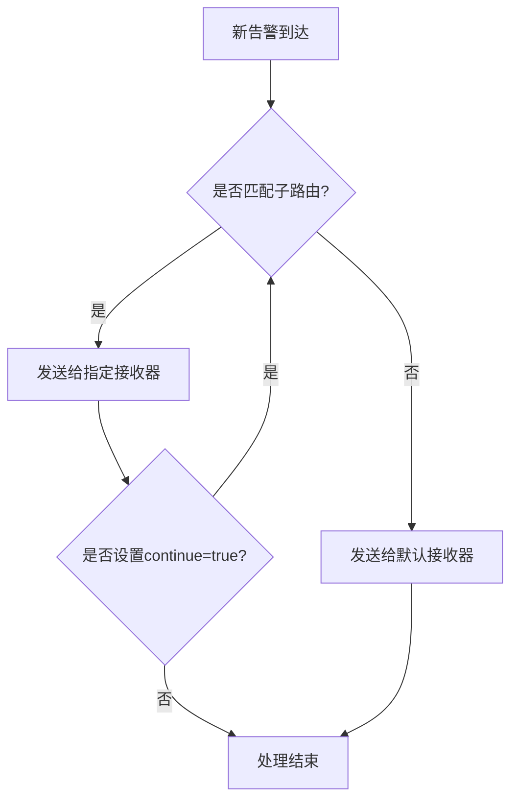
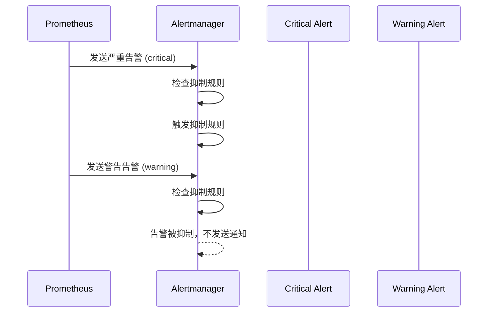
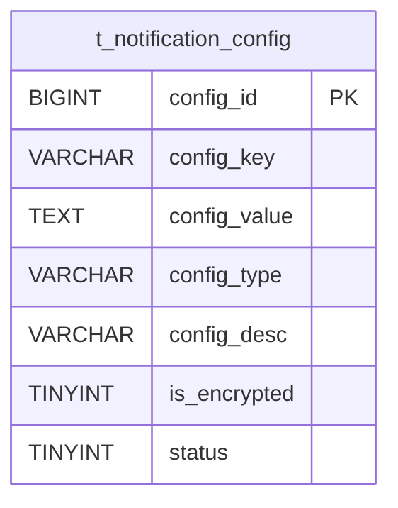
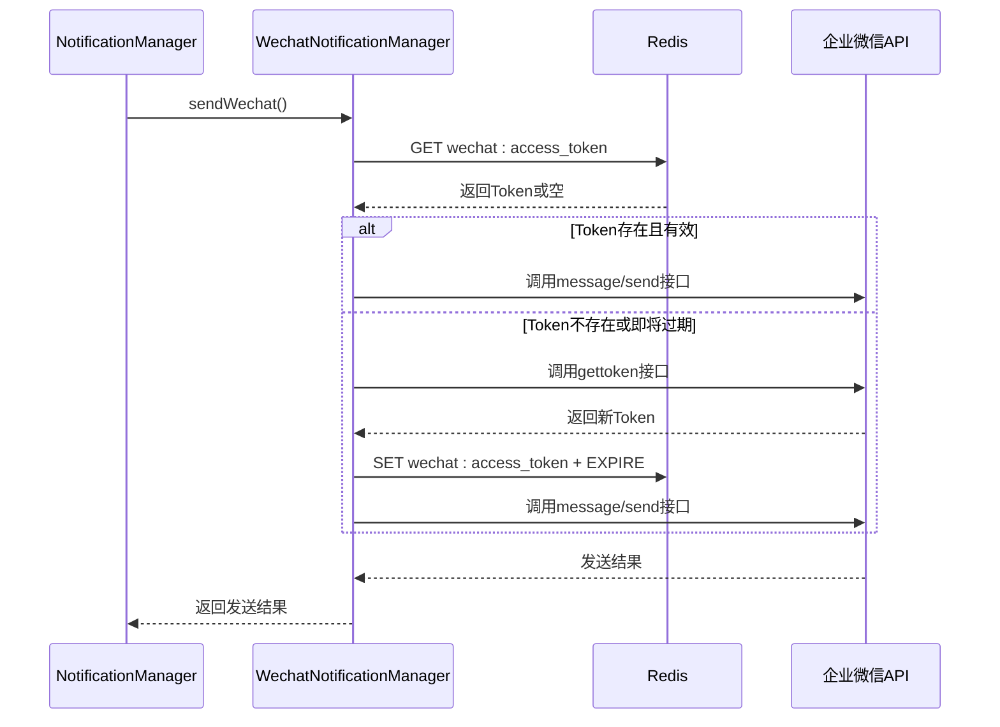
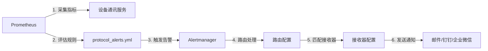

# 多渠道告警通知机制

<cite>
**本文档引用文件**   
- [alertmanager.yml](file://deployment/monitoring/alertmanager/alertmanager.yml)
- [protocol_alerts.yml](file://deployment/monitoring/prometheus/rules/protocol_alerts.yml)
- [prometheus.yml](file://deployment/monitoring/prometheus/prometheus.yml)
- [NotificationManager.java](file://microservices/microservices-common/src/main/java/net/lab1024/sa/common/monitor/manager/NotificationManager.java)
- [NotificationManagerImpl.java](file://microservices/ioedream-common-service/src/main/java/net/lab1024/sa/common/monitor/manager/NotificationManagerImpl.java)
- [WebhookNotificationManager.java](file://microservices/ioedream-common-service/src/main/java/net/lab1024/sa/common/notification/manager/WebhookNotificationManager.java)
- [WechatNotificationManager.java](file://microservices/ioedream-common-service/src/main/java/net/lab1024/sa/common/notification/manager/WechatNotificationManager.java)
- [DingTalkNotificationManager.java](file://microservices/ioedream-common-service/src/main/java/net/lab1024/sa/common/notification/manager/DingTalkNotificationManager.java)
- [t_notification_config.sql](file://database-scripts/common-service/09-t_notification_config.sql)
- [t_alert_rule.sql](file://database-scripts/common-service/12-t_alert_rule.sql)
- [t_alert.sql](file://database-scripts/common-service/11-t_alert.sql)
- [门禁服务监控告警机制.md](file://documentation/04-部署运维/门禁服务监控告警机制.md)
</cite>

## 目录
1. [引言](#引言)
2. [Alertmanager配置结构](#alertmanager配置结构)
3. [多渠道通知实现](#多渠道通知实现)
4. [告警分组、静默与去重](#告警分组静默与去重)
5. [告警规则与通知链路](#告警规则与通知链路)
6. [配置示例与故障排查](#配置示例与故障排查)

## 引言
本文档详细阐述了访客系统中多渠道告警通知机制的实现。该机制基于Prometheus和Alertmanager构建，实现了从指标采集、规则评估到多渠道通知的完整链路。系统支持邮件、企业微信、钉钉等多种通知方式，并通过数据库配置实现了告警规则和通知策略的动态管理。文档将深入解析Alertmanager的配置结构、通知渠道的集成方式以及告警处理的核心策略。

## Alertmanager配置结构

### 路由（route）配置
Alertmanager的路由配置定义了告警的分发逻辑，采用树状结构进行匹配。根路由（root route）定义了全局的分组和发送策略，子路由（routes）则根据告警的标签（labels）进行精确匹配，将告警分发到不同的接收器（receiver）。

在`alertmanager.yml`中，路由配置的核心参数如下：
- **group_by**: 定义告警分组的依据，如`['alertname', 'cluster', 'service']`表示相同告警名称、集群和服务的告警将被合并为一组。
- **group_wait**: 首次告警到达后，等待的时间，以便将同一组的告警合并发送。
- **group_interval**: 同一组告警在首次发送后，后续重复发送的间隔。
- **repeat_interval**: 如果告警未被解决，重复发送通知的间隔。
- **receiver**: 默认接收器，所有未被子路由匹配的告警都将发送给此接收器。
- **routes**: 子路由列表，通过`match`或`match_re`（正则匹配）来匹配告警标签。`continue: true`表示匹配成功后，继续尝试匹配后续的子路由。

**Diagram sources**
- [alertmanager.yml](file://deployment/monitoring/alertmanager/alertmanager.yml#L11-L33)

### 接收者（receiver）配置
接收器（receiver）定义了告警通知的具体发送方式和目标。一个接收器可以包含多种通知方式（如email_configs, webhook_configs），当告警被路由到该接收器时，所有配置的通知方式都会被触发。

在`alertmanager.yml`中，定义了多个接收器：
- **default-receiver**: 默认接收器，仅通过邮件发送通知。
- **critical-receiver**: 严重告警接收器，同时通过邮件和钉钉发送通知，确保关键告警能被及时响应。
- **protocol-receiver**: 协议服务专用接收器，将告警发送给协议团队的邮件和钉钉群。
- **system-receiver**: 系统告警接收器，专门处理系统级别的告警。

每种通知方式（如`email_configs`）都包含目标地址（`to`）、消息头（`headers`）和消息体（`html`）的模板。模板使用Go模板语法，可以动态填充告警信息。

**Section sources**
- [alertmanager.yml](file://deployment/monitoring/alertmanager/alertmanager.yml#L43-L127)

### 抑制规则（inhibit_rules）
抑制规则用于避免告警风暴，即当一个严重告警发生时，自动抑制（不发送）与之相关的、级别较低的告警。这可以防止在系统出现重大故障时，运维人员被大量次要告警淹没。

在`alertmanager.yml`中，定义了一条抑制规则：当一个`severity: critical`的严重告警触发时，会抑制所有具有相同`alertname`和`service`标签的`severity: warning`警告告警。这确保了在处理核心问题时，不会被相关的警告信息干扰。

**Diagram sources**
- [alertmanager.yml](file://deployment/monitoring/alertmanager/alertmanager.yml#L34-L42)

## 多渠道通知实现

### 通知渠道配置与管理
系统的多渠道通知能力不仅依赖于Alertmanager，还通过应用层的`NotificationManager`进行增强和管理。通知渠道的配置信息存储在数据库的`t_notification_config`表中，支持动态更新，无需重启服务。

**Diagram sources**
- [t_notification_config.sql](file://database-scripts/common-service/09-t_notification_config.sql#L8-L26)

`NotificationConfigManager`服务负责从数据库加载这些配置。例如，企业微信的配置包括`CORP_ID`、`CORP_SECRET`和`AGENT_ID`，而钉钉的配置则包括`WEBHOOK_URL`和`SECRET`。这种设计将敏感信息（如密码、密钥）与代码分离，提高了安全性和可维护性。

### 企业微信通知集成
企业微信通知通过`WechatNotificationManager`实现。该管理器使用企业微信的应用API发送消息，主要流程如下：
1.  **获取访问令牌（Access Token）**：首先调用`gettoken`接口获取`access_token`，该令牌会被缓存到Redis中，有效期为2小时，避免频繁调用API。
2.  **构建消息**：根据告警内容构建消息体。支持文本、卡片（news）和图文（mpnews）三种格式。消息格式通过解析通知内容中的关键字（如"news"）来确定。
3.  **发送消息**：调用`message/send`接口发送消息。如果收到`40014`或`42001`错误码（表示Token过期），管理器会自动刷新Token并重试。

**Diagram sources**
- [WechatNotificationManager.java](file://microservices/ioedream-common-service/src/main/java/net/lab1024/sa/common/notification/manager/WechatNotificationManager.java#L123-L758)

### 钉钉通知集成
钉钉通知通过`DingTalkNotificationManager`实现，利用钉钉机器人的Webhook功能。其核心特点是安全性，通过加签（sign）机制防止Webhook URL被滥用。

1.  **加签计算**：管理器使用HMAC-SHA256算法，以`timestamp\n + secret`为输入计算签名（sign）。
2.  **构建URL**：将计算出的`sign`和`timestamp`作为查询参数附加到Webhook URL上。
3.  **发送消息**：向带签名的URL发送POST请求，请求体为JSON格式的消息内容。消息格式支持Markdown、ActionCard和FeedCard，通过解析通知内容中的关键字来选择。

**Section sources**
- [DingTalkNotificationManager.java](file://microservices/ioedream-common-service/src/main/java/net/lab1024/sa/common/notification/manager/DingTalkNotificationManager.java#L67-L457)

### Webhook通用通知
`WebhookNotificationManager`提供了一种通用的HTTP通知机制，可以将告警转发到任何支持Webhook的第三方系统（如Slack、自定义监控平台）。

该管理器支持高级特性：
- **自定义请求头**：可以从配置中读取`Authorization`、`X-API-Key`等自定义头信息。
- **请求签名**：支持HMAC-SHA256签名，确保请求来源的合法性。
- **重试机制**：集成了`NotificationRetryManager`，在发送失败时进行指数退避重试。
- **限流控制**：通过`NotificationRateLimiter`防止对下游系统造成过大压力。

**Section sources**
- [WebhookNotificationManager.java](file://microservices/ioedream-common-service/src/main/java/net/lab1024/sa/common/notification/manager/WebhookNotificationManager.java#L51-L465)

## 告警分组、静默与去重

### 告警分组（Grouping）
告警分组是减少通知噪音的关键策略。在`alertmanager.yml`中，通过`group_by`指令将具有相同标签的告警合并为一个通知。例如，`group_by: ['alertname', 'service']`会将同一服务的同名告警合并。这避免了当一个服务的多个实例同时出现故障时，运维人员收到数十封内容几乎相同的邮件。

### 静默（Silence）
静默是一种主动的告警抑制机制。用户可以在Web UI上创建静默规则，指定匹配的标签和静默的持续时间。在静默期间，所有匹配的告警都不会触发任何通知。这在计划内维护或已知问题修复期间非常有用。

### 去重（Deduplication）
去重是Alertmanager内置的机制，与分组紧密相关。当一个新的告警事件到达时，Alertmanager会检查是否存在一个活动的、相同分组的告警。如果存在，它会更新该告警的状态，而不是创建一个新的通知。这确保了对于持续存在的问题，不会在`repeat_interval`间隔之外重复发送通知。

## 告警规则与通知链路

### 告警规则定义
告警规则在`protocol_alerts.yml`中定义，由Prometheus的规则评估器周期性地执行。每个规则包含一个PromQL表达式（`expr`），当表达式结果为真时，就会触发一个告警。

例如，`ProtocolMessageFailureRateHigh`规则的表达式计算了协议消息处理失败率，当该比率持续5分钟超过10%时，就会触发一个`warning`级别的告警。

**Diagram sources**
- [prometheus.yml](file://deployment/monitoring/prometheus/prometheus.yml#L8-L13)
- [protocol_alerts.yml](file://deployment/monitoring/prometheus/rules/protocol_alerts.yml#L1-L141)
- [alertmanager.yml](file://deployment/monitoring/alertmanager/alertmanager.yml#L11-L33)

### 完整通知链路
1.  **指标采集**：Prometheus从`device-comm-service`等服务的`/actuator/prometheus`端点拉取监控指标。
2.  **规则评估**：Prometheus的规则评估器根据`protocol_alerts.yml`中的规则，周期性地执行PromQL查询。
3.  **告警触发**：当规则条件满足时，Prometheus将告警推送给配置的Alertmanager。
4.  **告警处理**：Alertmanager根据`alertmanager.yml`中的路由、抑制和分组规则处理告警。
5.  **通知发送**：告警被路由到相应的接收器，通过邮件、钉钉或企业微信等渠道发送给指定人员。

**Section sources**
- [prometheus.yml](file://deployment/monitoring/prometheus/prometheus.yml#L1-L99)
- [protocol_alerts.yml](file://deployment/monitoring/prometheus/rules/protocol_alerts.yml#L1-L141)
- [alertmanager.yml](file://deployment/monitoring/alertmanager/alertmanager.yml#L1-L127)

## 配置示例与故障排查

### 常见配置示例
- **添加企业微信通知**：在`alertmanager.yml`的`critical-receiver`中添加`wechat_configs`，并确保`WechatNotificationManager`的配置正确。
- **自定义消息模板**：修改`email_configs`中的`html`字段，使用Go模板语法（如`{{ .CommonLabels.alertname }}`）来定制邮件内容。
- **创建静默规则**：在Alertmanager的Web UI上，通过指定`service=device-comm-service`和`alertname=ProtocolMessageFailureRateHigh`来创建一个2小时的静默。

### 故障排查方法
- **检查Alertmanager日志**：查看`alertmanager`容器的日志，确认告警是否被正确接收和处理。
- **验证Webhook URL**：使用`curl`命令测试钉钉或企业微信的Webhook URL是否有效。
- **检查网络连通性**：确保Alertmanager能够访问邮件服务器、钉钉API和企业微信API。
- **查看数据库配置**：确认`t_notification_config`表中的配置项（如`status`）是否为启用状态。

**Section sources**
- [门禁服务监控告警机制.md](file://documentation/04-部署运维/门禁服务监控告警机制.md#L479-L719)