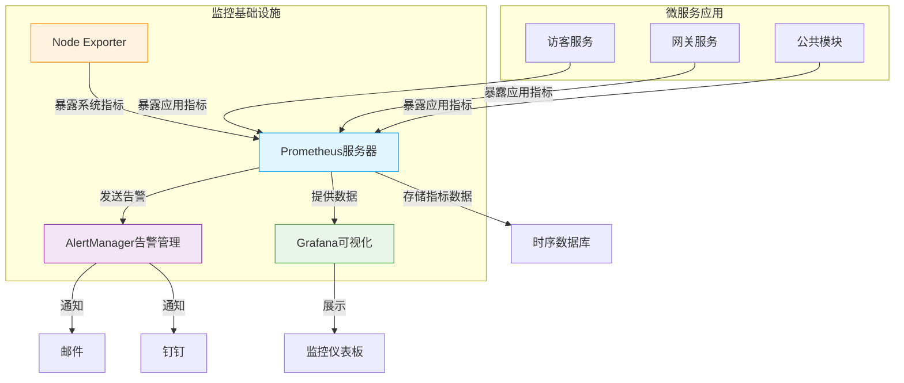
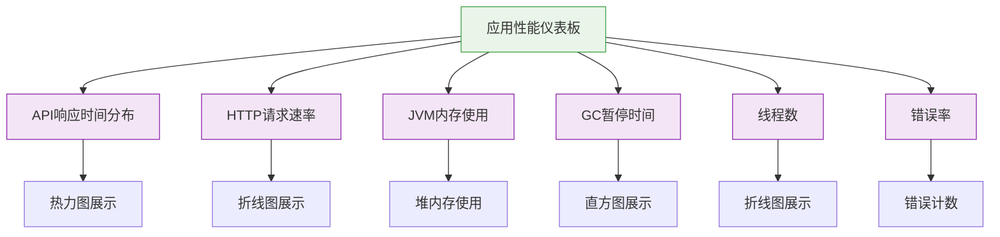

# 性能监控

<cite>
**本文档引用的文件**   
- [docker-compose-monitoring.yml](file://deployment/monitoring/docker-compose-monitoring.yml)
- [prometheus.yml](file://deployment/monitoring/prometheus/prometheus.yml)
- [alertmanager.yml](file://deployment/monitoring/alertmanager/alertmanager.yml)
- [application.yml](file://microservices/ioedream-visitor-service/src/main/resources/application.yml)
- [application-monitoring.yml](file://microservices/ioedream-gateway-service/src/main/resources/application-monitoring.yml)
- [AccessServiceMetrics.java](file://documentation/04-部署运维/门禁服务监控告警机制.md)
- [visitor-module-architecture.md](file://documentation/03-业务模块/各业务模块文档/访客/visitor-module-architecture.md)
</cite>

## 目录
1. [引言](#引言)
2. [监控架构与组件](#监控架构与组件)
3. [核心性能指标采集](#核心性能指标采集)
4. [Prometheus配置详解](#prometheus配置详解)
5. [Grafana可视化配置](#grafana可视化配置)
6. [自定义指标注册与上报](#自定义指标注册与上报)
7. [监控基础设施部署](#监控基础设施部署)
8. [告警机制配置](#告警机制配置)
9. [最佳实践与建议](#最佳实践与建议)

## 引言

本文档详细说明了IOE-DREAM智慧园区一卡通管理平台中访客系统的性能监控实现方案。文档涵盖了从Prometheus与Micrometer集成、核心性能指标采集、Prometheus配置、Grafana可视化到自定义指标上报和监控基础设施部署的完整技术细节。

通过本监控系统，可以全面监控访客服务的API响应时间、系统资源使用率（CPU、内存、磁盘I/O）、JVM运行状态等关键性能指标，为系统稳定运行和性能优化提供数据支持。

**Section sources**
- [docker-compose-monitoring.yml](file://deployment/monitoring/docker-compose-monitoring.yml)
- [prometheus.yml](file://deployment/monitoring/prometheus/prometheus.yml)

## 监控架构与组件

IOE-DREAM系统的性能监控采用Prometheus生态体系，由多个核心组件构成，形成完整的监控解决方案。



**Diagram sources **
- [docker-compose-monitoring.yml](file://deployment/monitoring/docker-compose-monitoring.yml)
- [prometheus.yml](file://deployment/monitoring/prometheus/prometheus.yml)

**Section sources**
- [docker-compose-monitoring.yml](file://deployment/monitoring/docker-compose-monitoring.yml)
- [prometheus.yml](file://deployment/monitoring/prometheus/prometheus.yml)

## 核心性能指标采集

系统通过Micrometer与Spring Boot Actuator集成，采集多种核心性能指标，包括API响应时间、系统资源使用率和JVM运行状态等。

### API响应时间监控

系统通过Micrometer的Timer组件采集API响应时间，主要指标包括：

- **http_server_requests_seconds**: HTTP服务器请求处理时间，包含count（请求次数）、sum（总耗时）和bucket（耗时分布）等子指标
- **访问验证响应时间**: 门禁验证的响应时间，用于监控验证性能

### 系统资源使用率监控

通过Node Exporter采集系统级别的资源使用情况：

- **CPU使用率**: system_cpu_usage指标，监控CPU资源消耗
- **内存使用率**: system_memory_usage指标，监控内存资源消耗
- **磁盘I/O**: node_disk_io_time_seconds_total指标，监控磁盘读写性能
- **网络流量**: node_network_receive_bytes_total和node_network_transmit_bytes_total指标，监控网络吞吐量

### JVM运行状态监控

通过Micrometer采集JVM运行时状态：

- **JVM内存使用**: jvm_memory_used_bytes指标，按内存区域（heap、non-heap）和内存池（eden、survivor、tenured）监控内存使用情况
- **GC统计**: jvm_gc_pause_seconds_count和jvm_gc_pause_seconds_max指标，监控垃圾回收次数和最大暂停时间
- **线程状态**: jvm_threads_live和jvm_threads_daemon指标，监控活跃线程数和守护线程数
- **类加载**: jvm_classes_loaded和jvm_classes_unloaded指标，监控类加载和卸载情况

**Section sources**
- [application-monitoring.yml](file://microservices/ioedream-gateway-service/src/main/resources/application-monitoring.yml)
- [AccessServiceMetrics.java](file://documentation/04-部署运维/门禁服务监控告警机制.md)

## Prometheus配置详解

Prometheus的配置文件`prometheus.yml`定义了监控系统的全局配置、告警规则和采集任务。

### 全局配置

```yaml
global:
  scrape_interval: 15s
  evaluation_interval: 15s
  external_labels:
    cluster: 'ioedream'
    environment: 'production'
```

- **scrape_interval**: 采集间隔设置为15秒，平衡了监控实时性和系统开销
- **evaluation_interval**: 规则评估间隔为15秒，与采集间隔保持一致
- **external_labels**: 添加集群和环境标签，便于多环境监控数据区分

### 采集任务配置

Prometheus配置了多个采集任务（job），分别监控不同的微服务和系统组件：

```mermaid
graph TD
A[Prometheus] --> B[device-comm-service]
A --> C[gateway-service]
A --> D[consume-service]
A --> E[access-service]
A --> F[attendance-service]
A --> G[visitor-service]
A --> H[video-service]
A --> I[rabbitmq]
A --> J[node-exporter]
B --> K[/actuator/prometheus]
C --> K
D --> K
E --> K
F --> K
G --> K
H --> K
I --> L[/api/metrics]
J --> M[/metrics]
style A fill:#e1f5fe,stroke:#039be5
style B fill:#f3e5f5,stroke:#8e24aa
style C fill:#f3e5f5,stroke:#8e24aa
style D fill:#f3e5f5,stroke:#8e24aa
style E fill:#f3e5f5,stroke:#8e24aa
style F fill:#f3e5f5,stroke:#8e24aa
style G fill:#f3e5f5,stroke:#8e24aa
style H fill:#f3e5f5,stroke:#8e24aa
style I fill:#fff3e0,stroke:#fb8c00
style J fill:#fff3e0,stroke:#fb8c00
```

**Diagram sources **
- [prometheus.yml](file://deployment/monitoring/prometheus/prometheus.yml)

每个采集任务配置了以下关键参数：

- **job_name**: 任务名称，标识被监控的服务
- **metrics_path**: 指标端点路径，微服务使用`/actuator/prometheus`
- **targets**: 目标服务地址，通过服务名和端口指定
- **labels**: 添加服务和应用标签，便于指标查询和过滤

### 访客服务监控配置

访客服务的监控配置如下：

```yaml
- job_name: 'visitor-service'
  metrics_path: '/actuator/prometheus'
  static_configs:
    - targets: ['visitor-service:8080']
      labels:
        service: 'visitor-service'
        application: 'ioedream-visitor-service'
```

此配置确保Prometheus能够定期从访客服务的`/actuator/prometheus`端点采集性能指标。

**Section sources**
- [prometheus.yml](file://deployment/monitoring/prometheus/prometheus.yml)

## Grafana可视化配置

Grafana用于可视化Prometheus采集的性能指标，提供直观的监控仪表板。

### 数据源配置

Grafana需要配置Prometheus作为数据源，连接到Prometheus服务器：

```yaml
# Grafana数据源配置
apiVersion: 1
datasources:
  - name: Prometheus
    type: prometheus
    url: http://prometheus:9090
    access: proxy
    isDefault: true
```

### 仪表板配置建议

建议创建以下关键仪表板：

#### 系统概览仪表板

监控系统整体运行状态，包含以下面板：

- CPU使用率趋势图
- 内存使用率趋势图
- 磁盘使用率饼图
- 网络流量图

#### 应用性能仪表板

监控微服务应用性能，包含以下面板：



**Diagram sources **
- [application-monitoring.yml](file://microservices/ioedream-gateway-service/src/main/resources/application-monitoring.yml)

#### 业务监控仪表板

监控关键业务指标，如访客系统的在场访客数、预约通过率等。

### 访客系统关键指标可视化

根据业务需求，建议在Grafana中配置以下关键指标的可视化：

- **在场访客数**: 使用仪表盘（gauge）展示当前在场访客数量
- **预约通过率**: 使用百分比统计图展示预约审批通过率
- **平均停留时长**: 使用趋势图展示访客平均停留时间变化
- **通行异常率**: 使用折线图展示异常通行事件的发生频率

**Section sources**
- [application-monitoring.yml](file://microservices/ioedream-gateway-service/src/main/resources/application-monitoring.yml)

## 自定义指标注册与上报

系统支持通过Micrometer注册和上报自定义业务指标，满足特定监控需求。

### 访客服务自定义指标

访客服务定义了多个业务相关的自定义指标：

```yaml
# 访客模块监控配置
monitoring:
  metrics:
    - name: visitor_registration_total
      description: 访客登记总数
    - name: visitor_reservation_approval_rate
      description: 预约通过率
    - name: visitor_avg_stay_duration
      description: 平均停留时长
    - name: visitor_access_exception_rate
      description: 通行异常率
```

### Micrometer指标类型

Micrometer支持多种指标类型，适用于不同场景：

- **Counter（计数器）**: 单调递增的计数器，用于记录事件发生次数
- **Gauge（仪表）**: 可增可减的瞬时值，用于记录当前状态
- **Timer（计时器）**: 记录事件耗时，包含计数和耗时统计
- **DistributionSummary（分布摘要）**: 记录事件值的分布情况

### 代码示例：自定义指标实现

以下是一个门禁服务自定义指标的实现示例：

```java
@Component
@Slf4j
public class AccessServiceMetrics {
    private final MeterRegistry meterRegistry;
    private final Counter accessVerificationTotal;
    private final Counter accessVerificationSuccess;
    private final Counter accessVerificationFailure;
    private final Timer accessResponseTime;
    private final Counter abnormalAccessCounter;
    private final Gauge deviceOnlineCount;

    public AccessServiceMetrics(MeterRegistry meterRegistry) {
        this.meterRegistry = meterRegistry;

        // 门禁验证计数器
        this.accessVerificationTotal = Counter.builder("access_verification_total")
            .description("门禁验证总次数")
            .tag("method", "unknown")
            .register(meterRegistry);

        this.accessVerificationSuccess = Counter.builder("access_verification_success_total")
            .description("门禁验证成功次数")
            .tag("method", "unknown")
            .register(meterRegistry);

        // 响应时间计时器
        this.accessResponseTime = Timer.builder("access_response_time_seconds")
            .description("门禁验证响应时间")
            .tag("method", "unknown")
            .register(meterRegistry);

        // 设备在线数量仪表
        this.deviceOnlineCount = Gauge.builder("device_online_count")
            .description("在线设备数量")
            .register(meterRegistry, this, AccessServiceMetrics::getOnlineDeviceCount);
    }

    /**
     * 记录门禁验证指标
     */
    public void recordAccessVerification(String method, boolean success, String failureReason, long responseTimeMs) {
        accessVerificationTotal.increment(Tags.of("method", method));

        if (success) {
            accessVerificationSuccess.increment(Tags.of("method", method));
        } else {
            accessVerificationFailure.increment(
                Tags.of("method", method, "reason", failureReason != null ? failureReason : "unknown")
            );
        }

        accessResponseTime.record(responseTimeMs / 1000.0, Tags.of("method", method));
    }
}
```

此代码展示了如何使用Micrometer创建不同类型的指标，并在业务逻辑中记录指标数据。

**Section sources**
- [AccessServiceMetrics.java](file://documentation/04-部署运维/门禁服务监控告警机制.md)
- [visitor-module-architecture.md](file://documentation/03-业务模块/各业务模块文档/访客/visitor-module-architecture.md)

## 监控基础设施部署

监控基础设施通过`docker-compose-monitoring.yml`文件进行容器化部署，确保环境一致性。

### Docker Compose配置

```yaml
version: '3.8'

services:
  # Prometheus监控
  prometheus:
    image: prom/prometheus:latest
    container_name: prometheus
    ports:
      - "9090:9090"
    volumes:
      - ./monitoring/prometheus/prometheus.yml:/etc/prometheus/prometheus.yml
      - ./monitoring/prometheus/rules:/etc/prometheus/rules
      - prometheus_data:/prometheus
    command:
      - '--config.file=/etc/prometheus/prometheus.yml'
      - '--storage.tsdb.path=/prometheus'
      - '--web.enable-lifecycle'
    networks:
      - ioedream-network
    restart: unless-stopped

  # AlertManager告警管理
  alertmanager:
    image: prom/alertmanager:latest
    container_name: alertmanager
    ports:
      - "9093:9093"
    volumes:
      - ./monitoring/alertmanager/alertmanager.yml:/etc/alertmanager/alertmanager.yml
      - alertmanager_data:/alertmanager
    networks:
      - ioedream-network
    restart: unless-stopped

  # Grafana可视化
  grafana:
    image: grafana/grafana:latest
    container_name: grafana
    ports:
      - "3000:3000"
    environment:
      - GF_SECURITY_ADMIN_PASSWORD=admin123
      - GF_USERS_ALLOW_SIGN_UP=false
    volumes:
      - grafana_data:/var/lib/grafana
      - ./monitoring/grafana/dashboards:/etc/grafana/provisioning/dashboards
      - ./monitoring/grafana/datasources:/etc/grafana/provisioning/datasources
    networks:
      - ioedream-network
    restart: unless-stopped
    depends_on:
      - prometheus

  # Node Exporter系统监控
  node-exporter:
    image: prom/node-exporter:latest
    container_name: node-exporter
    ports:
      - "9100:9100"
    command:
      - '--path.procfs=/host/proc'
      - '--path.sysfs=/host/sys'
    volumes:
      - /proc:/host/proc:ro
      - /sys:/host/sys:ro
      - /:/rootfs:ro
    networks:
      - ioedream-network
    restart: unless-stopped

volumes:
  prometheus_data:
  alertmanager_data:
  grafana_data:

networks:
  ioedream-network:
    external: true
```

### 部署步骤

1. **准备配置文件**: 确保`deployment/monitoring`目录下包含所有必要的配置文件
2. **启动监控服务**: 在项目根目录执行`docker-compose -f deployment/monitoring/docker-compose-monitoring.yml up -d`
3. **验证服务状态**: 检查各容器是否正常运行
4. **访问监控界面**: 
   - Prometheus: http://localhost:9090
   - Grafana: http://localhost:3000 (默认用户名/密码: admin/admin123)
   - AlertManager: http://localhost:9093

### 访客服务端点暴露配置

访客服务通过`application.yml`配置文件暴露监控端点：

```yaml
management:
  endpoints:
    web:
      exposure:
        include: health,info,metrics,prometheus
      base-path: /actuator
  metrics:
    export:
      prometheus:
        enabled: true
```

此配置确保访客服务的`/actuator/prometheus`端点可用，供Prometheus采集指标。

**Section sources**
- [docker-compose-monitoring.yml](file://deployment/monitoring/docker-compose-monitoring.yml)
- [application.yml](file://microservices/ioedream-visitor-service/src/main/resources/application.yml)

## 告警机制配置

系统通过Prometheus AlertManager实现告警管理，支持多渠道通知和告警抑制。

### AlertManager路由配置

```yaml
route:
  group_by: ['alertname', 'cluster', 'service']
  group_wait: 10s
  group_interval: 10s
  repeat_interval: 12h
  receiver: 'default-receiver'
  routes:
    # 严重告警立即通知
    - match:
        severity: critical
      receiver: 'critical-receiver'
      continue: true
    # 协议相关告警
    - match:
        service: device-comm-service
      receiver: 'protocol-receiver'
      continue: true
    # 系统告警
    - match:
        alert_type: system
      receiver: 'system-receiver'
      continue: true
```

### 告警接收器配置

系统配置了多个接收器，支持不同严重程度的告警通知：

- **默认接收器**: 发送邮件通知
- **严重告警接收器**: 发送邮件和钉钉通知
- **协议服务接收器**: 发送邮件和钉钉通知
- **系统告警接收器**: 发送邮件通知

### 抑制规则

为避免告警风暴，配置了抑制规则：

```yaml
inhibit_rules:
  # 如果严重告警触发，抑制相同服务的警告告警
  - source_match:
      severity: 'critical'
    target_match:
      severity: 'warning'
    equal: ['alertname', 'service']
```

此规则确保当严重告警触发时，相同服务的警告级别告警将被抑制，避免重复通知。

**Section sources**
- [alertmanager.yml](file://deployment/monitoring/alertmanager/alertmanager.yml)

## 最佳实践与建议

### 监控指标命名规范

遵循一致的命名规范，便于指标管理和查询：

- 使用小写字母和下划线分隔
- 以应用或服务名作为前缀
- 描述清晰，避免歧义
- 示例：`visitor_registration_total`、`access_response_time_seconds`

### 采集间隔优化

根据监控需求和系统负载，合理设置采集间隔：

- 生产环境：15-30秒
- 预发布环境：10-15秒
- 开发环境：30-60秒

### 资源使用监控

定期监控监控系统自身的资源使用情况，确保其稳定运行：

- Prometheus存储空间使用率
- Grafana内存使用情况
- AlertManager处理延迟

### 告警阈值设置

根据业务特点和历史数据，合理设置告警阈值：

- 避免过于敏感导致告警疲劳
- 避免过于宽松导致问题发现延迟
- 定期回顾和调整告警规则

### 监控数据保留策略

配置合理的数据保留策略，平衡存储成本和历史数据需求：

- 生产环境：30-90天
- 预发布环境：7-14天
- 开发环境：3-7天

**Section sources**
- [prometheus.yml](file://deployment/monitoring/prometheus/prometheus.yml)
- [application-monitoring.yml](file://microservices/ioedream-gateway-service/src/main/resources/application-monitoring.yml)