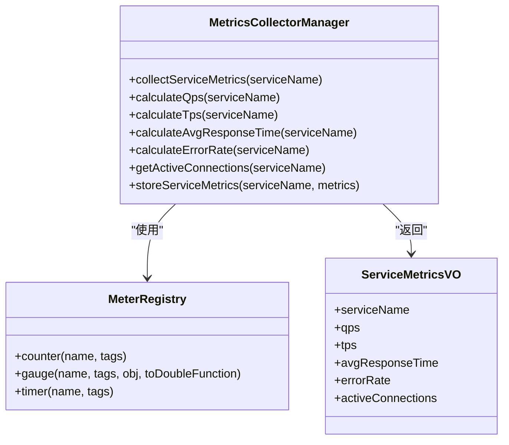
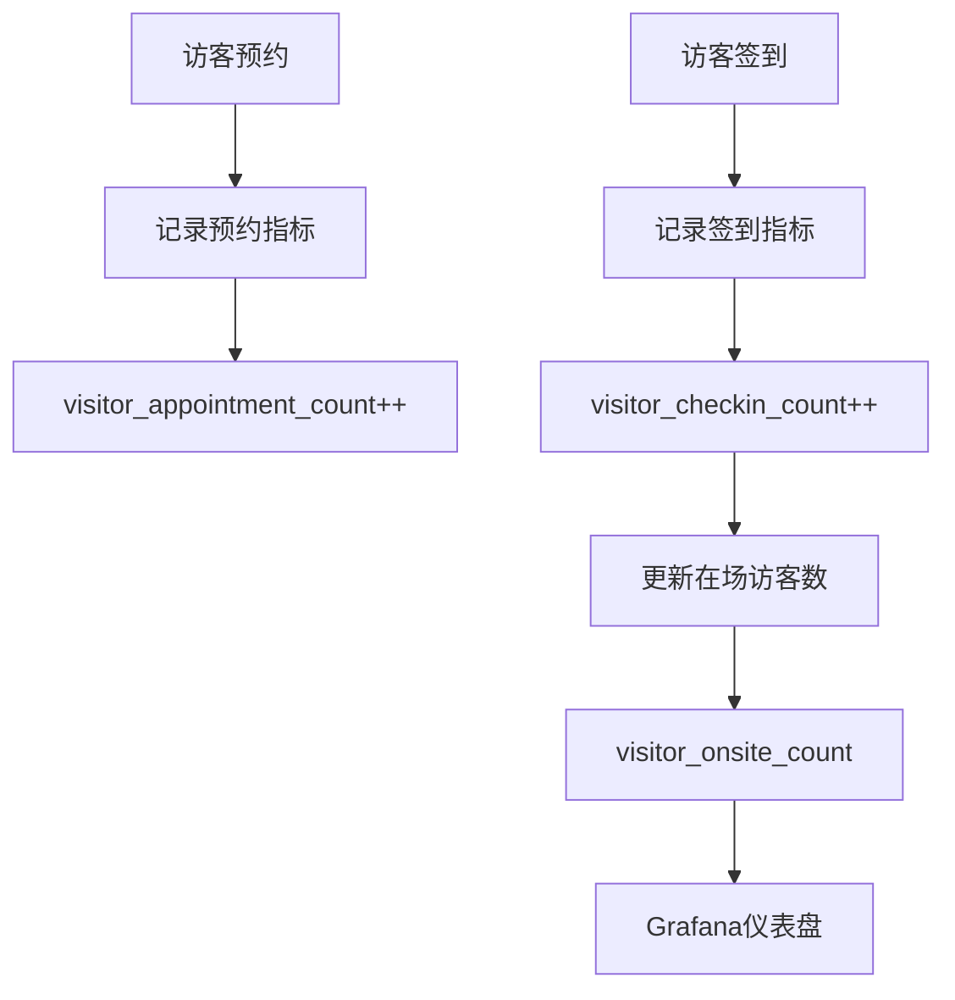
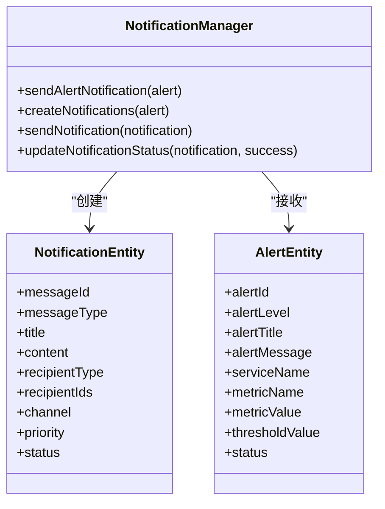
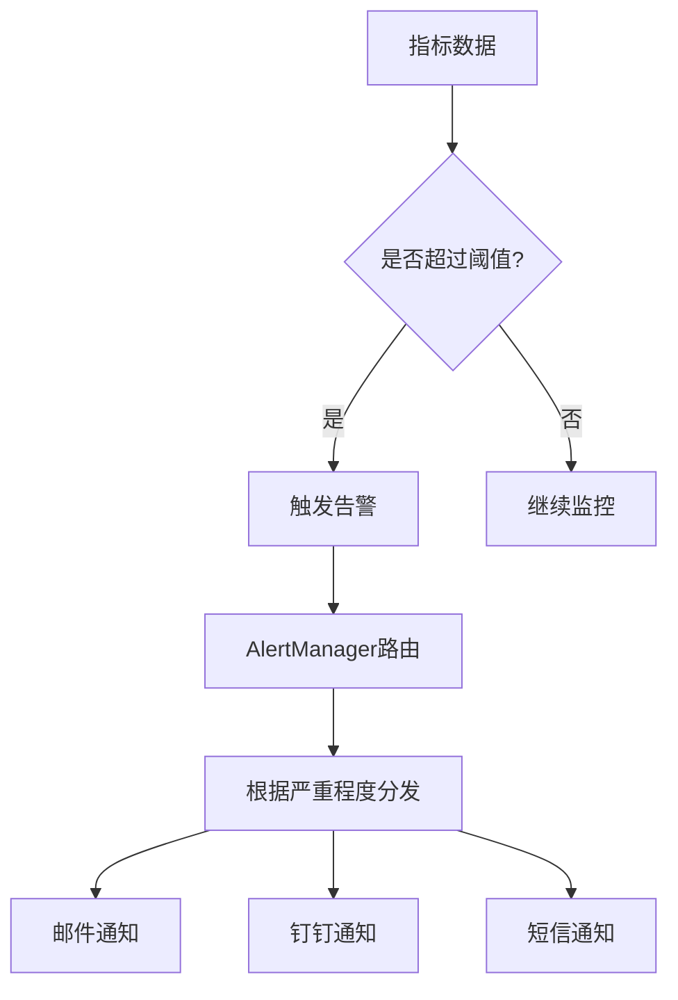
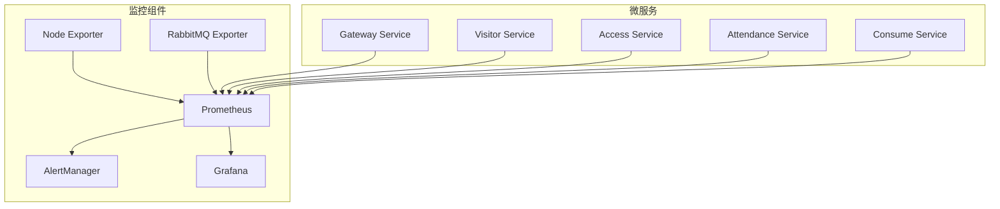

# 系统监控与告警

<cite>
**本文档引用文件**   
- [docker-compose-monitoring.yml](file://deployment/monitoring/docker-compose-monitoring.yml)
- [prometheus.yml](file://deployment/monitoring/prometheus/prometheus.yml)
- [alertmanager.yml](file://deployment/monitoring/alertmanager/alertmanager.yml)
- [protocol_alerts.yml](file://deployment/monitoring/prometheus/rules/protocol_alerts.yml)
- [application-monitoring.yml](file://microservices/ioedream-gateway-service/src/main/resources/application-monitoring.yml)
- [MetricsCollectorManager.java](file://microservices/microservices-common/src/main/java/net/lab1024/sa/common/monitor/manager/MetricsCollectorManager.java)
- [AlertServiceImpl.java](file://microservices/microservices-common/src/main/java/net/lab1024/sa/common/monitor/service/impl/AlertServiceImpl.java)
- [NotificationManager.java](file://microservices/microservices-common/src/main/java/net/lab1024/sa/common/monitor/manager/NotificationManager.java)
- [t_alert.sql](file://database-scripts/common-service/11-t_alert.sql)
- [t_notification_message.sql](file://database-scripts/common-service/07-t_notification_message.sql)
- [t_notification_config.sql](file://database-scripts/common-service/09-t_notification_config.sql)
- [visitor-module-architecture.md](file://documentation/03-业务模块/访客/visitor-module-architecture.md)
- [门禁服务监控告警机制.md](file://documentation/04-部署运维/门禁服务监控告警机制.md)
</cite>

## 目录
1. [引言](#引言)
2. [实时性能监控实现方案](#实时性能监控实现方案)
3. [业务监控指标体系](#业务监控指标体系)
4. [多渠道告警通知机制](#多渠道告警通知机制)
5. [告警规则配置](#告警规则配置)
6. [监控系统架构](#监控系统架构)
7. [数据库表结构](#数据库表结构)
8. [总结](#总结)

## 引言

本系统监控与告警文档详细说明了访客系统中监控与告警的实现方案。系统采用Micrometer和Prometheus技术栈实现全面的监控能力，涵盖了API响应时间、数据同步吞吐量、系统资源使用率等关键性能指标的收集与分析。通过集成Prometheus、AlertManager和Grafana，构建了完整的监控告警体系。

系统实现了多层次的监控指标体系，包括系统级指标、应用级指标和业务级指标。系统级指标关注CPU、内存、磁盘等基础设施资源使用情况；应用级指标监控各微服务的健康状态、请求量、响应时间等；业务级指标则聚焦于访客预约数、签到数、在场访客数等核心业务数据。

告警系统支持多渠道通知，包括邮件、短信、企业微信、钉钉等，确保关键告警能够及时触达相关人员。通过灵活的告警路由配置，不同严重程度的告警可以发送到不同的接收组，实现精细化的告警管理。

**Section sources**
- [docker-compose-monitoring.yml](file://deployment/monitoring/docker-compose-monitoring.yml)
- [prometheus.yml](file://deployment/monitoring/prometheus/prometheus.yml)
- [alertmanager.yml](file://deployment/monitoring/alertmanager/alertmanager.yml)

## 实时性能监控实现方案

### 监控技术栈集成

系统采用Micrometer作为度量库，与Spring Boot Actuator集成，实现对应用性能指标的自动收集。Micrometer提供了与Prometheus的原生集成，能够将应用指标暴露为Prometheus可抓取的格式。Prometheus作为监控数据收集和存储的核心组件，定期从各个微服务的`/actuator/prometheus`端点抓取指标数据。

在`application-monitoring.yml`配置文件中，系统配置了Micrometer的详细参数，包括采集间隔（step: 10s）、百分位统计（P50, P90, P95, P99）以及SLA边界（10ms, 50ms, 100ms, 200ms, 500ms, 1s, 2s）等。这些配置确保了监控数据的精细度和实用性。

```mermaid
graph TD
A[微服务应用] --> |暴露指标| B[/actuator/prometheus]
B --> C[Prometheus]
C --> |抓取| D[指标数据]
D --> E[Grafana]
E --> F[可视化仪表盘]
C --> |触发告警| G[AlertManager]
G --> H[多渠道通知]
```

**Diagram sources**
- [application-monitoring.yml](file://microservices/ioedream-gateway-service/src/main/resources/application-monitoring.yml)
- [prometheus.yml](file://deployment/monitoring/prometheus/prometheus.yml)

### 性能指标收集方法

系统通过Micrometer收集多种类型的性能指标：

1. **计数器（Counter）**：用于记录累计值，如HTTP请求总数、错误请求数等。
2. **仪表（Gauge）**：用于记录瞬时值，如当前在线用户数、内存使用量等。
3. **计时器（Timer）**：用于记录事件的持续时间分布，如API响应时间。
4. **直方图（Histogram）**：用于记录数值的分布情况，如请求处理时间的分布。

在`MetricsCollectorManager.java`中，系统实现了服务指标的采集逻辑，包括QPS（每秒请求数）、TPS（每秒事务数）、平均响应时间、错误率和活跃连接数等关键性能指标。这些指标通过MeterRegistry进行管理，并可以存储到Redis中以供后续分析。



**Diagram sources**
- [MetricsCollectorManager.java](file://microservices/microservices-common/src/main/java/net/lab1024/sa/common/monitor/manager/MetricsCollectorManager.java)

**Section sources**
- [MetricsCollectorManager.java](file://microservices/microservices-common/src/main/java/net/lab1024/sa/common/monitor/manager/MetricsCollectorManager.java)
- [application-monitoring.yml](file://microservices/ioedream-gateway-service/src/main/resources/application-monitoring.yml)

## 业务监控指标体系

### 访客业务指标

系统为访客模块定义了专门的业务监控指标，全面反映访客系统的运行状态和业务健康度。这些指标通过Micrometer的自定义指标功能实现，主要包括：

- **访客预约数**（visitor_appointment_count）：记录访客预约的总数，用于监控预约业务的活跃度。
- **访客签到数**（visitor_checkin_count）：记录访客签到的总数，反映实际到访情况。
- **当前在场访客数**（visitor_onsite_count）：实时统计当前在场的访客数量，用于安全管理和资源规划。

这些指标在`application-monitoring.yml`配置文件中进行了定义，并通过Grafana进行可视化展示。通过监控这些业务指标，运营团队可以及时了解访客流量趋势，优化接待流程。



**Diagram sources**
- [application-monitoring.yml](file://microservices/ioedream-gateway-service/src/main/resources/application-monitoring.yml)

### 其他业务模块指标

除了访客模块，系统还为其他业务模块定义了相应的监控指标：

- **门禁模块**：门禁通行总数、门禁通行成功率、门禁响应时间等。
- **考勤模块**：考勤打卡总数、迟到人数、请假人数等。
- **消费模块**：消费交易总数、消费金额总计、平均消费金额、消费成功率等。

这些指标共同构成了系统的业务监控指标体系，为各业务线的运营分析提供了数据支持。通过跨模块的指标对比，管理层可以全面了解各业务的运行状况，做出科学的决策。

**Section sources**
- [application-monitoring.yml](file://microservices/ioedream-gateway-service/src/main/resources/application-monitoring.yml)
- [visitor-module-architecture.md](file://documentation/03-业务模块/访客/visitor-module-architecture.md)

## 多渠道告警通知机制

### 通知渠道配置

系统支持多种告警通知渠道，包括邮件、短信、Webhook和微信。这些渠道的配置信息存储在`t_notification_config`表中，通过`config_key`和`config_value`键值对的形式管理。配置支持加密存储，确保敏感信息（如API密钥）的安全性。

在`NotificationManager.java`中，系统实现了通知发送的核心逻辑。通过策略模式，系统可以根据不同的渠道类型调用相应的发送实现。通知发送采用异步处理，确保不会影响主业务流程的性能。



**Diagram sources**
- [NotificationManager.java](file://microservices/microservices-common/src/main/java/net/lab1024/sa/common/monitor/manager/NotificationManager.java)
- [t_notification_message.sql](file://database-scripts/common-service/07-t_notification_message.sql)

### 通知发送流程

告警通知的发送流程如下：

1. 当Prometheus检测到指标超过阈值时，触发告警并发送给AlertManager。
2. AlertManager根据预定义的路由规则，将告警分发给相应的接收器。
3. 接收器调用系统的告警服务API，创建告警记录。
4. 系统根据告警规则和配置，创建相应的通知记录。
5. 通知管理器异步发送通知到各个渠道。

在`alertmanager.yml`配置文件中，系统定义了多个接收器，包括默认接收器、严重告警接收器、协议服务接收器和系统告警接收器。严重告警会同时通过邮件和钉钉通知，确保关键问题能够及时得到处理。

**Section sources**
- [NotificationManager.java](file://microservices/microservices-common/src/main/java/net/lab1024/sa/common/monitor/manager/NotificationManager.java)
- [alertmanager.yml](file://deployment/monitoring/alertmanager/alertmanager.yml)

## 告警规则配置

### 系统级告警规则

系统配置了多种系统级告警规则，用于监控基础设施和应用的健康状态。这些规则定义在`application-monitoring.yml`文件中，主要包括：

- **高CPU使用率**：当系统CPU使用率超过80%持续5分钟时触发警告。
- **高内存使用率**：当JVM内存使用率超过85%持续5分钟时触发警告。
- **高GC时间**：当GC暂停时间超过1秒持续1分钟时触发严重告警。
- **数据库连接池使用率**：当数据库连接池使用率超过90%持续5分钟时触发严重告警。

这些告警规则帮助运维团队及时发现系统性能瓶颈，预防服务中断。

### 业务级告警规则

除了系统级告警，系统还定义了业务级告警规则，用于监控核心业务的健康度：

- **低门禁通行成功率**：当门禁通行成功率低于95%持续10分钟时触发警告。
- **高消费失败率**：当消费失败率超过5%持续5分钟时触发警告。
- **慢API响应**：当API P99响应时间超过2秒持续5分钟时触发警告。

这些业务级告警确保了核心业务功能的稳定运行，一旦出现异常，相关团队可以立即介入处理。



**Diagram sources**
- [application-monitoring.yml](file://microservices/ioedream-gateway-service/src/main/resources/application-monitoring.yml)

**Section sources**
- [application-monitoring.yml](file://microservices/ioedream-gateway-service/src/main/resources/application-monitoring.yml)
- [protocol_alerts.yml](file://deployment/monitoring/prometheus/rules/protocol_alerts.yml)

## 监控系统架构

### 组件架构

系统的监控架构由多个组件构成，各司其职：

- **Prometheus**：负责指标的收集、存储和查询。
- **AlertManager**：负责告警的去重、分组和路由。
- **Grafana**：负责指标的可视化展示。
- **Node Exporter**：负责主机系统指标的收集。
- **RabbitMQ Exporter**：负责消息队列指标的收集。

在`docker-compose-monitoring.yml`文件中，这些组件被定义为Docker服务，通过Docker Compose进行统一管理。服务之间通过`ioedream-network`网络进行通信，确保了组件间的网络连通性。



**Diagram sources**
- [docker-compose-monitoring.yml](file://deployment/monitoring/docker-compose-monitoring.yml)

### 数据流架构

监控系统的数据流如下：

1. 各微服务通过Spring Boot Actuator暴露`/actuator/prometheus`端点。
2. Prometheus定期从这些端点抓取指标数据。
3. Prometheus根据预定义的告警规则评估指标，触发告警时发送给AlertManager。
4. AlertManager根据路由规则将告警分发给相应的接收器。
5. Grafana从Prometheus查询数据，生成可视化仪表盘。

这种架构实现了监控数据的自动收集和告警的自动化处理，大大提高了系统的可观测性和故障响应速度。

**Section sources**
- [docker-compose-monitoring.yml](file://deployment/monitoring/docker-compose-monitoring.yml)
- [prometheus.yml](file://deployment/monitoring/prometheus/prometheus.yml)

## 数据库表结构

### 告警表（t_alert）

`t_alert`表用于存储告警记录，其主要字段包括：

- `alert_id`：告警ID，主键。
- `alert_level`：告警级别，包括INFO、WARNING、ERROR、CRITICAL。
- `alert_title`：告警标题。
- `alert_message`：告警消息。
- `service_name`：服务名称。
- `metric_name`：监控指标名称。
- `metric_value`：指标值。
- `threshold_value`：阈值。
- `status`：状态，包括ACTIVE、RESOLVED、SUPPRESSED。
- `create_time`：创建时间。

该表通过索引优化了按告警级别、服务名称、状态和创建时间的查询性能。

### 通知消息表（t_notification_message）

`t_notification_message`表用于存储通知消息，其主要字段包括：

- `message_id`：消息ID，主键。
- `message_type`：消息类型，包括系统通知、业务通知、告警通知。
- `title`：消息标题。
- `content`：消息内容。
- `recipient_type`：接收人类型，包括指定用户、角色、部门、全体。
- `recipient_ids`：接收人ID列表（JSON数组）。
- `channel`：发送渠道，包括站内信、邮件、短信、微信、推送。
- `priority`：优先级，包括低、普通、高、紧急。
- `status`：状态，包括待发送、发送中、已发送、发送失败。

### 通知配置表（t_notification_config）

`t_notification_config`表用于存储通知渠道的配置信息，其主要字段包括：

- `config_id`：配置ID，主键。
- `config_key`：配置键，唯一索引。
- `config_value`：配置值。
- `config_type`：配置类型，包括EMAIL、SMS、WECHAT、PUSH。
- `is_encrypted`：是否加密。

**Section sources**
- [t_alert.sql](file://database-scripts/common-service/11-t_alert.sql)
- [t_notification_message.sql](file://database-scripts/common-service/07-t_notification_message.sql)
- [t_notification_config.sql](file://database-scripts/common-service/09-t_notification_config.sql)

## 总结

本系统通过集成Micrometer和Prometheus，构建了全面的监控与告警体系。系统不仅监控了API响应时间、数据同步吞吐量、系统资源使用率等技术指标，还定义了访客预约数、签到数、在场访客数等业务指标，实现了技术与业务的深度融合。

告警系统支持邮件、短信、企业微信、钉钉等多渠道通知，通过灵活的路由配置，确保了告警信息能够及时触达相关人员。系统的监控架构清晰，组件职责明确，数据流顺畅，为系统的稳定运行提供了有力保障。

未来，系统可以进一步引入AI分析，实现智能告警和根因分析，提高故障诊断的效率。同时，可以加强监控数据的分析和挖掘，为业务决策提供更深入的数据支持。