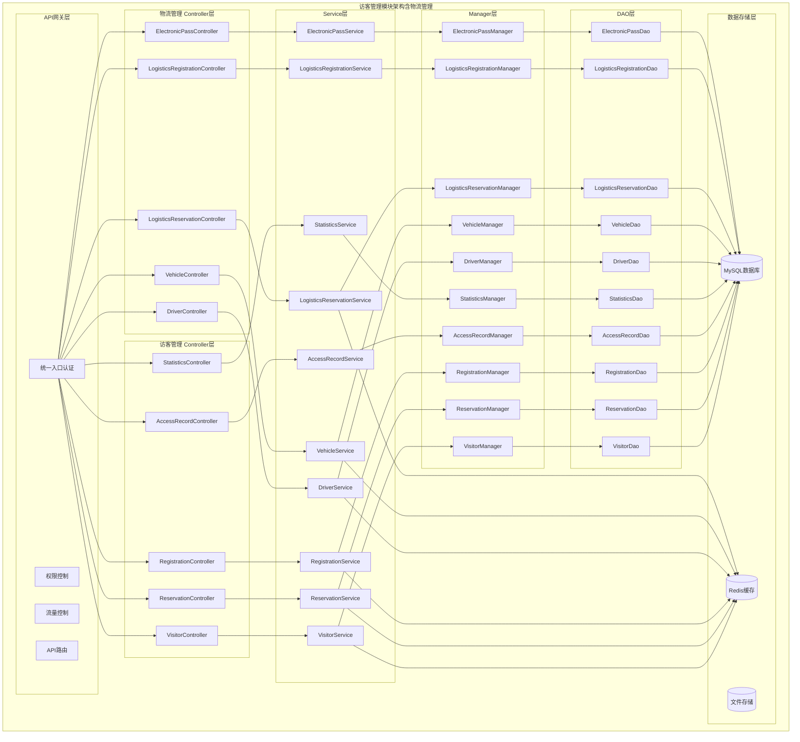
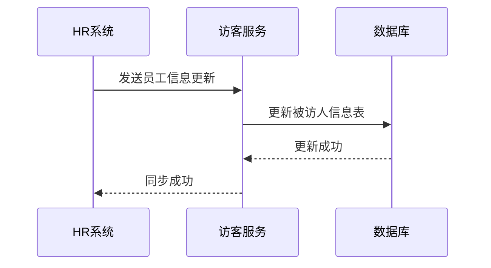
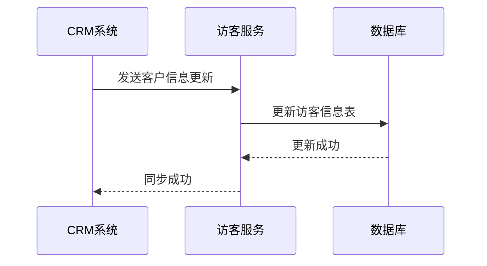
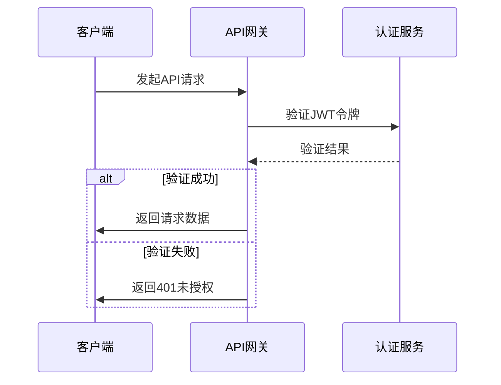
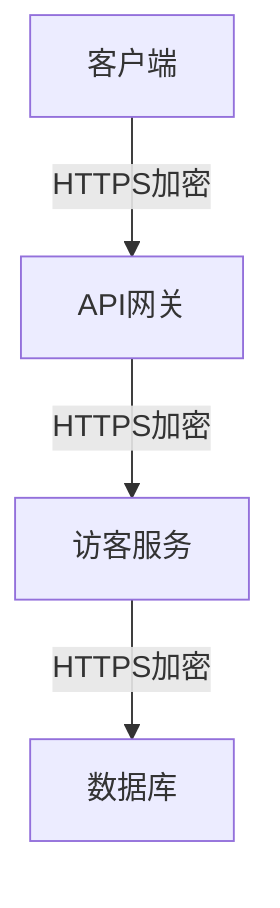
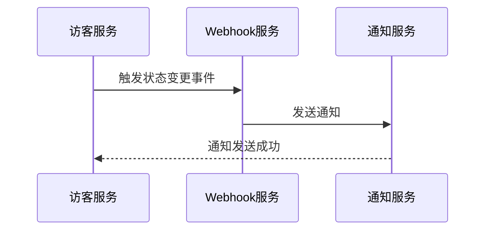
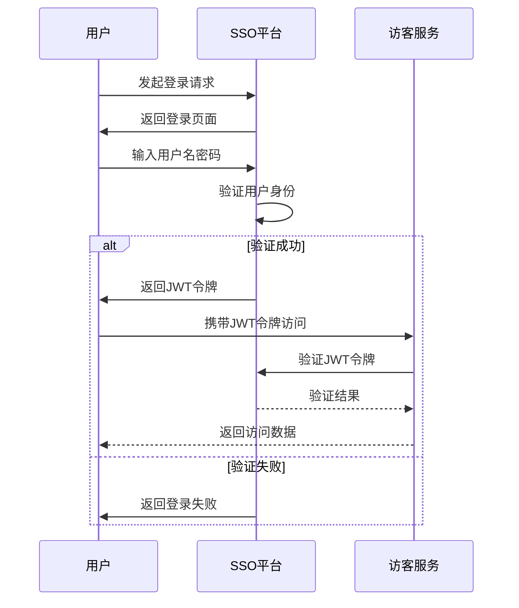
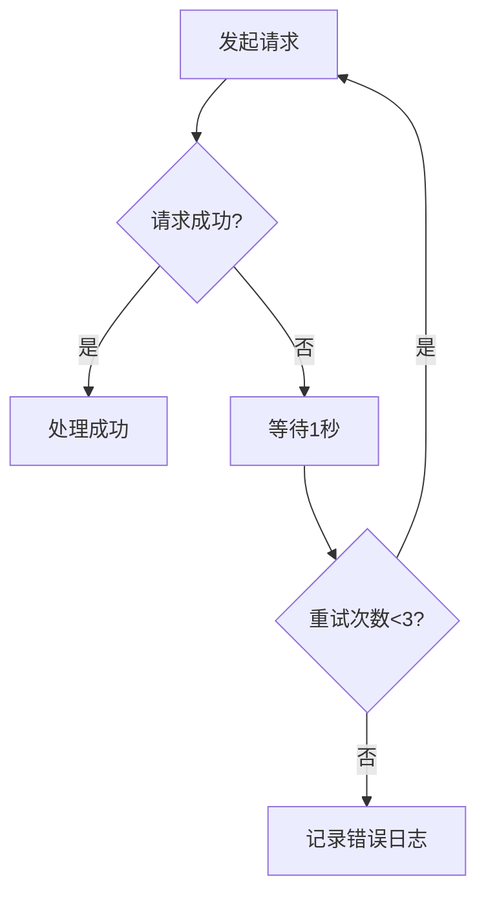

# 系统集成

<cite>
**本文档引用文件**
- [visitor-module-architecture.md](file://docs\各业务模块文档\访客\visitor-module-architecture.md)
- [database_dictionary.md](file://docs\各业务模块文档\访客\database_dictionary.md)
- [12-前端API接口设计.md](file://documentation\03-业务模块\访客\12-前端API接口设计.md)
- [visitor-module-architecture.md](file://documentation\03-业务模块\访客\visitor-module-architecture.md)
- [database_dictionary.md](file://documentation\03-业务模块\访客\database_dictionary.md)
</cite>

## 目录
1. [引言](#引言)
2. [系统架构与数据模型](#系统架构与数据模型)
3. [第三方系统数据同步](#第三方系统数据同步)
4. [身份验证与安全认证](#身份验证与安全认证)
5. [Webhook事件与实时通知](#webhook事件与实时通知)
6. [单点登录（SSO）集成](#单点登录（sso）集成)
7. [错误处理与重试机制](#错误处理与重试机制)
8. [总结](#总结)

## 引言
本文档旨在为IOE-DREAM智能访客管理系统提供全面的系统集成指南。文档详细阐述了如何与HR系统、CRM系统等第三方系统进行数据同步和身份验证，解释了API接口的安全认证机制和数据加密传输方法，提供了Webhook事件的配置和使用指南，展示了单点登录（SSO）的集成方案和实施步骤，并包含了错误处理和重试机制的设计说明。

**Section sources**
- [visitor-module-architecture.md](file://docs\各业务模块文档\访客\visitor-module-architecture.md)

## 系统架构与数据模型

### 整体架构设计
访客管理系统采用微服务架构，遵循四层架构规范：Controller层、Service层、Manager层和DAO层。系统通过API网关统一入口，实现权限控制、流量控制和API路由。



**Diagram sources**
- [visitor-module-architecture.md](file://docs\各业务模块文档\访客\visitor-module-architecture.md)

### 核心数据表设计
访客管理系统的核心数据表包括访客信息表、被访人信息表、区域管理表、访客权限级别表、访客预约表、访客登记表、通行记录表和访客统计表。

**Section sources**
- [visitor-module-architecture.md](file://docs\各业务模块文档\访客\visitor-module-architecture.md)

## 第三方系统数据同步

### 与HR系统同步
访客管理系统通过API接口与HR系统进行数据同步，获取员工信息作为被访人信息。



**Diagram sources**
- [visitor-module-architecture.md](file://docs\各业务模块文档\访客\visitor-module-architecture.md)

### 与CRM系统同步
访客管理系统通过API接口与CRM系统进行数据同步，获取客户信息作为访客信息。



**Diagram sources**
- [visitor-module-architecture.md](file://docs\各业务模块文档\访客\visitor-module-architecture.md)

## 身份验证与安全认证

### API接口安全认证
访客管理系统采用Sa-Token + JWT进行API接口安全认证，确保接口调用的安全性。



**Diagram sources**
- [12-前端API接口设计.md](file://documentation\03-业务模块\访客\12-前端API接口设计.md)

### 数据加密传输
访客管理系统采用HTTPS协议进行数据加密传输，确保数据在传输过程中的安全性。



**Diagram sources**
- [12-前端API接口设计.md](file://documentation\03-业务模块\访客\12-前端API接口设计.md)

## Webhook事件与实时通知

### Webhook事件配置
访客管理系统支持Webhook事件，用于实时通知访客状态变更。



**Diagram sources**
- [12-前端API接口设计.md](file://documentation\03-业务模块\访客\12-前端API接口设计.md)

### 实时通知消息类型
访客管理系统支持多种实时通知消息类型，包括预约状态变更通知、访客到达通知、访客离开通知和紧急告警通知。

```json
{
  "type": "APPOINTMENT_STATUS_CHANGE",
  "timestamp": 1640995200000,
  "data": {
    "appointmentId": 20240115001,
    "appointmentNo": "VISIT-20240115-001",
    "oldStatus": "PENDING_APPROVAL",
    "newStatus": "APPROVED",
    "visitorName": "李四",
    "hostName": "张三",
    "approverName": "李经理",
    "approvalTime": "2024-01-10 16:45:00",
    "message": "您的访客预约已获批准"
  }
}
```

**Section sources**
- [12-前端API接口设计.md](file://documentation\03-业务模块\访客\12-前端API接口设计.md)

## 单点登录（SSO）集成

### SSO集成方案
访客管理系统支持单点登录（SSO）集成，用户可以通过统一身份认证平台登录系统。



**Diagram sources**
- [12-前端API接口设计.md](file://documentation\03-业务模块\访客\12-前端API接口设计.md)

### 实施步骤
1. 配置SSO平台，创建访客管理系统应用。
2. 在访客管理系统中配置SSO认证信息。
3. 实现SSO登录接口，处理JWT令牌验证。
4. 测试SSO集成，确保用户可以正常登录。

**Section sources**
- [12-前端API接口设计.md](file://documentation\03-业务模块\访客\12-前端API接口设计.md)

## 错误处理与重试机制

### 错误处理设计
访客管理系统采用统一的错误处理机制，返回标准化的错误码和错误信息。

| 错误码 | 说明 | HTTP状态码 |
|--------|------|-----------|
| 40100 | 未登录或token失效 | 401 |
| 40300 | 权限不足 | 403 |
| 40400 | 资源不存在 | 404 |
| 40900 | 访客时间冲突 | 409 |
| 42300 | 访客配额已满 | 423 |
| 42900 | 请求过于频繁 | 429 |
| 50000 | 服务器内部错误 | 500 |
| 70101 | 访客不存在 | 400 |
| 70102 | 访客已过期 | 400 |
| 70103 | 验证失败 | 400 |
| 70104 | 预约时间冲突 | 400 |
| 70105 | 访客被禁止 | 400 |
| 70106 | 生物特征不匹配 | 400 |

**Section sources**
- [12-前端API接口设计.md](file://documentation\03-业务模块\访客\12-前端API接口设计.md)

### 重试机制设计
访客管理系统在调用第三方系统接口时，采用重试机制，确保数据同步的可靠性。



**Diagram sources**
- [12-前端API接口设计.md](file://documentation\03-业务模块\访客\12-前端API接口设计.md)

## 总结
本文档详细介绍了IOE-DREAM智能访客管理系统的系统集成方案，包括与第三方系统的数据同步、身份验证与安全认证、Webhook事件与实时通知、单点登录（SSO）集成以及错误处理与重试机制。通过本文档，开发人员可以快速了解和实现访客管理系统的各项集成功能。

**Section sources**
- [visitor-module-architecture.md](file://docs\各业务模块文档\访客\visitor-module-architecture.md)
- [12-前端API接口设计.md](file://documentation\03-业务模块\访客\12-前端API接口设计.md)