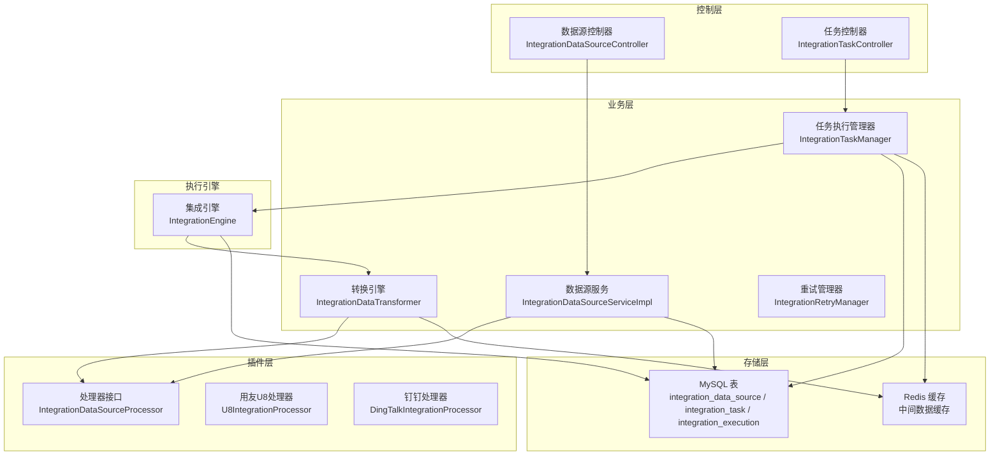
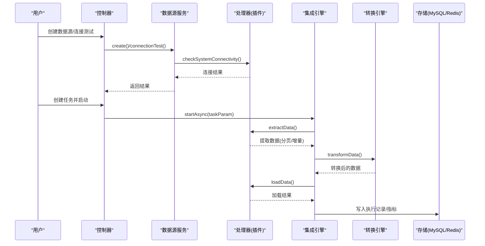
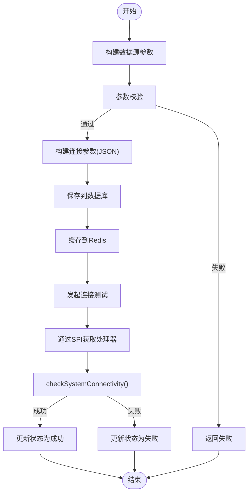
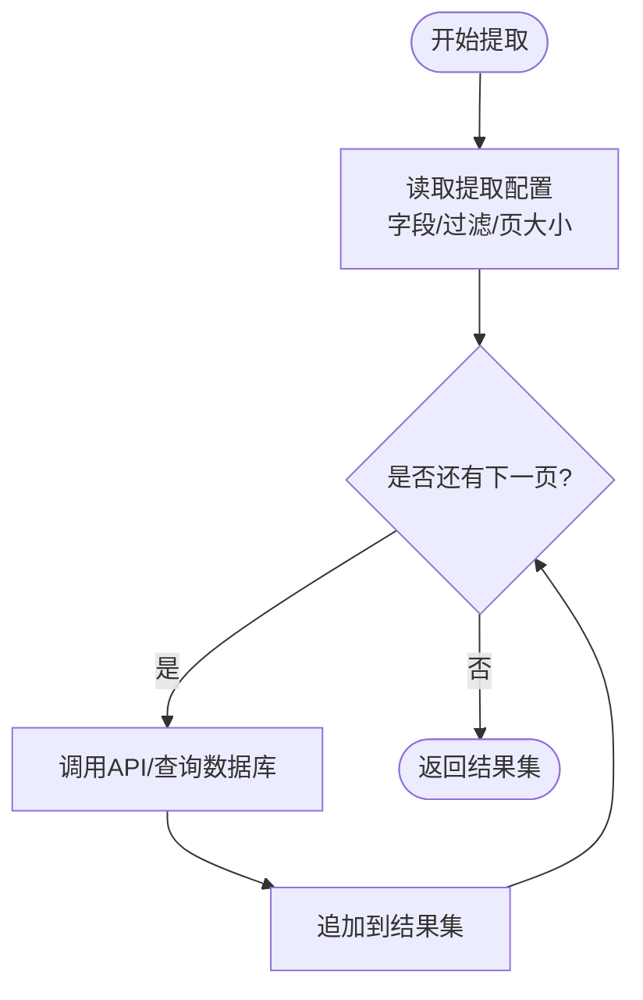
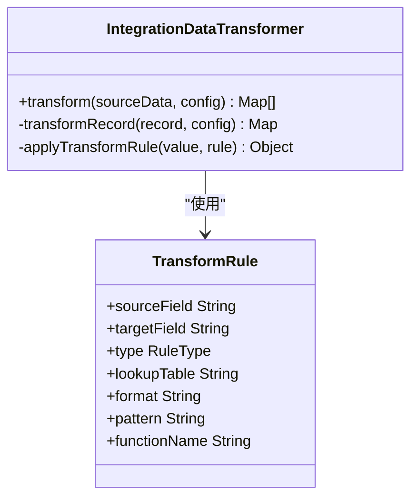
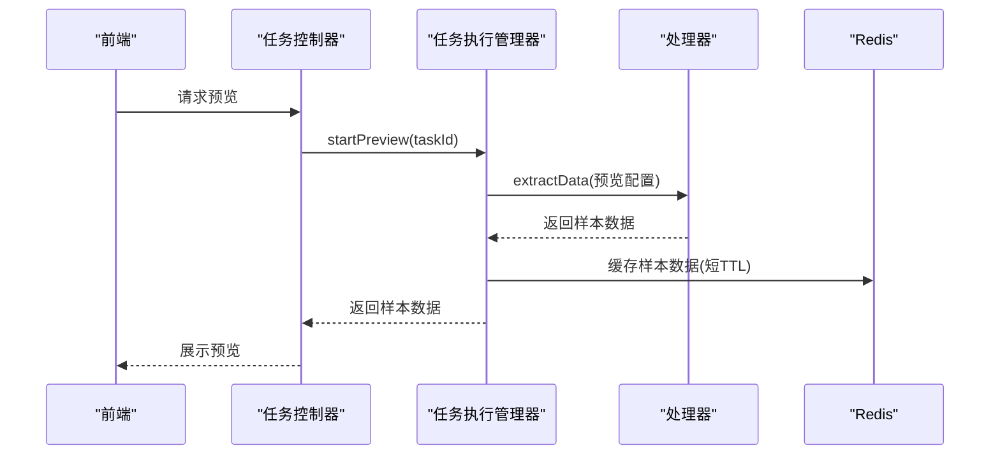
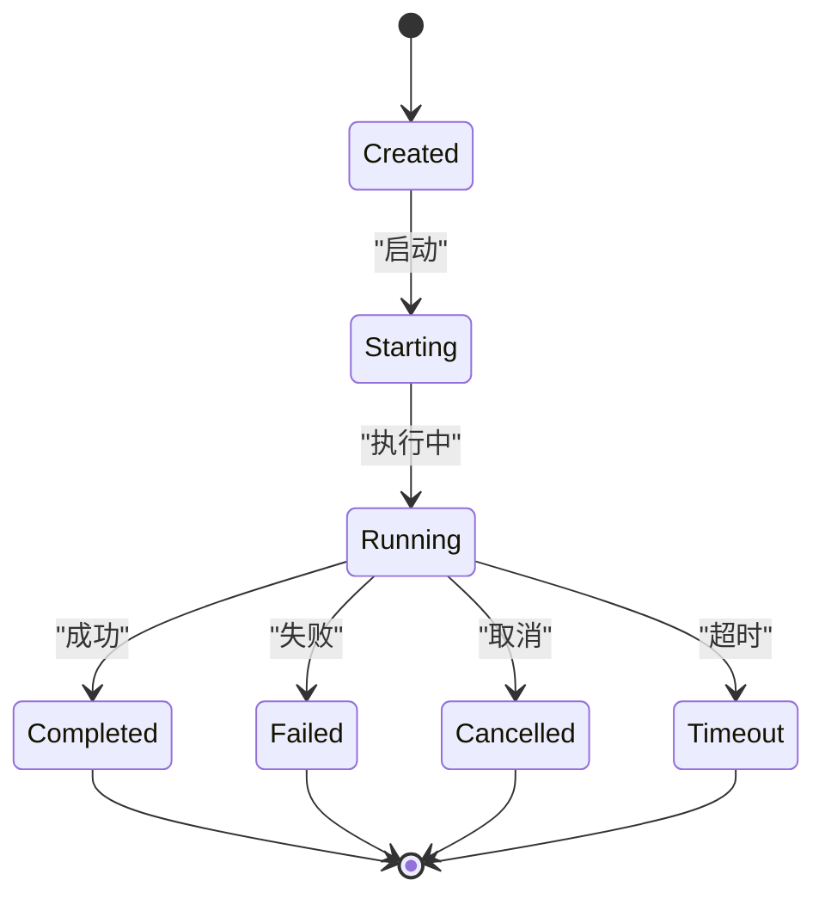

# 数据提取

<cite>
**本文引用的文件**
- [第三方系统集成实现方案.md](file://documentation/03-业务模块/第三方系统集成实现方案.md)
- [DRUID_CONNECTION_POOL_CONFIGURATION.md](file://documentation/deployment/DRUID_CONNECTION_POOL_CONFIGURATION.md)
- [RUNTIME_VERIFICATION_GUIDE.md](file://documentation/technical/RUNTIME_VERIFICATION_GUIDE.md)
- [fix-hikari-to-druid.ps1](file://scripts/fix-hikari-to-druid.ps1)
- [PHASE3_PERFORMANCE_OPTIMIZATION_CHECK.md](file://documentation/archive/reports-2025-12-04/PHASE3_PERFORMANCE_OPTIMIZATION_CHECK.md)
- [DatabaseIndexAnalyzer.java](file://microservices/ioedream-consume-service/src/main/java/net/lab1024/sa/consume/util/DatabaseIndexAnalyzer.java)
</cite>

## 目录
1. [简介](#简介)
2. [项目结构](#项目结构)
3. [核心组件](#核心组件)
4. [架构总览](#架构总览)
5. [详细组件分析](#详细组件分析)
6. [依赖分析](#依赖分析)
7. [性能考量](#性能考量)
8. [故障排查指南](#故障排查指南)
9. [结论](#结论)
10. [附录](#附录)

## 简介
本文件面向“数据提取模块”的开发与使用，围绕以下目标展开：
- 如何配置数据源连接（数据库、API、文件等）
- 连接池管理与连接测试机制
- 查询语句或API调用的动态生成逻辑，支持分页与增量提取
- 字段映射配置界面的使用方法（源字段与目标字段的匹配规则）
- 数据预览功能的技术实现思路，确保提取数据的准确性和完整性

本说明严格基于仓库内的实现与文档，避免臆测，所有技术细节均以代码与文档为准。

## 项目结构
数据提取模块位于“第三方系统集成”能力中，采用“插件化 + 引擎 + 任务编排”的架构：
- 控制层：提供数据源创建、连接测试、任务创建与启动等接口
- 业务层：封装数据源服务、任务执行管理、转换引擎、重试与监控
- 插件层：基于SPI机制的第三方系统处理器（如ERP、HR、OA、支付等）
- 执行引擎：异步任务执行、状态管理、指标采集
- 存储层：MySQL持久化任务与执行记录，Redis缓存中间数据

图表来源
- [第三方系统集成实现方案.md](file://documentation/03-业务模块/第三方系统集成实现方案.md#L210-L283)
- [第三方系统集成实现方案.md](file://documentation/03-业务模块/第三方系统集成实现方案.md#L309-L383)
- [第三方系统集成实现方案.md](file://documentation/03-业务模块/第三方系统集成实现方案.md#L385-L508)
- [第三方系统集成实现方案.md](file://documentation/03-业务模块/第三方系统集成实现方案.md#L606-L744)
- [第三方系统集成实现方案.md](file://documentation/03-业务模块/第三方系统集成实现方案.md#L1285-L1331)

章节来源
- [第三方系统集成实现方案.md](file://documentation/03-业务模块/第三方系统集成实现方案.md#L113-L193)

## 核心组件
- 数据源服务：负责数据源创建、连接测试、参数校验与缓存
- 任务执行管理器：负责任务生命周期、SAGA编排、异步执行、状态回调
- 插件处理器接口：抽象第三方系统连接、提取、加载、元数据查询与配置生成
- 集成引擎：异步任务执行、线程池管理、任务历史与回调
- 转换引擎：字段映射、查找映射、格式化、过滤规则
- 重试与监控：基于注解的重试策略与指标采集

章节来源
- [第三方系统集成实现方案.md](file://documentation/03-业务模块/第三方系统集成实现方案.md#L309-L383)
- [第三方系统集成实现方案.md](file://documentation/03-业务模块/第三方系统集成实现方案.md#L385-L508)
- [第三方系统集成实现方案.md](file://documentation/03-业务模块/第三方系统集成实现方案.md#L578-L603)
- [第三方系统集成实现方案.md](file://documentation/03-业务模块/第三方系统集成实现方案.md#L606-L744)
- [第三方系统集成实现方案.md](file://documentation/03-业务模块/第三方系统集成实现方案.md#L1404-L1464)
- [第三方系统集成实现方案.md](file://documentation/03-业务模块/第三方系统集成实现方案.md#L1514-L1549)

## 架构总览
数据提取的整体流程如下：
- 用户通过控制层创建数据源并测试连接
- 任务控制器创建集成任务，任务执行管理器启动异步执行
- 集成引擎按步骤执行：提取 → 转换 → 加载，并通过Redis缓存中间数据
- 转换引擎根据配置进行字段映射与过滤
- 重试管理器在提取阶段提供重试策略
- 监控指标对任务与系统连通性进行采集

图表来源
- [第三方系统集成实现方案.md](file://documentation/03-业务模块/第三方系统集成实现方案.md#L210-L283)
- [第三方系统集成实现方案.md](file://documentation/03-业务模块/第三方系统集成实现方案.md#L309-L383)
- [第三方系统集成实现方案.md](file://documentation/03-业务模块/第三方系统集成实现方案.md#L606-L744)
- [第三方系统集成实现方案.md](file://documentation/03-业务模块/第三方系统集成实现方案.md#L1404-L1464)
- [第三方系统集成实现方案.md](file://documentation/03-业务模块/第三方系统集成实现方案.md#L1514-L1549)

## 详细组件分析

### 数据源连接配置与测试
- 数据源创建：将用户输入的参数转换为内部参数，校验后构建连接参数，保存至数据库并缓存到Redis
- 连接测试：通过SPI获取对应处理器，调用其连接测试方法，更新连接状态
- 连接参数：以JSON形式存储在数据源实体中，便于后续提取/加载使用

图表来源
- [第三方系统集成实现方案.md](file://documentation/03-业务模块/第三方系统集成实现方案.md#L326-L383)

章节来源
- [第三方系统集成实现方案.md](file://documentation/03-业务模块/第三方系统集成实现方案.md#L210-L283)
- [第三方系统集成实现方案.md](file://documentation/03-业务模块/第三方系统集成实现方案.md#L309-L383)

### 连接池管理与连接测试机制
- 连接池类型：统一使用Druid连接池，配置项包括初始大小、最小空闲、最大活跃、等待时间、校验查询、空闲检测等
- 连接测试：在数据源服务中，通过处理器的连接测试方法判断第三方系统连通性
- 运行验证：提供脚本与指南，验证Druid监控页面、连接池配置与MySQL驱动版本

章节来源
- [DRUID_CONNECTION_POOL_CONFIGURATION.md](file://documentation/deployment/DRUID_CONNECTION_POOL_CONFIGURATION.md#L1-L200)
- [RUNTIME_VERIFICATION_GUIDE.md](file://documentation/technical/RUNTIME_VERIFICATION_GUIDE.md#L71-L128)
- [fix-hikari-to-druid.ps1](file://scripts/fix-hikari-to-druid.ps1#L1-L66)
- [PHASE3_PERFORMANCE_OPTIMIZATION_CHECK.md](file://documentation/archive/reports-2025-12-04/PHASE3_PERFORMANCE_OPTIMIZATION_CHECK.md#L29-L85)

### 查询语句或API调用的动态生成逻辑（含分页与增量）
- 动态生成：处理器接口定义了“提取配置”和“加载配置”，不同系统（如ERP、HR、OA、支付）在各自处理器中实现具体的API调用或数据库查询
- 分页支持：以用友U8处理器为例，通过“页码 + 页面大小”循环查询，直到结果不足一页为止
- 增量提取：可通过“过滤条件”或“时间戳游标”在提取配置中传入，由处理器在API或SQL中使用

图表来源
- [第三方系统集成实现方案.md](file://documentation/03-业务模块/第三方系统集成实现方案.md#L1624-L1643)
- [第三方系统集成实现方案.md](file://documentation/03-业务模块/第三方系统集成实现方案.md#L1691-L1731)

章节来源
- [第三方系统集成实现方案.md](file://documentation/03-业务模块/第三方系统集成实现方案.md#L1555-L1731)

### 字段映射配置界面使用方法
- 映射规则：转换引擎支持“直传映射”“查找映射”“日期/数字格式化”“自定义函数”等规则
- 配置结构：在任务的“转换配置”中定义规则数组，每条规则包含源字段、目标字段与规则类型
- 匹配规则：转换引擎按顺序应用规则，再执行过滤规则，最终输出目标记录

图表来源
- [第三方系统集成实现方案.md](file://documentation/03-业务模块/第三方系统集成实现方案.md#L1404-L1464)

章节来源
- [第三方系统集成实现方案.md](file://documentation/03-业务模块/第三方系统集成实现方案.md#L1404-L1464)
- [第三方系统集成实现方案.md](file://documentation/03-业务模块/第三方系统集成实现方案.md#L1691-L1731)

### 数据预览功能的技术实现思路
- 预览目标：在任务创建或配置阶段，允许用户预览从源系统提取的数据样例，核对字段映射与转换效果
- 实现路径：在任务执行管理器中增加“预览”步骤，调用处理器的提取方法，返回少量样本数据（如前100条），并在前端以表格形式展示
- 数据缓存：预览数据可临时缓存到Redis，设置较短TTL，避免长期占用
- 准确性与完整性：预览应包含字段映射后的结果，必要时提供“原始字段”与“映射后字段”的对比视图

说明：以上为概念性流程图，用于指导实现；具体预览接口与缓存策略需在任务执行管理器中新增相应步骤与缓存逻辑。

### 数据提取与加载的执行引擎
- 异步执行：集成引擎使用线程池异步执行任务，保存Future与回调，支持任务完成/失败回调
- 生命周期：任务状态机支持“已创建 → 启动中 → 运行中 → 已完成/失败/取消/超时”
- 执行步骤：提取 → 转换 → 加载，期间通过Redis缓存中间数据，便于重试与审计

图表来源
- [第三方系统集成实现方案.md](file://documentation/03-业务模块/第三方系统集成实现方案.md#L1335-L1359)
- [第三方系统集成实现方案.md](file://documentation/03-业务模块/第三方系统集成实现方案.md#L1361-L1403)

章节来源
- [第三方系统集成实现方案.md](file://documentation/03-业务模块/第三方系统集成实现方案.md#L606-L744)
- [第三方系统集成实现方案.md](file://documentation/03-业务模块/第三方系统集成实现方案.md#L1335-L1403)

## 依赖分析
- 技术栈与规范
  - Spring Boot 3.5 + Spring Cloud 2023
  - Jakarta EE 3.0+ 包名规范
  - Druid连接池统一配置
  - Nacos服务发现与配置中心
  - Prometheus + Micrometer监控
- 组件耦合
  - 控制层仅依赖业务层接口
  - 业务层通过SPI依赖插件层
  - 执行引擎与转换引擎相互独立，通过接口交互
  - 存储层通过MyBatis-Plus访问MySQL，Redis用于缓存

章节来源
- [第三方系统集成实现方案.md](file://documentation/03-业务模块/第三方系统集成实现方案.md#L1-L112)
- [DRUID_CONNECTION_POOL_CONFIGURATION.md](file://documentation/deployment/DRUID_CONNECTION_POOL_CONFIGURATION.md#L1-L200)
- [PHASE3_PERFORMANCE_OPTIMIZATION_CHECK.md](file://documentation/archive/reports-2025-12-04/PHASE3_PERFORMANCE_OPTIMIZATION_CHECK.md#L29-L85)

## 性能考量
- 连接池配置：合理设置初始大小、最小空闲、最大活跃与等待时间，启用空闲检测与校验查询
- 异步与批处理：利用线程池异步执行任务，按批次加载数据，降低阻塞
- 缓存策略：使用Redis缓存中间数据，缩短重复提取与转换的时间
- 监控与告警：通过Micrometer导出指标，结合Prometheus与告警规则，及时发现性能瓶颈

章节来源
- [DRUID_CONNECTION_POOL_CONFIGURATION.md](file://documentation/deployment/DRUID_CONNECTION_POOL_CONFIGURATION.md#L1-L200)
- [PHASE3_PERFORMANCE_OPTIMIZATION_CHECK.md](file://documentation/archive/reports-2025-12-04/PHASE3_PERFORMANCE_OPTIMIZATION_CHECK.md#L29-L85)
- [第三方系统集成实现方案.md](file://documentation/03-业务模块/第三方系统集成实现方案.md#L1466-L1513)

## 故障排查指南
- 连接池问题
  - 检查Druid配置是否正确，确认监控页面可用
  - 使用脚本将HikariCP替换为Druid
- 连接测试失败
  - 在数据源服务中查看连接测试流程与状态更新
  - 检查处理器的连接测试方法是否抛出异常
- 提取失败与重试
  - 查看重试管理器的重试策略与恢复逻辑
  - 核查任务执行记录与错误日志表
- 字段映射异常
  - 检查转换配置中的规则是否正确
  - 使用预览功能核对映射前后字段

章节来源
- [RUNTIME_VERIFICATION_GUIDE.md](file://documentation/technical/RUNTIME_VERIFICATION_GUIDE.md#L71-L128)
- [fix-hikari-to-druid.ps1](file://scripts/fix-hikari-to-druid.ps1#L1-L66)
- [第三方系统集成实现方案.md](file://documentation/03-业务模块/第三方系统集成实现方案.md#L309-L383)
- [第三方系统集成实现方案.md](file://documentation/03-业务模块/第三方系统集成实现方案.md#L1514-L1549)

## 结论
数据提取模块通过“插件化处理器 + 异步执行引擎 + 转换与重试机制 + 统一连接池”的设计，实现了对多种第三方系统的高效、稳定与可观测的数据同步。分页与增量提取通过配置与处理器实现，字段映射通过转换引擎灵活配置，预览功能可作为配置校验的重要手段。配合完善的监控与告警，能够有效保障生产环境的稳定性与可维护性。

## 附录
- 数据库字段映射分析工具：通过数据库元数据获取列名、类型与Java类型映射，辅助字段映射配置与一致性校验

章节来源
- [DatabaseIndexAnalyzer.java](file://microservices/ioedream-consume-service/src/main/java/net/lab1024/sa/consume/util/DatabaseIndexAnalyzer.java#L283-L323)