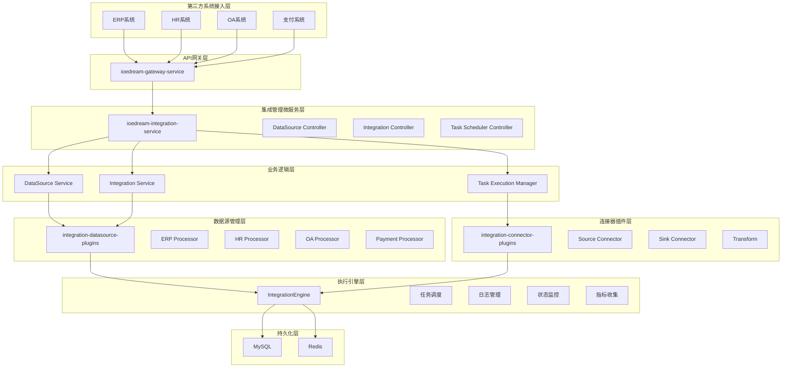
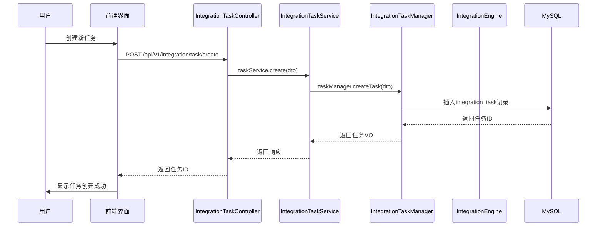
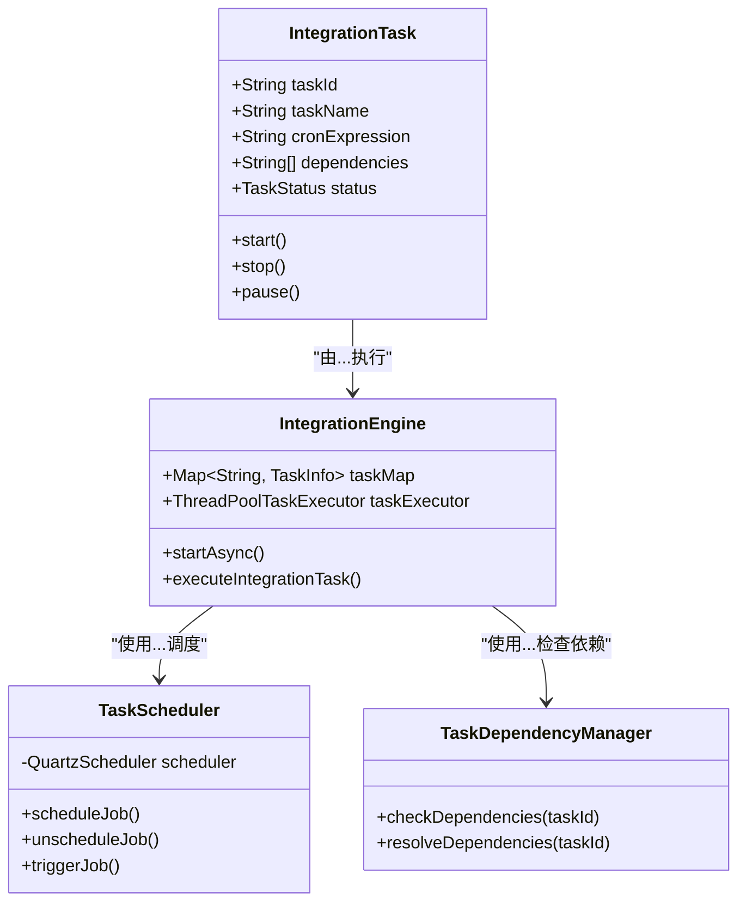
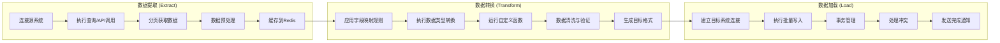
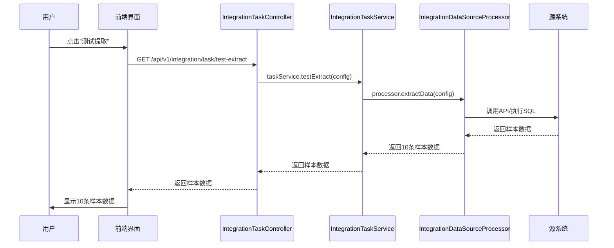
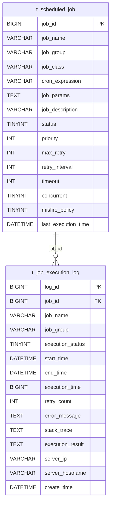

# 集成任务管理

<cite>
**本文档引用的文件**  
- [IntegrationTaskController.java](file://microservices/ioedream-integration-service/src/main/java/net/lab1024/sa/integration/controller/IntegrationTaskController.java)
- [IntegrationTaskManager.java](file://microservices/ioedream-integration-service/src/main/java/net/lab1024/sa/integration/service/IntegrationTaskManager.java)
- [IntegrationEngine.java](file://microservices/ioedream-integration-service/src/main/java/net/lab1024/sa/integration/engine/IntegrationEngine.java)
- [IntegrationDataSourceProcessor.java](file://microservices/ioedream-integration-service/src/main/java/net/lab1024/sa/integration/processor/IntegrationDataSourceProcessor.java)
- [t_scheduled_job.sql](file://database-scripts/common-service/14-t_scheduled_job.sql)
- [t_job_execution_log.sql](file://database-scripts/common-service/15-t_job_execution_log.sql)
- [第三方系统集成实现方案.md](file://documentation/03-业务模块/第三方系统集成实现方案.md)
- [design.md](file://openspec/changes/archive/completed-proposals/implement-third-party-system-integration/design.md)
- [tasks.md](file://openspec/changes/archive/completed-proposals/implement-third-party-system-integration/tasks.md)
- [spec.md](file://openspec/changes/archive/completed-proposals/implement-third-party-system-integration/specs/third-party-system-integration/spec.md)
</cite>

## 目录
1. [引言](#引言)
2. [系统架构与核心组件](#系统架构与核心组件)
3. [任务创建与管理](#任务创建与管理)
4. [任务模板与向导机制](#任务模板与向导机制)
5. [任务依赖与执行计划](#任务依赖与执行计划)
6. [ETL流程配置](#etl流程配置)
7. [任务执行预览与验证](#任务执行预览与验证)
8. [数据库设计](#数据库设计)

## 引言
本文档旨在详细说明IOE-DREAM系统中访客系统集成任务管理的功能。该系统提供了一套完整的解决方案，用于创建和管理与第三方系统的数据同步任务。通过可视化界面，用户可以轻松配置数据提取、转换和加载（ETL）流程，利用任务模板和向导简化复杂配置，并通过Quartz调度器实现精确的执行计划。文档将深入探讨任务依赖关系管理、执行计划调度、ETL各阶段的配置参数以及任务执行预览和完整性验证流程。

## 系统架构与核心组件

本文档描述的集成任务管理功能是IOE-DREAM智能管理系统的一部分，其核心是一个名为`ioedream-integration-service`的微服务。该服务严格遵循IOE-DREAM的四层架构规范（Controller→Service→Manager→DAO），并作为企业级开箱即用的第三方系统集成平台。



**Diagram sources**
- [第三方系统集成实现方案.md](file://documentation/03-业务模块/第三方系统集成实现方案.md)

**Section sources**
- [第三方系统集成实现方案.md](file://documentation/03-业务模块/第三方系统集成实现方案.md)

## 任务创建与管理

集成任务的创建和管理主要通过`IntegrationTaskController`和`IntegrationTaskManager`两个核心组件完成。用户通过前端界面发起创建任务的请求，该请求首先由`IntegrationTaskController`接收。



**Diagram sources**
- [IntegrationTaskController.java](file://microservices/ioedream-integration-service/src/main/java/net/lab1024/sa/integration/controller/IntegrationTaskController.java)
- [IntegrationTaskManager.java](file://microservices/ioedream-integration-service/src/main/java/net/lab1024/sa/integration/service/IntegrationTaskManager.java)

**Section sources**
- [IntegrationTaskController.java](file://microservices/ioedream-integration-service/src/main/java/net/lab1024/sa/integration/controller/IntegrationTaskController.java)
- [IntegrationTaskManager.java](file://microservices/ioedream-integration-service/src/main/java/net/lab1024/sa/integration/service/IntegrationTaskManager.java)

## 任务模板与向导机制

为了简化复杂任务的配置过程，系统实现了任务模板和向导功能。其核心机制是将预定义的、经过验证的配置流程固化为模板，并通过分步向导引导用户完成配置。

```mermaid
flowchart TD
Start([开始创建任务]) --> SelectTemplate["选择任务模板"]
SelectTemplate --> |选择"ERP到HR员工同步"| LoadConfig["加载预设配置"]
LoadConfig --> Step1["步骤1: 配置源系统"]
Step1 --> Step2["步骤2: 配置目标系统"]
Step2 --> Step3["步骤3: 配置执行计划"]
Step3 --> Step4["步骤4: 配置通知"]
Step4 --> Preview["预览配置"]
Preview --> Save["保存任务"]
Save --> End([任务创建完成])
```

**Diagram sources**
- [spec.md](file://openspec/changes/archive/completed-proposals/implement-third-party-system-integration/specs/third-party-system-integration/spec.md)

**Section sources**
- [spec.md](file://openspec/changes/archive/completed-proposals/implement-third-party-system-integration/specs/third-party-system-integration/spec.md)

## 任务依赖与执行计划

任务的执行计划和依赖关系管理由Quartz分布式调度器和自定义的依赖管理逻辑共同实现。`t_scheduled_job`表存储了任务的Cron表达式和依赖关系，而`IntegrationEngine`负责在执行时解析这些依赖。



**Diagram sources**
- [IntegrationEngine.java](file://microservices/ioedream-integration-service/src/main/java/net/lab1024/sa/integration/engine/IntegrationEngine.java)
- [t_scheduled_job.sql](file://database-scripts/common-service/14-t_scheduled_job.sql)

**Section sources**
- [IntegrationEngine.java](file://microservices/ioedream-integration-service/src/main/java/net/lab1024/sa/integration/engine/IntegrationEngine.java)
- [t_scheduled_job.sql](file://database-scripts/common-service/14-t_scheduled_job.sql)

## ETL流程配置

ETL（提取、转换、加载）流程是集成任务的核心。系统通过`IntegrationDataSourceProcessor`接口的SPI机制，实现了对多种第三方系统的数据操作。每个处理器负责实现特定系统的数据提取和加载逻辑。



**Diagram sources**
- [IntegrationDataSourceProcessor.java](file://microservices/ioedream-integration-service/src/main/java/net/lab1024/sa/integration/processor/IntegrationDataSourceProcessor.java)
- [第三方系统集成实现方案.md](file://documentation/03-业务模块/第三方系统集成实现方案.md)

**Section sources**
- [IntegrationDataSourceProcessor.java](file://microservices/ioedream-integration-service/src/main/java/net/lab1024/sa/integration/processor/IntegrationDataSourceProcessor.java)
- [第三方系统集成实现方案.md](file://documentation/03-业务模块/第三方系统集成实现方案.md)

## 任务执行预览与验证

在任务正式执行前，系统提供预览和完整性验证功能。用户可以通过“测试提取”等操作来验证配置的正确性，确保数据能够被成功获取。



**Diagram sources**
- [spec.md](file://openspec/changes/archive/completed-proposals/implement-third-party-system-integration/specs/third-party-system-integration/spec.md)

**Section sources**
- [spec.md](file://openspec/changes/archive/completed-proposals/implement-third-party-system-integration/specs/third-party-system-integration/spec.md)

## 数据库设计

集成任务管理功能依赖于特定的数据库表结构来存储任务定义、执行日志和调度配置。



**Diagram sources**
- [t_scheduled_job.sql](file://database-scripts/common-service/14-t_scheduled_job.sql)
- [t_job_execution_log.sql](file://database-scripts/common-service/15-t_job_execution_log.sql)

**Section sources**
- [t_scheduled_job.sql](file://database-scripts/common-service/14-t_scheduled_job.sql)
- [t_job_execution_log.sql](file://database-scripts/common-service/15-t_job_execution_log.sql)