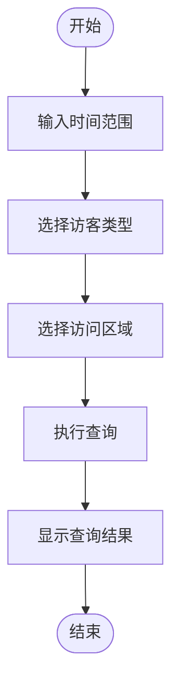
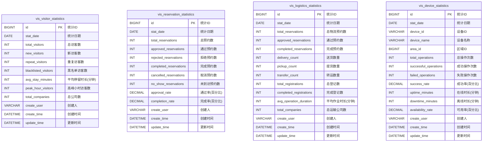

# 记录与报表

<cite>
**本文档引用的文件**  
- [visitor-module-architecture.md](file://documentation\03-业务模块\各业务模块文档\访客\visitor-module-architecture.md)
- [database_dictionary.md](file://documentation\03-业务模块\各业务模块文档\访客\database_dictionary.md)
- [module_diagrams.md](file://documentation\03-业务模块\各业务模块文档\访客\module_diagrams.md)
- [visitor-api.js](file://smart-app\src\api\business\visitor\visitor-api.js)
- [VisitorMobileController.java](file://microservices\ioedream-visitor-service\src\main\java\net\lab1024\sa\visitor\controller\VisitorMobileController.java)
- [VisitorController.java](file://microservices\ioedream-visitor-service\src\main\java\net\lab1024\sa\visitor\controller\VisitorController.java)
</cite>

## 目录
1. [引言](#引言)
2. [访客记录数据结构与存储策略](#访客记录数据结构与存储策略)
3. [历史访问记录查询](#历史访问记录查询)
4. [常用报表生成方法与使用场景](#常用报表生成方法与使用场景)
5. [数据导出功能](#数据导出功能)
6. [数据隐私保护与访问审计](#数据隐私保护与访问审计)

## 引言

本文档旨在全面阐述访客管理系统中的记录与报表功能。文档详细说明了访客进出记录的数据结构、存储策略以及历史访问记录的查询方法。同时，文档还介绍了常用报表的生成方法、使用场景，以及数据导出功能的使用方式和格式选项。最后，文档涵盖了数据隐私保护措施和访问审计机制，确保系统的安全性和合规性。

## 访客记录数据结构与存储策略

访客记录系统采用关系型数据库进行数据存储，主要数据表包括访客信息表、访客登记表、通行记录表等。这些表通过外键关联，形成一个完整的数据模型。

### 访客信息表 (t_visitor)

访客信息表存储访客的基本信息，包括姓名、性别、证件号、手机号、公司名称等。该表还包含访客等级、黑名单状态、最后访问时间等字段，用于管理和跟踪访客的历史记录。

### 访客登记表 (t_visitor_registration)

访客登记表记录每次访客的登记信息，包括登记编号、关联的预约ID、访客ID、被访人ID、访问区域、预计离开时间等。该表还包含签入和签出照片的URL，以及登记设备信息。

### 通行记录表 (t_visitor_access_record)

通行记录表记录访客的每次通行事件，包括通行类型（进入/离开）、通行结果（成功/失败）、通行位置、设备ID、卡号、二维码等。该表还包含通行数据（JSON格式）和异常标志，用于记录和处理异常情况。

**图源**
- [visitor-module-architecture.md](file://documentation\03-业务模块\各业务模块文档\访客\visitor-module-architecture.md)

**节源**
- [visitor-module-architecture.md](file://documentation\03-业务模块\各业务模块文档\访客\visitor-module-architecture.md)

## 历史访问记录查询

系统提供了多种方式来查询历史访问记录，支持按时间范围、访客类型和访问区域等条件进行筛选。

### 按时间范围查询

用户可以通过指定开始日期和结束日期来查询特定时间段内的访问记录。例如，查询2024年1月1日至2024年1月31日的所有访问记录。

### 按访客类型查询

系统支持按访客类型进行筛选，如普通访客、VIP访客、黑名单访客等。用户可以根据访客等级或黑名单状态来过滤记录。

### 按访问区域查询

用户可以按访问区域来查询记录，例如查询所有进入“研发楼”区域的访客记录。系统支持多级区域结构，可以精确到具体的楼层或房间。

### 综合查询

系统还支持综合查询，用户可以同时使用多个条件进行筛选。例如，查询2024年1月1日至2024年1月31日进入“研发楼”区域的VIP访客记录。

**图源**
- [visitor-module-architecture.md](file://documentation\03-业务模块\各业务模块文档\访客\visitor-module-architecture.md)

**节源**
- [visitor-module-architecture.md](file://documentation\03-业务模块\各业务模块文档\访客\visitor-module-architecture.md)

## 常用报表生成方法与使用场景

系统提供了多种常用的报表，帮助用户分析和管理访客数据。

### 访客流量统计报表

该报表统计特定时间段内的访客流量，包括总访客数、新访客数、重复访客数、黑名单访客数等。报表还显示高峰小时访客数和平均停留时长。

### 高频访客分析报表

该报表分析频繁访问的访客，列出访问次数最多的访客及其访问频率。报表可以帮助识别重要的合作伙伴或潜在的安全风险。

### 预约统计报表

该报表统计预约情况，包括总预约数、通过预约数、拒绝预约数、完成预约数、取消预约数和未到访预约数。报表还计算通过率和完成率。

### 物流统计报表

该报表统计物流预约和登记情况，包括总物流预约数、通过预约数、完成预约数、送货数量、提货数量、转运数量、总登记数、完成登记数、平均作业时长和总运输公司数。

**图源**
- [module_diagrams.md](file://documentation\03-业务模块\各业务模块文档\访客\module_diagrams.md)

**节源**
- [module_diagrams.md](file://documentation\03-业务模块\各业务模块文档\访客\module_diagrams.md)

## 数据导出功能

系统提供了数据导出功能，用户可以将访问记录、报表等数据导出为多种格式，方便进一步分析和存档。

### 导出格式

系统支持导出为Excel、PDF和CSV格式。用户可以根据需要选择合适的格式。

### 导出内容

用户可以选择导出的内容，包括完整的访问记录、特定条件的记录、报表数据等。导出的数据包含所有相关字段，如访客姓名、证件号、访问时间、访问区域等。

### 导出操作

用户可以通过系统界面选择导出范围和格式，然后点击“导出”按钮。系统会生成文件并提供下载链接。

**图源**
- [visitor-api.js](file://smart-app\src\api\business\visitor\visitor-api.js)

**节源**
- [visitor-api.js](file://smart-app\src\api\business\visitor\visitor-api.js)

## 数据隐私保护与访问审计

系统采取了多种措施来保护数据隐私和确保访问安全。

### 数据加密

所有敏感数据，如身份证号、手机号等，都经过加密存储。系统使用安全的加密算法，确保数据在存储和传输过程中的安全性。

### 访问控制

系统实施严格的访问控制，只有授权用户才能访问访客记录和报表。用户权限基于角色分配，确保最小权限原则。

### 访问审计

系统记录所有对访客记录和报表的访问操作，包括操作时间、操作人、操作类型等。审计日志用于监控和追踪潜在的安全事件。

### 数据保留策略

系统定义了数据保留策略，规定了不同类型数据的保留期限。过期数据将被自动归档或删除，以减少数据泄露的风险。

**图源**
- [visitor-module-architecture.md](file://documentation\03-业务模块\各业务模块文档\访客\visitor-module-architecture.md)

**节源**
- [visitor-module-architecture.md](file://documentation\03-业务模块\各业务模块文档\访客\visitor-module-architecture.md)