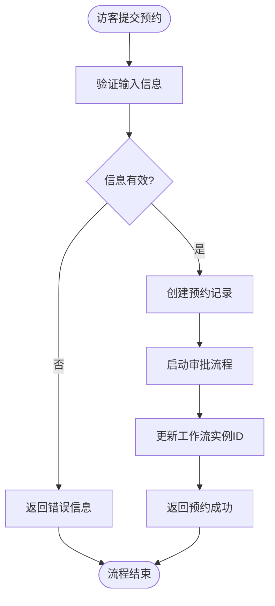
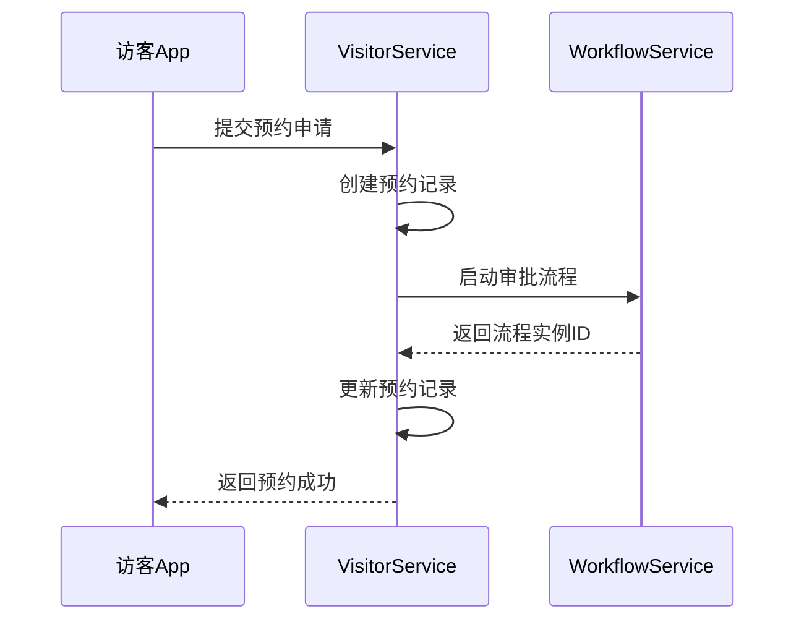
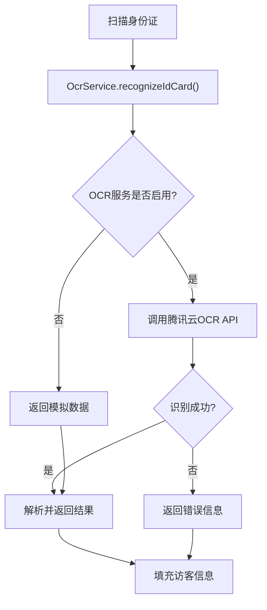
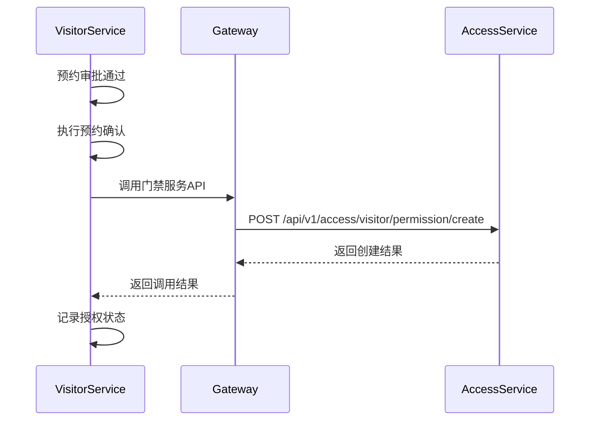
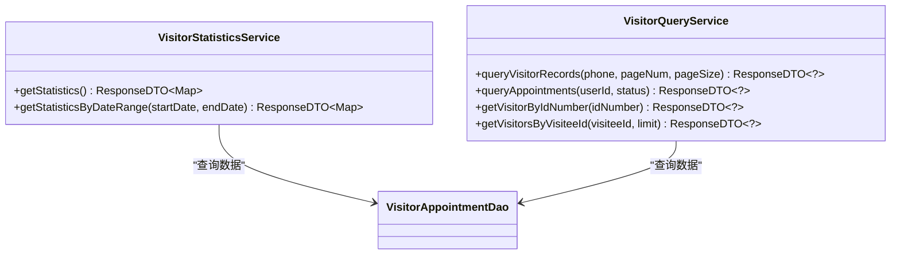
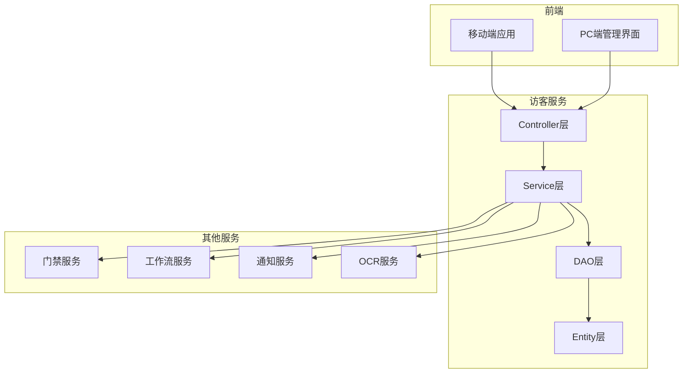

# 访客系统

<cite>
**本文档引用文件**   
- [VisitorServiceApplication.java](file://microservices/ioedream-visitor-service/src/main/java/net/lab1024/sa/visitor/VisitorServiceApplication.java)
- [VisitorController.java](file://microservices/ioedream-visitor-service/src/main/java/net/lab1024/sa/visitor/controller/VisitorController.java)
- [VisitorMobileController.java](file://microservices/ioedream-visitor-service/src/main/java/net/lab1024/sa/visitor/controller/VisitorMobileController.java)
- [VisitorAppointmentEntity.java](file://microservices/ioedream-visitor-service/src/main/java/net/lab1024/sa/visitor/domain/entity/VisitorAppointmentEntity.java)
- [VisitorAppointmentService.java](file://microservices/ioedream-visitor-service/src/main/java/net/lab1024/sa/visitor/service/VisitorAppointmentService.java)
- [VisitorAppointmentServiceImpl.java](file://microservices/ioedream-visitor-service/src/main/java/net/lab1024/sa/visitor/service/impl/VisitorAppointmentServiceImpl.java)
- [VisitorCheckInService.java](file://microservices/ioedream-visitor-service/src/main/java/net/lab1024/sa/visitor/service/VisitorCheckInService.java)
- [VisitorQueryService.java](file://microservices/ioedream-visitor-service/src/main/java/net/lab1024/sa/visitor/service/VisitorQueryService.java)
- [VisitorStatisticsService.java](file://microservices/ioedream-visitor-service/src/main/java/net/lab1024/sa/visitor/service/VisitorStatisticsService.java)
- [OcrService.java](file://microservices/ioedream-visitor-service/src/main/java/net/lab1024/sa/visitor/service/OcrService.java)
- [VisitorVO.java](file://microservices/ioedream-visitor-service/src/main/java/net/lab1024/sa/visitor/domain/vo/VisitorVO.java)
- [VisitorAppointmentDetailVO.java](file://microservices/ioedream-visitor-service/src/main/java/net/lab1024/sa/visitor/domain/vo/VisitorAppointmentDetailVO.java)
</cite>

## 目录
1. [引言](#引言)
2. [核心功能](#核心功能)
3. [访客预约与审批流程](#访客预约与审批流程)
4. [身份验证与通行授权](#身份验证与通行授权)
5. [访客与门禁系统集成](#访客与门禁系统集成)
6. [数据分析与报表统计](#数据分析与报表统计)
7. [安全策略与隐私保护](#安全策略与隐私保护)
8. [系统架构](#系统架构)

## 引言

访客系统是IOE-DREAM智慧园区一卡通管理平台的核心组成部分，旨在为园区提供高效、安全、便捷的访客管理服务。该系统通过数字化手段，实现了从访客预约、身份验证、通行授权到记录查询的全流程管理。系统支持移动端和PC端双平台操作，为访客和被访人提供了极大的便利。

系统的核心目标是提升园区的安全管理水平，优化访客接待流程，并通过与门禁、通知等系统的深度集成，实现智能化的访客管理。本系统严格遵循企业级开发规范，确保了代码的可维护性和系统的稳定性。

## 核心功能

访客系统提供了一套完整的访客管理解决方案，主要功能模块包括：

- **访客预约**：访客可通过移动端应用在线提交预约申请，填写访客姓名、联系方式、身份证号、访问目的、被访人等信息。
- **审批流程**：预约申请将触发预设的审批流程，由被访人或指定审批人进行审核，支持多级审批和自动审批规则。
- **身份验证**：访客到达时，可通过身份证OCR识别、人脸识别等技术进行身份核验，确保人证合一。
- **通行授权**：审批通过后，系统将自动生成临时通行权限，并同步至门禁系统，允许访客在预约时间段内访问指定区域。
- **记录查询**：系统完整记录所有访客的预约、签到、签退等信息，支持按多种条件进行查询和追溯。
- **数据分析**：提供丰富的数据统计和报表功能，帮助管理人员了解访客流量、访问趋势等信息。

**本节来源**
- [VisitorServiceApplication.java](file://microservices/ioedream-visitor-service/src/main/java/net/lab1024/sa/visitor/VisitorServiceApplication.java#L23-L26)
- [FOUR_MODULES_COMPREHENSIVE_ANALYSIS_REPORT.md](file://FOUR_MODULES_COMPREHENSIVE_ANALYSIS_REPORT.md#L251-L270)

## 访客预约与审批流程

### 预约流程

访客预约是整个访客管理流程的起点。访客通过移动端应用提交预约申请，系统会创建一个`VisitorAppointmentEntity`实体，其核心字段包括：
- `visitorName`：访客姓名
- `phoneNumber`：手机号
- `idCardNumber`：身份证号
- `visitUserId`：被访人ID
- `visitUserName`：被访人姓名
- `appointmentStartTime`：预约开始时间
- `appointmentEndTime`：预约结束时间
- `visitPurpose`：访问目的
- `status`：预约状态（待审批、已通过、已驳回等）

**本节来源**
- [VisitorAppointmentEntity.java](file://microservices/ioedream-visitor-service/src/main/java/net/lab1024/sa/visitor/domain/entity/VisitorAppointmentEntity.java#L34-L122)
- [VisitorMobileController.java](file://microservices/ioedream-visitor-service/src/main/java/net/lab1024/sa/visitor/controller/VisitorMobileController.java#L108-L113)

### 审批流程配置

访客系统的审批流程与OA工作流模块深度集成。当创建预约时，系统会调用`workflowApprovalManager.startApprovalProcess()`方法，启动一个预定义的审批流程。该流程的配置信息存储在OA工作流模块中，支持灵活的流程设计。

审批流程的配置方法如下：
1. 在OA工作流模块中创建名为“访客预约”的流程定义。
2. 配置审批节点，可以是单人审批、多人会签或逐级审批。
3. 设置审批规则，例如根据预约的紧急程度或被访人级别自动选择不同的审批路径。
4. 发布流程定义。

系统通过`WorkflowDefinitionConstants.VISITOR_APPOINTMENT`常量来引用该流程定义。审批过程中，审批人的意见和状态会实时同步回访客系统。

**本节来源**
- [VisitorAppointmentServiceImpl.java](file://microservices/ioedream-visitor-service/src/main/java/net/lab1024/sa/visitor/service/impl/VisitorAppointmentServiceImpl.java#L99-L116)
- [tasks.md](file://openspec/changes/archive/completed-proposals/implement-access-control-missing-functions/tasks.md#L31-L37)

## 身份验证与通行授权

### 身份验证

访客系统集成了先进的OCR（光学字符识别）技术，用于快速、准确地验证访客身份。系统通过`OcrService`类与腾讯云OCR服务对接，支持身份证、驾驶证、车牌和营业执照的识别。

当访客到达现场时，安保人员可通过移动设备扫描访客的身份证。系统会将图片转换为Base64编码，并调用腾讯云OCR API进行识别。识别成功后，系统会自动填充访客的姓名、性别、出生日期、地址和身份证号码等信息，极大地提高了登记效率。

**本节来源**
- [OcrService.java](file://microservices/ioedream-visitor-service/src/main/java/net/lab1024/sa/visitor/service/OcrService.java#L75-L136)
- [VisitorMobileController.java](file://microservices/ioedream-visitor-service/src/main/java/net/lab1024/sa/visitor/controller/VisitorMobileController.java#L220-L232)

### 通行授权

通行授权是连接访客系统与门禁系统的关键环节。当访客预约审批通过后，系统会自动执行授权流程。

在`VisitorAppointmentServiceImpl`的`executeAppointmentConfirmation`方法中，系统会调用`generateVisitorAccessPermission`方法。该方法通过网关服务客户端（`GatewayServiceClient`）向门禁服务发送HTTP请求，创建临时的访客权限。请求中包含了访客的预约ID、姓名、手机号、有效时间段等信息。

门禁服务接收到请求后，会将该访客的权限信息同步到指定的门禁设备上。访客在预约时间段内到达时，可通过刷身份证或人脸识别的方式进入园区。

**本节来源**
- [VisitorAppointmentServiceImpl.java](file://microservices/ioedream-visitor-service/src/main/java/net/lab1024/sa/visitor/service/impl/VisitorAppointmentServiceImpl.java#L190-L260)
- [FOUR_MODULES_FUNCTIONALITY_VERIFICATION_REPORT.md](file://FOUR_MODULES_FUNCTIONALITY_VERIFICATION_REPORT.md#L263-L264)

## 访客与门禁系统集成

访客系统与门禁系统通过微服务架构进行松耦合集成。两个系统作为独立的微服务运行，通过API网关进行通信。

集成的关键在于`GatewayServiceClient`。访客系统不直接调用门禁服务的API，而是通过网关进行转发。这种方式有以下优势：
1. **解耦**：访客系统无需知道门禁服务的具体地址和部署细节。
2. **安全**：所有内部服务调用都经过网关的认证和鉴权。
3. **可观测性**：网关可以记录所有服务调用的日志，便于监控和排查问题。

集成流程如下：
1. 访客系统在预约确认时，调用`gatewayServiceClient.callAccessService()`方法。
2. 网关服务接收到请求后，根据服务名（如`ioedream-access-service`）查找其网络地址。
3. 网关将请求转发给门禁服务的指定API。
4. 门禁服务处理请求，创建临时权限，并返回结果。
5. 网关将结果返回给访客系统。

这种集成方式确保了系统的灵活性和可扩展性，未来可以轻松地与其他系统（如视频监控、消费系统）进行集成。

**本节来源**
- [VisitorAppointmentServiceImpl.java](file://microservices/ioedream-visitor-service/src/main/java/net/lab1024/sa/visitor/service/impl/VisitorAppointmentServiceImpl.java#L240-L245)
- [VisitorServiceApplication.java](file://microservices/ioedream-visitor-service/src/main/java/net/lab1024/sa/visitor/VisitorServiceApplication.java#L42)

## 数据分析与报表统计

访客系统提供了强大的数据分析和报表统计功能，帮助管理人员洞察访客行为和园区安全状况。

### 数据统计

系统通过`VisitorStatisticsService`接口提供统计数据。主要统计指标包括：
- **访客总数**：在指定时间范围内的总访客数。
- **预约总数**：总预约申请数量。
- **已审批**：已通过的预约数量。
- **待审批**：等待审批的预约数量。
- **已拒绝**：被驳回的预约数量。

这些数据可以通过`getStatisticsByDateRange`方法获取，支持按日、周、月等维度进行统计。

### 报表使用说明

系统提供了多种报表，用户可以通过PC端管理界面进行访问：
1. **访客流量报表**：展示每日/每周/每月的访客数量趋势图。
2. **被访人热度排行**：统计被访次数最多的员工，帮助识别高价值客户或合作伙伴。
3. **访问目的分析**：分析访客的访问目的分布，如商务洽谈、技术交流、售后服务等。
4. **区域访问统计**：统计不同区域的访客流量，为安全管理提供数据支持。

用户可以通过设置时间范围、被访人、访问目的等筛选条件，生成自定义报表。报表支持导出为Excel或PDF格式。

**本节来源**
- [VisitorStatisticsService.java](file://microservices/ioedream-visitor-service/src/main/java/net/lab1024/sa/visitor/service/VisitorStatisticsService.java#L24-L38)
- [VisitorController.java](file://microservices/ioedream-visitor-service/src/main/java/net/lab1024/sa/visitor/controller/VisitorController.java#L149-L188)

## 安全策略与隐私保护

访客系统高度重视数据安全和用户隐私保护，实施了多层次的安全策略。

### 安全策略

1. **访问控制**：系统采用基于角色的访问控制（RBAC）。只有具有`VISITOR_MANAGER`角色的用户才能访问访客管理的敏感API，如查询所有预约记录。
2. **数据加密**：访客的身份证号、手机号等敏感信息在数据库中存储时，采用加密算法进行保护。
3. **操作审计**：所有关键操作（如创建预约、修改状态）都会被记录在审计日志中，便于追溯和审计。
4. **API安全**：所有API接口都通过网关进行统一的安全管理，包括身份认证、限流、防重放攻击等。

### 隐私保护

1. **最小化原则**：系统仅收集完成访客管理所必需的最少信息。
2. **知情同意**：在访客提交预约时，系统会明确告知其信息的使用目的和范围，并获得其同意。
3. **数据保留**：访客的个人信息在访问结束后会保留一定时间（如6个月），之后将被自动归档或删除。
4. **第三方集成安全**：在与腾讯云OCR服务集成时，系统会对传输的图片数据进行加密，并在识别完成后立即删除临时文件。

这些措施确保了访客系统的合规性，符合《个人信息保护法》等相关法律法规的要求。

**本节来源**
- [VisitorController.java](file://microservices/ioedream-visitor-service/src/main/java/net/lab1024/sa/visitor/controller/VisitorController.java#L98)
- [OcrService.java](file://microservices/ioedream-visitor-service/src/main/java/net/lab1024/sa/visitor/service/OcrService.java#L79-L83)

## 系统架构

访客系统采用微服务架构，是IOE-DREAM平台的一个独立服务（`ioedream-visitor-service`）。系统运行在端口8095上，通过Nacos进行服务注册与发现。

系统遵循四层架构模式：
1. **Controller层**：处理HTTP请求，如`VisitorController`和`VisitorMobileController`。
2. **Service层**：实现核心业务逻辑，如`VisitorAppointmentService`。
3. **DAO层**：负责数据持久化，通过MyBatis-Plus与数据库交互。
4. **Entity层**：定义数据模型，如`VisitorAppointmentEntity`。

系统通过`GatewayServiceClient`与其他微服务（如门禁服务、通知服务）进行通信，实现了服务间的解耦。同时，系统集成了工作流引擎，将业务流程与技术实现分离，提高了系统的灵活性和可维护性。

**本节来源**
- [VisitorServiceApplication.java](file://microservices/ioedream-visitor-service/src/main/java/net/lab1024/sa/visitor/VisitorServiceApplication.java#L33-L65)
- [VisitorAppointmentServiceImpl.java](file://microservices/ioedream-visitor-service/src/main/java/net/lab1024/sa/visitor/service/impl/VisitorAppointmentServiceImpl.java#L47-L50)