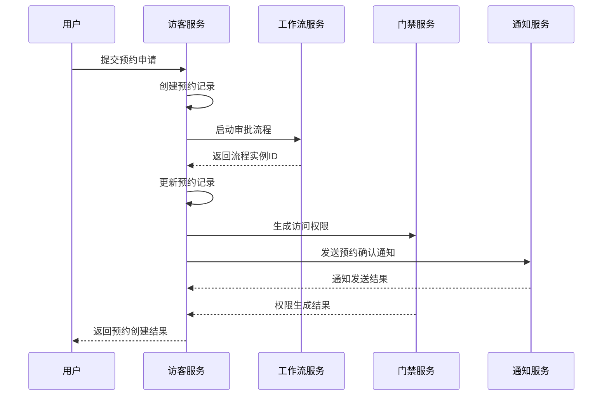
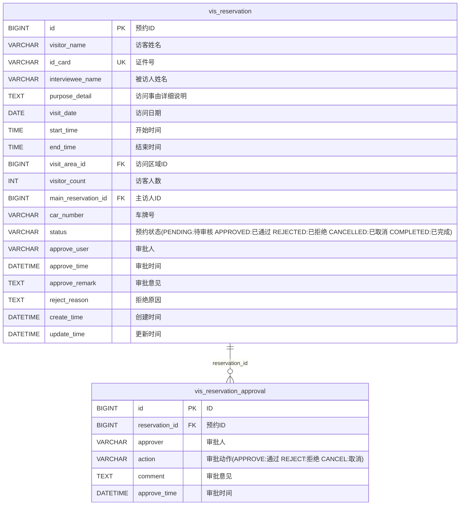
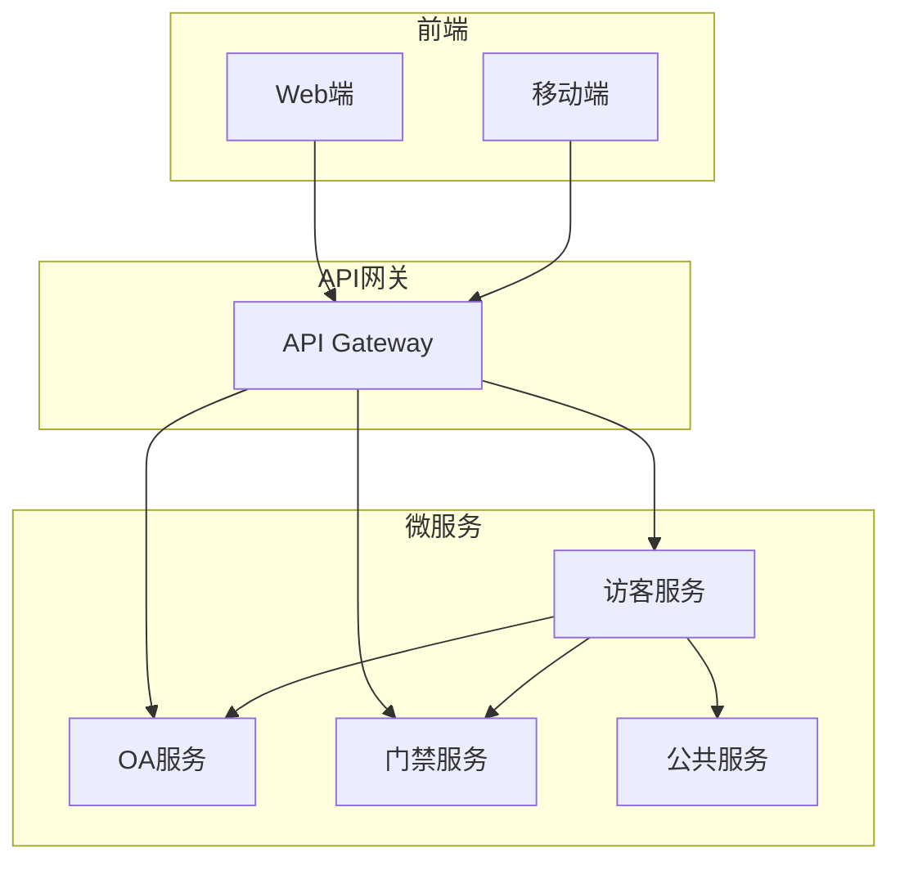
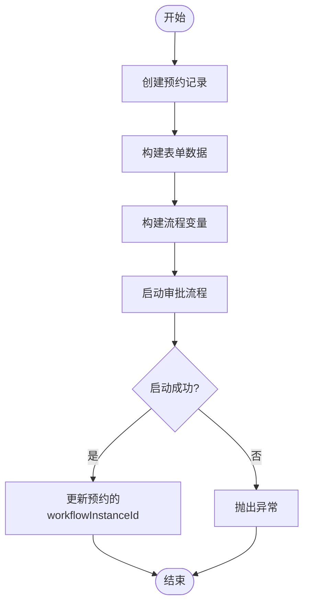
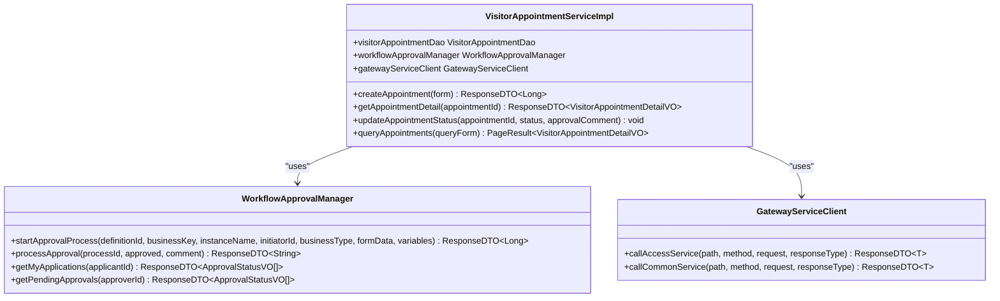

# 审批流程集成

<cite>
**本文档引用文件**   
- [VisitorAppointmentServiceImpl.java](file://microservices\ioedream-visitor-service\src\main\java\net\lab1024\sa\visitor\service\impl\VisitorAppointmentServiceImpl.java)
- [VisitorAppointmentEntity.java](file://microservices\ioedream-visitor-service\src\main\java\net\lab1024\sa\visitor\domain\entity\VisitorAppointmentEntity.java)
- [database_dictionary.md](file://documentation\03-业务模块\访客\database_dictionary.md)
- [12-前端API接口设计.md](file://documentation\03-业务模块\访客\12-前端API接口设计.md)
- [AccessApprovalController.java](file://restful_refactor_backup_20251202_014224\microservices_ioedream-access-service_src_main_java_net_lab1024_sa_access_approval_controller_AccessApprovalController.java)
- [WorkflowDefinitionConstants.java](file://microservices\microservices-common\src\main\java\net\lab1024\sa\common\workflow\constant\WorkflowDefinitionConstants.java)
- [BusinessTypeEnum.java](file://microservices\microservices-common\src\main\java\net\lab1024\sa\common\workflow\constant\BusinessTypeEnum.java)
- [ApprovalConfigServiceImpl.java](file://microservices\ioedream-oa-service\src\main\java\net\lab1024\sa\oa\workflow\service\impl\ApprovalConfigServiceImpl.java)
- [smart-workflow.md](file://documentation\technical\smart-workflow.md)
</cite>

## 目录
1. [引言](#引言)
2. [预约与审批流程集成](#预约与审批流程集成)
3. [审批规则与流程配置](#审批规则与流程配置)
4. [审批状态同步机制](#审批状态同步机制)
5. [审批接口调用方法](#审批接口调用方法)
6. [审批意见与历史追溯](#审批意见与历史追溯)
7. [核心组件分析](#核心组件分析)
8. [架构概览](#架构概览)
9. [详细组件分析](#详细组件分析)
10. [依赖分析](#依赖分析)
11. [性能考量](#性能考量)
12. [故障排除指南](#故障排除指南)
13. [结论](#结论)

## 引言
本文档详细阐述了访客预约系统与审批流程的集成机制。系统通过将访客预约与工作流审批相结合，实现了从预约申请到审批完成的全流程自动化管理。当访客提交预约申请时，系统会自动触发预设的审批流程，确保所有访问请求都经过适当的审核。审批流程的状态与预约状态保持同步，确保数据一致性。系统提供了完整的审批接口，支持审批通过、拒绝和退回等操作，并完整记录审批意见和历史，支持追溯查询。

## 预约与审批流程集成
访客预约与审批流程的集成是系统的核心功能，确保所有访客访问请求都经过必要的审核。当访客或接待人提交预约申请时，系统会自动触发预设的审批流程。

### 预约申请触发审批
当用户创建访客预约时，系统会自动启动审批流程。在 `VisitorAppointmentServiceImpl` 类的 `createAppointment` 方法中，首先创建预约记录，然后调用 `workflowApprovalManager.startApprovalProcess` 方法启动审批流程。该方法需要指定流程定义ID、业务Key、流程实例名称、发起人ID、业务类型、表单数据和流程变量等参数。



**Diagram sources**
- [VisitorAppointmentServiceImpl.java](file://microservices\ioedream-visitor-service\src\main\java\net\lab1024\sa\visitor\service\impl\VisitorAppointmentServiceImpl.java#L63-L126)

**Section sources**
- [VisitorAppointmentServiceImpl.java](file://microservices\ioedream-visitor-service\src\main\java\net\lab1024\sa\visitor\service\impl\VisitorAppointmentServiceImpl.java#L63-L126)

## 审批规则与流程配置
审批规则和流程的配置是实现灵活审批机制的基础。系统通过预定义的审批模板和规则，确定审批人和生成审批链。

### 审批规则配置
审批规则通过JSON配置结构定义，包含审批级别、升级规则和通知规则等。每个审批级别可以设置审批人类型、角色、是否必需、时间限制和条件等。例如，病假审批流程可以配置为：第一级由直属领导审批，最大请假天数不超过3天；第二级由HR经理审批，当请假天数超过3天时触发；第三级由公司总监审批，当请假天数超过7天且员工级别达到3级以上时触发。

```json
{
  "workflow_name": "病假审批流程",
  "approval_levels": [
    {
      "level": 1,
      "approver_type": "direct_manager",
      "approver_role": "直属领导",
      "required": true,
      "time_limit_hours": 24,
      "conditions": {
        "max_duration_days": 3,
        "min_employee_level": 1
      }
    },
    {
      "level": 2,
      "approver_type": "hr_manager",
      "approver_role": "HR经理",
      "required": false,
      "time_limit_hours": 48,
      "conditions": {
        "duration_days >= 3",
        "leave_types": ["病假", "事假"]
      }
    },
    {
      "level": 3,
      "approver_type": "company_director",
      "approver_role": "公司总监",
      "required": false,
      "time_limit_hours": 72,
      "conditions": {
        "duration_days >= 7",
        "employee_level >= 3"
      }
    }
  ],
  "escalation_rules": [
    {
      "condition": "approval_timeout",
      "action": "escalate_to_next_level",
      "timeout_hours": 24
    },
    {
      "condition": "approver_absent",
      "action": "notify_backup_approver",
      "backup_approver_type": "department_manager"
    }
  ],
  "notification_rules": {
    "notify_applicant": true,
    "notify_approver": true,
    "notify_hr": true,
    "notification_channels": ["system", "email", "wechat"]
  }
}
```

**Diagram sources**
- [考勤\异常管理.md](file://documentation\03-业务模块\考勤\异常管理.md#L274-L331)

**Section sources**
- [考勤\异常管理.md](file://documentation\03-业务模块\考勤\异常管理.md#L271-L332)

### 审批人确定与审批链生成
审批人的确定基于预定义的规则和组织架构。系统根据预约类型、被访人级别、预约金额等因素，通过规则引擎计算出相应的审批人。审批链的生成遵循"谁审批，谁负责"的原则，确保审批流程的合理性和有效性。

## 审批状态同步机制
审批状态与预约状态的同步是确保数据一致性的关键。系统通过触发器和状态更新机制，确保两个状态始终保持一致。

### 状态同步实现
在数据库层面，通过触发器 `tr_reservation_status_change` 实现状态同步。当预约状态变更时，触发器会自动记录审批日志。在应用层面，当审批流程状态变更时，系统会调用 `updateAppointmentStatus` 方法更新预约状态。该方法会更新预约记录的状态、审批意见和审批时间，并根据审批结果执行相应的业务逻辑。

```sql
DELIMITER //
CREATE TRIGGER tr_reservation_status_change
BEFORE UPDATE ON vis_reservation
FOR EACH ROW
BEGIN
    IF OLD.status != NEW.status AND NEW.status IN ('APPROVED', 'REJECTED', 'CANCELLED') THEN
        INSERT INTO vis_reservation_approval (
            reservation_id,
            approver,
            action,
            comment,
            approve_time
        ) VALUES (
            NEW.reservation_id,
            NEW.approve_user,
            CASE NEW.status
                WHEN 'APPROVED' THEN 'APPROVE'
                WHEN 'REJECTED' THEN 'REJECT'
                WHEN 'CANCELLED' THEN 'CANCEL'
            END,
            NEW.approve_remark,
            NEW.approve_time
        );
    END IF;
END//
DELIMITER ;
```

**Diagram sources**
- [database_dictionary.md](file://documentation\03-业务模块\访客\database_dictionary.md#L937-L962)

**Section sources**
- [database_dictionary.md](file://documentation\03-业务模块\访客\database_dictionary.md#L932-L964)

## 审批接口调用方法
系统提供了完整的审批接口，支持审批通过、拒绝和退回等操作。

### 审批接口
审批接口通过 `AccessApprovalController` 类提供。主要接口包括：
- `POST /api/access/approval/process/{processId}/approve`: 审批处理，支持批准和拒绝操作。
- `POST /api/v1/visitor/appointment/{appointmentId}/status`: 更新预约状态，支持批准、拒绝和取消操作。

```http
POST /api/v1/visitor/appointment/{appointmentId}/status
```

**请求参数:**
```json
{
  "status": "APPROVED", // APPROVED批准, REJECTED拒绝, CANCELLED取消
  "reason": "经核实，访客信息真实有效，同意访问",
  "operatorInfo": {
    "operatorId": 1001,
    "operatorName": "张三",
    "operatorRole": "部门经理"
  },
  "conditions": [
    {
      "condition": "ESCORT_REQUIRED",
      "description": "需要全程陪同"
    },
    {
      "condition": "LIMITED_AREA",
      "description": "仅限技术研发部区域"
    }
  ]
}
```

**Section sources**
- [12-前端API接口设计.md](file://documentation\03-业务模块\访客\12-前端API接口设计.md#L277-L300)
- [AccessApprovalController.java](file://restful_refactor_backup_20251202_014224\microservices_ioedream-access-service_src_main_java_net_lab1024_sa_access_approval_controller_AccessApprovalController.java#L76-L85)

## 审批意见与历史追溯
系统完整记录审批意见和历史，支持追溯查询。

### 审批意见记录
审批意见通过 `vis_reservation_approval` 表记录，包含审批人、审批动作、审批意见和审批时间等信息。系统还支持在审批通过时添加特殊条件，如需要全程陪同或仅限特定区域访问。

### 审批历史追溯
审批历史通过 `getApprovalHistory` 接口提供，支持按用户ID查询审批历史。系统还提供了 `getApprovalDetail` 接口，支持按流程ID查询审批详情。



**Diagram sources**
- [database_dictionary.md](file://documentation\03-业务模块\访客\database_dictionary.md#L180-L224)

**Section sources**
- [database_dictionary.md](file://documentation\03-业务模块\访客\database_dictionary.md#L178-L271)

## 核心组件分析
本节分析审批流程集成的核心组件。

### VisitorAppointmentServiceImpl
`VisitorAppointmentServiceImpl` 类是访客预约服务的核心实现类，负责处理访客预约相关的业务逻辑。该类实现了 `VisitorAppointmentService` 接口，提供了创建预约、获取预约详情、更新预约状态和分页查询预约等功能。

**Section sources**
- [VisitorAppointmentServiceImpl.java](file://microservices\ioedream-visitor-service\src\main\java\net\lab1024\sa\visitor\service\impl\VisitorAppointmentServiceImpl.java#L47-L529)

### VisitorAppointmentEntity
`VisitorAppointmentEntity` 类是访客预约的实体类，映射到数据库中的 `visitor_appointment` 表。该类继承自 `BaseEntity`，包含审计字段，并使用 `@TableName` 注解指定数据库表名。

**Section sources**
- [VisitorAppointmentEntity.java](file://microservices\ioedream-visitor-service\src\main\java\net\lab1024\sa\visitor\domain\entity\VisitorAppointmentEntity.java#L29-L124)

## 架构概览
系统采用微服务架构，将访客管理、审批流程、门禁控制等功能分离到不同的微服务中，通过API网关进行统一管理和调用。



**Diagram sources**
- [12-前端API接口设计.md](file://documentation\03-业务模块\访客\12-前端API接口设计.md#L63-L74)

**Section sources**
- [12-前端API接口设计.md](file://documentation\03-业务模块\访客\12-前端API接口设计.md#L62-L75)

## 详细组件分析
本节详细分析审批流程集成的各个组件。

### 访客预约服务
访客预约服务负责处理访客预约相关的所有业务逻辑，包括创建预约、查询预约、更新预约状态等。

#### 创建预约
创建预约流程包括：创建预约记录、启动审批流程、更新预约记录等步骤。



**Diagram sources**
- [VisitorAppointmentServiceImpl.java](file://microservices\ioedream-visitor-service\src\main\java\net\lab1024\sa\visitor\service\impl\VisitorAppointmentServiceImpl.java#L63-L126)

**Section sources**
- [VisitorAppointmentServiceImpl.java](file://microservices\ioedream-visitor-service\src\main\java\net\lab1024\sa\visitor\service\impl\VisitorAppointmentServiceImpl.java#L63-L126)

### 审批流程服务
审批流程服务负责管理审批流程的定义、实例和执行。

#### 审批流程定义
审批流程通过 `smart_workflow_definition` 表定义，包含流程定义ID、名称、描述、版本、状态、分类ID、表单配置、流程配置、节点配置等信息。

**Section sources**
- [smart-workflow.md](file://documentation\technical\smart-workflow.md#L3810-L3859)

## 依赖分析
本节分析审批流程集成的依赖关系。

### 组件依赖
访客预约服务依赖于OA服务的审批流程管理器和门禁服务的访问权限管理。



**Diagram sources**
- [VisitorAppointmentServiceImpl.java](file://microservices\ioedream-visitor-service\src\main\java\net\lab1024\sa\visitor\service\impl\VisitorAppointmentServiceImpl.java#L52-L59)

**Section sources**
- [VisitorAppointmentServiceImpl.java](file://microservices\ioedream-visitor-service\src\main\java\net\lab1024\sa\visitor\service\impl\VisitorAppointmentServiceImpl.java#L52-L59)

## 性能考量
本节讨论审批流程集成的性能考量。

### 数据库优化
为提高查询性能，系统在关键字段上创建了索引，如 `visitor_appointment` 表的 `status`、`create_time` 字段。对于大数据量的表，建议按时间进行分区，如按月分区。

**Section sources**
- [database_dictionary.md](file://documentation\03-业务模块\访客\database_dictionary.md#L1040-L1049)

## 故障排除指南
本节提供审批流程集成的故障排除指南。

### 常见问题
- **审批流程未启动**: 检查 `workflowApprovalManager` 是否正确注入，流程定义ID是否正确。
- **状态不同步**: 检查触发器 `tr_reservation_status_change` 是否正常工作，数据库连接是否正常。
- **通知未发送**: 检查 `gatewayServiceClient` 调用是否成功，通知服务是否正常运行。

**Section sources**
- [VisitorAppointmentServiceImpl.java](file://microservices\ioedream-visitor-service\src\main\java\net\lab1024\sa\visitor\service\impl\VisitorAppointmentServiceImpl.java#L206-L210)
- [database_dictionary.md](file://documentation\03-业务模块\访客\database_dictionary.md#L937-L962)

## 结论
本文档详细阐述了访客预约与审批流程集成的各个方面，包括预约申请触发审批、审批规则配置、审批状态同步、审批接口调用、审批意见记录和历史追溯等。系统通过微服务架构实现了高内聚、低耦合的设计，确保了系统的可维护性和可扩展性。通过合理的数据库设计和优化，系统能够高效处理大量预约和审批请求。完整的故障排除指南有助于快速定位和解决常见问题，确保系统稳定运行。