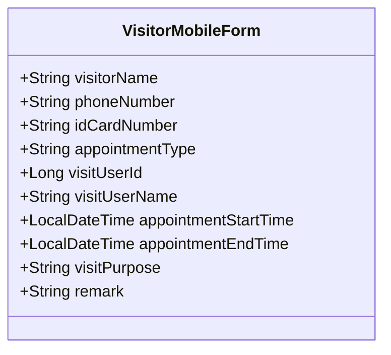
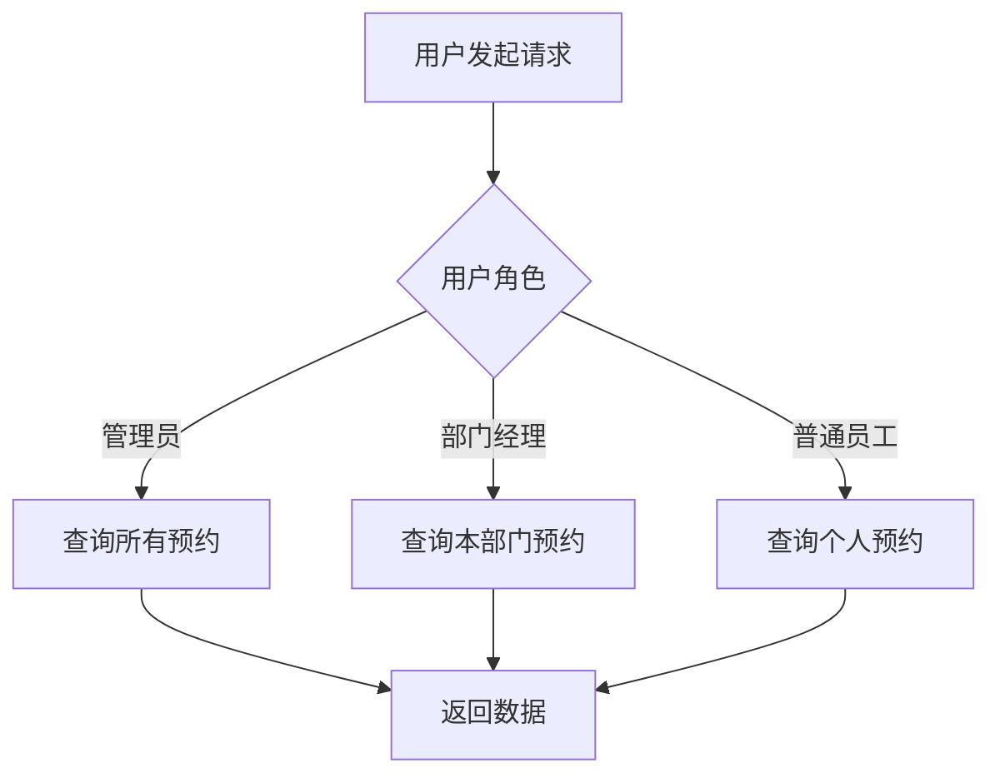
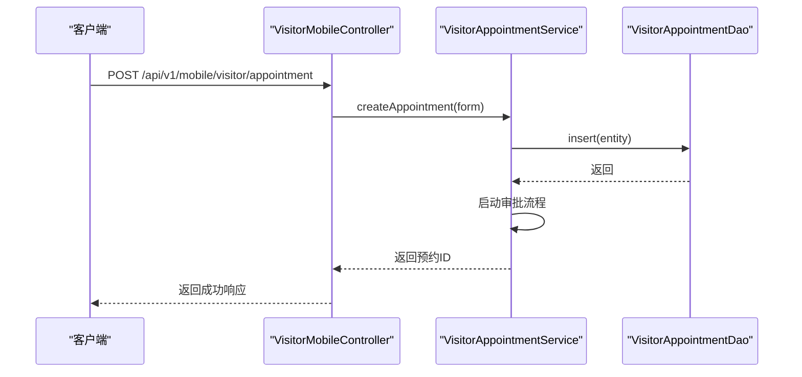
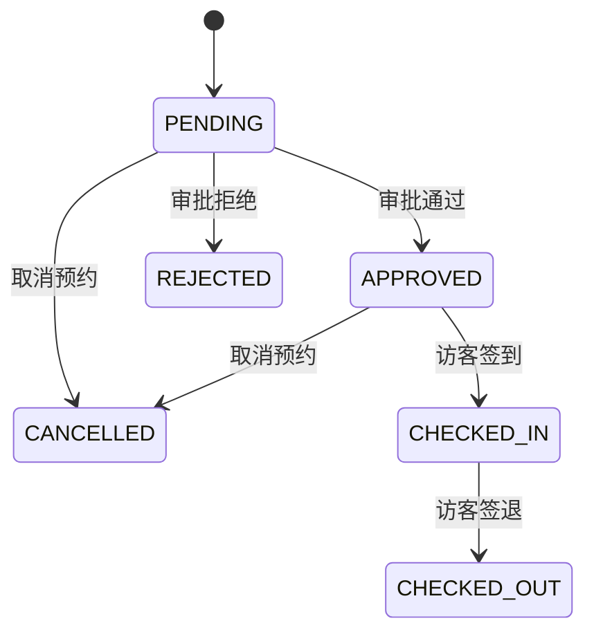
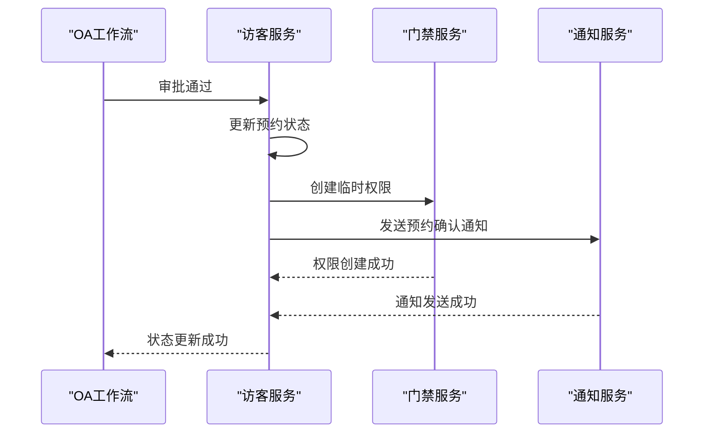

# 访客预约

<cite>
**本文档引用文件**   
- [VisitorAppointmentEntity.java](file://microservices\ioedream-visitor-service\src\main\java\net\lab1024\sa\visitor\domain\entity\VisitorAppointmentEntity.java)
- [VisitorMobileForm.java](file://microservices\ioedream-visitor-service\src\main\java\net\lab1024\sa\visitor\domain\form\VisitorMobileForm.java)
- [VisitorAppointmentDetailVO.java](file://microservices\ioedream-visitor-service\src\main\java\net\lab1024\sa\visitor\domain\vo\VisitorAppointmentDetailVO.java)
- [VisitorAppointmentService.java](file://microservices\ioedream-visitor-service\src\main\java\net\lab1024\sa\visitor\service\VisitorAppointmentService.java)
- [VisitorMobileController.java](file://microservices\ioedream-visitor-service\src\main\java\net\lab1024\sa\visitor\controller\VisitorMobileController.java)
- [VisitorAppointmentServiceImpl.java](file://microservices\ioedream-visitor-service\src\main\java\net\lab1024\sa\visitor\service\impl\VisitorAppointmentServiceImpl.java)
- [logistics-tables.sql](file://database-scripts\visitor\logistics-tables.sql)
- [13-前端移动端组件设计.md](file://documentation\03-业务模块\访客\13-前端移动端组件设计.md)
- [12-前端API接口设计.md](file://documentation\03-业务模块\访客\12-前端API接口设计.md)
- [registration.vue](file://smart-admin-web-javascript\src\views\business\visitor\registration.vue)
</cite>

## 目录
1. [引言](#引言)
2. [预约表单设计与实现](#预约表单设计与实现)
3. [预约数据存储结构](#预约数据存储结构)
4. [访问控制策略](#访问控制策略)
5. [前端组件使用方法](#前端组件使用方法)
6. [API接口使用](#api接口使用)
7. [预约状态生命周期](#预约状态生命周期)
8. [审批流程集成](#审批流程集成)
9. [总结](#总结)

## 引言
访客预约功能是IOE-DREAM智能访客管理系统的核心模块，为访客提供便捷的预约服务，同时确保企业安全。本系统通过移动端和Web端提供完整的访客管理解决方案，支持从预约创建、审批、签到到数据分析的全流程管理。系统采用微服务架构，访客服务（Visitor Service）独立部署，通过API网关与其他服务（如门禁、通知、OA工作流）集成，实现高内聚、低耦合的系统设计。

**Section sources**
- [VisitorAppointmentEntity.java](file://microservices\ioedream-visitor-service\src\main\java\net\lab1024\sa\visitor\domain\entity\VisitorAppointmentEntity.java#L1-L124)

## 预约表单设计与实现

### 表单字段设计
访客预约表单设计遵循企业级表单规范，包含访客信息、预约信息、接待人信息等核心字段。表单分为移动端和Web端两种实现，均采用响应式设计，确保在不同设备上提供一致的用户体验。

**核心必填字段：**
- **访客姓名**：访客的真实姓名，用于身份识别。
- **手机号码**：用于接收预约确认、提醒等通知。
- **身份证号**：作为访客的主要身份凭证，用于身份验证。
- **被访人ID**：关联企业内部员工，作为审批流程的发起人。
- **预约开始时间**：访客计划访问的开始时间。
- **预约结束时间**：访客计划访问的结束时间。
- **访问目的**：简要说明来访事由。



**Diagram sources**
- [VisitorMobileForm.java](file://microservices\ioedream-visitor-service\src\main\java\net\lab1024\sa\visitor\domain\form\VisitorMobileForm.java#L1-L82)

### 时间约束与验证机制
系统对预约时间实施严格的约束，确保预约的合理性和有效性：
- **时间范围**：预约开始时间必须在当前时间之后，且不能超过未来3个月。
- **时间间隔**：预约时长不能超过8小时，防止滥用系统资源。
- **冲突检测**：系统会检查被访人在预约时间段内是否有其他会议或预约，避免时间冲突。

后端通过Jakarta Validation框架实现参数验证，所有必填字段都使用`@NotBlank`或`@NotNull`注解进行校验。例如，`VisitorMobileForm`类中的`visitorName`字段：
```java
@NotBlank(message = "访客姓名不能为空")
private String visitorName;
```
当客户端提交的表单缺少必填字段时，后端会返回400 Bad Request错误，前端捕获错误后向用户展示具体的错误信息。

**Section sources**
- [VisitorMobileForm.java](file://microservices\ioedream-visitor-service\src\main\java\net\lab1024\sa\visitor\domain\form\VisitorMobileForm.java#L1-L82)
- [13-前端移动端组件设计.md](file://documentation\03-业务模块\访客\13-前端移动端组件设计.md#L1-L2538)

## 预约数据存储结构

### 数据库表设计
访客预约数据存储在`visitor_appointment`表中，该表设计遵循数据库规范，包含完整的业务字段和审计字段。

**核心字段说明：**
- **appointment_id**：预约ID，主键，使用雪花算法生成。
- **visitor_name**：访客姓名。
- **phone_number**：手机号码。
- **id_card_number**：身份证号。
- **appointment_type**：预约类型（如商务访问、面试等）。
- **visit_user_id**：被访人ID，关联员工表。
- **visit_user_name**：被访人姓名。
- **appointment_start_time**：预约开始时间。
- **appointment_end_time**：预约结束时间。
- **visit_purpose**：访问目的。
- **status**：预约状态，是状态机的核心字段。
- **approval_comment**：审批意见。
- **approval_time**：审批时间。
- **remark**：备注。
- **workflow_instance_id**：工作流实例ID，与OA工作流模块集成。

```sql
CREATE TABLE `visitor_appointment` (
  `appointment_id` BIGINT NOT NULL COMMENT '预约ID',
  `visitor_name` VARCHAR(50) NOT NULL COMMENT '访客姓名',
  `phone_number` VARCHAR(20) NOT NULL COMMENT '手机号',
  `id_card_number` VARCHAR(18) NOT NULL COMMENT '身份证号',
  `appointment_type` VARCHAR(20) COMMENT '预约类型',
  `visit_user_id` BIGINT NOT NULL COMMENT '被访人ID',
  `visit_user_name` VARCHAR(50) NOT NULL COMMENT '被访人姓名',
  `appointment_start_time` DATETIME NOT NULL COMMENT '预约开始时间',
  `appointment_end_time` DATETIME NOT NULL COMMENT '预约结束时间',
  `visit_purpose` VARCHAR(200) COMMENT '访问目的',
  `status` VARCHAR(20) NOT NULL COMMENT '预约状态',
  `approval_comment` VARCHAR(500) COMMENT '审批意见',
  `approval_time` DATETIME COMMENT '审批时间',
  `remark` VARCHAR(500) COMMENT '备注',
  `workflow_instance_id` BIGINT COMMENT '工作流实例ID',
  PRIMARY KEY (`appointment_id`)
) ENGINE=InnoDB DEFAULT CHARSET=utf8mb4 COMMENT='访客预约表';
```

**Diagram sources**
- [logistics-tables.sql](file://database-scripts\visitor\logistics-tables.sql#L1-L95)

### 数据访问层
数据访问通过MyBatis-Plus实现，`VisitorAppointmentDao`接口继承`BaseMapper`，提供基本的CRUD操作。Service层通过DAO层与数据库交互，确保数据访问的封装性和安全性。

**Section sources**
- [VisitorAppointmentEntity.java](file://microservices\ioedream-visitor-service\src\main\java\net\lab1024\sa\visitor\domain\entity\VisitorAppointmentEntity.java#L1-L124)
- [logistics-tables.sql](file://database-scripts\visitor\logistics-tables.sql#L1-L95)

## 访问控制策略

### 基于角色的访问控制（RBAC）
系统采用基于角色的访问控制（RBAC）模型，定义了访客管理员、部门经理、普通员工等角色，每个角色拥有不同的权限：
- **访客管理员**：可以查看所有预约、修改预约状态、导出数据。
- **部门经理**：可以审批本部门的访客预约。
- **普通员工**：可以创建自己的访客预约。

### 数据权限控制
在查询预约列表时，系统根据当前用户的角色和部门进行数据过滤：
- 管理员可以看到所有数据。
- 部门经理只能看到本部门的预约。
- 普通员工只能看到自己的预约。



**Diagram sources**
- [VisitorAppointmentServiceImpl.java](file://microservices\ioedream-visitor-service\src\main\java\net\lab1024\sa\visitor\service\impl\VisitorAppointmentServiceImpl.java#L1-L529)

## 前端组件使用方法

### 组件结构
前端采用Vue 3 + TypeScript + Vant 4技术栈，组件结构清晰，易于维护和复用。

```
src/
├── components/
│   ├── visitor/
│   │   ├── AppointmentForm/         # 预约表单组件
│   │   ├── VisitorCard/             # 访客卡片组件
│   │   └── VerificationPanel/       # 验证面板组件
├── views/
│   ├── visitor/
│   │   ├── registration.vue         # 预约登记页面
```

### 响应式布局与移动端适配
组件使用Vant的栅格系统和响应式工具类，确保在不同屏幕尺寸下都能良好显示。关键的`registration.vue`页面通过`min-height: 100vh`和`padding`设置，保证在移动端有足够的操作空间。

```vue
<template>
  <div class="visitor-registration-page">
    <a-card>
      <a-form :model="registrationForm">
        <a-form-item label="访客姓名" name="visitorName">
          <a-input v-model:value="registrationForm.visitorName" />
        </a-form-item>
        <!-- 其他表单项 -->
      </a-form>
    </a-card>
  </div>
</template>

<style lang="scss" scoped>
.visitor-registration-page {
  padding: 24px;
  background-color: #f0f2f5;
  min-height: 100vh;
}
</style>
```

**Section sources**
- [registration.vue](file://smart-admin-web-javascript\src\views\business\visitor\registration.vue#L101-L277)
- [13-前端移动端组件设计.md](file://documentation\03-业务模块\访客\13-前端移动端组件设计.md#L1-L2538)

## API接口使用

### 创建预约
通过POST请求创建新的访客预约。

**请求：**
```http
POST /api/v1/mobile/visitor/appointment
Content-Type: application/json

{
  "visitorName": "张三",
  "phoneNumber": "13812345678",
  "idCardNumber": "110101199001011234",
  "visitUserId": 1001,
  "visitUserName": "李四",
  "appointmentStartTime": "2025-01-30T09:00:00",
  "appointmentEndTime": "2025-01-30T11:00:00",
  "visitPurpose": "技术交流"
}
```

**响应：**
```json
{
  "code": 200,
  "message": "创建成功",
  "data": 20250130001
}
```

### 查询预约
通过GET请求查询预约详情。

**请求：**
```http
GET /api/v1/mobile/visitor/appointment/20250130001
```

**响应：**
```json
{
  "code": 200,
  "data": {
    "appointmentId": 20250130001,
    "visitorName": "张三",
    "phoneNumber": "13812345678",
    "idCardNumber": "110101199001011234",
    "visitUserId": 1001,
    "visitUserName": "李四",
    "appointmentStartTime": "2025-01-30T09:00:00",
    "appointmentEndTime": "2025-01-30T11:00:00",
    "visitPurpose": "技术交流",
    "status": "PENDING"
  }
}
```



**Diagram sources**
- [VisitorMobileController.java](file://microservices\ioedream-visitor-service\src\main\java\net\lab1024\sa\visitor\controller\VisitorMobileController.java#L1-L235)
- [VisitorAppointmentServiceImpl.java](file://microservices\ioedream-visitor-service\src\main\java\net\lab1024\sa\visitor\service\impl\VisitorAppointmentServiceImpl.java#L1-L529)

## 预约状态生命周期

### 状态机设计
预约状态采用状态机模式管理，确保状态转换的合法性和可追溯性。

**状态定义：**
- **PENDING**：待审批，预约创建后的初始状态。
- **APPROVED**：已通过，审批流程通过后的状态。
- **REJECTED**：已驳回，审批流程被拒绝后的状态。
- **CANCELLED**：已取消，预约被取消后的状态。
- **CHECKED_IN**：已签到，访客到达后签到的状态。
- **CHECKED_OUT**：已签退，访客离开后签退的状态。



**Diagram sources**
- [VisitorAppointmentEntity.java](file://microservices\ioedream-visitor-service\src\main\java\net\lab1024\sa\visitor\domain\entity\VisitorAppointmentEntity.java#L80-L94)

### 状态转换逻辑
状态转换由`VisitorAppointmentService`的`updateAppointmentStatus`方法处理，该方法在审批流程结束后被调用。当状态变为`APPROVED`时，系统会自动执行预约确认后的业务逻辑，包括生成访问权限和发送通知。

**Section sources**
- [VisitorAppointmentEntity.java](file://microservices\ioedream-visitor-service\src\main\java\net\lab1024\sa\visitor\domain\entity\VisitorAppointmentEntity.java#L80-L94)
- [VisitorAppointmentServiceImpl.java](file://microservices\ioedream-visitor-service\src\main\java\net\lab1024\sa\visitor\service\impl\VisitorAppointmentServiceImpl.java#L155-L177)

## 审批流程集成

### 与OA工作流集成
访客预约与OA工作流模块深度集成，使用`WorkflowApprovalManager`启动审批流程。当创建预约时，系统会自动启动名为`VISITOR_APPOINTMENT`的审批流程。

**集成步骤：**
1. **启动流程**：调用`workflowApprovalManager.startApprovalProcess`方法，传入流程定义ID、业务Key（预约ID）、发起人ID（被访人ID）等参数。
2. **关联实例**：将返回的`workflowInstanceId`存储到`visitor_appointment`表中，建立预约与工作流实例的关联。
3. **监听结果**：审批流程结束后，工作流模块会回调访客服务的`updateAppointmentStatus`接口，更新预约状态。

```java
// 启动审批流程
ResponseDTO<Long> workflowResult = workflowApprovalManager.startApprovalProcess(
    WorkflowDefinitionConstants.VISITOR_APPOINTMENT,
    String.valueOf(entity.getAppointmentId()),
    "访客预约-" + form.getVisitorName(),
    initiatorId,
    BusinessTypeEnum.VISITOR_APPOINTMENT.name(),
    formData,
    variables
);
```

### 业务逻辑联动
当预约审批通过后，系统会执行一系列业务逻辑：
- **生成访问权限**：调用门禁服务，为访客创建临时访问权限。
- **发送通知**：调用通知服务，向访客和被访人发送预约确认通知。
- **更新状态**：将预约状态更新为`APPROVED`。



**Diagram sources**
- [VisitorAppointmentServiceImpl.java](file://microservices\ioedream-visitor-service\src\main\java\net\lab1024\sa\visitor\service\impl\VisitorAppointmentServiceImpl.java#L179-L210)

## 总结
访客预约功能通过精心设计的表单、严谨的数据存储、灵活的访问控制、现代化的前端组件和强大的API接口，为用户提供了一套完整的访客管理解决方案。系统与OA工作流、门禁、通知等模块的深度集成，实现了业务流程的自动化和智能化，显著提升了企业安全管理水平和访客体验。未来可进一步扩展，如集成人脸识别签到、访客满意度调查等功能，打造更加智能的访客管理系统。