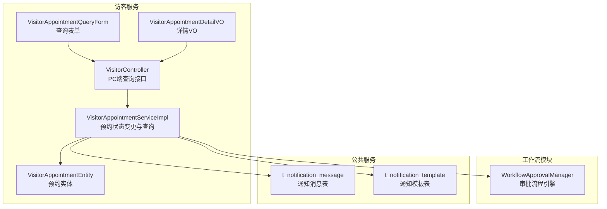
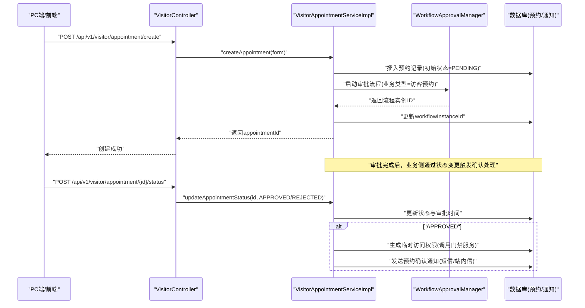
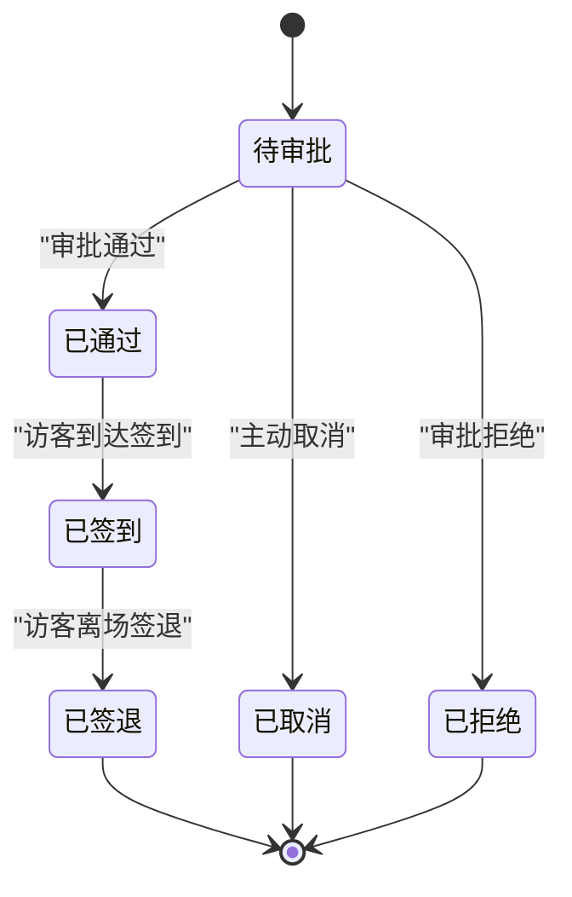
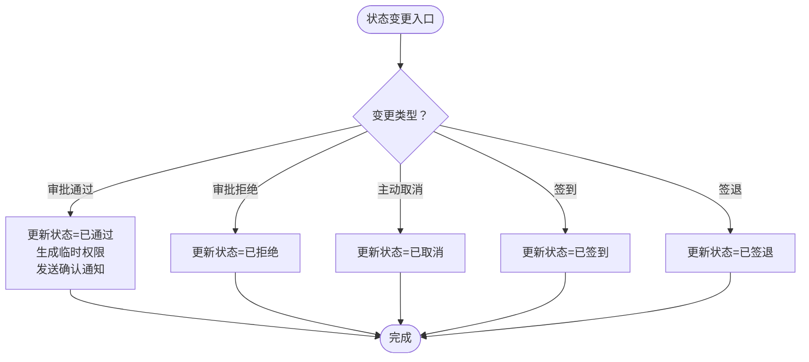
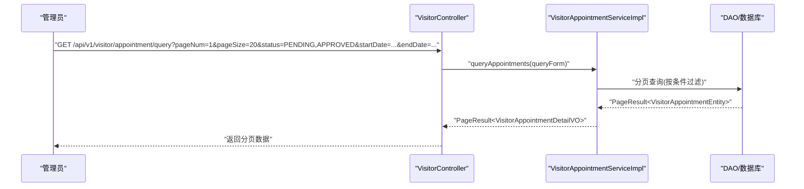
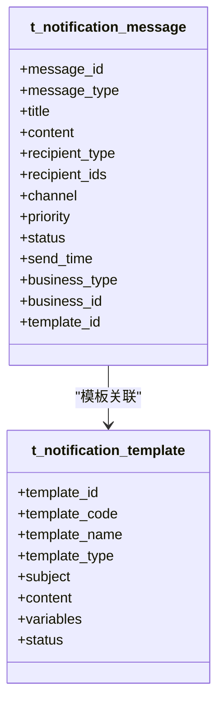
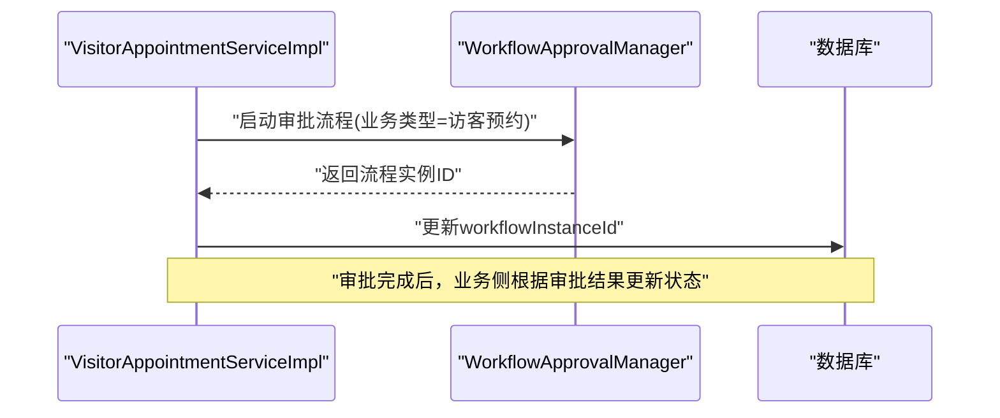
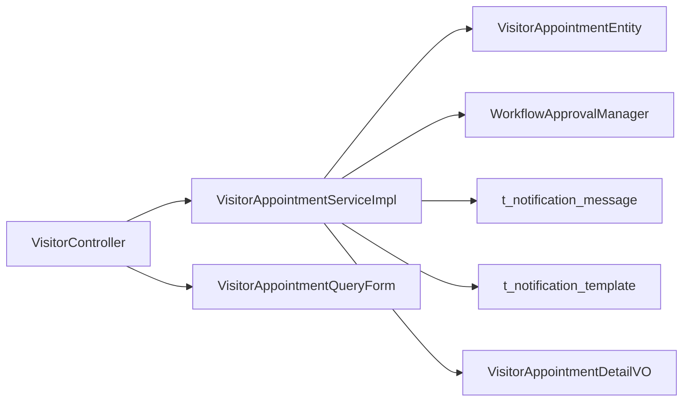

# 预约状态管理

<cite>
**本文引用的文件**
- [VisitorAppointmentEntity.java](file://microservices/ioedream-visitor-service/src/main/java/net/lab1024/sa/visitor/domain/entity/VisitorAppointmentEntity.java)
- [VisitorAppointmentServiceImpl.java](file://microservices/ioedream-visitor-service/src/main/java/net/lab1024/sa/visitor/service/impl/VisitorAppointmentServiceImpl.java)
- [VisitorController.java](file://microservices/ioedream-visitor-service/src/main/java/net/lab1024/sa/visitor/controller/VisitorController.java)
- [VisitorAppointmentQueryForm.java](file://microservices/ioedream-visitor-service/src/main/java/net/lab1024/sa/visitor/domain/form/VisitorAppointmentQueryForm.java)
- [VisitorAppointmentDetailVO.java](file://microservices/ioedream-visitor-service/src/main/java/net/lab1024/sa/visitor/domain/vo/VisitorAppointmentDetailVO.java)
- [12-前端API接口设计.md](file://documentation/03-业务模块/访客/12-前端API接口设计.md)
- [t_notification_message.sql](file://database-scripts/common-service/07-t_notification_message.sql)
- [t_notification_template.sql](file://database-scripts/common-service/08-t_notification_template.sql)
- [smart-workflow.md](file://documentation/technical/smart-workflow.md)
- [VisitorDetailModal.vue](file://smart-admin-web-javascript/src/views/business/visitor/components/VisitorDetailModal.vue)
</cite>

## 目录
1. [简介](#简介)
2. [项目结构](#项目结构)
3. [核心组件](#核心组件)
4. [架构总览](#架构总览)
5. [详细组件分析](#详细组件分析)
6. [依赖关系分析](#依赖关系分析)
7. [性能考量](#性能考量)
8. [故障排查指南](#故障排查指南)
9. [结论](#结论)
10. [附录](#附录)

## 简介
本文件围绕访客预约状态生命周期进行系统化说明，覆盖状态定义、流转规则、触发条件、业务逻辑、查询API使用、以及状态变更通知机制（站内信、短信、邮件、WebSocket）。目标读者既包括一线开发者，也包括产品与运营人员，帮助快速理解与落地使用。

## 项目结构
访客预约状态管理由“访客服务”后端模块提供能力，并通过统一的API对外暴露；通知能力由“公共服务”的通知模块支撑；审批流程由“工作流模块”提供。

图表来源
- [VisitorController.java](file://microservices/ioedream-visitor-service/src/main/java/net/lab1024/sa/visitor/controller/VisitorController.java#L84-L133)
- [VisitorAppointmentServiceImpl.java](file://microservices/ioedream-visitor-service/src/main/java/net/lab1024/sa/visitor/service/impl/VisitorAppointmentServiceImpl.java#L62-L127)
- [VisitorAppointmentEntity.java](file://microservices/ioedream-visitor-service/src/main/java/net/lab1024/sa/visitor/domain/entity/VisitorAppointmentEntity.java#L85-L122)
- [VisitorAppointmentQueryForm.java](file://microservices/ioedream-visitor-service/src/main/java/net/lab1024/sa/visitor/domain/form/VisitorAppointmentQueryForm.java#L41-L75)
- [VisitorAppointmentDetailVO.java](file://microservices/ioedream-visitor-service/src/main/java/net/lab1024/sa/visitor/domain/vo/VisitorAppointmentDetailVO.java#L21-L89)
- [t_notification_message.sql](file://database-scripts/common-service/07-t_notification_message.sql#L8-L40)
- [t_notification_template.sql](file://database-scripts/common-service/08-t_notification_template.sql#L8-L28)

章节来源
- [VisitorController.java](file://microservices/ioedream-visitor-service/src/main/java/net/lab1024/sa/visitor/controller/VisitorController.java#L84-L133)
- [VisitorAppointmentServiceImpl.java](file://microservices/ioedream-visitor-service/src/main/java/net/lab1024/sa/visitor/service/impl/VisitorAppointmentServiceImpl.java#L62-L127)
- [VisitorAppointmentEntity.java](file://microservices/ioedream-visitor-service/src/main/java/net/lab1024/sa/visitor/domain/entity/VisitorAppointmentEntity.java#L85-L122)
- [VisitorAppointmentQueryForm.java](file://microservices/ioedream-visitor-service/src/main/java/net/lab1024/sa/visitor/domain/form/VisitorAppointmentQueryForm.java#L41-L75)
- [VisitorAppointmentDetailVO.java](file://microservices/ioedream-visitor-service/src/main/java/net/lab1024/sa/visitor/domain/vo/VisitorAppointmentDetailVO.java#L21-L89)
- [t_notification_message.sql](file://database-scripts/common-service/07-t_notification_message.sql#L8-L40)
- [t_notification_template.sql](file://database-scripts/common-service/08-t_notification_template.sql#L8-L28)

## 核心组件
- 预约实体：定义预约状态字段与关联工作流实例ID，支撑状态持久化与审批关联。
- 服务实现：封装预约创建、状态变更、查询、权限生成与通知发送等业务逻辑。
- 控制器：提供PC端分页查询接口，支持多条件筛选与分页。
- 查询表单与详情VO：标准化查询参数与返回结构，便于前后端契约一致。
- 工作流：通过审批流程引擎驱动状态变更（如“已通过/已拒绝”）。
- 通知：基于通知消息表与模板表，支持站内信、短信、邮件等渠道。

章节来源
- [VisitorAppointmentEntity.java](file://microservices/ioedream-visitor-service/src/main/java/net/lab1024/sa/visitor/domain/entity/VisitorAppointmentEntity.java#L85-L122)
- [VisitorAppointmentServiceImpl.java](file://microservices/ioedream-visitor-service/src/main/java/net/lab1024/sa/visitor/service/impl/VisitorAppointmentServiceImpl.java#L155-L177)
- [VisitorController.java](file://microservices/ioedream-visitor-service/src/main/java/net/lab1024/sa/visitor/controller/VisitorController.java#L84-L133)
- [VisitorAppointmentQueryForm.java](file://microservices/ioedream-visitor-service/src/main/java/net/lab1024/sa/visitor/domain/form/VisitorAppointmentQueryForm.java#L41-L75)
- [VisitorAppointmentDetailVO.java](file://microservices/ioedream-visitor-service/src/main/java/net/lab1024/sa/visitor/domain/vo/VisitorAppointmentDetailVO.java#L21-L89)

## 架构总览
下面的序列图展示了“创建预约并启动审批流程”的关键交互，以及“审批通过后”的确认处理链路（权限生成与通知发送）。

图表来源
- [VisitorController.java](file://microservices/ioedream-visitor-service/src/main/java/net/lab1024/sa/visitor/controller/VisitorController.java#L84-L133)
- [VisitorAppointmentServiceImpl.java](file://microservices/ioedream-visitor-service/src/main/java/net/lab1024/sa/visitor/service/impl/VisitorAppointmentServiceImpl.java#L62-L127)
- [VisitorAppointmentServiceImpl.java](file://microservices/ioedream-visitor-service/src/main/java/net/lab1024/sa/visitor/service/impl/VisitorAppointmentServiceImpl.java#L155-L177)

## 详细组件分析

### 状态定义与生命周期
- 状态字段：实体中包含状态字段，支持“待审批、已通过、已拒绝、已取消、已签到、已签退”等状态。
- 工作流集成：预约创建时启动审批流程，审批结果映射为“已通过/已拒绝”，并与实体状态保持一致。
- 签到/签退：系统支持签到与签退操作，分别对应“已签到/已签退”。

图表来源
- [VisitorAppointmentEntity.java](file://microservices/ioedream-visitor-service/src/main/java/net/lab1024/sa/visitor/domain/entity/VisitorAppointmentEntity.java#L85-L122)
- [VisitorDetailModal.vue](file://smart-admin-web-javascript/src/views/business/visitor/components/VisitorDetailModal.vue#L248-L271)

章节来源
- [VisitorAppointmentEntity.java](file://microservices/ioedream-visitor-service/src/main/java/net/lab1024/sa/visitor/domain/entity/VisitorAppointmentEntity.java#L85-L122)
- [VisitorDetailModal.vue](file://smart-admin-web-javascript/src/views/business/visitor/components/VisitorDetailModal.vue#L248-L271)

### 状态变更触发条件与业务逻辑
- 创建预约：初始化状态为“待审批”，同时启动审批流程，保存流程实例ID。
- 审批通过：更新状态为“已通过”，执行预约确认后的业务逻辑：
  - 生成临时访问权限（调用门禁服务接口）
  - 发送预约确认通知（短信/站内信）
- 审批拒绝：更新状态为“已拒绝”，不生成权限。
- 主动取消：由前台或后台发起取消，更新状态为“已取消”。
- 签到/签退：由访客或门禁系统触发，分别更新为“已签到/已签退”。

图表来源
- [VisitorAppointmentServiceImpl.java](file://microservices/ioedream-visitor-service/src/main/java/net/lab1024/sa/visitor/service/impl/VisitorAppointmentServiceImpl.java#L155-L177)
- [VisitorAppointmentServiceImpl.java](file://microservices/ioedream-visitor-service/src/main/java/net/lab1024/sa/visitor/service/impl/VisitorAppointmentServiceImpl.java#L190-L210)
- [VisitorAppointmentServiceImpl.java](file://microservices/ioedream-visitor-service/src/main/java/net/lab1024/sa/visitor/service/impl/VisitorAppointmentServiceImpl.java#L212-L261)
- [VisitorAppointmentServiceImpl.java](file://microservices/ioedream-visitor-service/src/main/java/net/lab1024/sa/visitor/service/impl/VisitorAppointmentServiceImpl.java#L263-L421)

章节来源
- [VisitorAppointmentServiceImpl.java](file://microservices/ioedream-visitor-service/src/main/java/net/lab1024/sa/visitor/service/impl/VisitorAppointmentServiceImpl.java#L155-L177)
- [VisitorAppointmentServiceImpl.java](file://microservices/ioedream-visitor-service/src/main/java/net/lab1024/sa/visitor/service/impl/VisitorAppointmentServiceImpl.java#L190-L210)
- [VisitorAppointmentServiceImpl.java](file://microservices/ioedream-visitor-service/src/main/java/net/lab1024/sa/visitor/service/impl/VisitorAppointmentServiceImpl.java#L212-L261)
- [VisitorAppointmentServiceImpl.java](file://microservices/ioedream-visitor-service/src/main/java/net/lab1024/sa/visitor/service/impl/VisitorAppointmentServiceImpl.java#L263-L421)

### 状态查询API使用
- 接口：PC端分页查询预约列表
- 方法：GET
- 路径：/api/v1/visitor/appointment/query
- 参数：
  - pageNum/pageSize：分页参数
  - visitorName：访客姓名（模糊）
  - hostUserId：被访人ID
  - startDate/endDate：时间范围
  - status：状态过滤（支持多个状态逗号分隔）
- 返回：PageResult<VisitorAppointmentDetailVO>
- 权限：需要VISITOR_MANAGER角色

图表来源
- [VisitorController.java](file://microservices/ioedream-visitor-service/src/main/java/net/lab1024/sa/visitor/controller/VisitorController.java#L84-L133)
- [VisitorAppointmentServiceImpl.java](file://microservices/ioedream-visitor-service/src/main/java/net/lab1024/sa/visitor/service/impl/VisitorAppointmentServiceImpl.java#L423-L485)
- [VisitorAppointmentQueryForm.java](file://microservices/ioedream-visitor-service/src/main/java/net/lab1024/sa/visitor/domain/form/VisitorAppointmentQueryForm.java#L41-L75)
- [VisitorAppointmentDetailVO.java](file://microservices/ioedream-visitor-service/src/main/java/net/lab1024/sa/visitor/domain/vo/VisitorAppointmentDetailVO.java#L21-L89)

章节来源
- [VisitorController.java](file://microservices/ioedream-visitor-service/src/main/java/net/lab1024/sa/visitor/controller/VisitorController.java#L84-L133)
- [VisitorAppointmentServiceImpl.java](file://microservices/ioedream-visitor-service/src/main/java/net/lab1024/sa/visitor/service/impl/VisitorAppointmentServiceImpl.java#L423-L485)
- [VisitorAppointmentQueryForm.java](file://microservices/ioedream-visitor-service/src/main/java/net/lab1024/sa/visitor/domain/form/VisitorAppointmentQueryForm.java#L41-L75)
- [VisitorAppointmentDetailVO.java](file://microservices/ioedream-visitor-service/src/main/java/net/lab1024/sa/visitor/domain/vo/VisitorAppointmentDetailVO.java#L21-L89)

### 状态变更通知机制
- 通知渠道：
  - 短信：向访客手机号发送预约确认短信
  - 站内信/微信：向被访人发送提醒（WebSocket通道）
- 通知内容：
  - 预约状态变更通知（类型：APPOINTMENT_STATUS_CHANGE）
  - 访客到达通知（类型：VISITOR_ARRIVAL）
  - 访客离开通知（类型：VISITOR_DEPARTURE）
- 通知存储：
  - 通知消息表：记录消息类型、标题、内容、接收人、渠道、优先级、状态等
  - 通知模板表：模板编码、模板类型、主题、内容、变量列表等

图表来源
- [t_notification_message.sql](file://database-scripts/common-service/07-t_notification_message.sql#L8-L40)
- [t_notification_template.sql](file://database-scripts/common-service/08-t_notification_template.sql#L8-L28)

章节来源
- [VisitorAppointmentServiceImpl.java](file://microservices/ioedream-visitor-service/src/main/java/net/lab1024/sa/visitor/service/impl/VisitorAppointmentServiceImpl.java#L263-L421)
- [t_notification_message.sql](file://database-scripts/common-service/07-t_notification_message.sql#L8-L40)
- [t_notification_template.sql](file://database-scripts/common-service/08-t_notification_template.sql#L8-L28)
- [12-前端API接口设计.md](file://documentation/03-业务模块/访客/12-前端API接口设计.md#L1136-L1193)

### 审批流程与状态映射
- 工作流模块提供流程引擎与任务处理能力，访客预约集成审批流程。
- 审批通过/拒绝会更新业务状态，服务实现中根据状态执行后续动作（如权限生成与通知）。

图表来源
- [VisitorAppointmentServiceImpl.java](file://microservices/ioedream-visitor-service/src/main/java/net/lab1024/sa/visitor/service/impl/VisitorAppointmentServiceImpl.java#L62-L127)
- [smart-workflow.md](file://documentation/technical/smart-workflow.md#L941-L1279)

章节来源
- [VisitorAppointmentServiceImpl.java](file://microservices/ioedream-visitor-service/src/main/java/net/lab1024/sa/visitor/service/impl/VisitorAppointmentServiceImpl.java#L62-L127)
- [smart-workflow.md](file://documentation/technical/smart-workflow.md#L941-L1279)

## 依赖关系分析
- 控制器依赖服务层，服务层依赖DAO与工作流模块、公共服务（通知）。
- 实体与查询表单/VO构成稳定的领域模型与传输对象契约。
- 通知模块通过消息表与模板表支撑多渠道通知。

图表来源
- [VisitorController.java](file://microservices/ioedream-visitor-service/src/main/java/net/lab1024/sa/visitor/controller/VisitorController.java#L84-L133)
- [VisitorAppointmentServiceImpl.java](file://microservices/ioedream-visitor-service/src/main/java/net/lab1024/sa/visitor/service/impl/VisitorAppointmentServiceImpl.java#L62-L127)
- [VisitorAppointmentEntity.java](file://microservices/ioedream-visitor-service/src/main/java/net/lab1024/sa/visitor/domain/entity/VisitorAppointmentEntity.java#L85-L122)
- [VisitorAppointmentQueryForm.java](file://microservices/ioedream-visitor-service/src/main/java/net/lab1024/sa/visitor/domain/form/VisitorAppointmentQueryForm.java#L41-L75)
- [VisitorAppointmentDetailVO.java](file://microservices/ioedream-visitor-service/src/main/java/net/lab1024/sa/visitor/domain/vo/VisitorAppointmentDetailVO.java#L21-L89)
- [t_notification_message.sql](file://database-scripts/common-service/07-t_notification_message.sql#L8-L40)
- [t_notification_template.sql](file://database-scripts/common-service/08-t_notification_template.sql#L8-L28)

章节来源
- [VisitorController.java](file://microservices/ioedream-visitor-service/src/main/java/net/lab1024/sa/visitor/controller/VisitorController.java#L84-L133)
- [VisitorAppointmentServiceImpl.java](file://microservices/ioedream-visitor-service/src/main/java/net/lab1024/sa/visitor/service/impl/VisitorAppointmentServiceImpl.java#L62-L127)
- [VisitorAppointmentEntity.java](file://microservices/ioedream-visitor-service/src/main/java/net/lab1024/sa/visitor/domain/entity/VisitorAppointmentEntity.java#L85-L122)
- [VisitorAppointmentQueryForm.java](file://microservices/ioedream-visitor-service/src/main/java/net/lab1024/sa/visitor/domain/form/VisitorAppointmentQueryForm.java#L41-L75)
- [VisitorAppointmentDetailVO.java](file://microservices/ioedream-visitor-service/src/main/java/net/lab1024/sa/visitor/domain/vo/VisitorAppointmentDetailVO.java#L21-L89)
- [t_notification_message.sql](file://database-scripts/common-service/07-t_notification_message.sql#L8-L40)
- [t_notification_template.sql](file://database-scripts/common-service/08-t_notification_template.sql#L8-L28)

## 性能考量
- 分页查询：建议合理设置默认分页大小与最大限制，避免一次性返回过多数据。
- 索引优化：针对常用过滤字段（如被访人ID、时间范围、状态）建立索引，提升查询效率。
- 通知异步化：通知发送建议采用异步队列或定时任务，避免阻塞主流程。
- 权限生成幂等：权限创建接口需保证幂等性，避免重复创建导致资源浪费。

## 故障排查指南
- 审批流程启动失败：检查工作流引擎可用性与业务类型配置，查看服务层异常日志。
- 通知发送失败：核对通知消息表状态字段与渠道配置，确认模板是否存在且启用。
- 权限生成失败：检查门禁服务接口连通性与参数构造，关注服务层捕获的异常日志。
- 查询无结果：确认查询参数（如状态、时间范围、被访人ID）是否正确，必要时缩小范围定位。

章节来源
- [VisitorAppointmentServiceImpl.java](file://microservices/ioedream-visitor-service/src/main/java/net/lab1024/sa/visitor/service/impl/VisitorAppointmentServiceImpl.java#L112-L127)
- [VisitorAppointmentServiceImpl.java](file://microservices/ioedream-visitor-service/src/main/java/net/lab1024/sa/visitor/service/impl/VisitorAppointmentServiceImpl.java#L247-L261)
- [VisitorAppointmentServiceImpl.java](file://microservices/ioedream-visitor-service/src/main/java/net/lab1024/sa/visitor/service/impl/VisitorAppointmentServiceImpl.java#L318-L346)
- [VisitorAppointmentServiceImpl.java](file://microservices/ioedream-visitor-service/src/main/java/net/lab1024/sa/visitor/service/impl/VisitorAppointmentServiceImpl.java#L383-L414)

## 结论
访客预约状态管理通过“实体-服务-控制器-工作流-通知”的协同，实现了从创建、审批、确认到签到/签退的全生命周期闭环。查询API提供了灵活的筛选与分页能力，通知机制覆盖短信与站内信/微信等渠道，满足多角色的即时沟通需求。建议在生产环境中进一步完善索引、异步化与幂等性设计，确保系统的稳定性与扩展性。

## 附录
- 状态枚举与含义参考前端展示映射，便于统一认知。
- 审批流程与任务处理能力由工作流模块提供，服务层通过流程实例ID与业务状态联动。

章节来源
- [VisitorDetailModal.vue](file://smart-admin-web-javascript/src/views/business/visitor/components/VisitorDetailModal.vue#L248-L271)
- [smart-workflow.md](file://documentation/technical/smart-workflow.md#L941-L1279)