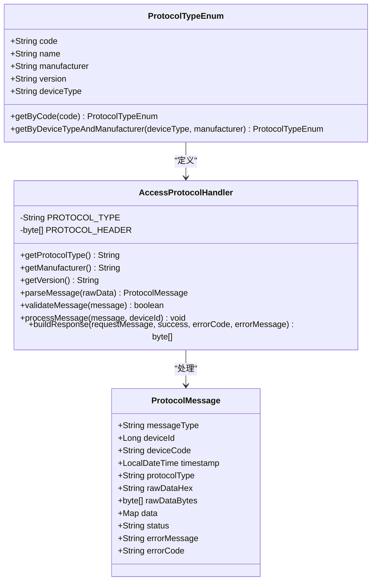
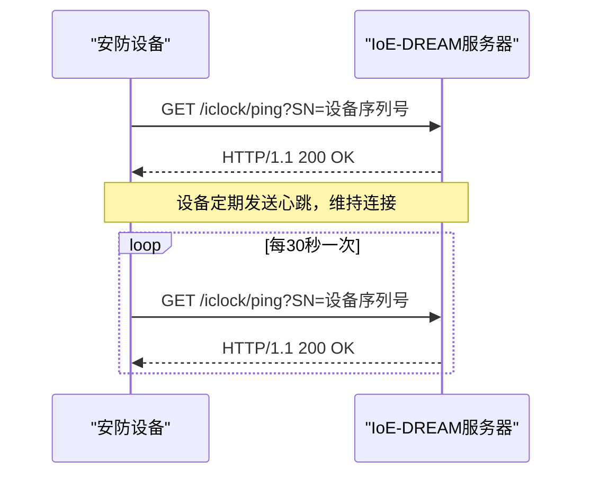
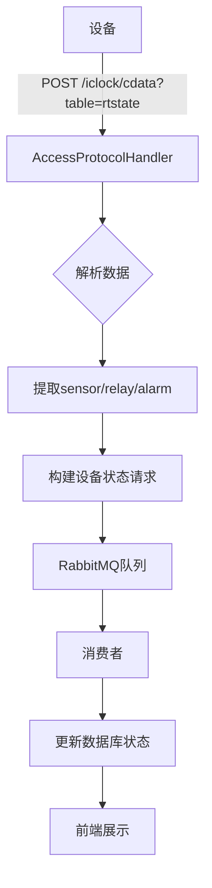
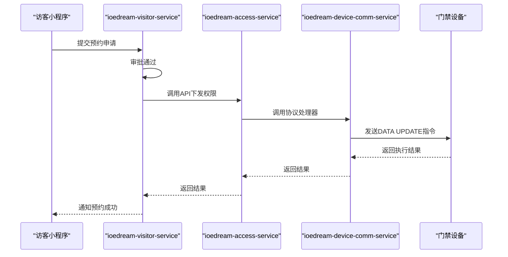

# 设备集成与通讯

<cite>
**本文档引用文件**   
- [MinerU_安防PUSH通讯协议 （熵基科技）V4.8-20240107(水印版)__20251206181130.md](file://docs/各个设备通讯协议/MinerU_安防PUSH通讯协议 （熵基科技）V4.8-20240107(水印版)__20251206181130.md)
- [AccessProtocolHandler.java](file://microservices/ioedream-device-comm-service/src/main/java/net/lab1024/sa/devicecomm/protocol/handler/impl/AccessProtocolHandler.java)
- [ProtocolMessage.java](file://microservices/ioedream-device-comm-service/src/main/java/net/lab1024/sa/devicecomm/protocol/message/ProtocolMessage.java)
- [ProtocolTypeEnum.java](file://microservices/ioedream-device-comm-service/src/main/java/net/lab1024/sa/devicecomm/protocol/enums/ProtocolTypeEnum.java)
- [AccessEventTypeEnum.java](file://microservices/ioedream-device-comm-service/src/main/java/net/lab1024/sa/devicecomm/protocol/enums/AccessEventTypeEnum.java)
- [VerifyTypeEnum.java](file://microservices/ioedream-device-comm-service/src/main/java/net/lab1024/sa/devicecomm/protocol/enums/VerifyTypeEnum.java)
- [ProtocolHandler.java](file://microservices/ioedream-device-comm-service/src/main/java/net/lab1024/sa/devicecomm/protocol/handler/ProtocolHandler.java)
- [AccessDeviceController.java](file://microservices/ioedream-access-service/src/main/java/net/lab1024/sa/access/controller/AccessDeviceController.java)
- [VisitorController.java](file://microservices/ioedream-visitor-service/src/main/java/net/lab1024/sa/visitor/controller/VisitorController.java)
</cite>

## 目录
1. [引言](#引言)
2. [MinerU安防PUSH通讯协议集成](#mineru安防push通讯协议集成)
3. [门禁设备状态监控](#门禁设备状态监控)
4. [通行指令与响应机制](#通行指令与响应机制)
5. [设备固件远程升级](#设备固件远程升级)
6. [大规模设备批量配置](#大规模设备批量配置)
7. [结论](#结论)

## 引言
本文档详细阐述了访客系统与安防设备的集成方案，重点围绕基于MinerU安防PUSH通讯协议的设备接入流程。文档涵盖了协议版本兼容性、心跳机制、数据加密方式等核心通信规范，以及门禁设备状态监控、异常处理、通行指令发送与确认、固件远程升级和批量配置等关键功能的实现方法。通过本指南，开发人员和运维人员可以全面了解系统与熵基科技安防设备的集成细节，确保系统的稳定、安全和高效运行。

## MinerU安防PUSH通讯协议集成

### 协议版本与兼容性
系统集成了MinerU安防PUSH通讯协议（熵基科技）V4.8版本，该协议是基于HTTP协议的文本格式数据交互协议。系统通过`ProtocolTypeEnum`枚举类明确定义了协议类型，确保了与不同厂商和版本设备的兼容性。

**Diagram sources**
- [ProtocolTypeEnum.java](file://microservices/ioedream-device-comm-service/src/main/java/net/lab1024/sa/devicecomm/protocol/enums/ProtocolTypeEnum.java#L18-L110)
- [AccessProtocolHandler.java](file://microservices/ioedream-device-comm-service/src/main/java/net/lab1024/sa/devicecomm/protocol/handler/impl/AccessProtocolHandler.java#L48-L88)
- [ProtocolMessage.java](file://microservices/ioedream-device-comm-service/src/main/java/net/lab1024/sa/devicecomm/protocol/message/ProtocolMessage.java#L22-L93)

**Section sources**
- [MinerU_安防PUSH通讯协议 （熵基科技）V4.8-20240107(水印版)__20251206181130.md](file://docs/各个设备通讯协议/MinerU_安防PUSH通讯协议 （熵基科技）V4.8-20240107(水印版)__20251206181130.md#L17-L19)
- [ProtocolTypeEnum.java](file://microservices/ioedream-device-comm-service/src/main/java/net/lab1024/sa/devicecomm/protocol/enums/ProtocolTypeEnum.java#L29)

### 心跳机制
为了维持设备与服务器之间的长连接并检测设备在线状态，系统实现了心跳机制。设备通过定期向服务器发送`GET /iclock/ping`请求来报告其在线状态。服务器接收到心跳请求后，返回`200 OK`响应，确认连接正常。此机制确保了服务器能够及时发现离线设备，并触发相应的告警或恢复流程。

**Diagram sources**
- [MinerU_安防PUSH通讯协议 （熵基科技）V4.8-20240107(水印版)__20251206181130.md#L1652-L1725](file://docs/各个设备通讯协议/MinerU_安防PUSH通讯协议 （熵基科技）V4.8-20240107(水印版)__20251206181130.md#L1652-L1725)

### 数据加密方式
为确保通信数据的安全性，MinerU安防PUSH通讯协议支持通信加密。在设备与服务器建立连接的初始化阶段，双方会进行密钥交换：
1.  **交换公钥**：设备首先向服务器发送`POST /iclock/exchange?type=publickey`请求，将自己的公钥上传给服务器。
2.  **交换因子**：随后，设备再发送`POST /iclock/exchange?type=factors`请求，上传加密因子。
服务器在接收到设备的公钥和因子后，会返回自己的公钥和因子。双方利用这些信息生成会话密钥，后续的通信数据将使用该密钥进行加密，有效防止了数据在传输过程中的窃听和篡改。

**Section sources**
- [MinerU_安防PUSH通讯协议 （熵基科技）V4.8-20240107(水印版)__20251206181130.md](file://docs/各个设备通讯协议/MinerU_安防PUSH通讯协议 （熵基科技）V4.8-20240107(水印版)__20251206181130.md#L626-L768)

## 门禁设备状态监控

### 状态监控实现
系统通过解析设备上传的实时状态数据来实现对门禁设备的全面监控。设备会通过`POST /iclock/cdata?table=rtstate`接口，以键值对的形式上传其当前状态，主要包括：
*   **sensor**：门磁状态，表示门的开关状态。
*   **relay**：继电器状态，表示开门继电器的吸合或断开。
*   **alarm**：报警状态，包含市电掉电、电池掉电、防拆报警等多种报警信息。

`AccessProtocolHandler`中的`processDeviceStatus`方法负责处理这些状态数据，并将其发送到RabbitMQ消息队列中，由专门的消费者异步处理，更新数据库中的设备状态。

**Diagram sources**
- [MinerU_安防PUSH通讯协议 （熵基科技）V4.8-20240107(水印版)__20251206181130.md#L1885-L1997](file://docs/各个设备通讯协议/MinerU_安防PUSH通讯协议 （熵基科技）V4.8-20240107(水印版)__20251206181130.md#L1885-L1997)
- [AccessProtocolHandler.java](file://microservices/ioedream-device-comm-service/src/main/java/net/lab1024/sa/devicecomm/protocol/handler/impl/AccessProtocolHandler.java#L613-L663)

### 异常情况处理策略
系统对设备的异常情况有完善的处理策略：
*   **设备离线**：当服务器在预设的心跳间隔内未收到设备的心跳包时，判定设备离线。系统会记录离线事件，并通过告警系统通知管理员。
*   **设备故障**：当设备上传的`alarm`字段中包含特定的报警码（如防拆报警、市电掉电等）时，`processAlarmEvent`方法会将其识别为故障事件，并触发告警。
*   **数据解析失败**：如果`AccessProtocolHandler`在解析设备上传的数据时发生异常，会捕获`ProtocolParseException`，记录错误日志，并返回错误响应，同时不会中断其他正常消息的处理，保证了系统的健壮性。

**Section sources**
- [AccessProtocolHandler.java](file://microservices/ioedream-device-comm-service/src/main/java/net/lab1024/sa/devicecomm/protocol/handler/impl/AccessProtocolHandler.java#L290-L334)

## 通行指令与响应机制

### 通行指令发送机制
当访客通过访客系统完成预约并获得通行权限后，系统会通过`AccessDeviceController`向门禁设备下发通行指令。指令的下发遵循MinerU协议的`DATA UPDATE`命令格式，将用户的权限信息（如卡号、有效期、通行权限等）推送给指定的设备。

**Diagram sources**
- [VisitorController.java](file://microservices/ioedream-visitor-service/src/main/java/net/lab1024/sa/visitor/controller/VisitorController.java#L52-L192)
- [AccessDeviceController.java](file://microservices/ioedream-access-service/src/main/java/net/lab1024/sa/access/controller/AccessDeviceController.java#L50-L228)

### 设备响应确认流程
设备在接收到服务器下发的指令（如`DATA UPDATE`、`CONTROL DEVICE`等）后，会执行相应的操作。操作完成后，设备会通过`POST /iclock/devicecmd`接口，将命令的执行结果回传给服务器。回传的数据包含`ID`（命令ID）、`Return`（返回值，0表示成功）、`CMD`（命令类型）等关键信息。服务器接收到此响应后，即可确认指令已成功执行，从而完成整个指令闭环。

**Section sources**
- [MinerU_安防PUSH通讯协议 （熵基科技）V4.8-20240107(水印版)__20251206181130.md](file://docs/各个设备通讯协议/MinerU_安防PUSH通讯协议 （熵基科技）V4.8-20240107(水印版)__20251206181130.md#L1999-L2115)

## 设备固件远程升级

### 远程管理方案
系统支持对门禁设备进行远程固件升级。通过`CONTROL DEVICE`命令中的`UPGRADE`子命令，服务器可以向设备推送新的固件文件。设备在接收到升级指令后，会从指定的URL下载固件包，并在重启后完成升级。整个过程无需人工现场操作，极大地提高了运维效率。

### 安全注意事项
在执行远程升级时，必须严格遵守以下安全规范：
1.  **版本验证**：升级前必须验证新固件的版本号和完整性，确保与设备型号匹配。
2.  **分批升级**：对于大规模部署，应采用分批升级策略，先在少量设备上验证，再逐步推广，避免因固件问题导致大面积设备瘫痪。
3.  **回滚机制**：确保设备具备固件回滚能力，当新固件出现严重问题时，能够快速恢复到稳定版本。
4.  **网络保障**：升级过程需要稳定的网络连接，应在网络状况良好的时段进行。

**Section sources**
- [MinerU_安防PUSH通讯协议 （熵基科技）V4.8-20240107(水印版)__20251206181130.md](file://docs/各个设备通讯协议/MinerU_安防PUSH通讯协议 （熵基科技）V4.8-20240107(水印版)__20251206181130.md#L168-L172)

## 大规模设备批量配置
对于大规模设备部署，系统提供了批量配置功能。管理员可以通过`AccessDeviceController`的批量接口，一次性导入大量设备的配置信息（如IP地址、序列号、所属区域等）。系统会自动为这些设备生成配置，并通过PUSH协议批量下发，实现设备的快速上线和统一管理，显著降低了部署成本和时间。

**Section sources**
- [AccessDeviceController.java](file://microservices/ioedream-access-service/src/main/java/net/lab1024/sa/access/controller/AccessDeviceController.java#L50-L228)

## 结论
本文档详细说明了访客系统与安防设备的集成方案。通过采用MinerU安防PUSH通讯协议V4.8，系统实现了与熵基科技设备的稳定、安全通信。心跳机制和状态监控确保了设备的在线和健康，通行指令与响应机制形成了完整的业务闭环。远程升级和批量配置功能则为大规模部署和高效运维提供了有力支持。该集成方案为构建一个智能化、高可用的访客与安防一体化系统奠定了坚实的基础。