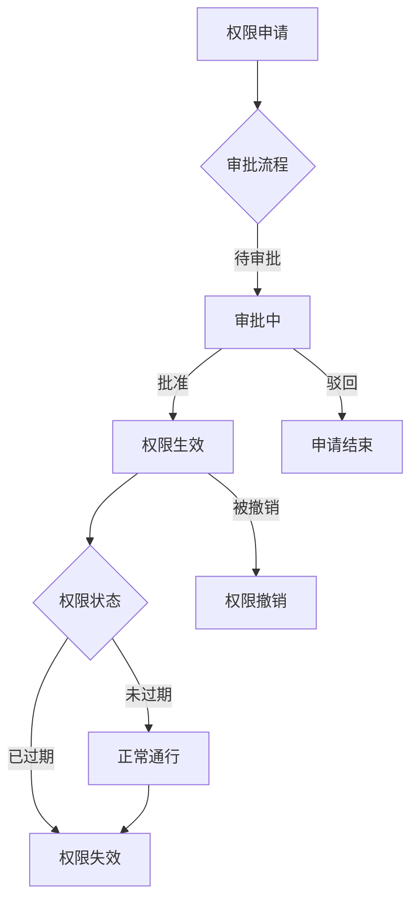
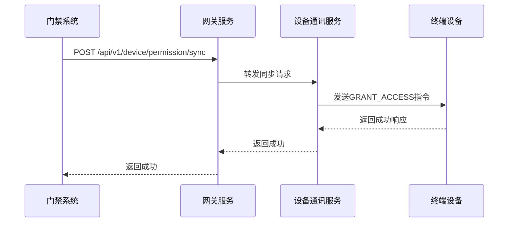
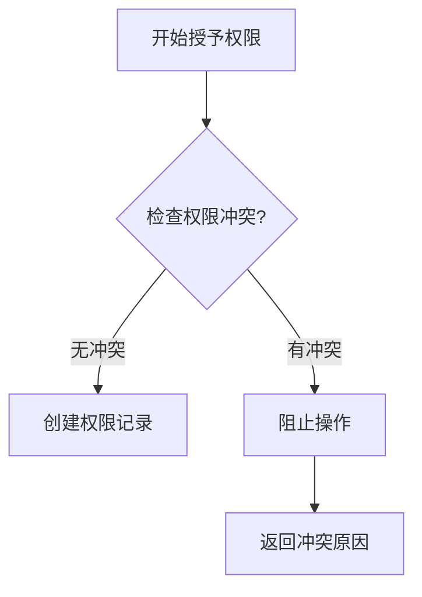

# 通行权限管理

<cite>
**本文档引用文件**   
- [AccessPermissionApplyController.java](file://microservices\ioedream-access-service\src\main\java\net\lab1024\sa\access\controller\AccessPermissionApplyController.java)
- [AccessPermissionApplyService.java](file://microservices\ioedream-access-service\src\main\java\net\lab1024\sa\access\service\AccessPermissionApplyService.java)
- [AccessPermissionApplyServiceImpl.java](file://microservices\ioedream-access-service\src\main\java\net\lab1024\sa\access\service\impl\AccessPermissionApplyServiceImpl.java)
- [AccessPermissionApplyEntity.java](file://microservices\ioedream-access-service\src\main\java\net\lab1024\sa\access\domain\entity\AccessPermissionApplyEntity.java)
- [AccessPermissionApplyForm.java](file://microservices\ioedream-access-service\src\main\java\net\lab1024\sa\access\domain\form\AccessPermissionApplyForm.java)
- [TcpDeviceConnection.java](file://documentation\technical\smart-access.md)
- [AccessEmergencyPermissionController.java](file://microservices\ioedream-access-service\src\main\java\net\lab1024\sa\access\controller\AccessEmergencyPermissionController.java)
- [smart-access.md](file://documentation\technical\smart-access.md)
- [11-关键控制点和性能指标.md](file://documentation\03-业务模块\门禁\11-关键控制点和性能指标.md)
</cite>

## 目录
1. [引言](#引言)
2. [临时通行权限生成机制](#临时通行权限生成机制)
3. [权限生命周期管理流程](#权限生命周期管理流程)
4. [权限数据下发与设备验证](#权限数据下发与设备验证)
5. [权限状态查询与撤销机制](#权限状态查询与撤销机制)
6. [权限冲突处理策略](#权限冲突处理策略)
7. [高并发场景性能优化](#高并发场景性能优化)
8. [结论](#结论)

## 引言

本文档详细阐述了IoE-DREAM项目中访客通行权限管理系统的完整实现方案。系统基于微服务架构，通过`ioedream-access-service`微服务实现核心权限管理功能，与`ioedream-visitor-service`、`ioedream-device-comm-service`等服务协同工作，构建了一个集权限申请、审批、生效、过期、撤销于一体的完整生命周期管理体系。系统严格遵循四层架构规范，采用工作流引擎实现灵活的审批流程，并通过设备通信协议确保权限信息能够实时、准确地下发到终端设备。

**本文档引用文件**   
- [AccessPermissionApplyController.java](file://microservices\ioedream-access-service\src\main\java\net\lab1024\sa\access\controller\AccessPermissionApplyController.java)
- [AccessPermissionApplyService.java](file://microservices\ioedream-access-service\src\main\java\net\lab1024\sa\access\service\AccessPermissionApplyService.java)

## 临时通行权限生成机制

### 权限编码规则

系统为每次权限申请生成唯一的申请编号（`applyNo`），该编号是权限的核心标识。编码规则为在"AP"前缀后拼接当前系统时间戳（毫秒级），确保了全局唯一性和可追溯性。此编号贯穿权限的整个生命周期，用于关联审批流程、权限记录和设备同步。

```java
private String generateApplyNo() {
    return "AP" + System.currentTimeMillis();
}
```

### 有效期设置

临时通行权限的有效期由申请表单中的`startTime`和`endTime`两个字段精确控制。这两个字段为`LocalDateTime`类型，允许精确到秒的时间设置。系统在权限生效时会检查`startTime`是否已到达，在权限过期检查时会验证`endTime`是否已过期，从而实现对权限有效期的精准管理。

### 权限级别配置

权限级别通过`applyType`字段进行配置，目前支持两种类型：
- `NORMAL`：普通权限申请，遵循标准的多级审批流程。
- `EMERGENCY`：紧急权限申请，采用简化审批流程，通常在24小时内自动过期。

```java
public static final String APPLY_TYPE_NORMAL = "NORMAL";
public static final String APPLY_TYPE_EMERGENCY = "EMERGENCY";
```

**本文档引用文件**   
- [AccessPermissionApplyForm.java](file://microservices\ioedream-access-service\src\main\java\net\lab1024\sa\access\domain\form\AccessPermissionApplyForm.java)
- [AccessPermissionApplyEntity.java](file://microservices\ioedream-access-service\src\main\java\net\lab1024\sa\access\domain\entity\AccessPermissionApplyEntity.java)

## 权限生命周期管理流程

### 完整生命周期流程

访客通行权限的生命周期始于申请，终于过期或撤销，其完整流程如下：



**图源**  
- [AccessPermissionApplyServiceImpl.java](file://microservices\ioedream-access-service\src\main\java\net\lab1024\sa\access\service\impl\AccessPermissionApplyServiceImpl.java)

### 申请与审批流程

1.  **权限申请**：用户通过前端界面提交`AccessPermissionApplyForm`表单，包含申请人ID、区域ID、申请类型、原因、有效期等信息。
2.  **启动审批**：`AccessPermissionApplyController`接收请求，调用`AccessPermissionApplyService`的`submitPermissionApply`方法。该方法首先在`access_permission_apply`表中创建一条状态为"PENDING"（待审批）的记录，然后调用工作流服务`WorkflowApprovalManager`启动相应的审批流程（普通或紧急）。
3.  **审批处理**：审批人通过审批工作台查看待办事项，进行审批操作。审批结果通过回调接口通知门禁系统。

### 权限生效与过期

1.  **权限生效**：当审批结果为"APPROVED"（已通过）时，系统会触发`updatePermissionApplyStatus`方法。该方法会调用`executePermissionGrant`执行权限授予逻辑。
2.  **权限授予**：系统首先检查申请人是否已拥有该区域权限，若无则创建`AreaPersonEntity`记录，建立人员与区域的权限关联，并设置`validStartTime`和`validEndTime`。
3.  **权限过期**：系统通过定时任务或在每次通行验证时检查`validEndTime`。一旦当前时间超过`validEndTime`，该权限即被视为过期，无法再用于通行。

**本文档引用文件**   
- [AccessPermissionApplyController.java](file://microservices\ioedream-access-service\src\main\java\net\lab1024\sa\access\controller\AccessPermissionApplyController.java)
- [AccessPermissionApplyServiceImpl.java](file://microservices\ioedream-access-service\src\main\java\net\lab1024\sa\access\service\impl\AccessPermissionApplyServiceImpl.java)

## 权限数据下发与设备验证

### 权限数据下发流程

权限授予成功后，系统会通过网关服务将权限信息同步到相关的门禁终端设备。具体流程如下：



**图源**  
- [AccessPermissionApplyServiceImpl.java](file://microservices\ioedream-access-service\src\main\java\net\lab1024\sa\access\service\impl\AccessPermissionApplyServiceImpl.java)

在`AccessPermissionApplyServiceImpl`中，`syncPermissionToDevices`方法通过`GatewayServiceClient`调用设备通讯服务的`/api/v1/device/permission/sync`接口，将权限信息推送至设备服务，由设备服务负责与具体设备建立连接并下发指令。

### 设备端权限验证逻辑

终端设备（如门禁机）通过TCP协议与设备通讯服务保持长连接。设备端的权限验证逻辑如下：

1.  **接收指令**：设备通过`TcpDeviceConnection`类中的`startMessageReceiver`线程持续监听来自服务端的消息。
2.  **解析指令**：当收到`ACCESS_EVENT`类型的消息时，设备会解析消息内容，获取人员ID、姓名、验证结果和时间戳。
3.  **本地验证**：设备根据内置的权限列表（从服务端同步而来）和当前时间，验证该人员在该时间点是否拥有进入该区域的权限。
4.  **执行动作**：如果验证通过，设备会控制继电器开门；如果验证失败，则拒绝通行并记录事件。

```java
private void handleAccessEvent(String content) {
    String[] eventParts = content.split(",");
    Long personId = Long.valueOf(eventParts[0]);
    String personName = eventParts[1];
    Integer result = Integer.valueOf(eventParts[2]);
    // ... 根据personId和当前时间进行权限验证
}
```

**本文档引用文件**   
- [TcpDeviceConnection.java](file://documentation\technical\smart-access.md)
- [AccessPermissionApplyServiceImpl.java](file://microservices\ioedream-access-service\src\main\java\net\lab1024\sa\access\service\impl\AccessPermissionApplyServiceImpl.java)

## 权限状态查询与撤销机制

### 权限状态查询接口

系统提供了丰富的权限状态查询接口，允许管理员和用户查询权限的当前状态。主要接口包括：

-   **查询待审批列表**：`GET /api/v1/access/permission/apply/pending-approvals`，用于获取当前用户需要审批的权限申请列表。
-   **查询个人申请历史**：`GET /api/v1/access/permission/apply/history`，用于获取特定用户的所有权限申请记录及其状态（PENDING, APPROVED, REJECTED, CANCELLED）。

这些接口通过查询`access_permission_apply`表，并结合工作流服务获取实时审批状态，返回`ApprovalStatusVO`等视图对象。

### 权限撤销机制

权限撤销分为两种情况：主动撤销和自动撤销。

1.  **主动撤销**：对于已生效的权限，管理员或特定角色用户可以通过调用`revokeAccess`接口，主动撤销某个人员的权限。系统会更新`AreaPersonEntity`的状态为失效，并向设备发送`REVOKE_ACCESS`指令。
2.  **自动撤销**：针对紧急权限，系统实现了自动过期回收机制。`AccessEmergencyPermissionController`提供了`checkAndRevokeExpiredPermission`接口，由定时任务定期调用，检查所有紧急权限的`endTime`，对已过期的权限自动执行撤销流程。

```java
@PostMapping("/{applyNo}/revoke-expired")
@Operation(summary = "检查并回收过期权限", description = "检查紧急权限是否已过期，如果过期则自动回收")
public ResponseDTO<Boolean> checkAndRevokeExpiredPermission(@PathVariable String applyNo) {
    boolean revoked = accessEmergencyPermissionService.checkAndRevokeExpiredPermission(applyNo);
    return ResponseDTO.ok(revoked);
}
```

**本文档引用文件**   
- [AccessEmergencyPermissionController.java](file://microservices\ioedream-access-service\src\main\java\net\lab1024\sa\access\controller\AccessEmergencyPermissionController.java)
- [AccessPermissionApplyServiceImpl.java](file://microservices\ioedream-access-service\src\main\java\net\lab1024\sa\access\service\impl\AccessPermissionApplyServiceImpl.java)

## 权限冲突处理策略

系统在分配权限时，会进行严格的冲突检测，以确保安全策略的执行。

### 冲突检测规则

根据系统设计文档，权限冲突检测主要包含以下规则：

-   **时间冲突**：检测新申请的权限时间段是否与用户已有的有效权限时间段重叠。
-   **区域冲突**：检测用户是否被分配了互斥的区域权限（例如，一个区域为“研发区”，另一个为“生产区”，两者互斥）。
-   **级别冲突**：检测权限的安全级别是否与用户身份或已有权限冲突。

### 处理机制

当检测到权限冲突时，系统的处理机制如下：

1.  **阻止分配**：在创建`AreaPersonEntity`记录之前，系统会调用`areaPersonDao.hasAreaPermission`等方法进行预检查。如果发现冲突，将直接阻止权限的授予，并向用户返回明确的错误提示。
2.  **提示原因**：错误信息会明确指出冲突的具体原因（如“与现有权限时间重叠”或“区域权限互斥”），帮助用户理解问题所在。



**本文档引用文件**   
- [11-关键控制点和性能指标.md](file://documentation\03-业务模块\门禁\11-关键控制点和性能指标.md)
- [AccessPermissionApplyServiceImpl.java](file://microservices\ioedream-access-service\src\main\java\net\lab1024\sa\access\service\impl\AccessPermissionApplyServiceImpl.java)

## 高并发场景性能优化

### 性能优化方案

为应对高并发场景下的权限申请和验证请求，系统采用了以下性能优化方案：

1.  **异步处理**：权限申请的核心流程（如启动工作流、同步设备）被设计为异步操作。`submitPermissionApply`方法在创建申请记录后立即返回，而耗时的审批流程启动和设备同步任务则在后台线程中执行，避免阻塞主线程。
2.  **缓存机制**：系统使用Redis等缓存技术缓存频繁访问的数据，如用户信息、区域信息和权限映射关系。这大大减少了对数据库的直接查询压力，提升了权限验证的速度。
3.  **批量操作**：对于需要同步大量设备的场景，系统支持批量操作，将多个权限变更指令打包发送，减少网络通信开销。
4.  **连接池与长连接**：设备通讯服务与终端设备之间维持TCP长连接，并使用连接池管理，避免了频繁建立和断开连接带来的性能损耗。

### 并发能力验证

根据系统设计文档，系统在架构设计时已考虑并发能力优化，目标是保障系统在高并发请求下的稳定性、合理利用资源，并确保关键业务流程（如通行验证）的低延迟。

**本文档引用文件**   
- [openspec\changes\seven-microservice-architecture-integration\specs\access-control-system\spec.md](file://openspec\changes\seven-microservice-architecture-integration\specs\access-control-system\spec.md)

## 结论

本文档全面阐述了IoE-DREAM项目中访客通行权限管理系统的设计与实现。系统通过清晰的权限编码、灵活的有效期设置和多级权限配置，满足了多样化的访客管理需求。完整的生命周期管理流程，从申请、审批到生效、过期和撤销，确保了权限管理的严谨性和可追溯性。通过高效的权限数据下发机制和设备端的实时验证逻辑，保障了物理安全。同时，系统内置的权限冲突处理策略和针对高并发场景的性能优化方案，使得该系统不仅功能完备，而且具备高可用性和高性能，能够满足智慧园区等复杂场景下的安全管控要求。