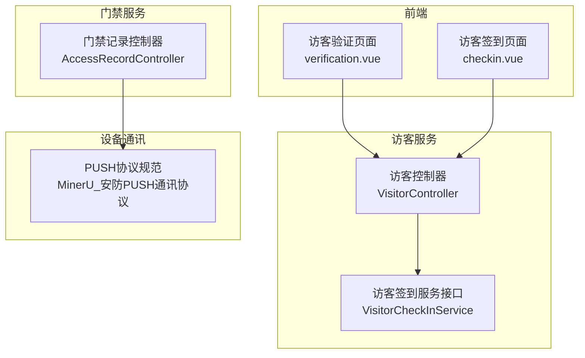
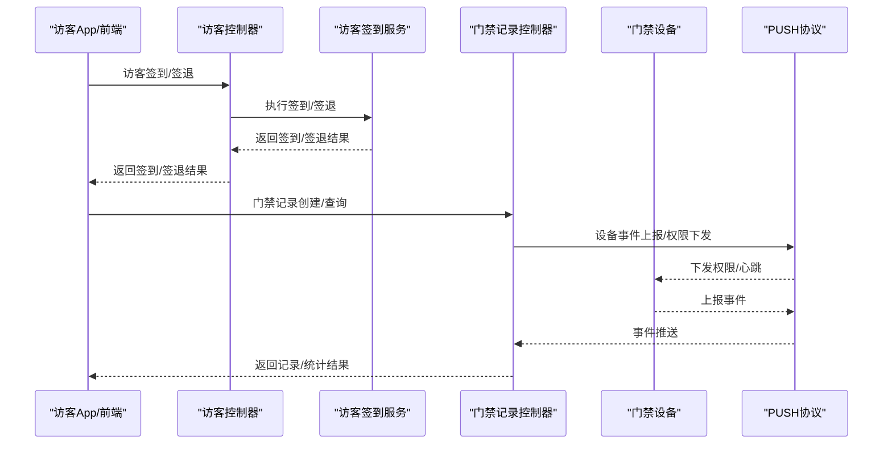
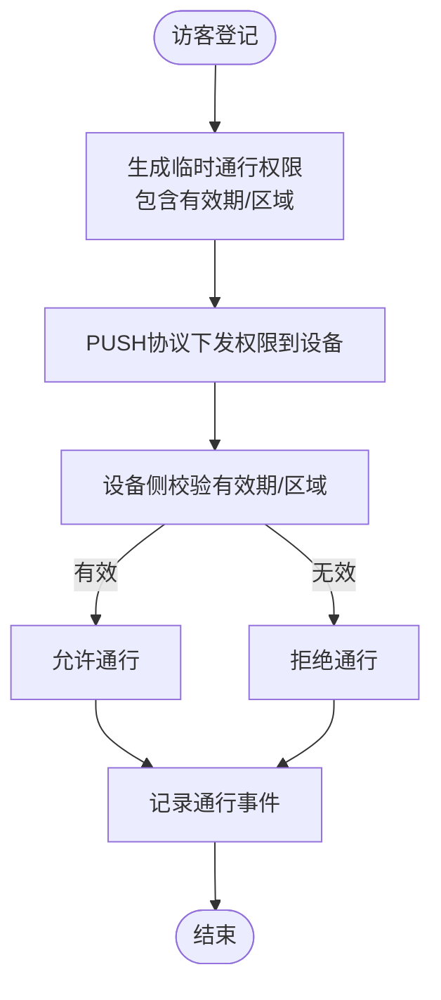
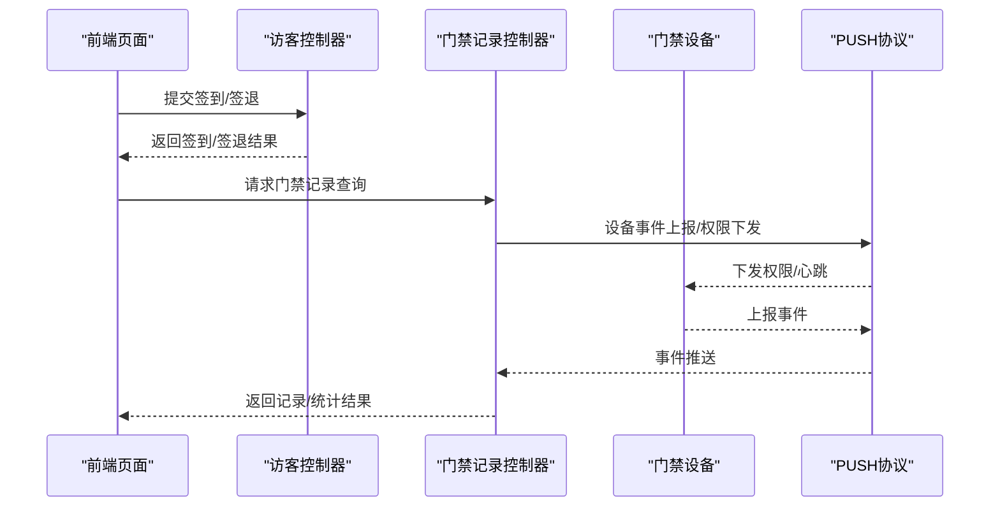
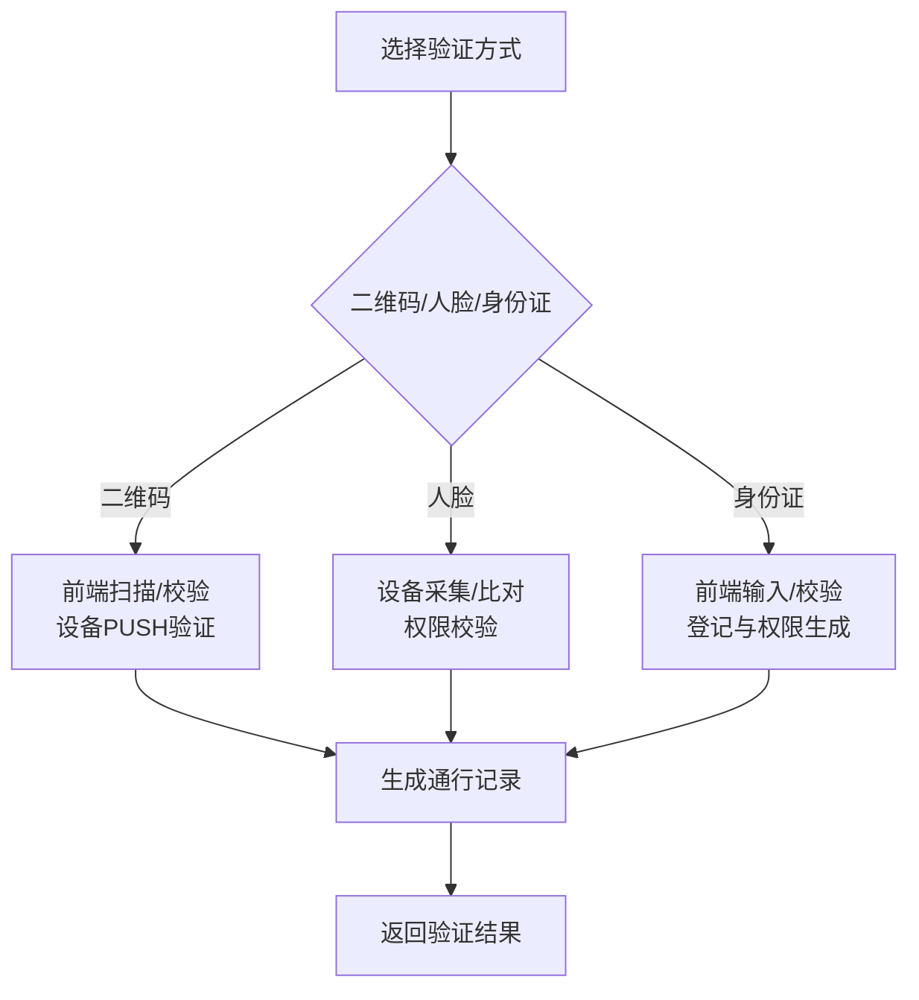
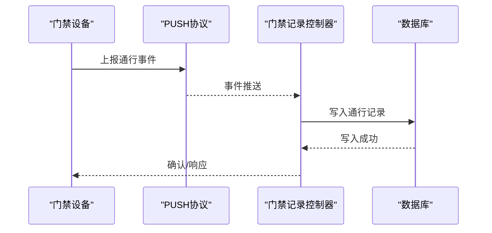
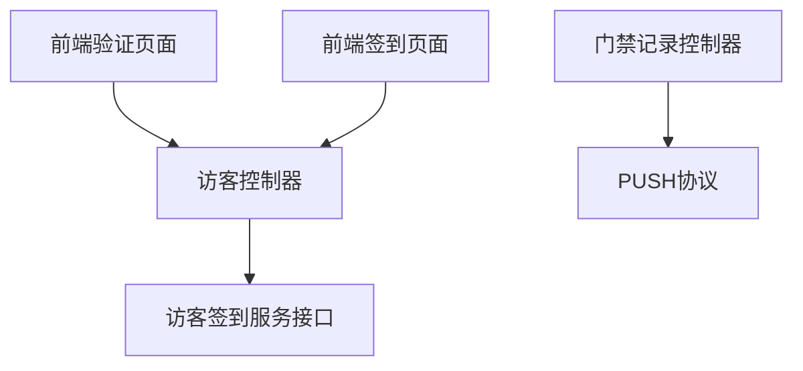

# 通行管理

<cite>
**本文引用的文件**
- [visitor-module-architecture.md](file://documentation/03-业务模块/访客/visitor-module-architecture.md)
- [功能概述.md](file://documentation/03-业务模块/门禁系统/功能概述.md)
- [使用指南.md](file://documentation/03-业务模块/门禁系统/使用指南.md)
- [VisitorController.java](file://microservices/ioedream-visitor-service/src/main/java/net/lab1024/sa/visitor/controller/VisitorController.java)
- [AccessRecordController.java](file://microservices/ioedream-access-service/src/main/java/net/lab1024/sa/access/controller/AccessRecordController.java)
- [VisitorCheckInService.java](file://microservices/ioedream-visitor-service/src/main/java/net/lab1024/sa/visitor/service/VisitorCheckInService.java)
- [VisitorPermissionCode.java](file://documentation/03-业务模块/访客/visitor-module-architecture.md)
- [MinerU_安防PUSH通讯协议.md](file://documentation/各个设备通讯协议/MinerU_安防PUSH通讯协议（熵基科技）V4.8-20240107(水印版)__20251206181130.md)
- [verification.vue](file://smart-admin-web-javascript/src/views/business/visitor/verification.vue)
- [checkin.vue](file://smart-app/src/pages/visitor/checkin.vue)
- [12-前端API接口设计.md](file://documentation/03-业务模块/访客/12-前端API接口设计.md)
</cite>

## 目录
1. [简介](#简介)
2. [项目结构](#项目结构)
3. [核心组件](#核心组件)
4. [架构总览](#架构总览)
5. [详细组件分析](#详细组件分析)
6. [依赖分析](#依赖分析)
7. [性能考虑](#性能考虑)
8. [故障排查指南](#故障排查指南)
9. [结论](#结论)
10. [附录](#附录)

## 简介
本文件围绕访客通行管理功能，系统阐述临时通行权限的生成机制与有效期管理、访客通行请求与门禁系统的集成流程（权限下发与设备同步）、多种验证方式（二维码、人脸、身份证）的技术实现要点、通行记录的生成与查询方法，以及异常通行的处理策略与与安防设备的通讯协议说明与集成注意事项。文档面向开发与运维人员，兼顾非技术读者的理解需求。

## 项目结构
访客与门禁相关能力分布在多个微服务与文档中：
- 访客服务（ioedream-visitor-service）：提供访客预约、登记、统计、移动端API等能力。
- 门禁服务（ioedream-access-service）：提供门禁记录查询、权限下发、设备集成等能力。
- 设备通讯协议（MinerU_安防PUSH通讯协议）：定义与门禁设备的PUSH协议交互规范。
- 前端页面与组件：提供访客验证、签到/签退、二维码扫描等界面能力。

**图表来源**
- [VisitorController.java](file://microservices/ioedream-visitor-service/src/main/java/net/lab1024/sa/visitor/controller/VisitorController.java#L1-L192)
- [VisitorCheckInService.java](file://microservices/ioedream-visitor-service/src/main/java/net/lab1024/sa/visitor/service/VisitorCheckInService.java#L1-L37)
- [AccessRecordController.java](file://microservices/ioedream-access-service/src/main/java/net/lab1024/sa/access/controller/AccessRecordController.java#L1-L187)
- [MinerU_安防PUSH通讯协议.md](file://documentation/各个设备通讯协议/MinerU_安防PUSH通讯协议（熵基科技）V4.8-20240107(水印版)__20251206181130.md#L1-L200)
- [verification.vue](file://smart-admin-web-javascript/src/views/business/visitor/verification.vue#L1-L40)
- [checkin.vue](file://smart-app/src/pages/visitor/checkin.vue#L194-L271)

**章节来源**
- [VisitorController.java](file://microservices/ioedream-visitor-service/src/main/java/net/lab1024/sa/visitor/controller/VisitorController.java#L1-L192)
- [AccessRecordController.java](file://microservices/ioedream-access-service/src/main/java/net/lab1024/sa/access/controller/AccessRecordController.java#L1-L187)
- [MinerU_安防PUSH通讯协议.md](file://documentation/各个设备通讯协议/MinerU_安防PUSH通讯协议（熵基科技）V4.8-20240107(水印版)__20251206181130.md#L1-L200)

## 核心组件
- 访客控制器（VisitorController）：提供访客预约查询、统计等API，支撑PC端管理。
- 访客签到服务接口（VisitorCheckInService）：定义访客签到/签退的核心业务方法。
- 门禁记录控制器（AccessRecordController）：提供门禁记录创建、查询、统计等API，支撑PC端管理。
- 设备通讯协议（MinerU_安防PUSH通讯协议）：定义设备注册、心跳、权限下发、事件上报等协议。
- 前端验证与签到页面：提供二维码扫描、身份证验证、签到/签退等交互。

**章节来源**
- [VisitorController.java](file://microservices/ioedream-visitor-service/src/main/java/net/lab1024/sa/visitor/controller/VisitorController.java#L1-L192)
- [VisitorCheckInService.java](file://microservices/ioedream-visitor-service/src/main/java/net/lab1024/sa/visitor/service/VisitorCheckInService.java#L1-L37)
- [AccessRecordController.java](file://microservices/ioedream-access-service/src/main/java/net/lab1024/sa/access/controller/AccessRecordController.java#L1-L187)
- [MinerU_安防PUSH通讯协议.md](file://documentation/各个设备通讯协议/MinerU_安防PUSH通讯协议（熵基科技）V4.8-20240107(水印版)__20251206181130.md#L1-L200)
- [verification.vue](file://smart-admin-web-javascript/src/views/business/visitor/verification.vue#L1-L40)
- [checkin.vue](file://smart-app/src/pages/visitor/checkin.vue#L194-L271)

## 架构总览
访客通行管理涉及“访客侧”与“门禁侧”的协同：
- 访客侧：通过访客控制器与签到服务完成登记与权限生成；前端提供二维码/身份证等验证入口。
- 门禁侧：通过门禁记录控制器对接设备事件与权限下发；设备遵循PUSH协议进行注册、心跳、权限下发与事件上报。
- 数据与权限：访客登记后生成临时通行权限，门禁设备按协议同步权限并记录通行事件。

**图表来源**
- [VisitorController.java](file://microservices/ioedream-visitor-service/src/main/java/net/lab1024/sa/visitor/controller/VisitorController.java#L1-L192)
- [VisitorCheckInService.java](file://microservices/ioedream-visitor-service/src/main/java/net/lab1024/sa/visitor/service/VisitorCheckInService.java#L1-L37)
- [AccessRecordController.java](file://microservices/ioedream-access-service/src/main/java/net/lab1024/sa/access/controller/AccessRecordController.java#L1-L187)
- [MinerU_安防PUSH通讯协议.md](file://documentation/各个设备通讯协议/MinerU_安防PUSH通讯协议（熵基科技）V4.8-20240107(水印版)__20251206181130.md#L1-L200)

## 详细组件分析

### 临时通行权限生成与有效期管理
- 生成机制
  - 访客登记后，系统生成临时通行权限，包含权限类型（如临时）、可访问区域、有效期等。
  - 临时权限通常与访客登记生命周期绑定，登记完成后生效，登记结束或超时后失效。
- 有效期管理
  - 有效期字段用于限定权限的有效时间段，支持按日、按次、按区域等粒度配置。
  - 系统在权限下发与验证时均会校验有效期，过期则拒绝通行。
- 与门禁设备同步
  - 门禁设备通过PUSH协议接收权限下发，设备侧缓存并校验有效期，确保权限一致性。

**图表来源**
- [功能概述.md](file://documentation/03-业务模块/门禁系统/功能概述.md#L360-L540)
- [MinerU_安防PUSH通讯协议.md](file://documentation/各个设备通讯协议/MinerU_安防PUSH通讯协议（熵基科技）V4.8-20240107(水印版)__20251206181130.md#L1-L200)

**章节来源**
- [功能概述.md](file://documentation/03-业务模块/门禁系统/功能概述.md#L360-L540)
- [MinerU_安防PUSH通讯协议.md](file://documentation/各个设备通讯协议/MinerU_安防PUSH通讯协议（熵基科技）V4.8-20240107(水印版)__20251206181130.md#L1-L200)

### 访客通行请求与门禁系统集成
- 门禁记录创建与查询
  - 门禁记录控制器提供创建与查询接口，支持分页与多条件筛选，便于PC端管理与审计。
- 设备事件与权限下发
  - 设备通过PUSH协议上报事件，服务端接收后写入门禁记录；同时按协议下发权限到设备，设备侧进行权限校验与通行控制。
- 前端验证与签到
  - 前端提供二维码扫描、身份证验证等入口，配合访客控制器完成签到/签退，生成通行凭证与记录。

**图表来源**
- [AccessRecordController.java](file://microservices/ioedream-access-service/src/main/java/net/lab1024/sa/access/controller/AccessRecordController.java#L1-L187)
- [VisitorController.java](file://microservices/ioedream-visitor-service/src/main/java/net/lab1024/sa/visitor/controller/VisitorController.java#L1-L192)
- [MinerU_安防PUSH通讯协议.md](file://documentation/各个设备通讯协议/MinerU_安防PUSH通讯协议（熵基科技）V4.8-20240107(水印版)__20251206181130.md#L1-L200)
- [verification.vue](file://smart-admin-web-javascript/src/views/business/visitor/verification.vue#L1-L40)
- [checkin.vue](file://smart-app/src/pages/visitor/checkin.vue#L194-L271)

**章节来源**
- [AccessRecordController.java](file://microservices/ioedream-access-service/src/main/java/net/lab1024/sa/access/controller/AccessRecordController.java#L1-L187)
- [VisitorController.java](file://microservices/ioedream-visitor-service/src/main/java/net/lab1024/sa/visitor/controller/VisitorController.java#L1-L192)
- [verification.vue](file://smart-admin-web-javascript/src/views/business/visitor/verification.vue#L1-L40)
- [checkin.vue](file://smart-app/src/pages/visitor/checkin.vue#L194-L271)

### 验证方式实现原理与技术细节
- 二维码验证
  - 前端提供二维码扫描入口，扫描后与访客凭证匹配，设备侧通过PUSH协议进行验证与通行控制。
- 人脸验证
  - 设备侧进行人脸采集与比对，结合权限下发与有效期校验，完成通行控制。
- 身份证验证
  - 前端提供身份证信息输入与校验，结合访客登记与权限生成，确保权限与身份一致。

**图表来源**
- [12-前端API接口设计.md](file://documentation/03-业务模块/访客/12-前端API接口设计.md#L626-L669)
- [MinerU_安防PUSH通讯协议.md](file://documentation/各个设备通讯协议/MinerU_安防PUSH通讯协议（熵基科技）V4.8-20240107(水印版)__20251206181130.md#L1-L200)
- [verification.vue](file://smart-admin-web-javascript/src/views/business/visitor/verification.vue#L1-L40)
- [checkin.vue](file://smart-app/src/pages/visitor/checkin.vue#L194-L271)

**章节来源**
- [12-前端API接口设计.md](file://documentation/03-业务模块/访客/12-前端API接口设计.md#L626-L669)
- [verification.vue](file://smart-admin-web-javascript/src/views/business/visitor/verification.vue#L1-L40)
- [checkin.vue](file://smart-app/src/pages/visitor/checkin.vue#L194-L271)

### 通行记录生成与查询
- 记录生成
  - 设备通过PUSH协议上报通行事件，服务端接收后写入门禁记录，包含访问类型、结果、区域、设备信息、异常标记等。
- 记录查询
  - 门禁记录控制器提供分页查询接口，支持按用户、设备、区域、时间、结果等条件筛选。
- 统计分析
  - 提供按时间与区域的统计接口，支持导出报表，满足管理与审计需求。

**图表来源**
- [AccessRecordController.java](file://microservices/ioedream-access-service/src/main/java/net/lab1024/sa/access/controller/AccessRecordController.java#L1-L187)
- [功能概述.md](file://documentation/03-业务模块/门禁系统/功能概述.md#L1224-L1296)
- [MinerU_安防PUSH通讯协议.md](file://documentation/各个设备通讯协议/MinerU_安防PUSH通讯协议（熵基科技）V4.8-20240107(水印版)__20251206181130.md#L1-L200)

**章节来源**
- [AccessRecordController.java](file://microservices/ioedream-access-service/src/main/java/net/lab1024/sa/access/controller/AccessRecordController.java#L1-L187)
- [功能概述.md](file://documentation/03-业务模块/门禁系统/功能概述.md#L1224-L1296)

### 异常通行处理策略
- 异常类型
  - 验证失败、非授权访问尝试、强行开门尝试、设备异常报警等。
- 处理方式
  - 自动生成异常记录，触发安全响应流程，通知相关人员，支持导出异常报告与统计分析。
- 前端与移动端
  - 提供异常记录重点展示与查询入口，便于快速定位与处置。

**章节来源**
- [使用指南.md](file://documentation/03-业务模块/门禁系统/使用指南.md#L500-L559)

### 与安防设备的通讯协议与集成注意事项
- 协议要点
  - 设备注册、心跳、配置参数、权限下发、事件上报等均有明确协议字段与流程。
  - 协议支持二维码/健康码验证方式、时间规则下发、NTP服务器信息等扩展能力。
- 集成注意事项
  - 设备上线前需完成注册与配置下发；心跳与状态监控需稳定；权限下发需与有效期、区域权限一致。
  - 异常事件需及时上报与处理，确保与门禁记录控制器的数据一致性。

**章节来源**
- [MinerU_安防PUSH通讯协议.md](file://documentation/各个设备通讯协议/MinerU_安防PUSH通讯协议（熵基科技）V4.8-20240107(水印版)__20251206181130.md#L1-L200)
- [功能概述.md](file://documentation/03-业务模块/门禁系统/功能概述.md#L310-L380)

## 依赖分析
- 访客服务依赖
  - 访客控制器依赖访客签到服务接口，实现签到/签退业务。
- 门禁服务依赖
  - 门禁记录控制器依赖设备通讯协议，接收设备事件并写入记录。
- 前端依赖
  - 前端页面依赖访客控制器与门禁记录控制器提供的API，完成验证与查询。

**图表来源**
- [VisitorController.java](file://microservices/ioedream-visitor-service/src/main/java/net/lab1024/sa/visitor/controller/VisitorController.java#L1-L192)
- [VisitorCheckInService.java](file://microservices/ioedream-visitor-service/src/main/java/net/lab1024/sa/visitor/service/VisitorCheckInService.java#L1-L37)
- [AccessRecordController.java](file://microservices/ioedream-access-service/src/main/java/net/lab1024/sa/access/controller/AccessRecordController.java#L1-L187)
- [MinerU_安防PUSH通讯协议.md](file://documentation/各个设备通讯协议/MinerU_安防PUSH通讯协议（熵基科技）V4.8-20240107(水印版)__20251206181130.md#L1-L200)
- [verification.vue](file://smart-admin-web-javascript/src/views/business/visitor/verification.vue#L1-L40)
- [checkin.vue](file://smart-app/src/pages/visitor/checkin.vue#L194-L271)

**章节来源**
- [VisitorController.java](file://microservices/ioedream-visitor-service/src/main/java/net/lab1024/sa/visitor/controller/VisitorController.java#L1-L192)
- [VisitorCheckInService.java](file://microservices/ioedream-visitor-service/src/main/java/net/lab1024/sa/visitor/service/VisitorCheckInService.java#L1-L37)
- [AccessRecordController.java](file://microservices/ioedream-access-service/src/main/java/net/lab1024/sa/access/controller/AccessRecordController.java#L1-L187)

## 性能考虑
- 多级缓存与异步处理
  - 对权限验证与设备状态监控可采用多级缓存策略，降低数据库压力；对设备事件与告警采用异步处理，避免阻塞主线程。
- 并发与限流
  - 对高频接口（如权限下发、事件上报）进行限流与熔断，防止突发流量冲击。
- 数据库与索引
  - 对通行记录、设备事件等高频表建立合适索引，优化查询性能；定期进行索引维护与统计分析。

[本节为通用指导，无需具体文件引用]

## 故障排查指南
- 设备离线/心跳异常
  - 检查设备网络与心跳配置；确认设备注册与配置下发是否成功；查看设备状态监控与告警。
- 权限下发失败
  - 核对权限有效期、区域权限与设备支持能力；确认PUSH协议版本与字段兼容性。
- 通行记录缺失
  - 检查设备事件上报是否正常；确认门禁记录控制器接收与入库流程；核对异常记录与处理策略。

**章节来源**
- [功能概述.md](file://documentation/03-业务模块/门禁系统/功能概述.md#L350-L420)
- [MinerU_安防PUSH通讯协议.md](file://documentation/各个设备通讯协议/MinerU_安防PUSH通讯协议（熵基科技）V4.8-20240107(水印版)__20251206181130.md#L1-L200)

## 结论
访客通行管理通过“访客登记—权限生成—设备同步—事件记录—异常处理”的闭环，实现了临时通行权限的高效管理与安全控制。依托统一的PUSH协议与门禁记录控制器，系统能够稳定地对接各类安防设备，满足多样化验证方式与复杂的权限场景。建议在部署与运维中重点关注设备注册、心跳与权限下发的一致性，以及异常事件的快速响应与处理。

[本节为总结性内容，无需具体文件引用]

## 附录
- 权限常量参考
  - 访客管理权限常量涵盖访客信息、预约、登记、物流、电子出门单等权限标识，便于统一权限控制与审计。

**章节来源**
- [VisitorPermissionCode.java](file://documentation/03-业务模块/访客/visitor-module-architecture.md#L3209-L3265)