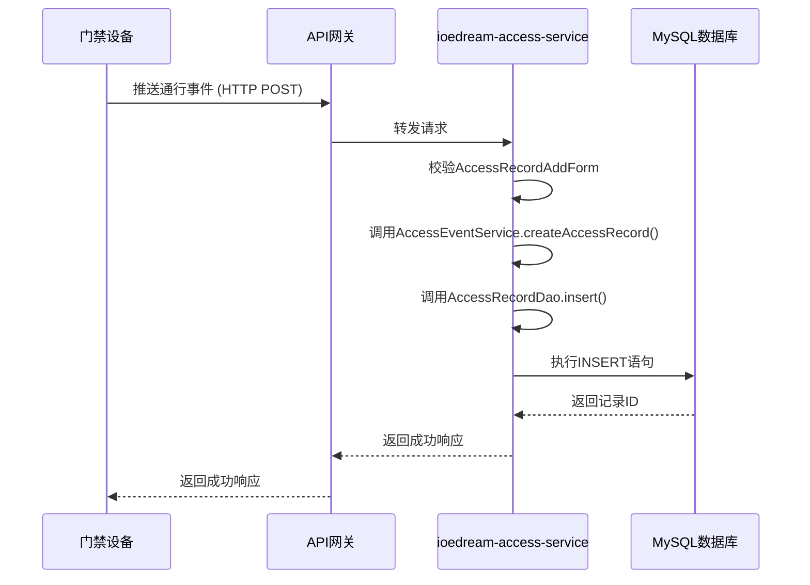
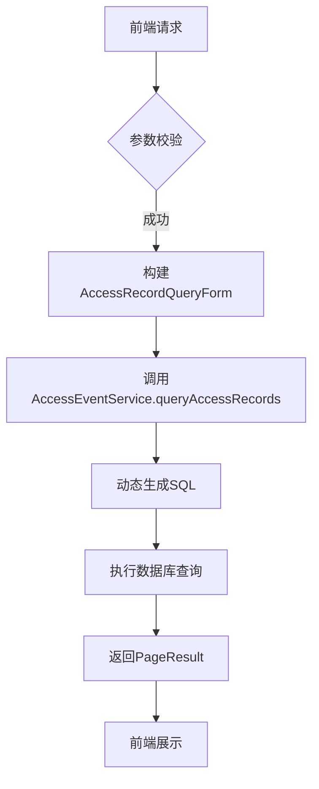
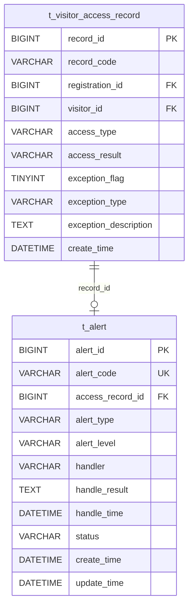
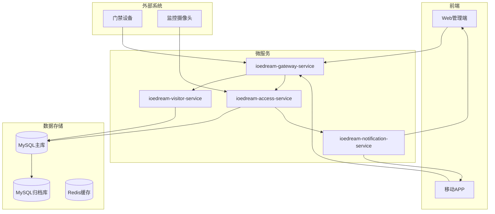

# 通行记录管理

<cite>
**本文档引用文件**   
- [logistics-tables.sql](file://database-scripts/visitor/logistics-tables.sql)
- [visitor-module-architecture.md](file://documentation/03-业务模块/各业务模块文档/访客/visitor-module-architecture.md)
- [module_diagrams.md](file://documentation/03-业务模块/各业务模块文档/访客/module_diagrams.md)
- [database_dictionary.md](file://documentation/03-业务模块/各业务模块文档/访客/database_dictionary.md)
- [visitor_index_optimization.sql](file://microservices/ioedream-visitor-service/src/main/resources/sql/visitor_index_optimization.sql)
- [AccessRecordController.java](file://microservices/ioedream-access-service/src/main/java/net/lab1024/sa/access/controller/AccessRecordController.java)
- [AccessRecordDao.java](file://microservices/ioedream-access-service/src/main/java/net/lab1024/sa/access/dao/AccessRecordDao.java)
- [VisitorAppointmentEntity.java](file://microservices/ioedream-visitor-service/src/main/java/net/lab1024/sa/visitor/domain/entity/VisitorAppointmentEntity.java)
- [VisitorController.java](file://microservices/ioedream-visitor-service/src/main/java/net/lab1024/sa/visitor/controller/VisitorController.java)
</cite>

## 目录
1. [引言](#引言)
2. [数据结构设计](#数据结构设计)
3. [记录生成与存储策略](#记录生成与存储策略)
4. [高并发写入性能优化](#高并发写入性能优化)
5. [多维度查询接口实现](#多维度查询接口实现)
6. [异常通行记录处理](#异常通行记录处理)
7. [数据归档与备份策略](#数据归档与备份策略)
8. [系统架构图](#系统架构图)

## 引言
本文档详细阐述了IoE-DREAM系统中访客通行记录管理模块的设计与实现。系统通过集成访客预约、登记、通行控制和物流管理等功能，实现了对访客通行全过程的数字化管理。核心功能包括访客信息管理、通行记录生成、异常事件告警、多维度数据查询以及高性能的数据存储与检索。系统设计遵循微服务架构，通过`ioedream-visitor-service`和`ioedream-access-service`两个核心服务协同工作，确保了数据的一致性和系统的可扩展性。

**Section sources**
- [visitor-module-architecture.md](file://documentation/03-业务模块/各业务模块文档/访客/visitor-module-architecture.md#L1-L50)

## 数据结构设计
通行记录的数据结构设计围绕核心的`t_visitor_access_record`表展开，该表记录了每一次通行事件的完整信息。数据结构设计充分考虑了访客信息、通行时间、通行方式、设备位置等核心字段，并支持对异常事件的标记。

### 核心字段定义
通行记录表`t_visitor_access_record`包含以下关键字段：

| 字段名 | 数据类型 | 说明 |
| :--- | :--- | :--- |
| `record_id` | BIGINT | 通行记录ID，主键 |
| `record_code` | VARCHAR(50) | 记录编码，唯一标识 |
| `registration_id` | BIGINT | 关联的访客登记ID |
| `visitor_id` | BIGINT | 访客ID，关联访客信息 |
| `device_id` | VARCHAR(100) | 通行设备ID |
| `device_name` | VARCHAR(200) | 通行设备名称 |
| `access_type` | VARCHAR(20) | 通行类型（ENTRY:进入, EXIT:离开） |
| `access_result` | VARCHAR(20) | 通行结果（SUCCESS:成功, FAILED:失败） |
| `access_location` | VARCHAR(200) | 通行位置描述 |
| `area_id` | BIGINT | 所属区域ID |
| `card_number` | VARCHAR(50) | 使用的卡号 |
| `qr_code` | VARCHAR(100) | 使用的二维码 |
| `access_data` | TEXT | 通行原始数据（JSON格式，包含人脸特征、指纹等） |
| `operator` | VARCHAR(100) | 操作人（设备或管理员） |
| `exception_flag` | TINYINT | 是否为异常记录（0:否, 1:是） |
| `exception_type` | VARCHAR(50) | 异常类型（如TIMEOUT, UNAUTHORIZED） |
| `exception_description` | TEXT | 异常详细描述 |
| `create_time` | DATETIME | 通行时间，记录创建时间 |

**Section sources**
- [visitor-module-architecture.md](file://documentation/03-业务模块/各业务模块文档/访客/visitor-module-architecture.md#L397-L425)
- [database_dictionary.md](file://documentation/03-业务模块/各业务模块文档/访客/database_dictionary.md#L346-L361)

### 数据关系模型
通行记录与访客预约、登记等核心实体存在紧密的关联关系。一个访客（`t_visitor`）可以发起多次预约（`t_visitor_reservation`），每次预约成功后会生成一次登记（`t_visitor_registration`），而每一次登记可以产生多条通行记录（`t_visitor_access_record`）。这种一对多的层级关系确保了数据的完整性和可追溯性。

```mermaid
erDiagram
t_visitor {
BIGINT visitor_id PK
VARCHAR visitor_code UK
VARCHAR name
TINYINT gender
VARCHAR id_card UK
VARCHAR phone
VARCHAR email
VARCHAR company_name
VARCHAR photo_url
VARCHAR visitor_level
TINYINT blacklisted
TEXT blacklist_reason
DATETIME blacklist_time
VARCHAR blacklist_operator
DATETIME last_visit_time
BIGINT access_level_id FK
TINYINT shelves_flag
TINYINT deleted_flag
TEXT remark
DATETIME create_time
DATETIME update_time
BIGINT create_user
BIGINT update_user
}
t_visitor_reservation {
BIGINT reservation_id PK
VARCHAR reservation_code UK
BIGINT visitor_id FK
VARCHAR visitor_name
VARCHAR id_card
VARCHAR phone
BIGINT interviewee_id FK
VARCHAR interviewee_name
VARCHAR visit_purpose
TEXT purpose_detail
DATE visit_date
TIME start_time
TIME end_time
BIGINT visit_area_id FK
INT visitor_count
VARCHAR car_number
VARCHAR status
VARCHAR approve_user
DATETIME approve_time
TEXT approve_remark
TEXT reject_reason
TINYINT reminder_flag
TINYINT shelves_flag
TINYINT deleted_flag
TEXT remark
DATETIME create_time
DATETIME update_time
BIGINT create_user
BIGINT update_user
}
t_visitor_registration {
BIGINT registration_id PK
VARCHAR registration_code UK
BIGINT reservation_id FK
BIGINT visitor_id FK
VARCHAR visitor_name
VARCHAR id_card
VARCHAR phone
BIGINT interviewee_id FK
VARCHAR interviewee_name
VARCHAR visitor_card
BIGINT access_level_id FK
TEXT access_areas
DATETIME expected_leave_time
DATETIME actual_leave_time
VARCHAR registration_device
VARCHAR check_in_photo_url
VARCHAR check_out_photo_url
VARCHAR status
VARCHAR over_time_reason
TINYINT escort_required
VARCHAR escort_user
TINYINT shelves_flag
TINYINT deleted_flag
TEXT remark
DATETIME create_time
DATETIME update_time
BIGINT create_user
BIGINT update_user
}
t_visitor_access_record {
BIGINT record_id PK
VARCHAR record_code UK
BIGINT registration_id FK
BIGINT visitor_id FK
VARCHAR device_id
VARCHAR device_name
VARCHAR access_type
VARCHAR access_result
VARCHAR access_location
BIGINT area_id FK
VARCHAR card_number
VARCHAR qr_code
TEXT access_data
VARCHAR operator
TINYINT exception_flag
VARCHAR exception_type
TEXT exception_description
DATETIME create_time
}
t_visitor ||--o{ t_visitor_reservation : "visitor_id"
t_visitor_reservation ||--o| t_visitor_registration : "reservation_id"
t_visitor_registration ||--o{ t_visitor_access_record : "registration_id"
```



**Diagram sources **
- [visitor-module-architecture.md](file://documentation/03-业务模块/各业务模块文档/访客/visitor-module-architecture.md#L768-L1300)

## 记录生成与存储策略
通行记录的生成时机与访客的实际通行行为紧密绑定。当访客在门禁设备上进行身份验证时，设备会将通行事件通过协议推送到`ioedream-access-service`服务。

### 记录生成时机
记录的生成主要发生在以下场景：
1.  **正常通行**：访客使用有效的卡、二维码或生物特征在门禁设备上验证成功，系统立即生成一条`access_result`为`SUCCESS`的通行记录。
2.  **通行失败**：当访客的权限不足、证件无效或生物特征不匹配时，系统生成一条`access_result`为`FAILED`的记录。
3.  **异常通行**：系统会根据预设规则（如黑名单、超时未离场）自动标记异常，生成`exception_flag`为1的记录。
4.  **手动登记**：在特殊情况下，管理员可在PC端手动创建通行记录。

### 存储策略
所有通行记录均持久化存储于MySQL数据库的`t_visitor_access_record`表中。系统采用`ioedream-access-service`的`AccessRecordController`暴露`/api/v1/access/record/create`接口，接收来自门禁设备或内部服务的通行事件推送。该接口接收`AccessRecordAddForm`表单数据，经过校验后，由`AccessEventService`服务处理并最终通过`AccessRecordDao`写入数据库。



**Diagram sources **
- [AccessRecordController.java](file://microservices/ioedream-access-service/src/main/java/net/lab1024/sa/access/controller/AccessRecordController.java#L80-L99)
- [AccessRecordDao.java](file://microservices/ioedream-access-service/src/main/java/net/lab1024/sa/access/dao/AccessRecordDao.java#L24-L26)

**Section sources**
- [AccessRecordController.java](file://microservices/ioedream-access-service/src/main/java/net/lab1024/sa/access/controller/AccessRecordController.java#L51-L99)

## 高并发写入性能优化
为应对门禁系统在上下班高峰期可能出现的高并发写入压力，系统从数据库索引、表结构和查询优化三个层面进行了深度优化。

### 索引优化
在`t_visitor_access_record`表上创建了多个复合索引，以加速高频查询：
- `idx_visitor_id`：用于按访客ID查询其历史通行记录。
- `idx_registration_id`：用于查询某次登记产生的所有通行记录。
- `idx_access_time`：用于按时间范围查询通行记录，是分页查询的基础。
- `idx_area_id`：用于统计特定区域的通行情况。
- `idx_exception_flag`：快速定位所有异常通行记录。

此外，还针对特定查询场景创建了覆盖索引，如`idx_access_time_range`，它包含了`create_time`, `access_type`, `area_id`，使得在按时间、类型和区域组合查询时，数据库可以直接从索引中获取数据，无需回表查询，极大提升了查询效率。

### 表结构优化
为解决单表数据量过大导致的性能瓶颈，系统对`t_visitor_access_record`表实施了**按月分区**（Partitioning）策略。表按`create_time`字段的年月进行分区，例如`p202501`, `p202502`等。这种策略的优势在于：
1.  **查询性能提升**：当查询特定月份的数据时，数据库只需扫描对应的分区，而非全表扫描。
2.  **数据维护便捷**：归档和删除历史数据变得非常高效，只需`DROP PARTITION`即可，避免了耗时的`DELETE`操作。

### 查询优化
系统遵循最佳实践，避免深度分页（如`LIMIT 10000, 20`），推荐使用基于游标的分页（Cursor-based Pagination），即利用上一页最后一条记录的`create_time`和`record_id`作为下一页查询的起点，确保分页查询的性能稳定。

```sql
-- 分区表创建语句示例
ALTER TABLE t_visitor_access_record 
PARTITION BY RANGE (YEAR(create_time)*100 + MONTH(create_time)) (
    PARTITION p202501 VALUES LESS THAN (202502),
    PARTITION p202502 VALUES LESS THAN (202503),
    PARTITION p202503 VALUES LESS THAN (202504)
    -- ... 后续月份
);
```

**Section sources**
- [visitor_index_optimization.sql](file://microservices/ioedream-visitor-service/src/main/resources/sql/visitor_index_optimization.sql#L1-L69)
- [visitor-module-architecture.md](file://documentation/03-业务模块/各业务模块文档/访客/visitor-module-architecture.md#L3425-L3432)

## 多维度查询接口实现
系统提供了强大的多维度查询能力，支持通过PC端和移动端API对通行记录进行灵活检索。

### 查询接口设计
`ioedream-access-service`的`AccessRecordController`提供了`/api/v1/access/record/query`接口，支持以下查询条件的组合：
- **时间范围** (`startDate`, `endDate`)：查询指定日期区间内的记录。
- **人员筛选** (`userId`, `visitor_id`)：按用户ID或访客ID查询。
- **区域筛选** (`areaId`)：查询特定区域的通行记录。
- **设备筛选** (`deviceId`)：按设备ID查询。
- **结果筛选** (`accessResult`)：筛选成功、失败或异常的记录。

### 实现方法
后端服务接收查询参数后，会将其封装为`AccessRecordQueryForm`对象。`AccessEventService`服务层根据表单中的非空字段动态构建SQL查询条件。由于数据库上已建立相应的索引，即使在多条件组合查询时，也能保证查询性能。查询结果以分页形式（`PageResult`）返回，包含记录列表和分页信息。



**Section sources**
- [AccessRecordController.java](file://microservices/ioedream-access-service/src/main/java/net/lab1024/sa/access/controller/AccessRecordController.java#L117-L157)

## 异常通行记录处理
系统具备完善的异常通行记录标记和告警机制，确保安全事件能够被及时发现和处理。

### 异常标记机制
异常记录的标记主要通过以下两种方式：
1.  **实时标记**：当通行结果为`FAILED`时，系统会立即检查失败原因。如果是因为访客在黑名单中（`blacklisted=1`），则自动将`exception_flag`置为1，并设置`exception_type`为`BLACKLISTED`。
2.  **定时任务扫描**：系统通过定时任务（Scheduled Job）定期扫描所有处于“在场”状态（`status=ACTIVE`）的登记记录。如果发现某访客的实际停留时间超过了其权限允许的最大时长（或预计离开时间），则将其标记为超时异常（`exception_type=TIMEOUT`）。

### 告警触发逻辑
一旦生成或标记了一条异常通行记录，系统会立即触发告警流程：
1.  **消息通知**：通过`ioedream-notification-service`向安全管理员的手机APP和PC端推送告警消息。
2.  **告警记录**：在`t_alert`表中创建一条告警记录，记录告警类型、级别、关联的通行记录ID等信息。
3.  **联动响应**：根据告警级别，可能触发联动操作，如锁定相关区域的门禁、启动视频监控追踪等。



**Diagram sources **
- [module_diagrams.md](file://documentation/03-业务模块/各业务模块文档/访客/module_diagrams.md#L653-L691)

**Section sources**
- [visitor-module-architecture.md](file://documentation/03-业务模块/各业务模块文档/访客/visitor-module-architecture.md#L1154-L1179)

## 数据归档与备份策略
为保障数据安全和系统长期稳定运行，系统实施了严格的数据归档与备份策略。

### 数据归档
考虑到通行记录数据量巨大且历史数据访问频率较低，系统采用**冷热数据分离**策略：
- **热数据**：最近1年的通行记录保留在主数据库`t_visitor_access_record`表中，供日常查询和统计使用。
- **冷数据**：超过1年的历史记录会通过ETL（Extract, Transform, Load）任务，定期（如每月）归档到独立的`archive`数据库或数据仓库中。归档过程完成后，主表中对应月份的分区将被`DROP`，释放存储空间。

### 数据备份
系统通过以下方式确保数据安全：
1.  **数据库备份**：使用MySQL的`mysqldump`或`xtrabackup`工具，每日凌晨对核心数据库进行全量备份，并将备份文件存储在独立的备份服务器上。
2.  **异地备份**：关键的备份文件会通过加密传输同步到异地灾备中心。
3.  **备份验证**：定期进行备份恢复演练，确保备份文件的完整性和可用性。

**Section sources**
- [visitor-module-architecture.md](file://documentation/03-业务模块/各业务模块文档/访客/visitor-module-architecture.md#L3432-L3432)

## 系统架构图
下图展示了访客通行记录管理模块的核心架构，包括微服务、数据库和外部系统的交互。



**Diagram sources **
- [visitor-module-architecture.md](file://documentation/03-业务模块/各业务模块文档/访客/visitor-module-architecture.md#L768-L1300)