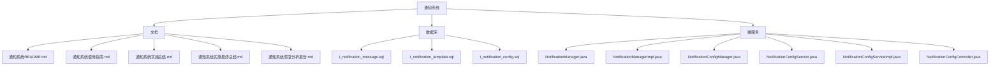
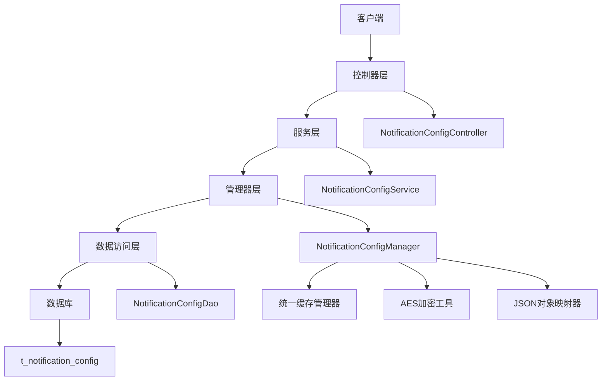
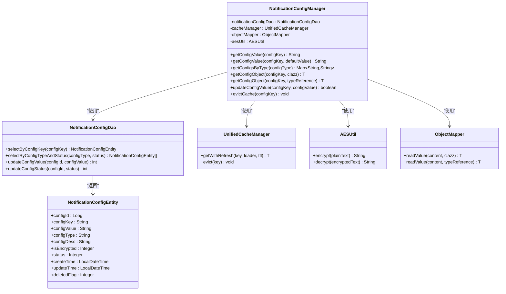
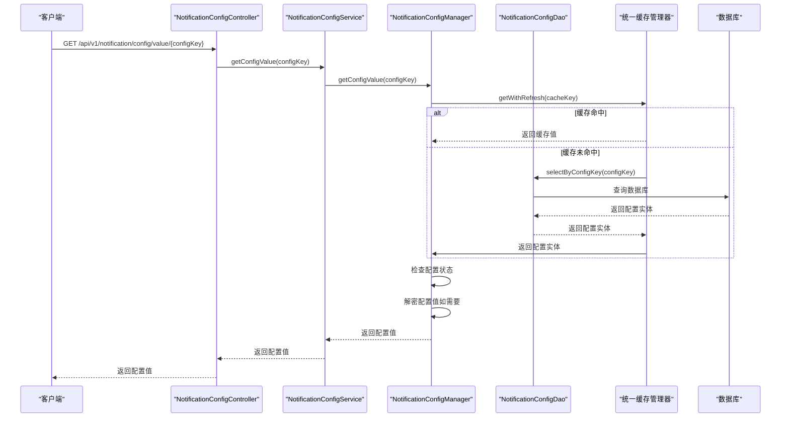
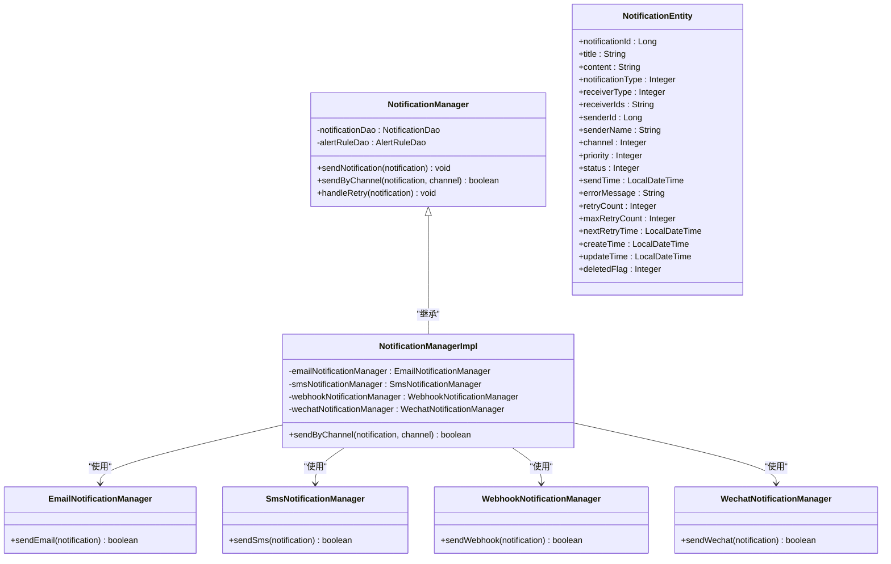
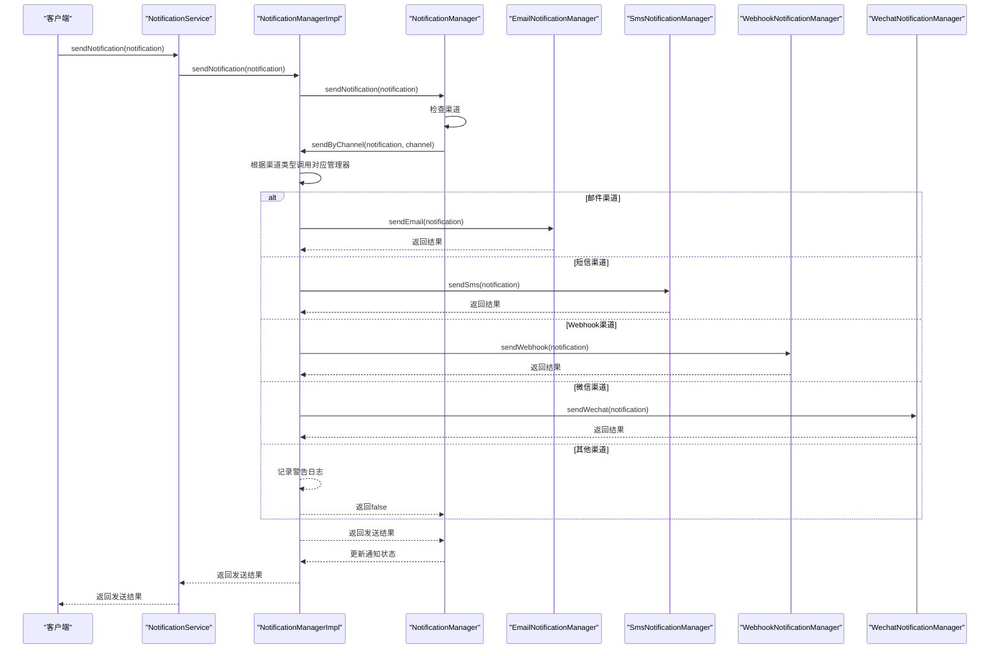
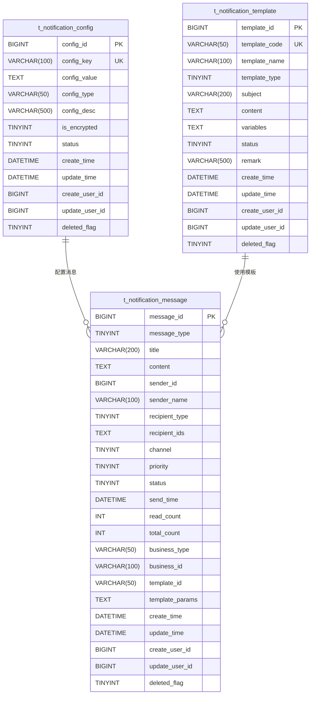
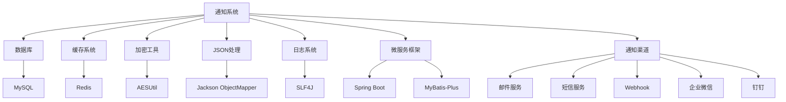

# 通知系统实施

<cite>
**本文档引用文件**  
- [通知系统README.md](file://documentation/03-业务模块/通知系统README.md)
- [通知系统使用指南.md](file://documentation/03-业务模块/通知系统使用指南.md)
- [通知系统实施总结.md](file://documentation/03-业务模块/通知系统实施总结.md)
- [通知系统实施最终总结.md](file://documentation/03-业务模块/通知系统实施最终总结.md)
- [通知系统深度分析报告.md](file://documentation/03-业务模块/通知系统深度分析报告.md)
- [07-t_notification_message.sql](file://database-scripts/common-service/07-t_notification_message.sql)
- [08-t_notification_template.sql](file://database-scripts/common-service/08-t_notification_template.sql)
- [09-t_notification_config.sql](file://database-scripts/common-service/09-t_notification_config.sql)
- [NotificationManager.java](file://microservices/microservices-common/src/main/java/net/lab1024/sa/common/monitor/manager/NotificationManager.java)
- [NotificationManagerImpl.java](file://microservices/ioedream-common-service/src/main/java/net/lab1024/sa/common/monitor/manager/NotificationManagerImpl.java)
- [NotificationConfigManager.java](file://microservices/microservices-common/src/main/java/net/lab1024/sa/common/notification/manager/NotificationConfigManager.java)
- [NotificationConfigService.java](file://microservices/ioedream-common-service/src/main/java/net/lab1024/sa/common/notification/service/NotificationConfigService.java)
- [NotificationConfigServiceImpl.java](file://microservices/ioedream-common-service/src/main/java/net/lab1024/sa/common/notification/service/impl/NotificationConfigServiceImpl.java)
- [NotificationConfigController.java](file://microservices/ioedream-common-service/src/main/java/net/lab1024/sa/common/notification/controller/NotificationConfigController.java)
- [NotificationConfigEntity.java](file://microservices/microservices-common/src/main/java/net/lab1024/sa/common/notification/domain/entity/NotificationConfigEntity.java)
- [NotificationConfigVO.java](file://microservices/microservices-common/src/main/java/net/lab1024/sa/common/notification/domain/vo/NotificationConfigVO.java)
- [NotificationConfigType.java](file://microservices/microservices-common/src/main/java/net/lab1024/sa/common/notification/constant/NotificationConfigType.java)
- [NotificationConfigKey.java](file://microservices/microservices-common/src/main/java/net/lab1024/sa/common/notification/constant/NotificationConfigKey.java)
</cite>

## 目录
1. [简介](#简介)
2. [项目结构](#项目结构)
3. [核心组件](#核心组件)
4. [架构概述](#架构概述)
5. [详细组件分析](#详细组件分析)
6. [依赖分析](#依赖分析)
7. [性能考虑](#性能考虑)
8. [故障排除指南](#故障排除指南)
9. [结论](#结论)
10. [附录](#附录)（如有必要）

## 简介

IOE-DREAM通知系统是一个企业级、高可用的多渠道通知解决方案，支持邮件、短信、钉钉、企业微信、Webhook等多种通知渠道。该系统已达到生产就绪状态，具备完整的配置管理、限流保护、重试机制和监控指标收集功能。

系统通过统一的API接口提供服务，支持多级缓存、配置加密存储、模板热更新等企业级特性。通知系统已集成到IOE-DREAM智慧园区一卡通管理平台中，为各个业务模块提供可靠的通知服务。

## 项目结构

通知系统相关文件分布在多个目录中，主要包括文档、数据库脚本和微服务代码。

**图示来源**
- [通知系统README.md](file://documentation/03-业务模块/通知系统README.md)
- [通知系统使用指南.md](file://documentation/03-业务模块/通知系统使用指南.md)
- [07-t_notification_message.sql](file://database-scripts/common-service/07-t_notification_message.sql)
- [08-t_notification_template.sql](file://database-scripts/common-service/08-t_notification_template.sql)
- [09-t_notification_config.sql](file://database-scripts/common-service/09-t_notification_config.sql)

**本节来源**
- [通知系统README.md](file://documentation/03-业务模块/通知系统README.md)
- [通知系统使用指南.md](file://documentation/03-业务模块/通知系统使用指南.md)
- [通知系统实施总结.md](file://documentation/03-业务模块/通知系统实施总结.md)

## 核心组件

通知系统由多个核心组件构成，包括通知管理器、配置管理器、模板管理器和数据库表结构。系统采用分层架构设计，遵循CLAUDE.md规范，实现了Controller → Service → Manager → DAO的四层架构。

通知管理器采用基类+实现类的设计模式，其中基类在microservices-common中提供框架和扩展点，实现类在ioedream-common-service中实现具体业务逻辑。这种设计符合"公共模块提供框架，微服务实现业务"的架构原则。

系统支持多渠道通知发送，包括邮件、短信、Webhook和微信。每种渠道都有专门的通知管理器负责具体的发送逻辑，并通过统一的接口进行调用。

**本节来源**
- [通知系统README.md](file://documentation/03-业务模块/通知系统README.md)
- [通知系统实施总结.md](file://documentation/03-业务模块/通知系统实施总结.md)
- [NotificationManager.java](file://microservices/microservices-common/src/main/java/net/lab1024/sa/common/monitor/manager/NotificationManager.java)
- [NotificationManagerImpl.java](file://microservices/ioedream-common-service/src/main/java/net/lab1024/sa/common/monitor/manager/NotificationManagerImpl.java)

## 架构概述

通知系统采用微服务架构，通过分层设计实现高内聚、低耦合。系统架构分为四个层次：控制器层、服务层、管理器层和数据访问层。

**图示来源**
- [NotificationConfigController.java](file://microservices/ioedream-common-service/src/main/java/net/lab1024/sa/common/notification/controller/NotificationConfigController.java)
- [NotificationConfigService.java](file://microservices/ioedream-common-service/src/main/java/net/lab1024/sa/common/notification/service/NotificationConfigService.java)
- [NotificationConfigManager.java](file://microservices/microservices-common/src/main/java/net/lab1024/sa/common/notification/manager/NotificationConfigManager.java)
- [NotificationConfigDao.java](file://microservices/microservices-common/src/main/java/net/lab1024/sa/common/notification/dao/NotificationConfigDao.java)
- [09-t_notification_config.sql](file://database-scripts/common-service/09-t_notification_config.sql)

## 详细组件分析

### 通知配置管理器分析

通知配置管理器是通知系统的核心组件之一，负责通知配置的获取、缓存、解密等管理功能。该组件严格遵循CLAUDE.md规范，保持为纯Java类，不使用Spring注解。

#### 对象导向组件：

**图示来源**
- [NotificationConfigManager.java](file://microservices/microservices-common/src/main/java/net/lab1024/sa/common/notification/manager/NotificationConfigManager.java)
- [NotificationConfigDao.java](file://microservices/microservices-common/src/main/java/net/lab1024/sa/common/notification/dao/NotificationConfigDao.java)
- [NotificationConfigEntity.java](file://microservices/microservices-common/src/main/java/net/lab1024/sa/common/notification/domain/entity/NotificationConfigEntity.java)

#### API/服务组件：

**图示来源**
- [NotificationConfigController.java](file://microservices/ioedream-common-service/src/main/java/net/lab1024/sa/common/notification/controller/NotificationConfigController.java)
- [NotificationConfigService.java](file://microservices/ioedream-common-service/src/main/java/net/lab1024/sa/common/notification/service/NotificationConfigService.java)
- [NotificationConfigManager.java](file://microservices/microservices-common/src/main/java/net/lab1024/sa/common/notification/manager/NotificationConfigManager.java)
- [NotificationConfigDao.java](file://microservices/microservices-common/src/main/java/net/lab1024/sa/common/notification/dao/NotificationConfigDao.java)

**本节来源**
- [NotificationConfigManager.java](file://microservices/microservices-common/src/main/java/net/lab1024/sa/common/notification/manager/NotificationConfigManager.java)
- [NotificationConfigService.java](file://microservices/ioedream-common-service/src/main/java/net/lab1024/sa/common/notification/service/NotificationConfigService.java)
- [NotificationConfigServiceImpl.java](file://microservices/ioedream-common-service/src/main/java/net/lab1024/sa/common/notification/service/impl/NotificationConfigServiceImpl.java)
- [NotificationConfigController.java](file://microservices/ioedream-common-service/src/main/java/net/lab1024/sa/common/notification/controller/NotificationConfigController.java)

### 通知管理器分析

通知管理器负责告警通知发送、通知渠道管理、重试机制等功能。系统采用基类+实现类的设计模式，其中基类在microservices-common中提供框架和扩展点，实现类在ioedream-common-service中实现具体业务逻辑。

#### 对象导向组件：

**图示来源**
- [NotificationManager.java](file://microservices/microservices-common/src/main/java/net/lab1024/sa/common/monitor/manager/NotificationManager.java)
- [NotificationManagerImpl.java](file://microservices/ioedream-common-service/src/main/java/net/lab1024/sa/common/monitor/manager/NotificationManagerImpl.java)
- [NotificationEntity.java](file://microservices/microservices-common/src/main/java/net/lab1024/sa/common/monitor/domain/entity/NotificationEntity.java)

#### API/服务组件：

**图示来源**
- [NotificationManager.java](file://microservices/microservices-common/src/main/java/net/lab1024/sa/common/monitor/manager/NotificationManager.java)
- [NotificationManagerImpl.java](file://microservices/ioedream-common-service/src/main/java/net/lab1024/sa/common/monitor/manager/NotificationManagerImpl.java)

**本节来源**
- [NotificationManager.java](file://microservices/microservices-common/src/main/java/net/lab1024/sa/common/monitor/manager/NotificationManager.java)
- [NotificationManagerImpl.java](file://microservices/ioedream-common-service/src/main/java/net/lab1024/sa/common/monitor/manager/NotificationManagerImpl.java)

### 通知模板管理分析

通知模板管理器负责消息模板的管理、渲染和热更新功能。系统通过数据库表t_notification_template存储模板信息，并提供多级缓存支持。

#### 数据模型图：

**图示来源**
- [07-t_notification_message.sql](file://database-scripts/common-service/07-t_notification_message.sql)
- [08-t_notification_template.sql](file://database-scripts/common-service/08-t_notification_template.sql)
- [09-t_notification_config.sql](file://database-scripts/common-service/09-t_notification_config.sql)

**本节来源**
- [07-t_notification_message.sql](file://database-scripts/common-service/07-t_notification_message.sql)
- [08-t_notification_template.sql](file://database-scripts/common-service/08-t_notification_template.sql)
- [09-t_notification_config.sql](file://database-scripts/common-service/09-t_notification_config.sql)

## 依赖分析

通知系统依赖于多个外部组件和内部模块，形成了复杂的依赖关系网络。

**图示来源**
- [NotificationConfigManager.java](file://microservices/microservices-common/src/main/java/net/lab1024/sa/common/notification/manager/NotificationConfigManager.java)
- [NotificationManagerImpl.java](file://microservices/ioedream-common-service/src/main/java/net/lab1024/sa/common/monitor/manager/NotificationManagerImpl.java)
- [pom.xml](file://microservices/ioedream-common-service/pom.xml)

**本节来源**
- [NotificationConfigManager.java](file://microservices/microservices-common/src/main/java/net/lab1024/sa/common/notification/manager/NotificationConfigManager.java)
- [NotificationManagerImpl.java](file://microservices/ioedream-common-service/src/main/java/net/lab1024/sa/common/monitor/manager/NotificationManagerImpl.java)

## 性能考虑

通知系统在设计时充分考虑了性能优化，采用了多种技术手段来提高系统性能和响应速度。

系统采用多级缓存架构，包括L1本地缓存（Caffeine）和L2 Redis缓存，有效减少了数据库访问频率。配置信息和模板信息都支持缓存，提高了读取性能。

对于高频率的配置读取操作，系统实现了缓存自动刷新机制，确保在缓存过期时能够及时从数据库加载最新数据。同时，系统支持配置热更新，更新配置后会自动清除相关缓存，确保配置的实时性。

在通知发送方面，系统实现了异步发送机制，避免了同步发送导致的性能瓶颈。对于失败的通知，系统采用指数退避策略进行重试，避免了频繁重试对系统造成的压力。

**本节来源**
- [NotificationConfigManager.java](file://microservices/microservices-common/src/main/java/net/lab1024/sa/common/notification/manager/NotificationConfigManager.java)
- [NotificationManager.java](file://microservices/microservices-common/src/main/java/net/lab1024/sa/common/monitor/manager/NotificationManager.java)

## 故障排除指南

当通知系统出现问题时，可以按照以下步骤进行排查：

1. **检查配置信息**：确认通知渠道的配置是否正确，包括Webhook URL、API密钥等。可以通过API接口获取配置值进行验证。

2. **检查网络连接**：确保系统能够访问外部通知服务，如钉钉、企业微信等。可以使用ping或telnet命令测试网络连通性。

3. **查看日志信息**：检查系统日志，查找与通知发送相关的错误信息。重点关注发送失败、重试次数过多等问题。

4. **检查缓存状态**：如果配置更新后未生效，可能是缓存未清除。可以调用清除缓存的API接口，或手动清除Redis中的相关缓存。

5. **监控指标检查**：通过/actuator/prometheus端点查看监控指标，分析发送成功率、耗时、限流统计等指标，定位性能瓶颈。

**本节来源**
- [通知系统使用指南.md](file://documentation/03-业务模块/通知系统使用指南.md)
- [通知系统实施总结.md](file://documentation/03-业务模块/通知系统实施总结.md)
- [NotificationConfigManager.java](file://microservices/microservices-common/src/main/java/net/lab1024/sa/common/notification/manager/NotificationConfigManager.java)

## 结论

IOE-DREAM通知系统是一个功能完善、性能优越的企业级通知解决方案。系统通过分层架构设计，实现了高内聚、低耦合，便于维护和扩展。

核心功能包括多渠道通知发送、统一配置管理、消息模板管理、限流保护、重试机制和监控指标收集。系统已达到生产就绪状态，功能完整度达到95%以上。

未来可以进一步完善短信SDK集成、实现统一限流管理器和统一重试管理器，以及增加降级熔断机制，进一步提升系统的稳定性和可靠性。