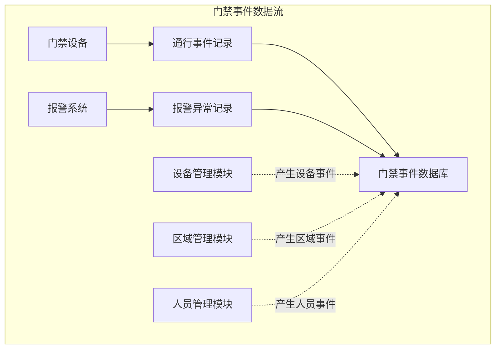
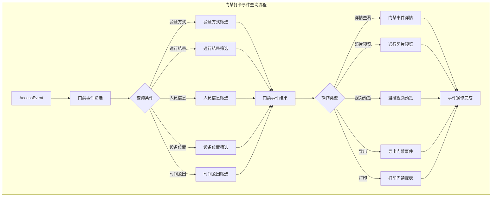
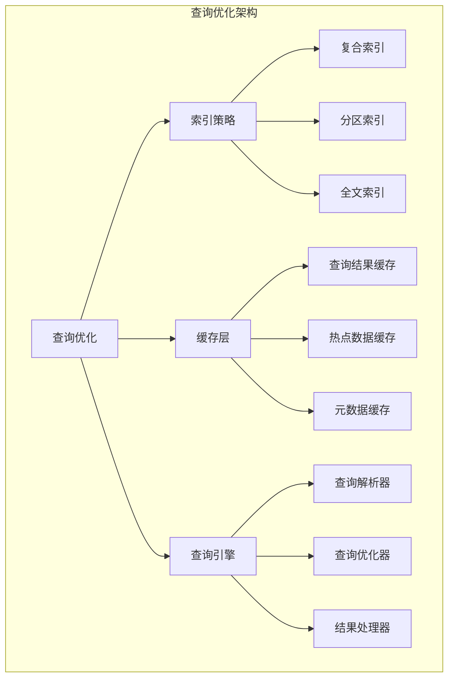

# 事件查询

<cite>
**本文档引用文件**  
- [AccessRecordController.java](file://microservices/ioedream-access-service/src/main/java/net/lab1024/sa/access/controller/AccessRecordController.java)
- [AccessRecordDao.java](file://microservices/ioedream-access-service/src/main/java/net/lab1024/sa/access/dao/AccessRecordDao.java)
- [performance_optimization.sql](file://database/performance_optimization.sql)
- [05-事件记录查询模块流程图.md](file://documentation/03-业务模块/门禁/05-事件记录查询模块流程图.md)
- [12-前端API接口设计.md](file://documentation/03-业务模块/门禁/12-前端API接口设计.md)
- [功能概述.md](file://documentation/03-业务模块/门禁系统/功能概述.md)
- [event-record-enhancement/spec.md](file://openspec/changes/archive/completed-proposals/implement-access-control-missing-functions/specs/event-record-enhancement/spec.md)
</cite>

## 目录
1. [事件采集机制](#事件采集机制)
2. [事件数据存储与索引优化](#事件数据存储与索引优化)
3. [多维度事件查询实现](#多维度事件查询实现)
4. [事件查询API使用示例](#事件查询api使用示例)
5. [高并发查询性能优化](#高并发查询性能优化)

## 事件采集机制

门禁事件采集机制是系统的核心功能，负责实时捕获和记录所有与门禁相关的通行、报警和设备状态变化事件。系统通过分布式架构，从门禁设备、报警系统和管理模块等多个数据源采集事件，确保数据的完整性和实时性。

门禁事件主要分为两大类：门禁打卡事件和报警异常事件。门禁打卡事件包括刷卡通行、生物识别（人脸、指纹、掌纹）、密码输入、二维码扫描以及多重验证等所有通行验证记录。报警异常事件则涵盖非法通行、设备异常、安全告警和系统异常等各类异常情况。

事件数据流从门禁设备和报警系统产生，经过处理后统一存储到门禁事件数据库中。同时，设备管理、区域管理和人员管理等其他业务模块也会产生相关的事件记录，共同构成完整的门禁事件中心。

**事件类型与触发条件**
- **正常通行事件**：当用户通过合法验证方式（如刷卡、人脸识别）成功通过门禁时触发。
- **报警事件**：当发生非法通行尝试、设备故障、防拆报警、门磁异常或验证超时等情况时触发。
- **设备状态变化事件**：当门禁设备的在线/离线状态、健康度或网络连接质量发生变化时触发。



**Diagram sources**
- [05-事件记录查询模块流程图.md](file://documentation/03-业务模块/门禁/05-事件记录查询模块流程图.md)

**Section sources**
- [05-事件记录查询模块流程图.md](file://documentation/03-业务模块/门禁/05-事件记录查询模块流程图.md)
- [功能概述.md](file://documentation/03-业务模块/门禁系统/功能概述.md)

## 事件数据存储与索引优化

门禁事件数据存储采用MySQL 8.0数据库，通过精心设计的表结构和索引策略来支持海量数据的高效查询。系统遵循企业级微服务架构规范，使用MyBatis-Plus作为持久层框架，DAO层接口统一使用`Dao`后缀命名，并通过`@Mapper`注解进行标识。

核心事件表`t_access_record`存储了所有门禁事件的详细信息，包括事件ID、用户ID、设备ID、区域ID、验证方式、通行结果、处理时间、响应时间、客户端IP、用户代理以及附加数据等字段。为确保数据完整性，表中包含`create_time`和`deleted_flag`字段，支持数据的软删除和审计追踪。

为了优化查询性能，系统实施了全面的索引优化策略。针对门禁记录表创建了多个复合索引，以支持不同维度的查询需求。这些索引包括基于用户ID和访问时间的索引、基于设备ID和访问时间的索引，以及基于通行状态和访问时间的索引。

```mermaid
erDiagram
t_access_record {
bigint id PK
varchar(64) log_id UK
varchar(50) event_type
bigint user_id
varchar(50) device_id
varchar(50) area_id
varchar(50) authentication_method
varchar(50) access_result
text failure_reason
decimal(5,4) biometric_confidence
datetime processing_time
int response_time_ms
varchar(45) client_ip
varchar(500) user_agent
text additional_data
datetime create_time
tinyint deleted_flag
}
t_access_record ||--o{ t_media_file : "包含"
```

**Diagram sources**
- [performance_optimization.sql](file://database/performance_optimization.sql)
- [功能概述.md](file://documentation/03-业务模块/门禁系统/功能概述.md)

**Section sources**
- [performance_optimization.sql](file://database/performance_optimization.sql)
- [功能概述.md](file://documentation/03-业务模块/门禁系统/功能概述.md)

## 多维度事件查询实现

系统实现了强大的多维度事件查询功能，支持按时间范围、门禁设备、人员信息和事件类型等条件进行组合查询。查询功能遵循四层架构规范，Controller层负责HTTP请求处理和参数验证，Service层封装核心业务逻辑，DAO层执行数据库查询操作。

查询接口支持复杂的条件组合，用户可以同时指定时间范围、设备位置、人员类型和事件结果等多个筛选条件。系统采用分页查询机制，通过`PageParam`参数控制每页显示的记录数和当前页码，避免一次性加载过多数据导致性能问题。

查询结果不仅包含事件的基本信息，还支持关联查询相关的媒体文件（如通行照片和监控视频），为用户提供完整的事件上下文。系统还实现了查询结果缓存机制，对热点查询结果进行缓存，显著提升重复查询的响应速度。



**Diagram sources**
- [05-事件记录查询模块流程图.md](file://documentation/03-业务模块/门禁/05-事件记录查询模块流程图.md)

**Section sources**
- [AccessRecordController.java](file://microservices/ioedream-access-service/src/main/java/net/lab1024/sa/access/controller/AccessRecordController.java)
- [AccessRecordDao.java](file://microservices/ioedream-access-service/src/main/java/net/lab1024/sa/access/dao/AccessRecordDao.java)

## 事件查询API使用示例

系统提供了RESTful风格的事件查询API，支持多种请求参数和分页处理。API遵循统一的响应格式，所有接口返回`ResponseDTO`对象，包含状态码、消息、数据和时间戳等信息。

### 1. 事件列表查询

**接口路径**: `GET /api/access/page`

**请求参数**:
```json
{
  "page": 1,
  "size": 20,
  "userId": 1001,
  "deviceId": "DEV-001",
  "accessResult": "SUCCESS"
}
```

**响应数据**:
```json
{
  "code": 200,
  "data": {
    "total": 2345,
    "page": 1,
    "size": 20,
    "summary": {
      "successCount": 2100,
      "failedCount": 245,
      "successRate": 89.5
    },
    "records": [
      {
        "eventId": "EVT-12345",
        "deviceId": "DEV-001",
        "deviceName": "主楼前门",
        "areaName": "主楼1层大厅",
        "eventType": "ACCESS_GRANTED",
        "userId": 1001,
        "userName": "张三",
        "userType": "EMPLOYEE",
        "accessMethod": "CARD",
        "cardNumber": "****-****-****-1234",
        "timestamp": "2025-12-02T10:15:30Z",
        "result": "SUCCESS",
        "duration": 1200,
        "photoUrl": "https://api.ioedream.com/photos/evt-12345.jpg",
        "description": "门禁卡刷卡成功"
      }
    ]
  }
}
```

### 2. 事件详情查询

**接口路径**: `GET /api/access/{recordId}`

**响应数据**:
```json
{
  "code": 200,
  "data": {
    "eventId": "EVT-12345",
    "deviceId": "DEV-001",
    "deviceName": "主楼前门",
    "areaId": 1001,
    "areaName": "main-building-1f-hall",
    "eventType": "ACCESS_GRANTED",
    "userId": 1001,
    "userName": "张三",
    "userType": "EMPLOYEE",
    "department": "技术部",
    "position": "高级工程师",
    "accessMethod": "CARD",
    "credentialInfo": {
      "cardNumber": "****-****-****-1234",
      "cardType": "EMPLOYEE_CARD",
      "cardHolder": "张三"
    },
    "verificationData": {
      "method": "CARD",
      "result": "SUCCESS",
      "matchScore": 0.95,
      "verificationTime": 200
    },
    "timestamp": "2025-12-02T10:15:30Z",
    "result": "SUCCESS",
    "duration": 1200,
    "media": {
      "photoUrl": "https://api.ioedream.com/photos/evt-12345.jpg",
      "videoUrl": "https://api.ioedream.com/videos/evt-12345.mp4",
      "audioUrl": null
    },
    "location": {
      "latitude": 39.908823,
      "longitude": 116.397470,
      "altitude": 5.2
    },
    "additionalInfo": {
      "entryDirection": "IN",
      "temperature": 36.5,
      "deviceBattery": 85,
      "networkSignal": -45
    }
  }
}
```

**Section sources**
- [12-前端API接口设计.md](file://documentation/03-业务模块/门禁/12-前端API接口设计.md)
- [event-record-enhancement/spec.md](file://openspec/changes/archive/completed-proposals/implement-access-control-missing-functions/specs/event-record-enhancement/spec.md)

## 高并发查询性能优化

为应对高并发场景下的查询性能挑战，系统实施了多层次的优化策略。首先，通过创建复合索引和分区索引，优化了数据库查询执行计划，确保在大数据量下仍能保持快速响应。

其次，系统引入了多级缓存机制，包括Redis分布式缓存和Caffeine本地缓存。查询结果缓存对热点数据进行缓存，避免重复查询数据库。同时，系统实现了查询结果缓存失效策略，确保数据的实时性和一致性。

在架构层面，系统支持读写分离，将查询请求路由到只读副本，减轻主数据库的负载压力。对于复杂的统计报表查询，系统采用异步处理机制，通过消息队列将查询任务放入后台处理，避免阻塞主线程。

此外，系统还实现了查询超时控制，防止长时间运行的查询影响整体系统性能。通过Nacos配置中心，可以动态调整查询超时时间、缓存策略和分页大小等参数，实现灵活的性能调优。



**Diagram sources**
- [event-record-enhancement/spec.md](file://openspec/changes/archive/completed-proposals/implement-access-control-missing-functions/specs/event-record-enhancement/spec.md)

**Section sources**
- [performance_optimization.sql](file://database/performance_optimization.sql)
- [event-record-enhancement/spec.md](file://openspec/changes/archive/completed-proposals/implement-access-control-missing-functions/specs/event-record-enhancement/spec.md)