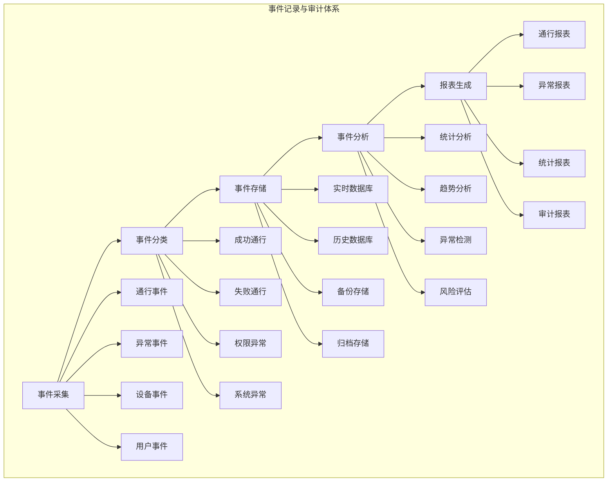
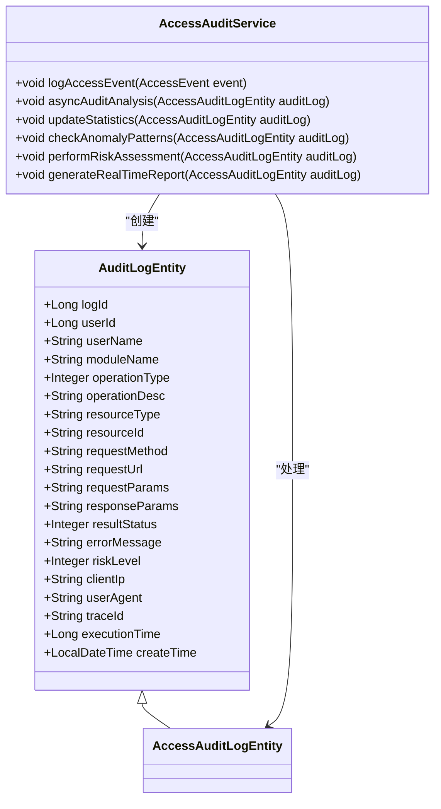
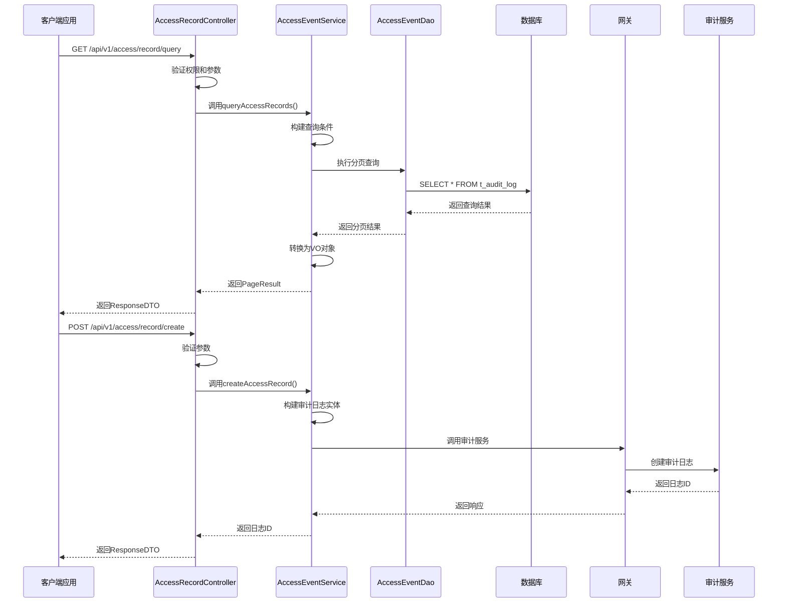
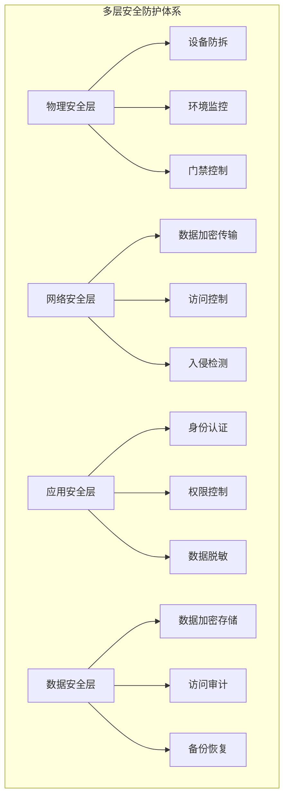
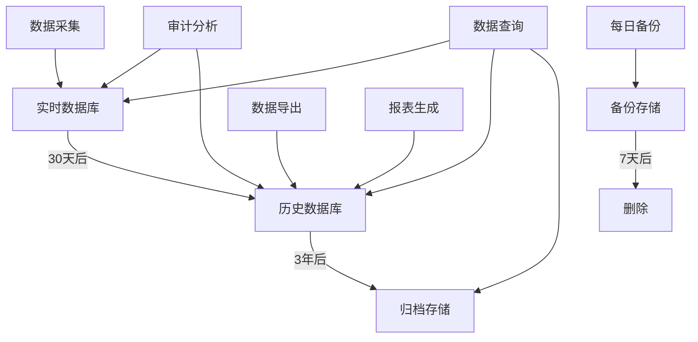
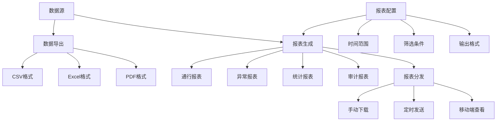
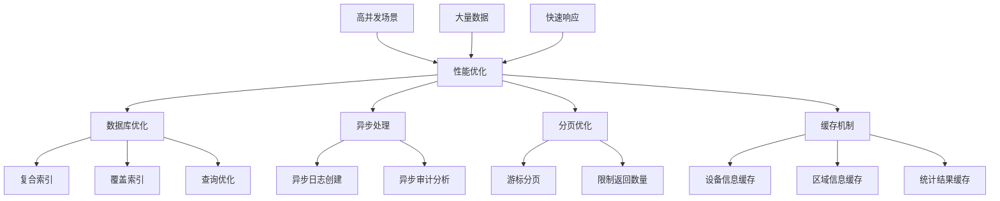

# 事件记录与审计

<cite>
**本文档引用文件**   
- [t_audit_log.sql](file://database-scripts/common-service/10-t_audit_log.sql)
- [t_alert.sql](file://database-scripts/common-service/11-t_alert.sql)
- [t_alert_rule.sql](file://database-scripts/common-service/12-t_alert_rule.sql)
- [AccessRecordController.java](file://microservices/ioedream-access-service/src/main/java/net/lab1024/sa/access/controller/AccessRecordController.java)
- [AccessEventService.java](file://microservices/ioedream-access-service/src/main/java/net/lab1024/sa/access/service/AccessEventService.java)
- [AccessEventServiceImpl.java](file://microservices/ioedream-access-service/src/main/java/net/lab1024/sa/access/service/impl/AccessEventServiceImpl.java)
- [AccessEventDao.java](file://microservices/ioedream-access-service/src/main/java/net/lab1024/sa/access/dao/AccessEventDao.java)
- [access_index_optimization.sql](file://microservices/ioedream-access-service/src/main/resources/sql/access_index_optimization.sql)
- [功能概述.md](file://documentation/03-业务模块/门禁系统/功能概述.md)
- [monitor.vue](file://smart-app/src/pages/access/monitor.vue)
</cite>

## 目录
1. [引言](#引言)
2. [事件记录体系](#事件记录体系)
3. [审计日志实现](#审计日志实现)
4. [事件查询API使用方法](#事件查询api使用方法)
5. [审计日志安全保护机制](#审计日志安全保护机制)
6. [数据保留策略](#数据保留策略)
7. [事件数据导出与报表生成](#事件数据导出与报表生成)
8. [高并发场景性能优化](#高并发场景性能优化)

## 引言

事件记录与审计功能是门禁系统的核心组成部分，负责采集、存储和分析各类门禁事件，包括正常通行、报警事件和操作日志等。本系统通过统一的审计日志机制，实现了对门禁事件的全面监控和追溯能力。系统采用微服务架构，将事件记录、存储、查询和分析等功能模块化，确保了系统的可扩展性和可靠性。通过多维度的事件筛选和查询功能，管理员可以快速定位特定事件，进行安全审计和故障排查。同时，系统提供了完善的数据导出和报表生成功能，支持对门禁数据进行深度分析和统计。

## 事件记录体系

门禁系统的事件记录体系采用分层架构设计，从事件采集到最终的报表生成，形成了完整的闭环。系统通过设备协议实时采集门禁事件，包括正常通行、异常事件、设备事件和用户事件等。这些事件首先被分类为成功通行、失败通行、权限异常和系统异常等类型，然后存储到实时数据库中。系统支持将历史数据归档到专门的历史数据库和备份存储中，确保数据的长期保存和可追溯性。在数据存储的基础上，系统提供统计分析、趋势分析、异常检测和风险评估等功能，最终生成各类通行报表、异常报表、统计报表和审计报表。

**图源**
- [功能概述.md](file://documentation/03-业务模块/门禁系统/功能概述.md)

**本节来源**
- [功能概述.md](file://documentation/03-业务模块/门禁系统/功能概述.md)

## 审计日志实现

审计日志的实现基于`t_audit_log`表，该表记录了系统中所有关键操作的详细信息。日志表包含用户ID、用户名、模块名称、操作类型、资源类型、资源ID、请求方法、请求URL、请求参数、响应数据、结果状态、错误信息、风险等级、客户端IP、用户代理、追踪ID、执行时间和创建时间等字段。操作类型包括查询、新增、修改、删除、导出、导入、登录和登出等，结果状态分为成功、失败和异常三种。风险等级分为低、中、高三个级别，用于标识操作的安全风险。

当门禁事件发生时，系统会创建审计日志实体，设置相应的模块名称（ACCESS）、操作类型（新增）、资源类型（区域ID）、资源ID（设备ID）和操作描述等信息。同时，系统会记录通行时间、结果状态和请求参数等详细信息。审计日志的创建过程通过网关调用公共服务完成，确保了日志记录的统一性和可靠性。系统还支持异步处理审计分析，包括更新统计信息、检查异常模式、进行风险评估和生成实时报告等。

**图源**
- [t_audit_log.sql](file://database-scripts/common-service/10-t_audit_log.sql)
- [功能概述.md](file://documentation/03-业务模块/门禁系统/功能概述.md)

**本节来源**
- [t_audit_log.sql](file://database-scripts/common-service/10-t_audit_log.sql)
- [功能概述.md](file://documentation/03-业务模块/门禁系统/功能概述.md)

## 事件查询API使用方法

事件查询API提供了丰富的查询功能，支持按时间、设备、人员、事件类型等多维度筛选。主要API接口包括分页查询门禁记录、获取门禁记录统计和创建门禁记录等。分页查询接口支持通过页码、每页大小、用户ID、设备ID、区域ID、开始日期、结束日期和通行结果等参数进行筛选。获取统计接口支持按时间范围和区域获取门禁记录的统计数据。创建记录接口用于设备协议推送门禁记录。

查询API采用RESTful设计规范，使用GET方法进行查询操作，POST方法进行创建操作。接口返回统一的ResponseDTO格式，包含成功状态、错误码、错误消息和数据等字段。分页查询结果包含记录列表、总记录数、当前页码和每页大小等信息。统计结果包含总记录数、成功数、失败数、异常数以及按操作类型、区域和设备的统计信息。

**图源**
- [AccessRecordController.java](file://microservices/ioedream-access-service/src/main/java/net/lab1024/sa/access/controller/AccessRecordController.java)
- [AccessEventServiceImpl.java](file://microservices/ioedream-access-service/src/main/java/net/lab1024/sa/access/service/impl/AccessEventServiceImpl.java)

**本节来源**
- [AccessRecordController.java](file://microservices/ioedream-access-service/src/main/java/net/lab1024/sa/access/controller/AccessRecordController.java)
- [AccessEventService.java](file://microservices/ioedream-access-service/src/main/java/net/lab1024/sa/access/service/AccessEventService.java)
- [AccessEventServiceImpl.java](file://microservices/ioedream-access-service/src/main/java/net/lab1024/sa/access/service/impl/AccessEventServiceImpl.java)

## 审计日志安全保护机制

审计日志的安全保护机制包括多层防护体系和安全策略配置。多层安全防护体系涵盖物理安全层、网络安全层、应用安全层和数据安全层。物理安全层包括设备防拆、环境监控和门禁控制；网络安全层包括数据加密传输、访问控制和入侵检测；应用安全层包括身份认证、权限控制和数据脱敏；数据安全层包括数据加密存储、访问审计和备份恢复。

系统通过安全策略配置文件定义了详细的认证和授权规则。多因素认证是强制要求，活体检测功能必须启用，生物特征识别的阈值设置为0.85。系统还支持基于角色的访问控制（RBAC），不同角色具有不同的权限范围。审计日志本身也受到保护，只有授权用户才能访问和查询日志数据。系统记录了所有对审计日志的访问操作，形成了二次审计的能力。

**图源**
- [功能概述.md](file://documentation/03-业务模块/门禁系统/功能概述.md)

**本节来源**
- [功能概述.md](file://documentation/03-业务模块/门禁系统/功能概述.md)

## 数据保留策略

系统的数据保留策略根据数据的重要性和使用频率分为不同的存储层级。实时数据库存储最近30天的活跃数据，支持快速查询和分析。历史数据库存储过去1-3年的数据，用于长期统计和审计。备份存储定期（每日）备份关键数据，保留7天，用于灾难恢复。归档存储保存3年以上的数据，采用压缩存储，主要用于法律合规和历史追溯。

系统通过定时任务自动执行数据归档和清理操作。对于超过30天的门禁事件记录，系统会将其从实时数据库移动到历史数据库。对于超过3年的数据，系统会将其归档到专用的归档存储中。系统还支持配置数据保留策略，管理员可以根据实际需求调整各层级的保留时间。所有数据删除操作都会被记录在审计日志中，确保操作的可追溯性。

**图源**
- [功能概述.md](file://documentation/03-业务模块/门禁系统/功能概述.md)

**本节来源**
- [功能概述.md](file://documentation/03-业务模块/门禁系统/功能概述.md)

## 事件数据导出与报表生成

系统提供了完善的事件数据导出和报表生成功能。数据导出支持将查询结果导出为CSV、Excel和PDF等格式，便于离线分析和存档。报表生成功能包括通行报表、异常报表、统计报表和审计报表等。通行报表展示特定时间段内的通行记录，包括成功和失败的通行事件。异常报表汇总了所有异常事件，如权限异常、系统异常等。统计报表提供按时间、设备、区域等维度的统计数据。审计报表记录了所有关键操作的审计信息。

报表生成支持自定义时间范围、筛选条件和输出格式。系统还支持定时生成报表并自动发送到指定邮箱。移动端应用也提供了报表查看功能，用户可以随时查看最近的访问记录和统计信息。报表数据经过优化处理，确保在大数据量下也能快速生成和加载。

**图源**
- [功能概述.md](file://documentation/03-业务模块/门禁系统/功能概述.md)
- [monitor.vue](file://smart-app/src/pages/access/monitor.vue)

**本节来源**
- [功能概述.md](file://documentation/03-业务模块/门禁系统/功能概述.md)
- [monitor.vue](file://smart-app/src/pages/access/monitor.vue)

## 高并发场景性能优化

在高并发场景下，系统通过多种技术手段进行性能优化。首先，数据库层面通过创建复合索引来优化查询性能。关键索引包括用户ID+访问时间、设备ID+访问时间、区域ID+访问时间、访问时间+访问结果+访问类型等组合索引。这些索引显著提升了分页查询和统计查询的效率。

其次，系统采用异步处理机制，将审计日志的创建和分析操作异步化，避免阻塞主业务流程。对于大量数据的查询，系统支持游标分页替代深度分页，减少数据库压力。缓存机制也被广泛应用，常用的数据如设备信息、区域信息等会被缓存，减少数据库查询次数。

**图源**
- [access_index_optimization.sql](file://microservices/ioedream-access-service/src/main/resources/sql/access_index_optimization.sql)
- [AccessEventServiceImpl.java](file://microservices/ioedream-access-service/src/main/java/net/lab1024/sa/access/service/impl/AccessEventServiceImpl.java)

**本节来源**
- [access_index_optimization.sql](file://microservices/ioedream-access-service/src/main/resources/sql/access_index_optimization.sql)
- [AccessEventDao.java](file://microservices/ioedream-access-service/src/main/java/net/lab1024/sa/access/dao/AccessEventDao.java)
- [AccessEventServiceImpl.java](file://microservices/ioedream-access-service/src/main/java/net/lab1024/sa/access/service/impl/AccessEventServiceImpl.java)