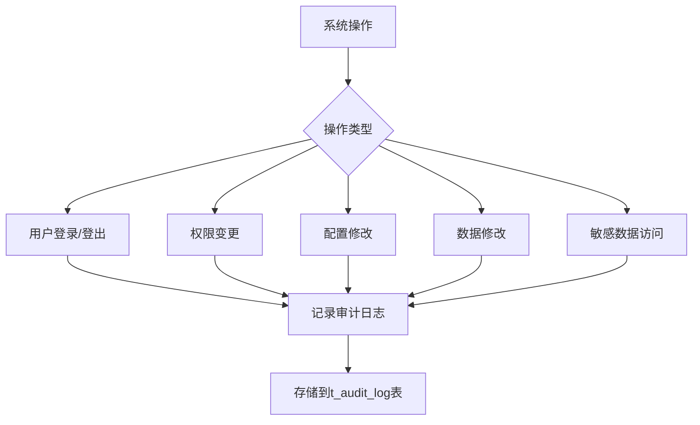
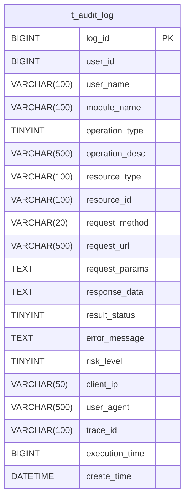
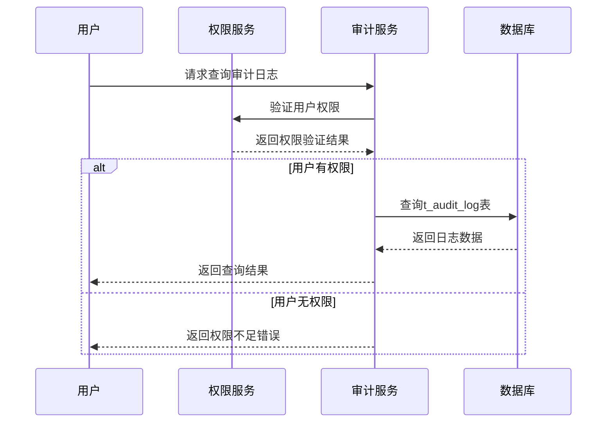
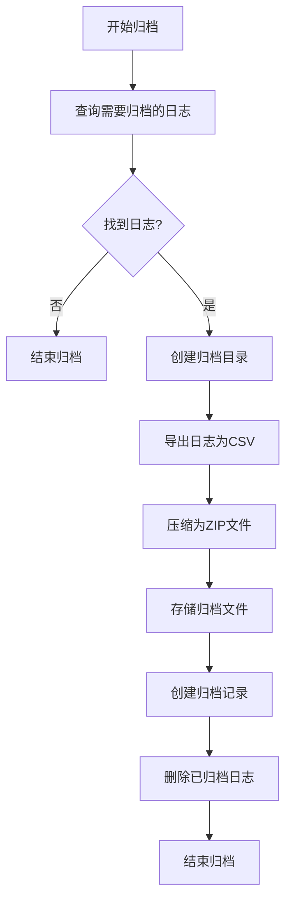
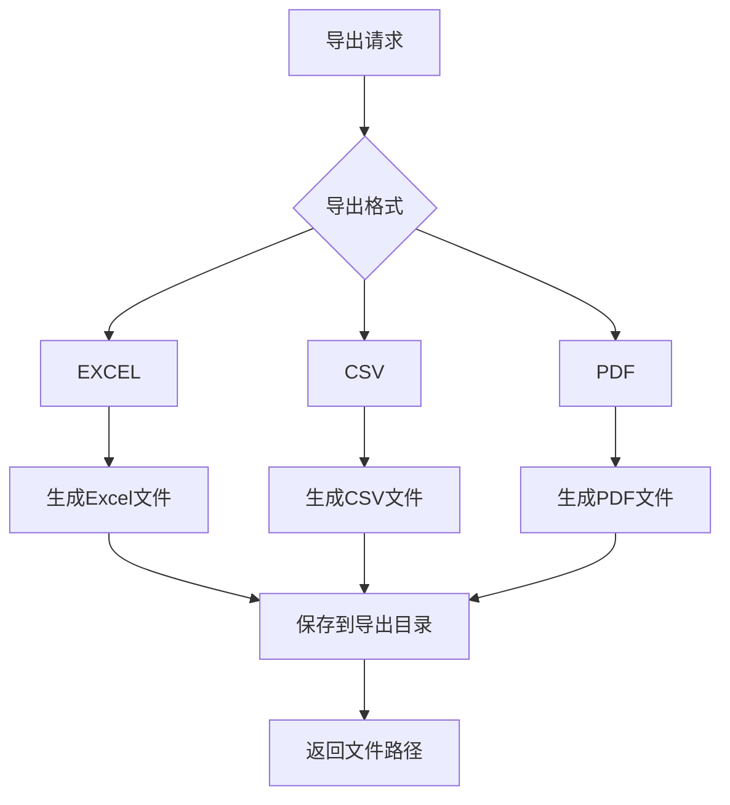

# 审计日志

<cite>
**本文档引用的文件**  
- [10-t_audit_log.sql](file://database-scripts/common-service/10-t_audit_log.sql)
- [11-t_common_audit_archive.sql](file://database-scripts/common-service/11-t_common_audit_archive.sql)
- [AuditLogEntity.java](file://microservices/microservices-common/src/main/java/net/lab1024/sa/common/audit/entity/AuditLogEntity.java)
- [AuditService.java](file://microservices/ioedream-common-service/src/main/java/net/lab1024/sa/common/audit/service/AuditService.java)
- [AuditServiceImpl.java](file://microservices/ioedream-common-service/src/main/java/net/lab1024/sa/common/audit/service/impl/AuditServiceImpl.java)
- [AuditManager.java](file://microservices/microservices-common/src/main/java/net/lab1024/sa/common/audit/manager/AuditManager.java)
- [AuditArchiveEntity.java](file://microservices/microservices-common/src/main/java/net/lab1024/sa/common/audit/entity/AuditArchiveEntity.java)
- [AuditController.java](file://restful_refactor_backup_20251202_014224/microservices_ioedream-audit-service_src_main_java_net_lab1024_sa_audit_controller_AuditController.java)
- [PRODUCTION_SECURITY_CHECKLIST.md](file://PRODUCTION_SECURITY_CHECKLIST.md)
</cite>

## 目录
1. [引言](#引言)
2. [审计日志记录范围](#审计日志记录范围)
3. [数据表结构与字段含义](#数据表结构与字段含义)
4. [安全保护机制](#安全保护机制)
5. [日志保留策略与归档机制](#日志保留策略与归档机制)
6. [日志导出与报表生成](#日志导出与报表生成)
7. [安全合规与审计追溯](#安全合规与审计追溯)

## 引言

审计日志功能是系统安全与合规性的重要组成部分，用于记录关键操作的详细信息，支持安全事件分析、操作追溯和合规性审计。本系统实现了完整的审计日志功能，覆盖用户登录、权限变更、配置修改等关键操作，提供数据表结构、安全保护、保留策略、归档机制、导出功能和合规性支持。

**Section sources**
- [10-t_audit_log.sql](file://database-scripts/common-service/10-t_audit_log.sql)
- [PRODUCTION_SECURITY_CHECKLIST.md](file://PRODUCTION_SECURITY_CHECKLIST.md)

## 审计日志记录范围

系统审计日志全面记录了各类关键操作，确保所有重要活动都有迹可循。记录范围包括但不限于：

- **用户身份验证**：用户登录和登出操作，记录用户身份、时间、IP地址和结果状态
- **权限管理**：用户权限的分配、修改和撤销操作
- **配置变更**：系统配置、业务规则和参数的修改操作
- **数据操作**：核心数据的新增、修改、删除和查询操作
- **敏感操作**：数据导出、批量处理和高风险功能的使用
- **系统事件**：服务启动、停止、配置加载等系统级事件

根据生产安全检查清单，系统对不同操作类型实施差异化的审计策略和保留期限，确保关键操作得到充分保护。

**Diagram sources**
- [10-t_audit_log.sql](file://database-scripts/common-service/10-t_audit_log.sql)
- [PRODUCTION_SECURITY_CHECKLIST.md](file://PRODUCTION_SECURITY_CHECKLIST.md)

**Section sources**
- [10-t_audit_log.sql](file://database-scripts/common-service/10-t_audit_log.sql)
- [PRODUCTION_SECURITY_CHECKLIST.md](file://PRODUCTION_SECURITY_CHECKLIST.md)

## 数据表结构与字段含义

审计日志的核心数据表为 `t_audit_log`，其结构设计全面，能够记录操作的完整上下文信息。

### 主要字段说明

| 字段名 | 类型 | 必填 | 说明 |
|--------|------|------|------|
| `log_id` | BIGINT | 是 | 日志ID，主键，自增 |
| `user_id` | BIGINT | 是 | 执行操作的用户ID |
| `user_name` | VARCHAR(100) | 否 | 执行操作的用户名 |
| `module_name` | VARCHAR(100) | 是 | 操作所属模块名称 |
| `operation_type` | TINYINT | 是 | 操作类型：1-查询 2-新增 3-修改 4-删除 5-导出 6-导入 7-登录 8-登出 |
| `operation_desc` | VARCHAR(500) | 否 | 操作描述，说明操作的具体内容 |
| `resource_type` | VARCHAR(100) | 否 | 操作的资源类型 |
| `resource_id` | VARCHAR(100) | 否 | 操作的资源ID |
| `request_method` | VARCHAR(20) | 否 | HTTP请求方法（GET、POST等） |
| `request_url` | VARCHAR(500) | 否 | 请求的URL |
| `request_params` | TEXT | 否 | 请求参数，JSON格式 |
| `response_data` | TEXT | 否 | 响应数据，JSON格式 |
| `result_status` | TINYINT | 是 | 结果状态：1-成功 2-失败 3-异常 |
| `error_message` | TEXT | 否 | 错误信息，当操作失败时记录 |
| `risk_level` | TINYINT | 是 | 风险等级：1-低 2-中 3-高 |
| `client_ip` | VARCHAR(50) | 否 | 客户端IP地址 |
| `user_agent` | VARCHAR(500) | 否 | 用户代理信息 |
| `trace_id` | VARCHAR(100) | 否 | 分布式追踪ID，用于请求链路追踪 |
| `execution_time` | BIGINT | 否 | 操作执行时间（毫秒） |
| `create_time` | DATETIME | 是 | 日志创建时间，自动填充 |

### 索引设计

表中创建了多个索引以支持高效的查询性能：
- `idx_user_id`：按用户ID查询
- `idx_module_name`：按模块名称查询
- `idx_operation_type`：按操作类型查询
- `idx_result_status`：按结果状态查询
- `idx_risk_level`：按风险等级查询
- `idx_trace_id`：按追踪ID查询
- `idx_create_time`：按创建时间查询

**Diagram sources**
- [10-t_audit_log.sql](file://database-scripts/common-service/10-t_audit_log.sql)

**Section sources**
- [10-t_audit_log.sql](file://database-scripts/common-service/10-t_audit_log.sql)
- [AuditLogEntity.java](file://microservices/microservices-common/src/main/java/net/lab1024/sa/common/audit/entity/AuditLogEntity.java)

## 安全保护机制

系统通过多种机制确保审计日志的安全性和完整性，防止日志被篡改或未授权访问。

### 日志不可篡改性保证

审计日志一旦生成，其内容不可修改，确保日志的真实性和可靠性。系统通过以下方式实现：
- **只追加模式**：审计日志表设计为只允许插入新记录，不允许更新或删除已有记录
- **应用层控制**：在服务层实现中，审计日志的创建是单向操作，没有提供修改或删除日志的API
- **数据库约束**：通过数据库表结构设计和权限控制，限制对审计日志表的直接修改

### 访问权限控制

审计日志的访问受到严格的权限控制，确保只有授权人员才能查看：
- **角色基础访问控制**：只有具有审计管理员角色的用户才能访问审计日志查询功能
- **API级权限验证**：所有审计相关的API端点都集成权限验证，确保请求者具有相应权限
- **数据脱敏**：在特定场景下，对敏感信息进行脱敏处理后再展示

**Diagram sources**
- [AuditService.java](file://microservices/ioedream-common-service/src/main/java/net/lab1024/sa/common/audit/service/AuditService.java)
- [AuditController.java](file://restful_refactor_backup_20251202_014224/microservices_ioedream-audit-service_src_main_java_net_lab1024_sa_audit_controller_AuditController.java)

**Section sources**
- [AuditService.java](file://microservices/ioedream-common-service/src/main/java/net/lab1024/sa/common/audit/service/AuditService.java)
- [AuditController.java](file://restful_refactor_backup_20251202_014224/microservices_ioedream-audit-service_src_main_java_net_lab1024_sa_audit_controller_AuditController.java)

## 日志保留策略与归档机制

系统实施了科学的日志保留和归档策略，平衡存储成本与合规要求。

### 保留策略

根据操作的重要性和合规要求，系统对不同类型的审计日志实施差异化的保留策略：
- **用户登录/登出**：保留180天
- **权限变更**：永久保留
- **数据修改**：保留90天
- **配置变更**：永久保留
- **敏感数据访问**：保留180天

### 归档机制

系统支持自动化的日志归档机制，将历史日志从主表移动到归档存储，以优化查询性能和存储空间。

#### 归档流程

1. **归档触发**：系统定期检查需要归档的日志，通常基于时间阈值（如超过90天）
2. **数据导出**：将符合条件的日志数据导出为压缩文件（ZIP格式）
3. **文件存储**：将归档文件存储到指定的归档目录
4. **记录归档**：在归档记录表中创建归档记录，包含归档元数据
5. **数据清理**：从主表中删除已归档的日志记录

#### 归档记录表

归档记录存储在 `t_common_audit_archive` 表中，包含以下关键字段：
- `archive_id`：归档记录ID
- `archive_code`：归档编号，系统唯一
- `archive_time_point`：归档时间点
- `archive_count`：归档日志数量
- `archive_file_path`：归档文件路径
- `archive_file_size`：归档文件大小
- `archive_status`：归档状态（进行中、成功、失败）
- `archive_start_time` 和 `archive_end_time`：归档开始和结束时间

**Diagram sources**
- [11-t_common_audit_archive.sql](file://database-scripts/common-service/11-t_common_audit_archive.sql)
- [AuditManager.java](file://microservices/microservices-common/src/main/java/net/lab1024/sa/common/audit/manager/AuditManager.java)

**Section sources**
- [11-t_common_audit_archive.sql](file://database-scripts/common-service/11-t_common_audit_archive.sql)
- [AuditManager.java](file://microservices/microservices-common/src/main/java/net/lab1024/sa/common/audit/manager/AuditManager.java)
- [AuditArchiveEntity.java](file://microservices/microservices-common/src/main/java/net/lab1024/sa/common/audit/entity/AuditArchiveEntity.java)

## 日志导出与报表生成

系统提供灵活的日志导出和报表生成功能，支持多种数据格式和使用场景。

### 导出功能

#### 支持的格式
- **EXCEL**：默认格式，适合在Excel中进行数据分析
- **CSV**：通用格式，适合导入其他系统或进行批量处理
- **PDF**：适合打印和正式报告

#### 导出限制
- **数量限制**：单次导出最多10,000条记录，防止系统资源过度消耗
- **时间范围**：建议导出时间范围不超过30天，以保证导出性能
- **频率限制**：对频繁导出操作进行限流，防止滥用

#### 性能考虑
- **异步处理**：对于大量数据的导出，系统采用异步处理模式，避免阻塞主线程
- **内存优化**：使用流式处理方式生成文件，避免将所有数据加载到内存
- **索引利用**：导出查询充分利用数据库索引，提高查询效率

### 报表生成

系统支持生成多种类型的审计报表：
- **操作统计报表**：按操作类型、模块、用户等维度统计操作次数
- **风险分析报表**：汇总高风险操作，识别潜在安全威胁
- **合规报告**：满足特定合规标准的审计报告
- **用户活动报表**：展示用户的操作历史和行为模式

**Diagram sources**
- [AuditManager.java](file://microservices/microservices-common/src/main/java/net/lab1024/sa/common/audit/manager/AuditManager.java)
- [AuditService.java](file://microservices/ioedream-common-service/src/main/java/net/lab1024/sa/common/audit/service/AuditService.java)

**Section sources**
- [AuditManager.java](file://microservices/microservices-common/src/main/java/net/lab1024/sa/common/audit/manager/AuditManager.java)
- [AuditService.java](file://microservices/ioedream-common-service/src/main/java/net/lab1024/sa/common/audit/service/AuditService.java)

## 安全合规与审计追溯

系统设计充分考虑了安全合规要求，确保能够满足各种审计和监管需求。

### 合规性支持

系统审计功能满足以下合规要求：
- **操作可追溯**：每条日志都包含操作者、时间、IP地址等完整上下文，支持操作追溯
- **数据完整性**：通过不可篡改机制确保日志数据的完整性和真实性
- **访问控制**：严格的权限控制确保只有授权人员才能访问审计数据
- **保留策略**：差异化的保留策略满足不同法规对数据保留期限的要求

### 审计追溯能力

系统提供强大的审计追溯能力：
- **多维度查询**：支持按用户、时间、模块、操作类型等多维度组合查询
- **全文搜索**：支持关键词搜索，快速定位特定操作
- **链路追踪**：通过 `trace_id` 字段支持分布式系统的请求链路追踪
- **归档追溯**：归档记录表保存了完整的归档历史，支持对历史归档的追溯

这些功能共同确保系统能够满足严格的审计追溯需求，为安全事件调查、合规审计和内部审查提供可靠的数据支持。

**Section sources**
- [PRODUCTION_SECURITY_CHECKLIST.md](file://PRODUCTION_SECURITY_CHECKLIST.md)
- [AuditService.java](file://microservices/ioedream-common-service/src/main/java/net/lab1024/sa/common/audit/service/AuditService.java)
- [AuditController.java](file://restful_refactor_backup_20251202_014224/microservices_ioedream-audit-service_src_main_java_net_lab1024_sa_audit_controller_AuditController.java)