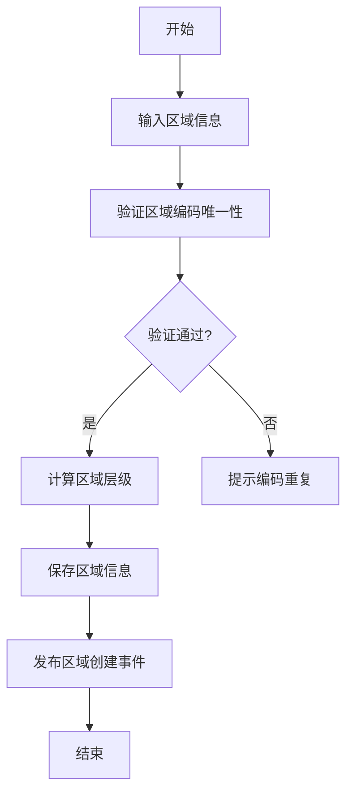
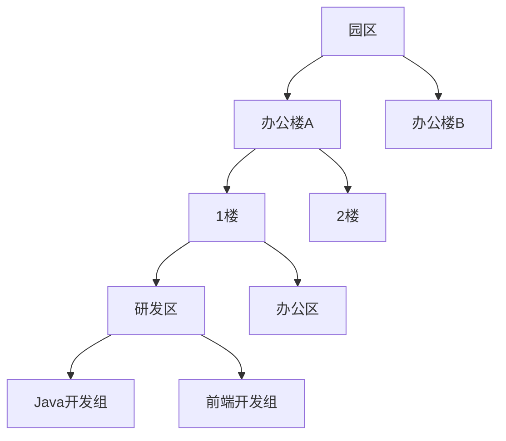
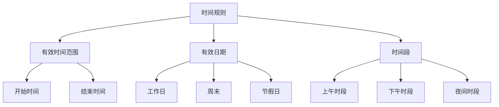
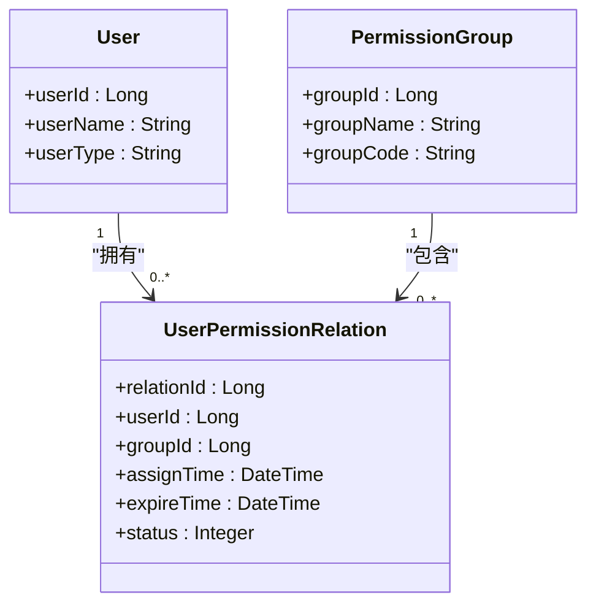
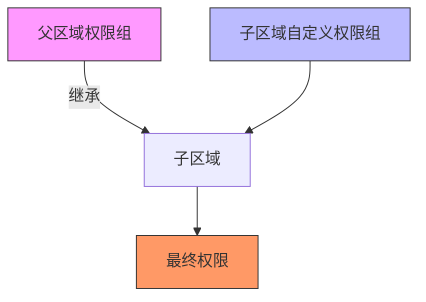
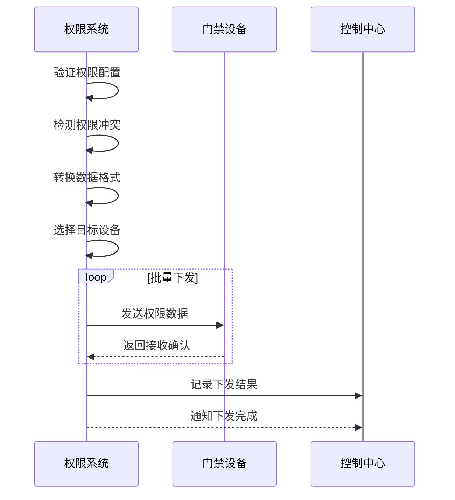
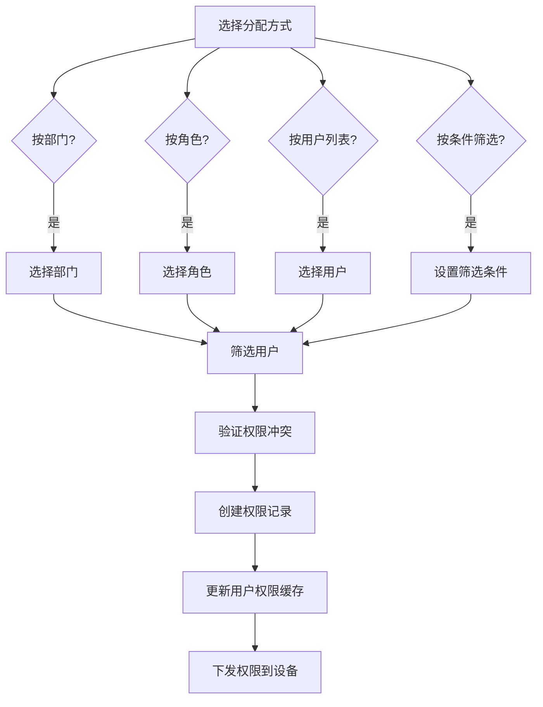
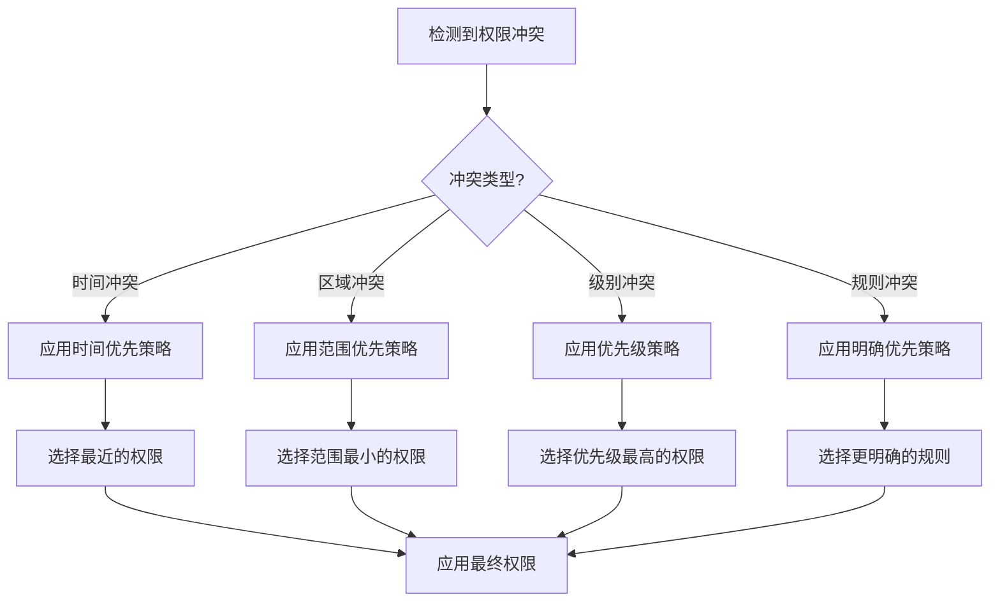
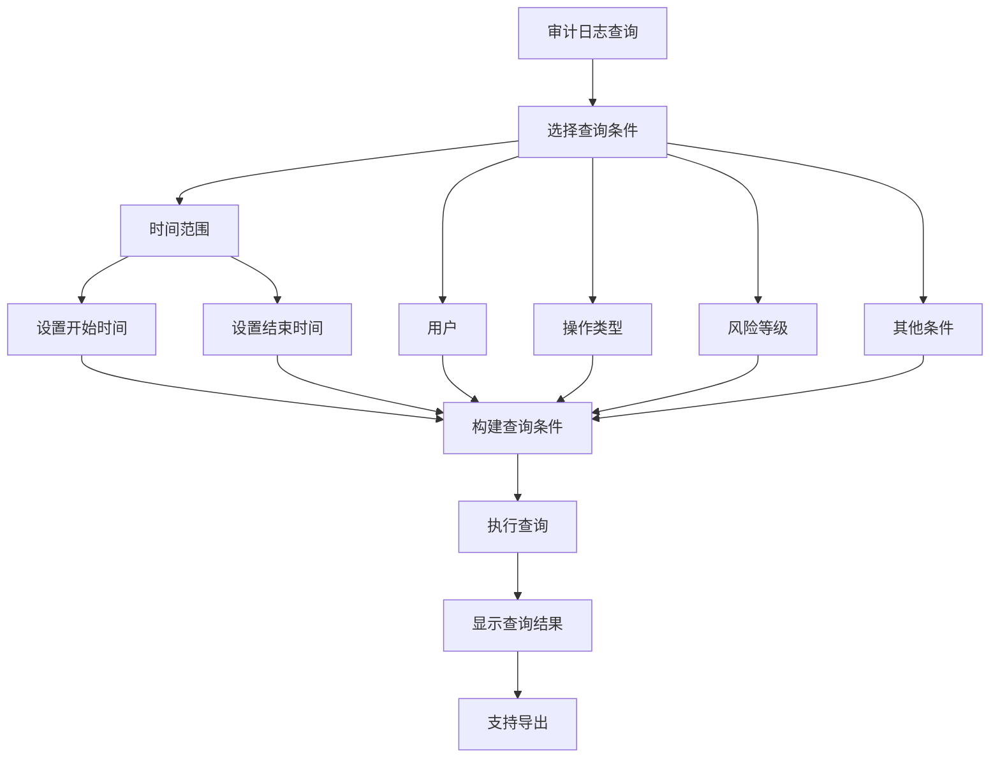

# 区域权限管理

<cite>
**本文档引用文件**
- [smart-area.md](file://docs\COMMON_MODULES\smart-area.md)
- [smart-permission.md](file://docs\COMMON_MODULES\smart-permission.md)
- [AccessAreaController.java](file://restful_refactor_backup_20251202_014224\microservices_ioedream-access-service_src_main_java_net_lab1024_sa_access_controller_AccessAreaController.java)
- [AreaController.java](file://docs\COMMON_MODULES\smart-area.md)
- [t_area.sql](file://docs\COMMON_MODULES\smart-area.md)
- [t_area_user.sql](file://docs\COMMON_MODULES\smart-area.md)
- [smart_access_area_group.sql](file://documentation\technical\smart-access.md)
- [t_audit_log.sql](file://database-scripts\common-service/10-t_audit_log.sql)
- [功能概述.md](file://documentation\03-业务模块\门禁系统\功能概述.md)
</cite>

## 目录
1. [区域管理](#区域管理)
2. [权限组配置](#权限组配置)
3. [用户与权限组关联](#用户与权限组关联)
4. [权限下发流程](#权限下发流程)
5. [批量权限分配与继承](#批量权限分配与继承)
6. [权限冲突解决策略](#权限冲突解决策略)
7. [权限审计日志](#权限审计日志)

## 区域管理

区域管理是权限系统的基础，支持多级区域结构和层级关系管理。系统提供区域的创建、编辑、删除和层级管理功能。

### 区域创建与编辑
区域创建时需要指定区域编码、名称、类型、父区域等信息。区域编码必须唯一，系统会自动验证编码的唯一性。创建区域时，系统会自动计算区域层级，并构建区域路径。



**区域表 (t_area) 结构**:
- area_id: 区域ID (主键)
- area_code: 区域编码 (唯一)
- area_name: 区域名称
- area_type: 区域类型
- area_level: 区域层级
- parent_id: 父区域ID
- path: 区域路径
- status: 状态 (1-启用, 0-禁用)

**区域类型包括**:
- CAMPUS: 园区
- BUILDING: 楼栋
- FLOOR: 楼层
- ROOM: 房间
- OUTDOOR: 室外
- PARKING: 停车场
- ENTRANCE: 出入口

### 区域删除
删除区域时需要满足以下条件：
1. 区域不能有子区域
2. 区域不能有关联设备
3. 区域不能有用户权限关联

系统采用软删除机制，删除后区域状态变为禁用，相关权限和关联信息会被清理。

### 区域层级关系
系统支持无限层级的区域树形结构，每个区域可以有多个子区域。区域层级关系通过parent_id字段维护，系统提供区域树的构建和查询功能。



**区域人员关联表 (t_area_user) 结构**:
- relation_id: 关联ID (主键)
- area_id: 区域ID
- user_id: 用户ID
- user_type: 用户类型
- relation_type: 关联类型
- access_level: 访问级别
- valid_start_time: 有效开始时间
- valid_end_time: 有效结束时间
- status: 状态 (1-有效, 0-已撤销)

**Section sources**
- [smart-area.md](file://docs\COMMON_MODULES\smart-area.md#L1-L800)
- [AccessAreaController.java](file://restful_refactor_backup_20251202_014224\microservices_ioedream-access-service_src_main_java_net_lab1024_sa_access_controller_AccessAreaController.java#L1-L29)

## 权限组配置

权限组是权限管理的核心概念，用于批量配置和管理区域权限。权限组支持时间规则、通行规则和特殊权限设置。

### 权限组创建
权限组包含以下配置信息：
- 权限组名称和编码
- 关联的区域列表
- 关联的设备列表
- 默认通行时间规则
- 默认通行日期规则
- 状态 (启用/禁用)

```sql
CREATE TABLE smart_access_area_group (
    group_id BIGINT PRIMARY KEY AUTO_INCREMENT COMMENT '权限组ID',
    group_name VARCHAR(200) NOT NULL COMMENT '权限组名称',
    group_code VARCHAR(100) NOT NULL COMMENT '权限组编码',
    description TEXT COMMENT '描述',
    area_ids TEXT COMMENT '区域ID列表',
    device_ids TEXT COMMENT '设备ID列表',
    default_start_time TIME COMMENT '默认开始时间',
    default_end_time TIME COMMENT '默认结束时间',
    default_weekdays VARCHAR(20) DEFAULT '1,2,3,4,5' COMMENT '默认通行日期',
    status TINYINT DEFAULT 1 COMMENT '状态：0-禁用，1-启用'
) ENGINE=InnoDB DEFAULT CHARSET=utf8mb4 COMMENT='区域权限组表';
```

### 时间规则配置
时间规则定义了权限的有效时间段，包括：
- **有效时间范围**: 权限的开始和结束时间
- **有效日期**: 工作日、周末、节假日等
- **时间段**: 上午、下午、夜间等具体时间段



### 通行规则配置
通行规则定义了具体的通行策略，包括：
- **通行方式**: 人脸识别、指纹识别、刷卡等
- **验证级别**: 单一验证、双重验证、多重验证
- **反潜规则**: 防止尾随进入
- **联动控制**: 与其他系统联动

### 特殊权限设置
特殊权限用于处理特殊情况，包括：
- **临时权限**: 短期访问权限
- **紧急权限**: 紧急情况下的通行权限
- **维护权限**: 设备维护人员的特殊权限

**Section sources**
- [smart-access.md](file://documentation\technical\smart-access.md#L197-L223)
- [功能概述.md](file://documentation\03-业务模块\门禁系统\功能概述.md#L406-L489)

## 用户与权限组关联

用户与权限组的关联机制实现了权限的批量分配和管理。通过将用户关联到权限组，用户自动获得权限组定义的所有权限。

### 关联机制
用户与权限组的关联通过以下方式实现：
1. **直接关联**: 将用户直接分配到权限组
2. **角色关联**: 通过用户角色间接关联到权限组
3. **部门关联**: 通过用户所属部门关联到权限组



### 权限继承
权限继承机制允许子区域自动继承父区域的权限配置。当父区域的权限发生变化时，子区域的权限会自动同步更新。

**权限继承规则**:
1. 子区域继承父区域的所有权限组
2. 子区域可以定义额外的权限组
3. 子区域的权限优先级高于继承的权限
4. 禁用继承时，子区域只保留自己定义的权限



**Section sources**
- [smart-area.md](file://docs\COMMON_MODULES\smart-area.md#L314-L325)
- [功能概述.md](file://documentation\03-业务模块\门禁系统\功能概述.md#L406-L489)

## 权限下发流程

权限下发是将配置好的权限信息同步到门禁设备的过程，确保用户可以在实际场景中使用权限。

### 下发流程
权限下发流程包括以下步骤：
1. **权限验证**: 验证权限配置的完整性和正确性
2. **冲突检测**: 检测权限冲突，如时间重叠、区域重叠等
3. **数据转换**: 将权限数据转换为设备可识别的格式
4. **设备选择**: 确定需要下发权限的设备列表
5. **批量下发**: 向选中的设备批量发送权限数据
6. **结果反馈**: 接收设备的响应，记录下发结果



### 下发策略
系统支持多种权限下发策略：
- **实时下发**: 权限变更后立即下发到设备
- **定时下发**: 在指定时间批量下发权限
- **增量下发**: 只下发变更的权限数据
- **全量下发**: 下发所有权限数据

### 错误处理
权限下发过程中可能遇到的错误及处理方式：
- **设备离线**: 记录失败，等待设备上线后重试
- **网络超时**: 重试机制，最多重试3次
- **数据格式错误**: 记录错误日志，通知管理员
- **存储空间不足**: 清理旧数据或通知扩容

**Section sources**
- [功能概述.md](file://documentation\03-业务模块\门禁系统\功能概述.md#L406-L489)
- [smart-area.md](file://docs\COMMON_MODULES\smart-area.md#L780-L800)

## 批量权限分配与继承

批量权限分配和继承功能提高了权限管理的效率，支持大规模用户的权限配置。

### 批量分配
批量权限分配支持以下方式：
- **按部门批量分配**: 将权限组分配给整个部门的所有用户
- **按角色批量分配**: 将权限组分配给特定角色的所有用户
- **按用户列表批量分配**: 选择多个用户进行批量分配
- **按条件筛选批量分配**: 根据用户属性筛选用户进行分配



### 权限继承示例
以下是权限继承的实际应用示例：

**场景**: 公司总部大楼的权限管理
- **父区域**: 总部大楼 (权限组: 员工通行组)
- **子区域1**: 1楼大堂 (权限组: 访客通行组)
- **子区域2**: 2楼研发区 (权限组: 研发人员组)
- **子区域3**: 3楼管理层 (权限组: 管理人员组)

**继承效果**:
- 所有员工自动获得总部大楼的通行权限
- 研发人员在获得研发区权限的同时，也继承了总部大楼的通行权限
- 管理人员在获得管理层权限的同时，也继承了总部大楼的通行权限
- 访客只能在1楼大堂活动，不能进入其他楼层

**权限优先级**: 子区域权限 > 继承权限

**Section sources**
- [smart-area.md](file://docs\COMMON_MODULES\smart-area.md#L148-L156)
- [功能概述.md](file://documentation\03-业务模块\门禁系统\功能概述.md#L483-L485)

## 权限冲突解决策略

权限冲突是指同一用户在同一时间段内对同一区域有多个相互矛盾的权限配置。系统提供多种冲突解决策略。

### 冲突类型
常见的权限冲突类型包括：
- **时间冲突**: 多个权限的时间段重叠
- **区域冲突**: 多个权限的区域范围重叠
- **级别冲突**: 不同权限的访问级别冲突
- **规则冲突**: 不同权限的通行规则冲突

### 解决策略
系统提供以下冲突解决策略：

**1. 优先级策略**
为不同类型的权限设置优先级，高优先级的权限覆盖低优先级的权限。

| 优先级 | 权限类型 | 说明 |
|--------|----------|------|
| 1 | 紧急权限 | 紧急情况下的最高权限 |
| 2 | 临时权限 | 短期访问权限 |
| 3 | 特殊权限 | 特定人员的特殊权限 |
| 4 | 角色权限 | 基于角色的权限 |
| 5 | 部门权限 | 基于部门的权限 |
| 6 | 个人权限 | 个人直接分配的权限 |

**2. 时间优先策略**
当权限时间段重叠时，以时间最近的权限为准。

**3. 范围优先策略**
当权限区域重叠时，以范围更小的权限为准。

**4. 明确优先策略**
当权限规则冲突时，以更明确的规则为准。



**Section sources**
- [功能概述.md](file://documentation\03-业务模块\门禁系统\功能概述.md#L415-L418)
- [smart-permission.md](file://docs\COMMON_MODULES\smart-permission.md#L15-L20)

## 权限审计日志

权限审计日志记录了所有权限相关的操作，用于安全审计和问题追溯。

### 日志内容
权限审计日志包含以下信息：
- **操作用户**: 执行操作的用户ID和姓名
- **操作类型**: 查询、新增、修改、删除等
- **操作对象**: 权限组、区域、用户等
- **操作描述**: 详细的操作描述
- **操作结果**: 成功或失败
- **风险等级**: 操作的风险等级
- **客户端信息**: IP地址、用户代理等
- **操作时间**: 操作发生的时间

```sql
CREATE TABLE t_audit_log (
    log_id BIGINT NOT NULL AUTO_INCREMENT COMMENT '日志ID',
    user_id BIGINT NOT NULL COMMENT '用户ID',
    user_name VARCHAR(100) COMMENT '用户名',
    module_name VARCHAR(100) NOT NULL COMMENT '模块名称',
    operation_type TINYINT NOT NULL COMMENT '操作类型：1-查询 2-新增 3-修改 4-删除',
    operation_desc VARCHAR(500) COMMENT '操作描述',
    result_status TINYINT NOT NULL COMMENT '结果状态：1-成功 2-失败',
    risk_level TINYINT NOT NULL DEFAULT 1 COMMENT '风险等级：1-低 2-中 3-高',
    client_ip VARCHAR(50) COMMENT '客户端IP',
    create_time DATETIME NOT NULL DEFAULT CURRENT_TIMESTAMP COMMENT '创建时间',
    PRIMARY KEY (log_id)
) ENGINE=InnoDB DEFAULT CHARSET=utf8mb4 COMMENT='审计日志表';
```

### 查询方法
权限审计日志支持多种查询方式：

**1. 基本查询**
- 按时间范围查询
- 按用户查询
- 按操作类型查询
- 按风险等级查询

**2. 高级查询**
- 组合条件查询
- 模糊搜索
- 导出日志数据

**3. 统计分析**
- 操作类型分布统计
- 用户操作频次统计
- 风险事件统计
- 时间趋势分析



**Section sources**
- [t_audit_log.sql](file://database-scripts\common-service/10-t_audit_log.sql#L1-L39)
- [smart-permission.md](file://docs\COMMON_MODULES\smart-permission.md#L200-L223)