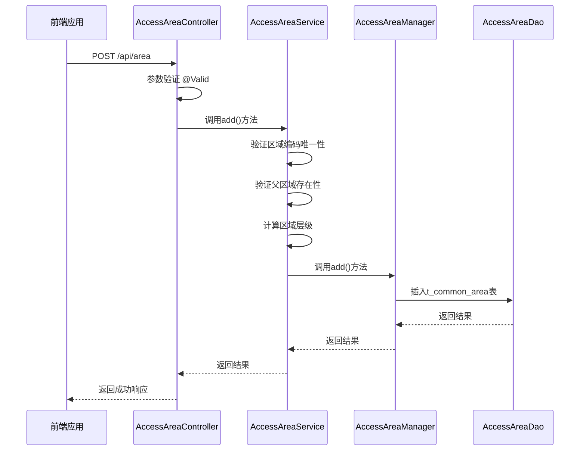
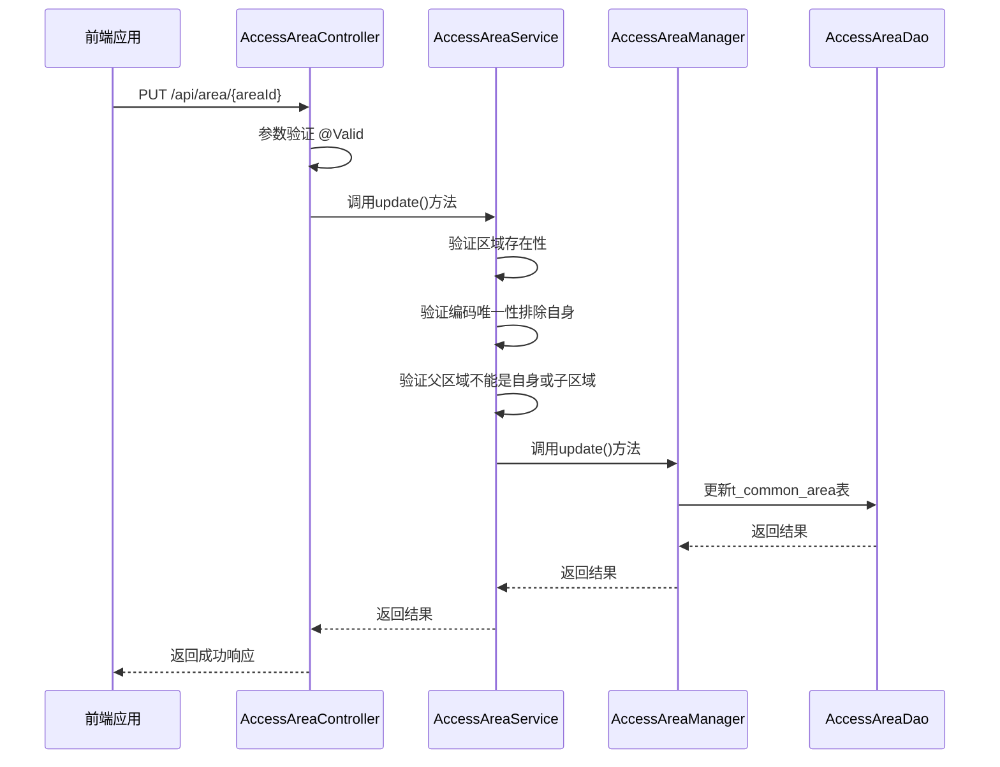
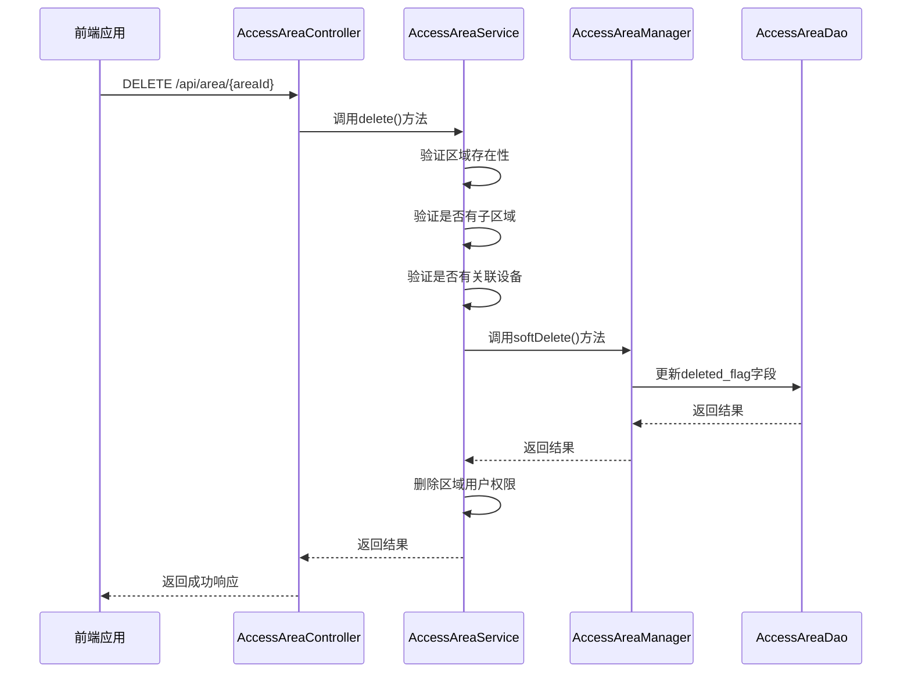
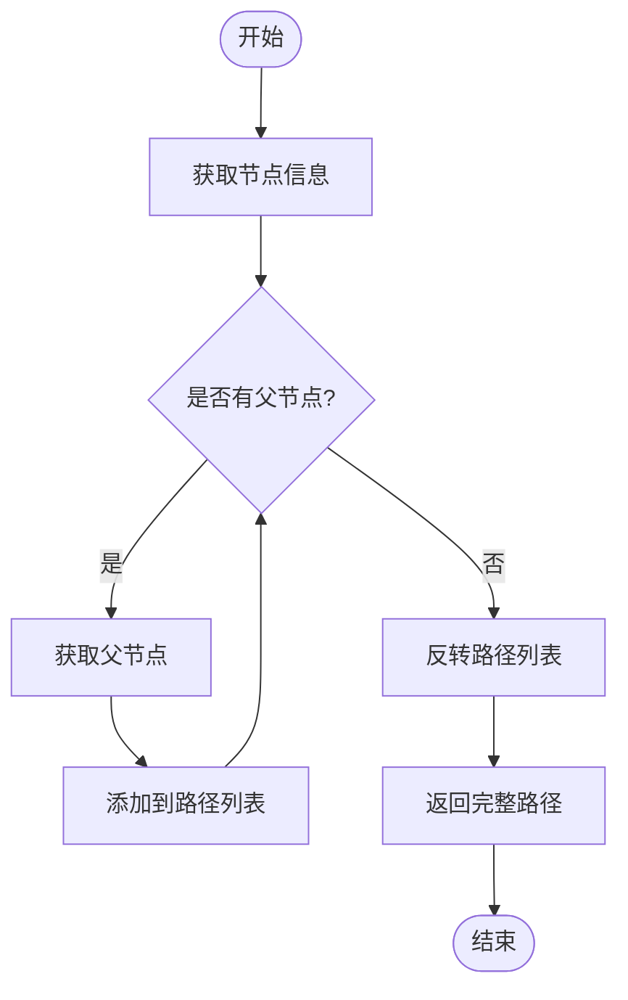
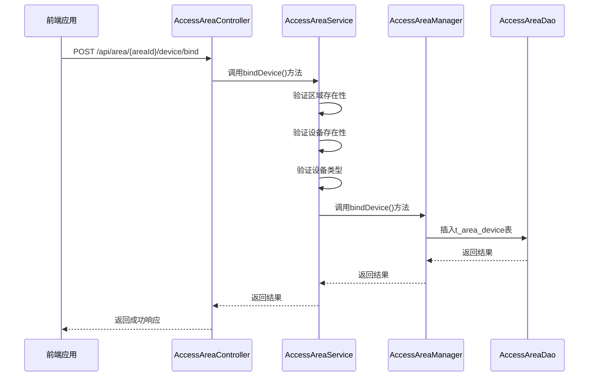
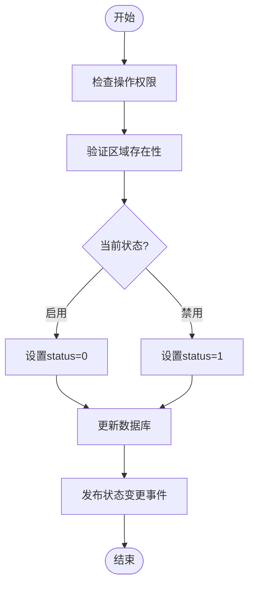
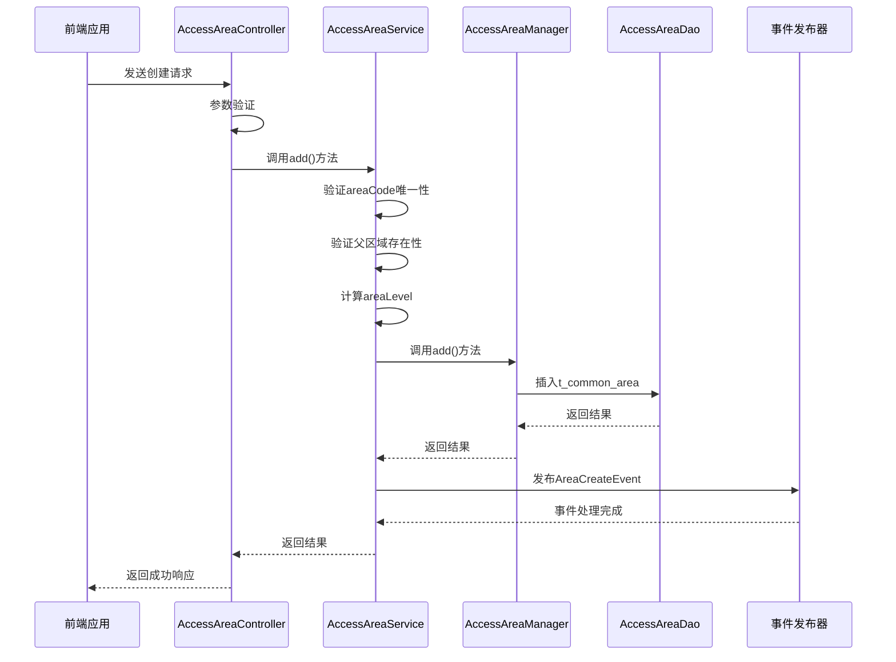
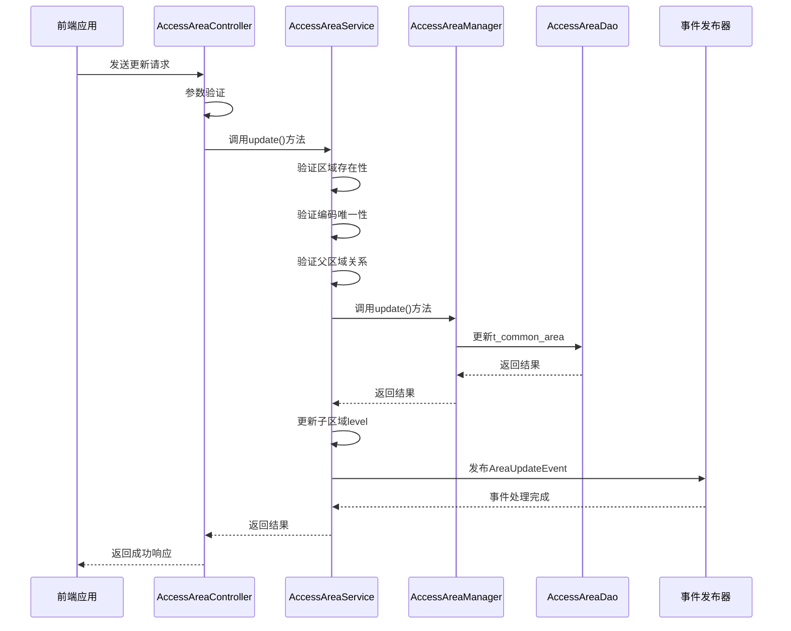
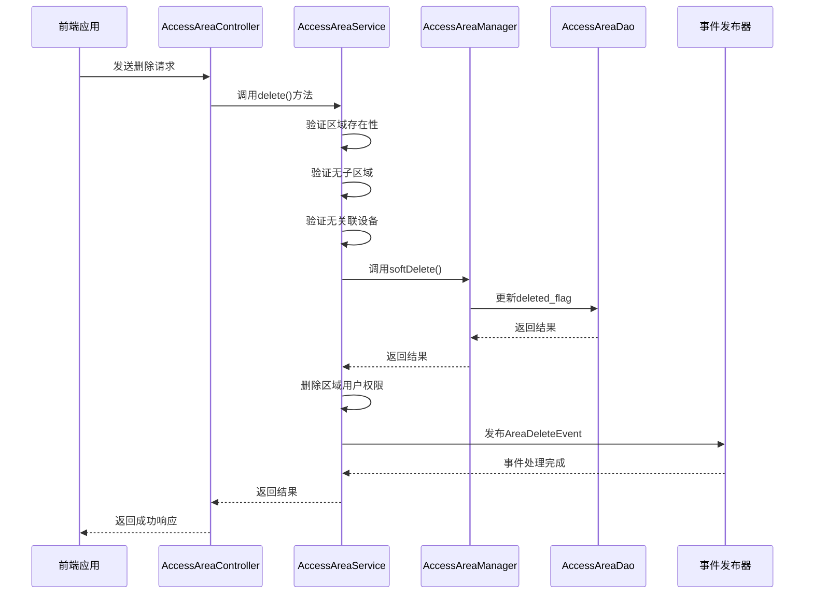

# 区域配置管理

<cite>
**本文档引用文件**  
- [AccessAreaDao.java](file://microservices\ioedream-access-service\src\main\java\net\lab1024\sa\access\dao\AccessAreaDao.java)
- [AreaEntity.java](file://microservices\microservices-common\src\main\java\net\lab1024\sa\common\organization\entity\AreaEntity.java)
- [smart-area.md](file://documentation\technical\smart-area.md)
- [AccessAreaController.java](file://restful_refactor_backup_20251202_014224\microservices_ioedream-access-service_src_main_java_net_lab1024_sa_access_controller_AccessAreaController.java)
- [PRODUCTION_SECURITY_CHECKLIST.md](file://PRODUCTION_SECURITY_CHECKLIST.md)
- [AUDIT_MIGRATION_FINAL_SUMMARY.md](file://documentation\archive\reports-2025-12-04\AUDIT_MIGRATION_FINAL_SUMMARY.md)
</cite>

## 目录
1. [引言](#引言)
2. [区域管理核心功能](#区域管理核心功能)
3. [区域CRUD接口实现](#区域crud接口实现)
4. [区域层级树构建与维护](#区域层级树构建与维护)
5. [区域与设备关联管理](#区域与设备关联管理)
6. [区域批量导入导出功能](#区域批量导入导出功能)
7. [区域状态管理](#区域状态管理)
8. [区域变更审计日志](#区域变更审计日志)
9. [区域CRUD操作流程示例](#区域crud操作流程示例)
10. [总结](#总结)

## 引言

区域配置管理是门禁系统的核心功能之一，负责定义和管理物理空间的逻辑划分。本系统通过统一的区域管理模块，实现了多级区域结构、设备分组、人员归属、权限继承等关键功能，为门禁控制、考勤管理、消费系统等提供基础支持。

区域管理采用四层架构设计（Controller-Service-Manager-DAO），严格遵循企业级微服务规范，确保系统的可维护性和扩展性。系统支持无限层级的区域树形结构，每个区域可包含子区域、设备和人员，形成完整的空间管理体系。

**本节来源**  
- [smart-area.md](file://documentation\technical\smart-area.md#L1-L20)

## 区域管理核心功能

区域管理模块提供以下核心功能：

- **多级区域结构**：支持无限层级的区域树形结构，可灵活定义园区、楼栋、楼层、房间等层级关系
- **设备分组管理**：根据区域对门禁设备进行分组和管理，实现设备的逻辑归集
- **人员区域归属**：支持人员与区域的灵活关联，配置访问权限和管理权限
- **权限继承机制**：区域权限自动向下继承，简化权限配置
- **空间可视化**：支持区域空间关系的可视化展示和管理
- **智能推荐**：基于使用习惯的区域设备智能推荐

系统采用公共区域实体 `AreaEntity` 统一管理所有业务模块的区域数据，确保数据一致性。区域数据存储在 `t_common_area` 表中，通过 `parent_id` 字段建立父子关系，形成树形结构。

```mermaid
erDiagram
t_common_area {
BIGINT area_id PK
VARCHAR(100) area_code UK
VARCHAR(200) area_name
VARCHAR(50) area_type
INT area_level
BIGINT parent_id FK
INT sort_index
TEXT area_desc
BIGINT manager_id
VARCHAR(20) contact_phone
TEXT address
DECIMAL(11,8) longitude
DECIMAL(10,8) latitude
TINYINT status
DATETIME create_time
DATETIME update_time
BIGINT create_user_id
TINYINT deleted_flag
INT version
}
t_area_device {
BIGINT relation_id PK
BIGINT area_id FK
BIGINT device_id FK
VARCHAR(50) device_type
DATETIME bind_time
BIGINT bind_user_id
DATETIME unbind_time
BIGINT unbind_user_id
TEXT bind_remark
TINYINT status
DATETIME create_time
DATETIME update_time
TINYINT deleted_flag
}
t_area_user {
BIGINT relation_id PK
BIGINT area_id FK
BIGINT user_id FK
VARCHAR(20) user_type
VARCHAR(20) relation_type
TINYINT access_level
JSON access_time_config
DATETIME valid_start_time
DATETIME valid_end_time
BIGINT grant_user_id
DATETIME grant_time
BIGINT revoke_user_id
DATETIME revoke_time
TEXT grant_remark
TINYINT status
DATETIME create_time
DATETIME update_time
TINYINT deleted_flag
}
t_common_area ||--o{ t_area_device : "包含"
t_common_area ||--o{ t_area_user : "包含"
```

**图示来源**  
- [smart-area.md](file://documentation\technical\smart-area.md#L274-L341)
- [smart-area.md](file://documentation\technical\smart-area.md#L320-L341)
- [smart-area.md](file://documentation\technical\smart-area.md#L347-L375)

**本节来源**  
- [smart-area.md](file://documentation\technical\smart-area.md#L1-L20)

## 区域CRUD接口实现

### 区域字段定义与约束

区域实体 `AreaEntity` 包含以下核心字段：

| 字段名 | 类型 | 约束 | 说明 |
|--------|------|------|------|
| areaId | BIGINT | 主键，自增 | 区域唯一标识 |
| areaCode | VARCHAR(100) | 唯一，非空 | 区域编码，全局唯一 |
| areaName | VARCHAR(200) | 非空 | 区域名称 |
| areaType | VARCHAR(50) | 非空 | 区域类型（园区、楼栋、楼层、房间等） |
| areaLevel | INT | 默认1 | 区域层级 |
| parentId | BIGINT | 外键，可为空 | 父区域ID，为空表示根节点 |
| sortIndex | INT | 默认0 | 排序索引 |
| status | TINYINT | 默认1 | 状态（1-启用，0-禁用） |
| deletedFlag | TINYINT | 默认0 | 删除标志（0-未删除，1-已删除） |

区域编码（areaCode）必须全局唯一，系统在创建和更新区域时会进行唯一性校验。区域类型（areaType）使用字典表管理，支持园区、楼栋、楼层、房间、室外、停车场、出入口等类型。

### 区域创建接口

创建区域的接口实现如下：



**图示来源**  
- [AccessAreaController.java](file://restful_refactor_backup_20251202_014224\microservices_ioedream-access-service_src_main_java_net_lab1024_sa_access_controller_AccessAreaController.java#L452-L458)
- [smart-area.md](file://documentation\technical\smart-area.md#L635-L667)

### 区域编辑接口

编辑区域的接口实现如下：



**图示来源**  
- [AccessAreaController.java](file://restful_refactor_backup_20251202_014224\microservices_ioedream-access-service_src_main_java_net_lab1024_sa_access_controller_AccessAreaController.java#L460-L468)
- [smart-area.md](file://documentation\technical\smart-area.md#L673-L707)

### 区域删除接口

删除区域的接口实现如下：



**图示来源**  
- [AccessAreaController.java](file://restful_refactor_backup_20251202_014224\microservices_ioedream-access-service_src_main_java_net_lab1024_sa_access_controller_AccessAreaController.java#L470-L476)
- [smart-area.md](file://documentation\technical\smart-area.md#L716-L737)

### 区域查询接口

系统提供多种区域查询接口：

- `GET /api/area/page`：分页查询区域列表
- `GET /api/area/{areaId}`：获取区域详情
- `GET /api/area/tree`：获取区域树结构
- `GET /api/area/path/{areaId}`：获取区域完整路径

**本节来源**  
- [AccessAreaController.java](file://restful_refactor_backup_20251202_014224\microservices_ioedream-access-service_src_main_java_net_lab1024_sa_access_controller_AccessAreaController.java#L444-L492)
- [AreaEntity.java](file://microservices\microservices-common\src\main\java\net\lab1024\sa\common\organization\entity\AreaEntity.java#L46-L135)

## 区域层级树构建与维护

### 区域树构建机制

系统通过 `AreaTreeManager` 组件构建和维护区域层级树。构建过程分为三个步骤：

1. **创建所有节点**：将所有区域数据转换为树节点对象
2. **构建父子关系**：根据 `parentId` 字段建立父子关系
3. **排序子节点**：按 `sortIndex` 字段对子节点进行排序

```java
@Component
public class AreaTreeManager {
    
    private final Map<Long, AreaTreeNode> nodeMap = new ConcurrentHashMap<>();

    /**
     * 构建区域树
     */
    public AreaTreeNode buildAreaTree(List<AreaEntity> areas) {
        nodeMap.clear();

        // 创建所有节点
        areas.forEach(area -> {
            AreaTreeNode node = AreaTreeNode.builder()
                .areaId(area.getAreaId())
                .areaName(area.getAreaName())
                .parentId(area.getParentId())
                .areaType(area.getAreaType())
                .areaLevel(area.getAreaLevel())
                .sortOrder(area.getSortOrder())
                .status(area.getStatus())
                .children(new ArrayList<>())
                .build();

            nodeMap.put(area.getAreaId(), node);
        });

        // 构建父子关系
        List<AreaTreeNode> rootNodes = new ArrayList<>();
        nodeMap.values().forEach(node -> {
            if (node.getParentId() == null || node.getParentId() == 0L) {
                rootNodes.add(node);
            } else {
                AreaTreeNode parentNode = nodeMap.get(node.getParentId());
                if (parentNode != null) {
                    parentNode.getChildren().add(node);
                }
            }
        });

        // 排序子节点
        rootNodes.forEach(this::sortChildren);

        return rootNodes.isEmpty() ? null : rootNodes.get(0);
    }
}
```

**本节来源**  
- [smart-area.md](file://documentation\technical\smart-area.md#L69-L157)

### 区域路径获取

系统提供获取区域完整路径的功能，用于显示区域的层级关系。路径获取过程如下：



**图示来源**  
- [smart-area.md](file://documentation\technical\smart-area.md#L119-L132)

### 区域层级维护

区域层级（areaLevel）在创建和更新时自动计算：

- 根节点层级为1
- 子区域层级 = 父区域层级 + 1

系统在更新区域的父级时，会递归更新所有子区域的层级信息，确保数据一致性。

**本节来源**  
- [smart-area.md](file://documentation\technical\smart-area.md#L645-L646)
- [smart-area.md](file://documentation\technical\smart-area.md#L709-L710)

## 区域与设备关联管理

### 关联关系设计

区域与设备的关联关系通过 `t_area_device` 表维护，包含以下字段：

| 字段名 | 类型 | 说明 |
|--------|------|------|
| relationId | BIGINT | 关联ID，主键 |
| areaId | BIGINT | 区域ID，外键 |
| deviceId | BIGINT | 设备ID，外键 |
| deviceType | VARCHAR(50) | 设备类型 |
| bindTime | DATETIME | 绑定时间 |
| bindUserId | BIGINT | 绑定人ID |
| unbindTime | DATETIME | 解绑时间 |
| unbindUserId | BIGINT | 解绑人ID |
| bindRemark | TEXT | 绑定备注 |
| status | TINYINT | 状态（1-绑定，0-解绑） |

### 关联操作接口

系统提供以下设备关联接口：

- `POST /api/area/{areaId}/device/bind`：绑定设备到区域
- `POST /api/area/{areaId}/device/unbind`：解绑设备从区域
- `GET /api/area/{areaId}/devices`：获取区域设备列表



**图示来源**  
- [smart-area.md](file://documentation\technical\smart-area.md#L502-L509)
- [smart-area.md](file://documentation\technical\smart-area.md#L792-L800)

**本节来源**  
- [smart-area.md](file://documentation\technical\smart-area.md#L320-L341)

## 区域批量导入导出功能

### 数据格式说明

区域批量导入导出采用Excel格式，包含以下列：

| 列名 | 对应字段 | 说明 |
|------|----------|------|
| 区域编码 | areaCode | 必填，全局唯一 |
| 区域名称 | areaName | 必填 |
| 区域类型 | areaType | 必填，从字典选择 |
| 父级区域编码 | parentAreaCode | 选填，通过编码关联父区域 |
| 排序索引 | sortIndex | 选填，默认0 |
| 区域描述 | areaDesc | 选填 |
| 负责人ID | managerId | 选填 |
| 联系电话 | contactPhone | 选填 |
| 详细地址 | address | 选填 |
| 经度 | longitude | 选填 |
| 纬度 | latitude | 选填 |
| 状态 | status | 选填，1-启用，0-禁用 |

### 使用方法

1. **导出**：在区域管理页面点击"导出"按钮，系统生成包含所有区域信息的Excel文件
2. **编辑**：下载Excel文件，在本地进行编辑或批量添加
3. **导入**：在区域管理页面点击"导入"按钮，选择编辑后的Excel文件上传
4. **校验**：系统对导入数据进行校验，包括必填项、唯一性、格式等
5. **执行**：校验通过后，系统批量创建或更新区域数据

系统支持增量导入，已存在的区域根据编码进行更新，不存在的区域进行创建。

**本节来源**  
- [smart-area.md](file://documentation\technical\smart-area.md#L1-L20)

## 区域状态管理

### 启用/禁用机制

区域状态通过 `status` 字段管理：

- `status = 1`：启用状态，区域正常可用
- `status = 0`：禁用状态，区域不可用

禁用区域的影响：
- 该区域内的设备无法进行门禁控制
- 人员无法获得该区域的访问权限
- 在区域树中以灰色显示
- 查询时默认不包含禁用区域

### 状态变更流程



**本节来源**  
- [AreaEntity.java](file://microservices\microservices-common\src\main\java\net\lab1024\sa\common\organization\entity\AreaEntity.java#L131-L134)

## 区域变更审计日志

### 审计日志设计

系统对所有区域变更操作进行审计记录，审计日志包含以下信息：

| 字段 | 说明 |
|------|------|
| timestamp | 操作时间戳 |
| userId | 操作用户ID |
| username | 操作用户名 |
| action | 操作类型（CREATE_AREA, UPDATE_AREA, DELETE_AREA） |
| resource | 操作资源（Area#areaId） |
| clientIp | 客户端IP |
| userAgent | 用户代理 |
| result | 操作结果（SUCCESS, FAILED） |
| details | 操作详情（变更的字段） |

```json
{
  "timestamp": "2025-12-05T10:30:00.000Z",
  "userId": 1001,
  "username": "zhangsan",
  "action": "UPDATE_AREA",
  "resource": "Area#1002",
  "clientIp": "192.168.1.100",
  "userAgent": "Chrome/120.0",
  "result": "SUCCESS",
  "details": { 
    "fields": ["areaName", "contactPhone"] 
  }
}
```

### 审计覆盖范围

系统审计以下区域操作：

| 操作类型 | 是否记录 | 保留期限 |
|---------|---------|---------|
| 区域创建 | ✅ | 永久 |
| 区域修改 | ✅ | 永久 |
| 区域删除 | ✅ | 永久 |
| 区域状态变更 | ✅ | 永久 |
| 设备绑定/解绑 | ✅ | 180天 |
| 用户权限授予/撤销 | ✅ | 180天 |

审计日志存储在专用的审计表中，支持分页查询、条件筛选和导出功能，满足安全合规要求。

**本节来源**  
- [PRODUCTION_SECURITY_CHECKLIST.md](file://PRODUCTION_SECURITY_CHECKLIST.md#L327-L350)
- [AUDIT_MIGRATION_FINAL_SUMMARY.md](file://documentation\archive\reports-2025-12-04\AUDIT_MIGRATION_FINAL_SUMMARY.md#L94-L103)

## 区域CRUD操作流程示例

### 创建区域完整流程



### 编辑区域完整流程



### 删除区域完整流程



**本节来源**  
- [AccessAreaController.java](file://restful_refactor_backup_20251202_014224\microservices_ioedream-access-service_src_main_java_net_lab1024_sa_access_controller_AccessAreaController.java#L452-L476)
- [smart-area.md](file://documentation\technical\smart-area.md#L635-L743)

## 总结

区域配置管理系统通过统一的区域管理模块，实现了完整的区域生命周期管理。系统采用四层架构设计，确保了代码的可维护性和扩展性。核心功能包括：

1. **完整的CRUD操作**：提供创建、读取、更新、删除区域的完整接口
2. **灵活的层级结构**：支持无限层级的区域树形结构，满足复杂空间管理需求
3. **严格的约束验证**：对区域编码唯一性、层级关系、状态变更等进行严格验证
4. **完善的审计机制**：记录所有区域变更操作，满足安全合规要求
5. **高效的批量处理**：支持区域数据的批量导入导出，提高管理效率

系统通过事件驱动架构，在区域变更时发布相应事件，便于其他模块进行后续处理。区域管理模块作为基础服务，为门禁控制、考勤管理、消费系统等提供统一的空间管理支持。

**本节来源**  
- [smart-area.md](file://documentation\technical\smart-area.md#L1-L20)
- [AccessAreaController.java](file://restful_refactor_backup_20251202_014224\microservices_ioedream-access-service_src_main_java_net_lab1024_sa_access_controller_AccessAreaController.java#L1-L50)
- [AreaEntity.java](file://microservices\microservices-common\src\main\java\net\lab1024\sa\common\organization\entity\AreaEntity.java#L1-L136)