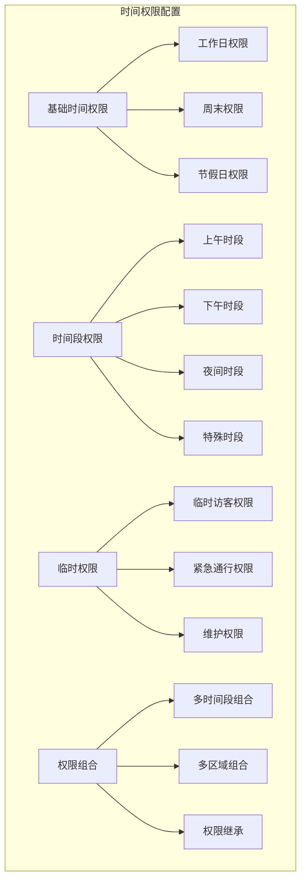
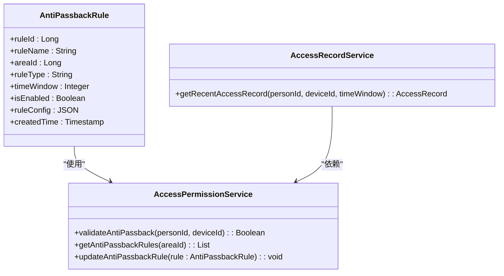
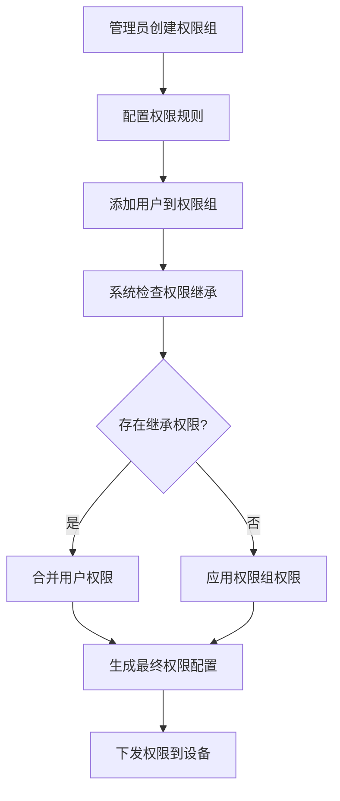
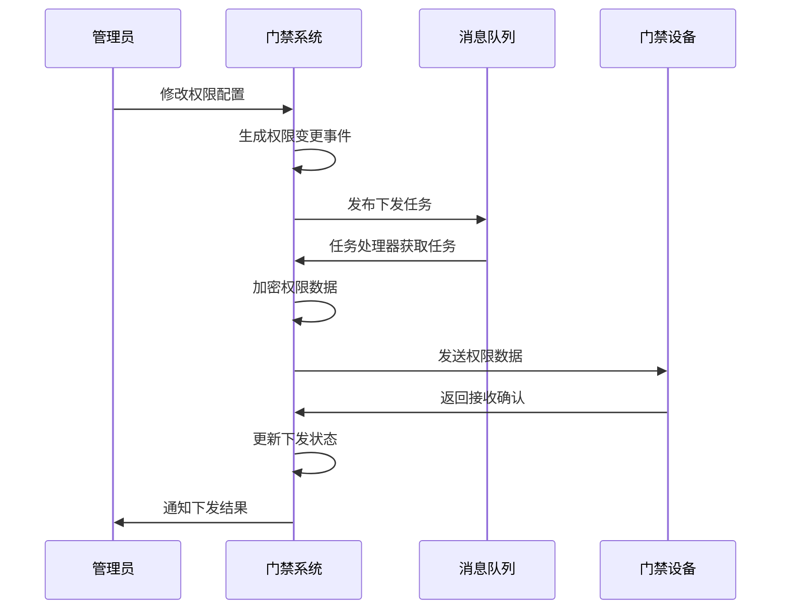
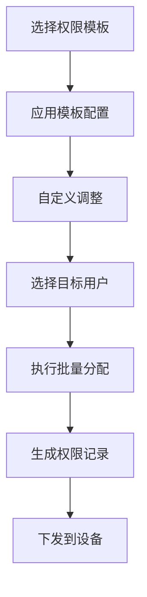

# 权限规则配置

<cite>
**本文档引用文件**   
- [smart-permission.md](file://docs/COMMON_MODULES/smart-permission.md)
- [smart-access.md](file://documentation/technical/smart-access.md)
- [AccessPermissionApplyController.java](file://microservices/ioedream-access-service/src/main/java/net/lab1024/sa/access/controller/AccessPermissionApplyController.java)
- [AccessEmergencyPermissionController.java](file://microservices/ioedream-access-service/src/main/java/net/lab1024/sa/access/controller/AccessEmergencyPermissionController.java)
- [design.md](file://openspec/changes/archive/completed-proposals/implement-access-control-missing-functions/design.md)
- [使用指南.md](file://documentation/03-业务模块/门禁系统/使用指南.md)
</cite>

## 目录
1. [权限组管理](#权限组管理)
2. [时间规则配置](#时间规则配置)
3. [通行规则配置](#通行规则配置)
4. [特殊权限配置](#特殊权限配置)
5. [用户与权限组关联机制](#用户与权限组关联机制)
6. [权限继承与优先级处理](#权限继承与优先级处理)
7. [权限下发与状态同步](#权限下发与状态同步)
8. [批量权限分配与模板](#批量权限分配与模板)
9. [权限冲突检测与解决](#权限冲突检测与解决)
10. [权限变更审计日志](#权限变更审计日志)

## 权限组管理

权限组是门禁系统中权限管理的核心单元，用于对用户权限进行分类和批量管理。系统支持创建和管理多个权限组，每个权限组可以配置不同的权限规则。

权限组的创建和管理通过门禁服务的权限管理模块实现。管理员可以创建新的权限组，为权限组分配特定的区域、设备和时间规则。权限组可以设置为永久权限或临时权限，并支持审批流程。

权限组的配置信息存储在数据库的 `smart_access_permission` 表中，包含权限组ID、名称、描述、创建人、创建时间等基本信息。权限组的状态包括启用、禁用、待审批和已过期，支持对权限组进行生命周期管理。

**Section sources**
- [smart-access.md](file://documentation/technical/smart-access.md#L67-L108)
- [smart-permission.md](file://docs/COMMON_MODULES/smart-permission.md#L112-L196)

## 时间规则配置

时间规则是权限配置的重要组成部分，用于定义用户在特定时间段内的通行权限。系统支持多种时间规则配置，包括工作日权限、弹性权限、特殊权限和临时权限。

### 时段配置

时段配置允许管理员为权限组设置具体的通行时间段。系统支持按天、周、月设置不同的通行时段。例如，可以为某个权限组设置周一至周五 8:00-18:00 的工作日权限，以及周末 9:00-17:00 的弹性权限。

时段配置通过 `smart_access_permission` 表中的 `time_config` 字段实现，该字段以JSON格式存储时间段配置。JSON结构包含开始时间、结束时间、重复规则等信息。系统支持精确到分钟的时间配置，并可以设置多个时间段组合。

**Diagram sources**
- [smart-access.md](file://documentation/technical/smart-access.md#L467-L627)

### 节假日配置

节假日配置允许管理员为特定日期设置特殊的通行权限。系统支持导入国家法定节假日，并可以自定义企业特殊假期。节假日权限可以覆盖常规的时间规则，为特定日期提供独立的通行策略。

节假日配置通过系统配置模块实现，管理员可以创建节假日规则，指定节假日日期、名称和适用的权限组。系统在节假日当天自动应用相应的权限规则，无需人工干预。

**Section sources**
- [使用指南.md](file://documentation/03-业务模块/门禁系统/使用指南.md#L440-L444)
- [smart-access.md](file://documentation/technical/smart-access.md#L82-L90)

## 通行规则配置

通行规则定义了用户在特定区域或设备上的通行方式和限制。系统支持单向通行和双向通行两种模式，并可以设置通行次数限制。

### 单向/双向通行

单向通行规则限制用户只能从一个方向通过门禁设备，通常用于安全等级较高的区域。双向通行规则允许用户在两个方向上自由通行，适用于普通办公区域。

通行方向配置通过门禁设备的参数设置实现。管理员可以在设备管理界面为每个门禁设备配置通行方向。系统在用户通行时验证通行方向，确保符合预设规则。

### 次数限制

次数限制规则用于控制用户在特定时间段内的通行次数。例如，可以为访客设置每日最多通行5次的限制，或为特定区域设置每小时最多通行2次的限制。

次数限制通过 `smart_access_permission` 表中的 `permission_type` 字段和相关业务逻辑实现。系统记录用户的每次通行记录，并在通行时检查是否超过预设的次数限制。超过限制的通行请求将被拒绝。

**Section sources**
- [smart-access.md](file://documentation/technical/smart-access.md#L70-L107)
- [design.md](file://openspec/changes/archive/completed-proposals/implement-access-control-missing-functions/design.md#L296-L309)

## 特殊权限配置

特殊权限用于处理特殊情况下的通行需求，包括防尾随和胁迫报警功能。

### 防尾随配置

防尾随功能用于防止未经授权的人员跟随授权人员通过门禁。系统通过反潜规则表（anti_passback_rule）配置防尾随规则，包括时间窗口、反潜类型和规则配置。

防尾随规则可以按区域设置，支持不同的时间窗口（如30秒、60秒）。当系统检测到连续通行时，会验证前一次通行是否在有效时间内，如果不符合规则，则触发防尾随报警。

**Diagram sources**
- [design.md](file://openspec/changes/archive/completed-proposals/implement-access-control-missing-functions/design.md#L296-L309)

### 胁迫报警配置

胁迫报警功能允许用户在受到胁迫时触发隐蔽报警。系统支持设置胁迫密码或特定的生物特征模板，当用户使用胁迫凭证时，门禁正常开启但同时向安保中心发送报警信号。

胁迫报警配置通过用户权限管理界面实现。管理员可以为特定用户设置胁迫凭证，并配置报警响应策略。系统在验证到胁迫凭证时，会记录报警事件并通知相关人员，同时保持门禁系统的正常运行。

**Section sources**
- [design.md](file://openspec/changes/archive/completed-proposals/implement-access-control-missing-functions/design.md#L296-L309)
- [smart-access.md](file://documentation/technical/smart-access.md#L67-L108)

## 用户与权限组关联机制

用户与权限组的关联是权限管理的核心机制，通过这种关联实现权限的批量分配和管理。

### 关联方式

系统支持多种用户与权限组的关联方式，包括手动关联、自动关联和基于规则的动态关联。手动关联由管理员在管理界面直接操作，将用户添加到指定的权限组。自动关联基于用户属性（如部门、职位）自动分配相应的权限组。动态关联通过预设规则在特定条件下自动调整用户的权限组。

用户权限关联信息存储在 `smart_access_permission` 表中，通过 `person_id` 和 `device_id` 字段建立用户与设备的关联。每个关联记录包含权限类型、生效时间、结束时间和状态等信息。

### 权限继承

权限继承机制允许用户从所属的权限组继承权限。当用户被添加到某个权限组时，自动获得该权限组的所有权限配置。权限继承支持多级继承，用户可以从多个权限组继承权限，系统会自动合并和处理权限冲突。

**Diagram sources**
- [03-区域空间管理模块流程图.md](file://documentation/03-业务模块/门禁/03-区域空间管理模块流程图.md#L195-L204)

**Section sources**
- [smart-access.md](file://documentation/technical/smart-access.md#L67-L108)
- [03-区域空间管理模块流程图.md](file://documentation/03-业务模块/门禁/03-区域空间管理模块流程图.md#L195-L204)

## 权限继承与优先级处理

权限继承和优先级处理机制确保用户权限的正确性和一致性，解决多权限来源可能产生的冲突。

### 继承规则

权限继承遵循"最严格优先"原则，即当用户从多个权限组继承权限时，系统采用最严格的权限规则。例如，如果用户从一个权限组继承了周一至周五的通行权限，从另一个权限组继承了周一至周日的通行权限，最终的通行权限将是周一至周五。

继承规则还考虑时间优先级，临时权限优先于永久权限，紧急权限优先于常规权限。系统在合并权限时，会根据权限类型和有效期确定最终的权限配置。

### 优先级处理

优先级处理机制用于解决权限冲突。系统为不同类型的权限分配优先级，按照优先级顺序应用权限规则。优先级从高到低依次为：紧急权限、临时权限、特殊权限、常规权限。

当发生权限冲突时，系统首先检查权限的优先级，优先级高的权限规则生效。对于相同优先级的权限，系统采用"时间最近优先"原则，即最近创建或更新的权限规则生效。

**Section sources**
- [smart-access.md](file://documentation/technical/smart-access.md#L67-L108)
- [03-区域空间管理模块流程图.md](file://documentation/03-业务模块/门禁/03-区域空间管理模块流程图.md#L195-L204)

## 权限下发与状态同步

权限下发到门禁设备是权限管理的关键环节，系统采用异步处理流程确保权限及时生效。

### 异步处理流程

权限下发采用异步处理模式，避免阻塞主业务流程。当用户权限发生变化时，系统生成权限下发任务并加入消息队列。后台任务处理器从队列中获取任务，将权限数据加密后下发到相应的门禁设备。

异步处理流程包括以下步骤：权限变更检测、任务生成、数据加密、设备通信、状态确认和结果反馈。系统支持批量下发和单个下发两种模式，根据设备数量和网络状况选择最优的下发策略。

**Diagram sources**
- [14-设备管理模块重构设计.md](file://documentation/03-业务模块/消费/14-设备管理模块重构设计.md#L202-L241)

### 状态同步机制

状态同步机制确保门禁设备与系统服务器的权限数据保持一致。系统定期与设备通信，获取设备的权限状态和通行记录。当检测到数据不一致时，自动触发同步流程，重新下发权限数据。

状态同步支持实时同步和定时同步两种模式。实时同步在权限变更后立即触发，确保权限及时生效。定时同步按预设时间间隔执行，用于检查和修复潜在的数据不一致问题。

**Section sources**
- [14-设备管理模块重构设计.md](file://documentation/03-业务模块/消费/14-设备管理模块重构设计.md#L202-L241)
- [design.md](file://openspec/changes/archive/completed-proposals/implement-access-control-missing-functions/design.md#L327-L345)

## 批量权限分配与模板

批量权限分配和权限模板功能提高权限管理效率，支持大规模用户的权限配置。

### 批量分配

批量权限分配允许管理员一次性为多个用户分配相同的权限。系统支持通过CSV文件导入用户列表，或从组织架构中选择用户组进行批量操作。批量分配过程支持预览和确认，确保操作的准确性。

批量分配操作记录在审计日志中，包含操作人、操作时间、受影响的用户数量等信息。系统在批量分配完成后发送通知，告知管理员操作结果。

### 权限模板

权限模板是预定义的权限配置方案，用于快速创建和分配权限。系统提供多种预设模板，如"普通员工"、"管理人员"、"访客"等，管理员也可以创建自定义模板。

权限模板包含完整的权限规则配置，包括时间规则、通行规则和特殊权限。使用模板创建权限组时，系统自动应用模板中的配置，减少重复配置工作。

**Diagram sources**
- [smart-permission.md](file://docs/COMMON_MODULES/smart-permission.md#L1447-L1528)

**Section sources**
- [smart-permission.md](file://docs/COMMON_MODULES/smart-permission.md#L1447-L1528)

## 权限冲突检测与解决

权限冲突检测与解决策略确保权限配置的一致性和安全性，防止因权限重叠或矛盾导致的安全漏洞。

### 冲突检测

系统在权限配置和用户关联时自动执行冲突检测。检测范围包括时间冲突、区域冲突和权限级别冲突。时间冲突指同一用户在同一时间段内有相互矛盾的通行权限。区域冲突指用户被授予了互斥区域的通行权限。权限级别冲突指用户被授予了超出其安全级别的权限。

冲突检测通过权限验证服务实现，该服务分析用户的权限配置，识别潜在的冲突。检测结果以警告或错误的形式反馈给管理员，阻止可能导致安全问题的配置。

### 解决策略

系统提供多种权限冲突解决策略。自动解决策略根据预设规则自动调整权限配置，如采用最严格的权限规则。手动解决策略提示管理员手动调整权限配置。拒绝策略阻止存在冲突的权限配置生效。

解决策略的执行记录在审计日志中，便于追踪和审查。系统还提供冲突分析报告，帮助管理员理解冲突原因和影响范围。

**Section sources**
- [tasks.md](file://openspec/changes/archive/completed-proposals/implement-access-control-missing-functions/tasks.md#L223)
- [smart-permission.md](file://docs/COMMON_MODULES/smart-permission.md#L336-L358)

## 权限变更审计日志

权限变更审计日志记录所有权限相关的操作，提供完整的操作追溯能力。

### 日志查询

审计日志查询功能允许管理员按时间范围、操作类型、操作人、目标用户等条件查询权限变更记录。查询结果包括操作时间、操作类型、操作描述、操作结果、操作人IP等详细信息。

系统支持导出审计日志为CSV或PDF格式，便于存档和审查。高级查询功能支持组合条件搜索和模糊匹配，提高查询效率。

### 日志内容

审计日志记录所有关键权限操作，包括权限组创建、权限分配、权限修改、权限删除等。每条日志记录包含操作的详细信息，如变更前后的权限配置、审批流程信息、操作结果等。

日志数据存储在 `t_permission_audit` 表中，采用结构化格式便于查询和分析。系统定期归档旧的日志数据，确保数据库性能。

**Section sources**
- [smart-permission.md](file://docs/COMMON_MODULES/smart-permission.md#L200-L223)
- [AccessPermissionApplyController.java](file://microservices/ioedream-access-service/src/main/java/net/lab1024/sa/access/controller/AccessPermissionApplyController.java#L57-L90)