# 事件告警

<cite>
**本文档引用文件**   
- [t_alert.sql](file://database-scripts/common-service/11-t_alert.sql)
- [t_alert_rule.sql](file://database-scripts/common-service/12-t_alert_rule.sql)
- [t_notification_message.sql](file://database-scripts/common-service/07-t_notification_message.sql)
- [t_notification_template.sql](file://database-scripts/common-service/08-t_notification_template.sql)
- [t_notification_config.sql](file://database-scripts/common-service/09-t_notification_config.sql)
- [AlertController.java](file://microservices/ioedream-common-service/src/main/java/net/lab1024/sa/common/monitor/controller/AlertController.java)
- [AlertEntity.java](file://microservices/microservices-common/src/main/java/net/lab1024/sa/common/monitor/domain/entity/AlertEntity.java)
- [AlertRuleEntity.java](file://microservices/microservices-common/src/main/java/net/lab1024/sa/common/monitor/domain/entity/AlertRuleEntity.java)
- [AccessEventDao.java](file://microservices/ioedream-access-service/src/main/java/net/lab1024/sa/access/dao/AccessEventDao.java)
- [门禁服务监控告警机制.md](file://documentation/04-部署运维/门禁服务监控告警机制.md)
- [事件记录查询模块流程图.md](file://documentation/03-业务模块/各业务模块文档/门禁/05-事件记录查询模块流程图.md)
</cite>

## 目录
1. [引言](#引言)
2. [告警检测机制](#告警检测机制)
3. [告警级别与处理策略](#告警级别与处理策略)
4. [告警推送流程](#告警推送流程)
5. [告警通知配置](#告警通知配置)
6. [告警历史记录与管理](#告警历史记录与管理)
7. [告警风暴抑制与聚合](#告警风暴抑制与聚合)
8. [结论](#结论)

## 引言

门禁系统事件告警是保障安全的重要机制，用于检测和响应门常开、非法闯入、胁迫报警等异常事件。本系统通过设备端上报、服务端处理到前端展示的完整链路，实现告警事件的实时监控和管理。告警级别分为紧急、重要、一般，对应不同的处理策略。告警通知支持声音提示、弹窗提醒、短信通知等多种方式。告警历史记录可通过查询接口获取，并支持告警确认和处理状态的管理。为应对大规模部署，系统提供了告警风暴的抑制策略和告警聚合方案。

## 告警检测机制

门禁系统通过多种方式检测异常事件，包括门常开、非法闯入和胁迫报警。这些事件的检测基于设备端的实时监控和规则匹配。

### 门常开检测

门常开事件是指门在规定时间内未关闭的情况。系统通过门磁传感器实时监控门的状态，当门开启时间超过预设阈值时，触发告警。

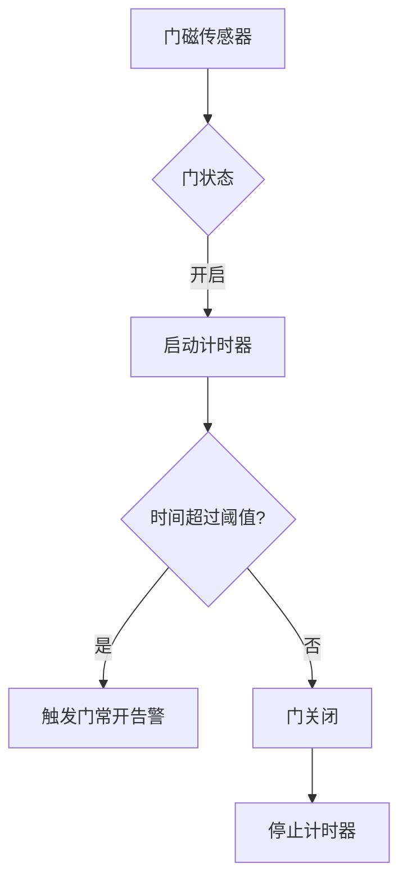

**Diagram sources**
- [t_alert_rule.sql](file://database-scripts/common-service/12-t_alert_rule.sql#L1-L40)
- [AccessEventDao.java](file://microservices/ioedream-access-service/src/main/java/net/lab1024/sa/access/dao/AccessEventDao.java#L1-L272)

### 非法闯入检测

非法闯入事件是指未经授权的人员试图进入受控区域。系统通过验证设备（如读卡器、生物识别设备）检测非法访问尝试。

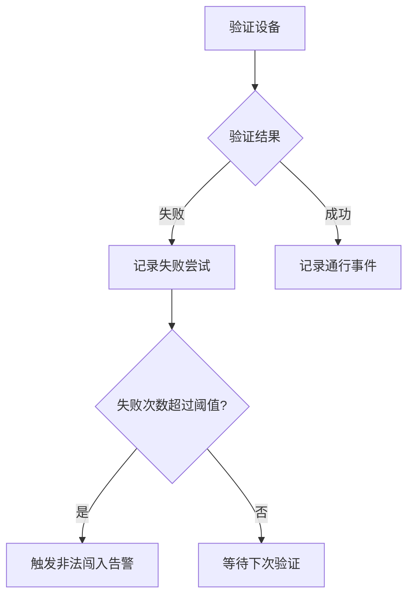

**Diagram sources**
- [t_alert.sql](file://database-scripts/common-service/11-t_alert.sql#L1-L36)
- [AccessEventDao.java](file://microservices/ioedream-access-service/src/main/java/net/lab1024/sa/access/dao/AccessEventDao.java#L1-L272)

### 胁迫报警检测

胁迫报警事件是指用户在被胁迫的情况下使用特殊验证方式（如特定密码或生物特征）触发的告警。系统通过识别这些特殊验证方式来检测胁迫情况。

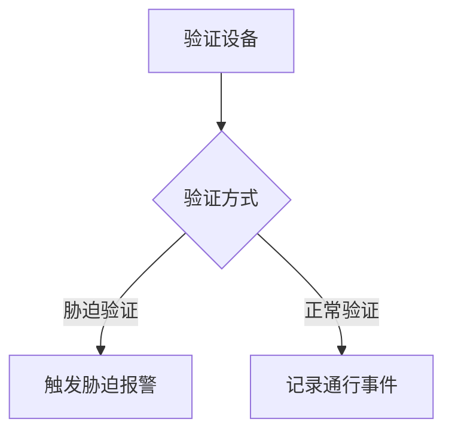

**Diagram sources**
- [t_alert.sql](file://database-scripts/common-service/11-t_alert.sql#L1-L36)
- [AccessEventDao.java](file://microservices/ioedream-access-service/src/main/java/net/lab1024/sa/access/dao/AccessEventDao.java#L1-L272)

**Section sources**
- [t_alert.sql](file://database-scripts/common-service/11-t_alert.sql#L1-L36)
- [t_alert_rule.sql](file://database-scripts/common-service/12-t_alert_rule.sql#L1-L40)
- [AccessEventDao.java](file://microservices/ioedream-access-service/src/main/java/net/lab1024/sa/access/dao/AccessEventDao.java#L1-L272)

## 告警级别与处理策略

告警级别分为紧急、重要、一般，每种级别对应不同的处理策略。

### 告警级别定义

| 告警级别 | 描述 | 示例 |
| --- | --- | --- |
| 紧急 | 需要立即处理的严重事件 | 非法闯入、胁迫报警 |
| 重要 | 需要尽快处理的重要事件 | 门常开、设备故障 |
| 一般 | 可以稍后处理的普通事件 | 通行失败、系统警告 |

### 处理策略

- **紧急告警**：立即通知安全人员，启动应急预案，记录处理过程。
- **重要告警**：通知相关人员，尽快处理，记录处理结果。
- **一般告警**：记录事件，定期汇总处理。

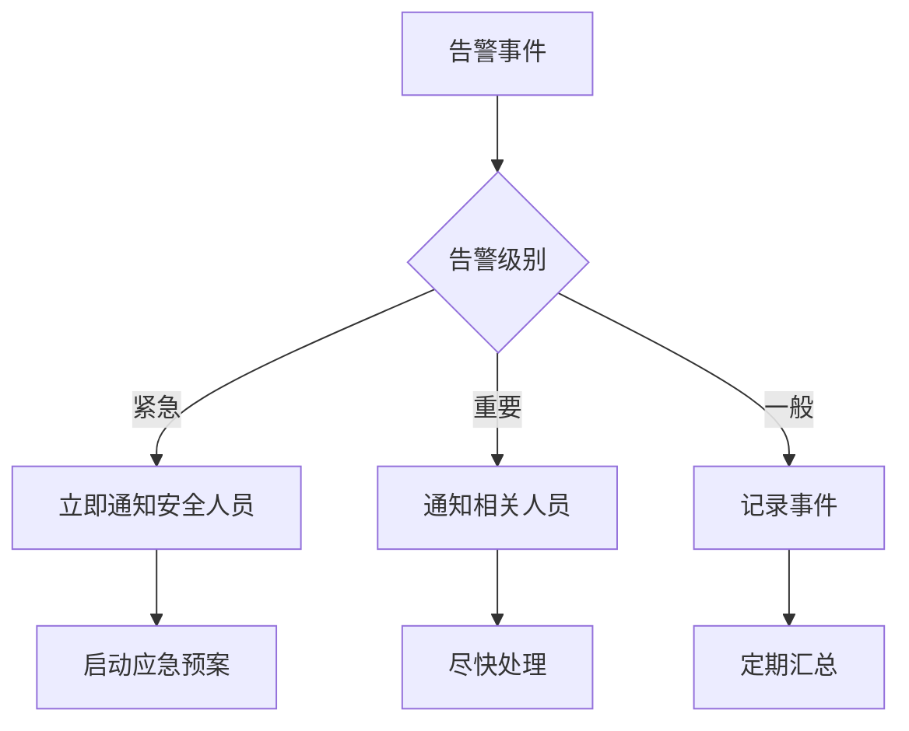

**Diagram sources**
- [t_alert.sql](file://database-scripts/common-service/11-t_alert.sql#L1-L36)
- [t_alert_rule.sql](file://database-scripts/common-service/12-t_alert_rule.sql#L1-L40)

**Section sources**
- [t_alert.sql](file://database-scripts/common-service/11-t_alert.sql#L1-L36)
- [t_alert_rule.sql](file://database-scripts/common-service/12-t_alert_rule.sql#L1-L40)

## 告警推送流程

告警推送流程从设备端上报开始，经过服务端处理，最终在前端展示。

### 设备端上报

设备端通过协议将告警事件上报到服务端。上报内容包括告警级别、告警类型、设备ID等。

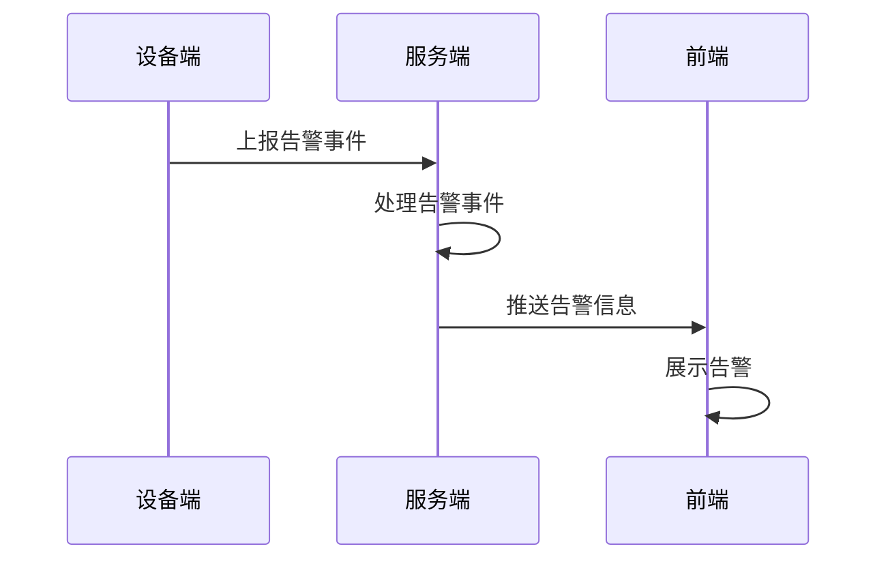

**Diagram sources**
- [AlertController.java](file://microservices/ioedream-common-service/src/main/java/net/lab1024/sa/common/monitor/controller/AlertController.java#L1-L104)
- [AlertEntity.java](file://microservices/microservices-common/src/main/java/net/lab1024/sa/common/monitor/domain/entity/AlertEntity.java#L1-L55)

### 服务端处理

服务端接收设备端上报的告警事件，进行验证和处理，然后存储到数据库。

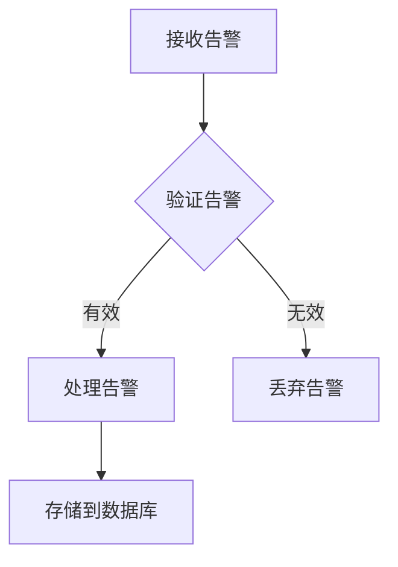

**Diagram sources**
- [AlertController.java](file://microservices/ioedream-common-service/src/main/java/net/lab1024/sa/common/monitor/controller/AlertController.java#L1-L104)
- [AlertEntity.java](file://microservices/microservices-common/src/main/java/net/lab1024/sa/common/monitor/domain/entity/AlertEntity.java#L1-L55)

### 前端展示

前端接收服务端推送的告警信息，通过声音提示、弹窗提醒等方式展示给用户。

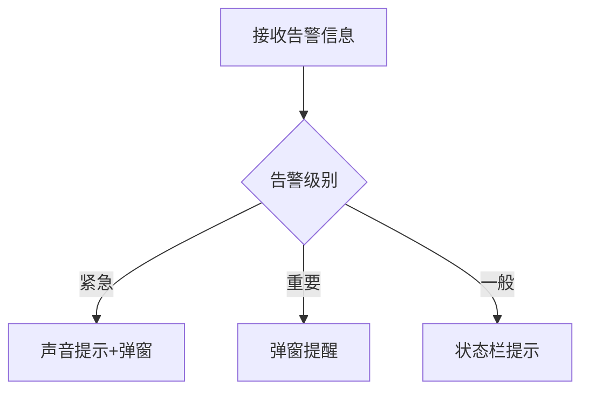

**Diagram sources**
- [门禁服务监控告警机制.md](file://documentation/04-部署运维/门禁服务监控告警机制.md#L525-L618)
- [事件记录查询模块流程图.md](file://documentation/03-业务模块/各业务模块文档/门禁/05-事件记录查询模块流程图.md#L1-L325)

**Section sources**
- [AlertController.java](file://microservices/ioedream-common-service/src/main/java/net/lab1024/sa/common/monitor/controller/AlertController.java#L1-L104)
- [AlertEntity.java](file://microservices/microservices-common/src/main/java/net/lab1024/sa/common/monitor/domain/entity/AlertEntity.java#L1-L55)
- [门禁服务监控告警机制.md](file://documentation/04-部署运维/门禁服务监控告警机制.md#L525-L618)

## 告警通知配置

告警通知支持多种方式，包括声音提示、弹窗提醒、短信通知等。用户可以根据需要配置通知方式。

### 通知方式

- **声音提示**：通过扬声器播放告警声音。
- **弹窗提醒**：在前端界面弹出告警窗口。
- **短信通知**：通过短信发送告警信息。
- **邮件通知**：通过邮件发送告警信息。

### 配置方法

用户可以通过配置文件或管理界面设置告警通知方式。配置内容包括通知渠道、接收人、通知频率等。

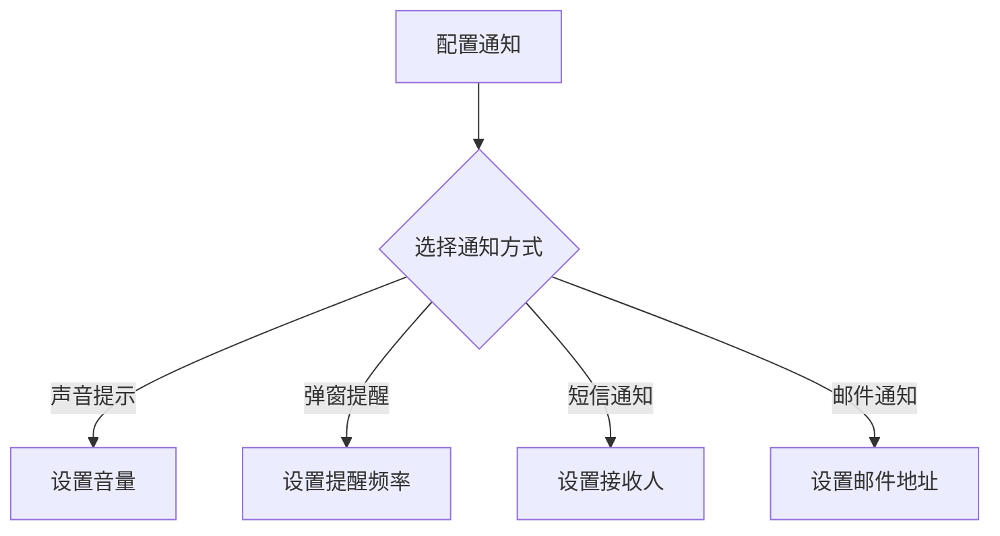

**Diagram sources**
- [t_notification_config.sql](file://database-scripts/common-service/09-t_notification_config.sql#L1-L28)
- [t_notification_message.sql](file://database-scripts/common-service/07-t_notification_message.sql#L1-L42)

**Section sources**
- [t_notification_config.sql](file://database-scripts/common-service/09-t_notification_config.sql#L1-L28)
- [t_notification_message.sql](file://database-scripts/common-service/07-t_notification_message.sql#L1-L42)

## 告警历史记录与管理

告警历史记录可通过查询接口获取，并支持告警确认和处理状态的管理。

### 查询接口

系统提供REST API接口，用于查询告警历史记录。接口支持按时间范围、告警级别、设备ID等条件查询。

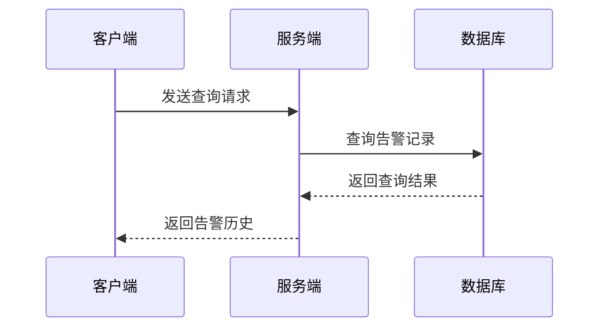

**Diagram sources**
- [AccessEventDao.java](file://microservices/ioedream-access-service/src/main/java/net/lab1024/sa/access/dao/AccessEventDao.java#L1-L272)
- [事件记录查询模块流程图.md](file://documentation/03-业务模块/各业务模块文档/门禁/05-事件记录查询模块流程图.md#L1-L325)

### 展示方式

告警历史记录在前端以表格形式展示，支持排序、筛选和导出功能。

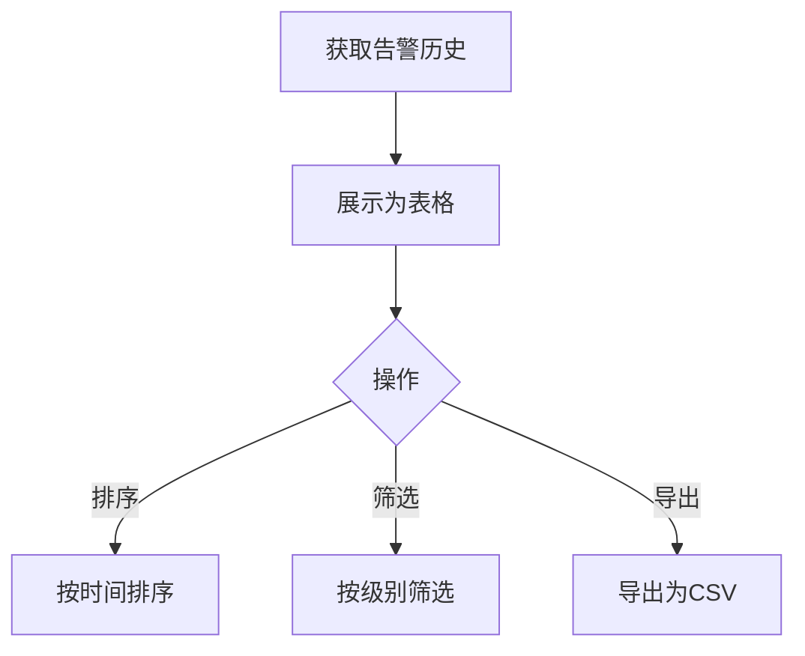

**Diagram sources**
- [事件记录查询模块流程图.md](file://documentation/03-业务模块/各业务模块文档/门禁/05-事件记录查询模块流程图.md#L1-L325)

### 告警确认与处理

用户可以在前端确认告警，并更新处理状态。处理状态包括未处理、处理中、已处理。

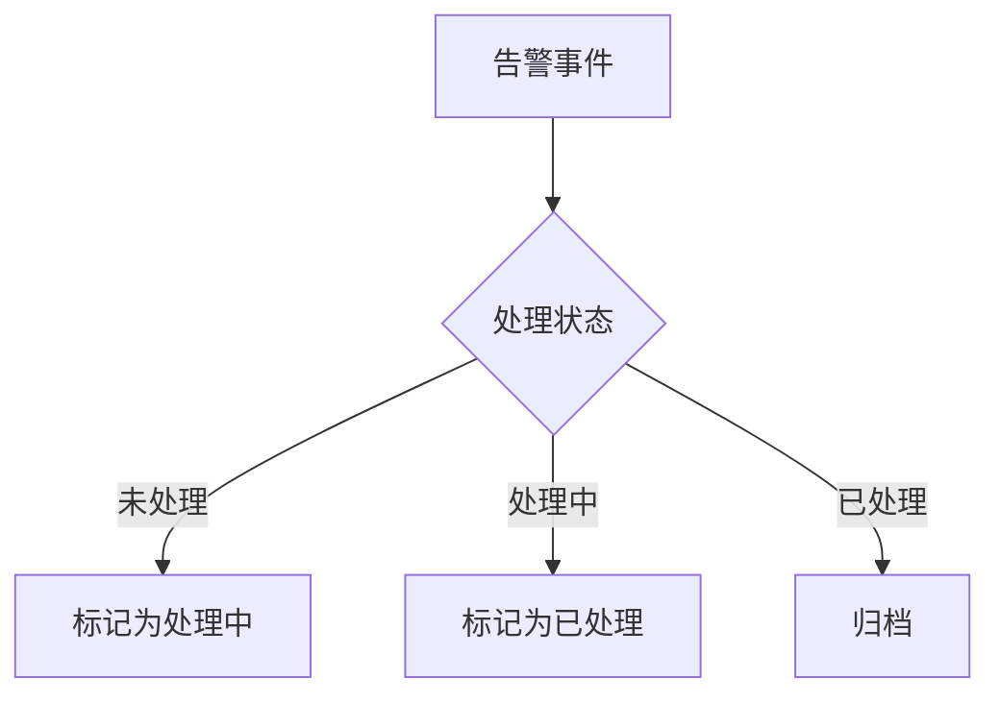

**Diagram sources**
- [t_alert.sql](file://database-scripts/common-service/11-t_alert.sql#L1-L36)
- [事件记录查询模块流程图.md](file://documentation/03-业务模块/各业务模块文档/门禁/05-事件记录查询模块流程图.md#L1-L325)

**Section sources**
- [AccessEventDao.java](file://microservices/ioedream-access-service/src/main/java/net/lab1024/sa/access/dao/AccessEventDao.java#L1-L272)
- [t_alert.sql](file://database-scripts/common-service/11-t_alert.sql#L1-L36)
- [事件记录查询模块流程图.md](file://documentation/03-业务模块/各业务模块文档/门禁/05-事件记录查询模块流程图.md#L1-L325)

## 告警风暴抑制与聚合

在大规模部署时，系统可能面临告警风暴问题。为此，系统提供了告警抑制和聚合方案。

### 告警风暴抑制

告警风暴抑制通过设置抑制时间，避免短时间内重复告警。

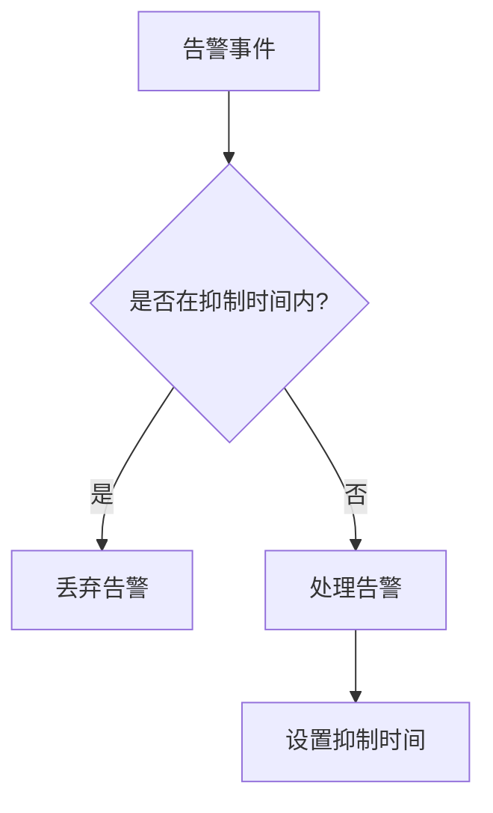

**Diagram sources**
- [t_alert_rule.sql](file://database-scripts/common-service/12-t_alert_rule.sql#L1-L40)

### 告警聚合

告警聚合将相似的告警事件合并为一条，减少告警数量。

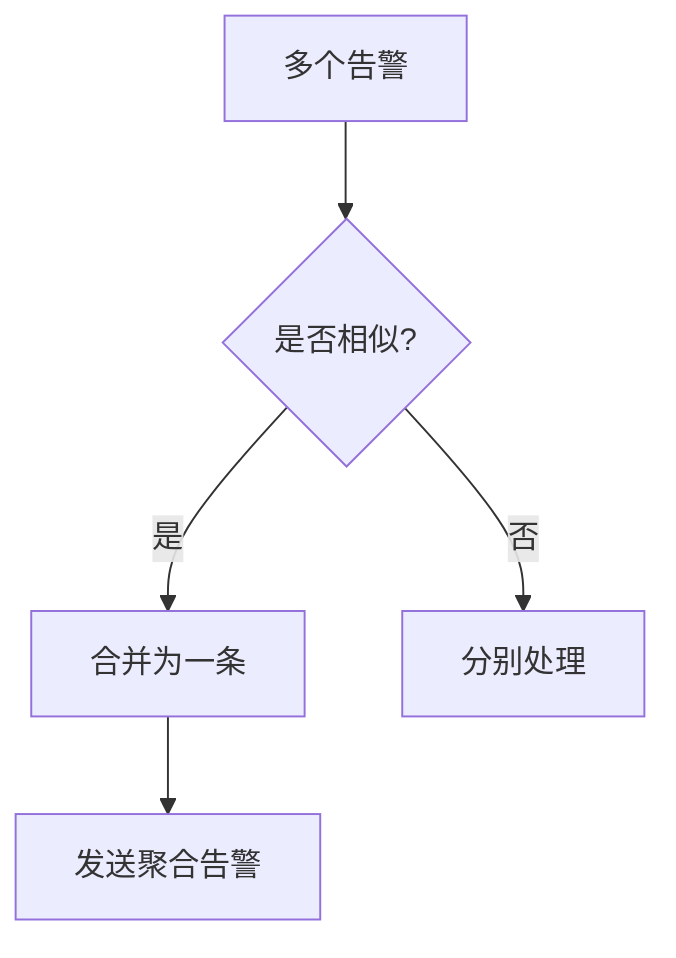

**Diagram sources**
- [门禁服务监控告警机制.md](file://documentation/04-部署运维/门禁服务监控告警机制.md#L616-L618)

**Section sources**
- [t_alert_rule.sql](file://database-scripts/common-service/12-t_alert_rule.sql#L1-L40)
- [门禁服务监控告警机制.md](file://documentation/04-部署运维/门禁服务监控告警机制.md#L616-L618)

## 结论

门禁系统事件告警机制通过完善的检测、推送、通知和管理功能，确保了系统的安全性和可靠性。告警级别和处理策略的定义，使得不同严重程度的事件得到适当的响应。告警通知的多样化配置，满足了不同用户的需求。告警历史记录的查询和管理功能，为事件追溯和分析提供了支持。告警风暴的抑制和聚合方案，有效应对了大规模部署时的挑战。整体上，该告警系统为门禁安全提供了强有力的保障。