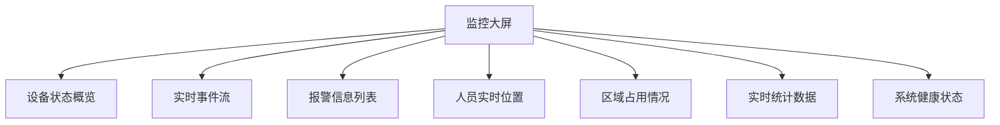
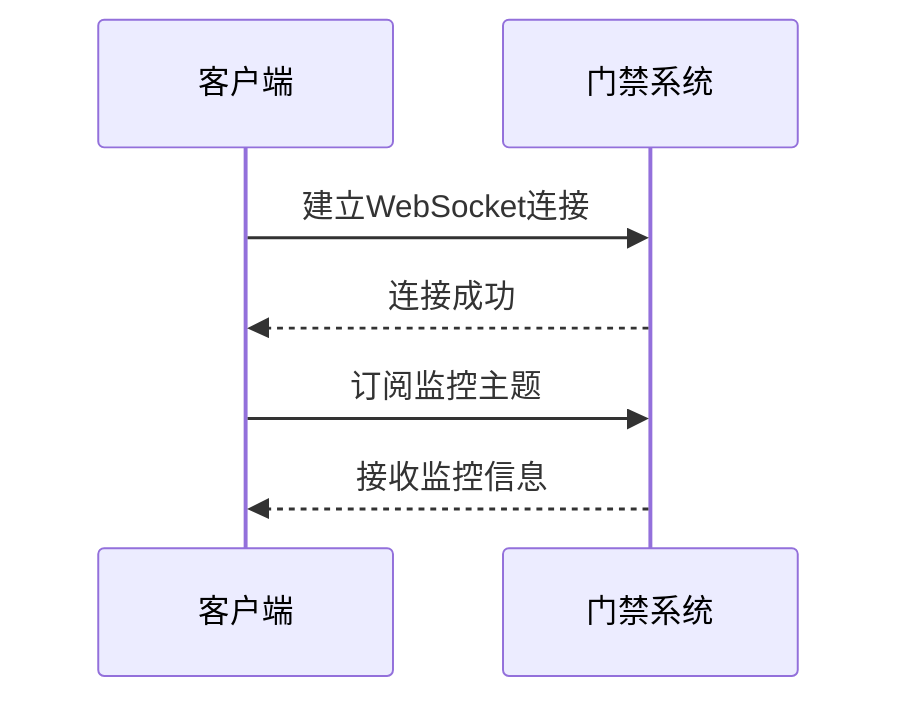
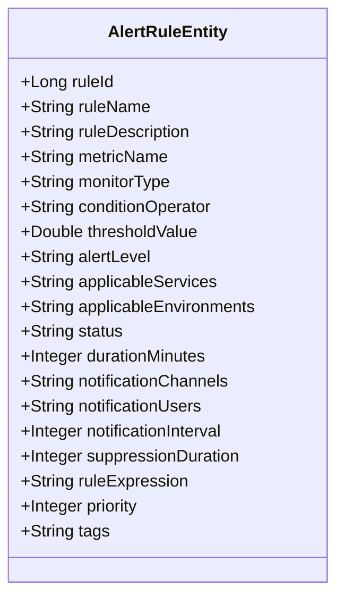

# 实时监控

<cite>
**本文档引用的文件**   
- [AccessMonitorController.java](file://restful_refactor_backup_20251202_014224/microservices_ioedream-access-service_src_main_java_net_lab1024_sa_access_monitor_controller_AccessMonitorController.java)
- [smart-realtime.md](file://documentation/technical/smart-realtime.md)
- [monitor.vue](file://smart-app/src/pages/access/monitor.vue)
- [alert.vue](file://smart-app/src/pages/video/alert.vue)
- [AlertRuleEntity.java](file://microservices/microservices-common/src/main/java/net/lab1024/sa/common/monitor/domain/entity/AlertRuleEntity.java)
- [AlertEntity.java](file://microservices/microservices-common/src/main/java/net/lab1024/sa/common/monitor/domain/entity/AlertEntity.java)
- [docker-compose-monitoring.yml](file://deployment/monitoring/docker-compose-monitoring.yml)
- [prometheus.yml](file://deployment/monitoring/prometheus/prometheus.yml)
- [performance_optimization.sql](file://database/performance_optimization.sql)
</cite>

## 目录
1. [引言](#引言)
2. [实时监控功能概述](#实时监控功能概述)
3. [门禁系统状态可视化](#门禁系统状态可视化)
4. [WebSocket实时事件推送机制](#websocket实时事件推送机制)
5. [监控大屏配置与自定义视图](#监控大屏配置与自定义视图)
6. [异常状态告警设置与通知方式](#异常状态告警设置与通知方式)
7. [监控数据性能优化建议](#监控数据性能优化建议)
8. [大规模部署监控策略](#大规模部署监控策略)
9. [结论](#结论)

## 引言
实时监控功能是门禁系统的核心组成部分，它提供了对门禁设备状态、门状态、报警状态等关键信息的可视化展示。通过WebSocket技术实现的实时事件推送机制，确保了监控数据的即时性和准确性。本文档详细介绍了实时监控功能的各个方面，包括监控大屏的配置方法、自定义视图的创建、异常状态的实时告警设置以及通知方式。此外，还提供了监控数据的性能优化建议和大规模部署时的监控策略，以确保系统在高负载下的稳定运行。

## 实时监控功能概述
实时监控功能旨在提供门禁系统运行状态的全面视图，包括设备在线状态、门状态、报警状态等。该功能通过WebSocket技术实现实时数据推送，确保用户能够即时获取最新的监控信息。系统支持多种监控视图，包括实时监控大屏、设备状态列表、实时事件流等，满足不同场景下的监控需求。

### 核心特性
- **实时性**: 通过WebSocket技术实现毫秒级的数据推送，确保监控信息的即时性。
- **可视化**: 提供丰富的可视化组件，包括实时监控大屏、设备状态列表、实时事件流等。
- **可配置性**: 支持监控大屏的自定义配置和视图创建，满足不同用户的个性化需求。
- **告警机制**: 提供灵活的告警规则设置和多种通知方式，确保异常状态能够及时被发现和处理。

**Section sources**
- [AccessMonitorController.java](file://restful_refactor_backup_20251202_014224/microservices_ioedream-access-service_src_main_java_net_lab1024_sa_access_monitor_controller_AccessMonitorController.java)

## 门禁系统状态可视化
门禁系统状态可视化是实时监控功能的重要组成部分，它通过图形化界面展示门禁设备的在线状态、门状态、报警状态等关键信息。用户可以通过监控大屏、设备状态列表、实时事件流等多种视图，全面了解门禁系统的运行状况。

### 监控大屏
监控大屏是门禁系统状态可视化的中心，它集成了多种监控视图，包括设备状态概览、实时事件流、报警信息列表等。用户可以通过监控大屏，一目了然地了解门禁系统的整体运行状况。



**Diagram sources**
- [AccessMonitorController.java](file://restful_refactor_backup_20251202_014224/microservices_ioedream-access-service_src_main_java_net_lab1024_sa_access_monitor_controller_AccessMonitorController.java)

### 设备状态列表
设备状态列表展示了所有门禁设备的实时状态，包括设备名称、设备状态、在线状态、最后心跳时间等信息。用户可以通过设备状态列表，快速定位到特定设备，查看其详细信息。

### 实时事件流
实时事件流展示了门禁系统中发生的各种事件，包括门禁事件、报警事件、系统通知等。用户可以通过实时事件流，了解门禁系统的最新动态。

**Section sources**
- [AccessMonitorController.java](file://restful_refactor_backup_20251202_014224/microservices_ioedream-access-service_src_main_java_net_lab1024_sa_access_monitor_controller_AccessMonitorController.java)
- [monitor.vue](file://smart-app/src/pages/access/monitor.vue)

## WebSocket实时事件推送机制
WebSocket实时事件推送机制是实现实时监控功能的关键技术。通过WebSocket技术，门禁系统能够将最新的监控信息实时推送到客户端，确保用户能够即时获取最新的监控数据。

### WebSocket连接
客户端通过WebSocket连接到门禁系统，建立实时通信通道。连接建立后，客户端可以订阅特定的监控主题，接收相关的监控信息。



**Diagram sources**
- [smart-realtime.md](file://documentation/technical/smart-realtime.md)

### 消息格式
门禁系统通过WebSocket推送的消息采用JSON格式，包含消息类型、消息数据、时间戳等信息。客户端接收到消息后，根据消息类型进行相应的处理。

```json
{
  "type": "DEVICE_STATUS",
  "data": {
    "deviceId": "123456",
    "deviceName": "前门门禁",
    "status": "ONLINE",
    "isOnline": true,
    "lastHeartbeatTime": "2025-12-06T10:00:00Z"
  },
  "timestamp": 1733457600000
}
```

### 心跳机制
为了确保WebSocket连接的稳定性，门禁系统实现了心跳机制。客户端和服务器定期发送心跳消息，检测连接状态。如果连接中断，客户端会自动尝试重连。

**Section sources**
- [smart-realtime.md](file://documentation/technical/smart-realtime.md)
- [monitor.vue](file://smart-app/src/pages/access/monitor.vue)

## 监控大屏配置与自定义视图
监控大屏配置与自定义视图功能允许用户根据实际需求，自定义监控大屏的布局和内容。用户可以通过拖拽组件、调整参数等方式，创建个性化的监控视图。

### 配置方法
1. **选择布局**: 用户可以选择预设的布局模板，或自定义布局。
2. **添加组件**: 用户可以从组件库中选择需要的监控组件，如设备状态概览、实时事件流、报警信息列表等。
3. **调整参数**: 用户可以调整组件的参数，如显示的数据范围、刷新频率等。
4. **保存配置**: 用户完成配置后，可以保存配置，以便下次使用。

### 自定义视图
自定义视图功能允许用户创建个性化的监控视图，满足特定场景下的监控需求。用户可以通过自定义视图，重点关注特定的监控信息，提高监控效率。

**Section sources**
- [AccessMonitorController.java](file://restful_refactor_backup_20251202_014224/microservices_ioedream-access-service_src_main_java_net_lab1024_sa_access_monitor_controller_AccessMonitorController.java)
- [monitor.vue](file://smart-app/src/pages/access/monitor.vue)

## 异常状态告警设置与通知方式
异常状态告警设置与通知方式功能旨在及时发现和处理门禁系统中的异常状态，如门常开、非法闯入等。通过灵活的告警规则设置和多种通知方式，确保异常状态能够被及时发现和处理。

### 告警规则设置
用户可以根据实际需求，设置告警规则，包括告警条件、告警级别、告警持续时间等。告警规则支持多种条件，如门状态、设备状态、访问次数等。



**Diagram sources**
- [AlertRuleEntity.java](file://microservices/microservices-common/src/main/java/net/lab1024/sa/common/monitor/domain/entity/AlertRuleEntity.java)

### 通知方式
系统支持多种通知方式，包括邮件、短信、Webhook、微信等。用户可以根据实际需求，选择合适的通知方式，确保告警信息能够及时送达。

**Section sources**
- [AlertRuleEntity.java](file://microservices/microservices-common/src/main/java/net/lab1024/sa/common/monitor/domain/entity/AlertRuleEntity.java)
- [alert.vue](file://smart-app/src/pages/video/alert.vue)

## 监控数据性能优化建议
为了确保门禁系统在高负载下的稳定运行，需要对监控数据进行性能优化。以下是一些性能优化建议：

### 数据库优化
- **索引优化**: 为常用的查询字段创建索引，提高查询效率。
- **分区表**: 对大表进行分区，减少单表数据量，提高查询性能。
- **查询优化**: 优化SQL查询语句，避免全表扫描。

### 缓存优化
- **多级缓存**: 采用多级缓存策略，包括本地缓存和分布式缓存，减少数据库访问。
- **缓存预热**: 在系统启动时，预热常用数据，减少冷启动时间。

### 网络优化
- **压缩传输**: 对传输的数据进行压缩，减少网络带宽占用。
- **连接池**: 使用连接池管理数据库连接，减少连接建立和断开的开销。

**Section sources**
- [performance_optimization.sql](file://database/performance_optimization.sql)

## 大规模部署监控策略
在大规模部署门禁系统时，需要制定合理的监控策略，确保系统的稳定运行。以下是一些监控策略建议：

### 分布式监控
- **多节点部署**: 将门禁系统部署在多个节点上，实现负载均衡。
- **集中监控**: 使用集中监控平台，统一管理所有节点的监控数据。

### 自动化告警
- **智能告警**: 采用智能告警算法，减少误报和漏报。
- **告警分级**: 根据告警级别，采取不同的处理措施。

### 容灾备份
- **数据备份**: 定期备份监控数据，防止数据丢失。
- **故障切换**: 实现故障自动切换，确保系统高可用。

**Section sources**
- [docker-compose-monitoring.yml](file://deployment/monitoring/docker-compose-monitoring.yml)
- [prometheus.yml](file://deployment/monitoring/prometheus/prometheus.yml)

## 结论
实时监控功能是门禁系统的重要组成部分，它通过WebSocket技术实现实时数据推送，确保用户能够即时获取最新的监控信息。通过监控大屏、设备状态列表、实时事件流等多种视图，用户可以全面了解门禁系统的运行状况。灵活的告警规则设置和多种通知方式，确保异常状态能够被及时发现和处理。通过性能优化和合理的监控策略，确保门禁系统在高负载下的稳定运行。