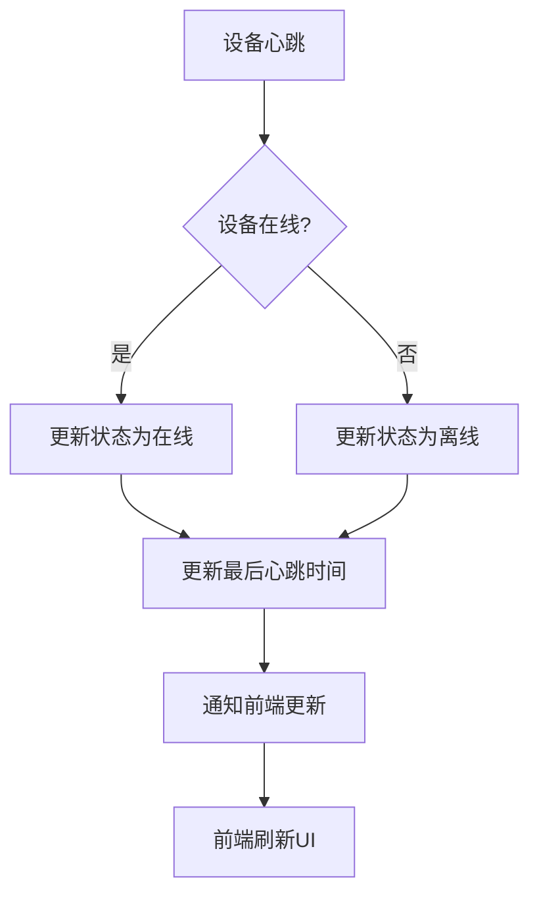
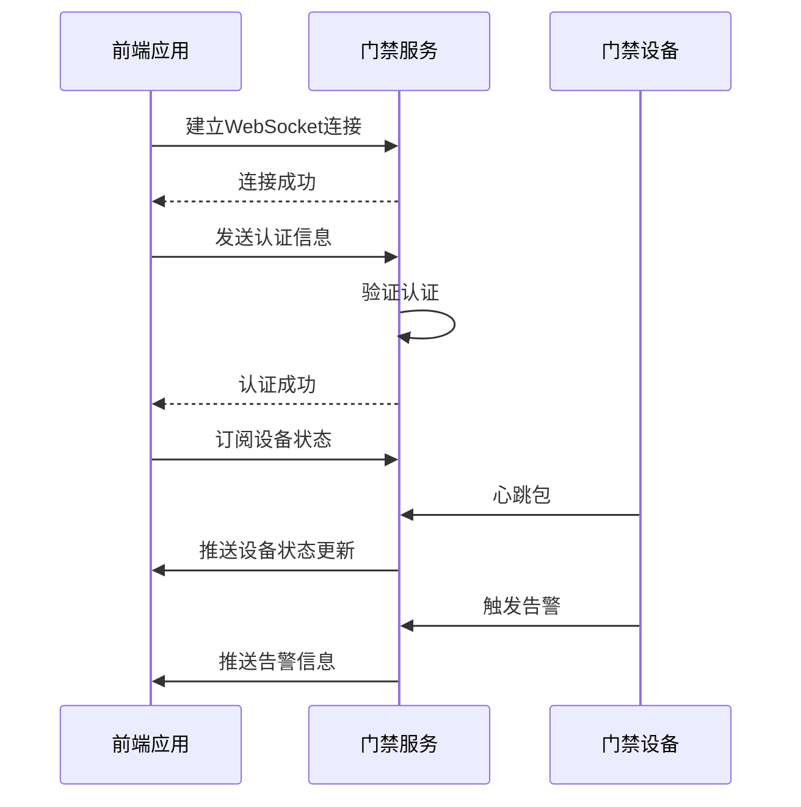
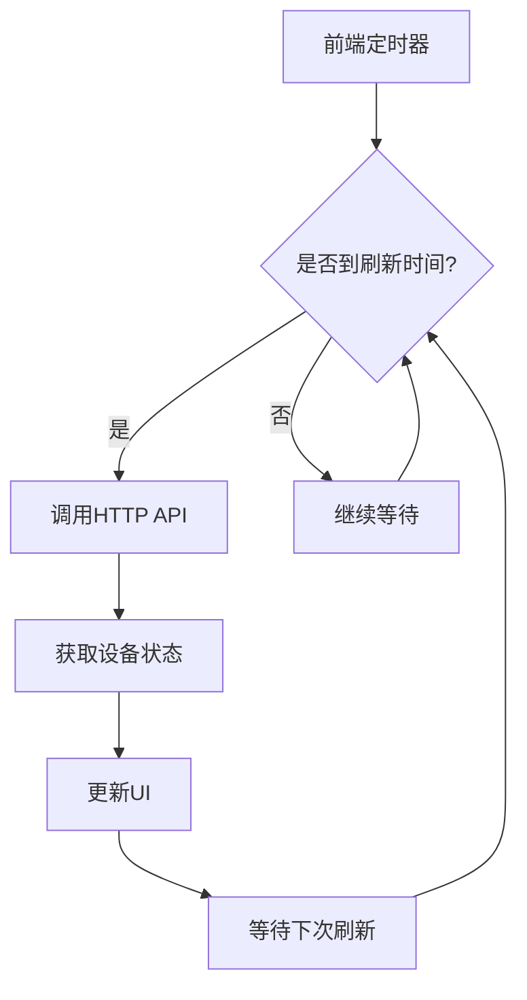
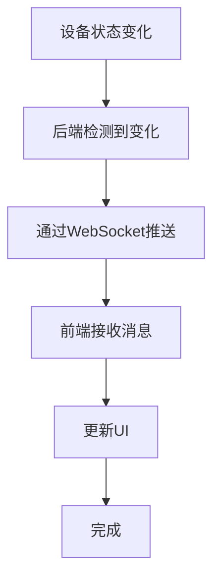
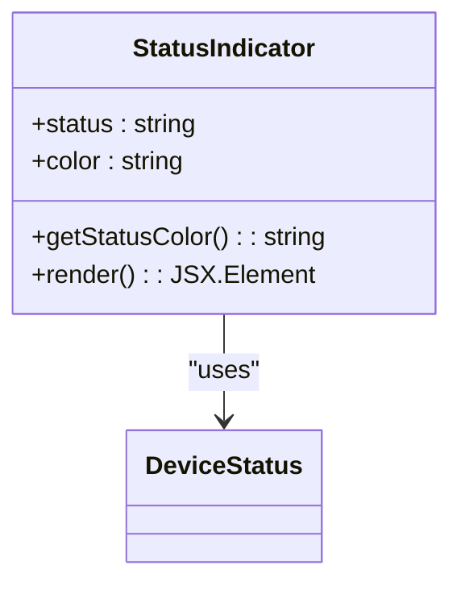
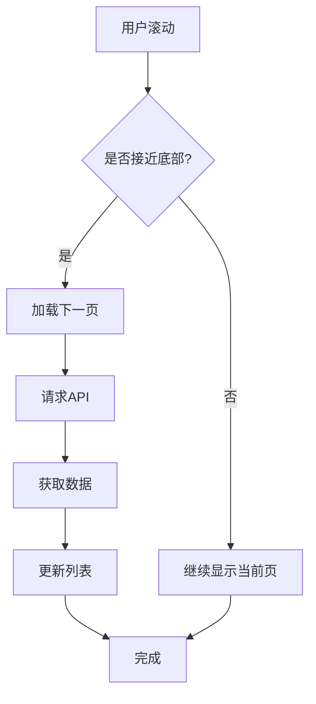
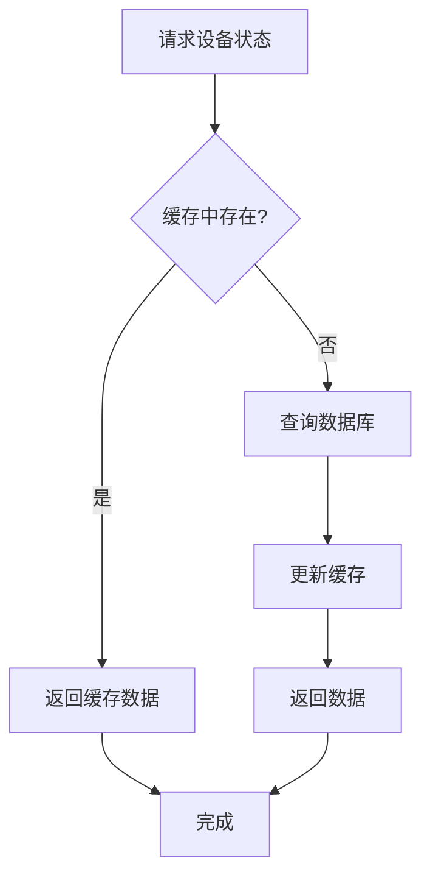
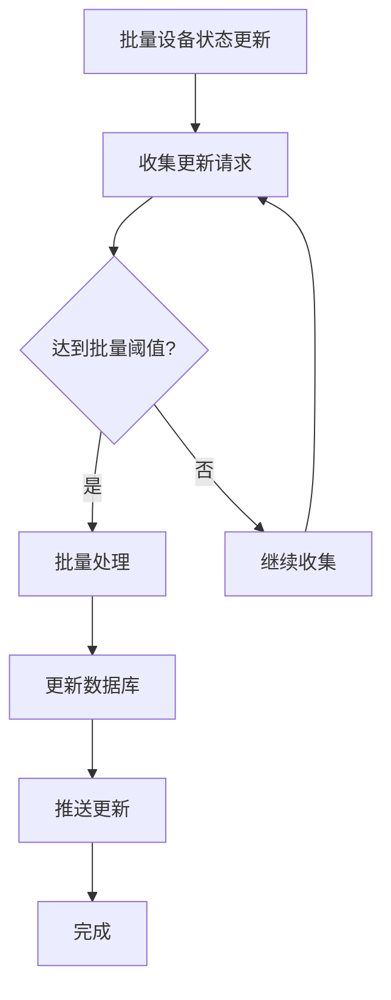
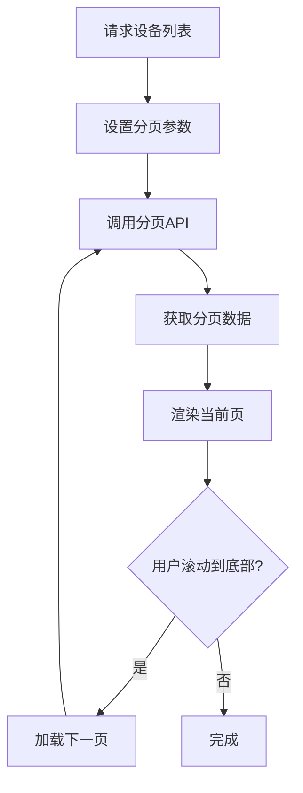
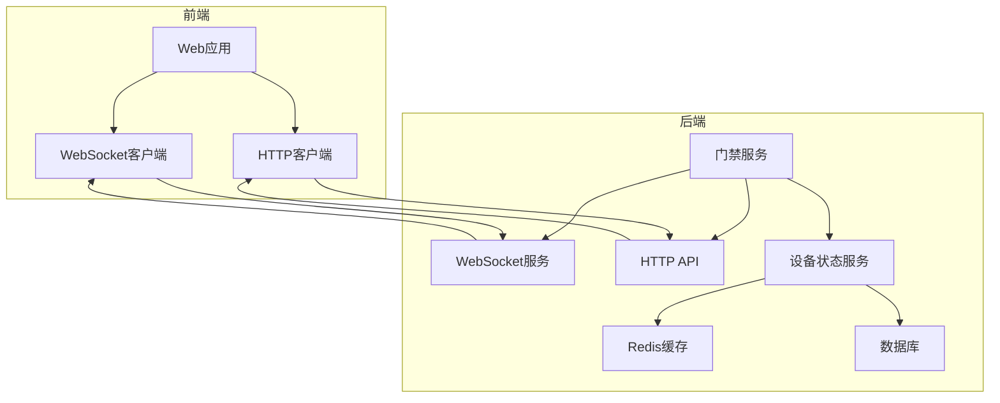

# 状态监控

<cite>
**本文档引用文件**   
- [AccessMonitorController.java](file://restful_refactor_backup_20251202_014224/microservices_ioedream-access-service_src_main_java_net_lab1024_sa_access_monitor_controller_AccessMonitorController.java)
- [websocket.ts](file://documentation/03-业务模块/门禁/13-前端移动端组件设计.md)
- [smart-realtime.md](file://documentation/technical/smart-realtime.md)
- [AccessServiceMetrics.java](file://documentation/04-部署运维/门禁服务监控告警机制.md)
- [smart-device.md](file://documentation/technical/smart-device.md)
</cite>

## 目录
1. [引言](#引言)
2. [设备状态数据模型](#设备状态数据模型)
3. [实时状态展示机制](#实时状态展示机制)
4. [WebSocket长连接实现](#websocket长连接实现)
5. [状态轮询与事件推送模式](#状态轮询与事件推送模式)
6. [前端组件实现细节](#前端组件实现细节)
7. [性能优化建议](#性能优化建议)
8. [系统架构图](#系统架构图)

## 引言

门禁系统状态监控是智能园区安全管理的核心功能，通过实时监控设备在线状态、门开关状态和报警状态，确保园区安全系统的稳定运行。本系统采用WebSocket长连接与HTTP轮询相结合的方式，实现设备状态的实时更新和高效展示。前端通过状态指示灯、设备列表等组件直观展示设备状态，后端通过事件推送和状态轮询两种模式确保数据的实时性和可靠性。系统还提供了完善的性能优化策略，包括状态缓存、批量更新和分页加载，以应对大规模设备监控的需求。

**Section sources**
- [AccessMonitorController.java](file://restful_refactor_backup_20251202_014224/microservices_ioedream-access-service_src_main_java_net_lab1024_sa_access_monitor_controller_AccessMonitorController.java#L1-L327)

## 设备状态数据模型

门禁系统定义了统一的设备状态数据模型，包含设备ID、状态码、时间戳等核心字段。该模型通过`DeviceStatus`类实现，支持多种设备类型的状态监控。

| 字段名 | 类型 | 说明 | 示例值 |
|-------|------|------|-------|
| deviceId | String | 设备唯一标识 | "CAMERA-001" |
| isOnline | Boolean | 设备在线状态 | true |
| status | Integer | 设备状态码 | 1 |
| lastHeartbeatTime | LocalDateTime | 最后心跳时间 | "2025-12-04T10:30:00" |
| extendedAttributes | Map<String, Object> | 扩展属性（JSON） | {"battery": 85, "temperature": 36.5} |

设备状态码定义如下：
- 0: 离线
- 1: 在线（空闲）
- 2: 在线（工作中）
- 3: 故障

**Section sources**
- [smart-device.md](file://documentation/technical/smart-device.md#L1511-L1803)

## 实时状态展示机制

系统通过多种方式实时展示设备状态，包括状态指示灯、设备列表和统计图表。状态指示灯使用不同颜色表示设备状态：绿色表示在线，红色表示离线，黄色表示故障。设备列表实时刷新，显示设备名称、位置、状态和最后更新时间。

**Diagram sources**
- [AccessServiceMetrics.java](file://documentation/04-部署运维/门禁服务监控告警机制.md#L282-L400)

## WebSocket长连接实现

前端通过WebSocket与后端建立长连接，实现实时数据推送。连接建立后，前端发送认证信息并订阅相关主题，后端通过WebSocket推送设备状态更新、访问事件和告警信息。

**Diagram sources**
- [websocket.ts](file://documentation/03-业务模块/门禁/13-前端移动端组件设计.md#L708-L801)

## 状态轮询与事件推送模式

系统支持状态轮询和事件推送两种模式，适用于不同场景。状态轮询适用于低频更新的静态数据，事件推送适用于高频更新的实时数据。

### 状态轮询模式

状态轮询通过定时调用HTTP API获取设备状态，适用于网络环境不稳定或设备数量较少的场景。

**Diagram sources**
- [AccessMonitorController.java](file://restful_refactor_backup_20251202_014224/microservices_ioedream-access-service_src_main_java_net_lab1024_sa_access_monitor_controller_AccessMonitorController.java#L53-L61)

### 事件推送模式

事件推送通过WebSocket长连接实时推送设备状态变化，适用于需要实时响应的高并发场景。

**Diagram sources**
- [smart-realtime.md](file://documentation/technical/smart-realtime.md#L1-L26)

## 前端组件实现细节

前端采用Vue 3 + TypeScript技术栈，使用Pinia进行状态管理。核心组件包括状态指示灯、设备列表和告警通知。

### 状态指示灯组件

状态指示灯组件通过颜色变化直观展示设备状态：

**Diagram sources**
- [websocket.ts](file://documentation/03-业务模块/门禁/13-前端移动端组件设计.md#L748-L764)

### 设备列表刷新机制

设备列表采用虚拟滚动和分页加载策略，确保大规模设备监控时的性能：

**Section sources**
- [websocket.ts](file://documentation/03-业务模块/门禁/13-前端移动端组件设计.md#L748-L764)

## 性能优化建议

为应对大规模设备监控的性能挑战，系统提供了多种优化策略。

### 状态缓存策略

采用多级缓存策略，减少数据库查询压力：

**Section sources**
- [AccessServiceMetrics.java](file://documentation/04-部署运维/门禁服务监控告警机制.md#L282-L400)

### 批量更新机制

对于大规模设备状态更新，采用批量处理机制：

**Section sources**
- [AccessMonitorController.java](file://restful_refactor_backup_20251202_014224/microservices_ioedream-access-service_src_main_java_net_lab1024_sa_access_monitor_controller_AccessMonitorController.java#L53-L61)

### 分页加载方案

大规模设备监控采用分页加载，避免一次性加载过多数据：

**Section sources**
- [AccessMonitorController.java](file://restful_refactor_backup_20251202_014224/microservices_ioedream-access-service_src_main_java_net_lab1024_sa_access_monitor_controller_AccessMonitorController.java#L53-L61)

## 系统架构图

**Diagram sources**
- [smart-realtime.md](file://documentation/technical/smart-realtime.md#L1-L26)
- [AccessServiceMetrics.java](file://documentation/04-部署运维/门禁服务监控告警机制.md#L282-L400)