# 门禁系统

<cite>
**本文档引用文件**
- [GlobalApbController.java](file://restful_refactor_backup_20251202_014224/microservices_ioedream-access-service_src_main_java_net_lab1024_sa_access_advanced_controller_GlobalApbController.java)
- [AccessAreaController.java](file://restful_refactor_backup_20251202_014224/microservices_ioedream-access-service_src_main_java_net_lab1024_sa_access_area_controller_AccessAreaController.java)
- [DeviceCommunicationController.java](file://restful_refactor_backup_20251202_014224/microservices_ioedream-device-service_src_main_java_net_lab1024_sa_device_controller_DeviceCommunicationController.java)
- [DeviceController.java](file://restful_refactor_backup_20251202_014224/microservices_ioedream-device-service_src_main_java_net_lab1024_sa_device_controller_DeviceController.java)
- [AccessRecordController.java](file://microservices/ioedream-access-service/src/main/java/net/lab1024/sa/access/controller/AccessRecordController.java)
- [DeviceService.java](file://documentation/technical/smart-device.md)
- [功能概述.md](file://documentation/03-业务模块/门禁系统/功能概述.md)
- [区域空间管理模块流程图.md](file://documentation/03-业务模块/各业务模块文档/门禁/03-区域空间管理模块流程图.md)
- [t_audit_log.sql](file://database-scripts/common-service/10-t_audit_log.sql)
- [smart-device.md](file://documentation/technical/smart-device.md)
</cite>

## 目录
1. [系统概述](#系统概述)
2. [设备管理](#设备管理)
3. [区域权限配置](#区域权限配置)
4. [实时监控](#实时监控)
5. [事件记录与审计日志](#事件记录与审计日志)
6. [门禁规则配置](#门禁规则配置)
7. [设备通讯集成](#设备通讯集成)
8. [安全策略](#安全策略)
9. [故障排查指南](#故障排查指南)

## 系统概述

门禁系统是智慧园区一卡通管理平台的核心组成部分，提供全方位的园区门禁访问控制解决方案。系统集成了多模态生物识别技术，支持人脸、指纹、掌纹、虹膜等多种识别方式，与一卡通管理深度融合，实现无感通行、智能管控、安全预警等功能。

### 系统特点
- **多模态生物识别**：集成人脸、指纹、掌纹、虹膜等多种识别技术
- **一卡通深度融合**：支持卡片、人脸、手机NFC等多种通行方式
- **实时监控预警**：24小时实时监控，异常行为智能预警
- **灵活权限管理**：基于角色、时间、区域的精细化权限控制
- **高可靠性**：分布式架构，故障自动切换，99.99%可用性
- **扩展性强**：支持大规模部署，轻松扩展到数万门禁点

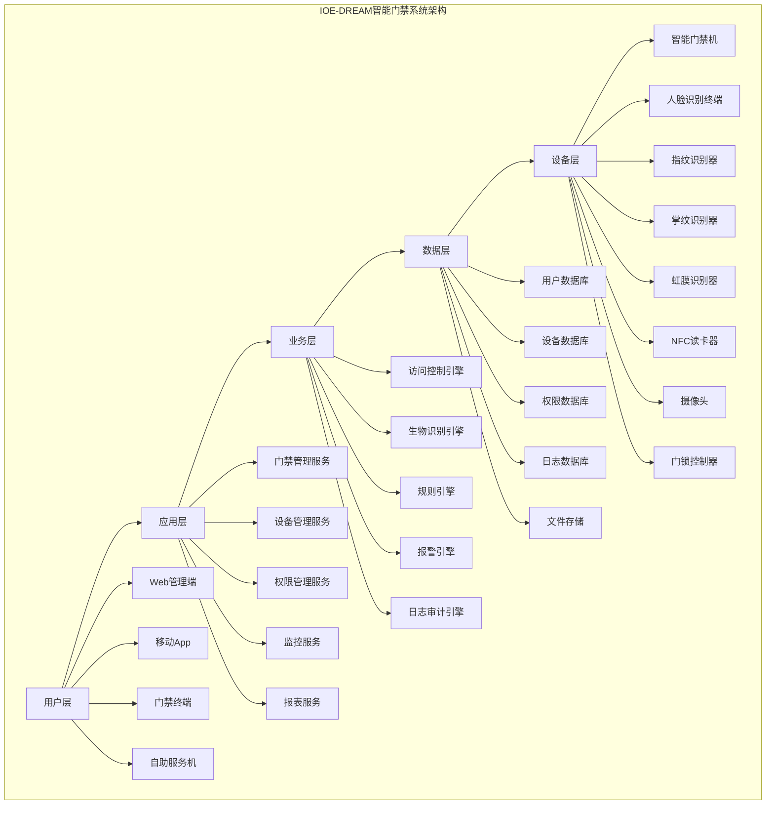

**Diagram sources**
- [功能概述.md](file://documentation/03-业务模块/门禁系统/功能概述.md)

## 设备管理

门禁设备管理是门禁系统的基础功能，负责门禁控制器、识别设备、输出设备等各类设备的全生命周期管理。

### 设备类型管理

门禁系统支持多种类型的设备，包括门禁控制器、识别设备、输出设备和辅助设备。

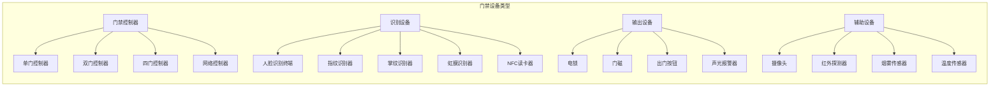

**Diagram sources**
- [功能概述.md](file://documentation/03-业务模块/门禁系统/功能概述.md)

### 设备管理功能

设备管理功能包括设备注册与配置、设备状态监控、设备配置管理和设备运维管理。

#### 设备注册与配置

设备注册与配置是设备管理的核心功能，确保设备能够正常接入系统并进行有效管理。

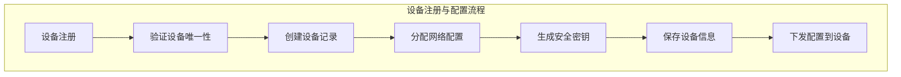

**Diagram sources**
- [功能概述.md](file://documentation/03-业务模块/门禁系统/功能概述.md)

#### 设备状态监控

设备状态监控功能确保设备的正常运行，及时发现并处理设备故障。

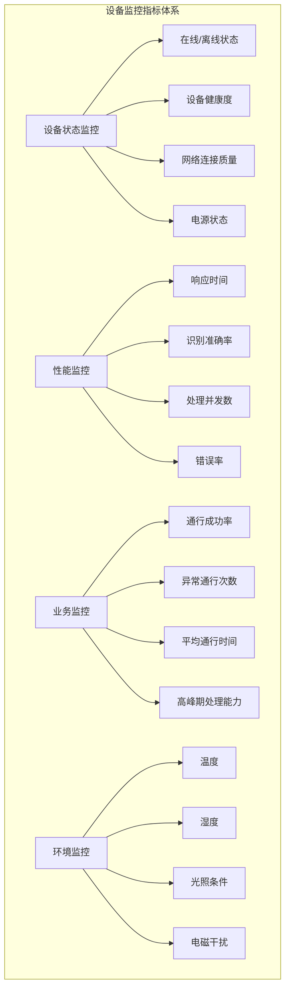

**Diagram sources**
- [功能概述.md](file://documentation/03-业务模块/门禁系统/功能概述.md)

### 设备管理API

设备管理提供了丰富的API接口，支持设备的全生命周期管理。

```http
# 设备状态查询
GET /api/device/{deviceId}/status

Response:
{
    "code": 200,
    "message": "查询成功",
    "data": {
        "deviceId": "ACCESS_001",
        "deviceName": "主楼前门",
        "status": "ONLINE",
        "lastHeartbeat": "2024-01-01T09:59:30Z",
        "cpuUsage": 15.2,
        "memoryUsage": 32.5,
        "storageUsage": 45.8
    }
}

# 设备远程控制
POST /api/device/{deviceId}/control
Content-Type: application/json

{
    "action": "RESTART",
    "parameters": {}
}

Response:
{
    "code": 200,
    "message": "控制命令已发送",
    "data": {
        "commandId": "CMD_001",
        "expectedCompletionTime": "2024-01-01T10:01:00Z"
    }
}
```

**Section sources**
- [DeviceCommunicationController.java](file://restful_refactor_backup_20251202_014224/microservices_ioedream-device-service_src_main_java_net_lab1024_sa_device_controller_DeviceCommunicationController.java)
- [DeviceController.java](file://restful_refactor_backup_20251202_014224/microservices_ioedream-device-service_src_main_java_net_lab1024_sa_device_controller_DeviceController.java)

## 区域权限配置

区域权限配置是门禁系统的核心功能之一，负责管理园区内各个区域的访问权限。

### 区域管理架构

区域管理采用多级架构，从园区级到门禁点级，实现精细化的权限管理。

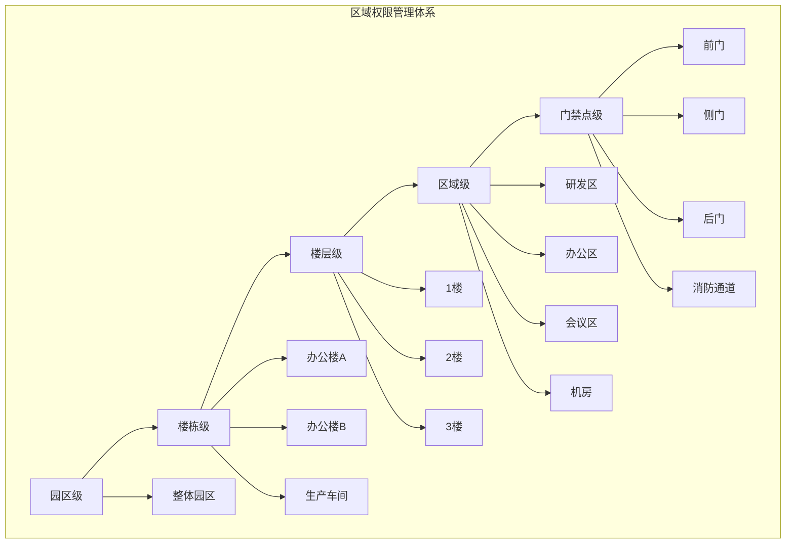

**Diagram sources**
- [功能概述.md](file://documentation/03-业务模块/门禁系统/功能概述.md)

### 权限管理模型

权限管理模型支持基于角色、时间、区域的精细化权限控制。

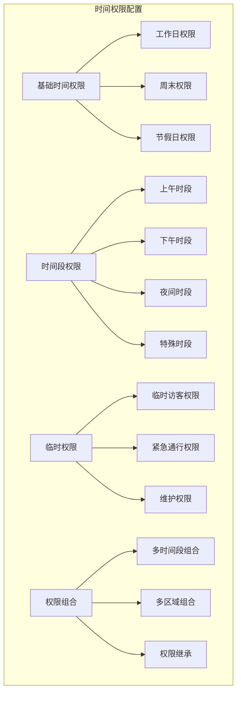

**Diagram sources**
- [功能概述.md](file://documentation/03-业务模块/门禁系统/功能概述.md)

### 区域权限管理流程

区域权限管理流程包括区域信息管理、门管理、人员管理、权限管理和区域监控。

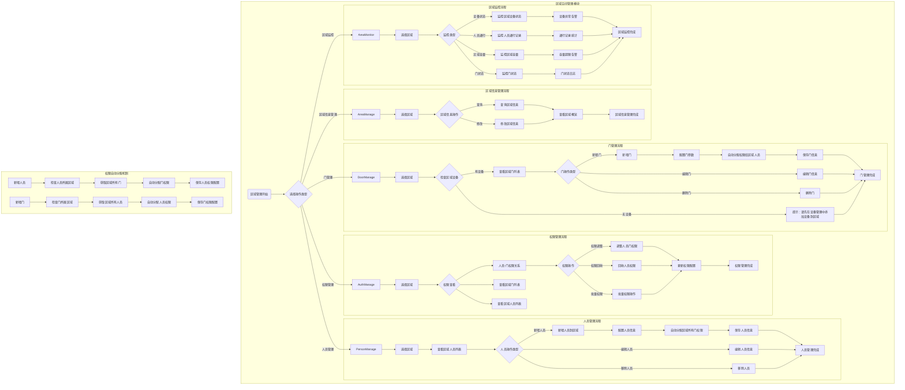

**Diagram sources**
- [区域空间管理模块流程图.md](file://documentation/03-业务模块/各业务模块文档/门禁/03-区域空间管理模块流程图.md)

### 权限自动分配机制

权限自动分配机制确保新增人员或门时，权限能够自动同步，减少人工配置的工作量。

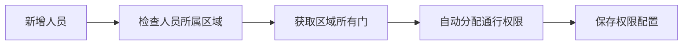

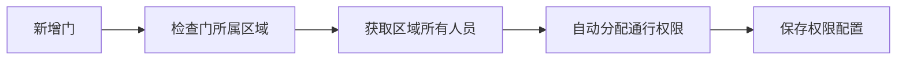

**Diagram sources**
- [区域空间管理模块流程图.md](file://documentation/03-业务模块/各业务模块文档/门禁/03-区域空间管理模块流程图.md)

### 区域权限管理API

区域权限管理提供了丰富的API接口，支持区域、门、人员和权限的管理。

```http
# 获取区域设备列表
GET /api/v1/access/area/{areaId}/devices

Response:
{
    "code": 200,
    "message": "查询成功",
    "data": [
        {
            "deviceId": 1,
            "deviceName": "主楼前门",
            "deviceCode": "ACCESS_001",
            "status": "ONLINE"
        }
    ]
}

# 分配设备到区域
POST /api/v1/access/area/{areaId}/devices
Content-Type: application/json

[
    "ACCESS_001",
    "ACCESS_002"
]

Response:
{
    "code": 200,
    "message": "分配成功",
    "data": "设备分配成功"
}
```

**Section sources**
- [AccessAreaController.java](file://restful_refactor_backup_20251202_014224/microservices_ioedream-access-service_src_main_java_net_lab1024_sa_access_area_controller_AccessAreaController.java)

## 实时监控

实时监控是门禁系统的重要功能，提供24小时不间断的设备状态和人员通行监控。

### 实时监控架构

实时监控系统采用分层架构，包括数据采集层、数据处理层、监控展示层和告警处理层。

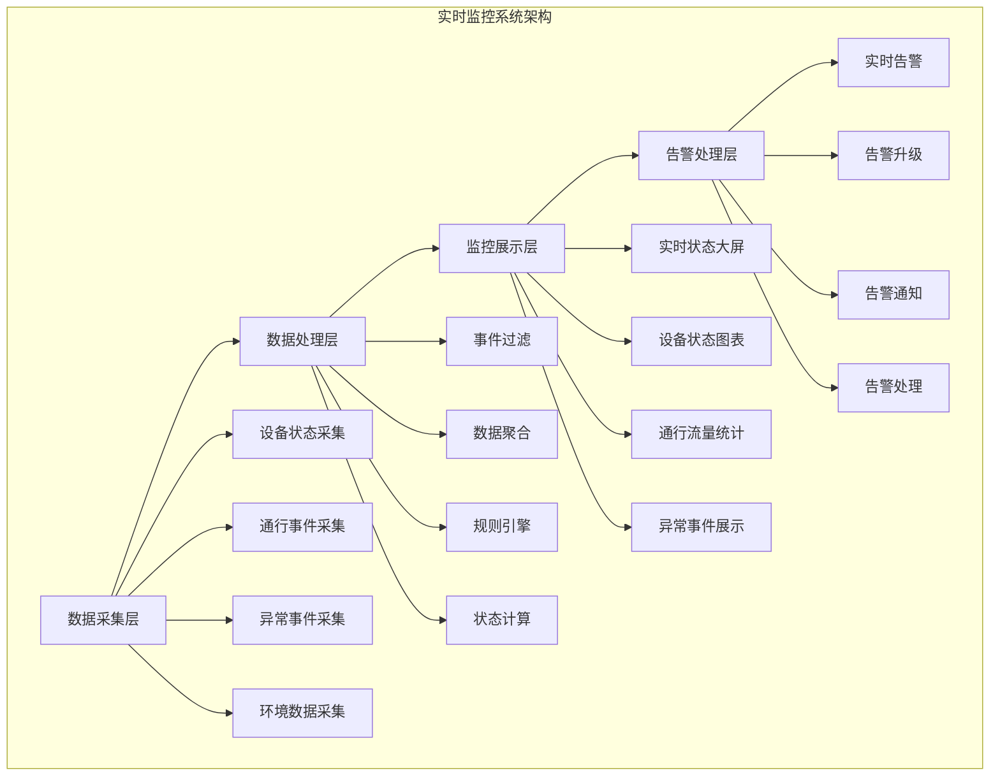

**Diagram sources**
- [功能概述.md](file://documentation/03-业务模块/门禁系统/功能概述.md)

### 监控功能实现

监控功能实现包括实时更新设备状态、更新区域占用状态、检查异常情况、推送实时数据到前端和触发联动控制。

```java
@Service
public class RealTimeMonitoringService {

    @EventListener
    @Async
    public void handleAccessEvent(AccessEvent event) {
        // 1. 实时更新设备状态
        deviceStatusService.updateDeviceStatus(event.getDeviceId(), event.getStatus());

        // 2. 更新区域占用状态
        areaOccupancyService.updateAreaOccupancy(event.getAreaId(), event.getAccessType());

        // 3. 检查异常情况
        checkForAnomalies(event);

        // 4. 推送实时数据到前端
        websocketService.pushAccessEvent(event);

        // 5. 触发联动控制
        triggerLinkedControls(event);
    }

    private void checkForAnomalies(AccessEvent event) {
        // 检查重复通行
        if (isDuplicateAccess(event)) {
            alarmService.sendAlarm(AlarmType.DUPLICATE_ACCESS, event);
        }

        // 检查异常时间段通行
        if (isAbnormalTimeAccess(event)) {
            alarmService.sendAlarm(AlarmType.ABNORMAL_TIME_ACCESS, event);
        }

        // 检查权限异常
        if (isPermissionAnomaly(event)) {
            alarmService.sendAlarm(AlarmType.PERMISSION_ANOMALY, event);
        }

        // 检查设备异常
        if (isDeviceAnomaly(event)) {
            alarmService.sendAlarm(AlarmType.DEVICE_ANOMALY, event);
        }
    }
}
```

**Section sources**
- [功能概述.md](file://documentation/03-业务模块/门禁系统/功能概述.md)

### 监控大屏展示

监控大屏展示包括系统状态概览、设备在线率、今日通行统计、异常事件统计、系统告警信息、园区平面图、设备分布图、实时人员位置、通行热力图、实时通行记录、设备状态列表、监控视频画面、事件处理状态、通行流量趋势、区域占用统计、设备性能指标和权限使用统计。

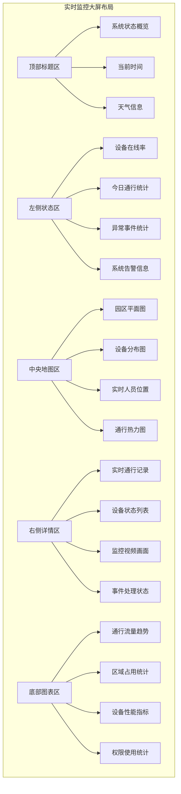

**Diagram sources**
- [功能概述.md](file://documentation/03-业务模块/门禁系统/功能概述.md)

## 事件记录与审计日志

事件记录与审计日志是门禁系统的重要组成部分，用于记录和分析所有门禁事件。

### 事件记录体系

事件记录体系包括事件采集、事件分类、事件存储、事件分析和报表生成。

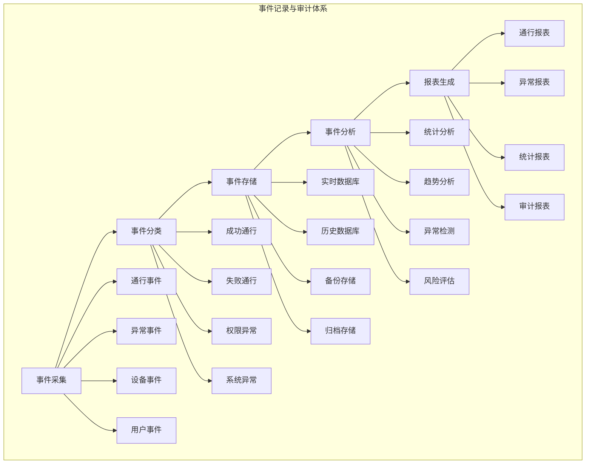

**Diagram sources**
- [功能概述.md](file://documentation/03-业务模块/门禁系统/功能概述.md)

### 审计日志实现

审计日志实现包括日志记录和异步审计分析。

```java
@Entity
@Table(name = "t_access_audit_log")
public class AccessAuditLogEntity {

    @Id
    @GeneratedValue(strategy = GenerationType.IDENTITY)
    private Long id;

    @Column(name = "log_id", length = 64, unique = true, nullable = false)
    private String logId;

    @Column(name = "event_type", nullable = false)
    private String eventType;

    @Column(name = "user_id")
    private Long userId;

    @Column(name = "device_id", nullable = false)
    private String deviceId;

    @Column(name = "area_id")
    private String areaId;

    @Column(name = "authentication_method")
    private String authenticationMethod;

    @Column(name = "access_result", nullable = false)
    private String accessResult;

    @Column(name = "failure_reason", length = 500)
    private String failureReason;

    @Column(name = "biometric_confidence", precision = 5, scale = 4)
    private BigDecimal biometricConfidence;

    @Column(name = "processing_time", nullable = false)
    private LocalDateTime processingTime;

    @Column(name = "response_time_ms")
    private Integer responseTimeMs;

    @Column(name = "client_ip", length = 45)
    private String clientIp;

    @Column(name = "user_agent", length = 500)
    private String userAgent;

    @Column(name = "additional_data", columnDefinition = "TEXT")
    private String additionalData;

    @Column(name = "create_time", nullable = false)
    private LocalDateTime createTime;
}

@Service
public class AccessAuditService {

    public void logAccessEvent(AccessEvent event) {
        AccessAuditLogEntity auditLog = new AccessAuditLogEntity();
        auditLog.setLogId(generateLogId());
        auditLog.setEventType(event.getEventType());
        auditLog.setUserId(event.getUserId());
        auditLog.setDeviceId(event.getDeviceId());
        auditLog.setAreaId(event.getAreaId());
        auditLog.setAuthenticationMethod(event.getAuthenticationMethod());
        auditLog.setAccessResult(event.getAccessResult());
        auditLog.setFailureReason(event.getFailureReason());
        auditLog.setBiometricConfidence(event.getBiometricConfidence());
        auditLog.setProcessingTime(LocalDateTime.now());
        auditLog.setResponseTimeMs(event.getResponseTimeMs());
        auditLog.setClientIp(event.getClientIp());
        auditLog.setAdditionalData(event.getAdditionalData());

        auditLogRepository.save(auditLog);

        // 异步处理审计分析
        asyncAuditAnalysis(auditLog);
    }

    @Async
    private void asyncAuditAnalysis(AccessAuditLogEntity auditLog) {
        // 1. 更新统计信息
        updateStatistics(auditLog);

        // 2. 检查异常模式
        checkAnomalyPatterns(auditLog);

        // 3. 风险评估
        performRiskAssessment(auditLog);

        // 4. 生成实时报告
        generateRealTimeReport(auditLog);
    }
}
```

**Section sources**
- [功能概述.md](file://documentation/03-业务模块/门禁系统/功能概述.md)
- [t_audit_log.sql](file://database-scripts/common-service/10-t_audit_log.sql)

### 事件记录查询API

事件记录查询API支持分页查询门禁记录和获取门禁记录统计。

```http
# 分页查询门禁记录
GET /api/v1/access/record/query?pageNum=1&pageSize=20&userId=1001&deviceId=1&areaId=AREA_001&startDate=2024-01-01&endDate=2024-01-31&accessResult=1

Response:
{
    "code": 200,
    "message": "查询成功",
    "data": {
        "list": [
            {
                "id": 1,
                "userId": 1001,
                "userName": "张三",
                "deviceId": 1,
                "deviceName": "主楼前门",
                "areaId": "AREA_001",
                "areaName": "研发区",
                "passTime": "2024-01-01T10:00:00",
                "passType": "IN",
                "passMethod": "FACE",
                "accessResult": "SUCCESS",
                "biometricConfidence": 0.95
            }
        ],
        "total": 1,
        "pageNum": 1,
        "pageSize": 20,
        "pages": 1
    }
}

# 获取门禁记录统计
GET /api/v1/access/record/statistics?startDate=2024-01-01&endDate=2024-01-31&areaId=AREA_001

Response:
{
    "code": 200,
    "message": "查询成功",
    "data": {
        "totalAccessCount": 1000,
        "successAccessCount": 980,
        "failedAccessCount": 20,
        "inAccessCount": 500,
        "outAccessCount": 480,
        "averageAccessTime": 150,
        "peakHourAccessCount": 200,
        "topAccessDevice": "主楼前门"
    }
}
```

**Section sources**
- [AccessRecordController.java](file://microservices/ioedream-access-service/src/main/java/net/lab1024/sa/access/controller/AccessRecordController.java)

## 门禁规则配置

门禁规则配置是门禁系统的核心功能之一，支持APB反潜回、互锁、联动等高级规则的配置。

### APB反潜回规则

APB反潜回规则用于防止人员在未完全通过门禁的情况下再次进入，确保门禁系统的安全性。

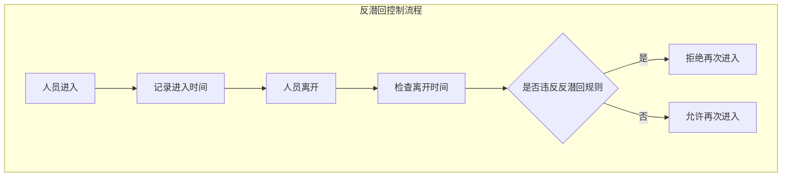

**Diagram sources**
- [功能概述.md](file://documentation/03-业务模块/门禁系统/功能概述.md)

### 互锁规则

互锁规则用于确保两个或多个门不能同时打开，防止非法进入。

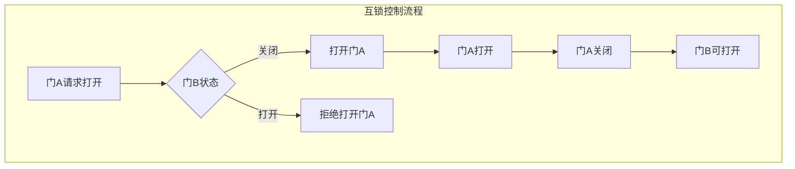

**Diagram sources**
- [功能概述.md](file://documentation/03-业务模块/门禁系统/功能概述.md)

### 联动规则

联动规则用于在特定事件发生时，自动触发一系列操作，如报警、录像、通知等。

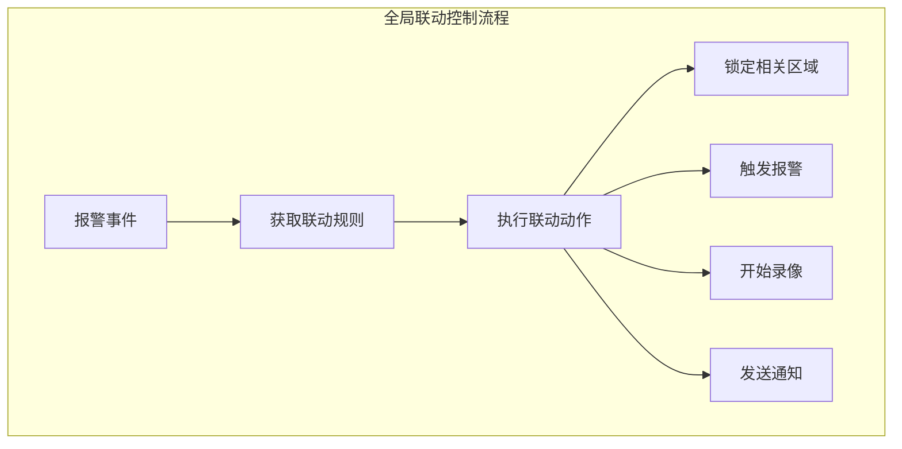

**Diagram sources**
- [功能概述.md](file://documentation/03-业务模块/门禁系统/功能概述.md)

### 门禁规则管理API

门禁规则管理API支持反潜回规则的创建、更新、删除和启用/禁用。

```http
# 创建反潜回规则
POST /api/v1/access/advanced/apb/rule
Content-Type: application/json

{
    "ruleName": "研发区反潜回规则",
    "areaId": "AREA_001",
    "ruleType": "HARD",
    "enabled": true
}

Response:
{
    "code": 200,
    "message": "创建成功",
    "data": "反潜回规则创建成功"
}

# 更新反潜回规则
PUT /api/v1/access/advanced/apb/rule/1
Content-Type: application/json

{
    "ruleName": "研发区反潜回规则",
    "areaId": "AREA_001",
    "ruleType": "SOFT",
    "enabled": true
}

Response:
{
    "code": 200,
    "message": "更新成功",
    "data": "反潜回规则更新成功"
}

# 删除反潜回规则
DELETE /api/v1/access/advanced/apb/rule/1

Response:
{
    "code": 200,
    "message": "删除成功",
    "data": "反潜回规则删除成功"
}

# 启用/禁用反潜回规则
POST /api/v1/access/advanced/apb/rule/1/toggle
Content-Type: application/json

{
    "enabled": false
}

Response:
{
    "code": 200,
    "message": "操作成功",
    "data": "反潜回规则状态更新成功"
}
```

**Section sources**
- [GlobalApbController.java](file://restful_refactor_backup_20251202_014224/microservices_ioedream-access-service_src_main_java_net_lab1024_sa_access_advanced_controller_GlobalApbController.java)

## 设备通讯集成

设备通讯集成是门禁系统与门禁设备之间的桥梁，负责设备的连接、数据采集和指令下发。

### 设备通讯架构

设备通讯架构包括设备连接池管理、数据库架构和API接口设计。

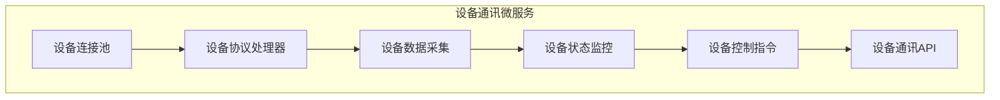

**Diagram sources**
- [openspec\changes\seven-microservice-architecture-integration\specs\device-communication-service\spec.md](file://openspec/changes/seven-microservice-architecture-integration/specs/device-communication-service/spec.md)

### 设备通讯API

设备通讯API支持设备协议配置、数据采集管理、实时数据传输和设备通信监控。

```http
# 配置设备协议
POST /api/device/communication/protocol/config
Content-Type: application/json

{
    "deviceId": 1,
    "protocolType": "ZKBIOSECURITY",
    "ipAddress": "192.168.1.100",
    "port": 4370,
    "timeout": 3000
}

Response:
{
    "code": 200,
    "message": "配置成功",
    "data": 1
}

# 获取设备通信状态
GET /api/device/communication/status/1

Response:
{
    "code": 200,
    "message": "查询成功",
    "data": {
        "connected": true,
        "lastHeartbeat": "2024-01-01T10:00:00",
        "sendQueueSize": 0,
        "receiveQueueSize": 0,
        "connectionDuration": 3600
    }
}

# 获取通信统计概览
GET /api/device/communication/statistics/overview

Response:
{
    "code": 200,
    "message": "查询成功",
    "data": {
        "totalDevices": 100,
        "onlineDevices": 98,
        "offlineDevices": 2,
        "totalConnections": 100,
        "activeConnections": 98,
        "messageThroughput": 1000,
        "errorRate": 0.01
    }
}
```

**Section sources**
- [DeviceCommunicationController.java](file://restful_refactor_backup_20251202_014224/microservices_ioedream-device-service_src_main_java_net_lab1024_sa_device_controller_DeviceCommunicationController.java)

### 设备通讯服务

设备通讯服务负责设备的全生命周期管理，包括设备注册、状态监控、设备控制和设备配置。

```java
@Service
@Transactional(readOnly = true)
public class DeviceService {

    @Resource
    private DeviceManager deviceManager;
    @Resource
    private DeviceProtocolFactory protocolFactory;
    @Resource
    private DeviceMonitorService monitorService;
    @Resource
    private DeviceConfigService configService;

    public PageResult<DeviceVO> queryPage(DeviceQueryDTO queryDTO) {
        // 1. 参数验证
        validateQueryDTO(queryDTO);

        // 2. 查询设备数据
        PageResult<DeviceVO> result = deviceManager.queryPage(queryDTO);

        // 3. 补充设备状态信息
        enrichDeviceStatus(result.getRecords());

        return result;
    }

    @Transactional(rollbackFor = Exception.class)
    public void add(DeviceCreateDTO createDTO) {
        // 1. 验证设备编码唯一性
        validateDeviceCodeUnique(createDTO.getDeviceCode());

        // 2. 验证设备类型
        validateDeviceType(createDTO.getDeviceType());

        // 3. 创建设备
        DeviceEntity device = BeanUtil.copyProperties(createDTO, DeviceEntity.class);
        device.setStatus(0); // 默认离线状态
        device.setVersion(1);

        deviceManager.add(device);

        // 4. 初始化设备配置
        initializeDeviceConfig(device.getDeviceId(), createDTO.getDeviceType());

        // 5. 启动设备监控
        monitorService.startDeviceMonitor(device.getDeviceId());

        // 6. 发布设备创建事件
        eventPublisher.publishEvent(new DeviceCreateEvent(device.getDeviceId()));
    }

    @Transactional(rollbackFor = Exception.class)
    public void update(DeviceUpdateDTO updateDTO) {
        // 1. 验证设备存在性
        DeviceEntity device = deviceManager.getById(updateDTO.getDeviceId());
        if (device == null) {
            throw new SmartException("设备不存在");
        }

        // 2. 验证编码唯一性（排除自身）
        validateDeviceCodeUnique(updateDTO.getDeviceCode(), updateDTO.getDeviceId());

        // 3. 更新设备信息
        DeviceEntity updateEntity = BeanUtil.copyProperties(updateDTO, DeviceEntity.class);
        updateEntity.setVersion(device.getVersion() + 1); // 版本递增

        deviceManager.update(updateEntity);

        // 4. 发布设备更新事件
        eventPublisher.publishEvent(new DeviceUpdateEvent(device.getDeviceId()));
    }

    @Transactional(rollbackFor = Exception.class)
    public void delete(Long deviceId) {
        // 1. 验证设备存在性
        DeviceEntity device = deviceManager.getById(deviceId);
        if (device == null) {
            throw new SmartException("设备不存在");
        }

        // 2. 停止设备监控
        monitorService.stopDeviceMonitor(deviceId);

        // 3. 软删除设备
        deviceManager.softDelete(deviceId);

        // 4. 发布设备删除事件
        eventPublisher.publishEvent(new DeviceDeleteEvent(deviceId));
    }

    @Transactional(rollbackFor = Exception.class)
    public void controlDevice(Long deviceId, DeviceControlDTO controlDTO) {
        // 1. 验证设备存在性
        DeviceEntity device = deviceManager.getById(deviceId);
        if (device == null) {
            throw new SmartException("设备不存在");
        }

        // 2. 验证设备在线状态
        if (device.getStatus() != 1) {
            throw new SmartException("设备离线，无法控制");
        }

        // 3. 获取设备协议处理器
        DeviceProtocol protocol = protocolFactory.getProtocol(DeviceType.valueOf(device.getDeviceType()));

        // 4. 执行设备控制
        DeviceControlResult result = protocol.controlDevice(device, controlDTO);

        // 5. 记录控制结果
        deviceManager.recordControlResult(deviceId, controlDTO, result);

        // 6. 发布设备控制事件
        eventPublisher.publishEvent(new DeviceControlEvent(deviceId, controlDTO, result));
    }
}
```

**Section sources**
- [smart-device.md](file://documentation/technical/smart-device.md)

## 安全策略

门禁系统采用多层安全防护体系，确保系统的安全性和可靠性。

### 多层安全防护

多层安全防护体系包括物理安全层、网络安全层、应用安全层和数据安全层。

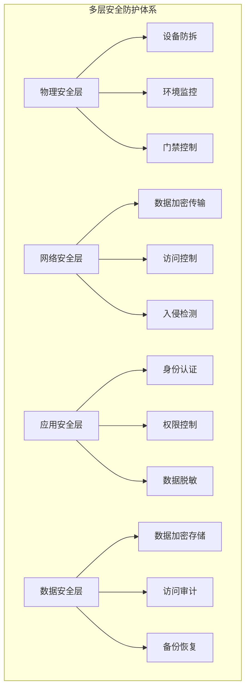

**Diagram sources**
- [功能概述.md](file://documentation/03-业务模块/门禁系统/功能概述.md)

### 安全策略配置

安全策略配置包括认证、加密、访问控制、审计和网络安全等方面的配置。

```yaml
security_config:
  authentication:
    multi_factor_required: true
    liveness_check_enabled: true
    biometric_threshold: 0.85
    session_timeout: 300  # 秒

  encryption:
    data_transmission: "TLS_1_3"
    data_storage: "AES_256_GCM"
    key_management: "HSM"

  access_control:
    max_failed_attempts: 3
    lockout_duration: 900  # 秒
    emergency_access_enabled: true

  audit:
    log_all_events: true
    log_retention_days: 2555  # 7年
    real_time_monitoring: true

  network_security:
    firewall_enabled: true
    intrusion_detection: true
    ddos_protection: true
```

**Section sources**
- [功能概述.md](file://documentation/03-业务模块/门禁系统/功能概述.md)

## 故障排查指南

故障排查指南提供门禁系统常见问题的解决方案，帮助运维人员快速定位和解决问题。

### 常见故障及解决方案

| 故障现象 | 可能原因 | 解决方案 |
|--------|--------|--------|
| 设备离线 | 网络连接问题 | 检查网络连接，重启设备 |
| 认证失败 | 生物特征不匹配 | 重新录入生物特征，检查识别设备 |
| 门无法打开 | 门锁故障 | 检查门锁连接，重启门禁控制器 |
| 通行记录丢失 | 数据库连接问题 | 检查数据库连接，重启服务 |
| 系统响应慢 | 系统负载过高 | 优化系统配置，增加服务器资源 |

### 故障排查流程

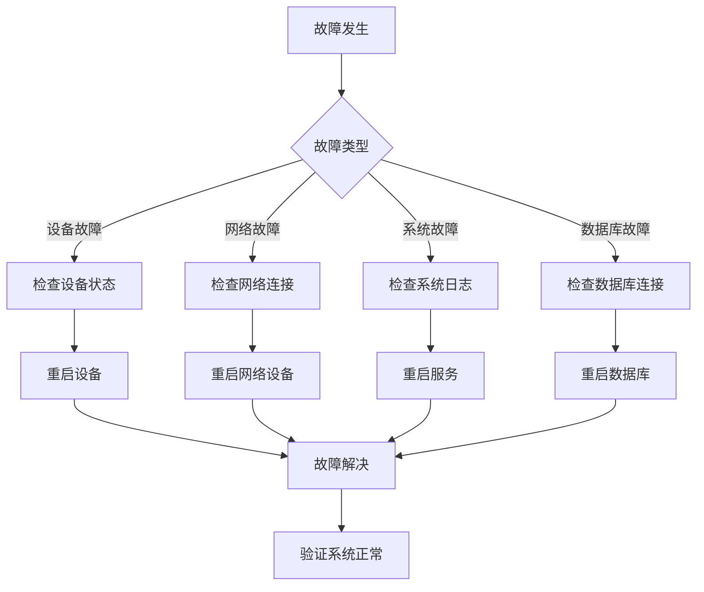

**Diagram sources**
- [功能概述.md](file://documentation/03-业务模块/门禁系统/功能概述.md)