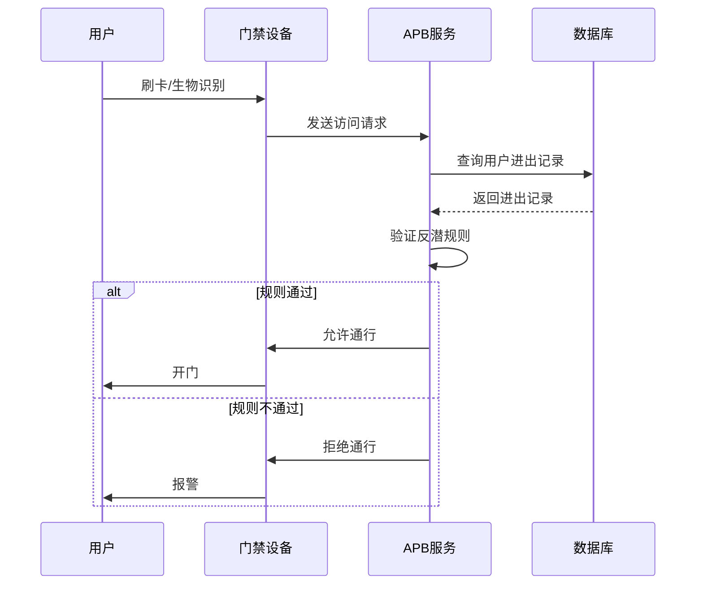
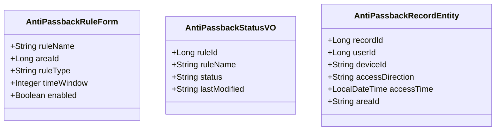
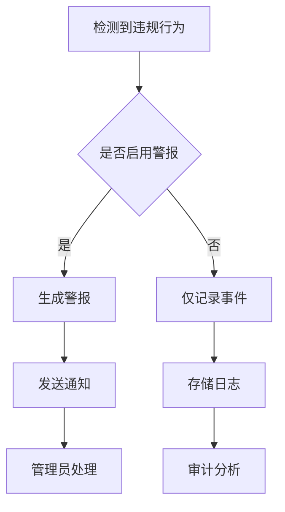
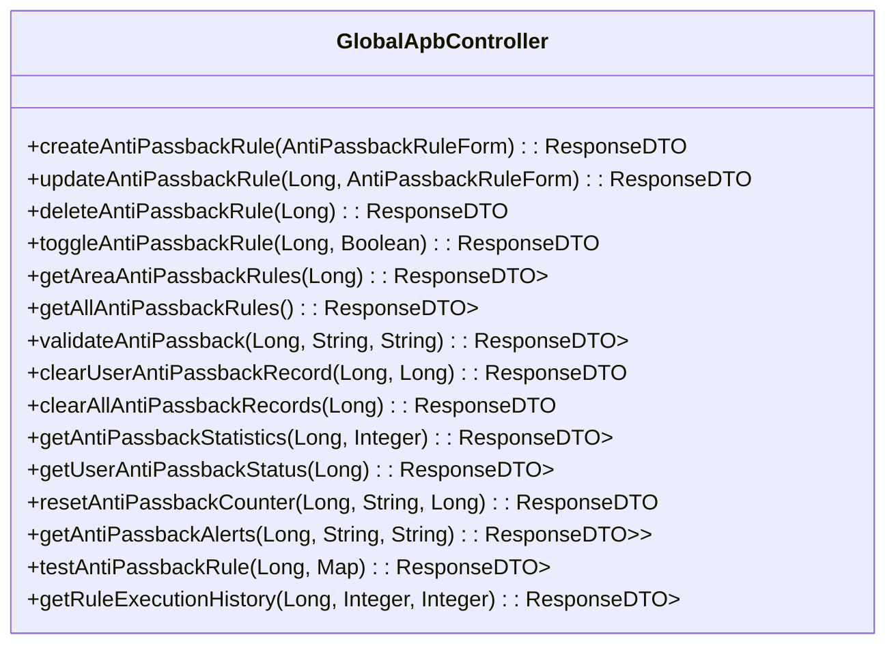
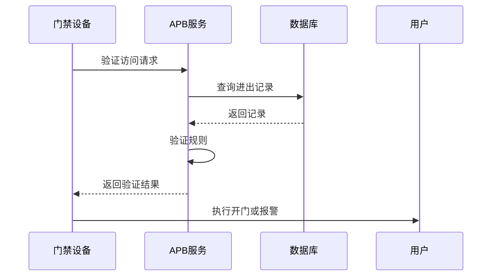
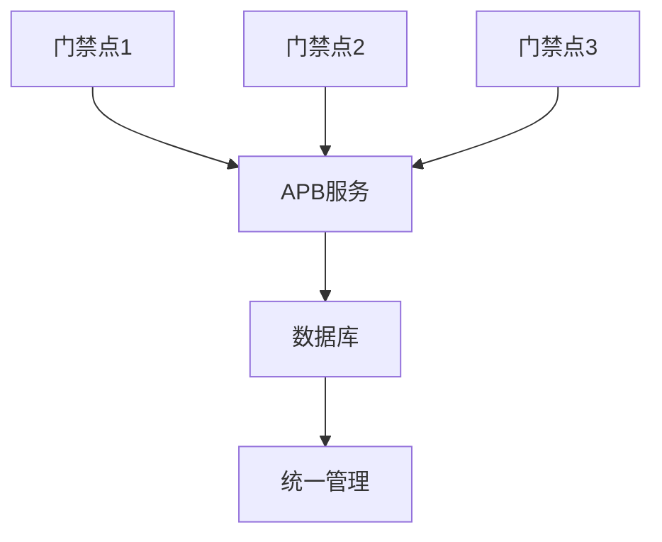

# APB反潜回配置

<cite>
**本文档引用文件**  
- [GlobalApbController.java](file://restful_refactor_backup_20251202_014224/microservices_ioedream-access-service_src_main_java_net_lab1024_sa_access_advanced_controller_GlobalApbController.java)
- [AntiPassbackEngine.java](file://documentation/archive/reports-2025-12-04/CODE_QUALITY_FIX_REPORT.md)
- [AccessControlService.java](file://documentation/03-业务模块/门禁系统/功能概述.md)
- [AntiPassbackRuleDao.java](file://documentation/archive/reports-2025-12-04/EXECUTION_SUMMARY_REPORT.md)
- [AntiPassbackRecordDao.java](file://documentation/archive/reports-2025-12-04/FINAL_FIX_SUMMARY_REPORT.md)
</cite>

## 目录
1. [引言](#引言)
2. [APB反潜回规则概述](#apb反潜回规则概述)
3. [业务逻辑与实现原理](#业务逻辑与实现原理)
4. [APB规则配置参数](#apb规则配置参数)
5. [违规行为处理策略](#违规行为处理策略)
6. [APB规则启用与配置步骤](#apb规则启用与配置步骤)
7. [API接口说明](#api接口说明)
8. [配置示例](#配置示例)
9. [与门禁设备的联动方式](#与门禁设备的联动方式)
10. [多门场景下的应用模式](#多门场景下的应用模式)
11. [常见问题排查指南](#常见问题排查指南)
12. [结论](#结论)

## 引言
APB（Anti-Passback）反潜回规则是门禁系统中的重要安全机制，用于防止人员通过非法方式重复进入或离开受控区域。本文档详细说明APB反潜回规则的配置方法、业务逻辑、实现原理以及相关API接口和配置示例，帮助用户正确启用和管理APB规则。

## APB反潜回规则概述
APB反潜回规则通过监控人员进出顺序和时间窗口，确保人员按照规定的路径和时间进行出入操作。当检测到违反规则的行为时，系统将拒绝访问并生成警报。

**Section sources**
- [GlobalApbController.java](file://restful_refactor_backup_20251202_014224/microservices_ioedream-access-service_src_main_java_net_lab1024_sa_access_advanced_controller_GlobalApbController.java#L1-L288)

## 业务逻辑与实现原理
APB反潜回规则的核心业务逻辑包括人员进出顺序的检测机制和时间窗口的配置参数。系统通过记录用户的进出记录，并在每次访问请求时验证是否符合反潜规则。



**Diagram sources**
- [GlobalApbController.java](file://restful_refactor_backup_20251202_014224/microservices_ioedream-access-service_src_main_java_net_lab1024_sa_access_advanced_controller_GlobalApbController.java#L136-L146)
- [AccessControlService.java](file://documentation/03-业务模块/门禁系统/功能概述.md#L873-L878)

**Section sources**
- [GlobalApbController.java](file://restful_refactor_backup_20251202_014224/microservices_ioedream-access-service_src_main_java_net_lab1024_sa_access_advanced_controller_GlobalApbController.java#L136-L146)
- [AccessControlService.java](file://documentation/03-业务模块/门禁系统/功能概述.md#L873-L878)

## APB规则配置参数
APB规则的配置参数主要包括区域ID、规则类型、时间窗口等。这些参数在创建和更新反潜规则时通过`AntiPassbackRuleForm`表单传递。



**Diagram sources**
- [GlobalApbController.java](file://restful_refactor_backup_20251202_014224/microservices_ioedream-access-service_src_main_java_net_lab1024_sa_access_advanced_controller_GlobalApbController.java#L7-L8)
- [AntiPassbackRuleDao.java](file://documentation/archive/reports-2025-12-04/EXECUTION_SUMMARY_REPORT.md#L319-L322)

**Section sources**
- [GlobalApbController.java](file://restful_refactor_backup_20251202_014224/microservices_ioedream-access-service_src_main_java_net_lab1024_sa_access_advanced_controller_GlobalApbController.java#L7-L8)
- [AntiPassbackRuleDao.java](file://documentation/archive/reports-2025-12-04/EXECUTION_SUMMARY_REPORT.md#L319-L322)

## 违规行为处理策略
当检测到违反APB规则的行为时，系统将采取相应的处理策略，包括拒绝通行、生成警报和记录事件。管理员可以通过API接口获取反潜警报列表和执行历史。



**Diagram sources**
- [GlobalApbController.java](file://restful_refactor_backup_20251202_014224/microservices_ioedream-access-service_src_main_java_net_lab1024_sa_access_advanced_controller_GlobalApbController.java#L240-L250)
- [AccessControlService.java](file://documentation/03-业务模块/门禁系统/功能概述.md#L875-L877)

**Section sources**
- [GlobalApbController.java](file://restful_refactor_backup_20251202_014224/microservices_ioedream-access-service_src_main_java_net_lab1024_sa_access_advanced_controller_GlobalApbController.java#L240-L250)
- [AccessControlService.java](file://documentation/03-业务模块/门禁系统/功能概述.md#L875-L877)

## APB规则启用与配置步骤
启用和配置APB规则的步骤如下：
1. 创建反潜规则
2. 配置规则参数
3. 启用规则
4. 测试规则

**Section sources**
- [GlobalApbController.java](file://restful_refactor_backup_20251202_014224/microservices_ioedream-access-service_src_main_java_net_lab1024_sa_access_advanced_controller_GlobalApbController.java#L40-L48)

## API接口说明
APB反潜回规则提供了多个API接口用于管理规则和验证访问请求。



**Diagram sources**
- [GlobalApbController.java](file://restful_refactor_backup_20251202_014224/microservices_ioedream-access-service_src_main_java_net_lab1024_sa_access_advanced_controller_GlobalApbController.java#L40-L288)

**Section sources**
- [GlobalApbController.java](file://restful_refactor_backup_20251202_014224/microservices_ioedream-access-service_src_main_java_net_lab1024_sa_access_advanced_controller_GlobalApbController.java#L40-L288)

## 配置示例
以下是一个APB规则的配置示例：

```json
{
  "ruleName": "主入口反潜规则",
  "areaId": 1001,
  "ruleType": "IN_OUT_SEQUENCE",
  "timeWindow": 300,
  "enabled": true
}
```

**Section sources**
- [GlobalApbController.java](file://restful_refactor_backup_20251202_014224/microservices_ioedream-access-service_src_main_java_net_lab1024_sa_access_advanced_controller_GlobalApbController.java#L42-L47)

## 与门禁设备的联动方式
APB规则与门禁设备的联动通过API接口实现。门禁设备在接收到访问请求后，调用APB服务的验证接口，根据返回结果决定是否允许通行。



**Diagram sources**
- [GlobalApbController.java](file://restful_refactor_backup_20251202_014224/microservices_ioedream-access-service_src_main_java_net_lab1024_sa_access_advanced_controller_GlobalApbController.java#L136-L146)
- [AccessControlService.java](file://documentation/03-业务模块/门禁系统/功能概述.md#L873-L878)

**Section sources**
- [GlobalApbController.java](file://restful_refactor_backup_20251202_014224/microservices_ioedream-access-service_src_main_java_net_lab1024_sa_access_advanced_controller_GlobalApbController.java#L136-L146)
- [AccessControlService.java](file://documentation/03-业务模块/门禁系统/功能概述.md#L873-L878)

## 多门场景下的应用模式
在多门场景下，APB规则可以跨多个门禁点进行统一管理。系统通过区域ID关联多个门禁设备，确保人员在不同门禁点之间的进出顺序符合规则。



**Diagram sources**
- [GlobalApbController.java](file://restful_refactor_backup_20251202_014224/microservices_ioedream-access-service_src_main_java_net_lab1024_sa_access_advanced_controller_GlobalApbController.java#L105-L112)
- [AccessControlService.java](file://documentation/03-业务模块/门禁系统/功能概述.md#L873-L878)

**Section sources**
- [GlobalApbController.java](file://restful_refactor_backup_20251202_014224/microservices_ioedream-access-service_src_main_java_net_lab1024_sa_access_advanced_controller_GlobalApbController.java#L105-L112)
- [AccessControlService.java](file://documentation/03-业务模块/门禁系统/功能概述.md#L873-L878)

## 常见问题排查指南
### APB规则不生效
- 检查规则是否已启用
- 确认区域ID配置正确
- 验证时间窗口设置是否合理

### 误报情况
- 检查进出记录是否准确
- 确认用户身份识别无误
- 调整时间窗口以适应实际场景

**Section sources**
- [GlobalApbController.java](file://restful_refactor_backup_20251202_014224/microservices_ioedream-access-service_src_main_java_net_lab1024_sa_access_advanced_controller_GlobalApbController.java#L90-L97)
- [AntiPassbackRecordDao.java](file://documentation/archive/reports-2025-12-04/FINAL_FIX_SUMMARY_REPORT.md#L243-L246)

## 结论
APB反潜回规则是保障门禁系统安全的重要机制。通过合理配置和管理APB规则，可以有效防止非法出入行为，提升整体安全水平。本文档详细介绍了APB规则的配置方法、业务逻辑、实现原理及相关API接口，为用户提供全面的指导和支持。