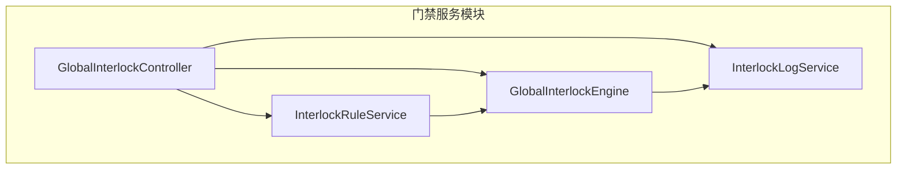
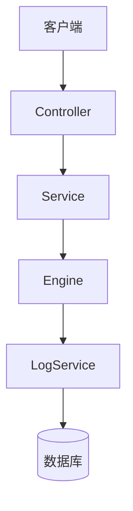
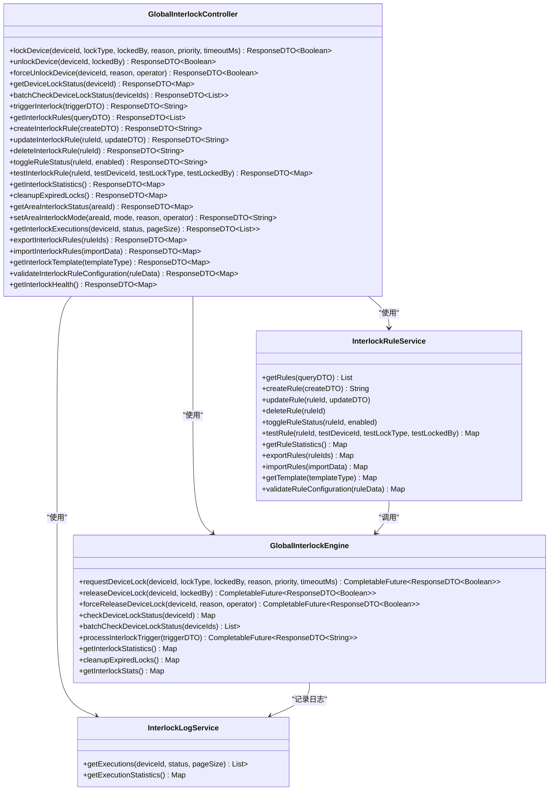
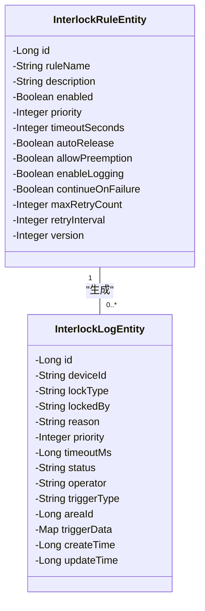
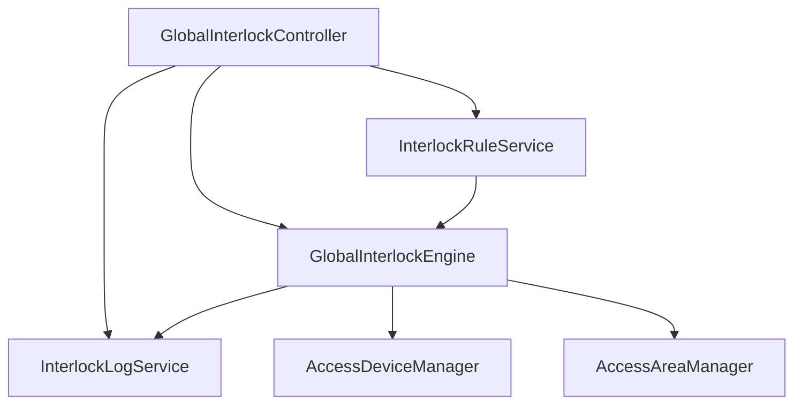

# 互锁规则配置

<cite>
**本文档引用文件**  
- [GlobalInterlockController.java](file://restful_refactor_backup_20251202_014224\microservices_ioedream-access-service_src_main_java_net_lab1024_sa_access_advanced_controller_GlobalInterlockController.java)
- [ENTITY_MERGE_DIFF_REPORT.md](file://documentation\archive\reports-2025-12-04\ENTITY_MERGE_DIFF_REPORT.md)
- [ENTITY_MIGRATION_CHECKLIST.md](file://documentation\archive\reports-2025-12-04\ENTITY_MIGRATION_CHECKLIST.md)
- [FOUR_MODULES_COMPREHENSIVE_ANALYSIS_REPORT.md](file://FOUR_MODULES_COMPREHENSIVE_ANALYSIS_REPORT.md)
</cite>

## 目录
1. [引言](#引言)
2. [项目结构](#项目结构)
3. [核心组件](#核心组件)
4. [架构概述](#架构概述)
5. [详细组件分析](#详细组件分析)
6. [依赖分析](#依赖分析)
7. [性能考虑](#性能考虑)
8. [故障排查指南](#故障排查指南)
9. [结论](#结论)

## 引言
本文档详细说明了互锁规则的配置机制，涵盖多门互斥访问控制逻辑、互锁组配置方法、紧急情况下的解除机制。文档还提供了互锁规则的配置步骤和参数说明（如互锁延迟时间、优先级设置），解释了互锁规则与门禁区域的关联方式及其在高安全区域的应用实例，并包含测试方法和故障处理方案。

## 项目结构
互锁规则功能主要集中在门禁服务模块中，通过全局互锁控制器提供REST API接口，实现设备间互锁管理与控制。

**图表来源**
- [GlobalInterlockController.java](file://restful_refactor_backup_20251202_014224\microservices_ioedream-access-service_src_main_java_net_lab1024_sa_access_advanced_controller_GlobalInterlockController.java#L30-L34)

**章节来源**
- [GlobalInterlockController.java](file://restful_refactor_backup_20251202_014224\microservices_ioedream-access-service_src_main_java_net_lab1024_sa_access_advanced_controller_GlobalInterlockController.java#L1-L683)

## 核心组件
互锁规则系统由控制器、服务层、引擎和日志服务组成，支持设备互锁申请、释放、状态检查、规则管理及执行记录查询等功能。

**章节来源**
- [GlobalInterlockController.java](file://restful_refactor_backup_20251202_014224\microservices_ioedream-access-service_src_main_java_net_lab1024_sa_access_advanced_controller_GlobalInterlockController.java#L45-L683)

## 架构概述
互锁系统采用分层架构设计，前端请求通过控制器调用服务层进行业务处理，核心逻辑由互锁引擎执行，日志服务负责记录执行过程。

**图表来源**
- [GlobalInterlockController.java](file://restful_refactor_backup_20251202_014224\microservices_ioedream-access-service_src_main_java_net_lab1024_sa_access_advanced_controller_GlobalInterlockController.java#L36-L43)

## 详细组件分析

### 互锁规则管理分析
互锁规则管理功能包括创建、更新、删除、启用/禁用、测试、导入导出等操作，支持基于条件的规则查询和验证。

#### 对象导向组件：

**图表来源**
- [GlobalInterlockController.java](file://restful_refactor_backup_20251202_014224\microservices_ioedream-access-service_src_main_java_net_lab1024_sa_access_advanced_controller_GlobalInterlockController.java#L36-L43)

**章节来源**
- [GlobalInterlockController.java](file://restful_refactor_backup_20251202_014224\microservices_ioedream-access-service_src_main_java_net_lab1024_sa_access_advanced_controller_GlobalInterlockController.java#L45-L683)

### 互锁规则数据库实体分析
互锁规则实体包含丰富的配置字段，支持超时自动释放、抢占机制、日志记录、失败重试等高级功能。

#### 对象导向组件：

**图表来源**
- [ENTITY_MERGE_DIFF_REPORT.md](file://documentation\archive\reports-2025-12-04\ENTITY_MERGE_DIFF_REPORT.md#L78-L109)

## 依赖分析
互锁规则系统依赖于门禁服务的基础组件，包括设备管理、区域管理、日志服务等，通过微服务架构与其他模块集成。

**图表来源**
- [GlobalInterlockController.java](file://restful_refactor_backup_20251202_014224\microservices_ioedream-access-service_src_main_java_net_lab1024_sa_access_advanced_controller_GlobalInterlockController.java#L36-L43)
- [FOUR_MODULES_COMPREHENSIVE_ANALYSIS_REPORT.md](file://FOUR_MODULES_COMPREHENSIVE_ANALYSIS_REPORT.md#L178-L183)

**章节来源**
- [ENTITY_MIGRATION_CHECKLIST.md](file://documentation\archive\reports-2025-12-04\ENTITY_MIGRATION_CHECKLIST.md#L53-L58)

## 性能考虑
互锁规则系统设计考虑了高并发场景下的性能表现，通过异步处理、缓存机制和批量操作优化系统响应速度。

## 故障排查指南
当出现互锁失效或死锁情况时，可通过以下步骤进行排查：
1. 检查互锁健康状态接口返回信息
2. 查询互锁执行记录确认操作历史
3. 检查数据库中互锁规则和日志表数据一致性
4. 验证互锁规则配置正确性
5. 查看系统日志中的错误信息

**章节来源**
- [GlobalInterlockController.java](file://restful_refactor_backup_20251202_014224\microservices_ioedream-access-service_src_main_java_net_lab1024_sa_access_advanced_controller_GlobalInterlockController.java#L596-L644)

## 结论
互锁规则系统提供了完整的设备间互锁管理功能，支持灵活的规则配置、优先级控制、超时自动释放和紧急解除机制，适用于高安全要求的门禁场景。