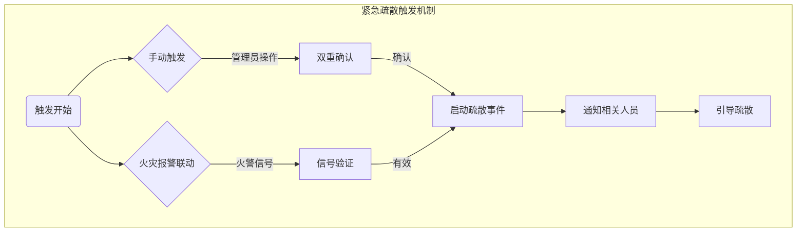
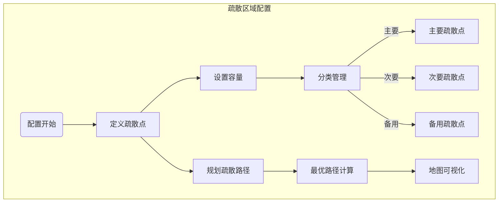
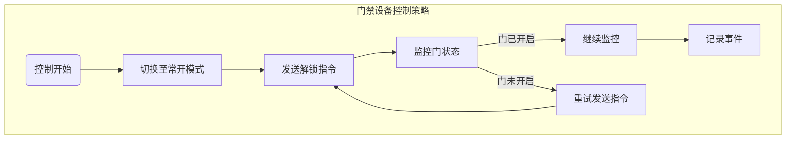
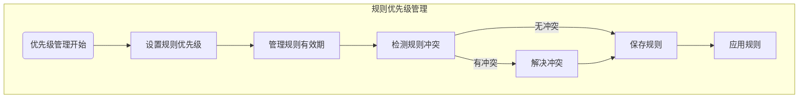
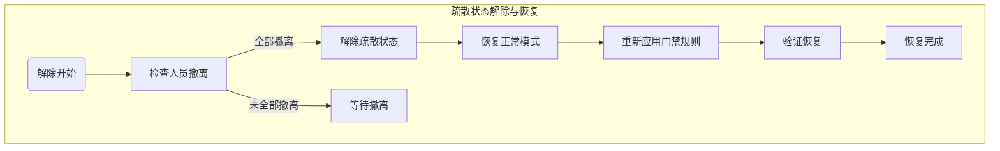
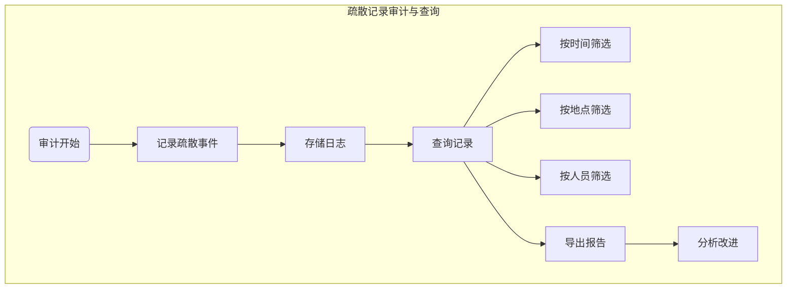
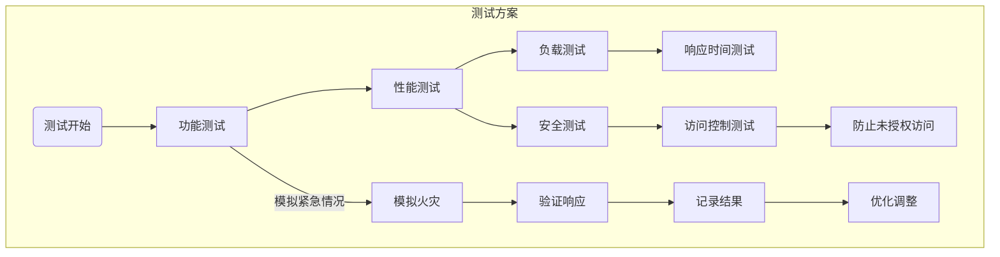

# 紧急疏散配置

<cite>
**本文档引用文件**  
- [EvacuationController.java](file://restful_refactor_backup_20251202_014224/microservices_ioedream-access-service_src_main_java_net_lab1024_sa_access_advanced_controller_EvacuationController.java)
- [GlobalInterlockController.java](file://restful_refactor_backup_20251202_014224/microservices_ioedream-access-service_src_main_java_net_lab1024_sa_access_advanced_controller_GlobalInterlockController.java)
- [高级功能模块流程图.md](file://documentation/03-业务模块/门禁/08-高级功能模块流程图.md)
- [关键控制点和性能指标.md](file://documentation/03-业务模块/门禁/11-关键控制点和性能指标.md)
- [advanced-features-implementation\spec.md](file://openspec/changes/archive/completed-proposals/implement-access-control-missing-functions/specs/advanced-features-implementation/spec.md)
- [smart-access.md](file://documentation/technical/smart-access.md)
</cite>

## 目录
1. [紧急疏散模式触发机制](#紧急疏散模式触发机制)
2. [紧急疏散区域配置](#紧急疏散区域配置)
3. [疏散状态下门禁设备控制策略](#疏散状态下门禁设备控制策略)
4. [疏散规则优先级管理](#疏散规则优先级管理)
5. [疏散状态解除与安全恢复流程](#疏散状态解除与安全恢复流程)
6. [疏散记录审计与查询](#疏散记录审计与查询)
7. [紧急疏散系统测试方案](#紧急疏散系统测试方案)
8. [安全注意事项](#安全注意事项)

## 紧急疏散模式触发机制

紧急疏散模式的触发机制是确保在紧急情况下能够快速启动疏散流程的关键。系统支持多种触发方式，包括手动触发和火灾报警联动触发。

手动触发是通过系统管理界面或移动应用中的紧急按钮来启动疏散事件。管理员或授权人员可以在确认紧急情况后，通过点击“触发疏散事件”按钮来启动疏散流程。此操作需要双重确认以防止误操作，并且所有操作都会被记录在审计日志中。

火灾报警联动触发是当火灾报警系统检测到火警信号时，自动触发疏散事件。系统集成了火灾报警系统，一旦接收到火警信号，将立即启动疏散流程。这种联动机制确保了在火灾发生时能够迅速响应，减少人员伤亡风险。

**图源**  
- [EvacuationController.java](file://restful_refactor_backup_20251202_014224/microservices_ioedream-access-service_src_main_java_net_lab1024_sa_access_advanced_controller_EvacuationController.java#L112-L129)
- [advanced-features-implementation\spec.md](file://openspec/changes/archive/completed-proposals/implement-access-control-missing-functions/specs/advanced-features-implementation/spec.md#L123-L131)

## 紧急疏散区域配置

紧急疏散区域的配置是确保疏散流程高效有序的基础。系统允许管理员在地图上定义疏散点位置和容量，支持主要、次要和备用疏散点的分类管理。每个疏散点可以设置最大容量，超出容量时系统会自动发出预警。

疏散路径规划是基于建筑结构和安全出口位置进行的。系统支持最优疏散路径计算，根据实时情况动态调整路径，确保人员能够快速安全地到达疏散点。此外，疏散配置支持地图可视化，便于管理人员直观了解疏散布局。

**图源**  
- [高级功能模块流程图.md](file://documentation/03-业务模块/门禁/08-高级功能模块流程图.md#L47-L53)
- [advanced-features-implementation\spec.md](file://openspec/changes/archive/completed-proposals/implement-access-control-missing-functions/specs/advanced-features-implementation/spec.md#L106-L110)

## 疏散状态下门禁设备控制策略

在疏散状态下，门禁设备的控制策略是确保人员能够快速撤离的关键。系统采用常开模式控制门禁设备，即在紧急疏散期间，所有相关门禁设备将自动切换到常开状态，允许人员自由通行。

常开模式通过门禁控制器发送指令实现，确保门锁处于解锁状态。同时，系统会监控门的状态，确保门确实处于开启状态。如果发现门未正常开启，系统会立即发出警报并尝试重新发送指令。

**图源**  
- [smart-access.md](file://documentation/technical/smart-access.md#L758-L797)
- [GlobalInterlockController.java](file://restful_refactor_backup_20251202_014224/microservices_ioedream-access-service_src_main_java_net_lab1024_sa_access_advanced_controller_GlobalInterlockController.java#L56-L77)

## 疏散规则优先级管理

疏散规则的优先级管理确保在紧急情况下能够覆盖其他门禁规则，保障人员安全。系统支持规则的优先级设置，高优先级的疏散规则可以覆盖低优先级的常规门禁规则。

规则优先级的设置通过规则管理界面完成，管理员可以根据需要调整规则的优先级。系统还支持规则的有效期管理，确保规则在特定时间段内生效。此外，规则冲突检测机制可以自动识别并解决规则之间的冲突，避免因规则冲突导致的安全隐患。

**图源**  
- [advanced-features-implementation\spec.md](file://openspec/changes/archive/completed-proposals/implement-access-control-missing-functions/specs/advanced-features-implementation/spec.md#L157-L161)
- [关键控制点和性能指标.md](file://documentation/03-业务模块/门禁/11-关键控制点和性能指标.md#L229-L236)

## 疏散状态解除与安全恢复流程

疏散状态的解除和安全恢复流程是确保在紧急情况解除后能够恢复正常运营的重要环节。当紧急情况解除后，管理员可以通过系统管理界面手动解除疏散状态。系统会自动检查所有疏散点的人员撤离情况，确认无人员滞留后，方可解除疏散状态。

解除疏散状态后，系统会逐步恢复门禁设备的正常工作模式。首先，门禁设备将从常开模式切换回正常模式，然后重新应用原有的门禁规则。整个恢复过程需要经过严格的验证，确保所有设备和规则都已正确恢复。

**图源**  
- [EvacuationController.java](file://restful_refactor_backup_20251202_014224/microservices_ioedream-access-service_src_main_java_net_lab1024_sa_access_advanced_controller_EvacuationController.java#L112-L129)
- [关键控制点和性能指标.md](file://documentation/03-业务模块/门禁/11-关键控制点和性能指标.md#L254)

## 疏散记录审计与查询

疏散记录的审计和查询功能是确保疏散流程可追溯和可审查的重要手段。系统会自动记录每次疏散事件的详细信息，包括触发时间、触发方式、参与人员、疏散路径等。这些记录会被存储在安全的日志文件中，供后续审计和分析使用。

管理员可以通过系统管理界面查询历史疏散记录，支持按时间、地点、人员等多种条件进行筛选。查询结果可以导出为报告，用于事故分析和改进措施制定。此外，系统还支持实时监控疏散过程，提供实时数据和统计信息。

**图源**  
- [EvacuationController.java](file://restful_refactor_backup_20251202_014224/microservices_ioedream-access-service_src_main_java_net_lab1024_sa_access_advanced_controller_EvacuationController.java#L118-L129)
- [关键控制点和性能指标.md](file://documentation/03-业务模块/门禁/11-关键控制点和性能指标.md#L113-L123)

## 紧急疏散系统测试方案

为了确保紧急疏散系统的可靠性和有效性，必须定期进行系统测试。测试方案包括功能测试、性能测试和安全测试。功能测试验证系统各项功能是否正常工作，如手动触发、火灾报警联动、疏散路径规划等。性能测试评估系统在高负载下的表现，确保在紧急情况下能够快速响应。安全测试检查系统的安全性，防止未经授权的访问和操作。

测试过程中应模拟各种紧急情况，如火灾、地震等，验证系统在不同场景下的响应能力。测试结果应详细记录，并根据测试结果进行必要的调整和优化。定期的应急演练也是测试的一部分，通过实际演练验证疏散流程的有效性。

**图源**  
- [advanced-features-implementation\spec.md](file://openspec/changes/archive/completed-proposals/implement-access-control-missing-functions/specs/advanced-features-implementation/spec.md#L248-L272)
- [关键控制点和性能指标.md](file://documentation/03-业务模块/门禁/11-关键控制点和性能指标.md#L254)

## 安全注意事项

在实施和维护紧急疏散系统时，必须注意以下安全事项。首先，所有操作都应遵循最小权限原则，确保只有授权人员才能进行关键操作。其次，系统配置和规则变更需要经过审批流程，防止误操作导致的安全隐患。此外，所有操作都应记录在审计日志中，以便事后追溯和审查。

定期进行系统维护和检查，确保所有设备和软件都处于良好状态。对于发现的问题，应及时修复并验证修复效果。最后，定期组织应急演练，提高人员的应急反应能力和疏散效率。

**本节来源**  
- [advanced-features-implementation\spec.md](file://openspec/changes/archive/completed-proposals/implement-access-control-missing-functions/specs/advanced-features-implementation/spec.md#L177-L181)
- [关键控制点和性能指标.md](file://documentation/03-业务模块/门禁/11-关键控制点和性能指标.md#L238-L246)