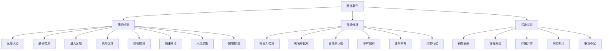
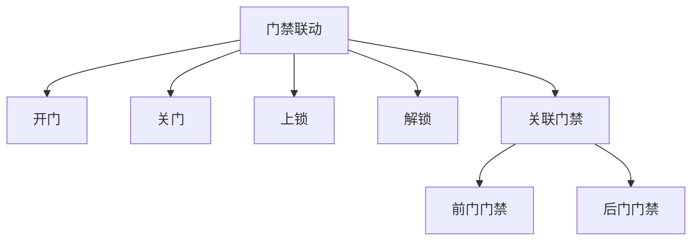
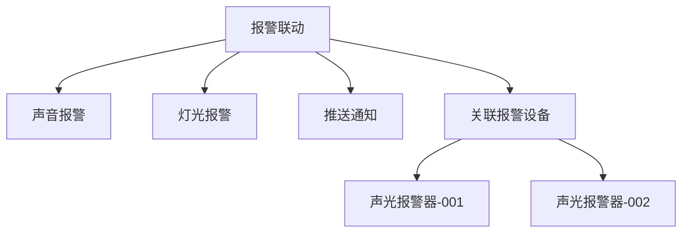
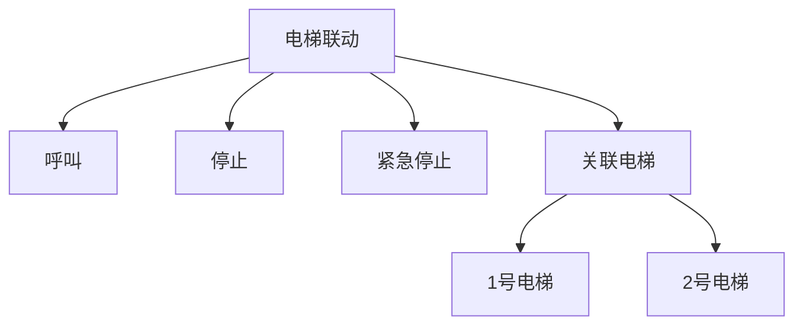
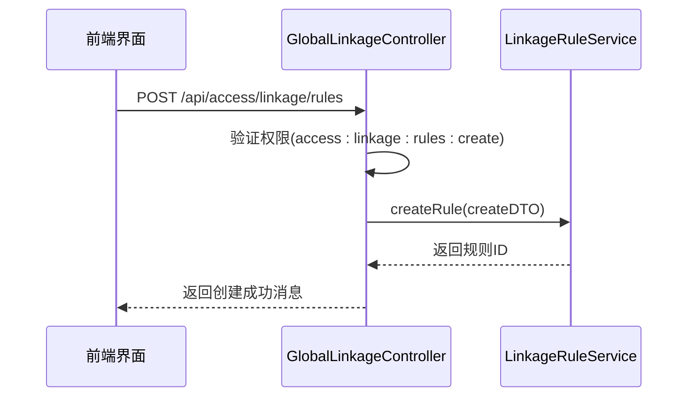
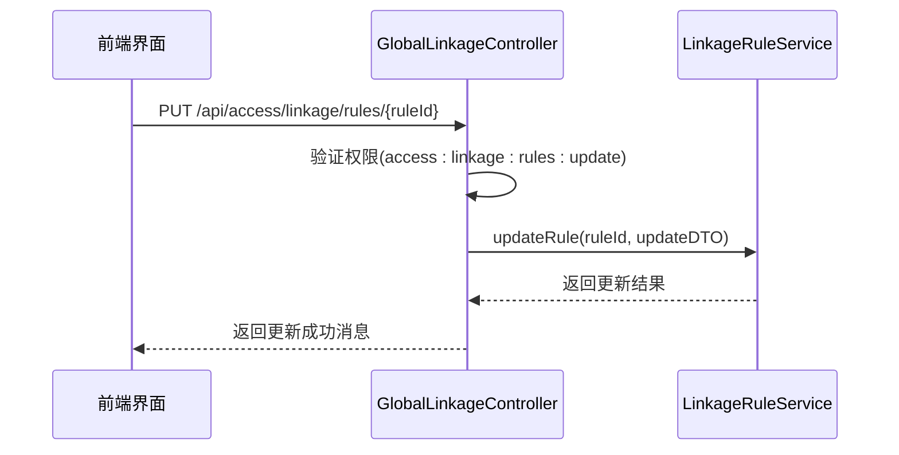
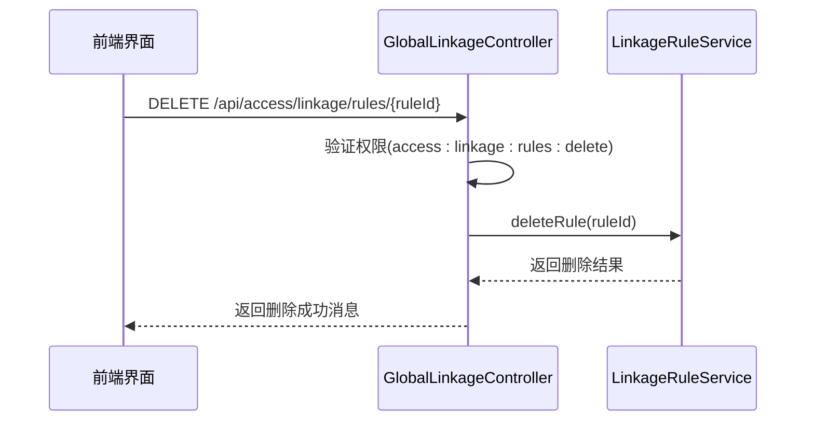
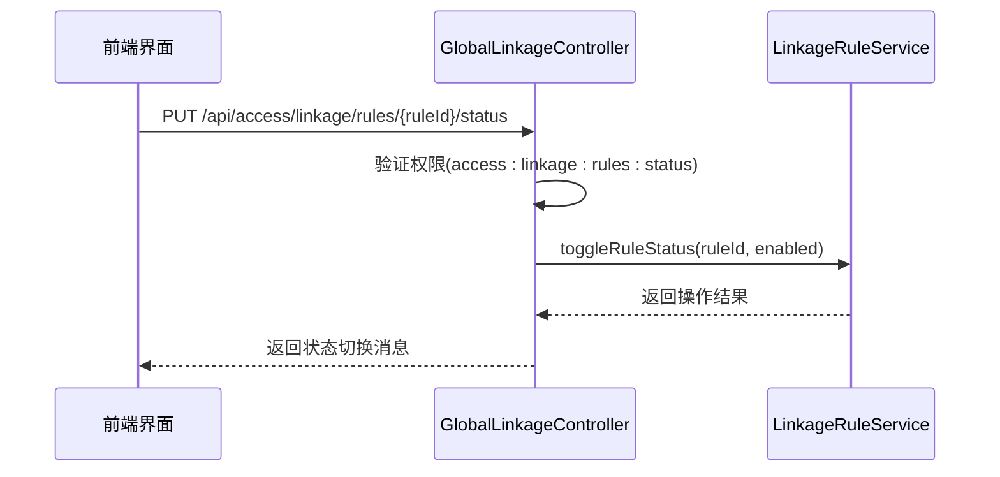
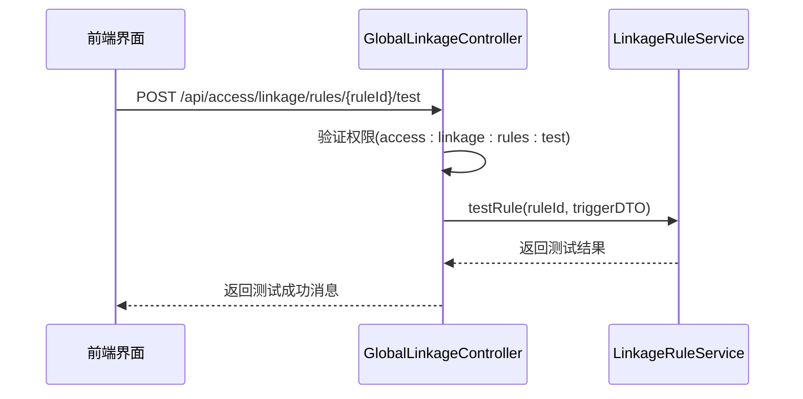
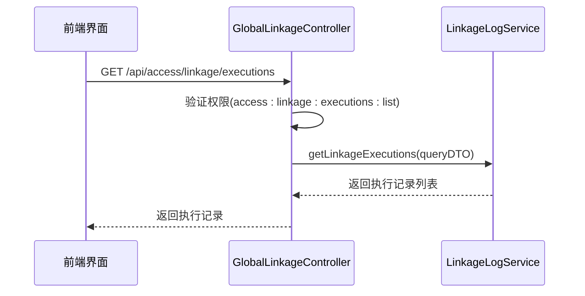

# 联动规则配置

<cite>
**本文档引用文件**  
- [GlobalLinkageController.java](file://restful_refactor_backup_20251202_014224\microservices_ioedream-access-service_src_main_java_net_lab1024_sa_access_advanced_controller_GlobalLinkageController.java)
- [联动配置页面功能布局文档_完善版.md](file://smart-admin-web-javascript\AI开发文档\联动配置页面功能布局文档_完善版.md)
- [global-linkage.js](file://smart-admin-web-javascript\src\store\modules\business\global-linkage.js)
- [功能概述.md](file://documentation\03-业务模块\门禁系统\功能概述.md)
- [12-t_alert_rule.sql](file://database-scripts\common-service\12-t_alert_rule.sql)
- [05-数据库设计与ER图.md](file://documentation\03-业务模块\智能视频\05-数据库设计与ER图.md)
</cite>

## 目录
1. [联动规则概述](#联动规则概述)
2. [触发条件配置](#触发条件配置)
3. [执行动作类型](#执行动作类型)
4. [联动延迟与时间设置](#联动延迟与时间设置)
5. [联动规则管理操作](#联动规则管理操作)
6. [多条件组合配置](#多条件组合配置)
7. [与其他系统集成](#与其他系统集成)
8. [测试验证方法](#测试验证方法)
9. [常见问题解决方案](#常见问题解决方案)

## 联动规则概述

联动规则是智能安防系统中的核心功能，用于在特定事件发生时自动触发一系列预定义的动作。系统通过事件监听机制捕获各种安全事件，并根据配置的联动规则执行相应的响应操作。联动规则支持多种触发条件和执行动作的组合，能够实现复杂的自动化响应策略。

联动规则的核心组件包括触发条件、执行动作、生效时间和关联设备等要素。系统提供了完整的API接口支持联动规则的创建、查询、更新、删除和测试操作，确保规则配置的灵活性和可靠性。

**Section sources**
- [GlobalLinkageController.java](file://restful_refactor_backup_20251202_014224\microservices_ioedream-access-service_src_main_java_net_lab1024_sa_access_advanced_controller_GlobalLinkageController.java)
- [联动配置页面功能布局文档_完善版.md](file://smart-admin-web-javascript\AI开发文档\联动配置页面功能布局文档_完善版.md)

## 触发条件配置

联动规则的触发条件定义了规则激活的条件。系统支持多种类型的触发条件，包括移动侦测、智能分析和设备状态等。触发条件采用树形结构组织，便于用户选择和配置。

### 触发条件类型

触发条件主要分为以下几类：



**Diagram sources**
- [联动配置页面功能布局文档_完善版.md](file://smart-admin-web-javascript\AI开发文档\联动配置页面功能布局文档_完善版.md)

### 触发条件参数

每种触发条件可以配置相应的参数，以精确控制触发行为。例如，区域入侵检测可以设置灵敏度和最小目标尺寸等参数：

```javascript
{
  conditionType: 'intrusion_region',
  conditionName: '区域入侵',
  params: {
    sensitivity: 80,
    minTargetSize: 100,
  }
}
```

系统支持通过API获取可用的触发条件类型，便于前端界面动态展示和选择。

**Section sources**
- [联动配置页面功能布局文档_完善版.md](file://smart-admin-web-javascript\AI开发文档\联动配置页面功能布局文档_完善版.md)
- [global-linkage.js](file://smart-admin-web-javascript\src\store\modules\business\global-linkage.js)

## 执行动作类型

联动规则的执行动作定义了规则触发后需要执行的操作。系统支持多种类型的执行动作，包括视频联动、门禁联动、报警联动等。

### 视频联动动作

视频联动动作主要用于控制视频监控系统的行为：

```mermaid
flowchart TD
A[视频联动] --> B[弹出视频]
A --> C[开始录像]
A --> D[抓拍图片]
B --> B1[显示窗口]
C --> C1[录像时长(秒)]
D --> D1[抓拍次数]
A --> E[关联摄像头]
E --> E1[cam001]
E --> E2[cam002]
E --> E3[cam003]
```

**Diagram sources**
- [联动配置页面功能布局文档_完善版.md](file://smart-admin-web-javascript\AI开发文档\联动配置页面功能布局文档_完善版.md)

### 门禁联动动作

门禁联动动作用于控制门禁系统的行为：



**Diagram sources**
- [联动配置页面功能布局文档_完善版.md](file://smart-admin-web-javascript\AI开发文档\联动配置页面功能布局文档_完善版.md)

### 报警联动动作

报警联动动作用于触发报警系统：



**Diagram sources**
- [联动配置页面功能布局文档_完善版.md](file://smart-admin-web-javascript\AI开发文档\联动配置页面功能布局文档_完善版.md)

### 电梯联动动作

电梯联动动作用于控制电梯系统：



**Diagram sources**
- [联动配置页面功能布局文档_完善版.md](file://smart-admin-web-javascript\AI开发文档\联动配置页面功能布局文档_完善版.md)

### 电视墙联动动作

电视墙联动动作用于控制电视墙显示：

```mermaid
flowchart TD
A[电视墙联动] --> B[电视墙]
A --> C[显示窗口]
A --> D[显示时长(秒)]
B --> B1[电视墙-1]
B --> B2[电视墙-2]
C --> C1[窗口1]
C --> C2[窗口2]
```

**Diagram sources**
- [联动配置页面功能布局文档_完善版.md](file://smart-admin-web-javascript\AI开发文档\联动配置页面功能布局文档_完善版.md)

## 联动延迟与时间设置

联动规则支持灵活的时间设置，包括联动延迟和规则生效时间两个方面。

### 联动延迟设置

联动延迟是指从触发条件满足到执行动作开始之间的时间间隔。系统支持在规则配置中设置延迟时间，以适应不同的应用场景需求。例如，可以设置5秒的延迟时间，避免误触发。

### 规则生效时间

规则生效时间定义了联动规则在什么时间段内有效。系统支持按周设置生效时间，可以精确到具体的时间段：

```javascript
{
  effectiveTime: {
    enabled: true,
    startTime: '00:00:00',
    endTime: '23:59:59',
    weekDays: [1, 2, 3, 4, 5, 6, 7], // 1-7 表示周一到周日
  }
}
```

通过生效时间设置，可以实现不同时间段的不同安全策略，如工作时间与非工作时间的区别对待。

**Section sources**
- [联动配置页面功能布局文档_完善版.md](file://smart-admin-web-javascript\AI开发文档\联动配置页面功能布局文档_完善版.md)

## 联动规则管理操作

系统提供了完整的联动规则管理操作，包括创建、编辑、删除、启用/禁用和测试等功能。

### 创建联动规则

创建联动规则需要提供规则名称、描述、触发条件、执行动作等信息。系统通过API接口接收创建请求：



**Diagram sources**
- [GlobalLinkageController.java](file://restful_refactor_backup_20251202_014224\microservices_ioedream-access-service_src_main_java_net_lab1024_sa_access_advanced_controller_GlobalLinkageController.java)

### 编辑联动规则

编辑联动规则允许修改现有规则的配置。系统通过PUT请求处理编辑操作：



**Diagram sources**
- [GlobalLinkageController.java](file://restful_refactor_backup_20251202_014224\microservices_ioedream-access-service_src_main_java_net_lab1024_sa_access_advanced_controller_GlobalLinkageController.java)

### 删除联动规则

删除联动规则会永久移除指定的规则配置。系统通过DELETE请求处理删除操作：



**Diagram sources**
- [GlobalLinkageController.java](file://restful_refactor_backup_20251202_014224\microservices_ioedream-access-service_src_main_java_net_lab1024_sa_access_advanced_controller_GlobalLinkageController.java)

### 启用/禁用联动规则

启用/禁用操作用于临时控制规则的激活状态，而不删除规则配置：



**Diagram sources**
- [GlobalLinkageController.java](file://restful_refactor_backup_20251202_014224\microservices_ioedream-access-service_src_main_java_net_lab1024_sa_access_advanced_controller_GlobalLinkageController.java)

## 多条件组合配置

系统支持多条件组合触发，允许用户配置复杂的触发逻辑。通过AND（与）和OR（或）逻辑运算符，可以实现灵活的条件组合。

### 条件逻辑配置

联动规则支持两种条件逻辑：

- **AND（与）逻辑**：所有触发条件都必须满足时，规则才会触发
- **OR（或）逻辑**：任意一个触发条件满足时，规则就会触发

```javascript
{
  conditionLogic: 'AND', // AND | OR
  triggerConditions: [
    { value: 'intrusion_region', label: '区域入侵' },
    { value: 'device_offline', label: '设备离线' }
  ]
}
```

### 组合配置示例

以下是一些多条件组合配置的示例：

#### 周界入侵联动规则

```javascript
{
  id: 'link001',
  name: '周界入侵联动',
  description: '检测到移动时触发录像和报警',
  conditionLogic: 'AND',
  triggerConditions: [
    { value: 'intrusion_region', label: '区域入侵' }
  ],
  outputActions: {
    video: {
      enabled: true,
      popupVideo: true,
      startRecording: true,
      captureImage: true,
      recordDuration: 30,
      captureCount: 3,
      devices: ['cam001', 'cam002']
    },
    alarm: {
      enabled: true,
      soundAlarm: true,
      lightAlarm: true,
      pushNotification: true,
      devices: ['alarm001']
    }
  }
}
```

#### 人脸识别联动规则

```javascript
{
  id: 'link002',
  name: '人脸识别联动',
  description: '识别到人脸时抓拍并记录',
  conditionLogic: 'OR',
  triggerConditions: [
    { value: 'stranger', label: '陌生人检测' },
    { value: 'blacklist', label: '黑名单比对' }
  ],
  outputActions: {
    video: {
      enabled: true,
      popupVideo: false,
      startRecording: false,
      captureImage: true,
      recordDuration: 0,
      captureCount: 5,
      devices: ['cam001']
    },
    alarm: {
      enabled: true,
      soundAlarm: false,
      lightAlarm: false,
      pushNotification: true,
      devices: []
    }
  }
}
```

#### 烟雾报警联动规则

```javascript
{
  id: 'link005',
  name: '烟雾报警联动',
  description: '检测到烟雾时触发报警',
  conditionLogic: 'AND',
  triggerConditions: [
    { value: 'smoke_detection', label: '烟雾检测' }
  ],
  outputActions: {
    video: {
      enabled: true,
      popupVideo: true,
      startRecording: true,
      captureImage: true,
      recordDuration: 120,
      captureCount: 10,
      devices: ['cam001', 'cam002', 'cam003']
    },
    elevator: {
      enabled: true,
      action: 'emergency',
      devices: ['elevator001', 'elevator002']
    },
    alarm: {
      enabled: true,
      soundAlarm: true,
      lightAlarm: true,
      pushNotification: true,
      devices: ['alarm001', 'alarm002']
    },
    tvWall: {
      enabled: true,
      wallId: 'wall001',
      windowId: 'window1',
      displayDuration: 120
    }
  }
}
```

**Section sources**
- [联动配置页面功能布局文档_完善版.md](file://smart-admin-web-javascript\AI开发文档\联动配置页面功能布局文档_完善版.md)

## 与其他系统集成

联动规则系统支持与多种安全系统集成，实现跨系统的协同工作。

### 与视频监控系统集成

联动规则与视频监控系统深度集成，支持多种视频联动动作：

- **实时视频弹出**：在监控中心大屏或操作员工作站上弹出相关视频画面
- **自动录像**：触发指定摄像头开始录像，录像时长可配置
- **图片抓拍**：触发指定摄像头进行图片抓拍，抓拍次数可配置
- **云台控制**：联动控制云台摄像头转向指定位置

系统通过标准协议与主流视频监控平台对接，确保兼容性和稳定性。

### 与报警系统集成

联动规则与报警系统集成，实现多层次的报警响应：

- **声音报警**：触发声光报警器发出警报声
- **灯光报警**：触发警示灯闪烁
- **推送通知**：通过短信、邮件、微信、钉钉等方式向相关人员发送报警通知
- **电话报警**：对于紧急情况，可自动拨打预设电话号码

报警系统支持分级报警策略，根据事件严重程度采取不同的报警方式。

### 与门禁系统集成

联动规则与门禁系统集成，实现安全区域的动态控制：

- **自动开门**：在特定条件下自动开启门禁
- **紧急上锁**：在安全事件发生时，自动锁定相关区域的门禁
- **区域封锁**：联动关闭多个门禁点，实现区域隔离
- **权限调整**：临时调整特定人员的门禁权限

门禁集成支持与多种品牌和型号的门禁控制器对接。

### 与电梯系统集成

联动规则与电梯系统集成，实现智能的电梯调度和安全控制：

- **电梯呼叫**：在特定区域触发时自动呼叫电梯
- **电梯停止**：在紧急情况下停止电梯运行
- **紧急模式**：触发电梯进入紧急模式，直接返回安全楼层

电梯集成确保在紧急情况下能够快速疏散人员。

**Section sources**
- [功能概述.md](file://documentation\03-业务模块\门禁系统\功能概述.md)
- [联动配置页面功能布局文档_完善版.md](file://smart-admin-web-javascript\AI开发文档\联动配置页面功能布局文档_完善版.md)

## 测试验证方法

系统提供了完善的联动规则测试验证方法，确保规则配置的正确性和有效性。

### 规则测试功能

系统提供专门的测试接口，用于验证联动规则的配置：



**Diagram sources**
- [GlobalLinkageController.java](file://restful_refactor_backup_20251202_014224\microservices_ioedream-access-service_src_main_java_net_lab1024_sa_access_advanced_controller_GlobalLinkageController.java)

### 测试流程

联动规则测试流程如下：

1. 在前端界面选择要测试的联动规则
2. 系统调用测试接口，传入规则ID和测试触发数据
3. 后端服务模拟规则触发，验证执行动作的配置
4. 返回测试结果，包括预计执行时间和可能的执行动作
5. 前端界面展示测试结果，供用户确认

### 执行历史查询

系统记录所有联动规则的执行历史，便于验证和审计：



**Diagram sources**
- [GlobalLinkageController.java](file://restful_refactor_backup_20251202_014224\microservices_ioedream-access-service_src_main_java_net_lab1024_sa_access_advanced_controller_GlobalLinkageController.java)

## 常见问题解决方案

### 联动不触发

当联动规则不触发时，可按以下步骤排查：

1. **检查规则状态**：确认规则是否已启用
2. **检查触发条件**：确认触发条件是否正确配置，且实际事件符合触发条件
3. **检查生效时间**：确认当前时间是否在规则的生效时间内
4. **检查设备状态**：确认相关设备是否在线且正常工作
5. **查看系统日志**：检查系统日志中是否有相关错误信息

### 执行顺序错误

当联动动作执行顺序不符合预期时：

1. **检查动作配置**：确认各动作的执行顺序是否符合业务需求
2. **检查延迟设置**：确认是否有延迟设置影响了执行顺序
3. **查看执行日志**：通过执行历史记录查看实际的执行顺序和时间

### 权限问题

当无法进行联动规则操作时：

1. **检查用户权限**：确认当前用户是否具有相应的操作权限
2. **检查权限配置**：确认权限配置是否正确，如`access:linkage:rules:create`等
3. **联系管理员**：如权限不足，联系系统管理员申请相应权限

### 配置验证失败

当规则配置验证失败时：

1. **检查必填字段**：确认所有必填字段都已填写
2. **检查数据格式**：确认各字段的数据格式是否正确
3. **使用模板**：参考系统提供的规则模板进行配置
4. **分步配置**：先配置基本的触发条件和动作，再逐步添加复杂配置

**Section sources**
- [GlobalLinkageController.java](file://restful_refactor_backup_20251202_014224\microservices_ioedream-access-service_src_main_java_net_lab1024_sa_access_advanced_controller_GlobalLinkageController.java)
- [联动配置页面功能布局文档_完善版.md](file://smart-admin-web-javascript\AI开发文档\联动配置页面功能布局文档_完善版.md)