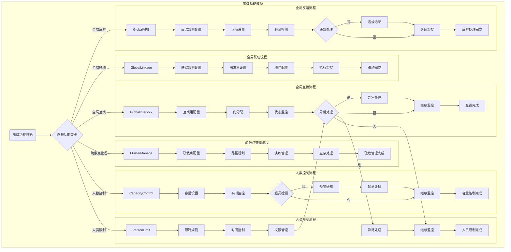
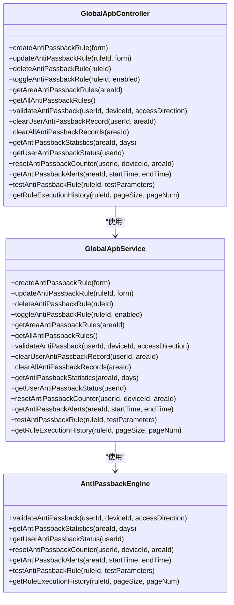
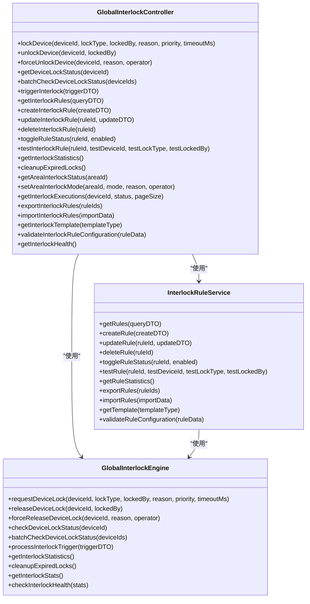
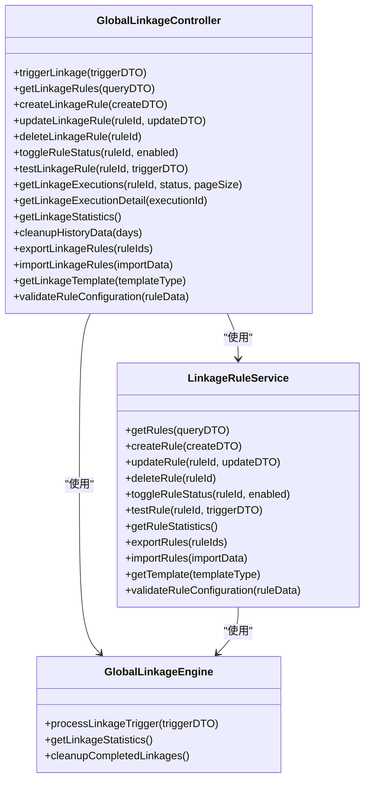
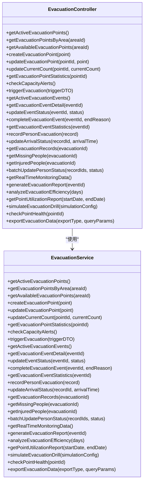
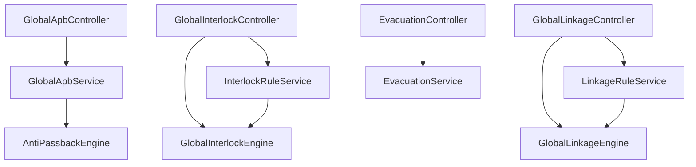

# 门禁规则配置

<cite>
**本文档引用文件**   
- [GlobalApbController.java](file://restful_refactor_backup_20251202_014224/microservices_ioedream-access-service_src_main_java_net_lab1024_sa_access_advanced_controller_GlobalApbController.java)
- [GlobalInterlockController.java](file://restful_refactor_backup_20251202_014224/microservices_ioedream-access-service_src_main_java_net_lab1024_sa_access_advanced_controller_GlobalInterlockController.java)
- [GlobalLinkageController.java](file://restful_refactor_backup_20251202_014224/microservices_ioedream-access-service_src_main_java_net_lab1024_sa_access_advanced_controller_GlobalLinkageController.java)
- [EvacuationController.java](file://restful_refactor_backup_20251202_014224/microservices_ioedream-access-service_src_main_java_net_lab1024_sa_access_advanced_controller_EvacuationController.java)
- [spec.md](file://openspec/changes/archive/completed-proposals/implement-access-control-missing-functions/specs/advanced-features-implementation/spec.md)
- [design.md](file://openspec/changes/archive/completed-proposals/implement-access-control-missing-functions/design.md)
- [08-高级功能模块流程图.md](file://documentation/03-业务模块/各业务模块文档/门禁/08-高级功能模块流程图.md)
- [ENTITY_MERGE_DIFF_REPORT.md](file://documentation/archive/reports-2025-12-04/ENTITY_MERGE_DIFF_REPORT.md)
</cite>

## 目录
1. [引言](#引言)
2. [项目结构](#项目结构)
3. [核心组件](#核心组件)
4. [架构概述](#架构概述)
5. [详细组件分析](#详细组件分析)
6. [依赖分析](#依赖分析)
7. [性能考虑](#性能考虑)
8. [故障排查指南](#故障排查指南)
9. [结论](#结论)

## 引言
本文档详细介绍了门禁系统中高级规则的配置方法和业务逻辑，包括APB反潜回、互锁、联动和紧急疏散等规则。文档涵盖了规则的启用条件、执行流程、优先级处理机制以及最佳实践和配置示例。同时，解释了规则与设备、区域的关联方式，规则变更后的生效机制，以及规则冲突检测和故障排查指南。

## 项目结构
门禁系统的高级功能模块位于`ioedream-access-service`微服务中，主要包含控制器、服务、管理器、引擎和领域实体等组件。高级功能模块的结构如下：
```
advanced/
├── controller/
│   ├── GlobalApbController        # 全局反潜控制器
│   ├── GlobalLinkageController    # 全局联动控制器
│   └── EmergencyController        # 应急控制器
├── service/
│   ├── GlobalApbService           # 全局反潜服务
│   ├── GlobalLinkageService       # 全局联动服务
│   └── EmergencyService           # 应急服务
├── manager/
│   ├── RuleEngineManager          # 规则引擎管理器
│   ├── DeviceLinkageManager       # 设备联动管理器
│   └── EmergencyManager           # 应急管理器
├── engine/
│   ├── AntiPassbackEngine         # 反潜引擎
│   ├── LinkageEngine              # 联动引擎
│   └── EmergencyEngine            # 应急引擎
└── domain/
    ├── entity/
    │   ├── AntiPassbackRuleEntity # 反潜规则实体
    │   ├── LinkageRuleEntity      # 联动规则实体
    │   └── EmergencyPlanEntity    # 应急预案实体
    └── vo/
        ├── RuleConfigVO           # 规则配置视图
        └── EmergencyStatusVO      # 应急状态视图
```

**文档来源**
- [design.md](file://openspec/changes/archive/completed-proposals/implement-access-control-missing-functions/design.md#L109-L137)

## 核心组件
门禁系统的高级功能模块由多个核心组件构成，包括全局反潜、全局联动、全局互锁和紧急疏散等。这些组件通过控制器、服务、管理器和引擎协同工作，实现复杂的门禁规则配置和管理。

**文档来源**
- [design.md](file://openspec/changes/archive/completed-proposals/implement-access-control-missing-functions/design.md#L109-L137)

## 架构概述
门禁系统的高级功能模块采用分层架构设计，包括控制器层、服务层、管理器层和引擎层。控制器层负责接收和处理HTTP请求，服务层负责业务逻辑处理，管理器层负责数据访问和管理，引擎层负责规则的执行和监控。



**图表来源**
- [08-高级功能模块流程图.md](file://documentation/03-业务模块/各业务模块文档/门禁/08-高级功能模块流程图.md#L5-L77)

## 详细组件分析
### 全局反潜分析
全局反潜功能通过`GlobalApbController`和`GlobalApbService`实现，支持反潜规则的创建、更新、删除和启用/禁用。反潜规则的验证和执行由`AntiPassbackEngine`引擎负责。

#### 全局反潜类图


**图表来源**
- [GlobalApbController.java](file://restful_refactor_backup_20251202_014224/microservices_ioedream-access-service_src_main_java_net_lab1024_sa_access_advanced_controller_GlobalApbController.java#L26-L288)

### 全局互锁分析
全局互锁功能通过`GlobalInterlockController`和`InterlockRuleService`实现，支持互锁规则的创建、更新、删除和启用/禁用。互锁规则的执行和监控由`GlobalInterlockEngine`引擎负责。

#### 全局互锁类图


**图表来源**
- [GlobalInterlockController.java](file://restful_refactor_backup_20251202_014224/microservices_ioedream-access-service_src_main_java_net_lab1024_sa_access_advanced_controller_GlobalInterlockController.java#L30-L683)

### 全局联动分析
全局联动功能通过`GlobalLinkageController`和`LinkageRuleService`实现，支持联动规则的创建、更新、删除和启用/禁用。联动规则的执行和监控由`GlobalLinkageEngine`引擎负责。

#### 全局联动类图


**图表来源**
- [GlobalLinkageController.java](file://restful_refactor_backup_20251202_014224/microservices_ioedream-access-service_src_main_java_net_lab1024_sa_access_advanced_controller_GlobalLinkageController.java#L31-L424)

### 紧急疏散分析
紧急疏散功能通过`EvacuationController`和`EvacuationService`实现，支持疏散点的管理、疏散事件的触发和人员疏散的追踪。疏散点的健康状态和利用率由`EvacuationService`负责监控。

#### 紧急疏散类图


**图表来源**
- [EvacuationController.java](file://restful_refactor_backup_20251202_014224/microservices_ioedream-access-service_src_main_java_net_lab1024_sa_access_advanced_controller_EvacuationController.java#L27-L273)

## 依赖分析
门禁系统的高级功能模块依赖于多个组件，包括控制器、服务、管理器和引擎。这些组件通过依赖注入的方式协同工作，确保系统的稳定性和可维护性。



**图表来源**
- [design.md](file://openspec/changes/archive/completed-proposals/implement-access-control-missing-functions/design.md#L109-L137)

## 性能考虑
门禁系统的高级功能模块在设计时考虑了性能要求，确保反潜检测响应时间 ≤ 1秒，联动执行响应时间 ≤ 2秒，互锁状态更新时间 ≤ 500毫秒，人数统计延迟 ≤ 3秒。此外，高级功能模块的可用性 ≥ 99.95%，规则引擎执行成功率 ≥ 99.99%，应急处理响应时间 ≤ 5秒，系统故障恢复时间 ≤ 30秒。

**文档来源**
- [spec.md](file://openspec/changes/archive/completed-proposals/implement-access-control-missing-functions/specs/advanced-features-implementation/spec.md#L166-L175)

## 故障排查指南
在配置和使用门禁系统的高级功能时，可能会遇到一些常见问题。以下是一些故障排查指南：

1. **反潜规则不生效**：检查反潜规则的配置是否正确，确保规则的启用状态为启用。
2. **联动规则执行失败**：检查联动规则的触发条件和动作配置是否正确，确保触发器和动作的设备ID匹配。
3. **互锁状态更新延迟**：检查互锁引擎的性能，确保互锁状态更新时间 ≤ 500毫秒。
4. **疏散点容量超限**：检查疏散点的容量设置，确保容量设置合理，避免超员检测频繁触发。

**文档来源**
- [spec.md](file://openspec/changes/archive/completed-proposals/implement-access-control-missing-functions/specs/advanced-features-implementation/spec.md#L166-L175)

## 结论
本文档详细介绍了门禁系统中高级规则的配置方法和业务逻辑，包括APB反潜回、互锁、联动和紧急疏散等规则。通过详细的组件分析和图表展示，帮助用户理解和配置这些高级功能。同时，提供了性能考虑和故障排查指南，确保系统的稳定性和可维护性。