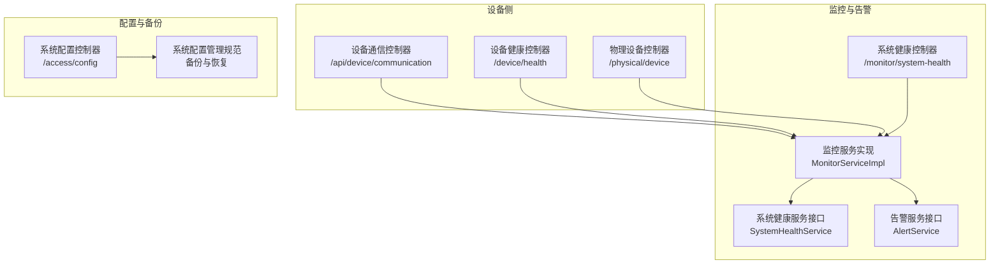
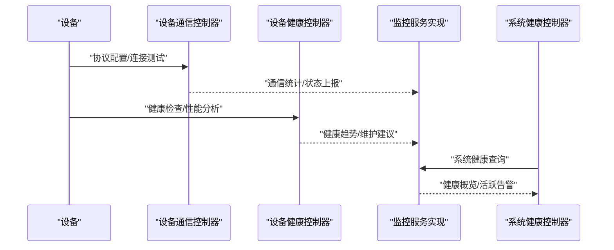
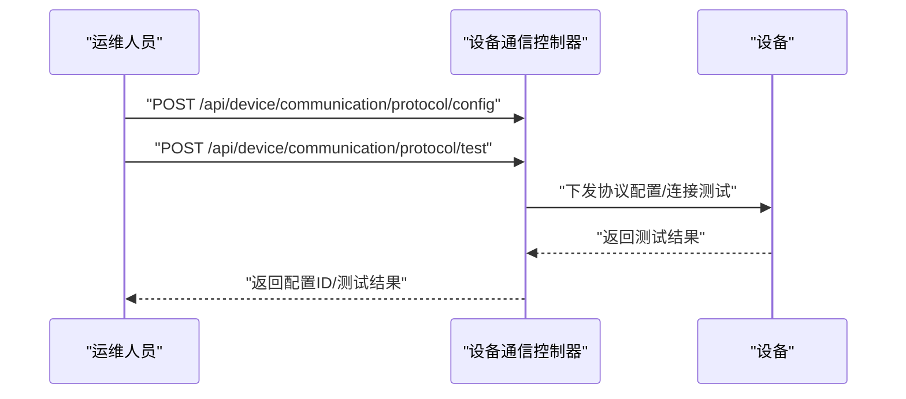
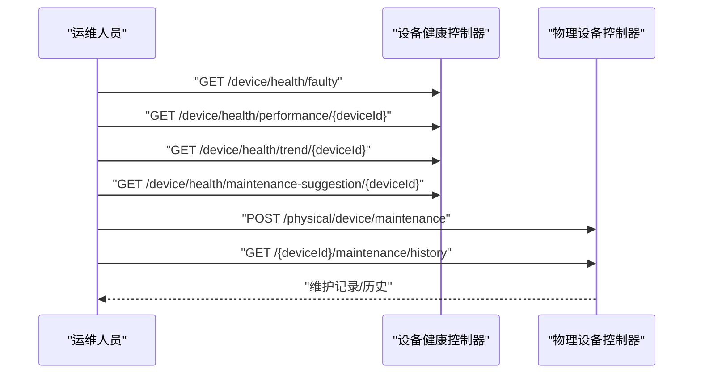
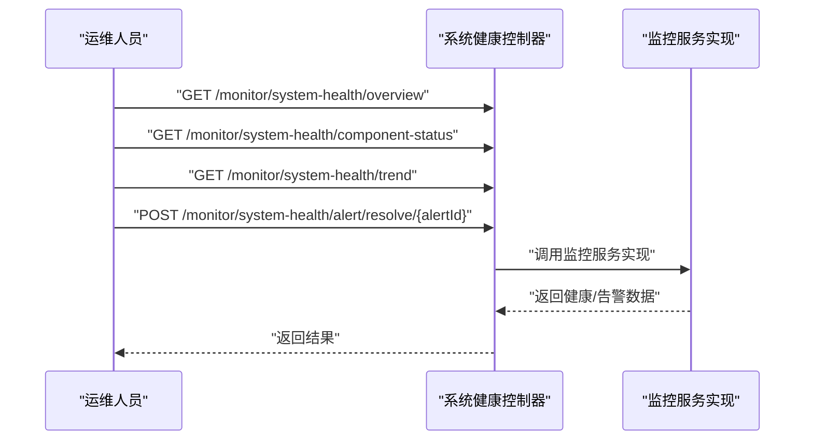
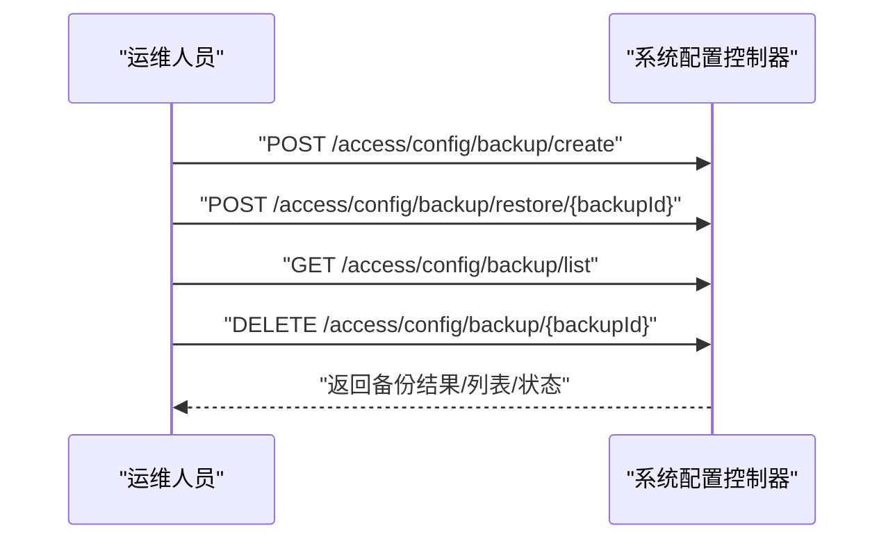
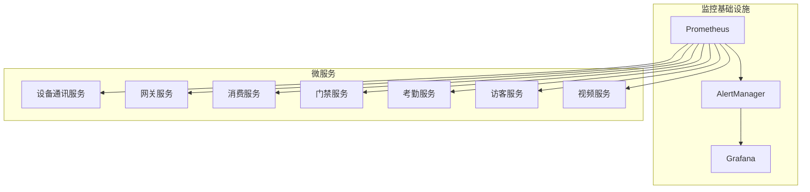

# 故障诊断与维护

<cite>
**本文引用的文件**
- [故障排查指南.md](file://documentation/guide/TROUBLESHOOTING_GUIDE.md)
- [故障排查手册.md](file://docs/SmartAdmin规范体系_v4/04-知识管理层/故障排查手册.md)
- [设备管理模块部署文档.md](file://documentation/04-部署运维/DEVICE_MANAGEMENT_DEPLOYMENT.md)
- [实时环境实战部署手册.md](file://documentation/04-部署运维/REAL_ENV_SETUP.md)
- [设备通信控制器.java](file://restful_refactor_backup_20251202_014224/microservices_ioedream-device-service_src_main_java_net_lab1024_sa_device_controller_DeviceCommunicationController.java)
- [设备健康控制器.java](file://restful_refactor_backup_20251202_014224/microservices_ioedream-device-service_src_main_java_net_lab1024_sa_device_controller_DeviceHealthController.java)
- [智能设备控制器.java](file://restful_refactor_backup_20251202_014224/microservices_ioedream-device-service_src_main_java_net_lab1024_sa_device_controller_SmartDeviceController.java)
- [物理设备控制器.java](file://restful_refactor_backup_20251202_014224/microservices_ioedream-device-service_src_main_java_net_lab1024_sa_device_controller_PhysicalDeviceController.java)
- [门禁设备服务.java](file://restful_refactor_backup_20251202_014224/openspec/changes/seven-microservice-architecture-integration/specs/device-communication-service/spec.md)
- [监控服务实现.java](file://microservices/microservices-common/src/main/java/net/lab1024/sa/common/monitor/service/impl/MonitorServiceImpl.java)
- [系统健康服务.java](file://microservices/microservices-common/src/main/java/net/lab1024/sa/common/monitor/service/SystemHealthService.java)
- [系统健康控制器.java](file://restful_refactor_backup_20251202_014224/microservices_ioedream-monitor-service_src_main_java_net_lab1024_sa_monitor_controller_SystemHealthController.java)
- [告警服务.java](file://microservices/microservices-common/src/main/java/net/lab1024/sa/common/monitor/service/AlertService.java)
- [监控容器编排.yml](file://deployment/monitoring/docker-compose-monitoring.yml)
- [Prometheus配置.yml](file://deployment/monitoring/prometheus/prometheus.yml)
- [设备管理模块重构设计.md](file://documentation/03-业务模块/消费/14-设备管理模块重构设计.md)
- [系统配置管理规范.md](file://openspec/changes/archive/completed-proposals/implement-access-control-missing-functions/specs/system-configuration-management/spec.md)
- [系统配置控制器.java](file://restful_refactor_backup_20251202_014224/restful_refactor_backup_20251202_014224/microservices_ioedream-access-service_src_main_java_net_lab1024_sa_access_config_controller_SystemConfigController.java)
</cite>

## 目录
1. [简介](#简介)
2. [项目结构](#项目结构)
3. [核心组件](#核心组件)
4. [架构总览](#架构总览)
5. [详细组件分析](#详细组件分析)
6. [依赖分析](#依赖分析)
7. [性能考虑](#性能考虑)
8. [故障排查指南](#故障排查指南)
9. [结论](#结论)
10. [附录](#附录)

## 简介
本文件面向设备运维与平台维护人员，提供系统化的设备故障诊断与维护指南。内容涵盖网络连接问题、认证失败、命令无响应等常见故障的诊断流程；通过日志分析、监控指标与设备状态码定位问题根因；描述设备固件升级流程与回滚机制、配置备份与恢复方案，并给出预防性维护建议（定期检查设备状态、固件版本更新、网络环境优化）。

## 项目结构
围绕“设备”“通信”“监控”“配置”四大主题，本项目在微服务架构下提供端到端的设备生命周期管理能力：
- 设备通信与协议配置：设备通信控制器提供协议配置、连接测试、通信状态与统计等接口。
- 设备健康与维护：设备健康控制器提供故障设备查询、性能分析、趋势与维护建议；物理设备控制器提供维护记录与历史查询。
- 系统健康与告警：监控服务与控制器提供系统健康概览、组件健康、活跃告警、健康趋势与告警解决。
- 配置与备份：系统配置控制器提供备份创建、恢复、列表与删除；系统配置管理规范定义了备份策略、恢复流程与安全要求。

图表来源
- [设备通信控制器.java](file://restful_refactor_backup_20251202_014224/microservices_ioedream-device-service_src_main_java_net_lab1024_sa_device_controller_DeviceCommunicationController.java#L1-L193)
- [设备健康控制器.java](file://restful_refactor_backup_20251202_014224/microservices_ioedream-device-service_src_main_java_net_lab1024_sa_device_controller_DeviceHealthController.java#L1-L169)
- [物理设备控制器.java](file://restful_refactor_backup_20251202_014224/microservices_ioedream-device-service_src_main_java_net_lab1024_sa_device_controller_PhysicalDeviceController.java#L228-L251)
- [监控服务实现.java](file://microservices/microservices-common/src/main/java/net/lab1024/sa/common/monitor/service/impl/MonitorServiceImpl.java#L34-L81)
- [系统健康服务.java](file://microservices/microservices-common/src/main/java/net/lab1024/sa/common/monitor/service/SystemHealthService.java#L56-L110)
- [系统健康控制器.java](file://restful_refactor_backup_20251202_014224/microservices_ioedream-monitor-service_src_main_java_net/lab1024/sa/monitor/controller/SystemHealthController.java#L165-L182)
- [告警服务.java](file://microservices/microservices-common/src/main/java/net/lab1024/sa/common/monitor/service/AlertService.java#L102-L133)
- [系统配置控制器.java](file://restful_refactor_backup_20251202_014224/microservices_ioedream-access-service_src_main_java_net_lab1024_sa_access_config_controller_SystemConfigController.java#L215-L257)
- [系统配置管理规范.md](file://openspec/changes/archive/completed-proposals/implement-access-control-missing-functions/specs/system-configuration-management/spec.md#L95-L209)

章节来源
- [设备通信控制器.java](file://restful_refactor_backup_20251202_014224/microservices_ioedream-device-service_src_main_java_net_lab1024_sa_device_controller_DeviceCommunicationController.java#L1-L193)
- [设备健康控制器.java](file://restful_refactor_backup_20251202_014224/microservices_ioedream-device-service_src_main_java_net_lab1024_sa_device_controller_DeviceHealthController.java#L1-L169)
- [物理设备控制器.java](file://restful_refactor_backup_20251202_014224/microservices_ioedream-device-service_src_main_java_net_lab1024_sa_device_controller_PhysicalDeviceController.java#L228-L251)
- [监控服务实现.java](file://microservices/microservices-common/src/main/java/net/lab1024/sa/common/monitor/service/impl/MonitorServiceImpl.java#L34-L81)
- [系统健康服务.java](file://microservices/microservices-common/src/main/java/net/lab1024/sa/common/monitor/service/SystemHealthService.java#L56-L110)
- [系统健康控制器.java](file://restful_refactor_backup_20251202_014224/microservices_ioedream-monitor-service_src_main_java_net_lab1024_sa_monitor_controller_SystemHealthController.java#L165-L182)
- [告警服务.java](file://microservices/microservices-common/src/main/java/net/lab1024/sa/common/monitor/service/AlertService.java#L102-L133)
- [系统配置控制器.java](file://restful_refactor_backup_20251202_014224/microservices_ioedream-access-service_src_main_java_net_lab1024_sa_access_config_controller_SystemConfigController.java#L215-L257)
- [系统配置管理规范.md](file://openspec/changes/archive/completed-proposals/implement-access-control-missing-functions/specs/system-configuration-management/spec.md#L95-L209)

## 核心组件
- 设备通信与协议配置
  - 提供协议配置、连接测试、通信状态与统计接口，支撑设备接入与连通性验证。
- 设备健康与维护
  - 提供故障设备查询、性能分析、健康趋势与维护建议；支持维护记录与历史查询。
- 系统健康与告警
  - 提供系统健康概览、组件健康、活跃告警、健康趋势与告警解决接口。
- 配置与备份
  - 提供备份创建、恢复、列表与删除接口；规范定义备份策略、恢复流程与安全要求。

章节来源
- [设备通信控制器.java](file://restful_refactor_backup_20251202_014224/microservices_ioedream-device-service_src_main_java_net_lab1024_sa_device_controller_DeviceCommunicationController.java#L1-L193)
- [设备健康控制器.java](file://restful_refactor_backup_20251202_014224/microservices_ioedream-device-service_src_main_java_net_lab1024_sa_device_controller_DeviceHealthController.java#L1-L169)
- [物理设备控制器.java](file://restful_refactor_backup_20251202_014224/microservices_ioedream-device-service_src_main_java_net_lab1024_sa_device_controller_PhysicalDeviceController.java#L228-L251)
- [监控服务实现.java](file://microservices/microservices-common/src/main/java/net/lab1024/sa/common/monitor/service/impl/MonitorServiceImpl.java#L34-L81)
- [系统健康服务.java](file://microservices/microservices-common/src/main/java/net/lab1024/sa/common/monitor/service/SystemHealthService.java#L56-L110)
- [系统健康控制器.java](file://restful_refactor_backup_20251202_014224/microservices_ioedream-monitor-service_src_main_java_net_lab1024_sa_monitor_controller_SystemHealthController.java#L165-L182)
- [告警服务.java](file://microservices/microservices-common/src/main/java/net/lab1024/sa/common/monitor/service/AlertService.java#L102-L133)
- [系统配置控制器.java](file://restful_refactor_backup_20251202_014224/microservices_ioedream-access-service_src_main_java_net_lab1024_sa_access_config_controller_SystemConfigController.java#L215-L257)
- [系统配置管理规范.md](file://openspec/changes/archive/completed-proposals/implement-access-control-missing-functions/specs/system-configuration-management/spec.md#L95-L209)

## 架构总览
设备侧通过通信控制器与健康控制器对接监控与配置模块；监控服务聚合系统健康与告警，形成统一的运维视图。

图表来源
- [设备通信控制器.java](file://restful_refactor_backup_20251202_014224/microservices_ioedream-device-service_src_main_java_net_lab1024_sa_device_controller_DeviceCommunicationController.java#L1-L193)
- [设备健康控制器.java](file://restful_refactor_backup_20251202_014224/microservices_ioedream-device-service_src_main_java_net_lab1024_sa_device_controller_DeviceHealthController.java#L1-L169)
- [监控服务实现.java](file://microservices/microservices-common/src/main/java/net/lab1024/sa/common/monitor/service/impl/MonitorServiceImpl.java#L34-L81)
- [系统健康控制器.java](file://restful_refactor_backup_20251202_014224/microservices_ioedream-monitor-service_src_main_java_net_lab1024_sa_monitor_controller_SystemHealthController.java#L165-L182)

## 详细组件分析

### 设备通信与协议配置
- 关键能力
  - 协议配置：为设备配置通信协议参数。
  - 连接测试：测试设备协议连接是否正常。
  - 通信状态：获取设备通信状态（连接、丢包、延迟等）。
  - 通信统计：获取设备通信的整体统计信息。
- 诊断要点
  - 使用“连接测试”接口验证协议参数与网络可达性。
  - 结合“通信状态”与“通信统计”判断链路质量与异常时段。
  - 若测试失败，优先检查设备IP、端口、协议类型与网络连通性。

图表来源
- [设备通信控制器.java](file://restful_refactor_backup_20251202_014224/microservices_ioedream-device-service_src_main_java_net_lab1024_sa_device_controller_DeviceCommunicationController.java#L1-L193)

章节来源
- [设备通信控制器.java](file://restful_refactor_backup_20251202_014224/microservices_ioedream-device-service_src_main_java_net_lab1024_sa_device_controller_DeviceCommunicationController.java#L1-L193)

### 设备健康与维护
- 关键能力
  - 故障设备查询：按健康等级与类型筛选故障设备。
  - 性能分析：对指定设备进行性能指标分析与趋势展示。
  - 健康趋势：获取设备健康状态变化趋势。
  - 维护建议：基于健康状态提供设备维护建议。
  - 维护记录：记录设备维护操作与历史。
- 诊断要点
  - 使用“故障设备查询”定位异常设备。
  - 使用“性能分析/健康趋势”识别异常波动与潜在风险。
  - 使用“维护建议”指导现场处置；使用“维护历史”追溯处理过程。

图表来源
- [设备健康控制器.java](file://restful_refactor_backup_20251202_014224/microservices_ioedream-device-service_src_main_java_net_lab1024_sa_device_controller_DeviceHealthController.java#L93-L169)
- [物理设备控制器.java](file://restful_refactor_backup_20251202_014224/microservices_ioedream-device-service_src_main_java_net_lab1024_sa_device_controller_PhysicalDeviceController.java#L228-L251)

章节来源
- [设备健康控制器.java](file://restful_refactor_backup_20251202_014224/microservices_ioedream-device-service_src_main_java_net_lab1024_sa_device_controller_DeviceHealthController.java#L93-L169)
- [物理设备控制器.java](file://restful_refactor_backup_20251202_014224/microservices_ioedream-device-service_src_main_java_net_lab1024_sa_device_controller_PhysicalDeviceController.java#L228-L251)

### 系统健康与告警
- 关键能力
  - 系统健康概览：聚合微服务状态、活跃告警、运行时间与健康评分。
  - 组件健康：获取各组件健康状态。
  - 健康趋势：获取系统健康趋势数据。
  - 告警解决：手动标记告警为已解决。
  - 告警趋势：获取告警趋势数据。
- 诊断要点
  - 通过“系统健康概览”快速掌握整体健康状况。
  - 通过“组件健康”定位具体服务异常。
  - 通过“健康趋势/告警趋势”识别异常上升与恢复过程。
  - 使用“告警解决”闭环处理流程。

图表来源
- [系统健康控制器.java](file://restful_refactor_backup_20251202_014224/microservices_ioedream-monitor-service_src_main_java_net_lab1024_sa_monitor_controller_SystemHealthController.java#L165-L182)
- [监控服务实现.java](file://microservices/microservices-common/src/main/java/net/lab1024/sa/common/monitor/service/impl/MonitorServiceImpl.java#L34-L81)
- [系统健康服务.java](file://microservices/microservices-common/src/main/java/net/lab1024/sa/common/monitor/service/SystemHealthService.java#L56-L110)
- [告警服务.java](file://microservices/microservices-common/src/main/java/net/lab1024/sa/common/monitor/service/AlertService.java#L102-L133)

章节来源
- [系统健康控制器.java](file://restful_refactor_backup_20251202_014224/microservices_ioedream-monitor-service_src_main_java_net_lab1024_sa_monitor_controller_SystemHealthController.java#L165-L182)
- [监控服务实现.java](file://microservices/microservices-common/src/main/java/net/lab1024/sa/common/monitor/service/impl/MonitorServiceImpl.java#L34-L81)
- [系统健康服务.java](file://microservices/microservices-common/src/main/java/net/lab1024/sa/common/monitor/service/SystemHealthService.java#L56-L110)
- [告警服务.java](file://microservices/microservices-common/src/main/java/net/lab1024/sa/common/monitor/service/AlertService.java#L102-L133)

### 配置与备份
- 关键能力
  - 备份创建：按类型与描述创建系统备份。
  - 备份恢复：根据备份ID恢复系统。
  - 备份列表：查询备份列表。
  - 备份删除：删除指定备份。
- 诊断要点
  - 在升级或重大变更前先创建备份。
  - 恢复时先验证备份完整性，再执行恢复。
  - 恢复失败时按规范进行回滚与审计。

图表来源
- [系统配置控制器.java](file://restful_refactor_backup_20251202_014224/microservices_ioedream-access-service_src_main_java_net_lab1024_sa_access_config_controller_SystemConfigController.java#L215-L257)

章节来源
- [系统配置控制器.java](file://restful_refactor_backup_20251202_014224/microservices_ioedream-access-service_src_main_java_net_lab1024_sa_access_config_controller_SystemConfigController.java#L215-L257)
- [系统配置管理规范.md](file://openspec/changes/archive/completed-proposals/implement-access-control-missing-functions/specs/system-configuration-management/spec.md#L95-L209)

## 依赖分析
- 设备通信服务
  - 依赖独立数据库存储设备基础信息、连接状态与协议配置。
  - 通过连接池管理实现连接复用、负载均衡与故障转移。
- 监控与告警
  - Prometheus抓取各微服务的Prometheus指标端点。
  - AlertManager负责告警聚合与通知路由。
  - Grafana用于可视化展示系统与设备健康状态。

图表来源
- [Prometheus配置.yml](file://deployment/monitoring/prometheus/prometheus.yml#L1-L99)
- [监控容器编排.yml](file://deployment/monitoring/docker-compose-monitoring.yml#L1-L109)

章节来源
- [Prometheus配置.yml](file://deployment/monitoring/prometheus/prometheus.yml#L1-L99)
- [监控容器编排.yml](file://deployment/monitoring/docker-compose-monitoring.yml#L1-L109)

## 性能考虑
- 设备通信
  - 使用连接池管理连接复用与负载均衡，避免频繁建立连接。
  - 对协议配置与连接测试进行异步化与超时控制，减少阻塞。
- 系统健康
  - 通过健康趋势与告警趋势识别性能瓶颈与异常波动。
  - 合理设置Prometheus抓取间隔与保留策略，平衡可观测性与资源消耗。
- 配置与备份
  - 备份文件压缩与加密，降低存储与传输成本。
  - 恢复前进行完整性校验，避免恢复失败带来的二次影响。

[本节为通用指导，不直接分析具体文件]

## 故障排查指南

### 网络连接问题
- 现象
  - 设备离线、心跳丢失、通信失败。
- 诊断流程
  1) 使用“连接测试”接口验证协议参数与网络可达性。
  2) 通过“通信状态/统计”观察连接状态、丢包率与延迟。
  3) 使用“设备健康-健康趋势”识别异常时段与恢复过程。
  4) 结合监控系统（Prometheus/Grafana）查看服务端口、连接池与系统资源。
- 处置建议
  - 优先检查设备IP、端口、协议类型与网络连通性。
  - 优化连接池参数，启用连接复用与故障转移。
  - 对异常时段进行专项排查与容量评估。

章节来源
- [设备通信控制器.java](file://restful_refactor_backup_20251202_014224/microservices_ioedream-device-service_src_main_java_net_lab1024_sa_device_controller_DeviceCommunicationController.java#L1-L193)
- [设备健康控制器.java](file://restful_refactor_backup_20251202_014224/microservices_ioedream-device-service_src_main_java_net_lab1024_sa_device_controller_DeviceHealthController.java#L1-L169)
- [监控容器编排.yml](file://deployment/monitoring/docker-compose-monitoring.yml#L1-L109)
- [Prometheus配置.yml](file://deployment/monitoring/prometheus/prometheus.yml#L1-L99)

### 认证失败
- 现象
  - 登录失败、Token验证失败、权限验证失败。
- 诊断流程
  1) 检查用户账号状态与权限配置。
  2) 验证Token生成与校验逻辑。
  3) 查看认证日志与系统健康概览中的异常告警。
- 处置建议
  - 激活用户账号、修复密码加密逻辑、完善权限设置。
  - 对认证服务进行健康检查与容量评估。

章节来源
- [故障排查指南.md](file://documentation/guide/TROUBLESHOOTING_GUIDE.md#L1-L644)
- [系统健康控制器.java](file://restful_refactor_backup_20251202_014224/microservices_ioedream-monitor-service_src_main_java_net_lab1024_sa_monitor_controller_SystemHealthController.java#L165-L182)

### 命令无响应
- 现象
  - 下发指令后设备无响应、状态未更新。
- 诊断流程
  1) 使用“连接测试”验证协议连接。
  2) 通过“通信状态/统计”判断链路质量。
  3) 使用“设备健康-性能分析/趋势”识别异常波动。
  4) 检查设备状态码与日志，定位指令下发与设备处理环节。
- 处置建议
  1) 修正协议参数与网络配置。
  2) 优化指令下发与重试策略。
  3) 对异常设备进行隔离与替换。

章节来源
- [设备通信控制器.java](file://restful_refactor_backup_20251202_014224/microservices_ioedream-device-service_src_main_java_net_lab1024_sa_device_controller_DeviceCommunicationController.java#L1-L193)
- [设备健康控制器.java](file://restful_refactor_backup_20251202_014224/microservices_ioedream-device-service_src_main_java_net_lab1024_sa_device_controller_DeviceHealthController.java#L1-L169)

### 日志分析
- 日志级别与格式
  - 使用ERROR/WARN/INFO/DEBUG/TRACE区分问题严重程度与调试需求。
  - 标准日志格式包含时间、级别、线程、类名与消息。
- 查询技巧
  - 使用grep过滤ERROR级别与特定服务日志。
  - 按业务关键词与用户ID检索日志。
  - 指定时间范围截取日志片段。
- 工具推荐
  - ELK Stack、Grafana Loki、Splunk等日志分析平台。

章节来源
- [故障排查指南.md](file://documentation/guide/TROUBLESHOOTING_GUIDE.md#L1-L644)

### 监控指标与设备状态码
- 指标采集
  - Prometheus抓取各微服务的Prometheus指标端点。
  - Grafana可视化展示系统与设备健康状态。
- 设备状态码
  - 在设备健康控制器中，设备状态码用于标识设备健康等级与故障类型，结合“故障设备查询/健康趋势”进行定位。

章节来源
- [Prometheus配置.yml](file://deployment/monitoring/prometheus/prometheus.yml#L1-L99)
- [监控容器编排.yml](file://deployment/monitoring/docker-compose-monitoring.yml#L1-L109)
- [设备健康控制器.java](file://restful_refactor_backup_20251202_014224/microservices_ioedream-device-service_src_main_java_net_lab1024_sa_device_controller_DeviceHealthController.java#L93-L169)

### 设备固件升级流程与回滚机制
- 升级流程
  - 通过“设备配置下发流程”生成配置包，进行加密与校验，选择立即/定时/批量下发方式。
  - 设备接收后校验通过即应用配置，上报状态并更新下发记录。
- 回滚机制
  - 当升级失败或出现兼容性问题时，依据备份策略进行回滚。
  - 回滚前进行完整性校验，回滚后记录审计与通知。

章节来源
- [设备管理模块重构设计.md](file://documentation/03-业务模块/消费/14-设备管理模块重构设计.md#L136-L178)
- [系统配置管理规范.md](file://openspec/changes/archive/completed-proposals/implement-access-control-missing-functions/specs/system-configuration-management/spec.md#L95-L209)

### 设备配置备份与恢复
- 备份策略
  - 支持全量/增量/差异备份策略，定时自动与手动立即备份。
  - 备份文件压缩与加密，保留策略配置。
- 恢复流程
  - 选择恢复时间点与范围，恢复前验证备份文件完整性。
  - 恢复过程中提供详细进度信息，失败时回滚操作并记录审计。

章节来源
- [系统配置管理规范.md](file://openspec/changes/archive/completed-proposals/implement-access-control-missing-functions/specs/system-configuration-management/spec.md#L95-L209)
- [系统配置控制器.java](file://restful_refactor_backup_20251202_014224/microservices_ioedream-access-service_src_main_java_net_lab1024_sa_access_config_controller_SystemConfigController.java#L215-L257)

### 预防性维护建议
- 定期检查设备状态
  - 使用“设备健康-健康趋势/维护建议”进行周期性巡检。
- 固件版本更新
  - 在升级窗口内执行升级，升级前后进行备份与回归测试。
- 网络环境优化
  - 优化连接池参数，启用连接复用与故障转移，提升链路稳定性。

章节来源
- [设备健康控制器.java](file://restful_refactor_backup_20251202_014224/microservices_ioedream-device-service_src_main_java_net_lab1024_sa_device_controller_DeviceHealthController.java#L1-L169)
- [设备管理模块部署文档.md](file://documentation/04-部署运维/DEVICE_MANAGEMENT_DEPLOYMENT.md#L1-L556)

## 结论
通过“设备通信与协议配置—设备健康与维护—系统健康与告警—配置与备份”的闭环能力，结合日志与监控指标，可高效定位与处置设备故障。建议在日常运维中坚持预防性维护策略，完善升级与回滚流程，确保系统稳定运行。

[本节为总结性内容，不直接分析具体文件]

## 附录
- 相关部署与实战参考
  - 设备管理模块部署文档
  - 实时环境实战部署手册
- 相关规范与流程
  - 设备通信服务规范（连接池、数据库与API设计）
  - 系统配置管理规范（备份与恢复）

章节来源
- [设备管理模块部署文档.md](file://documentation/04-部署运维/DEVICE_MANAGEMENT_DEPLOYMENT.md#L1-L556)
- [实时环境实战部署手册.md](file://documentation/04-部署运维/REAL_ENV_SETUP.md#L1-L144)
- [设备通信服务规范.md](file://restful_refactor_backup_20251202_014224/openspec/changes/seven-microservice-architecture-integration/specs/device-communication-service/spec.md#L140-L184)
- [系统配置管理规范.md](file://openspec/changes/archive/completed-proposals/implement-access-control-missing-functions/specs/system-configuration-management/spec.md#L95-L209)