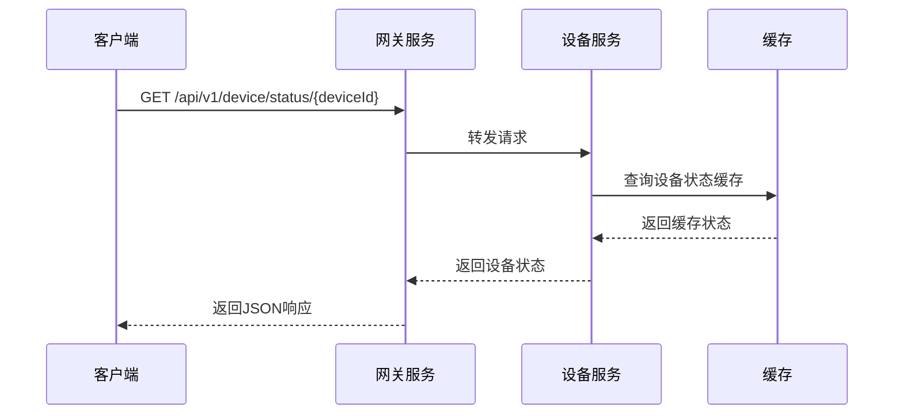
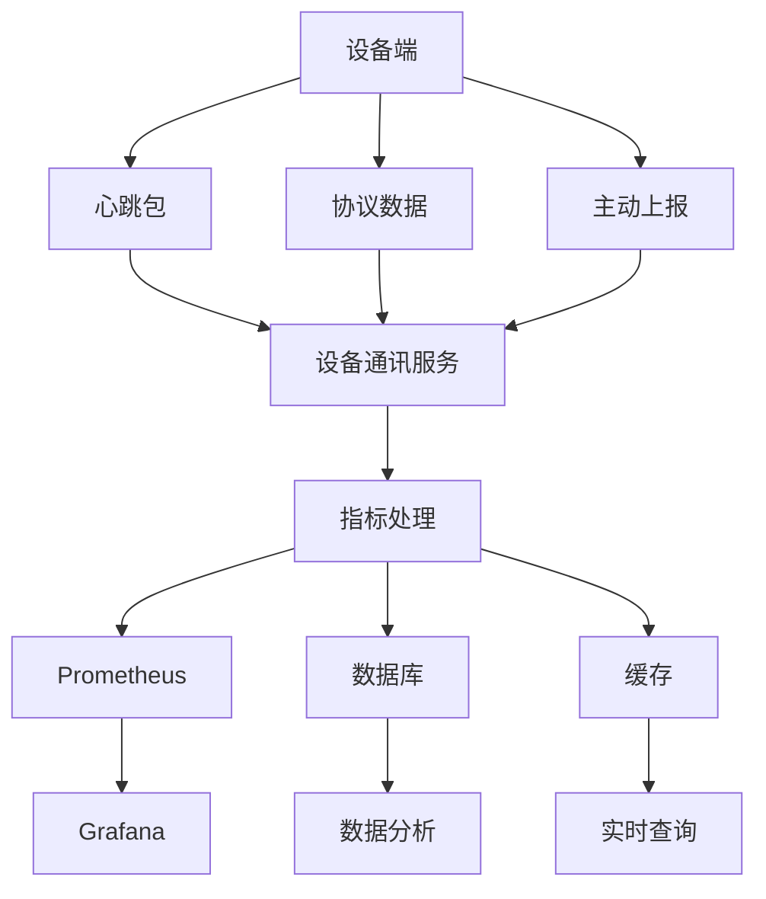
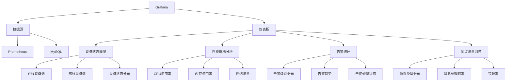

# 设备状态监控

<cite>
**本文档引用文件**  
- [prometheus.yml](file://deployment/monitoring/prometheus/prometheus.yml)
- [alertmanager.yml](file://deployment/monitoring/alertmanager/alertmanager.yml)
- [protocol_alerts.yml](file://deployment/monitoring/prometheus/rules/protocol_alerts.yml)
- [ProtocolController.java](file://microservices/ioedream-device-comm-service/src/main/java/net/lab1024/sa/devicecomm/controller/ProtocolController.java)
- [AlertController.java](file://microservices/ioedream-common-service/src/main/java/net/lab1024/sa/common/monitor/controller/AlertController.java)
- [DeviceHealthController.java](file://restful_refactor_backup_20251202_014224/microservices_ioedream-device-service_src_main_java_net_lab1024_sa_device_controller_DeviceHealthController.java)
</cite>

## 目录
1. [引言](#引言)
2. [心跳检测机制](#心跳检测机制)
3. [Prometheus与Alertmanager监控体系](#prometheus与alertmanager监控体系)
4. [设备在线状态查询API](#设备在线状态查询api)
5. [设备性能指标采集](#设备性能指标采集)
6. [监控数据可视化方案](#监控数据可视化方案)
7. [总结](#总结)

## 引言
本文档详细阐述了IOE-DREAM系统中设备状态监控的实现机制。系统通过心跳检测、Prometheus监控、Alertmanager告警和Grafana可视化等技术手段，构建了完整的设备状态监控体系。文档将深入解析心跳检测机制、监控告警配置、状态查询API设计以及数据可视化方案，为系统运维和开发提供全面的技术指导。

## 心跳检测机制

设备心跳检测是确保设备在线状态的核心机制。系统通过以下方式实现心跳检测：

- **心跳间隔**：设备默认每30秒向服务端发送一次心跳包，该间隔可根据设备类型和网络状况动态调整。
- **超时判定**：服务端设置60秒为心跳超时阈值，若在60秒内未收到设备心跳，则判定设备离线。
- **离线告警策略**：当设备状态由在线变为离线时，系统自动触发离线告警，通过邮件和钉钉通知相关责任人。

心跳检测数据通过设备通讯服务收集，并通过Prometheus的`/actuator/prometheus`端点暴露监控指标，包括`device_heartbeat_received_total`（心跳接收总数）和`device_last_heartbeat_timestamp`（最后心跳时间戳）等关键指标。

**Section sources**
- [ProtocolController.java](file://microservices/ioedream-device-comm-service/src/main/java/net/lab1024/sa/devicecomm/controller/ProtocolController.java#L1-325)
- [prometheus.yml](file://deployment/monitoring/prometheus/prometheus.yml#L22-29)

## Prometheus与Alertmanager监控体系

系统采用Prometheus和Alertmanager构建了完整的监控告警体系。

### Prometheus配置

Prometheus配置文件定义了多个服务的监控任务，包括设备通讯服务、网关服务、消费服务等。关键配置如下：

```mermaid
graph TD
A[Prometheus Server] --> B[设备通讯服务]
A --> C[网关服务]
A --> D[消费服务]
A --> E[门禁服务]
A --> F[考勤服务]
A --> G[访客服务]
A --> H[视频服务]
A --> I[RabbitMQ]
A --> J[Node Exporter]
B --> K[/actuator/prometheus]
C --> K
D --> K
E --> K
F --> K
G --> K
H --> K
I --> L[/api/metrics]
J --> M[:9100/metrics]
```

**Diagram sources**
- [prometheus.yml](file://deployment/monitoring/prometheus/prometheus.yml#L22-83)

### Alertmanager告警配置

Alertmanager配置实现了多级告警路由和通知机制：

```mermaid
graph TD
A[告警触发] --> B{告警级别}
B --> |严重| C[立即通知]
B --> |警告| D[延迟通知]
B --> |普通| E[汇总通知]
C --> F[邮件通知]
C --> G[钉钉机器人]
D --> F
E --> F
F --> H[devops@ioedream.com]
G --> I[值班人员群]
```

**Diagram sources**
- [alertmanager.yml](file://deployment/monitoring/alertmanager/alertmanager.yml#L11-33)

告警规则定义在`protocol_alerts.yml`文件中，包含设备离线、协议错误、系统异常等关键告警规则。告警信息通过邮件和钉钉双通道通知，确保告警的及时性和可靠性。

**Section sources**
- [prometheus.yml](file://deployment/monitoring/prometheus/prometheus.yml#L1-99)
- [alertmanager.yml](file://deployment/monitoring/alertmanager/alertmanager.yml#L1-127)
- [protocol_alerts.yml](file://deployment/monitoring/prometheus/rules/protocol_alerts.yml)

## 设备在线状态查询API

系统提供了RESTful API用于查询设备在线状态，主要接口如下：

### API设计



**Diagram sources**
- [DeviceHealthController.java](file://restful_refactor_backup_20251202_014224/microservices_ioedream-device-service_src_main_java_net_lab1024_sa_device_controller_DeviceHealthController.java)

### 使用示例

```json
// 请求
GET /api/v1/device/status/123

// 响应
{
  "code": 200,
  "data": {
    "deviceId": 123,
    "deviceCode": "DEV001",
    "status": "ONLINE",
    "lastHeartbeat": "2025-01-30T10:30:00Z",
    "uptime": 86400,
    "cpuUsage": 45.2,
    "memoryUsage": 67.8
  },
  "message": "success"
}
```

API支持批量查询、按状态过滤、按时间范围查询等高级功能，满足不同场景的查询需求。

**Section sources**
- [DeviceHealthController.java](file://restful_refactor_backup_20251202_014224/microservices_ioedream-device-service_src_main_java_net_lab1024_sa_device_controller_DeviceHealthController.java)

## 设备性能指标采集

系统通过多种方式采集设备性能指标，确保监控数据的全面性和准确性。

### 采集方法



**Diagram sources**
- [ProtocolController.java](file://microservices/ioedream-device-comm-service/src/main/java/net/lab1024/sa/devicecomm/controller/ProtocolController.java#L1-325)

### 采集指标

系统采集的主要性能指标包括：

| 指标类别 | 具体指标 | 采集频率 | 说明 |
|---------|---------|---------|------|
| CPU | cpu_usage_rate | 30秒 | CPU使用率百分比 |
| 内存 | memory_usage_rate | 30秒 | 内存使用率百分比 |
| 网络 | network_receive_rate | 30秒 | 网络接收速率(Mbps) |
| 网络 | network_transmit_rate | 30秒 | 网络发送速率(Mbps) |
| 磁盘 | disk_usage_rate | 60秒 | 磁盘使用率百分比 |
| 系统 | system_uptime | 60秒 | 系统运行时间(秒) |

指标数据通过设备心跳包和协议数据中的性能信息字段采集，并在服务端进行标准化处理和存储。

**Section sources**
- [ProtocolController.java](file://microservices/ioedream-device-comm-service/src/main/java/net/lab1024/sa/devicecomm/controller/ProtocolController.java#L1-325)

## 监控数据可视化方案

系统采用Grafana作为监控数据可视化平台，提供直观的监控仪表板。

### Grafana仪表板配置



**Diagram sources**
- [prometheus.yml](file://deployment/monitoring/prometheus/prometheus.yml)

### 关键指标解读

1. **设备在线率**：反映系统整体设备的在线情况，正常值应保持在99%以上。
2. **CPU使用率**：单个设备CPU使用率持续高于80%可能表示设备负载过高。
3. **内存使用率**：内存使用率持续高于90%可能导致设备性能下降或崩溃。
4. **消息处理延迟**：协议消息处理平均延迟应低于500ms，超过1秒为异常。
5. **告警频率**：同一设备在短时间内频繁告警可能表示设备存在硬件或网络问题。

仪表板支持按设备类型、区域、时间范围等维度进行数据筛选和分析，帮助运维人员快速定位问题。

**Section sources**
- [prometheus.yml](file://deployment/monitoring/prometheus/prometheus.yml)
- [alertmanager.yml](file://deployment/monitoring/alertmanager/alertmanager.yml)

## 总结
本文档详细介绍了IOE-DREAM系统中设备状态监控的完整实现方案。通过心跳检测机制、Prometheus监控、Alertmanager告警和Grafana可视化等技术手段，系统实现了对设备状态的全面监控。设备心跳检测确保了设备在线状态的实时感知，Prometheus和Alertmanager构建了可靠的监控告警体系，设备状态查询API提供了便捷的状态查询功能，而Grafana仪表板则实现了监控数据的直观展示。这一完整的监控体系为系统的稳定运行提供了有力保障。