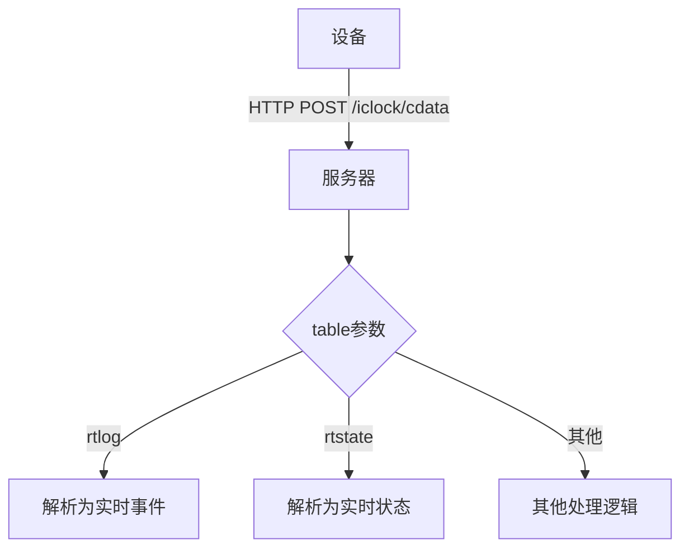
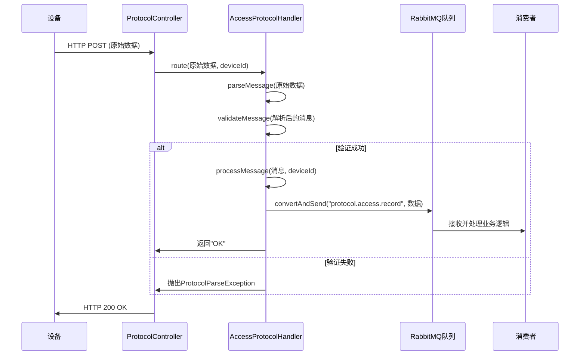
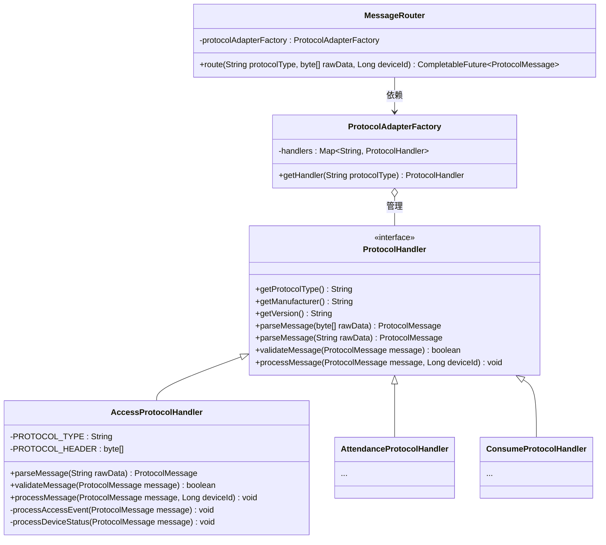

# 设备通讯协议集成

<cite>
**本文档引用的文件**   
- [MinerU_安防PUSH通讯协议 （熵基科技）V4.8-20240107(水印版)__20251206181130.md](file://docs/各个设备通讯协议/MinerU_安防PUSH通讯协议%20（熵基科技）V4.8-20240107(水印版)__20251206181130.md)
- [AccessProtocolHandler.java](file://microservices/ioedream-device-comm-service/src/main/java/net/lab1024/sa/devicecomm/protocol/handler/impl/AccessProtocolHandler.java)
- [ProtocolController.java](file://microservices/ioedream-device-comm-service/src/main/java/net/lab1024/sa/devicecomm/controller/ProtocolController.java)
- [TcpPushServer.java](file://microservices/ioedream-device-comm-service/src/main/java/net/lab1024/sa/devicecomm/protocol/server/TcpPushServer.java)
- [PROTOCOL_IMPLEMENTATION_GUIDE.md](file://microservices/ioedream-device-comm-service/docs/PROTOCOL_IMPLEMENTATION_GUIDE.md)
- [PROTOCOL_ARCHITECTURE.md](file://microservices/ioedream-device-comm-service/docs/PROTOCOL_ARCHITECTURE.md)
- [PROTOCOL_FORMAT_ANALYSIS.md](file://microservices/ioedream-device-comm-service/docs/PROTOCOL_FORMAT_ANALYSIS.md)
- [PROTOCOL_COMPATIBILITY_CHECK.md](file://microservices/ioedream-device-comm-service/docs/PROTOCOL_COMPATIBILITY_CHECK.md)
</cite>

## 目录
1. [引言](#引言)
2. [熵基科技安防PUSH协议技术细节](#熵基科技安防push协议技术细节)
3. [协议处理器实现原理](#协议处理器实现原理)
4. [协议版本兼容性与扩展机制](#协议版本兼容性与扩展机制)
5. [协议调试与日志分析](#协议调试与日志分析)
6. [结论](#结论)

## 引言
本文档旨在深入解析熵基科技安防PUSH通讯协议的技术细节，并详细说明在IOE-DREAM系统中如何实现设备通讯协议的集成。文档将涵盖协议的数据包结构、消息类型、传输机制，以及核心组件`AccessProtocolHandler`的实现原理。同时，本文档将阐述协议的版本兼容性处理机制和扩展支持其他厂商设备协议的方法，并提供实用的协议调试工具和日志分析方法，以帮助开发人员快速定位和解决通讯问题。

**Section sources**
- [MinerU_安防PUSH通讯协议 （熵基科技）V4.8-20240107(水印版)__20251206181130.md](file://docs/各个设备通讯协议/MinerU_安防PUSH通讯协议%20（熵基科技）V4.8-20240107(水印版)__20251206181130.md)

## 熵基科技安防PUSH协议技术细节

### 数据包结构与消息类型
熵基科技安防PUSH通讯协议是基于HTTP协议的文本格式协议，而非传统的TCP二进制协议。设备通过HTTP POST请求将数据推送到服务器，数据格式主要为键值对或制表符分隔的文本。

**核心数据包结构**：
*   **HTTP请求**：设备发起`POST`请求，URL路径为`/iclock/cdata?SN={SerialNumber}&table={TableName}`。
*   **Content-Type**：`application-push; charset=UTF-8`。
*   **数据格式**：根据`table`参数的不同，数据格式也不同。对于门禁事件（`table=rtlog`），数据为键值对格式，使用制表符（`\t`）分隔。

**主要消息类型**：
1.  **实时事件 (rtlog)**：上报门禁通行记录，包含时间、工号、卡号、事件码、验证方式等关键信息。
2.  **实时状态 (rtstate)**：上报设备的实时状态，如门磁、继电器、报警状态等。
3.  **注册 (registry)**：设备首次连接时，向服务器注册自身参数，如设备型号、固件版本、支持的功能列表等。
4.  **下载配置 (push)**：服务器向设备下发配置参数，如服务器地址、心跳间隔等。

**Diagram sources**
- [MinerU_安防PUSH通讯协议 （熵基科技）V4.8-20240107(水印版)__20251206181130.md](file://docs/各个设备通讯协议/MinerU_安防PUSH通讯协议%20（熵基科技）V4.8-20240107(水印版)__20251206181130.md)
- [PROTOCOL_FORMAT_ANALYSIS.md](file://microservices/ioedream-device-comm-service/docs/PROTOCOL_FORMAT_ANALYSIS.md)

### 传输协议与加密算法
该协议主要依赖HTTP/1.1 over TCP/IP进行数据传输。其核心特点是**主动推送**，所有数据交互均由设备端发起。

**传输协议**：
*   **通信方式**：设备主动发起HTTP连接，将数据推送到服务器。
*   **连接管理**：设备通过心跳机制（`GET /iclock/cdata`）与服务器保持连接，服务器返回配置参数以指导设备的后续行为。

**加密算法**：
虽然协议本身是明文传输，但文档中提到了可选的通信加密机制：
*   **交换公钥**：设备与服务器通过`/iclock/exchange?type=publickey`接口交换公钥，为后续加密通信做准备。
*   **交换因子**：通过`/iclock/exchange?type=factors`接口交换加密因子。
*   **二维码加密**：支持多种二维码解密方案，包括基于日期的AES256固定密钥加密、随机密钥的AES256加密以及RSA1024加密。

**Section sources**
- [MinerU_安防PUSH通讯协议 （熵基科技）V4.8-20240107(水印版)__20251206181130.md](file://docs/各个设备通讯协议/MinerU_安防PUSH通讯协议%20（熵基科技）V4.8-20240107(水印版)__20251206181130.md)

## 协议处理器实现原理

### AccessProtocolHandler 核心实现
`AccessProtocolHandler`是处理熵基科技安防PUSH协议的核心Java类，它实现了`ProtocolHandler`接口，负责解析、验证和处理设备上报的数据。

**核心处理流程**：
1.  **解析消息 (`parseMessage`)**：该方法接收原始的HTTP文本数据，将其按制表符分割成键值对，并存入一个`Map<String, Object>`中。同时，根据数据中的字段（如`event`）确定消息类型（如`ACCESS_RECORD`）。
2.  **验证消息 (`validateMessage`)**：检查解析后的消息是否包含必要的字段（如消息类型、设备编号、数据体），确保消息的完整性和有效性。
3.  **处理消息 (`processMessage`)**：根据消息类型，调用不同的处理方法。例如，`processAccessEvent`会将门禁事件数据映射到业务对象，并通过`RabbitTemplate`发送到消息队列，由消费者异步处理，实现高吞吐量和系统解耦。

**Diagram sources**
- [AccessProtocolHandler.java](file://microservices/ioedream-device-comm-service/src/main/java/net/lab1024/sa/devicecomm/protocol/handler/impl/AccessProtocolHandler.java)
- [ProtocolController.java](file://microservices/ioedream-device-comm-service/src/main/java/net/lab1024/sa/devicecomm/controller/ProtocolController.java)

### 数据解析与业务映射
`AccessProtocolHandler`通过一系列私有方法将协议字段精确地映射到业务系统。

**关键映射逻辑**：
*   **事件类型映射**：通过`AccessEventTypeEnum`枚举类，将协议中的`event`代码（如4000, 5000, 6000）映射为具体的事件名称（如“正常通行”、“无效卡片”、“火警”）和类别。
*   **验证方式映射**：通过`VerifyTypeEnum`枚举类和`parseVerifyType`方法，将协议中的`verifytype`字段（可能是数字或字符串）解析为具体的验证方式（如“人脸”、“指纹”、“混合验证”）。
*   **业务数据构建**：在`processAccessEvent`方法中，将解析出的`time`、`pin`、`event`等字段，转换为符合业务服务API要求的请求参数（如`passTime`、`userId`、`accessResult`）。

**Section sources**
- [AccessProtocolHandler.java](file://microservices/ioedream-device-comm-service/src/main/java/net/lab1024/sa/devicecomm/protocol/handler/impl/AccessProtocolHandler.java)
- [AccessEventTypeEnum.java](file://microservices/ioedream-device-comm-service/src/main/java/net/lab1024/sa/devicecomm/protocol/enums/AccessEventTypeEnum.java)
- [VerifyTypeEnum.java](file://microservices/ioedream-device-comm-service/src/main/java/net/lab1024/sa/devicecomm/protocol/enums/VerifyTypeEnum.java)

## 协议版本兼容性与扩展机制

### 组件化架构设计
系统采用高度组件化的架构来支持多种设备协议，其核心设计模式是**策略模式**和**工厂模式**。

**核心组件**：
*   **ProtocolHandler接口**：定义了所有协议处理器必须实现的标准方法（`parseMessage`, `validateMessage`, `processMessage`）。
*   **ProtocolAdapterFactory**：协议适配器工厂，管理所有实现了`ProtocolHandler`接口的Spring Bean（如`AccessProtocolHandler`, `AttendanceProtocolHandler`）。
*   **MessageRouter**：消息路由器，根据协议类型（`protocolType`）从工厂中获取对应的处理器，并路由消息。

**Diagram sources**
- [PROTOCOL_ARCHITECTURE.md](file://microservices/ioedream-device-comm-service/docs/PROTOCOL_ARCHITECTURE.md)
- [PROTOCOL_IMPLEMENTATION_GUIDE.md](file://microservices/ioedream-device-comm-service/docs/PROTOCOL_IMPLEMENTATION_GUIDE.md)

### 扩展支持新厂商协议
该架构设计使得扩展支持新的设备厂商协议变得非常简单。

**扩展步骤**：
1.  **创建新的处理器**：创建一个新的Java类，实现`ProtocolHandler`接口。
2.  **实现解析逻辑**：重写`parseMessage`、`validateMessage`和`processMessage`方法，根据新厂商的协议文档实现具体的解析和处理逻辑。
3.  **注册为Spring Bean**：使用`@Component`注解，Spring会自动将其实例化并注册到`ProtocolAdapterFactory`中。
4.  **定义协议类型**：在`ProtocolTypeEnum`枚举中添加新的协议类型代码。

通过这种方式，系统可以轻松地集成中控智慧、海康威视等其他厂商的设备协议，而无需修改现有代码，实现了良好的可扩展性。

**Section sources**
- [PROTOCOL_ARCHITECTURE.md](file://microservices/ioedream-device-comm-service/docs/PROTOCOL_ARCHITECTURE.md)
- [PROTOCOL_IMPLEMENTATION_GUIDE.md](file://microservices/ioedream-device-comm-service/docs/PROTOCOL_IMPLEMENTATION_GUIDE.md)

## 协议调试与日志分析

### 协议调试工具
系统提供了多种HTTP接口来接收和调试设备协议。

**主要调试接口**：
*   **`POST /api/v1/device/protocol/push/text`**：这是最主要的调试接口，专门用于接收HTTP文本格式的协议数据。它支持通过`table`参数自动识别协议类型，并能根据设备序列号（`SN`）自动查找设备ID，极大地简化了调试过程。
*   **`POST /api/v1/device/protocol/push`**：接收原始的字节数组，适用于调试二进制协议。
*   **`POST /api/v1/device/protocol/push/auto`**：根据设备类型和厂商自动识别协议。

**调试方法**：
开发人员可以使用`curl`命令或Postman等工具，直接向`/push/text`接口发送模拟的协议数据，以测试协议处理器的解析和处理逻辑。

**Section sources**
- [ProtocolController.java](file://microservices/ioedream-device-comm-service/src/main/java/net/lab1024/sa/devicecomm/controller/ProtocolController.java)

### 日志分析方法
详细的日志记录是快速定位通讯问题的关键。

**关键日志分析点**：
1.  **协议控制器日志**：在`ProtocolController`中，记录了接收到的原始数据长度、协议类型、设备ID等信息。如果日志显示“接收到设备推送”，但后续没有处理日志，则问题可能出在消息路由或处理器获取阶段。
2.  **协议处理器日志**：在`AccessProtocolHandler`中，有详细的`parseMessage`、`validateMessage`和`processMessage`的日志。通过这些日志，可以清晰地看到：
    *   消息是否成功解析。
    *   消息验证是否通过。
    *   具体的业务处理流程（如`processAccessEvent`）。
3.  **错误日志**：当解析或处理失败时，会抛出`ProtocolParseException`或`ProtocolProcessException`，并记录详细的错误信息和堆栈跟踪，这是定位问题根源的直接依据。

**分析流程**：
1.  在日志中搜索设备的`SN`或`deviceId`。
2.  跟踪从`ProtocolController`接收到请求，到`AccessProtocolHandler`处理消息的完整链路。
3.  检查每一步的日志输出，确认执行流程是否正常。
4.  重点关注`ERROR`级别的日志，它们直接指出了问题所在。

**Section sources**
- [AccessProtocolHandler.java](file://microservices/ioedream-device-comm-service/src/main/java/net/lab1024/sa/devicecomm/protocol/handler/impl/AccessProtocolHandler.java)
- [ProtocolController.java](file://microservices/ioedream-device-comm-service/src/main/java/net/lab1024/sa/devicecomm/controller/ProtocolController.java)

## 结论
本文档详细解析了熵基科技安防PUSH通讯协议的技术细节，并深入探讨了其在IOE-DREAM系统中的实现。通过`AccessProtocolHandler`，系统能够高效、可靠地解析和处理设备上报的数据。其组件化的架构设计不仅确保了代码的清晰和可维护性，还提供了强大的扩展能力，能够轻松集成其他厂商的设备协议。结合提供的调试接口和日志分析方法，开发人员可以快速地进行协议集成和故障排查，确保设备通讯的稳定运行。