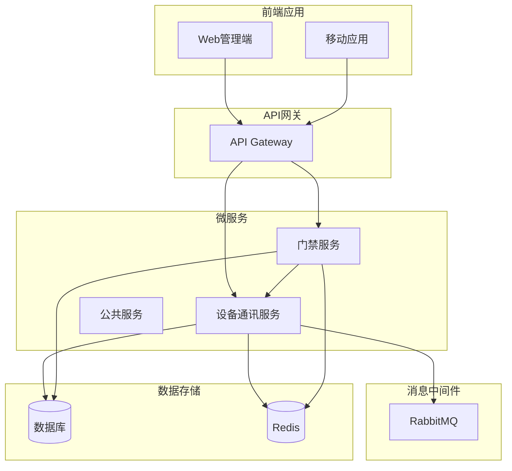
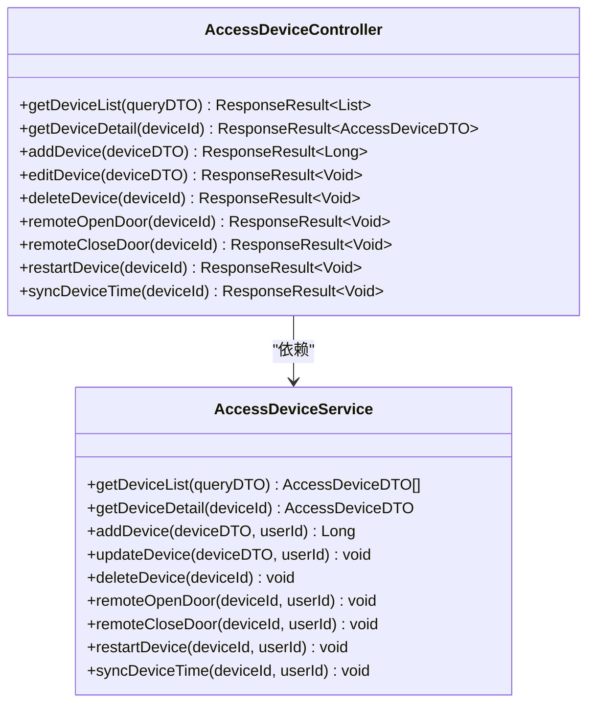
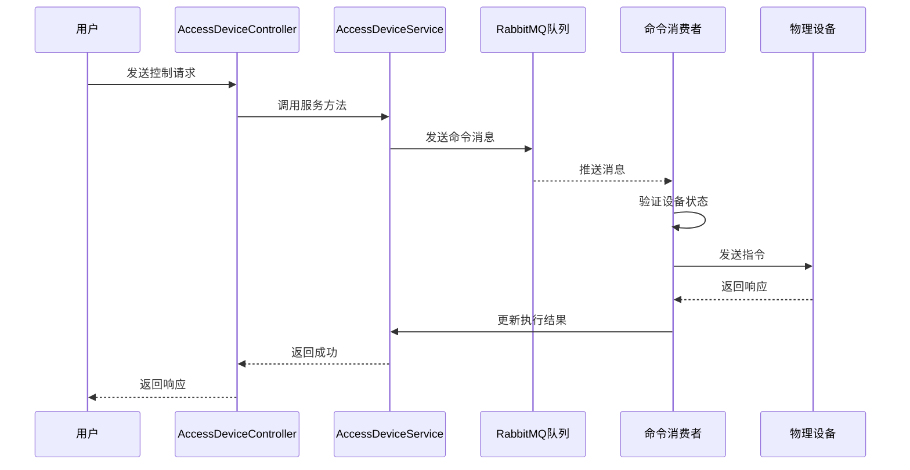
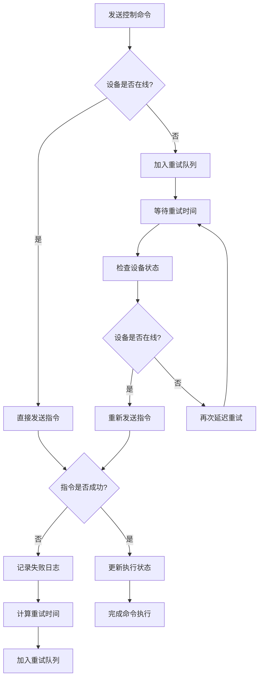
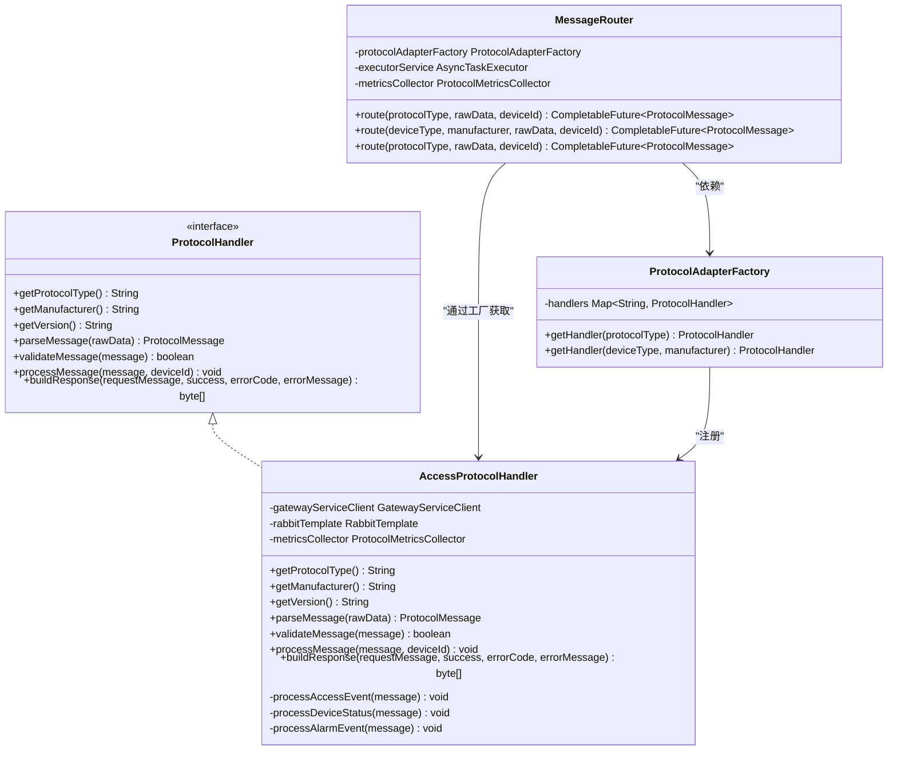
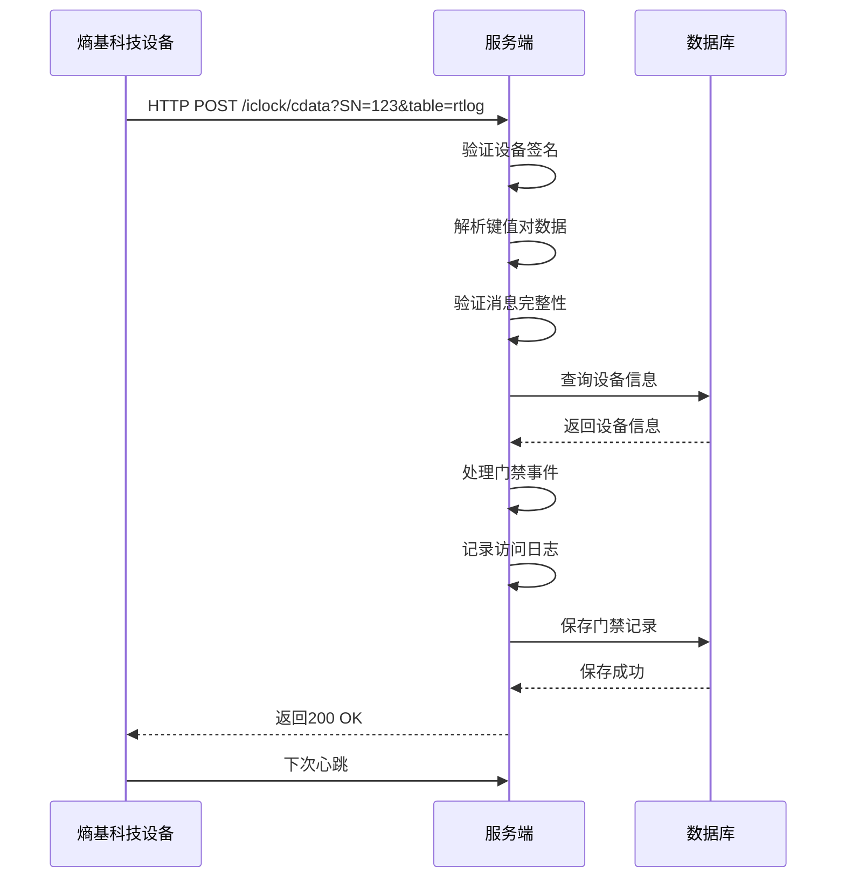
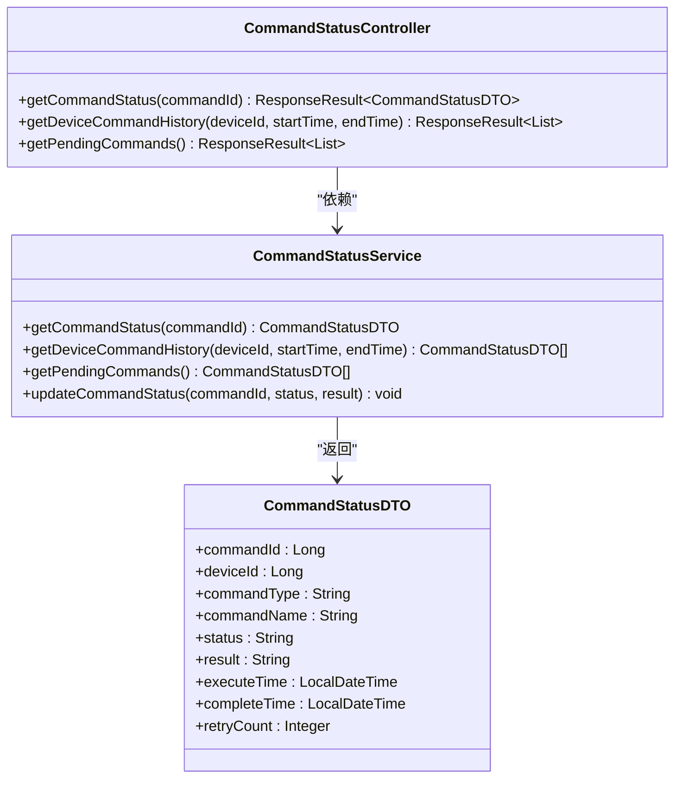
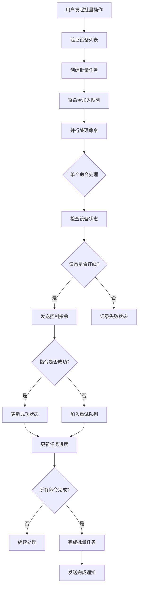

# 远程控制与命令下发

<cite>
**本文档引用文件**   
- [AccessDeviceService.java](file://documentation\technical\smart-access.md)
- [AccessDeviceController.java](file://documentation\technical\smart-access.md)
- [DeviceProtocolFactory.java](file://documentation\technical\smart-access.md)
- [TcpDeviceConnection.java](file://documentation\technical\smart-access.md)
- [AccessProtocolHandler.java](file://microservices\ioedream-device-comm-service\src\main\java\net\lab1024\sa\devicecomm\protocol\handler\impl\AccessProtocolHandler.java)
- [MessageRouter.java](file://microservices\ioedream-device-comm-service\src\main\java\net\lab1024\sa\devicecomm\protocol\router\MessageRouter.java)
- [ProtocolAdapterFactory.java](file://microservices\ioedream-device-comm-service\src\main\java\net\lab1024\sa\devicecomm\protocol\adapter\ProtocolAdapterFactory.java)
- [PROTOCOL_IMPLEMENTATION_GUIDE.md](file://microservices\ioedream-device-comm-service\docs\PROTOCOL_IMPLEMENTATION_GUIDE.md)
- [PROTOCOL_FORMAT_ANALYSIS.md](file://microservices\ioedream-device-comm-service\docs\PROTOCOL_FORMAT_ANALYSIS.md)
- [PROTOCOL_ARCHITECTURE.md](file://microservices\ioedream-device-comm-service\docs\PROTOCOL_ARCHITECTURE.md)
- [MinerU_安防PUSH通讯协议 （熵基科技）V4.8-20240107(水印版)__20251206181130.md](file://docs\各个设备通讯协议\MinerU_安防PUSH通讯协议 （熵基科技）V4.8-20240107(水印版)__20251206181130.md)
- [DeviceList.vue](file://documentation\technical\smart-access.md)
</cite>

## 目录
1. [远程控制与命令下发](#远程控制与命令下发)
2. [系统架构与组件](#系统架构与组件)
3. [API接口实现](#api接口实现)
4. [命令下发异步处理机制](#命令下发异步处理机制)
5. [与熵基科技设备通讯协议集成](#与熵基科技设备通讯协议集成)
6. [命令执行状态查询](#命令执行状态查询)
7. [批量控制设备最佳实践](#批量控制设备最佳实践)

## 系统架构与组件

本系统采用微服务架构，核心组件包括门禁服务（ioedream-access-service）和设备通讯服务（ioedream-device-comm-service）。门禁服务负责业务逻辑处理和API接口暴露，设备通讯服务负责与物理设备的底层通讯。



**Diagram sources**
- [PROTOCOL_ARCHITECTURE.md](file://microservices\ioedream-device-comm-service\docs\PROTOCOL_ARCHITECTURE.md)
- [PROTOCOL_IMPLEMENTATION_GUIDE.md](file://microservices\ioedream-device-comm-service\docs\PROTOCOL_IMPLEMENTATION_GUIDE.md)

**Section sources**
- [PROTOCOL_ARCHITECTURE.md](file://microservices\ioedream-device-comm-service\docs\PROTOCOL_ARCHITECTURE.md)
- [PROTOCOL_IMPLEMENTATION_GUIDE.md](file://microservices\ioedream-device-comm-service\docs\PROTOCOL_IMPLEMENTATION_GUIDE.md)

## API接口实现

系统通过RESTful API提供远程控制功能，主要接口包括远程开门、关门、设备重启和同步时间等操作。

### 门禁设备控制器

门禁设备控制器提供了设备控制的核心API接口，通过HTTP请求实现远程操作。



**Diagram sources**
- [AccessDeviceController.java](file://documentation\technical\smart-access.md)
- [AccessDeviceService.java](file://documentation\technical\smart-access.md)

**Section sources**
- [AccessDeviceController.java](file://documentation\technical\smart-access.md)
- [AccessDeviceService.java](file://documentation\technical\smart-access.md)

### 远程控制API

远程控制API提供了对门禁设备的远程操作能力，包括开门、关门、重启和同步时间等。

| 接口路径 | HTTP方法 | 功能描述 | 请求参数 | 响应状态码 |
|---------|---------|---------|---------|---------|
| /api/access/device/{deviceId}/open | POST | 远程开门 | deviceId (路径参数) | 200 (成功), 400 (设备不存在), 403 (设备离线) |
| /api/access/device/{deviceId}/close | POST | 远程关门 | deviceId (路径参数) | 200 (成功), 400 (设备不存在), 403 (设备连接断开) |
| /api/access/device/{deviceId}/restart | POST | 重启设备 | deviceId (路径参数) | 200 (成功), 400 (设备不存在), 403 (设备连接断开) |
| /api/access/device/{deviceId}/sync-time | POST | 同步设备时间 | deviceId (路径参数) | 200 (成功), 400 (设备不存在), 403 (设备连接断开) |

**Section sources**
- [AccessDeviceController.java](file://documentation\technical\smart-access.md)

## 命令下发异步处理机制

系统采用异步处理机制来确保命令下发的可靠性和系统性能，包括命令队列、重试策略和超时处理。

### 命令队列与异步处理

系统使用RabbitMQ作为消息中间件，实现命令的异步处理和解耦。当控制命令被触发时，首先被放入消息队列，然后由消费者异步处理。



**Diagram sources**
- [AccessDeviceService.java](file://documentation\technical\smart-access.md)
- [AccessProtocolHandler.java](file://microservices\ioedream-device-comm-service\src\main\java\net\lab1024\sa\devicecomm\protocol\handler\impl\AccessProtocolHandler.java)

**Section sources**
- [AccessDeviceService.java](file://documentation\technical\smart-access.md)
- [AccessProtocolHandler.java](file://microservices\ioedream-device-comm-service\src\main\java\net\lab1024\sa\devicecomm\protocol\handler\impl\AccessProtocolHandler.java)

### 重试策略与超时处理

系统实现了完善的重试策略和超时处理机制，确保命令的可靠执行。



**Diagram sources**
- [AccessDeviceService.java](file://documentation\technical\smart-access.md)
- [AccessProtocolHandler.java](file://microservices\ioedream-device-comm-service\src\main\java\net\lab1024\sa\devicecomm\protocol\handler\impl\AccessProtocolHandler.java)

**Section sources**
- [AccessDeviceService.java](file://documentation\technical\smart-access.md)
- [AccessProtocolHandler.java](file://microservices\ioedream-device-comm-service\src\main\java\net\lab1024\sa\devicecomm\protocol\handler\impl\AccessProtocolHandler.java)

## 与熵基科技设备通讯协议集成

系统与熵基科技设备的通讯基于HTTP PUSH协议，实现了设备数据的接收和控制指令的发送。

### 协议格式分析

根据《安防PUSH通讯协议 （熵基科技）V4.8-20240107》文档，系统与熵基科技设备的通讯采用HTTP文本协议，而非TCP二进制协议。

```mermaid
flowchart TD
A[设备运行中] --> B[定时发送HTTP POST]
B --> C[请求参数]
C --> D[SN=设备序列号]
D --> E[table=rtlog]
E --> F[数据格式]
F --> G[键值对格式]
G --> H[使用制表符分隔]
H --> I[time={Time}]
I --> J[pin={Pin}]
J --> K[cardno={CardNo}]
K --> L[event={Event}]
L --> M[服务端接收]
M --> N[解析键值对]
N --> O[验证数据完整性]
O --> P[处理业务逻辑]
P --> Q[返回响应]
```

**Diagram sources**
- [PROTOCOL_FORMAT_ANALYSIS.md](file://microservices\ioedream-device-comm-service\docs\PROTOCOL_FORMAT_ANALYSIS.md)
- [MinerU_安防PUSH通讯协议 （熵基科技）V4.8-20240107(水印版)__20251206181130.md](file://docs\各个设备通讯协议\MinerU_安防PUSH通讯协议 （熵基科技）V4.8-20240107(水印版)__20251206181130.md)

**Section sources**
- [PROTOCOL_FORMAT_ANALYSIS.md](file://microservices\ioedream-device-comm-service\docs\PROTOCOL_FORMAT_ANALYSIS.md)
- [MinerU_安防PUSH通讯协议 （熵基科技）V4.8-20240107(水印版)__20251206181130.md](file://docs\各个设备通讯协议\MinerU_安防PUSH通讯协议 （熵基科技）V4.8-20240107(水印版)__20251206181130.md)

### 协议处理器实现

系统通过协议处理器实现对熵基科技设备协议的解析和处理，采用组件化架构支持多种协议。



**Diagram sources**
- [AccessProtocolHandler.java](file://microservices\ioedream-device-comm-service\src\main\java\net\lab1024\sa\devicecomm\protocol\handler\impl\AccessProtocolHandler.java)
- [MessageRouter.java](file://microservices\ioedream-device-comm-service\src\main\java\net\lab1024\sa\devicecomm\protocol\router\MessageRouter.java)
- [ProtocolAdapterFactory.java](file://microservices\ioedream-device-comm-service\src\main\java\net\lab1024\sa\devicecomm\protocol\adapter\ProtocolAdapterFactory.java)

**Section sources**
- [AccessProtocolHandler.java](file://microservices\ioedream-device-comm-service\src\main\java\net\lab1024\sa\devicecomm\protocol\handler\impl\AccessProtocolHandler.java)
- [MessageRouter.java](file://microservices\ioedream-device-comm-service\src\main\java\net\lab1024\sa\devicecomm\protocol\router\MessageRouter.java)
- [ProtocolAdapterFactory.java](file://microservices\ioedream-device-comm-service\src\main\java\net\lab1024\sa\devicecomm\protocol\adapter\ProtocolAdapterFactory.java)

### 加密传输与响应确认

系统实现了安全的加密传输机制和可靠的响应确认机制，确保通讯的安全性和可靠性。



**Diagram sources**
- [AccessProtocolHandler.java](file://microservices\ioedream-device-comm-service\src\main\java\net\lab1024\sa\devicecomm\protocol\handler\impl\AccessProtocolHandler.java)
- [PROTOCOL_FORMAT_ANALYSIS.md](file://microservices\ioedream-device-comm-service\docs\PROTOCOL_FORMAT_ANALYSIS.md)

**Section sources**
- [AccessProtocolHandler.java](file://microservices\ioedream-device-comm-service\src\main\java\net\lab1024\sa\devicecomm\protocol\handler\impl\AccessProtocolHandler.java)
- [PROTOCOL_FORMAT_ANALYSIS.md](file://microservices\ioedream-device-comm-service\docs\PROTOCOL_FORMAT_ANALYSIS.md)

## 命令执行状态查询

系统提供了命令执行状态查询接口，允许用户查询已下发命令的执行状态和结果。

### 状态查询接口

系统提供了RESTful API接口，用于查询设备控制命令的执行状态。



**Diagram sources**
- [AccessDeviceService.java](file://documentation\technical\smart-access.md)

**Section sources**
- [AccessDeviceService.java](file://documentation\technical\smart-access.md)

### 状态查询API

系统提供了以下API接口用于查询命令执行状态：

| 接口路径 | HTTP方法 | 功能描述 | 请求参数 | 响应状态码 |
|---------|---------|---------|---------|---------|
| /api/access/command/status/{commandId} | GET | 查询单个命令状态 | commandId (路径参数) | 200 (成功), 404 (命令不存在) |
| /api/access/command/history | GET | 查询设备命令历史 | deviceId, startTime, endTime (查询参数) | 200 (成功) |
| /api/access/command/pending | GET | 查询待处理命令 | 无 | 200 (成功) |

**Section sources**
- [AccessDeviceService.java](file://documentation\technical\smart-access.md)

## 批量控制设备最佳实践

系统支持批量控制设备，提供了高效、可靠的批量操作机制。

### 批量控制实现

系统通过异步任务和消息队列实现批量设备控制，确保操作的可靠性和系统性能。



**Diagram sources**
- [AccessDeviceService.java](file://documentation\technical\smart-access.md)

**Section sources**
- [AccessDeviceService.java](file://documentation\technical\smart-access.md)

### 批量控制API

系统提供了批量控制API接口，支持同时对多个设备执行相同操作。

| 接口路径 | HTTP方法 | 功能描述 | 请求参数 | 响应状态码 |
|---------|---------|---------|---------|---------|
| /api/access/device/batch/open | POST | 批量远程开门 | deviceIds (请求体) | 200 (成功), 400 (设备列表为空) |
| /api/access/device/batch/close | POST | 批量远程关门 | deviceIds (请求体) | 200 (成功), 400 (设备列表为空) |
| /api/access/device/batch/restart | POST | 批量重启设备 | deviceIds (请求体) | 200 (成功), 400 (设备列表为空) |
| /api/access/device/batch/sync-time | POST | 批量同步时间 | deviceIds (请求体) | 200 (成功), 400 (设备列表为空) |

**Section sources**
- [AccessDeviceService.java](file://documentation\technical\smart-access.md)