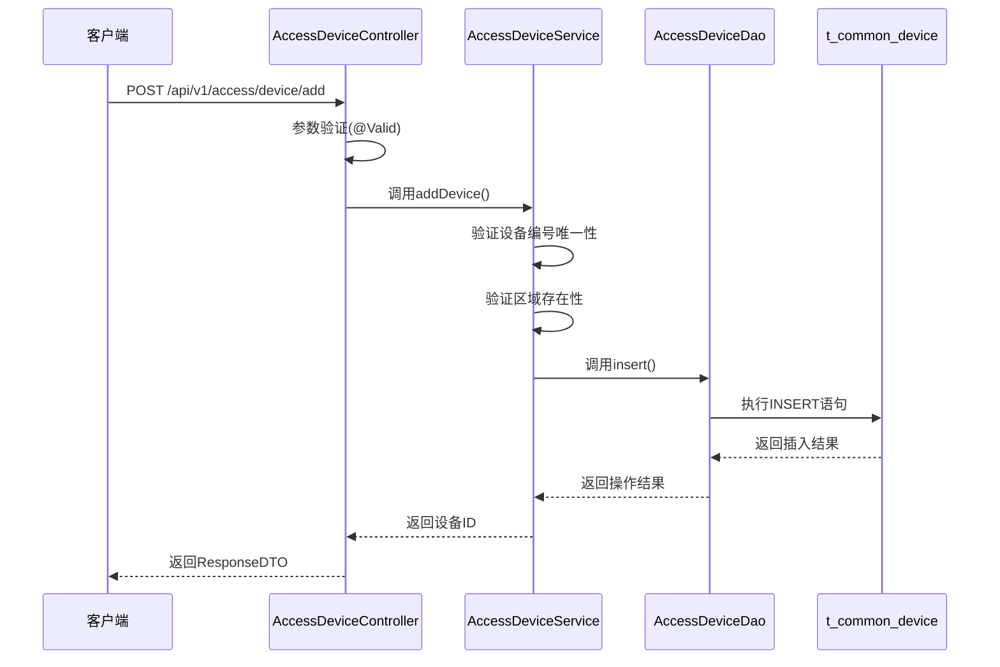
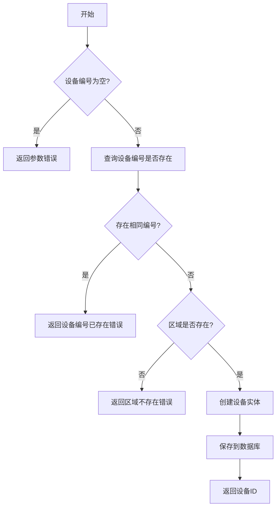
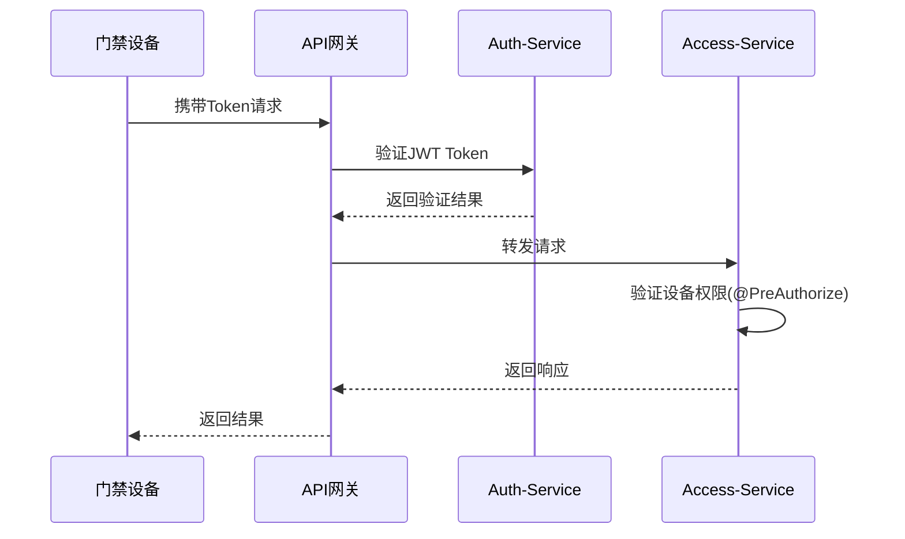

# 门禁设备注册

<cite>
**本文档引用文件**   
- [AccessDeviceController.java](file://microservices\ioedream-access-service\src\main\java\net\lab1024\sa\access\controller\AccessDeviceController.java)
- [AccessDeviceAddForm.java](file://microservices\ioedream-access-service\src\main\java\net\lab1024\sa\access\domain\form\AccessDeviceAddForm.java)
- [AccessDeviceVO.java](file://microservices\ioedream-access-service\src\main\java\net\lab1024\sa\access\domain\vo\AccessDeviceVO.java)
- [AccessDeviceService.java](file://microservices\ioedream-access-service\src\main\java\net\lab1024\sa\access\service\AccessDeviceService.java)
- [AccessDeviceServiceImpl.java](file://microservices\ioedream-access-service\src\main\java\net\lab1024\sa\access\service\impl\AccessDeviceServiceImpl.java)
- [AccessDeviceDao.java](file://microservices\ioedream-access-service\src\main\java\net\lab1024\sa\access\dao\AccessDeviceDao.java)
- [README.md](file://docs/各业务模块文档/门禁/README.md)
- [OPTIMAL_ARCHITECTURE_DESIGN.md](file://documentation\architecture\OPTIMAL_ARCHITECTURE_DESIGN.md)
- [功能概述.md](file://documentation\03-业务模块\门禁系统\功能概述.md)
- [全局架构规范.md](file://documentation\01-核心规范\架构规范\全局架构规范.md)
</cite>

## 目录
1. [引言](#引言)
2. [设备注册API调用流程](#设备注册api调用流程)
3. [设备唯一标识生成与校验](#设备唯一标识生成与校验)
4. [设备绑定逻辑](#设备绑定逻辑)
5. [设备认证与授权](#设备认证与授权)
6. [注册失败原因分析](#注册失败原因分析)
7. [结论](#结论)

## 引言

门禁设备注册是智能安防系统的核心功能之一，它实现了物理设备与数字系统的对接。本系统基于ZKBioSecurity-ACC门禁系统，采用微服务架构设计，通过统一的设备管理平台实现对各类门禁设备的集中管控。系统遵循严格的架构规范，使用公共设备实体（DeviceEntity）进行数据管理，确保了设备数据的一致性和可维护性。

门禁设备注册功能主要由`ioedream-access-service`微服务提供，该服务负责处理所有与门禁设备相关的业务逻辑，包括设备的增删改查、状态管理、权限控制等。设备数据存储在`t_common_device`公共表中，通过`device_type='ACCESS'`字段标识门禁设备类型，实现了多业务系统的设备统一管理。

**文档来源**
- [README.md](file://docs/各业务模块文档/门禁/README.md#L1-L168)

## 设备注册API调用流程

### HTTP方法与请求参数

门禁设备注册通过POST请求实现，API端点为`/api/v1/access/device/add`。该接口严格遵循RESTful规范，使用`@PostMapping`注解定义，接收JSON格式的请求体。

请求参数封装在`AccessDeviceAddForm`对象中，包含以下必填和可选字段：

| 参数名 | 类型 | 是否必填 | 描述 | 示例值 |
|-------|------|---------|------|-------|
| deviceName | String | 是 | 设备名称 | "主楼前门" |
| deviceCode | String | 是 | 设备编号（唯一标识） | "ACCESS_001" |
| areaId | Long | 是 | 所属区域ID | 4001 |
| ipAddress | String | 是 | 设备IP地址 | "192.168.1.100" |
| port | Integer | 是 | 设备端口号 | 8080 |
| enabledFlag | Integer | 否 | 启用标志（1-启用，0-禁用） | 1 |
| remark | String | 否 | 备注信息 | "主入口门禁" |

### 响应格式

API响应采用统一的`ResponseDTO`格式，包含状态码、消息和数据体。成功注册时返回HTTP 200状态码，响应体包含新创建设备的ID。

```json
{
  "code": 200,
  "message": "OK",
  "data": 1001
}
```

其中：
- `code`: 响应状态码，200表示成功
- `message`: 响应消息
- `data`: 响应数据，此处为新设备的ID

### 错误码

系统定义了详细的错误码体系，用于指示注册过程中的各种异常情况：

| 错误码 | HTTP状态 | 描述 | 可能原因 |
|-------|---------|------|---------|
| ADD_DEVICE_ERROR | 500 | 添加设备失败 | 系统内部错误 |
| DEVICE_CODE_EXISTS | 400 | 设备编号已存在 | 重复提交相同设备编号 |
| AREA_NOT_FOUND | 400 | 区域不存在 | 提供的areaId无效 |
| PARAM_ERROR | 400 | 参数错误 | 必填字段缺失或格式错误 |

### 调用流程

设备注册的完整调用流程如下：



**图源**
- [AccessDeviceController.java](file://microservices\ioedream-access-service\src\main\java\net\lab1024\sa\access\controller\AccessDeviceController.java#L149-L161)
- [AccessDeviceAddForm.java](file://microservices\ioedream-access-service\src\main\java\net\lab1024\sa\access\domain\form\AccessDeviceAddForm.java#L21-L77)
- [AccessDeviceServiceImpl.java](file://microservices\ioedream-access-service\src\main\java\net\lab1024\sa\access\service\impl\AccessDeviceServiceImpl.java#L160-L208)

## 设备唯一标识生成与校验

### 生成规则

本系统中的设备唯一标识主要由设备编号（deviceCode）构成，遵循以下生成规则：

1. **命名规范**：采用"类型_序列号"的格式，如"ACCESS_001"
2. **类型前缀**：门禁设备使用"ACCESS"作为类型前缀
3. **序列号**：三位数字序列号，从001开始递增
4. **长度限制**：总长度不超过50个字符

设备编号在系统中具有全局唯一性，是设备的主要标识符。系统还为每个设备分配一个自增的数字ID（deviceId），作为数据库主键。

### 校验机制

设备唯一性校验在服务层实现，通过数据库查询确保设备编号的唯一性。具体校验流程如下：



校验机制的关键代码位于`AccessDeviceServiceImpl.addDevice()`方法中：

```java
// 1. 验证设备编号唯一性
LambdaQueryWrapper<DeviceEntity> wrapper = new LambdaQueryWrapper<>();
wrapper.eq(DeviceEntity::getDeviceCode, addForm.getDeviceCode())
        .eq(DeviceEntity::getDeletedFlag, 0);
DeviceEntity existingDevice = accessDeviceDao.selectOne(wrapper);
if (existingDevice != null) {
    return ResponseDTO.error("DEVICE_CODE_EXISTS", "设备编号已存在");
}
```

系统通过在`t_common_device`表的`device_code`字段上创建唯一索引，从数据库层面保证了设备编号的唯一性约束。

**图源**
- [AccessDeviceServiceImpl.java](file://microservices\ioedream-access-service\src\main\java\net\lab1024\sa\access\service\impl\AccessDeviceServiceImpl.java#L166-L173)
- [AccessDeviceDao.java](file://microservices\ioedream-access-service\src\main\java\net\lab1024\sa\access\dao\AccessDeviceDao.java#L31-L32)

## 设备绑定逻辑

### 设备与门禁区域绑定

门禁设备必须绑定到特定的门禁区域才能正常工作。绑定关系通过`areaId`外键字段建立，该字段引用`t_common_area`表的主键。

绑定逻辑在设备添加和更新时执行，主要流程如下：

1. **区域验证**：检查提供的`areaId`是否存在于`t_common_area`表中
2. **权限检查**：验证当前用户是否有权限在该区域添加设备
3. **关系建立**：将`areaId`值存储在设备记录中

```java
// 验证区域是否存在
AreaEntity area = getAreaById(addForm.getAreaId());
if (area == null) {
    return ResponseDTO.error("AREA_NOT_FOUND", "区域不存在");
}
```

区域信息通过网关服务从`common-service`获取，实现了服务间的解耦。

### 设备与控制器绑定

在物理层面，门禁设备通常与门禁控制器相连。系统通过设备的IP地址和端口号实现与控制器的逻辑绑定。当设备上线时，会定期向服务器发送心跳包，服务器通过这些信息确认设备的连接状态。

设备状态管理包括：
- **ONLINE**：在线状态，设备正常通信
- **OFFLINE**：离线状态，设备无心跳
- **FAULT**：故障状态，设备通信异常

状态更新通过`updateDeviceStatus`接口实现，支持批量更新。

### 绑定数据结构

设备与区域的绑定关系通过以下数据结构表示：

```java
public class DeviceEntity {
    private Long deviceId;
    private String deviceName;
    private String deviceCode;
    private String deviceType; // "ACCESS"
    private Long areaId;       // 外键，关联区域
    private String ipAddress;
    private Integer port;
    private Integer enabledFlag;
    private String deviceStatus;
    private String extendedAttributes; // JSON格式扩展属性
}
```

扩展属性字段`extendedAttributes`可用于存储与控制器相关的特定配置，如串口参数、协议类型等。

**图源**
- [AccessDeviceServiceImpl.java](file://microservices\ioedream-access-service\src\main\java\net\lab1024\sa\access\service\impl\AccessDeviceServiceImpl.java#L176-L181)
- [AccessDeviceDao.java](file://microservices\ioedream-access-service\src\main\java\net\lab1024\sa\access\dao\AccessDeviceDao.java#L31-L43)
- [全局架构规范.md](file://documentation\01-核心规范\架构规范\全局架构规范.md#L1539-L1550)

## 设备认证与授权

### 认证流程

设备认证采用多层安全机制，确保只有合法设备能够接入系统。认证流程如下：



1. **Token认证**：设备请求必须携带有效的JWT Token
2. **网关验证**：API网关验证Token的有效性和权限
3. **服务层授权**：目标服务进行细粒度的权限控制

### 授权机制

系统采用基于角色的访问控制（RBAC）模型，门禁设备管理相关的权限包括：

- `ACCESS_MANAGER`：门禁管理员，拥有所有设备管理权限
- `ACCESS_OPERATOR`：门禁操作员，可查看和操作设备
- `ACCESS_AUDITOR`：门禁审计员，仅可查看设备信息

权限控制通过Spring Security的`@PreAuthorize`注解实现：

```java
@PreAuthorize("hasRole('ACCESS_MANAGER')")
public ResponseDTO<Long> addDevice(AccessDeviceAddForm addForm) {
    // 添加设备逻辑
}
```

### 安全特性

系统实现了多项安全特性来保护设备通信：

1. **HTTPS加密**：所有API调用均通过HTTPS协议传输
2. **Token有效期**：JWT Token设置合理的过期时间
3. **IP白名单**：关键设备接口限制访问IP范围
4. **操作审计**：记录所有设备管理操作日志

认证授权流程遵循系统统一的安全规范，确保了设备注册过程的安全性。

**图源**
- [OPTIMAL_ARCHITECTURE_DESIGN.md](file://documentation\architecture\OPTIMAL_ARCHITECTURE_DESIGN.md#L883-L910)
- [AccessDeviceController.java](file://microservices\ioedream-access-service\src\main\java\net\lab1024\sa\access\controller\AccessDeviceController.java#L151-L152)
- [功能概述.md](file://documentation\03-业务模块\门禁系统\功能概述.md#L655-L751)

## 注册失败原因分析

### 网络问题

网络问题是设备注册失败的常见原因，主要包括：

- **连接超时**：设备与服务器之间的网络延迟过高
- **DNS解析失败**：无法解析服务器域名
- **防火墙拦截**：网络防火墙阻止了API请求
- **SSL/TLS握手失败**：证书配置错误导致HTTPS连接失败

解决方案：
1. 检查网络连通性，使用ping和telnet测试
2. 验证DNS配置，确保域名解析正常
3. 检查防火墙规则，开放必要的端口
4. 更新SSL证书，确保其有效且受信任

### 认证失败

认证失败通常由以下原因引起：

- **无效Token**：提供的JWT Token已过期或格式错误
- **权限不足**：当前用户角色没有设备管理权限
- **Token签名无效**：Token被篡改或密钥不匹配

解决方案：
1. 重新获取有效的Token
2. 检查用户角色和权限配置
3. 验证Token生成和验证的密钥一致性

### 参数错误

参数错误是开发和调试阶段最常见的问题，包括：

- **必填字段缺失**：如deviceName、deviceCode等为空
- **字段长度超限**：如deviceName超过100字符
- **数据类型错误**：如port字段传入非数字值
- **唯一性冲突**：deviceCode已存在

系统通过Jakarta Bean Validation进行参数校验，返回详细的错误信息：

```java
@NotBlank(message = "设备名称不能为空")
@Size(max = 100, message = "设备名称长度不能超过100字符")
private String deviceName;
```

### 其他常见问题

| 问题类型 | 可能原因 | 解决方案 |
|---------|---------|---------|
| 数据库连接失败 | 数据库服务宕机或连接池耗尽 | 检查数据库状态，重启服务 |
| 区域不存在 | 提供的areaId无效 | 验证区域ID是否正确 |
| 服务不可用 | 目标微服务未启动 | 检查服务状态，重启服务 |
| 版本不兼容 | API版本与客户端不匹配 | 升级客户端或服务端 |

**文档来源**
- [AccessDeviceAddForm.java](file://microservices\ioedream-access-service\src\main\java\net\lab1024\sa\access\domain\form\AccessDeviceAddForm.java#L27-L75)
- [AccessDeviceServiceImpl.java](file://microservices\ioedream-access-service\src\main\java\net\lab1024\sa\access\service\impl\AccessDeviceServiceImpl.java#L166-L234)

## 结论

门禁设备注册功能是智能安防系统的基础，它实现了物理设备与数字平台的无缝对接。本系统通过微服务架构设计，提供了稳定、安全、可扩展的设备注册能力。

核心要点总结：
1. **标准化API**：提供清晰的RESTful API接口，便于集成和使用
2. **统一数据模型**：使用公共设备实体，确保数据一致性
3. **严格校验机制**：多重验证确保数据的完整性和唯一性
4. **完善的安全体系**：多层次认证授权保障系统安全
5. **详细的错误处理**：提供明确的错误码和解决方案

未来可考虑的优化方向包括：
- 实现设备自动发现和批量注册
- 增加设备配置模板功能
- 支持更多类型的设备认证方式
- 提供更详细的设备健康监测

**文档来源**
- [README.md](file://docs/各业务模块文档/门禁/README.md#L1-L168)
- [功能概述.md](file://documentation\03-业务模块\门禁系统\功能概述.md#L1224-L1356)