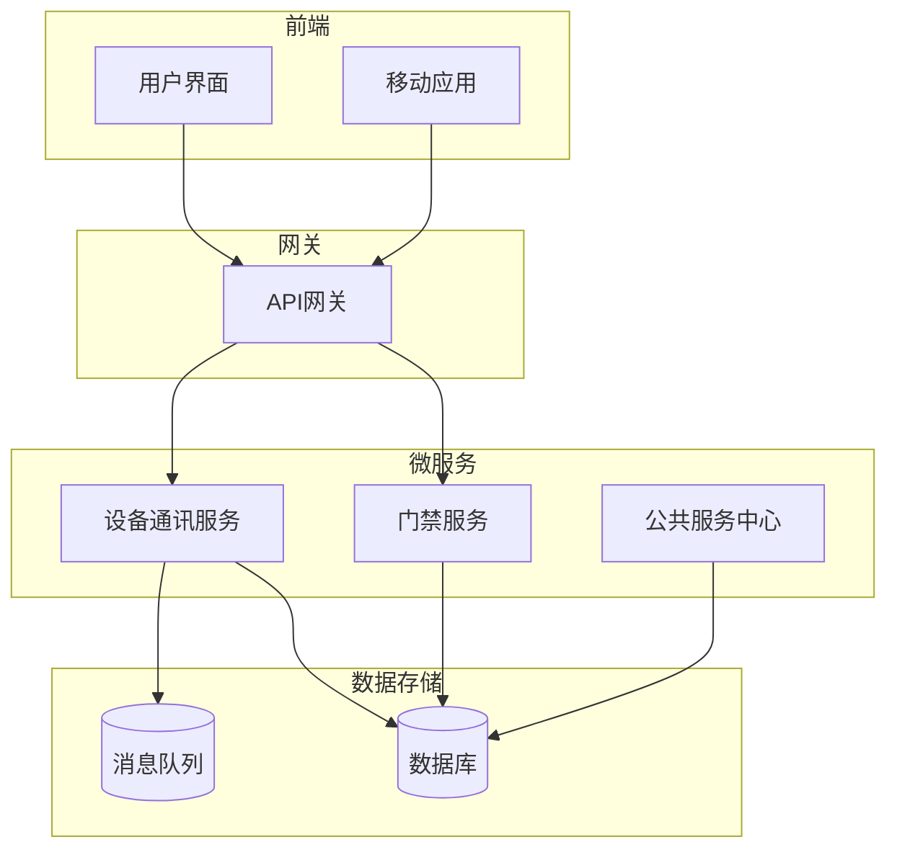
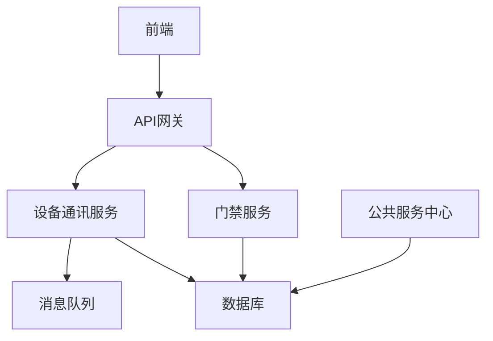
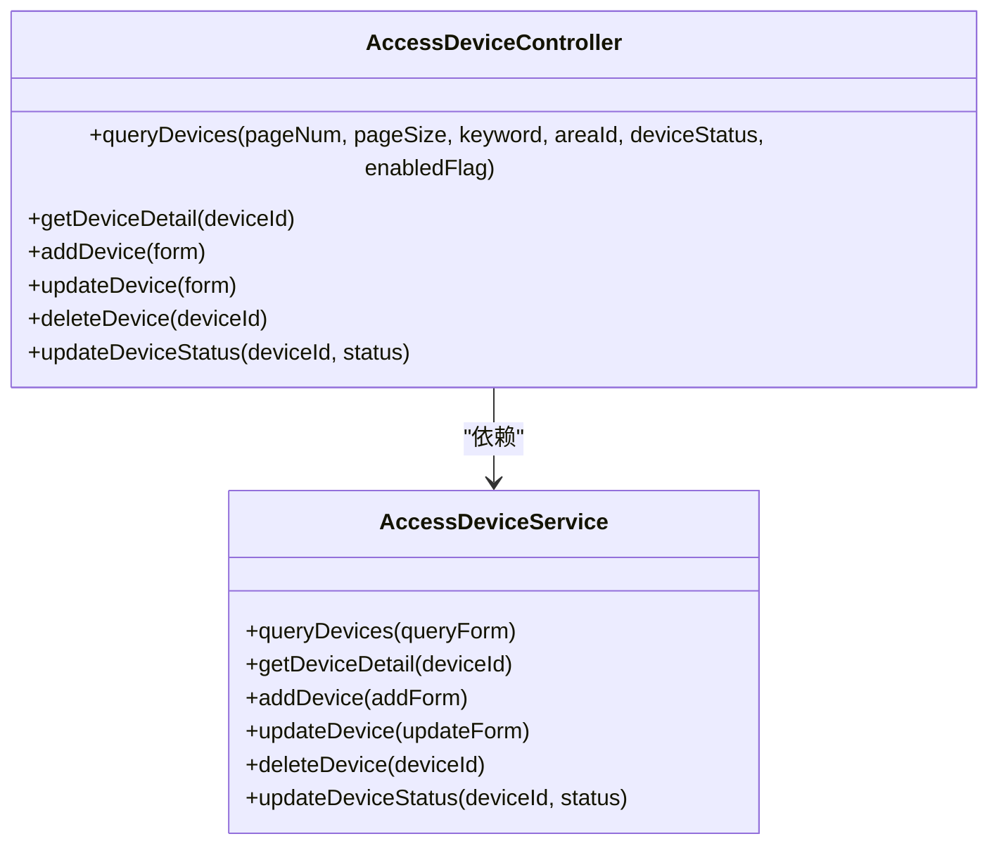
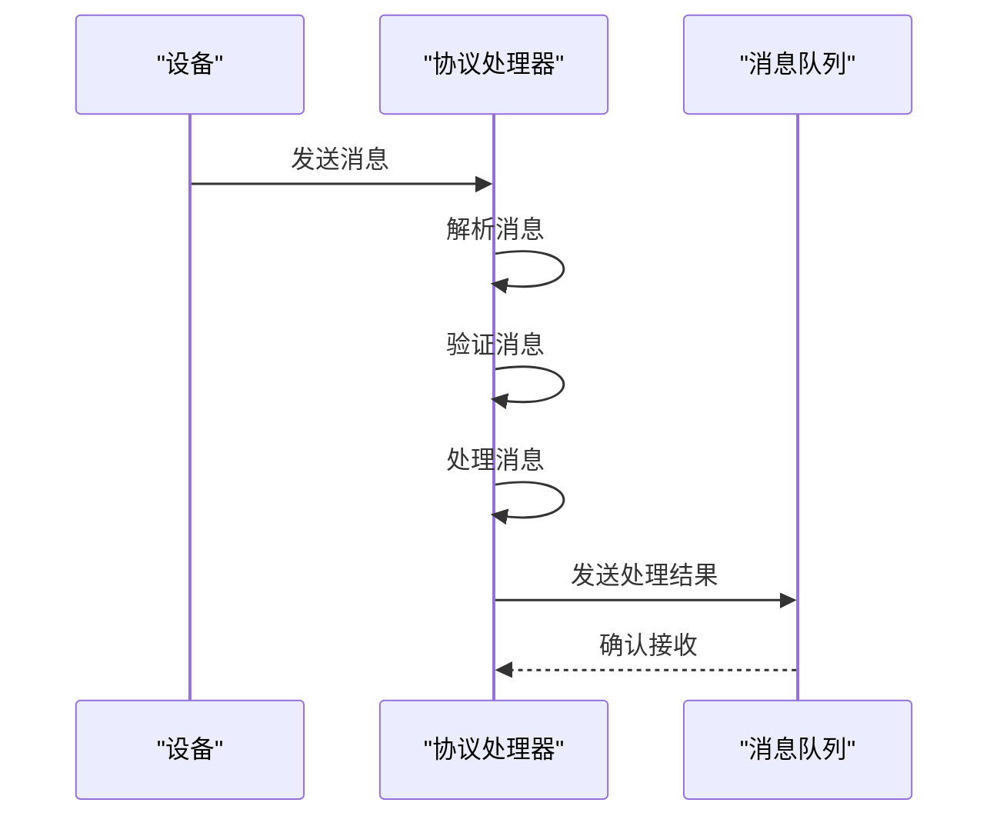
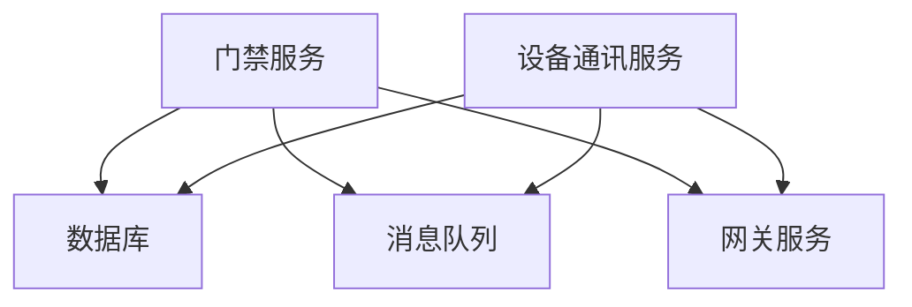

# 门禁设备管理

<cite>
**本文档引用文件**   
- [AccessDeviceController.java](file://microservices\ioedream-access-service\src\main\java\net\lab1024\sa\access\controller\AccessDeviceController.java)
- [AccessDeviceServiceImpl.java](file://microservices\ioedream-access-service\src\main\java\net\lab1024\sa\access\service\impl\AccessDeviceServiceImpl.java)
- [AccessProtocolHandler.java](file://microservices\ioedream-device-comm-service\src\main\java\net\lab1024\sa\devicecomm\protocol\handler\impl\AccessProtocolHandler.java)
- [ProtocolMessage.java](file://microservices\ioedream-device-comm-service\src\main\java\net\lab1024\sa\devicecomm\protocol\message\ProtocolMessage.java)
- [ProtocolTypeEnum.java](file://microservices\ioedream-device-comm-service\src\main\java\net\lab1024\sa\devicecomm\protocol\enums\ProtocolTypeEnum.java)
- [MinerU_安防PUSH通讯协议 （熵基科技）V4.8-20240107(水印版)__20251206181130.md](file://docs\各个设备通讯协议\MinerU_安防PUSH通讯协议 （熵基科技）V4.8-20240107(水印版)__20251206181130.md)
- [README.md](file://docs\各业务模块文档\门禁\README.md)
</cite>

## 目录
1. [引言](#引言)
2. [项目结构](#项目结构)
3. [核心组件](#核心组件)
4. [架构概述](#架构概述)
5. [详细组件分析](#详细组件分析)
6. [依赖分析](#依赖分析)
7. [性能考虑](#性能考虑)
8. [故障排除指南](#故障排除指南)
9. [结论](#结论)

## 引言
本文档详细介绍了门禁设备管理系统的完整流程，包括设备注册、配置、状态监控和远程控制。文档涵盖了通过API添加、编辑和删除门禁设备的方法，以及设备与控制器的绑定关系。此外，还解释了设备心跳检测、在线状态管理和固件升级机制。文档提供了设备通讯协议（熵基科技）的集成细节，包括数据格式、命令下发和响应处理，并包含设备故障诊断和恢复指南，以及常见通讯问题的解决方案。

## 项目结构
门禁设备管理系统由多个微服务组成，主要分为`ioedream-access-service`和`ioedream-device-comm-service`。`ioedream-access-service`负责门禁设备的CRUD操作、状态管理和查询，而`ioedream-device-comm-service`负责处理设备通讯协议，解析和处理来自设备的消息。

**图源**
- [README.md](file://docs\各业务模块文档\门禁\README.md)

**本节来源**
- [README.md](file://docs\各业务模块文档\门禁\README.md)

## 核心组件
门禁设备管理系统的核心组件包括设备管理控制器、设备服务实现类、协议处理器、协议消息类和协议类型枚举。这些组件共同协作，实现了设备的注册、配置、状态监控和远程控制功能。

**本节来源**
- [AccessDeviceController.java](file://microservices\ioedream-access-service\src\main\java\net\lab1024\sa\access\controller\AccessDeviceController.java)
- [AccessDeviceServiceImpl.java](file://microservices\ioedream-access-service\src\main\java\net\lab1024\sa\access\service\impl\AccessDeviceServiceImpl.java)
- [AccessProtocolHandler.java](file://microservices\ioedream-device-comm-service\src\main\java\net\lab1024\sa\devicecomm\protocol\handler\impl\AccessProtocolHandler.java)

## 架构概述
门禁设备管理系统的架构分为前端、网关、微服务和数据存储四个层次。前端通过API网关与后端微服务进行交互，微服务之间通过消息队列进行异步通信，确保系统的高可用性和可扩展性。

**图源**
- [README.md](file://docs\各业务模块文档\门禁\README.md)

## 详细组件分析

### 设备管理控制器分析
设备管理控制器提供了设备的CRUD操作、状态管理和查询功能。控制器通过RESTful API暴露这些功能，确保了接口的一致性和易用性。

#### 类图

**图源**
- [AccessDeviceController.java](file://microservices\ioedream-access-service\src\main\java\net\lab1024\sa\access\controller\AccessDeviceController.java)
- [AccessDeviceServiceImpl.java](file://microservices\ioedream-access-service\src\main\java\net\lab1024\sa\access\service\impl\AccessDeviceServiceImpl.java)

### 协议处理器分析
协议处理器负责解析和处理来自设备的消息。它根据设备的协议类型选择相应的处理逻辑，确保了对不同设备的支持。

#### 序列图

**图源**
- [AccessProtocolHandler.java](file://microservices\ioedream-device-comm-service\src\main\java\net\lab1024\sa\devicecomm\protocol\handler\impl\AccessProtocolHandler.java)

**本节来源**
- [AccessProtocolHandler.java](file://microservices\ioedream-device-comm-service\src\main\java\net\lab1024\sa\devicecomm\protocol\handler\impl\AccessProtocolHandler.java)

## 依赖分析
门禁设备管理系统依赖于多个外部服务和库，包括数据库、消息队列和网关服务。这些依赖确保了系统的稳定性和可扩展性。

**图源**
- [AccessDeviceServiceImpl.java](file://microservices\ioedream-access-service\src\main\java\net\lab1024\sa\access\service\impl\AccessDeviceServiceImpl.java)
- [AccessProtocolHandler.java](file://microservices\ioedream-device-comm-service\src\main\java\net\lab1024\sa\devicecomm\protocol\handler\impl\AccessProtocolHandler.java)

**本节来源**
- [AccessDeviceServiceImpl.java](file://microservices\ioedream-access-service\src\main\java\net\lab1024\sa\access\service\impl\AccessDeviceServiceImpl.java)
- [AccessProtocolHandler.java](file://microservices\ioedream-device-comm-service\src\main\java\net\lab1024\sa\devicecomm\protocol\handler\impl\AccessProtocolHandler.java)

## 性能考虑
门禁设备管理系统在设计时充分考虑了性能因素，通过异步处理和消息队列缓冲，提高了系统的吞吐量和响应速度。系统支持高并发处理，能够满足大规模设备管理的需求。

## 故障排除指南
当遇到设备通讯问题时，首先检查设备的网络连接和配置。确保设备的IP地址和端口正确无误。如果问题仍然存在，检查协议处理器的日志，查看是否有解析或处理错误。对于常见的通讯问题，可以参考文档中的解决方案。

**本节来源**
- [AccessProtocolHandler.java](file://microservices\ioedream-device-comm-service\src\main\java\net\lab1024\sa\devicecomm\protocol\handler\impl\AccessProtocolHandler.java)

## 结论
门禁设备管理系统通过模块化设计和微服务架构，实现了高效、可靠的设备管理。系统支持多种设备和协议，具备良好的扩展性和维护性。通过本文档，用户可以全面了解系统的架构和功能，快速上手并解决常见问题。