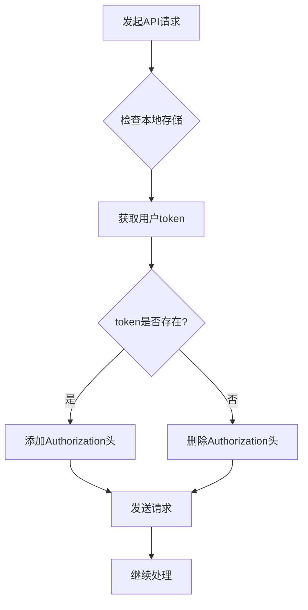
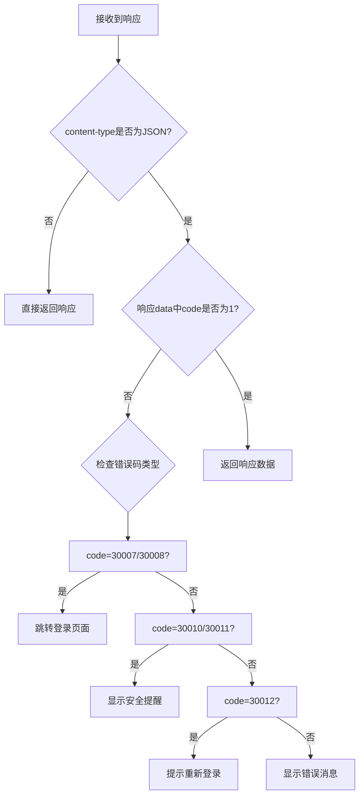
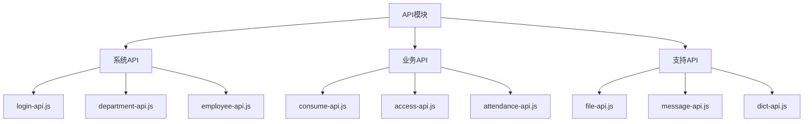
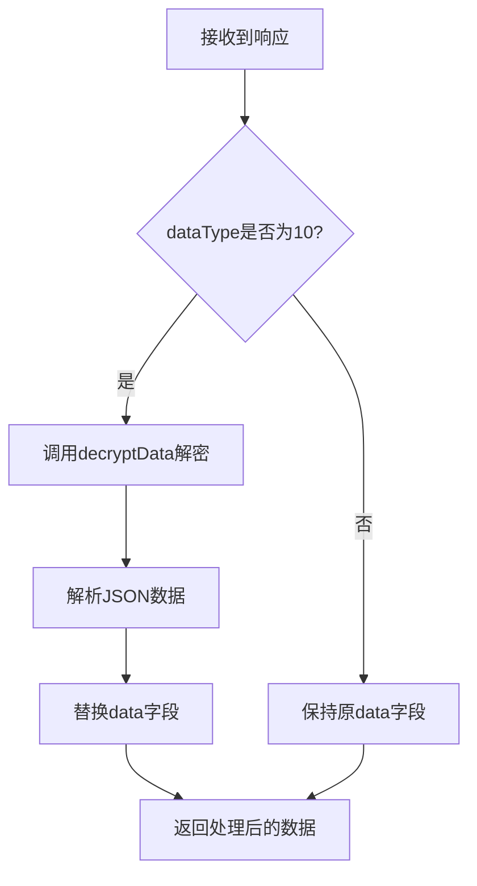
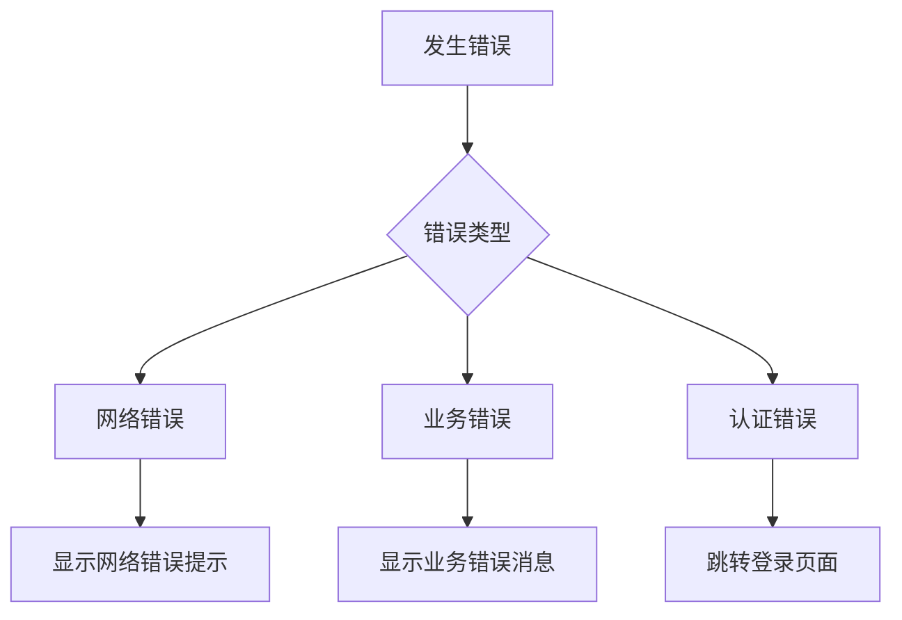

# API集成

<cite>
**本文档引用的文件**
- [axios.js](file://smart-admin-web-javascript/src/lib/axios.js#L1-L259)
- [login-api.js](file://smart-admin-web-javascript/src/api/system/login-api.js#L1-L55)
- [file-api.js](file://smart-admin-web-javascript/src/api/support/file-api.js#L1-L39)
- [consume-api.js](file://smart-admin-web-javascript/src/api/business/consume/consume-api.js#L1-L281)
- [access-api.js](file://smart-admin-web-javascript/src/api/business/access/access-api.js#L1-L74)
- [home-api.js](file://smart-admin-web-javascript/src/api/system/home-api.js#L1-L26)
- [message-api.js](file://smart-admin-web-javascript/src/api/support/message-api.js#L1-L32)
- [common-const.js](file://smart-admin-web-javascript/src/constants/common-const.js#L1-L73)
- [local-storage-key-const.js](file://smart-admin-web-javascript/src/constants/local-storage-key-const.js#L1-L34)
- [package.json](file://smart-admin-web-javascript/package.json#L1-L76)
- [vite.config.js](file://smart-admin-web-javascript/vite.config.js#L1-L100)
- [.env.development](file://smart-admin-web-javascript/.env.development#L1-L3)
</cite>

## 目录
1. [API封装策略](#api封装策略)
2. [请求与响应拦截器](#请求与响应拦截器)
3. [API模块化组织方式](#api模块化组织方式)
4. [请求参数序列化与响应数据格式](#请求参数序列化与响应数据格式)
5. [API调用示例](#api调用示例)
6. [错误处理与重试机制](#错误处理与重试机制)
7. [API文档生成与维护](#api文档生成与维护)

## API封装策略

本项目基于axios库实现了统一的API封装策略，通过创建自定义的axios实例和封装请求方法，提供了标准化的API调用接口。核心封装文件位于`src/lib/axios.js`，其中创建了名为`smartAxios`的axios实例，并配置了基础URL从环境变量`VITE_APP_API_URL`读取。

封装策略主要包括：
- 创建独立的axios实例，避免全局污染
- 统一配置基础URL，支持不同环境的API地址切换
- 提供标准化的请求方法封装（getRequest、postRequest等）
- 实现请求和响应拦截器，处理通用逻辑
- 支持文件上传和下载的特殊处理

**API封装策略的实现通过以下核心文件完成：**
- axios实例配置和拦截器：`src/lib/axios.js`
- 环境变量配置：`.env.development`等环境文件
- 构建配置：`vite.config.js`

**API封装策略**
- [axios.js](file://smart-admin-web-javascript/src/lib/axios.js#L1-L259)
- [vite.config.js](file://smart-admin-web-javascript/vite.config.js#L1-L100)
- [.env.development](file://smart-admin-web-javascript/.env.development#L1-L3)

## 请求与响应拦截器

### 请求拦截器

请求拦截器在`src/lib/axios.js`中定义，主要功能是在发送请求前自动添加认证token。拦截器会从本地存储中读取用户token，并将其添加到请求头的`Authorization`字段中，格式为`Bearer + token`。



**请求拦截器的主要逻辑包括：**
1. 从本地存储读取用户token
2. 如果token存在，则在请求头中添加`Authorization: Bearer + token`
3. 如果token不存在，则删除请求头中的`Authorization`字段

### 响应拦截器

响应拦截器负责处理服务器返回的响应，包括错误处理、响应解包和特殊状态码处理。拦截器会检查响应的content-type，判断是否为JSON数据，并根据响应数据中的code字段决定是否成功。

对于特定的错误码，拦截器会执行相应的处理：
- `30007`或`30008`：token过期或已在别处登录，自动跳转到登录页面
- `30010`或`30011`：等保安全提醒，显示模态框提示
- `30012`：长时间未操作，需要重新登录



**请求与响应拦截器**
- [axios.js](file://smart-admin-web-javascript/src/lib/axios.js#L41-L135)

## API模块化组织方式

API文件按照系统、业务和支持三个维度进行组织，形成了清晰的模块化结构。这种组织方式有助于维护和管理大量的API接口。

### 系统API (system)
系统API包含与系统核心功能相关的接口，如登录、用户管理、部门管理等。这些API位于`src/api/system/`目录下。



### 业务API (business)
业务API按具体业务领域划分，如消费、门禁、考勤等。每个业务领域都有独立的API文件，位于`src/api/business/`目录下对应的子目录中。

### 支持API (support)
支持API包含系统支持功能的接口，如文件上传下载、消息通知、字典管理等。这些API位于`src/api/support/`目录下。

**API模块化组织方式**
- [login-api.js](file://smart-admin-web-javascript/src/api/system/login-api.js#L1-L55)
- [consume-api.js](file://smart-admin-web-javascript/src/api/business/consume/consume-api.js#L1-L281)
- [access-api.js](file://smart-admin-web-javascript/src/api/business/access/access-api.js#L1-L74)
- [file-api.js](file://smart-admin-web-javascript/src/api/support/file-api.js#L1-L39)

## 请求参数序列化与响应数据格式

### 请求参数序列化

项目中使用axios默认的参数序列化方式，GET请求的参数会自动转换为查询字符串，POST请求的数据会作为请求体发送。对于文件上传等特殊场景，使用FormData格式。

### 响应数据格式

所有API响应都遵循统一的数据格式，包含`code`、`data`和`message`三个主要字段：

```json
{
  "code": 1,
  "data": {},
  "msg": "操作成功"
}
```

- `code`：状态码，1表示成功，其他值表示不同类型的错误
- `data`：返回的具体数据
- `message`：描述信息，用于前端显示

对于加密数据，响应格式会包含额外的`dataType`字段，标识数据为加密类型：

```json
{
  "code": 1,
  "data": "加密后的数据",
  "dataType": 10,
  "msg": "操作成功"
}
```

响应拦截器会自动检测`dataType`为10的加密数据，并使用`decryptData`函数进行解密，然后将解密后的JSON数据赋值给`data`字段。



**响应数据格式处理**
- [axios.js](file://smart-admin-web-javascript/src/lib/axios.js#L76-L83)
- [common-const.js](file://smart-admin-web-javascript/src/constants/common-const.js#L61-L71)

## API调用示例

### GET请求

GET请求通过`getRequest`方法实现，参数作为查询参数附加到URL后面：

```javascript
// 示例：获取登录信息
import { loginApi } from '/@/api/system/login-api';

loginApi.getLoginInfo().then(response => {
  console.log('登录信息:', response.data);
}).catch(error => {
  console.error('获取登录信息失败:', error);
});
```

### POST请求

POST请求通过`postRequest`方法实现，数据作为请求体发送：

```javascript
// 示例：执行消费交易
import { consumeApi } from '/@/api/business/consume/consume-api';

const transactionData = {
  accountId: '123',
  amount: 100,
  deviceCode: 'DEVICE001'
};

consumeApi.executeTransaction(transactionData).then(response => {
  console.log('交易结果:', response.data);
}).catch(error => {
  console.error('交易失败:', error);
});
```

### 文件上传

文件上传通过`file-api.js`中的`uploadFile`方法实现，使用FormData格式：

```javascript
// 示例：上传文件
import { fileApi } from '/@/api/support/file-api';

const uploadFile = (file, folder) => {
  const formData = new FormData();
  formData.append('file', file);
  
  return fileApi.uploadFile(formData, folder);
};

// 使用示例
const fileInput = document.getElementById('fileInput');
const file = fileInput.files[0];
uploadFile(file, 'avatar').then(response => {
  console.log('上传成功:', response.data);
}).catch(error => {
  console.error('上传失败:', error);
});
```

### 文件下载

文件下载通过`getDownload`或`postDownload`方法实现，支持从后端流式下载文件：

```javascript
// 示例：下载文件
import { fileApi } from '/@/api/support/file-api';

// 通过fileKey下载文件
const downloadFile = (fileKey) => {
  fileApi.downLoadFile(fileKey);
};

// 使用示例
downloadFile('12345');
```

**API调用示例**
- [login-api.js](file://smart-admin-web-javascript/src/api/system/login-api.js#L1-L55)
- [consume-api.js](file://smart-admin-web-javascript/src/api/business/consume/consume-api.js#L1-L281)
- [file-api.js](file://smart-admin-web-javascript/src/api/support/file-api.js#L1-L39)

## 错误处理与重试机制

### 错误处理

项目实现了多层次的错误处理机制：

1. **网络错误处理**：在响应拦截器中处理网络超时、连接错误等网络层面的异常
2. **业务错误处理**：根据响应中的`code`字段处理业务逻辑错误
3. **特殊状态处理**：对特定的错误码（如token过期）执行特殊处理逻辑



### 重试机制

虽然当前代码中没有显式的重试机制实现，但可以通过以下方式实现：

```javascript
// 示例：带重试机制的请求函数
const requestWithRetry = (requestFn, maxRetries = 3) => {
  return new Promise((resolve, reject) => {
    const attempt = (retryCount) => {
      requestFn().then(resolve).catch(error => {
        if (retryCount < maxRetries) {
          setTimeout(() => {
            attempt(retryCount + 1);
          }, 1000 * Math.pow(2, retryCount)); // 指数退避
        } else {
          reject(error);
        }
      });
    };
    attempt(0);
  });
};

// 使用示例
requestWithRetry(() => loginApi.getLoginInfo())
  .then(data => console.log('成功:', data))
  .catch(error => console.error('最终失败:', error));
```

**错误处理**
- [axios.js](file://smart-admin-web-javascript/src/lib/axios.js#L121-L134)

## API文档生成与维护

### 最佳实践

1. **代码注释规范化**：每个API方法都应有详细的JSDoc注释，包括功能描述、参数说明和返回值说明
2. **统一的API契约**：遵循统一的API设计规范，确保所有API接口风格一致
3. **版本控制**：通过Git管理API文档的变更历史
4. **自动化文档生成**：利用工具从代码注释自动生成API文档

### 文档维护

1. **及时更新**：API变更时同步更新文档
2. **示例代码**：为每个API提供调用示例
3. **错误码文档**：维护完整的错误码对照表
4. **变更日志**：记录API的重大变更

项目中的API文档维护遵循以下原则：
- 每个API文件头部包含作者、日期和版权信息
- 每个API方法都有详细的注释说明
- 使用统一的命名规范和代码风格

**API文档生成与维护**
- [consume-api.js](file://smart-admin-web-javascript/src/api/business/consume/consume-api.js#L1-L281)
- [access-api.js](file://smart-admin-web-javascript/src/api/business/access/access-api.js#L1-L74)