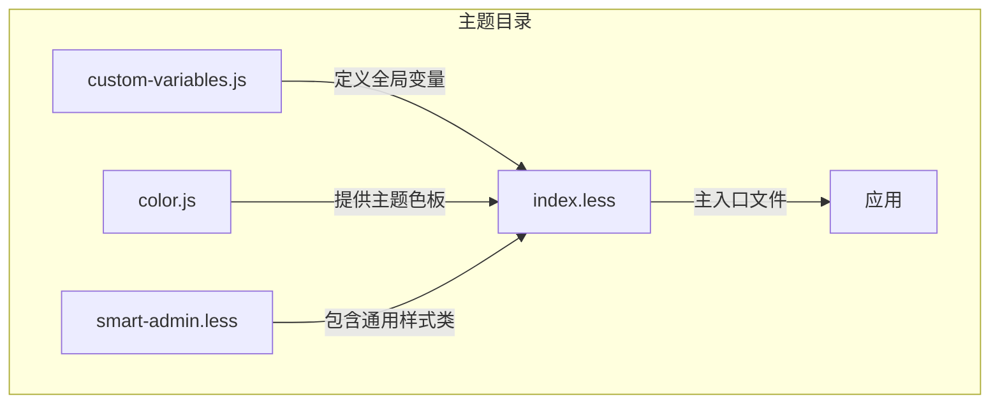
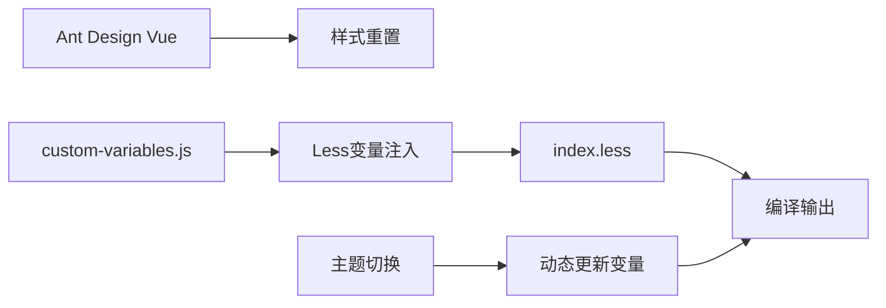
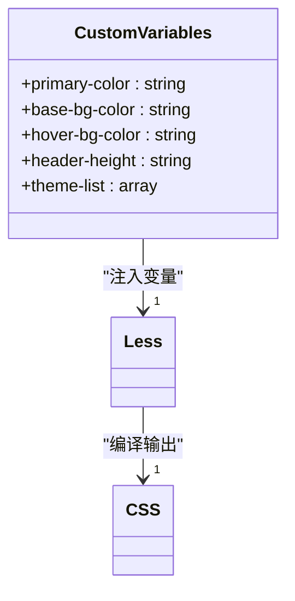
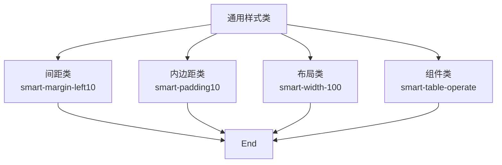
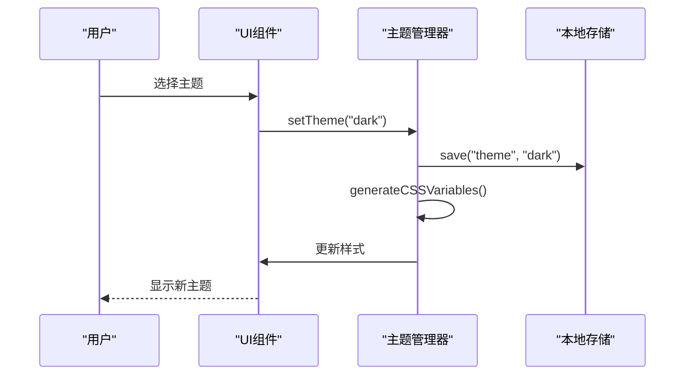
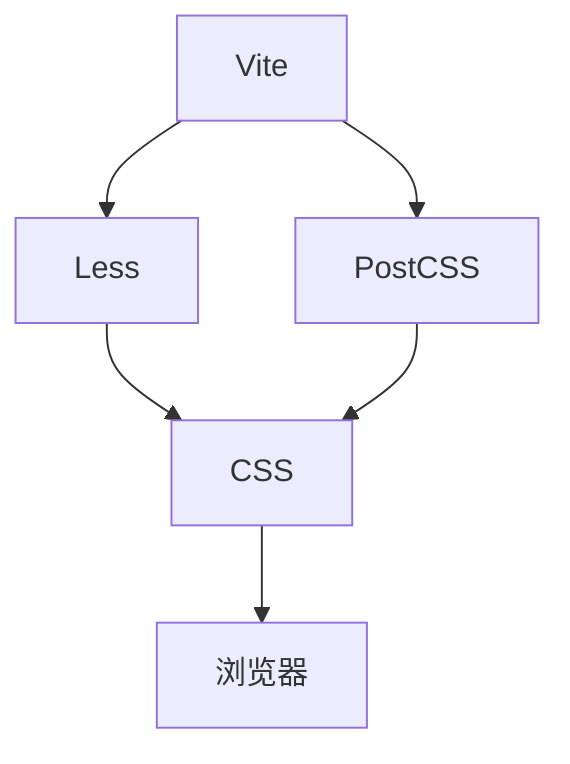

# 主题与样式

<cite>
**本文档引用文件**  
- [custom-variables.js](file://smart-admin-web-javascript/src/theme/custom-variables.js)
- [smart-admin.less](file://smart-admin-web-javascript/src/theme/smart-admin.less)
- [index.less](file://smart-admin-web-javascript/src/theme/index.less)
- [color.js](file://smart-admin-web-javascript/src/theme/color.js)
- [postcss.config.cjs](file://smart-admin-web-javascript/postcss.config.cjs)
</cite>

## 目录
1. [简介](#简介)
2. [项目结构](#项目结构)
3. [核心组件](#核心组件)
4. [架构概述](#架构概述)
5. [详细组件分析](#详细组件分析)
6. [依赖分析](#依赖分析)
7. [性能考虑](#性能考虑)
8. [故障排除指南](#故障排除指南)
9. [结论](#结论)
10. [附录](#附录)（如有必要）

## 简介
本文档详细阐述了前端主题与样式的实现方案，重点介绍基于Less的样式管理机制、CSS预处理器的应用、BEM命名规范、主题切换功能以及样式性能优化策略。文档旨在为开发人员提供全面的样式开发指导，确保项目在视觉一致性和代码可维护性方面达到高标准。

## 项目结构
项目采用模块化的主题管理结构，将样式配置、变量定义和通用样式分离，便于维护和扩展。主题相关文件集中存放在`src/theme`目录下，通过Less预处理器实现动态样式编译。



**图表来源**  
- [custom-variables.js](file://smart-admin-web-javascript/src/theme/custom-variables.js)
- [smart-admin.less](file://smart-admin-web-javascript/src/theme/smart-admin.less)
- [index.less](file://smart-admin-web-javascript/src/theme/index.less)

**章节来源**  
- [smart-admin-web-javascript/src/theme](file://smart-admin-web-javascript/src/theme)

## 核心组件
系统的核心样式组件包括全局变量配置、通用样式类库和主题切换机制。通过`custom-variables.js`定义的Less变量实现了样式的动态化管理，`smart-admin.less`提供了丰富的工具类，而`index.less`作为入口文件整合了所有样式资源。

**章节来源**  
- [custom-variables.js](file://smart-admin-web-javascript/src/theme/custom-variables.js#L1-L20)
- [smart-admin.less](file://smart-admin-web-javascript/src/theme/smart-admin.less#L1-L110)

## 架构概述
系统采用基于Less的样式架构，结合Ant Design Vue的样式体系，实现了高度可定制的主题方案。通过JavaScript动态生成Less变量，实现了运行时主题切换功能。



**图表来源**  
- [index.less](file://smart-admin-web-javascript/src/theme/index.less#L1-L118)
- [custom-variables.js](file://smart-admin-web-javascript/src/theme/custom-variables.js#L1-L20)

## 详细组件分析

### 样式变量管理分析
系统通过`custom-variables.js`文件管理所有全局样式变量，这些变量在构建时被注入到Less编译流程中，实现了样式的动态配置。



**图表来源**  
- [custom-variables.js](file://smart-admin-web-javascript/src/theme/custom-variables.js#L1-L20)

### 通用样式类分析
`smart-admin.less`文件定义了一系列通用工具类，包括间距、布局和组件样式，遵循统一的命名规范。



**图表来源**  
- [smart-admin.less](file://smart-admin-web-javascript/src/theme/smart-admin.less#L1-L110)

### 主题切换机制分析
系统实现了完整的主题切换功能，支持多种预设主题，并可通过JavaScript动态更新。



**图表来源**  
- [color.js](file://smart-admin-web-javascript/src/theme/color.js#L1-L64)
- [custom-variables.js](file://smart-admin-web-javascript/src/theme/custom-variables.js#L1-L20)

## 依赖分析
项目依赖于Less预处理器和PostCSS工具链，通过Vite构建系统实现高效的样式编译和优化。



**图表来源**  
- [package.json](file://smart-admin-web-javascript/package.json#L56-L57)
- [postcss.config.cjs](file://smart-admin-web-javascript/postcss.config.cjs#L1-L5)

**章节来源**  
- [package.json](file://smart-admin-web-javascript/package.json#L1-L76)
- [postcss.config.cjs](file://smart-admin-web-javascript/postcss.config.cjs#L1-L5)

## 性能考虑
在样式性能方面，建议采用以下优化策略：
- 使用CSS变量减少重绘重排
- 合理使用`will-change`属性
- 避免过度嵌套的CSS选择器
- 利用浏览器的样式缓存机制
- 采用懒加载策略加载非关键样式

**章节来源**  
- [index.less](file://smart-admin-web-javascript/src/theme/index.less#L15-L20)
- [smart-admin.less](file://smart-admin-web-javascript/src/theme/smart-admin.less#L12-L31)

## 故障排除指南
当遇到样式相关问题时，请按以下步骤排查：
1. 检查Less变量是否正确注入
2. 验证CSS类名是否遵循BEM规范
3. 确认主题切换逻辑是否正常工作
4. 检查PostCSS配置是否正确
5. 验证构建输出是否包含预期样式

**章节来源**  
- [custom-variables.js](file://smart-admin-web-javascript/src/theme/custom-variables.js#L1-L20)
- [postcss.config.cjs](file://smart-admin-web-javascript/postcss.config.cjs#L1-L5)

## 结论
本文档详细介绍了前端主题与样式的实现方案，涵盖了从变量管理到主题切换的完整流程。通过采用Less预处理器和BEM命名规范，系统实现了高度可维护和可扩展的样式架构。建议开发人员遵循文档中的最佳实践，确保代码质量和用户体验的一致性。

## 附录
### BEM命名规范示例
```html
<!-- Block -->
<div class="employee-container">
  <!-- Element -->
  <div class="employee-container__header">
    <!-- Modifier -->
    <h2 class="employee-container__title employee-container__title--highlight">员工列表</h2>
  </div>
</div>
```

**章节来源**  
- [AI二次开发规范文档.md](file://smart-admin-web-javascript/docs/AI二次开发规范文档.md#L1429-L1466)