# 前端架构

<cite>
**本文档引用的文件**   
- [main.js](file://smart-admin-web-javascript/src/main.js)
- [App.vue](file://smart-admin-web-javascript/src/App.vue)
- [vite.config.js](file://smart-admin-web-javascript/vite.config.js)
- [package.json](file://smart-admin-web-javascript/package.json)
- [router/index.js](file://smart-admin-web-javascript/src/router/index.js)
- [store/index.js](file://smart-admin-web-javascript/src/store/index.js)
- [lib/axios.js](file://smart-admin-web-javascript/src/lib/axios.js)
- [layout/index.vue](file://smart-admin-web-javascript/src/layout/index.vue)
- [constants/index.js](file://smart-admin-web-javascript/src/constants/index.js)
- [store/modules/system/user.js](file://smart-admin-web-javascript/src/store/modules/system/user.js)
- [store/modules/system/dict.js](file://smart-admin-web-javascript/src/store/modules/system/dict.js)
- [components/framework/smart-loading/index.js](file://smart-admin-web-javascript/src/components/framework/smart-loading/index.js)
- [views/system/home/index.vue](file://smart-admin-web-javascript/src/views/system/home/index.vue)
- [api/system/login-api.js](file://smart-admin-web-javascript/src/api/system/login-api.js)
</cite>

## 目录
1. [项目结构](#项目结构)
2. [四层架构设计](#四层架构设计)
3. [Vue3组件化架构](#vue3组件化架构)
4. [Pinia状态管理](#pinia状态管理)
5. [Vue Router动态路由系统](#vue-router动态路由系统)
6. [API集成模式](#api集成模式)
7. [架构关系图](#架构关系图)
8. [性能优化策略](#性能优化策略)

## 项目结构

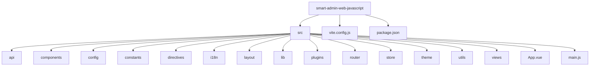

**Diagram sources**
- [vite.config.js](file://smart-admin-web-javascript/vite.config.js)
- [package.json](file://smart-admin-web-javascript/package.json)

**Section sources**
- [vite.config.js](file://smart-admin-web-javascript/vite.config.js)
- [package.json](file://smart-admin-web-javascript/package.json)

## 四层架构设计

smart-admin-web-javascript项目采用清晰的四层架构设计，将前端应用划分为视图层、逻辑层、服务层和数据层，实现了关注点分离和代码解耦。

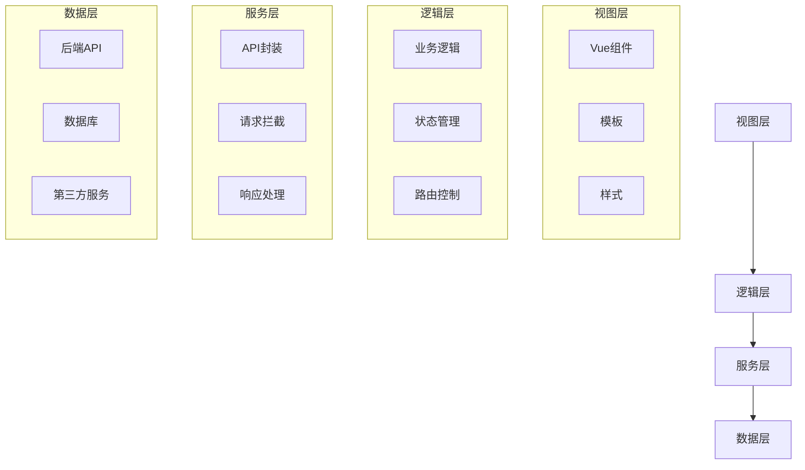

**Diagram sources**
- [main.js](file://smart-admin-web-javascript/src/main.js)
- [App.vue](file://smart-admin-web-javascript/src/App.vue)
- [store/index.js](file://smart-admin-web-javascript/src/store/index.js)
- [router/index.js](file://smart-admin-web-javascript/src/router/index.js)

**Section sources**
- [main.js](file://smart-admin-web-javascript/src/main.js)
- [App.vue](file://smart-admin-web-javascript/src/App.vue)

## Vue3组件化架构

### 组件组织方式

项目采用功能模块化的组件组织方式，将组件按照业务领域进行分类管理。src/components目录下包含business（业务）、framework（框架）、support（支持）和system（系统）四个主要分类，每个分类下根据具体功能进一步细分。

```mermaid
graph TD
A[components] --> B[business]
A --> C[framework]
A --> D[support]
A --> E[system]
B --> B1[category-tree-select]
B --> B2[oa]
C --> C1[area-cascader]
C --> C2[boolean-select]
C --> C3[icon-select]
C --> C4[iframe]
C --> C5[smart-copy-icon]
C --> C6[smart-enum-checkbox]
C --> C7[smart-enum-radio]
C --> C8[smart-enum-select]
C --> C9[smart-loading]
C --> C10[text-ellipsis]
C --> C11[wangeditor]
D --> D1[data-tracer]
D --> D2[dict-code-select]
D --> D3[dict-label]
D --> D4[dict-select]
D --> D5[file-preview]
D --> D6[file-preview-modal]
D --> D7[file-upload]
D --> D8[table-header-cell]
D --> D9[table-operator]
E --> E1[department-tree-select]
E --> E2[employee-select]
E --> E3[employee-table-select-modal]
E --> E4[menu-tree-select]
E --> E5[position-select]
```

**Diagram sources**
- [components](file://smart-admin-web-javascript/src/components)

### 组件复用模式

项目通过创建通用组件库实现了高度的组件复用。框架组件（framework）提供了一系列可复用的基础UI组件，如：

- **area-cascader**: 地区级联选择器
- **boolean-select**: 布尔值选择器
- **icon-select**: 图标选择器
- **smart-enum-select**: 枚举选择器
- **text-ellipsis**: 文本省略组件

这些组件被广泛应用于各个业务模块中，确保了UI风格的一致性并减少了重复代码。

### 组件通信机制

项目采用Vue3的Composition API和Pinia状态管理相结合的通信机制。组件间通信主要通过以下方式实现：

1. **Props/Emits**: 父子组件间的基本通信方式
2. **Pinia Store**: 跨组件状态共享
3. **Provide/Inject**: 祖先组件向后代组件传递数据
4. **Event Bus**: 使用mitt库实现事件总线模式

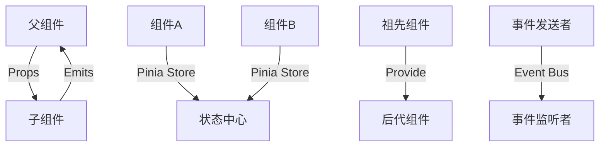

**Diagram sources**
- [main.js](file://smart-admin-web-javascript/src/main.js)
- [store/index.js](file://smart-admin-web-javascript/src/store/index.js)

**Section sources**
- [main.js](file://smart-admin-web-javascript/src/main.js)
- [store/index.js](file://smart-admin-web-javascript/src/store/index.js)

## Pinia状态管理

### 模块化Store设计

项目采用模块化的Pinia Store设计，将全局状态按功能领域划分为多个独立的模块。src/store/modules目录下包含business（业务）和system（系统）两个主要模块，每个模块负责管理特定领域的状态。

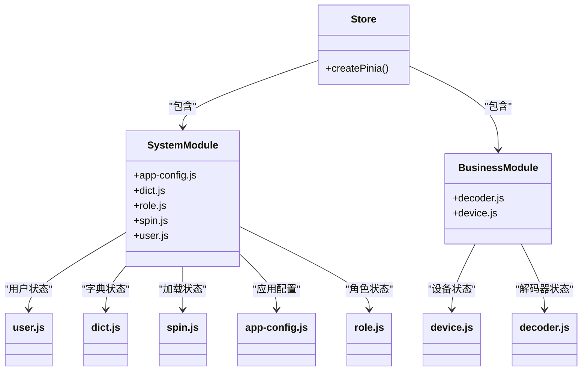

**Diagram sources**
- [store/index.js](file://smart-admin-web-javascript/src/store/index.js)
- [store/modules/system/user.js](file://smart-admin-web-javascript/src/store/modules/system/user.js)
- [store/modules/system/dict.js](file://smart-admin-web-javascript/src/store/modules/system/dict.js)

### 核心状态管理

#### 用户状态管理

user.js模块管理用户相关的所有状态，包括用户基本信息、菜单权限、标签页、缓存等。

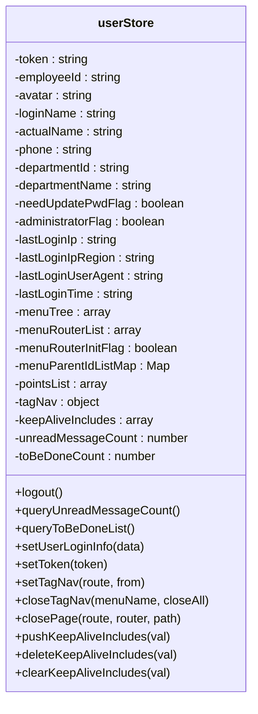

**Diagram sources**
- [store/modules/system/user.js](file://smart-admin-web-javascript/src/store/modules/system/user.js)

#### 字典状态管理

dict.js模块管理数据字典相关的状态，提供字典数据的获取、刷新和初始化功能。

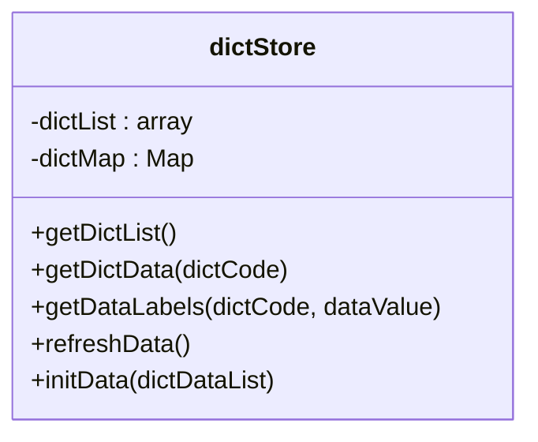

**Diagram sources**
- [store/modules/system/dict.js](file://smart-admin-web-javascript/src/store/modules/system/dict.js)

**Section sources**
- [store/modules/system/user.js](file://smart-admin-web-javascript/src/store/modules/system/user.js)
- [store/modules/system/dict.js](file://smart-admin-web-javascript/src/store/modules/system/dict.js)

## Vue Router动态路由系统

### 动态路由实现

项目采用基于后端数据的动态路由系统，路由信息在用户登录后从服务器获取并动态构建。这种设计实现了权限驱动的路由控制，确保用户只能访问其权限范围内的页面。

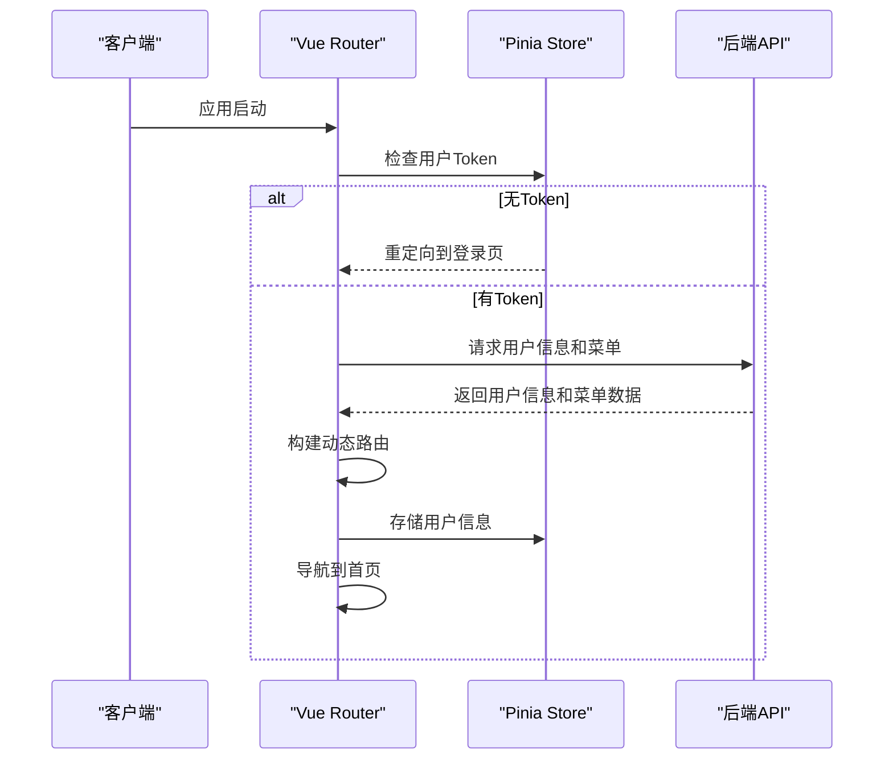

**Diagram sources**
- [main.js](file://smart-admin-web-javascript/src/main.js)
- [router/index.js](file://smart-admin-web-javascript/src/router/index.js)
- [api/system/login-api.js](file://smart-admin-web-javascript/src/api/system/login-api.js)

### 路由守卫

项目实现了完整的路由守卫机制，包括前置守卫和后置守卫，用于处理权限验证、进度条显示等逻辑。

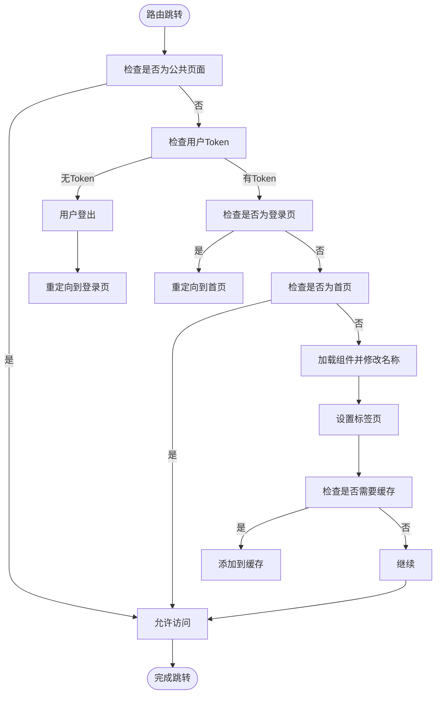

**Diagram sources**
- [router/index.js](file://smart-admin-web-javascript/src/router/index.js)

### 懒加载和权限控制

路由系统实现了组件的懒加载和基于菜单的权限控制。每个路由的组件都采用动态导入的方式，确保按需加载。

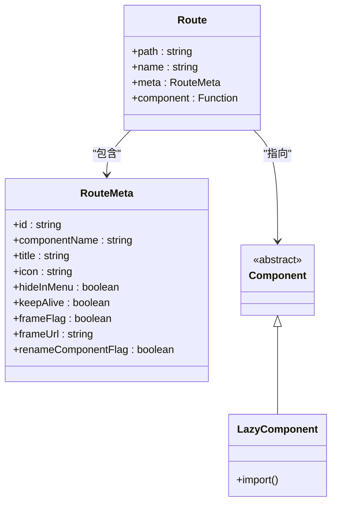

**Diagram sources**
- [router/index.js](file://smart-admin-web-javascript/src/router/index.js)

**Section sources**
- [router/index.js](file://smart-admin-web-javascript/src/router/index.js)

## API集成模式

### Axios封装

项目对axios进行了全面封装，提供了统一的请求配置、拦截器和错误处理机制。

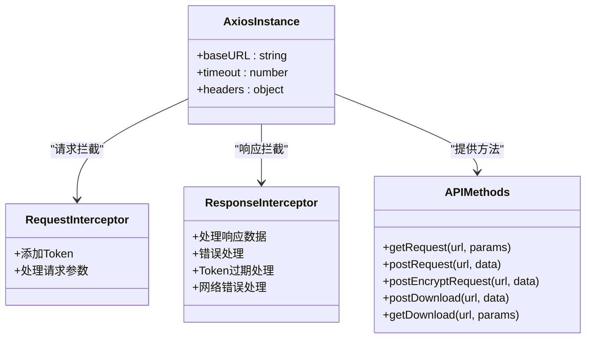

**Diagram sources**
- [lib/axios.js](file://smart-admin-web-javascript/src/lib/axios.js)

### 请求拦截器

请求拦截器负责在发送请求前添加认证Token和其他必要信息。

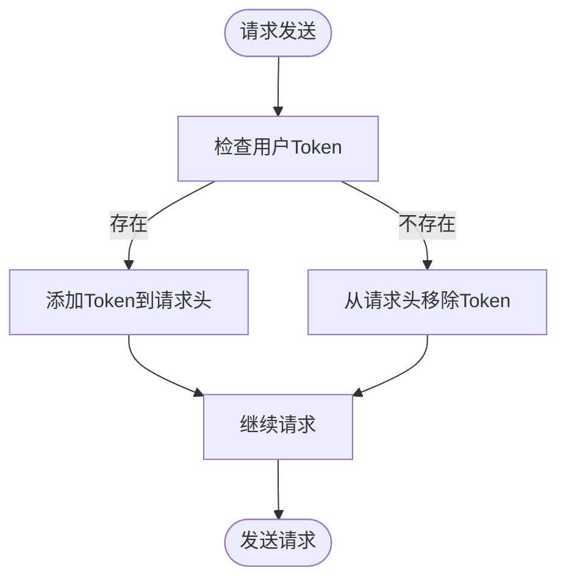

**Diagram sources**
- [lib/axios.js](file://smart-admin-web-javascript/src/lib/axios.js)

### 响应拦截器

响应拦截器处理服务器响应，包括数据解密、错误处理和状态码判断。

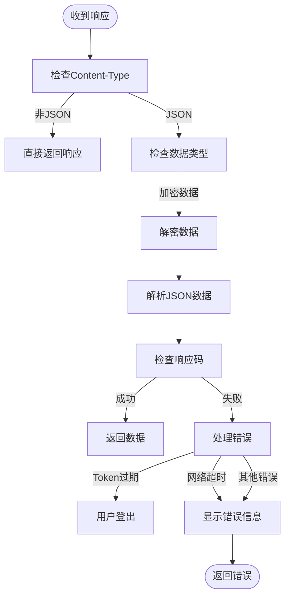

**Diagram sources**
- [lib/axios.js](file://smart-admin-web-javascript/src/lib/axios.js)

### API调用方法

项目提供了多种API调用方法，满足不同场景的需求。

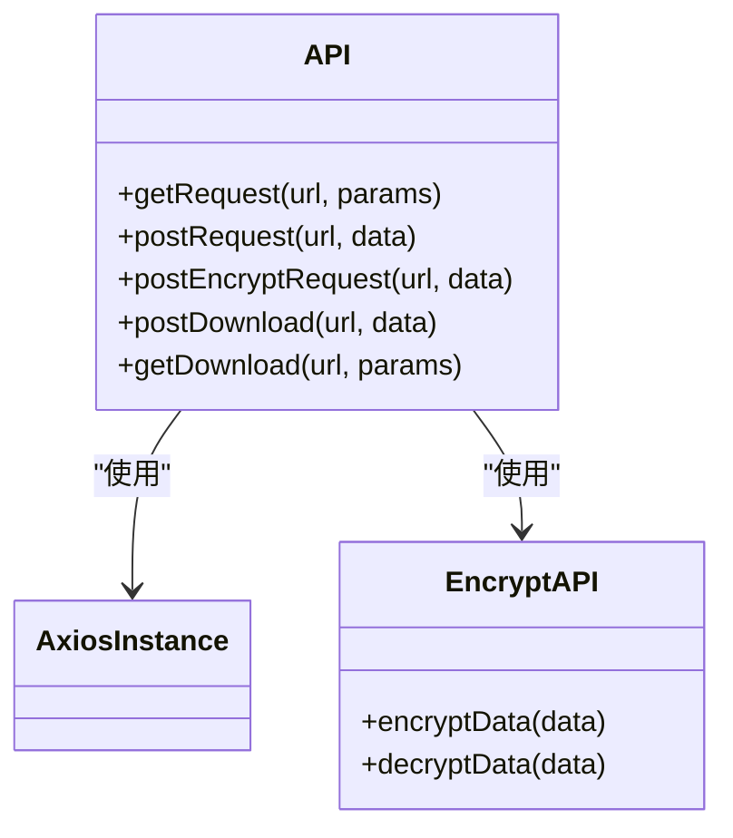

**Diagram sources**
- [lib/axios.js](file://smart-admin-web-javascript/src/lib/axios.js)
- [lib/encrypt.js](file://smart-admin-web-javascript/src/lib/encrypt.js)

**Section sources**
- [lib/axios.js](file://smart-admin-web-javascript/src/lib/axios.js)

## 架构关系图

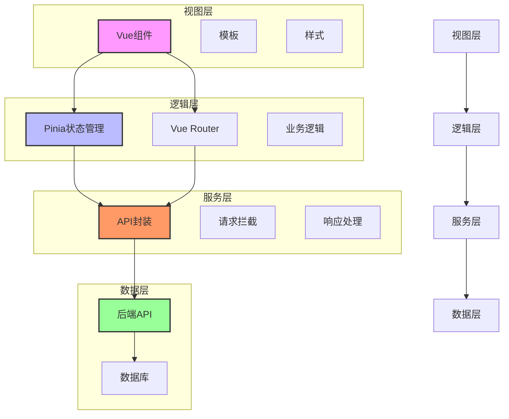

**Diagram sources**
- [main.js](file://smart-admin-web-javascript/src/main.js)
- [App.vue](file://smart-admin-web-javascript/src/App.vue)
- [store/index.js](file://smart-admin-web-javascript/src/store/index.js)
- [router/index.js](file://smart-admin-web-javascript/src/router/index.js)
- [lib/axios.js](file://smart-admin-web-javascript/src/lib/axios.js)

## 性能优化策略

### 代码分割

项目通过Vite的代码分割功能，将第三方库和业务代码分别打包，优化加载性能。

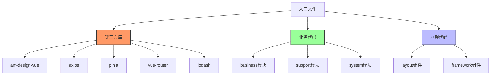

**Diagram sources**
- [vite.config.js](file://smart-admin-web-javascript/vite.config.js)

### 懒加载

项目实现了路由组件的懒加载，确保按需加载，减少初始加载时间。

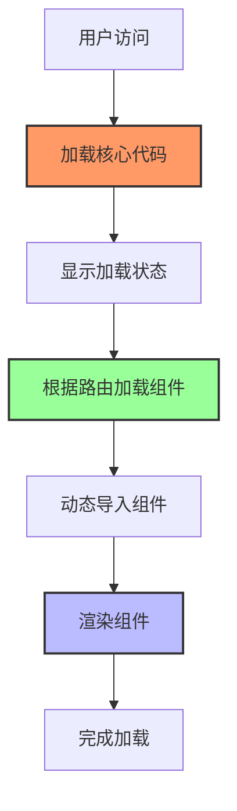

**Diagram sources**
- [router/index.js](file://smart-admin-web-javascript/src/router/index.js)

### 缓存机制

项目通过多种缓存机制提升用户体验和性能。

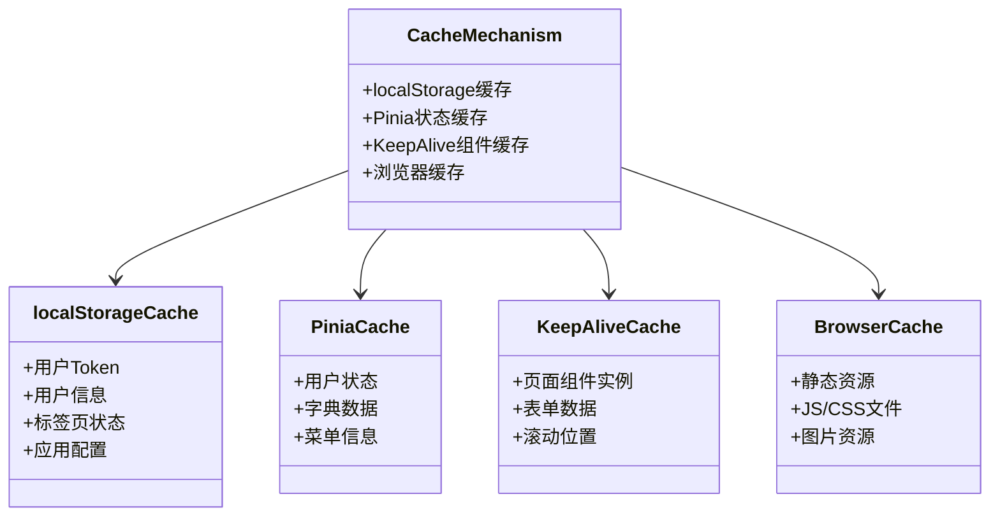

**Diagram sources**
- [store/modules/system/user.js](file://smart-admin-web-javascript/src/store/modules/system/user.js)
- [router/index.js](file://smart-admin-web-javascript/src/router/index.js)
- [vite.config.js](file://smart-admin-web-javascript/vite.config.js)

**Section sources**
- [store/modules/system/user.js](file://smart-admin-web-javascript/src/store/modules/system/user.js)
- [router/index.js](file://smart-admin-web-javascript/src/router/index.js)
- [vite.config.js](file://smart-admin-web-javascript/vite.config.js)