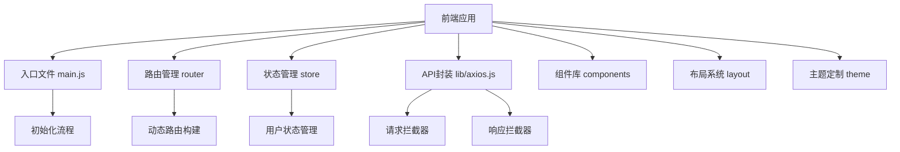
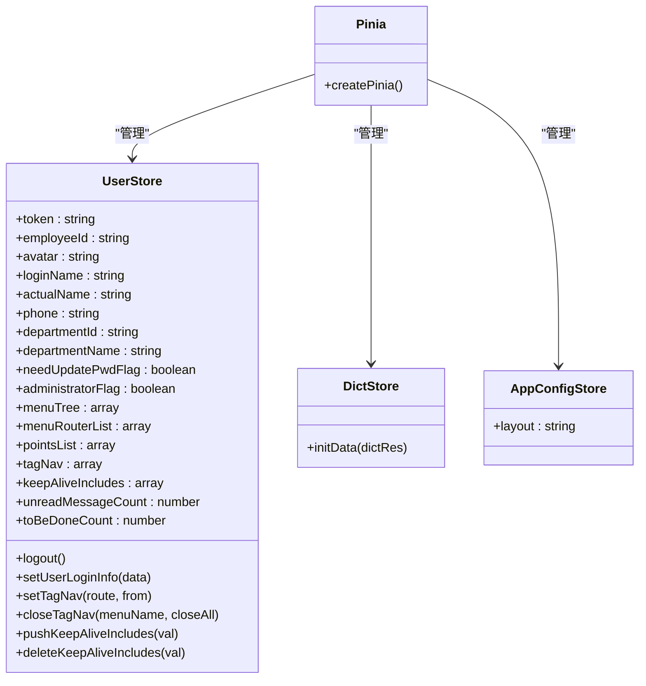
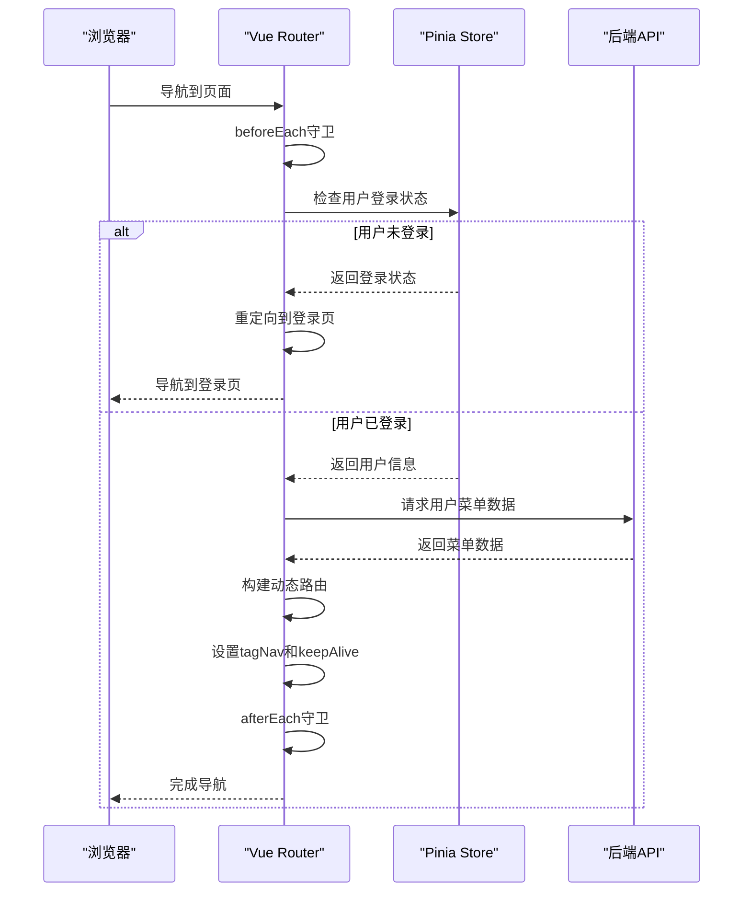
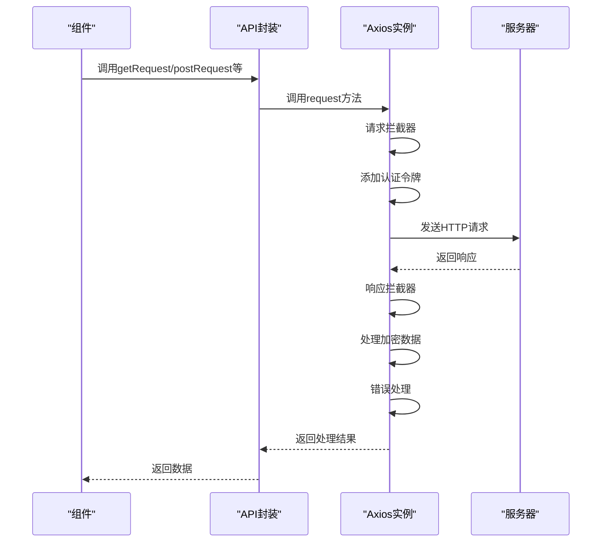
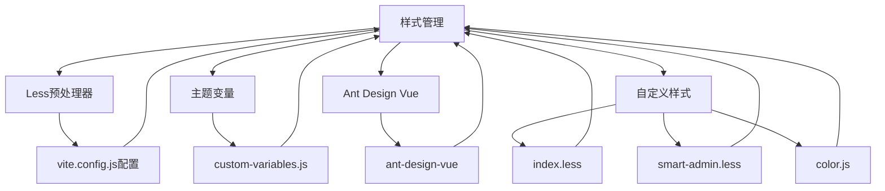
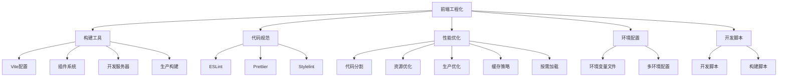

```mermaid
graph TD
A[组件架构] --> B[基础组件]
A --> C[业务组件]
A --> D[支持组件]
A --> E[工作流组件]
A --> F[系统组件]
A --> G[布局组件]
B --> B1[area-cascader]
B --> B2[boolean-select]
B --> B3[icon-select]
B --> B4[iframe]
B --> B5[smart-copy-icon]
B --> B6[smart-enum-*]
B --> B7[smart-loading]
B --> B8[text-ellipsis]
B --> B9[wangeditor]
C --> C1[category-tree-select]
C --> C2[oa组件]
D --> D1[data-tracer]
D --> D2[dict-*]
D --> D3[file-*]
D --> D4[table-*]
E --> E1[ApprovalForm]
E --> E2[ProcessDiagram]
E --> E3[ProcessSteps]
F --> F1[department-tree-select]
F --> F2[employee-select]
F --> F3[menu-tree-select]
F --> F4[position-select]
G --> G1[SideLayout]
G --> G2[SideExpandLayout]
G --> G3[TopLayout]
G --> G4[TopExpandLayout]
```

# 前端架构

<cite>
**本文档引用的文件**   
- [package.json](file://smart-admin-web-javascript/package.json)
- [vite.config.js](file://smart-admin-web-javascript/vite.config.js)
- [main.js](file://smart-admin-web-javascript/src/main.js)
- [router/index.js](file://smart-admin-web-javascript/src/router/index.js)
- [store/index.js](file://smart-admin-web-javascript/src/store/index.js)
- [lib/axios.js](file://smart-admin-web-javascript/src/lib/axios.js)
- [plugins/privilege-plugin.js](file://smart-admin-web-javascript/src/plugins/privilege-plugin.js)
- [directives/privilege.js](file://smart-admin-web-javascript/src/directives/privilege.js)
- [store/modules/system/user.js](file://smart-admin-web-javascript/src/store/modules/system/user.js)
- [theme/custom-variables.js](file://smart-admin-web-javascript/src/theme/custom-variables.js)
- [layout/index.vue](file://smart-admin-web-javascript/src/layout/index.vue)
- [constants/common-const.js](file://smart-admin-web-javascript/src/constants/common-const.js)
</cite>

## 目录
1. [项目结构](#项目结构)
2. [Vue3 Composition API使用模式](#vue3-composition-api使用模式)
3. [状态管理实现](#状态管理实现)
4. [路由配置与权限控制](#路由配置与权限控制)
5. [前端组件架构](#前端组件架构)
6. [API调用封装与拦截器](#api调用封装与拦截器)
7. [主题定制与样式管理](#主题定制与样式管理)
8. [前端工程化实践](#前端工程化实践)

## 项目结构

前端项目采用模块化设计，主要目录结构如下：
- `api`：API接口定义，按业务模块组织
- `components`：组件库，包含基础组件、业务组件和工作流组件
- `constants`：常量定义，包括系统常量、业务常量等
- `directives`：自定义指令
- `i18n`：国际化配置
- `layout`：布局组件
- `lib`：工具库和第三方库封装
- `plugins`：Vue插件
- `router`：路由配置
- `store`：Pinia状态管理
- `theme`：主题和样式配置
- `utils`：通用工具函数
- `views`：页面视图组件



**图表来源**
- [main.js](file://smart-admin-web-javascript/src/main.js)
- [router/index.js](file://smart-admin-web-javascript/src/router/index.js)
- [store/index.js](file://smart-admin-web-javascript/src/store/index.js)
- [lib/axios.js](file://smart-admin-web-javascript/src/lib/axios.js)

**章节来源**
- [main.js](file://smart-admin-web-javascript/src/main.js)
- [package.json](file://smart-admin-web-javascript/package.json)

## Vue3 Composition API使用模式

项目采用Vue3的Composition API进行组件开发，通过`setup`函数和相关组合式函数组织代码逻辑。主要特点包括：

1. **响应式系统**：使用`ref`和`reactive`创建响应式数据
2. **生命周期钩子**：使用`onMounted`、`onUnmounted`等组合式API
3. **状态共享**：通过`provide`和`inject`实现跨层级组件通信
4. **逻辑复用**：通过自定义组合式函数实现逻辑复用

在`main.js`中，通过`createApp`创建Vue应用实例，并使用Composition API的`setup`语法进行组件初始化。项目中的组件广泛使用`<script setup>`语法糖，简化了Composition API的使用。

```mermaid
classDiagram
class SetupFunction {
+ref()
+reactive()
+computed()
+watch()
+onMounted()
+onUnmounted()
}
class CustomComposables {
+useUserStore()
+useDictStore()
+useAppConfigStore()
}
SetupFunction --> CustomComposables : "组合使用"
SetupFunction --> "Vue Components" : "应用于"
```

**图表来源**
- [main.js](file://smart-admin-web-javascript/src/main.js)
- [store/modules/system/user.js](file://smart-admin-web-javascript/src/store/modules/system/user.js)

**章节来源**
- [main.js](file://smart-admin-web-javascript/src/main.js)

## 状态管理实现

项目采用Pinia作为状态管理方案，替代了传统的Vuex。Pinia提供了更简洁的API和更好的TypeScript支持。

### Pinia核心配置

在`store/index.js`中创建了Pinia实例：

```javascript
import { createPinia } from 'pinia';
export const store = createPinia();
```

### 用户状态管理

用户状态管理在`store/modules/system/user.js`中实现，使用`defineStore`定义用户store：

```javascript
export const useUserStore = defineStore({
  id: 'userStore',
  state: () => ({
    token: '',
    employeeId: '',
    avatar: '',
    loginName: '',
    actualName: '',
    phone: '',
    departmentId: '',
    departmentName: '',
    needUpdatePwdFlag: false,
    administratorFlag: true,
    // ...其他状态
  }),
  getters: {
    getToken: (state) => {
      return state.token || localRead(localKey.USER_TOKEN);
    },
    getPointList: (state) => {
      return state.pointsList;
    }
  },
  actions: {
    logout() {
      // 退出登录逻辑
    },
    setUserLoginInfo(data) {
      // 设置用户登录信息
    },
    setTagNav(route, from) {
      // 设置标签页导航
    }
  }
});
```

### 状态管理特点

1. **模块化设计**：按功能模块组织store，如用户、字典、应用配置等
2. **持久化存储**：通过`local-util.js`实现状态的本地存储
3. **响应式更新**：利用Vue3的响应式系统实现状态的自动更新
4. **类型安全**：良好的TypeScript支持，提供类型推断



**图表来源**
- [store/index.js](file://smart-admin-web-javascript/src/store/index.js)
- [store/modules/system/user.js](file://smart-admin-web-javascript/src/store/modules/system/user.js)

**章节来源**
- [store/index.js](file://smart-admin-web-javascript/src/store/index.js)
- [store/modules/system/user.js](file://smart-admin-web-javascript/src/store/modules/system/user.js)

## 路由配置与权限控制

### 路由配置

项目使用Vue Router 4进行路由管理，采用hash模式：

```javascript
export const router = createRouter({
  history: createWebHashHistory(),
  routes: routerArray,
  strict: true,
  scrollBehavior: () => ({ left: 0, top: 0 }),
});
```

### 动态路由构建

路由系统支持动态构建，根据用户权限从后端获取菜单数据并生成路由：

```javascript
export function buildRoutes(menuRouterList) {
  const routerList = [];
  const modules = import.meta.glob('../views/**/**.vue');
  
  for (const e of menuList) {
    if (!e.menuId || !e.path) continue;
    
    let route = {
      path: e.path.startsWith('/') ? e.path : `/${e.path}`,
      name: e.menuId.toString(),
      meta: {
        id: e.menuId.toString(),
        componentName: e.menuId.toString(),
        title: e.menuName,
        icon: e.icon,
        hideInMenu: !e.visibleFlag,
        keepAlive: e.cacheFlag,
        frameFlag: e.frameFlag,
        frameUrl: e.frameUrl,
        renameComponentFlag: false,
      },
    };
    
    if (e.frameFlag) {
      route.component = () => import('../components/framework/iframe/iframe-index.vue');
    } else {
      let componentPath = e.component && e.component.startsWith('/') ? e.component : '/' + e.component;
      let relativePath = `../views${componentPath}`;
      route.component = modules[relativePath];
    }
    
    routerList.push(route);
    routerMap.set(e.menuId.toString(), route);
  }
  
  router.addRoute({
    path: '/',
    meta: {},
    component: SmartLayout,
    children: routerList,
  });
}
```

### 路由守卫

实现完整的路由守卫机制，包括前置守卫和后置守卫：

```javascript
router.beforeEach(async (to, from, next) => {
  // 进度条开启
  nProgress.start();
  
  // 验证登录
  const token = localRead(LocalStorageKeyConst.USER_TOKEN);
  if (!token) {
    useUserStore().logout();
    if (to.path === PAGE_PATH_LOGIN) {
      next();
    } else {
      next({ path: PAGE_PATH_LOGIN });
    }
    return;
  }
  
  // 登录页，则跳转到首页
  if (to.path === PAGE_PATH_LOGIN) {
    next({ path: HOME_PAGE_PATH });
    return;
  }
  
  // 设置tagNav
  useUserStore().setTagNav(to, from);
  
  // 设置keepAlive
  if (to.meta.keepAlive) {
    nextTick(() => {
      useUserStore().pushKeepAliveIncludes(to.meta.componentName);
    });
  }
  
  next();
});

router.afterEach(() => {
  nProgress.done();
});
```

### 权限控制

通过自定义指令和插件实现细粒度的权限控制：

```javascript
// 权限指令
export function privilegeDirective(el, binding) {
  // 超级管理员
  if (useUserStore().administratorFlag) {
    return true;
  }
  
  // 获取功能点权限
  let userPointsList = useUserStore().getPointList;
  if (!userPointsList) {
    return false;
  }
  
  // 如果没有权限，删除节点
  if (!_.some(userPointsList, ['webPerms', binding.value])) {
    el.parentNode.removeChild(el);
  }
  return true;
}

// 权限插件
const privilege = (value) => {
  // 超级管理员
  if (useUserStore().administratorFlag) {
    return true;
  }
  
  // 获取功能点权限
  let userPointsList = useUserStore().getPointList;
  if (!userPointsList) {
    return false;
  }
  return _.some(userPointsList, ['webPerms', value]);
};
```



**图表来源**
- [router/index.js](file://smart-admin-web-javascript/src/router/index.js)
- [main.js](file://smart-admin-web-javascript/src/main.js)
- [plugins/privilege-plugin.js](file://smart-admin-web-javascript/src/plugins/privilege-plugin.js)
- [directives/privilege.js](file://smart-admin-web-javascript/src/directives/privilege.js)

**章节来源**
- [router/index.js](file://smart-admin-web-javascript/src/router/index.js)
- [plugins/privilege-plugin.js](file://smart-admin-web-javascript/src/plugins/privilege-plugin.js)
- [directives/privilege.js](file://smart-admin-web-javascript/src/directives/privilege.js)

## 前端组件架构

### 组件分类

项目中的组件分为三类：

1. **基础组件**：通用UI组件，如按钮、输入框、表格等
2. **业务组件**：特定业务场景的组件，如选择器、表单等
3. **布局组件**：页面布局结构组件

### 基础组件

位于`components/framework`目录，包括：
- `area-cascader`：区域级联选择器
- `boolean-select`：布尔值选择器
- `icon-select`：图标选择器
- `iframe`：外链页面容器
- `smart-copy-icon`：智能复制图标
- `smart-enum-*`：枚举值选择组件
- `smart-loading`：加载状态组件
- `text-ellipsis`：文本省略组件
- `wangeditor`：富文本编辑器

### 业务组件

位于`components/business`目录，包括：
- `category-tree-select`：分类树选择器
- `oa`：OA相关组件，如企业银行、发票、企业选择器等

### 支持组件

位于`components/support`目录，包括：
- `data-tracer`：数据追踪组件
- `dict-*`：数据字典相关组件
- `file-*`：文件上传和预览组件
- `table-*`：表格相关组件

### 工作流组件

位于`components/workflow`目录，包括：
- `ApprovalForm`：审批表单
- `ProcessDiagram`：流程图
- `ProcessSteps`：流程步骤

### 系统组件

位于`components/system`目录，包括：
- `department-tree-select`：部门树选择器
- `employee-select`：员工选择器
- `menu-tree-select`：菜单树选择器
- `position-select`：职位选择器

### 布局组件

布局系统提供多种布局模式，通过`layout/index.vue`统一管理：

```vue
<template>
  <!--左侧菜单 模式-->
  <SideLayout v-if="layout === LAYOUT_ENUM.SIDE.value" />
  <!--左侧展开菜单 模式-->
  <SideExpandLayout v-if="layout === LAYOUT_ENUM.SIDE_EXPAND.value" />
  <!--顶部菜单 模式-->
  <TopLayout v-if="layout === LAYOUT_ENUM.TOP.value" />
  <!--顶部展开 模式-->
  <TopExpandLayout v-if="layout === LAYOUT_ENUM.TOP_EXPAND.value" />
  <!--定期修改密码-->
  <RegularChangePasswordModal />
</template>
```



**图表来源**
- [layout/index.vue](file://smart-admin-web-javascript/src/layout/index.vue)
- [components/framework](file://smart-admin-web-javascript/src/components/framework)
- [components/business](file://smart-admin-web-javascript/src/components/business)
- [components/support](file://smart-admin-web-javascript/src/components/support)
- [components/workflow](file://smart-admin-web-javascript/src/components/workflow)
- [components/system](file://smart-admin-web-javascript/src/components/system)

**章节来源**
- [layout/index.vue](file://smart-admin-web-javascript/src/layout/index.vue)
- [components](file://smart-admin-web-javascript/src/components)

## API调用封装与拦截器

### Axios实例封装

在`lib/axios.js`中创建了axios实例并配置了基础URL：

```javascript
const smartAxios = axios.create({
  baseURL: import.meta.env.VITE_APP_API_URL,
});
```

### 请求拦截器

实现请求拦截器，在请求头中添加认证令牌：

```javascript
smartAxios.interceptors.request.use(
  (config) => {
    const token = localRead(LocalStorageKeyConst.USER_TOKEN);
    if (token) {
      config.headers[TOKEN_HEADER] = 'Bearer ' + token;
    } else {
      delete config.headers[TOKEN_HEADER];
    }
    return config;
  },
  (error) => {
    return Promise.reject(error);
  }
);
```

### 响应拦截器

实现响应拦截器，处理各种响应情况：

```javascript
smartAxios.interceptors.response.use(
  (response) => {
    let contentType = response.headers['content-type'] ? response.headers['content-type'] : response.headers['Content-Type'];
    if (contentType.indexOf('application/json') === -1) {
      return Promise.resolve(response);
    }

    if (response.data && response.data instanceof Blob) {
      return Promise.reject(response.data);
    }

    // 如果是加密数据
    if (response.data.dataType === DATA_TYPE_ENUM.ENCRYPT.value) {
      response.data.encryptData = response.data.data;
      let decryptStr = decryptData(response.data.data);
      if (decryptStr) {
        response.data.data = JSON.parse(decryptStr);
      }
    }

    const res = response.data;
    if (res.code && res.code !== 1) {
      // `token` 过期或者账号已在别处登录
      if (res.code === 30007 || res.code === 30008) {
        message.destroy();
        message.error('您没有登录，请重新登录');
        setTimeout(logout, 300);
        return Promise.reject(response);
      }

      // 等保安全的登录提醒
      if (res.code === 30010 || res.code === 30011) {
        Modal.error({
          title: '重要提醒',
          content: res.msg,
        });
        return Promise.reject(response);
      }

      // 长时间未操作系统，需要重新登录
      if (res.code === 30012) {
        Modal.error({
          title: '重要提醒',
          content: res.msg,
          onOk: logout,
        });
        setTimeout(logout, 3000);
        return Promise.reject(response);
      }
      message.destroy();
      message.error(res.msg);
      return Promise.reject(response);
    } else {
      return Promise.resolve(res);
    }
  },
  (error) => {
    if (error.message.indexOf('timeout') !== -1) {
      message.destroy();
      message.error('网络超时');
    } else if (error.message === 'Network Error') {
      message.destroy();
      message.error('网络连接错误');
    } else if (error.message.indexOf('Request') !== -1) {
      message.destroy();
      message.error('网络发生错误');
    }
    return Promise.reject(error);
  }
);
```

### API请求方法封装

提供多种API请求方法：

```javascript
/**
 * get请求
 */
export const getRequest = (url, params) => {
  return request({ url, method: 'get', params });
};

/**
 * 通用请求封装
 */
export const request = (config) => {
  return smartAxios.request(config);
};

/**
 * post请求
 */
export const postRequest = (url, data) => {
  return request({
    data,
    url,
    method: 'post',
  });
};

/**
 * 加密请求参数的post请求
 */
export const postEncryptRequest = (url, data) => {
  return request({
    data: { encryptData: encryptData(data) },
    url,
    method: 'post',
  });
};

/**
 * 文件下载
 */
export const postDownload = function (url, data) {
  request({
    method: 'post',
    url,
    data,
    responseType: 'blob',
  })
    .then((data) => {
      handleDownloadData(data);
    })
    .catch((error) => {
      handleDownloadError(error);
    });
};
```



**图表来源**
- [lib/axios.js](file://smart-admin-web-javascript/src/lib/axios.js)

**章节来源**
- [lib/axios.js](file://smart-admin-web-javascript/src/lib/axios.js)

## 主题定制与样式管理

### Less样式管理

项目使用Less作为CSS预处理器，在`vite.config.js`中配置了Less预处理器选项：

```javascript
css: {
  preprocessorOptions: {
    less: {
      modifyVars: customVariables,
      javascriptEnabled: true,
    },
  },
},
```

### 自定义变量

在`theme/custom-variables.js`中定义了主题变量：

```javascript
import { theme } from 'ant-design-vue/lib';
import convertLegacyToken from 'ant-design-vue/lib/theme/convertLegacyToken';

const { defaultAlgorithm, defaultSeed } = theme;

const mapToken = defaultAlgorithm(defaultSeed);
const token = convertLegacyToken.default(mapToken);

export default {
  '@primary-color': token['primary-color'], // 全局主色
  '@base-bg-color': '#fff',
  '@hover-bg-color': 'rgba(0, 0, 0, 0.025)',
  '@hover-bg-color-night': 'rgba(255, 255, 255, 0.025)',
  '@header-light-bg-hover-color': '#f6f6f6',
  '@header-height': '80px',
  '@header-user-height': '40px',
  '@page-tag-height': '40px',
  '@theme-list': ['light', 'dark', 'night'],
};
```

### 主题文件

主题相关文件包括：
- `theme/index.less`：主主题文件
- `theme/smart-admin.less`：项目特定样式
- `theme/color.js`：颜色配置

### 样式特点

1. **Ant Design Vue集成**：基于Ant Design Vue组件库进行样式定制
2. **变量化设计**：通过Less变量实现主题定制
3. **模块化样式**：按组件和功能组织样式文件
4. **响应式设计**：支持不同屏幕尺寸的适配



**图表来源**
- [vite.config.js](file://smart-admin-web-javascript/vite.config.js)
- [theme/custom-variables.js](file://smart-admin-web-javascript/src/theme/custom-variables.js)
- [theme/index.less](file://smart-admin-web-javascript/src/theme/index.less)

**章节来源**
- [vite.config.js](file://smart-admin-web-javascript/vite.config.js)
- [theme/custom-variables.js](file://smart-admin-web-javascript/src/theme/custom-variables.js)

## 前端工程化实践

### 构建工具

项目使用Vite作为构建工具，在`vite.config.js`中进行了详细配置：

```javascript
export default {
  base: process.env.NODE_ENV === 'production' ? '/' : '/',
  root: process.cwd(),
  resolve: {
    alias: [
      {
        find: 'vue-i18n',
        replacement: 'vue-i18n/dist/vue-i18n.cjs.js',
      },
      {
        find: /\/@\//,
        replacement: pathResolve('src') + '/',
      },
      {
        find: /^~/,
        replacement: '',
      },
    ],
  },
  server: {
    host: '0.0.0.0',
    port: 8081,
    proxy: {
      '/': {
        target: 'http://127.0.0.1:1024/',
        changeOrigin: true,
        rewrite: (path) => path,
      },
    },
  },
  plugins: [vue()],
  build: {
    terserOptions: {
      compress: {
        drop_console: true,
        drop_debugger: true,
      },
    },
    rollupOptions: {
      output: {
        chunkFileNames: 'js/[name]-[hash].js',
        entryFileNames: 'js/[name]-[hash].js',
        assetFileNames: '[ext]/[name]-[hash].[ext]',
        manualChunks(id) {
          if (id.includes('node_modules')) {
            return id.toString().split('node_modules/')[1].split('/')[0].toString();
          }
        },
      },
    },
    target: 'esnext',
    outDir: 'dist',
    assetsDir: 'assets',
    assetsInlineLimit: '4096',
    chunkSizeWarningLimit: 500,
    minify: 'terser',
    emptyOutDir: true,
  },
  css: {
    preprocessorOptions: {
      less: {
        modifyVars: customVariables,
        javascriptEnabled: true,
      },
    },
  },
};
```

### 代码规范

项目配置了完整的代码规范工具链：
- ESLint：代码质量检查
- Prettier：代码格式化
- Stylelint：CSS样式检查

在`package.json`中定义了相关依赖：
```json
"devDependencies": {
  "eslint": "^8.16.0",
  "eslint-config-prettier": "~9.0.0",
  "eslint-plugin-prettier": "~5.0.0",
  "eslint-plugin-vue": "~9.17.0",
  "prettier": "~3.0.2",
  "stylelint": "~14.8.5",
  "stylelint-config-prettier": "~9.0.0",
  "stylelint-config-standard": "~25.0.0",
  "stylelint-order": "~5.0.0"
}
```

### 性能优化

项目实施了多项性能优化措施：

1. **代码分割**：通过`manualChunks`配置实现代码分割
2. **资源优化**：配置`chunkFileNames`和`assetFileNames`优化资源文件名
3. **生产环境优化**：移除console和debugger语句
4. **缓存策略**：使用hash文件名实现长期缓存
5. **按需加载**：使用`import.meta.glob`实现组件的按需加载

### 环境配置

通过环境变量文件实现多环境配置：
- `.env.development`：开发环境
- `.env.localhost`：本地环境
- `.env.pre`：预发布环境
- `.env.production`：生产环境
- `.env.test`：测试环境

### 开发脚本

在`package.json`中定义了开发脚本：
```json
"scripts": {
  "localhost": "vite --mode localhost",
  "dev": "vite",
  "build:test": "vite build  --base=/admin/ --mode test",
  "build:pre": "vite build  --mode pre",
  "build:prod": "vite build  --mode production"
}
```



**图表来源**
- [vite.config.js](file://smart-admin-web-javascript/vite.config.js)
- [package.json](file://smart-admin-web-javascript/package.json)

**章节来源**
- [vite.config.js](file://smart-admin-web-javascript/vite.config.js)
- [package.json](file://smart-admin-web-javascript/package.json)