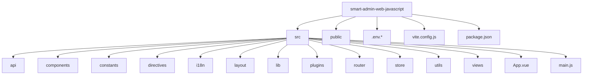
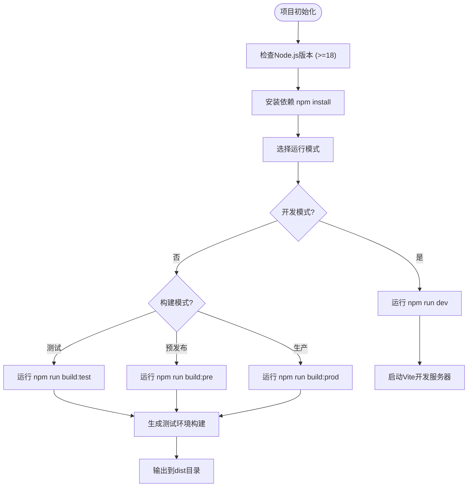
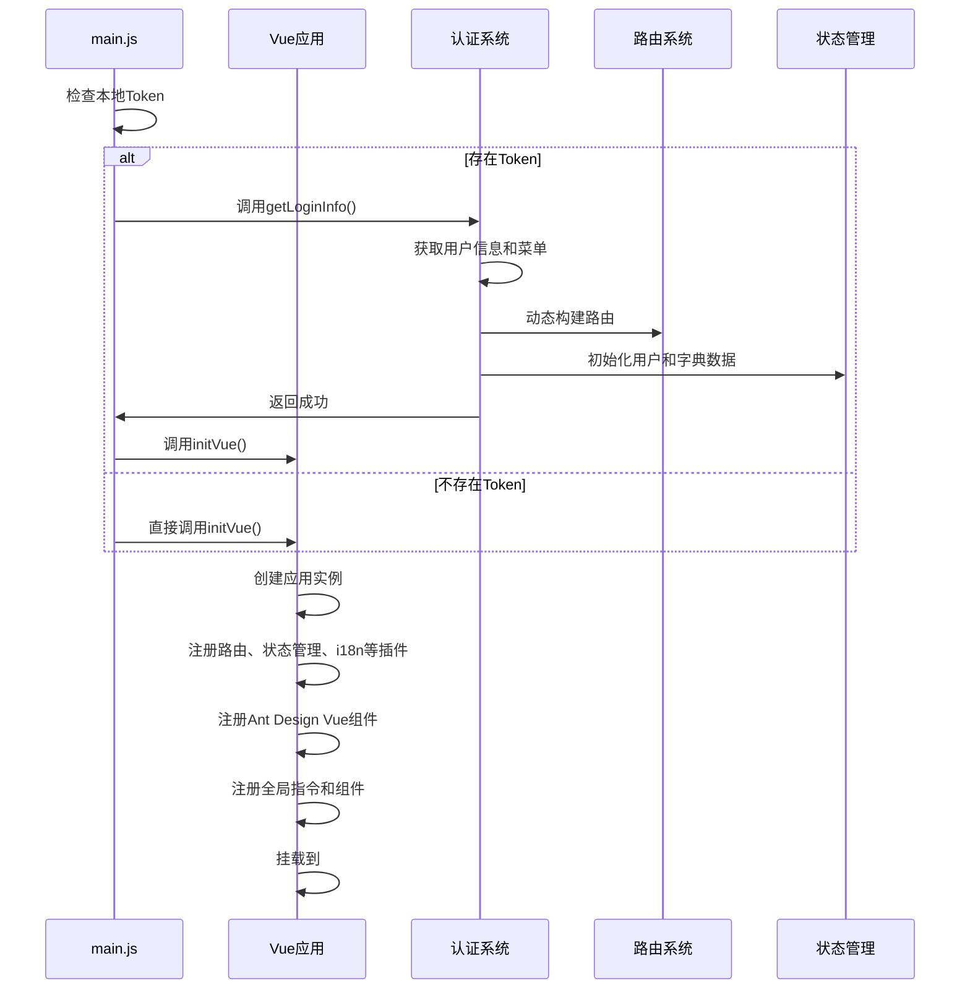
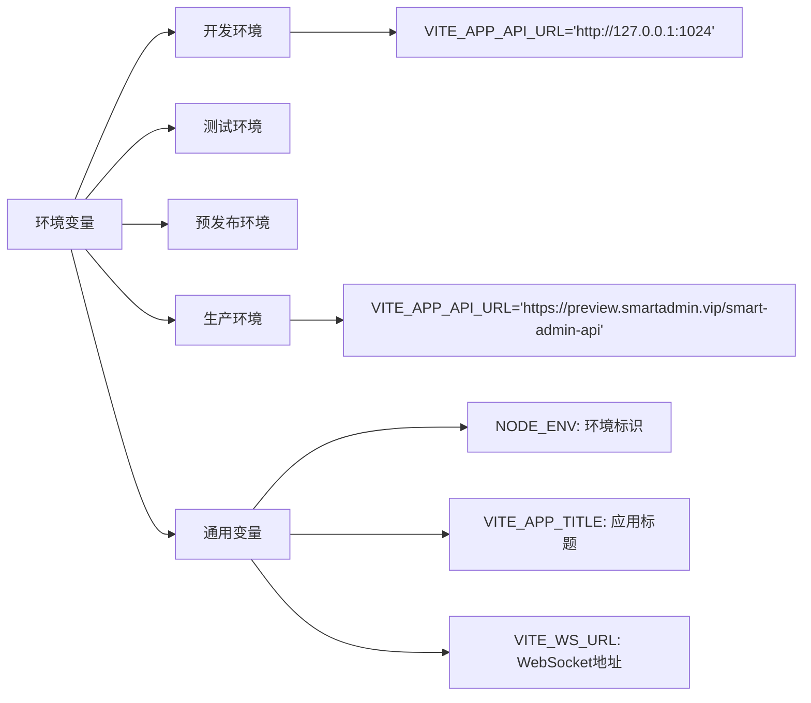
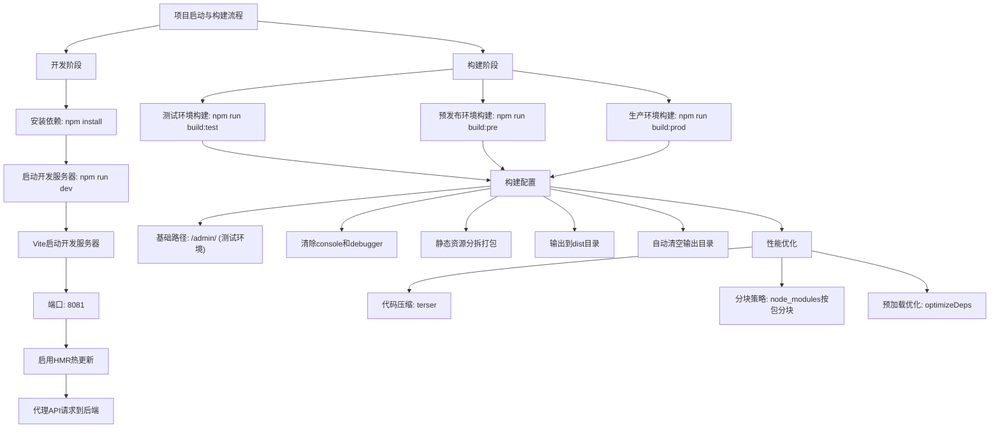

# 应用结构

<cite>
**本文档中引用的文件**  
- [package.json](file://smart-admin-web-javascript/package.json)
- [vite.config.js](file://smart-admin-web-javascript/vite.config.js)
- [main.js](file://smart-admin-web-javascript/src/main.js)
- [App.vue](file://smart-admin-web-javascript/src/App.vue)
- [router/index.js](file://smart-admin-web-javascript/src/router/index.js)
- [store/index.js](file://smart-admin-web-javascript/src/store/index.js)
- [i18n/index.js](file://smart-admin-web-javascript/src/i18n/index.js)
- [constants/index.js](file://smart-admin-web-javascript/src/constants/index.js)
- [.env.development](file://smart-admin-web-javascript/.env.development)
- [.env.production](file://smart-admin-web-javascript/.env.production)
</cite>

## 目录

1. [项目结构](#项目结构)
2. [项目初始化流程](#项目初始化流程)
3. [应用实例创建与插件注册](#应用实例创建与插件注册)
4. [根组件App.vue结构与功能](#根组件appvue结构与功能)
5. [核心目录职责说明](#核心目录职责说明)
6. [环境变量配置](#环境变量配置)
7. [构建配置](#构建配置)
8. [项目启动与构建流程](#项目启动与构建流程)

## 项目结构

本项目基于Vue3和Vite构建，采用模块化设计，目录结构清晰，职责分明。前端项目位于`smart-admin-web-javascript`目录下，主要包含源代码、配置文件和资源文件。



**Diagram sources**
- [src](file://smart-admin-web-javascript/src)
- [vite.config.js](file://smart-admin-web-javascript/vite.config.js)

**Section sources**
- [package.json](file://smart-admin-web-javascript/package.json)

## 项目初始化流程

项目使用Vite作为构建工具，通过`package.json`中的脚本命令进行初始化和构建。项目支持多种环境模式，包括开发、测试、预发布和生产环境。

项目初始化流程如下：
1. 检查Node.js版本（要求>=18）
2. 安装依赖：`npm install`
3. 启动开发服务器：`npm run dev`
4. 构建生产版本：`npm run build:prod`



**Diagram sources**
- [package.json](file://smart-admin-web-javascript/package.json)
- [vite.config.js](file://smart-admin-web-javascript/vite.config.js)

**Section sources**
- [package.json](file://smart-admin-web-javascript/package.json#L11-L16)

## 应用实例创建与插件注册

在`main.js`文件中，项目通过`createApp`方法创建Vue应用实例，并注册了多个插件和全局组件。应用的初始化逻辑根据用户登录状态进行条件判断。



**Diagram sources**
- [main.js](file://smart-admin-web-javascript/src/main.js#L11-L130)

**Section sources**
- [main.js](file://smart-admin-web-javascript/src/main.js#L11-L130)

## 根组件App.vue结构与功能

`App.vue`是应用的根组件，负责全局配置、主题设置和路由渲染。它使用Ant Design Vue的`a-config-provider`组件进行全局配置，并通过`RouterView`渲染当前路由对应的页面。

```mermaid
classDiagram
class AppVue {
+antdLocale : computed
+dayjsLocale : computed
+spinning : computed
+colorIndex : computed
+themeAlgorithm : computed
+borderRadius : computed
+transformCellText(text, column, record, index)
}
AppVue --> "1" aConfigProvider : "使用"
AppVue --> "1" aSpin : "包含"
AppVue --> "1" RouterView : "渲染"
aConfigProvider --> "1" theme : "支持暗色/紧凑模式"
aConfigProvider --> "1" locale : "支持国际化"
aSpin --> "1" loading : "显示全局加载状态"
RouterView --> "1" "动态页面组件" : "渲染"
```

**Diagram sources**
- [App.vue](file://smart-admin-web-javascript/src/App.vue#L1-L128)

**Section sources**
- [App.vue](file://smart-admin-web-javascript/src/App.vue#L1-L128)

## 核心目录职责说明

项目采用功能模块化组织方式，各核心目录职责明确：

```mermaid
graph TD
A[src] --> B[api]
A --> C[components]
A --> D[constants]
A --> E[directives]
A --> F[i18n]
A --> G[layout]
A --> H[lib]
A --> I[plugins]
A --> J[router]
A --> K[store]
A --> L[utils]
B --> B1["业务API接口定义"]
B --> B2["系统API接口定义"]
B --> B3["支持功能API接口定义"]
C --> C1["业务组件"]
C --> C2["框架组件"]
C --> C3["系统组件"]
C --> C4["工作流组件"]
D --> D1["业务常量"]
D --> D2["系统常量"]
D --> D3["通用常量"]
E --> E1["权限指令privilege"]
F --> F1["国际化配置"]
F --> F2["多语言支持"]
G --> G1["布局组件"]
G --> G2["帮助文档布局"]
H --> H1["工具库"]
H --> H2["加密解密"]
H --> H3["水印生成"]
I --> I1["权限插件"]
I --> I2["字典插件"]
I --> I3["枚举插件"]
J --> J1["路由配置"]
J --> J2["动态路由构建"]
K --> K1["状态管理"]
K --> K2["用户状态"]
K --> K3["应用配置"]
L --> L1["本地存储工具"]
L --> L2["字符串工具"]
L --> L3["WebSocket初始化"]
```



**Diagram sources**
- [src](file://smart-admin-web-javascript/src)

**Section sources**
- [src](file://smart-admin-web-javascript/src)

## 环境变量配置

项目通过`.env`系列文件进行环境变量配置，支持多环境部署。不同环境使用不同的配置文件：

| 环境 | 配置文件 | 主要变量 |
|------|---------|---------|
| 开发环境 | .env.development | API地址: http://127.0.0.1:1024 |
| 本地环境 | .env.localhost | 本地开发配置 |
| 测试环境 | .env.test | 测试服务器配置 |
| 预发布环境 | .env.pre | 预发布服务器配置 |
| 生产环境 | .env.production | 生产服务器配置: https://preview.smartadmin.vip |



**Diagram sources**
- [.env.development](file://smart-admin-web-javascript/.env.development)
- [.env.production](file://smart-admin-web-javascript/.env.production)

**Section sources**
- [.env.development](file://smart-admin-web-javascript/.env.development#L1-L3)
- [.env.production](file://smart-admin-web-javascript/.env.production#L1-L3)

## 构建配置

`vite.config.js`文件定义了项目的构建配置，包括别名设置、服务器代理、构建优化等。

```mermaid
classDiagram
class ViteConfig {
+base : string
+resolve.alias : Array
+server : Object
+plugins : Array
+optimizeDeps : Object
+build : Object
+css : Object
+define : Object
}
ViteConfig --> "1" Alias : "配置"
ViteConfig --> "1" ServerProxy : "配置"
ViteConfig --> "1" BuildOptimization : "配置"
Alias --> "/@/" : "映射到src目录"
Alias --> "vue-i18n" : "使用CJS版本"
ServerProxy --> "target" : "http : //127.0.0.1 : 1024/"
ServerProxy --> "changeOrigin" : "true"
ServerProxy --> "rewrite" : "路径重写"
BuildOptimization --> "terserOptions" : "清除console和debugger"
BuildOptimization --> "rollupOptions" : "分块打包"
BuildOptimization --> "chunkSizeWarningLimit" : "500KB警告阈值"
```

**Diagram sources**
- [vite.config.js](file://smart-admin-web-javascript/vite.config.js#L1-L100)

**Section sources**
- [vite.config.js](file://smart-admin-web-javascript/vite.config.js#L1-L100)

## 项目启动与构建流程

完整的项目启动、开发和构建流程如下：



**Diagram sources**
- [package.json](file://smart-admin-web-javascript/package.json)
- [vite.config.js](file://smart-admin-web-javascript/vite.config.js)

**Section sources**
- [package.json](file://smart-admin-web-javascript/package.json#L11-L16)
- [vite.config.js](file://smart-admin-web-javascript/vite.config.js#L1-L100)