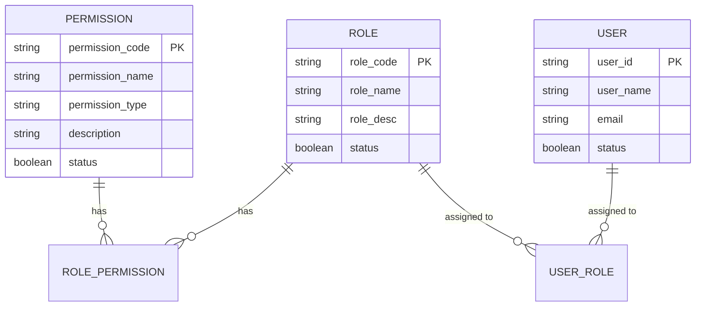
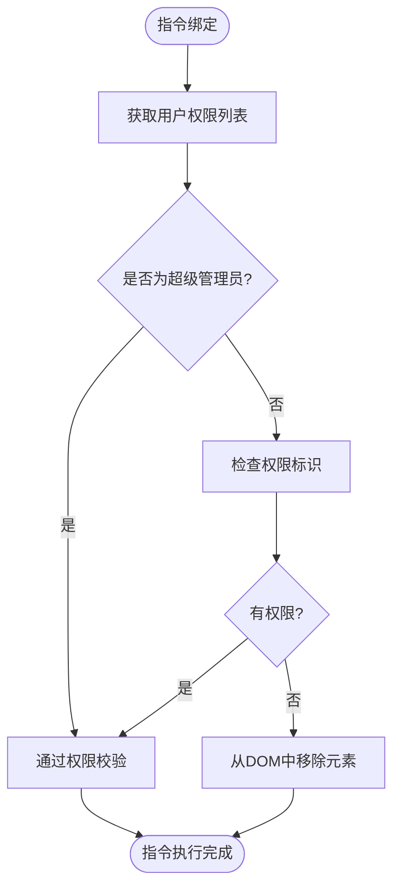
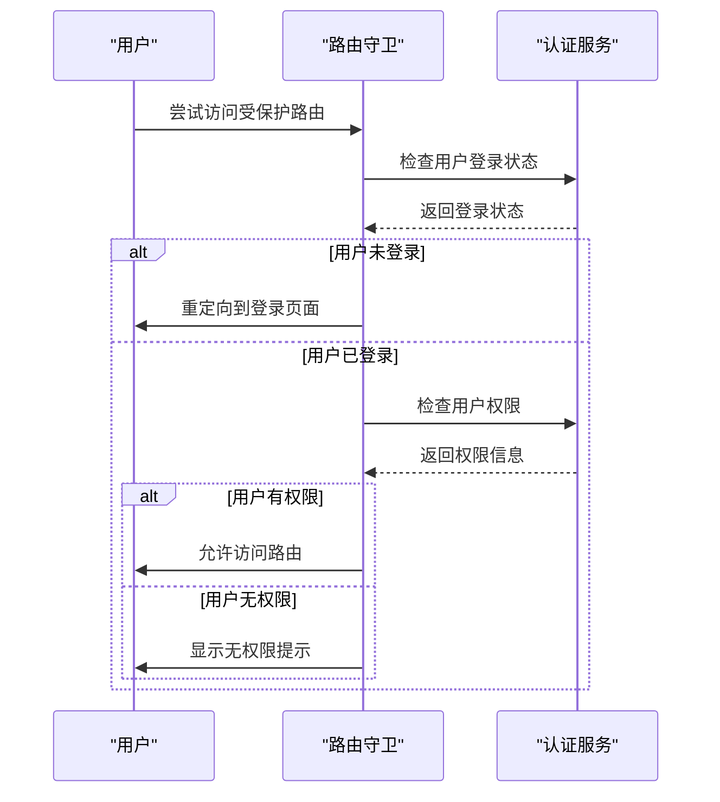

# 权限控制

<cite>
**本文档引用的文件**   
- [privilege.js](file://smart-admin-web-javascript/src/directives/privilege.js)
- [privilege-plugin.js](file://smart-admin-web-javascript/src/plugins/privilege-plugin.js)
- [user.js](file://smart-admin-web-javascript/src/store/modules/system/user.js)
- [index.js](file://smart-admin-web-javascript/src/router/index.js)
- [04-t_permission.sql](file://database-scripts/common-service/04-t_permission.sql)
- [03-t_role.sql](file://database-scripts/common-service/03-t_role.sql)
- [05-t_user_role.sql](file://database-scripts/common-service/05-t_user_role.sql)
- [06-t_role_permission.sql](file://database-scripts/common-service/06-t_role_permission.sql)
- [smart-permission.md](file://documentation/technical/smart-permission.md)
- [权限命名规范.md](file://documentation/01-核心规范/权限命名规范.md)
- [AuthController.java](file://restful_refactor_backup_20251202_014224/microservices_ioedream-auth-service_src_main_java_net_lab1024_sa_auth_controller_AuthController.java)
- [PermissionController.java](file://restful_refactor_backup_20251202_014224/microservices_ioedream-identity-service_src_main_java_net_lab1024_sa_identity_module_rbac_controller_PermissionController.java)
</cite>

## 目录
1. [引言](#引言)
2. [权限标识与管理](#权限标识与管理)
3. [用户角色与权限的获取、存储和更新](#用户角色与权限的获取存储和更新)
4. [权限指令实现原理](#权限指令实现原理)
5. [路由级别的权限控制](#路由级别的权限控制)
6. [前后端权限一致性](#前后端权限一致性)
7. [结论](#结论)

## 引言
本文档详细阐述了前端权限控制的双重验证机制，包括基于指令（v-privilege）和路由守卫的权限验证。文档解释了权限标识（如system:user:add）的定义和管理方式，以及用户角色和权限的获取、存储和更新流程。此外，文档还提供了权限指令的实现原理，包括权限校验逻辑和无权限时的UI处理（如按钮隐藏或禁用），并说明了路由级别的权限控制如何与后端权限体系协同工作，确保前后端权限的一致性。

**Section sources**
- [privilege.js](file://smart-admin-web-javascript/src/directives/privilege.js#L1-L29)
- [index.js](file://smart-admin-web-javascript/src/router/index.js#L30-L88)

## 权限标识与管理
权限标识是系统中用于控制用户访问权限的关键元素。权限标识遵循`{domain}:{module}:{action}`的格式，其中`domain`表示领域，`module`表示模块，`action`表示操作。例如，`system:user:add`表示在系统领域中对用户模块的新增操作。这种命名规范确保了权限标识的清晰性和一致性，便于管理和维护。

权限标识在数据库中通过`t_permission`表进行管理，该表定义了权限的编码、名称、类型等属性。权限标识的管理还包括权限的创建、更新和删除操作，这些操作通常通过后端API进行，确保权限数据的准确性和安全性。

**Diagram sources**
- [04-t_permission.sql](file://database-scripts/common-service/04-t_permission.sql#L1-L37)
- [03-t_role.sql](file://database-scripts/common-service/03-t_role.sql#L1-L28)
- [05-t_user_role.sql](file://database-scripts/common-service/05-t_user_role.sql#L1-L19)
- [06-t_role_permission.sql](file://database-scripts/common-service/06-t_role_permission.sql#L1-L19)

**Section sources**
- [权限命名规范.md](file://documentation/01-核心规范/权限命名规范.md#L234-L304)
- [04-t_permission.sql](file://database-scripts/common-service/04-t_permission.sql#L1-L37)

## 用户角色与权限的获取、存储和更新
用户角色和权限的获取、存储和更新是权限控制的核心部分。当用户登录系统时，前端会通过API请求获取用户的权限列表，并将其存储在状态管理器中。用户权限的获取通常包括用户的角色、权限列表和菜单权限等信息。

用户权限的存储采用本地存储和状态管理相结合的方式。权限数据被存储在`localStorage`中，以便在页面刷新后仍能保持用户状态。同时，权限数据也被存储在Pinia状态管理器中，以便在组件间共享和访问。

权限的更新通常发生在用户角色或权限发生变化时。前端通过API请求更新用户的权限，并在成功后更新本地存储和状态管理器中的权限数据，确保权限信息的实时性和准确性。

**Section sources**
- [user.js](file://smart-admin-web-javascript/src/store/modules/system/user.js#L20-L193)
- [AuthController.java](file://restful_refactor_backup_20251202_014224/microservices_ioedream-auth-service_src_main_java_net_lab1024_sa_auth_controller_AuthController.java#L146-L271)

## 权限指令实现原理
权限指令（v-privilege）是前端权限控制的重要组成部分。权限指令通过Vue的自定义指令实现，用于在DOM元素上进行权限校验。当指令绑定到元素上时，会检查用户是否具有指定的权限，如果没有权限，则从DOM中移除该元素。

权限指令的实现原理如下：
1. 从状态管理器中获取用户的权限列表。
2. 检查用户是否为超级管理员，如果是，则直接通过权限校验。
3. 检查用户权限列表中是否包含指定的权限标识。
4. 如果没有权限，则从DOM中移除该元素。

**Diagram sources**
- [privilege.js](file://smart-admin-web-javascript/src/directives/privilege.js#L14-L27)

**Section sources**
- [privilege.js](file://smart-admin-web-javascript/src/directives/privilege.js#L1-L29)
- [privilege-plugin.js](file://smart-admin-web-javascript/src/plugins/privilege-plugin.js#L13-L24)

## 路由级别的权限控制
路由级别的权限控制通过路由守卫实现。路由守卫在用户访问特定路由之前进行权限校验，确保用户具有访问该路由的权限。路由守卫通常在路由配置中定义，并在路由跳转时自动执行。

路由守卫的实现原理如下：
1. 在路由配置中定义路由守卫。
2. 当用户尝试访问受保护的路由时，路由守卫被触发。
3. 路由守卫检查用户是否已登录，如果没有登录，则重定向到登录页面。
4. 如果用户已登录，则检查用户是否具有访问该路由的权限。
5. 如果没有权限，则阻止路由跳转，并显示相应的提示信息。

**Diagram sources**
- [index.js](file://smart-admin-web-javascript/src/router/index.js#L31-L87)

**Section sources**
- [index.js](file://smart-admin-web-javascript/src/router/index.js#L30-L88)

## 前后端权限一致性
前后端权限一致性是确保系统安全的重要环节。前后端权限一致性通过以下方式实现：
1. **权限标识一致性**：前后端使用相同的权限标识，确保权限校验的准确性。
2. **权限数据同步**：前端通过API请求获取用户的权限数据，并与后端保持同步。
3. **权限校验**：前后端均进行权限校验，确保用户在任何情况下都无法绕过权限控制。

通过这些措施，系统能够确保前后端权限的一致性，防止权限漏洞和安全风险。

**Section sources**
- [权限命名规范.md](file://documentation/01-核心规范/权限命名规范.md#L234-L304)
- [AuthController.java](file://restful_refactor_backup_20251202_014224/microservices_ioedream-auth-service_src_main_java_net_lab1024_sa_auth_controller_AuthController.java#L186-L209)
- [PermissionController.java](file://restful_refactor_backup_20251202_014224/microservices_ioedream-identity-service_src_main_java_net_lab1024_sa_identity_module_rbac_controller_PermissionController.java#L42-L54)

## 结论
本文档详细阐述了前端权限控制的双重验证机制，包括基于指令（v-privilege）和路由守卫的权限验证。文档解释了权限标识（如system:user:add）的定义和管理方式，以及用户角色和权限的获取、存储和更新流程。此外，文档还提供了权限指令的实现原理，包括权限校验逻辑和无权限时的UI处理（如按钮隐藏或禁用），并说明了路由级别的权限控制如何与后端权限体系协同工作，确保前后端权限的一致性。通过这些机制，系统能够有效地控制用户访问权限，保障系统的安全性和稳定性。