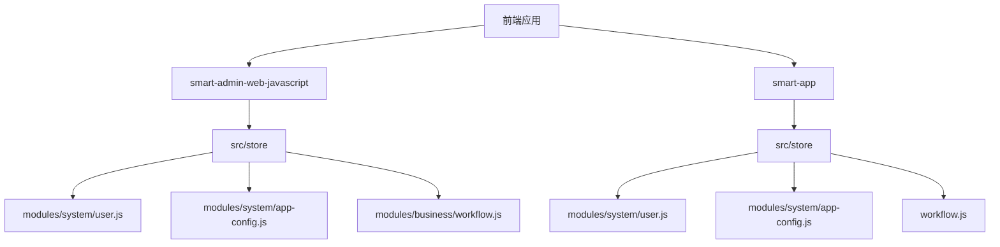
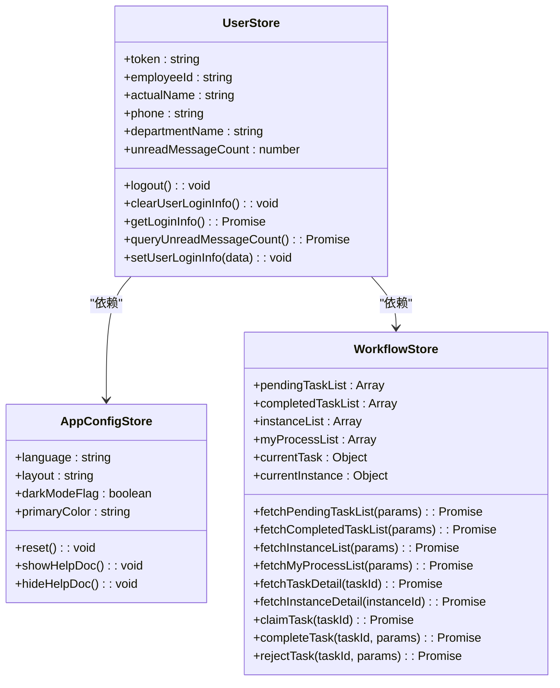
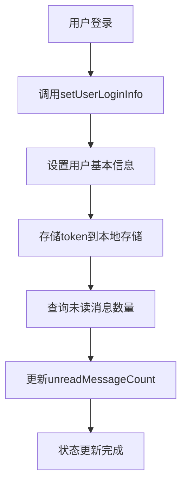
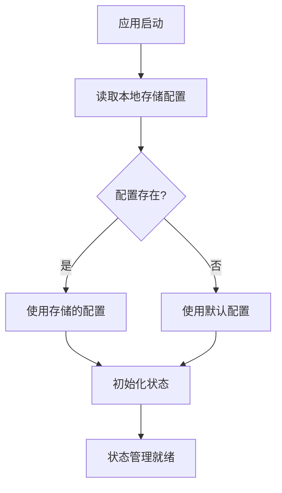
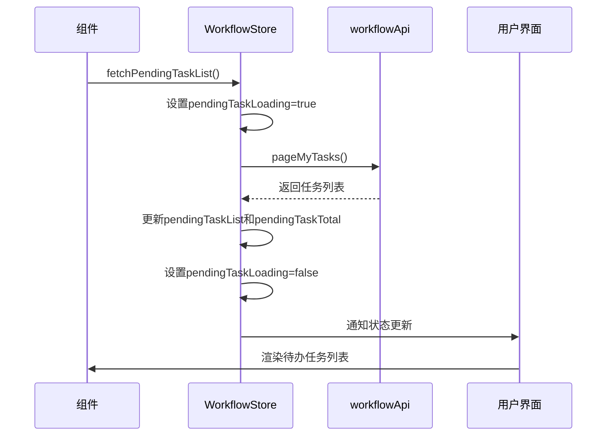
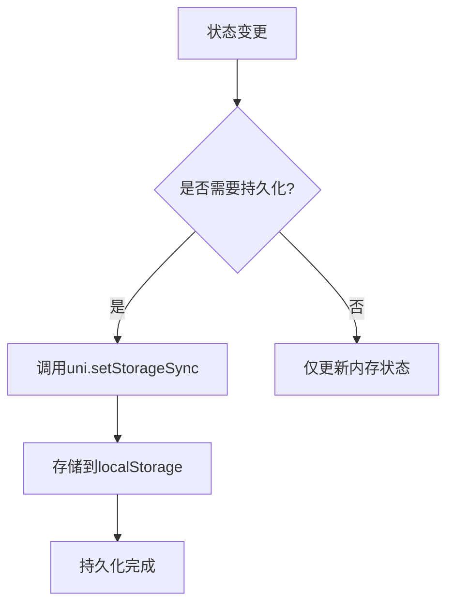
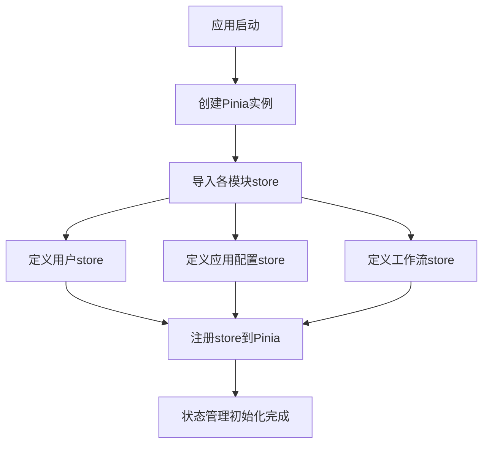

# 状态管理

<cite>
**本文档引用的文件**
- [user.js](file://smart-app/src/store/modules/system/user.js)
- [app-config.js](file://smart-app/src/store/modules/system/app-config.js)
- [workflow.js](file://smart-app/src/store/workflow.js)
- [user.js](file://smart-admin-web-javascript/src/store/modules/system/user.js)
- [app-config.js](file://smart-admin-web-javascript/src/store/modules/system/app-config.js)
- [workflow.js](file://smart-admin-web-javascript/src/store/modules/business/workflow.js)
- [app-config.js](file://smart-admin-web-javascript/src/config/app-config.js)
- [local-storage-key-const.js](file://smart-admin-web-javascript/src/constants/local-storage-key-const.js)
- [index.js](file://smart-admin-web-javascript/src/store/index.js)
- [index.js](file://smart-app/src/store/index.js)
</cite>

## 目录
1. [项目结构](#项目结构)
2. [核心状态模块](#核心状态模块)
3. [用户状态管理](#用户状态管理)
4. [应用配置状态管理](#应用配置状态管理)
5. [工作流状态管理](#工作流状态管理)
6. [状态持久化策略](#状态持久化策略)
7. [状态管理初始化](#状态管理初始化)

## 项目结构

项目中包含两个前端应用：`smart-admin-web-javascript`（Web端）和`smart-app`（移动端），两者均采用Pinia作为状态管理方案。状态管理文件位于各自项目的`src/store`目录下，采用模块化设计。

**Diagram sources**
- [smart-admin-web-javascript/src/store/modules](file://smart-admin-web-javascript/src/store/modules)
- [smart-app/src/store](file://smart-app/src/store)

**Section sources**
- [smart-admin-web-javascript/src/store/modules](file://smart-admin-web-javascript/src/store/modules)
- [smart-app/src/store](file://smart-app/src/store)

## 核心状态模块

系统采用模块化状态管理设计，主要包含三大核心模块：用户状态（user）、应用配置（app-config）和工作流（workflow）。每个模块独立管理其状态，通过Pinia的store实现状态的集中管理和响应式更新。

**Diagram sources**
- [smart-app/src/store/modules/system/user.js](file://smart-app/src/store/modules/system/user.js)
- [smart-app/src/store/modules/system/app-config.js](file://smart-app/src/store/modules/system/app-config.js)
- [smart-app/src/store/workflow.js](file://smart-app/src/store/workflow.js)

**Section sources**
- [smart-app/src/store/modules/system/user.js](file://smart-app/src/store/modules/system/user.js)
- [smart-app/src/store/modules/system/app-config.js](file://smart-app/src/store/modules/system/app-config.js)
- [smart-app/src/store/workflow.js](file://smart-app/src/store/workflow.js)

## 用户状态管理

用户状态模块负责管理用户的登录信息、权限和未读消息等核心数据。该模块在Web端和移动端均有实现，采用相似的设计模式。

状态定义包含用户的基本信息如token、员工ID、姓名、手机号、部门信息等。通过`setUserLoginInfo`方法设置用户登录信息，并自动将token存储到本地存储中。

**Diagram sources**
- [smart-app/src/store/modules/system/user.js](file://smart-app/src/store/modules/system/user.js)
- [smart-admin-web-javascript/src/store/modules/system/user.js](file://smart-admin-web-javascript/src/store/modules/system/user.js)

**Section sources**
- [smart-app/src/store/modules/system/user.js](file://smart-app/src/store/modules/system/user.js)
- [smart-admin-web-javascript/src/store/modules/system/user.js](file://smart-admin-web-javascript/src/store/modules/system/user.js)

## 应用配置状态管理

应用配置状态模块管理系统的UI配置和用户偏好设置，如语言、布局、主题颜色、是否显示帮助文档等。

模块在初始化时会从本地存储读取用户上次保存的配置，若不存在则使用默认配置。默认配置定义在`config/app-config.js`文件中，包含语言、布局、主题颜色等20余项配置。

**Diagram sources**
- [smart-app/src/store/modules/system/app-config.js](file://smart-app/src/store/modules/system/app-config.js)
- [smart-admin-web-javascript/src/store/modules/system/app-config.js](file://smart-admin-web-javascript/src/store/modules/system/app-config.js)
- [smart-admin-web-javascript/src/config/app-config.js](file://smart-admin-web-javascript/src/config/app-config.js)

**Section sources**
- [smart-app/src/store/modules/system/app-config.js](file://smart-app/src/store/modules/system/app-config.js)
- [smart-admin-web-javascript/src/store/modules/system/app-config.js](file://smart-admin-web-javascript/src/store/modules/system/app-config.js)
- [smart-admin-web-javascript/src/config/app-config.js](file://smart-admin-web-javascript/src/config/app-config.js)

## 工作流状态管理

工作流状态模块管理用户在工作流系统中的各种任务和流程实例，包括待办任务、已办任务、流程实例和我发起的流程等。

模块提供了完整的异步操作处理，包括获取任务列表、获取任务详情、受理任务、完成任务、驳回任务、转办任务和委派任务等。所有异步操作都包含错误处理和用户反馈机制。

**Diagram sources**
- [smart-app/src/store/workflow.js](file://smart-app/src/store/workflow.js)
- [smart-admin-web-javascript/src/store/modules/business/workflow.js](file://smart-admin-web-javascript/src/store/modules/business/workflow.js)

**Section sources**
- [smart-app/src/store/workflow.js](file://smart-app/src/store/workflow.js)
- [smart-admin-web-javascript/src/store/modules/business/workflow.js](file://smart-admin-web-javascript/src/store/modules/business/workflow.js)

## 状态持久化策略

系统采用本地存储（localStorage）实现状态持久化，确保用户刷新页面或重新打开应用后仍能保持登录状态和个性化配置。

用户token存储在`smart_h5_token`（移动端）或`smart_admin_user_token`（Web端），应用配置存储在`smart_admin_app_config`。通过在状态变更时同步更新本地存储，实现了状态的持久化。

**Diagram sources**
- [smart-app/src/store/modules/system/user.js](file://smart-app/src/store/modules/system/user.js)
- [smart-app/src/store/modules/system/app-config.js](file://smart-app/src/store/modules/system/app-config.js)
- [smart-admin-web-javascript/src/constants/local-storage-key-const.js](file://smart-admin-web-javascript/src/constants/local-storage-key-const.js)

**Section sources**
- [smart-app/src/store/modules/system/user.js](file://smart-app/src/store/modules/system/user.js)
- [smart-app/src/store/modules/system/app-config.js](file://smart-app/src/store/modules/system/app-config.js)
- [smart-admin-web-javascript/src/constants/local-storage-key-const.js](file://smart-admin-web-javascript/src/constants/local-storage-key-const.js)

## 状态管理初始化

状态管理在应用启动时通过Pinia进行初始化。两个前端应用都创建了Pinia实例并将其挂载到Vue应用上。

在store的index.js文件中，通过`createPinia()`创建Pinia实例，并导出供应用使用。各模块通过`defineStore`定义具体的store，实现了模块化的状态管理架构。

**Diagram sources**
- [smart-admin-web-javascript/src/store/index.js](file://smart-admin-web-javascript/src/store/index.js)
- [smart-app/src/store/index.js](file://smart-app/src/store/index.js)

**Section sources**
- [smart-admin-web-javascript/src/store/index.js](file://smart-admin-web-javascript/src/store/index.js)
- [smart-app/src/store/index.js](file://smart-app/src/store/index.js)