# 数据持久化实现文档

<cite>
**本文档中引用的文件**
- [local-util.js](file://smart-admin-web-javascript/src/utils/local-util.js)
- [local-storage-key-const.js](file://smart-admin-web-javascript/src/constants/local-storage-key-const.js)
- [user.js](file://smart-admin-web-javascript/src/store/modules/system/user.js)
- [app-config.js](file://smart-admin-web-javascript/src/store/modules/system/app-config.js)
- [dict.js](file://smart-admin-web-javascript/src/store/modules/system/dict.js)
- [encrypt.js](file://smart-admin-web-javascript/src/lib/encrypt.js)
- [app-config.js](file://smart-admin-web-javascript/src/config/app-config.js)
- [spin.js](file://smart-admin-web-javascript/src/store/modules/system/spin.js)
- [repeat-submit-ticket.js](file://smart-admin-api-java17-springboot3/sa-base/src/main/java/net/lab1024/sa/base/module/support/repeatsubmit/ticket/RepeatSubmitMemoryTicket.java)
- [repeat-submit-redis-ticket.js](file://smart-admin-api-java17-springboot3/sa-base/src/main/java/net/lab1024/sa/base/module/support/repeatsubmit/ticket/RepeatSubmitRedisTicket.java)
</cite>

## 目录
1. [概述](#概述)
2. [架构设计](#架构设计)
3. [本地存储策略](#本地存储策略)
4. [状态数据持久化](#状态数据持久化)
5. [加密存储方案](#加密存储方案)
6. [数据同步机制](#数据同步机制)
7. [异常恢复流程](#异常恢复流程)
8. [最佳实践](#最佳实践)
9. [性能优化](#性能优化)
10. [故障排除](#故障排除)

## 概述

SmartAdmin系统采用多层次的数据持久化策略，结合浏览器本地存储、状态管理、加密传输和分布式缓存等多种技术手段，确保关键状态数据的安全性和可靠性。系统主要包含以下核心持久化组件：

- **本地存储层**：基于localStorage的轻量级数据持久化
- **状态管理层**：基于Pinia的状态管理系统
- **加密传输层**：AES和国密SM4双重加密方案
- **分布式缓存层**：Redis和内存双重缓存策略

## 架构设计

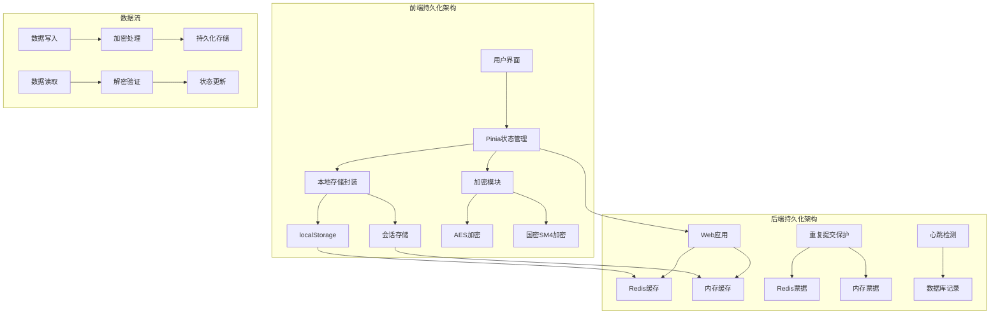

**图表来源**
- [local-util.js](file://smart-admin-web-javascript/src/utils/local-util.js#L1-L26)
- [user.js](file://smart-admin-web-javascript/src/store/modules/system/user.js#L1-L50)
- [encrypt.js](file://smart-admin-web-javascript/src/lib/encrypt.js#L1-L121)

## 本地存储策略

### 存储键值管理

系统采用统一的键值常量管理机制，确保存储键的一致性和可维护性。

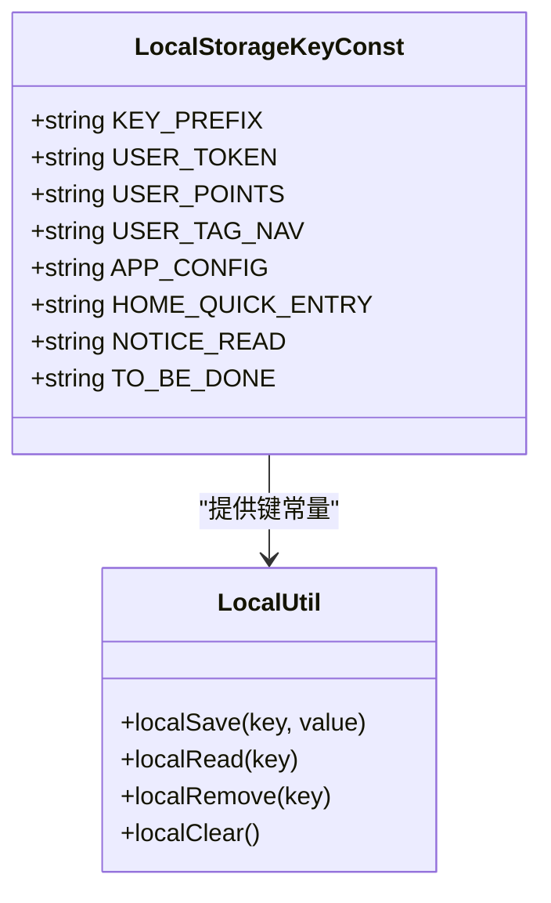

**图表来源**
- [local-storage-key-const.js](file://smart-admin-web-javascript/src/constants/local-storage-key-const.js#L1-L34)
- [local-util.js](file://smart-admin-web-javascript/src/utils/local-util.js#L11-L25)

### 存储策略分类

| 数据类型 | 存储方式 | 生命周期 | 加密级别 | 示例 |
|---------|---------|---------|---------|------|
| 用户认证信息 | localStorage | 会话保持 | 高 | 用户token、权限点 |
| 应用配置信息 | localStorage | 持久化 | 中 | 布局设置、主题配置 |
| 标签页状态 | localStorage | 会话 | 低 | 页面导航历史 |
| 待办事项 | localStorage | 持久化 | 低 | 待办工作列表 |
| 字典数据 | 内存+localStorage | 缓存 | 无 | 系统字典映射 |

**章节来源**
- [local-storage-key-const.js](file://smart-admin-web-javascript/src/constants/local-storage-key-const.js#L18-L33)
- [user.js](file://smart-admin-web-javascript/src/store/modules/system/user.js#L70-L115)

### 序列化处理

系统对复杂对象进行统一的序列化处理，确保数据格式的一致性：

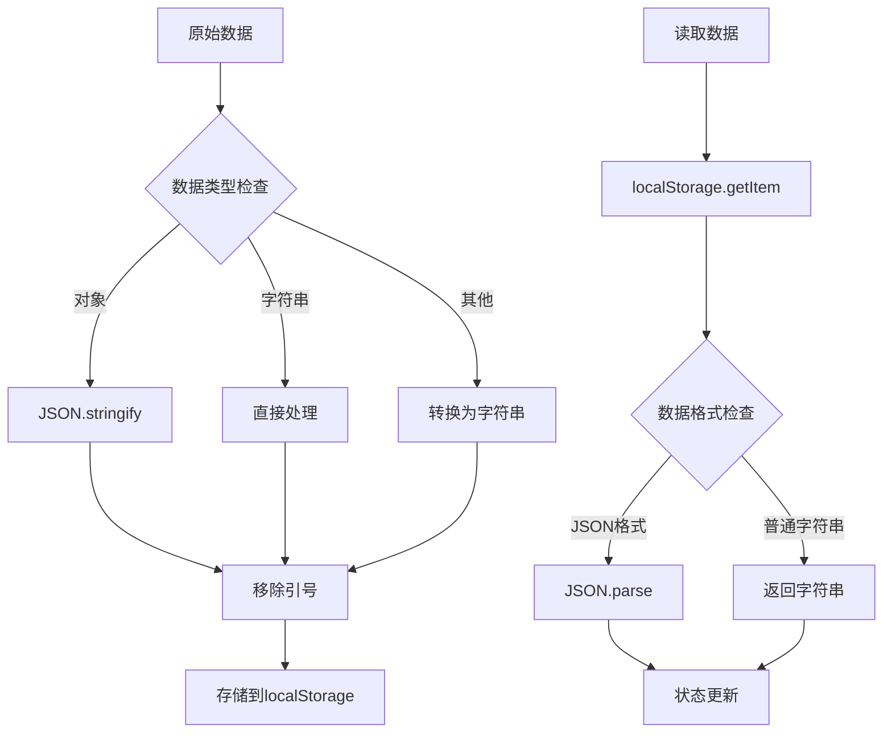

**图表来源**
- [local-util.js](file://smart-admin-web-javascript/src/utils/local-util.js#L11-L25)
- [user.js](file://smart-admin-web-javascript/src/store/modules/system/user.js#L70-L115)

## 状态数据持久化

### 用户状态管理

用户状态是系统持久化的核心，包含认证信息、权限数据和个性化配置。

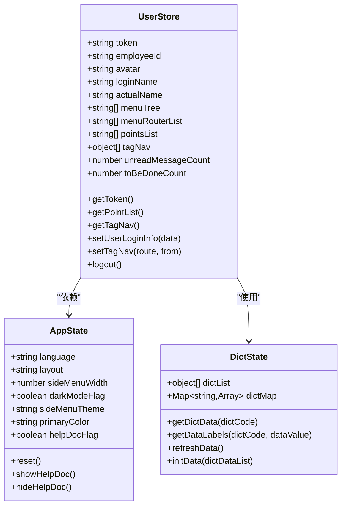

**图表来源**
- [user.js](file://smart-admin-web-javascript/src/store/modules/system/user.js#L20-L68)
- [app-config.js](file://smart-admin-web-javascript/src/store/modules/system/app-config.js#L38-L66)
- [dict.js](file://smart-admin-web-javascript/src/store/modules/system/dict.js#L7-L16)

### 状态同步机制

系统实现了多层次的状态同步机制，确保数据一致性：

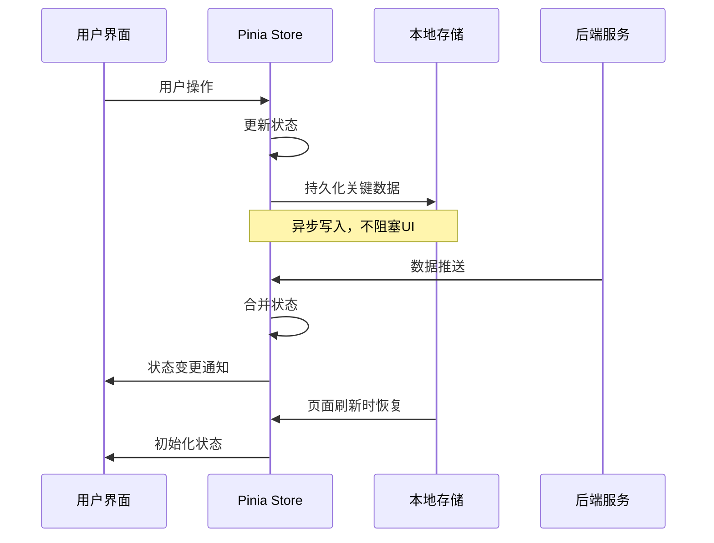

**图表来源**
- [user.js](file://smart-admin-web-javascript/src/store/modules/system/user.js#L118-L250)
- [app-config.js](file://smart-admin-web-javascript/src/store/modules/system/app-config.js#L20-L29)

**章节来源**
- [user.js](file://smart-admin-web-javascript/src/store/modules/system/user.js#L118-L250)
- [app-config.js](file://smart-admin-web-javascript/src/store/modules/system/app-config.js#L20-L29)
- [dict.js](file://smart-admin-web-javascript/src/store/modules/system/dict.js#L56-L86)

## 加密存储方案

### 双重加密算法

系统采用AES和国密SM4双重加密方案，提供灵活的安全选择。

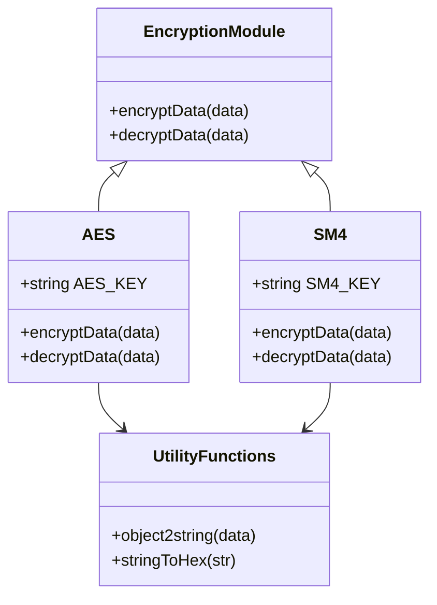

**图表来源**
- [encrypt.js](file://smart-admin-web-javascript/src/lib/encrypt.js#L43-L120)

### 加密流程详解

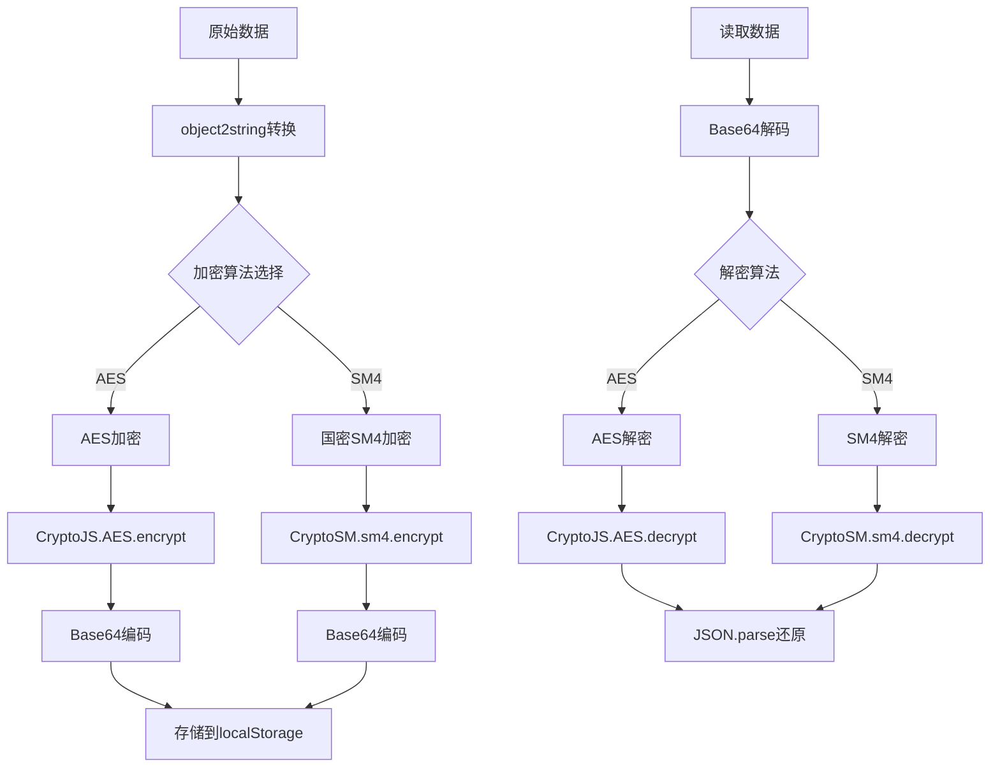

**图表来源**
- [encrypt.js](file://smart-admin-web-javascript/src/lib/encrypt.js#L43-L120)

### 敏感数据保护

| 敏感数据类型 | 加密算法 | 存储位置 | 访问控制 |
|-------------|---------|---------|---------|
| 用户认证token | AES/SM4 | localStorage | 页面级访问 |
| 用户权限点 | AES/SM4 | localStorage | 应用级访问 |
| 系统配置 | AES/SM4 | localStorage | 管理员权限 |
| 字典数据 | 明文 | 内存+localStorage | 无限制访问 |

**章节来源**
- [encrypt.js](file://smart-admin-web-javascript/src/lib/encrypt.js#L43-L120)

## 数据同步机制

### 跨标签页同步

系统通过localStorage事件监听实现跨标签页的数据同步：

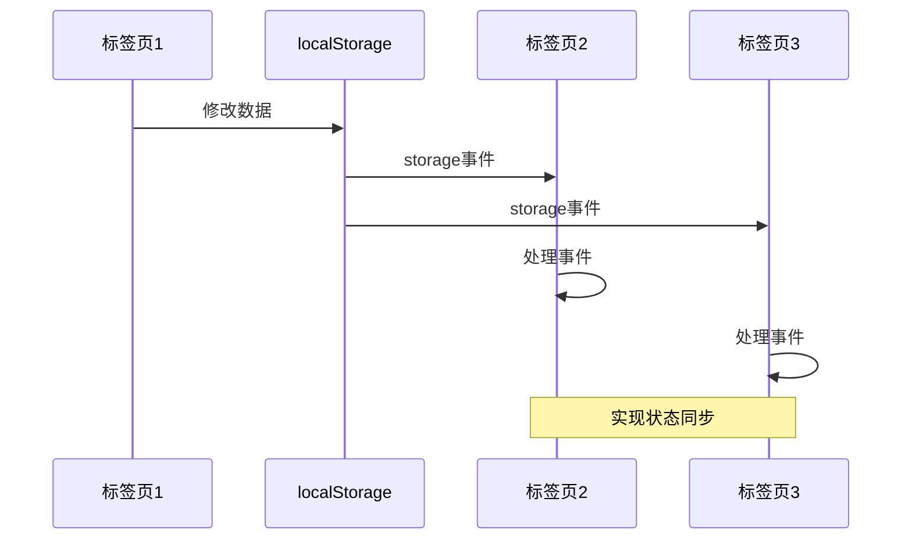

### 异常恢复流程

系统实现了完善的异常恢复机制：

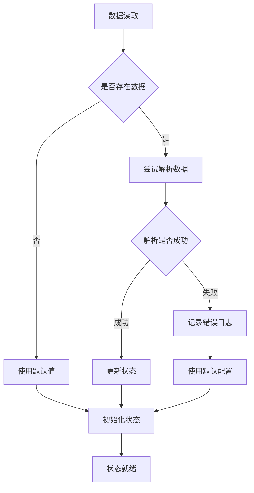

**图表来源**
- [app-config.js](file://smart-admin-web-javascript/src/store/modules/system/app-config.js#L20-L29)

**章节来源**
- [app-config.js](file://smart-admin-web-javascript/src/store/modules/system/app-config.js#L20-L29)
- [spin.js](file://smart-admin-web-javascript/src/store/modules/system/spin.js#L13-L46)

## 异常恢复流程

### 错误处理策略

系统采用多层次的错误处理策略，确保系统的稳定性和用户体验：

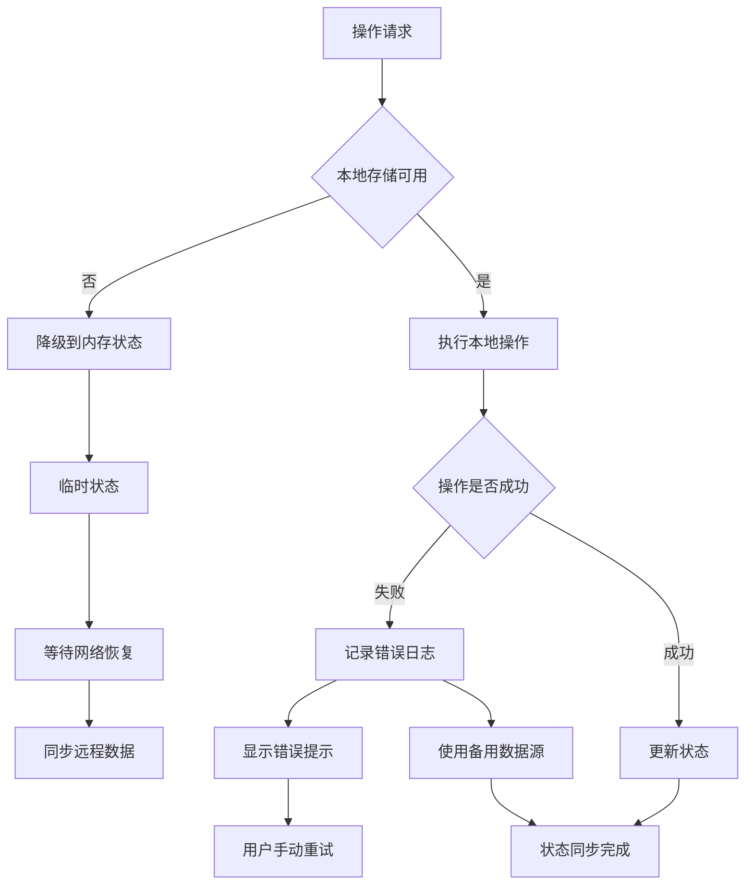

### 数据完整性检查

系统实现了数据完整性检查机制：

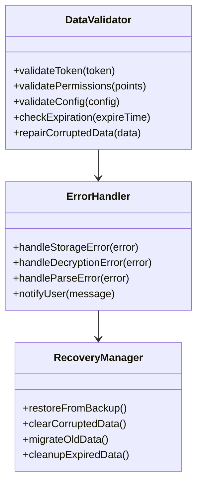

**章节来源**
- [spin.js](file://smart-admin-web-javascript/src/store/modules/system/spin.js#L20-L46)

## 最佳实践

### 存储容量管理

系统实现了智能的存储容量管理策略：

| 存储类型 | 最大容量 | 清理策略 | 优先级 |
|---------|---------|---------|-------|
| 用户token | 1KB | 无限制 | 最高 |
| 应用配置 | 5KB | 版本清理 | 高 |
| 字典数据 | 100KB | 定期清理 | 中 |
| 标签页历史 | 50KB | LRU清理 | 低 |

### 性能优化建议

1. **批量操作**：将多个相关操作合并为批量操作
2. **延迟写入**：对于非关键数据采用异步写入
3. **压缩存储**：对大型数据结构进行压缩存储
4. **缓存策略**：合理设置缓存过期时间

### 安全最佳实践

1. **最小权限原则**：只存储必要的数据
2. **定期轮换**：对敏感数据定期轮换加密密钥
3. **访问审计**：记录所有数据访问操作
4. **防篡改**：实现数据完整性校验

## 性能优化

### 存储性能优化

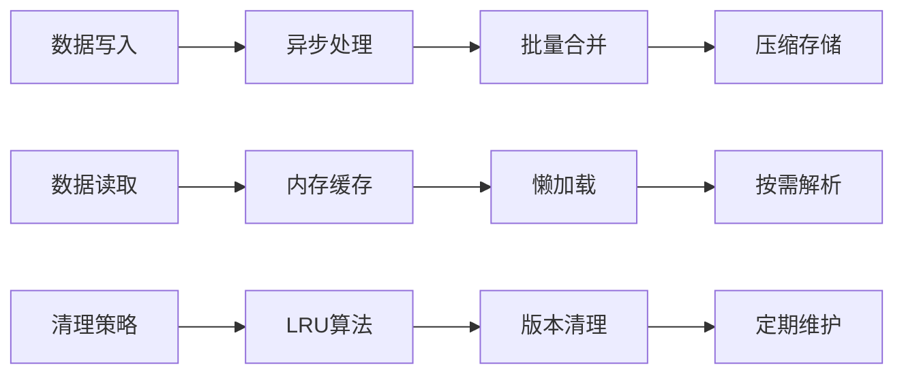

### 内存使用优化

系统采用多种策略优化内存使用：

- **对象池**：重用频繁创建的对象
- **弱引用**：对可重建的数据使用弱引用
- **分片存储**：将大数据拆分为小块存储
- **延迟初始化**：按需加载数据

## 故障排除

### 常见问题诊断

| 问题症状 | 可能原因 | 解决方案 |
|---------|---------|---------|
| 数据丢失 | localStorage空间满 | 清理无用数据 |
| 加密失败 | 密钥不匹配 | 重新初始化密钥 |
| 同步异常 | 浏览器兼容性 | 使用polyfill |
| 性能下降 | 数据量过大 | 实施分页和压缩 |

### 调试工具

系统提供了完整的调试工具链：

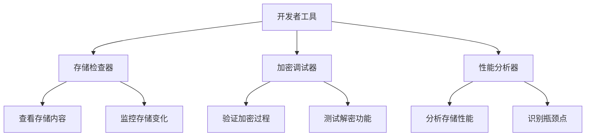

### 监控指标

系统监控以下关键指标：

- 存储命中率
- 加密/解密耗时
- 数据同步延迟
- 错误发生频率
- 存储空间使用率

通过这些全面的持久化策略，SmartAdmin系统实现了高效、安全、可靠的数据持久化解决方案，为用户提供稳定的应用体验。