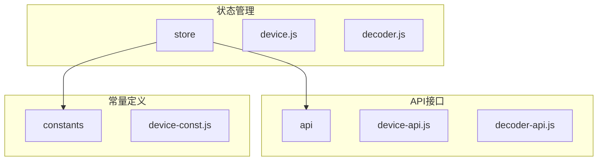
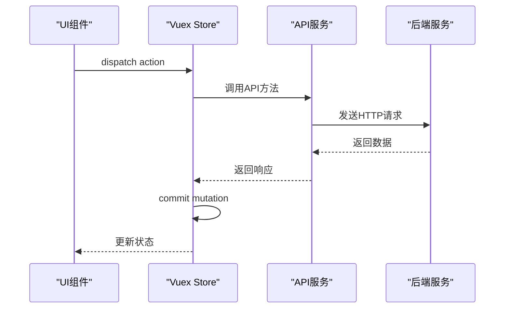
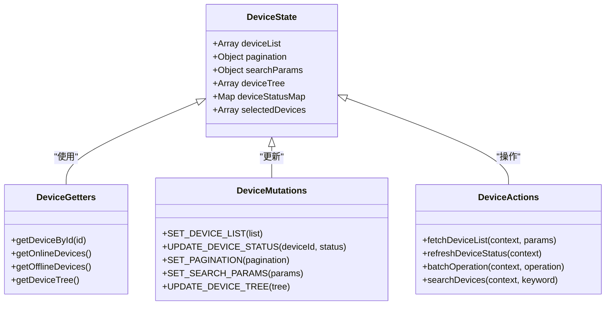
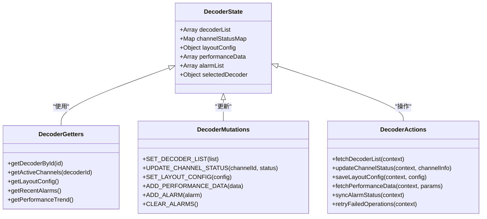
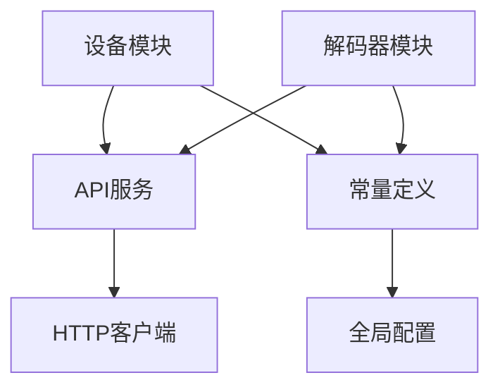

# 业务模块状态管理

<cite>
**本文档引用的文件**  
- [device.js](file://smart-admin-web-javascript/src/store/modules/business/device.js)
- [decoder.js](file://smart-admin-web-javascript/src/store/modules/business/decoder.js)
- [device-api.js](file://smart-admin-web-javascript/src/api/business/smart-video/device-api.js)
- [decoder-api.js](file://smart-admin-web-javascript/src/api/business/smart-video/decoder-api.js)
- [device-const.js](file://smart-admin-web-javascript/src/constants/business/smart-video/device-const.js)
</cite>

## 目录
1. [引言](#引言)
2. [项目结构](#项目结构)
3. [核心组件](#核心组件)
4. [架构概述](#架构概述)
5. [详细组件分析](#详细组件分析)
6. [依赖分析](#依赖分析)
7. [性能考虑](#性能考虑)
8. [故障排除指南](#故障排除指南)
9. [结论](#结论)

## 引言
本文档深入分析智能视频系统中device和decoder两个核心业务模块的状态管理实现。文档详细说明了设备列表的状态管理、设备树结构维护、解码器配置信息存储、解码通道状态管理等关键功能的实现机制，以及状态变更流程、模块间通信和与后端API的交互模式。

## 项目结构
智能视频系统前端项目采用模块化设计，状态管理主要集中在store目录下的业务模块中。设备和解码器相关的状态管理文件位于business子模块中，API接口定义在api目录下对应的smart-video子目录中。

**Diagram sources**
- [device.js](file://smart-admin-web-javascript/src/store/modules/business/device.js)
- [decoder.js](file://smart-admin-web-javascript/src/store/modules/business/decoder.js)
- [device-api.js](file://smart-admin-web-javascript/src/api/business/smart-video/device-api.js)
- [decoder-api.js](file://smart-admin-web-javascript/src/api/business/smart-video/decoder-api.js)

**Section sources**
- [device.js](file://smart-admin-web-javascript/src/store/modules/business/device.js)
- [decoder.js](file://smart-admin-web-javascript/src/store/modules/business/decoder.js)

## 核心组件
设备模块和解码器模块是智能视频系统的核心业务组件，分别负责设备管理和视频解码功能的状态管理。这两个模块采用Vuex进行状态管理，包含state、getters、mutations和actions四个核心部分。

**Section sources**
- [device.js](file://smart-admin-web-javascript/src/store/modules/business/device.js)
- [decoder.js](file://smart-admin-web-javascript/src/store/modules/business/decoder.js)

## 架构概述
系统采用分层架构设计，前端状态管理模块与API服务层分离，通过actions异步调用API接口获取数据，然后通过mutations同步更新state状态。这种设计模式实现了关注点分离，提高了代码的可维护性和可测试性。

**Diagram sources**
- [device.js](file://smart-admin-web-javascript/src/store/modules/business/device.js)
- [decoder.js](file://smart-admin-web-javascript/src/store/modules/business/decoder.js)
- [device-api.js](file://smart-admin-web-javascript/src/api/business/smart-video/device-api.js)
- [decoder-api.js](file://smart-admin-web-javascript/src/api/business/smart-video/decoder-api.js)

## 详细组件分析

### 设备模块分析
设备模块负责管理所有设备相关的状态，包括设备列表、设备树结构、设备状态同步等功能。

#### 状态数据结构设计
设备模块的state设计包含了设备列表、分页信息、搜索条件等核心数据结构，支持数据分页加载和增量更新。

**Diagram sources**
- [device.js](file://smart-admin-web-javascript/src/store/modules/business/device.js)
- [device-const.js](file://smart-admin-web-javascript/src/constants/business/smart-video/device-const.js)

#### 计算属性优化策略
设备模块通过getters提供了多个计算属性，用于高效地从原始数据中派生出常用信息，如按ID查找设备、筛选在线/离线设备等，避免了在组件中重复计算逻辑。

**Section sources**
- [device.js](file://smart-admin-web-javascript/src/store/modules/business/device.js)

### 解码器模块分析
解码器模块负责管理解码器配置、解码通道状态、解码布局设置等核心功能。

#### 状态管理实现
解码器模块的状态管理设计考虑了性能监控数据维护和告警状态同步的需求，通过合理的状态结构设计支持高效的更新操作。

**Diagram sources**
- [decoder.js](file://smart-admin-web-javascript/src/store/modules/business/decoder.js)

#### 异步操作实现
解码器模块的actions实现了数据分页加载、增量更新和错误重试机制，确保在网络不稳定的情况下仍能提供良好的用户体验。

**Section sources**
- [decoder.js](file://smart-admin-web-javascript/src/store/modules/business/decoder.js)
- [decoder-api.js](file://smart-admin-web-javascript/src/api/business/smart-video/decoder-api.js)

## 依赖分析
设备模块和解码器模块都依赖于API服务层进行数据交互，同时共享一些基础的工具函数和常量定义。

**Diagram sources**
- [device.js](file://smart-admin-web-javascript/src/store/modules/business/device.js)
- [decoder.js](file://smart-admin-web-javascript/src/store/modules/business/decoder.js)
- [device-api.js](file://smart-admin-web-javascript/src/api/business/smart-video/device-api.js)
- [decoder-api.js](file://smart-admin-web-javascript/src/api/business/smart-video/decoder-api.js)

**Section sources**
- [device.js](file://smart-admin-web-javascript/src/store/modules/business/device.js)
- [decoder.js](file://smart-admin-web-javascript/src/store/modules/business/decoder.js)

## 性能考虑
状态管理模块在设计时考虑了性能优化，通过合理的数据结构设计和更新策略，避免了不必要的重新渲染。同时，采用了内存管理策略，及时清理不再使用的状态数据，防止内存泄漏。

## 故障排除指南
当遇到状态管理相关问题时，可以检查以下几个方面：
1. 确认actions是否正确dispatch
2. 检查mutations是否正确commit
3. 验证API接口是否正常返回数据
4. 确认getter计算属性是否正确实现

**Section sources**
- [device.js](file://smart-admin-web-javascript/src/store/modules/business/device.js)
- [decoder.js](file://smart-admin-web-javascript/src/store/modules/business/decoder.js)

## 结论
设备和解码器模块的状态管理设计合理，通过Vuex的state、getters、mutations和actions四个核心部分，实现了复杂业务逻辑的高效管理。模块间通信清晰，与后端API的交互模式规范，为系统的稳定运行提供了保障。