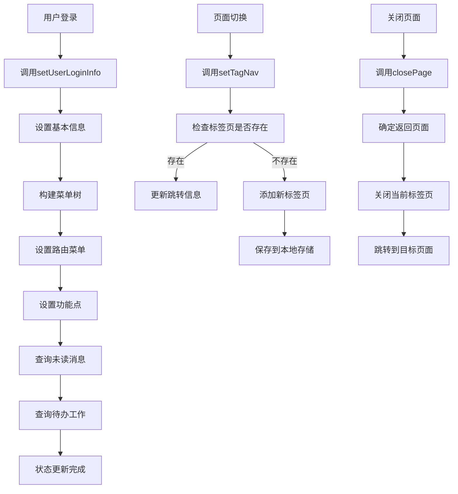
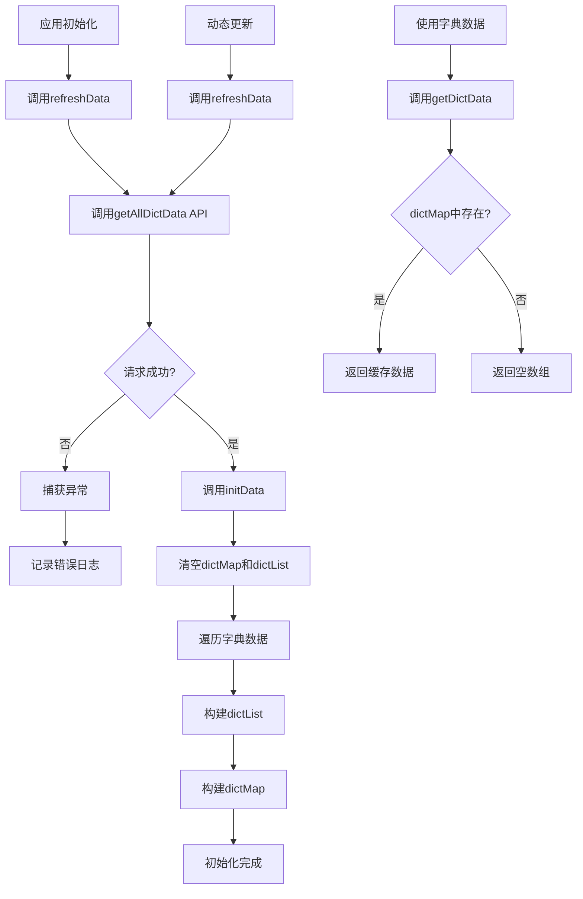
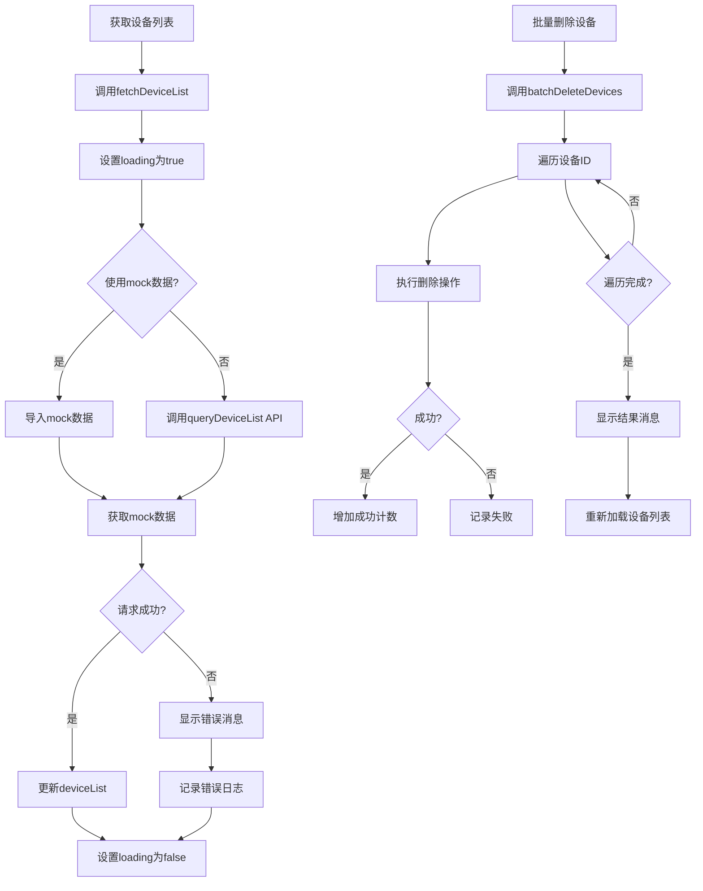
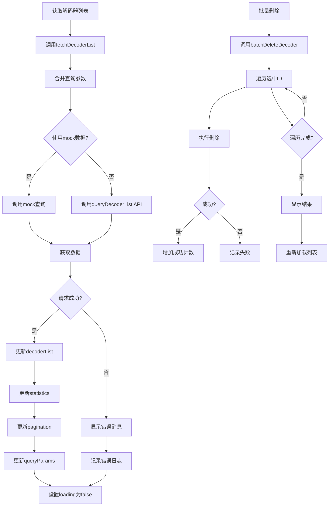

# 模块状态管理

<cite>
**本文档引用文件**  
- [user.js](file://smart-admin-web-javascript\src\store\modules\system\user.js)
- [dict.js](file://smart-admin-web-javascript\src\store\modules\system\dict.js)
- [device.js](file://smart-admin-web-javascript\src\store\modules\business\device.js)
- [decoder.js](file://smart-admin-web-javascript\src\store\modules\business\decoder.js)
- [login-device-const.js](file://smart-admin-web-javascript\src\constants\system\login-device-const.js)
- [dict-const.js](file://smart-admin-web-javascript\src\constants\support\dict-const.js)
- [dict-api.js](file://smart-admin-web-javascript\src\api\support\dict-api.js)
- [device-api.js](file://smart-admin-web-javascript\src\api\business\smart-video\device-api.js)
- [decoder-api.js](file://smart-admin-web-javascript\src\api\business\smart-video\decoder-api.js)
</cite>

## 目录
1. [用户模块状态管理](#用户模块状态管理)
2. [字典模块状态管理](#字典模块状态管理)
3. [设备模块状态管理](#设备模块状态管理)
4. [解码器模块状态管理](#解码器模块状态管理)

## 用户模块状态管理

用户模块状态管理采用Pinia实现，负责管理用户登录状态、权限信息和请求用户对象。状态存储在`user.js`文件中，通过`useUserStore`定义。

**状态结构定义**：
- `token`: 用户认证令牌
- `employeeId`: 员工ID
- `avatar`: 用户头像
- `loginName`: 登录名
- `actualName`: 真实姓名
- `phone`: 手机号
- `departmentId`: 部门ID
- `departmentName`: 部门名称
- `needUpdatePwdFlag`: 是否需要修改密码
- `administratorFlag`: 是否为超级管理员
- `menuTree`: 菜单树形结构
- `menuRouterList`: 路由菜单列表
- `pointsList`: 功能点列表
- `tagNav`: 标签页导航
- `keepAliveIncludes`: 缓存页面列表
- `unreadMessageCount`: 未读消息数量
- `toBeDoneCount`: 待办工作数

**Getter计算属性设计**：
- `getToken`: 获取用户令牌，优先从state获取，若为空则从本地存储读取
- `getNeedUpdatePwdFlag`: 获取密码修改标志
- `getMenuRouterInitFlag`: 检查路由是否已初始化
- `getMenuTree`: 获取菜单树
- `getMenuRouterList`: 获取路由菜单列表
- `getMenuParentIdListMap`: 获取菜单父级ID映射
- `getPointList`: 获取功能点列表，若为空则从本地存储加载
- `getTagNav`: 获取标签页导航，自动添加首页

**Actions异步方法实现**：
- `logout`: 用户登出，清除所有状态和本地存储数据
- `queryUnreadMessageCount`: 查询未读消息数量，通过消息API获取并更新状态
- `queryToBeDoneList`: 查询待办工作数，从本地存储读取并计算未完成数量
- `setUserLoginInfo`: 设置用户登录信息，包括基本信息、菜单树构建、权限分配等
- `setToken`: 设置用户令牌
- `setTagNav`: 设置标签页，支持页面跳转记录
- `closeTagNav`: 关闭标签页，支持关闭单个或全部标签页
- `closePage`: 关闭页面，自动跳转到合适的返回页面
- `pushKeepAliveIncludes`: 添加页面到缓存列表
- `deleteKeepAliveIncludes`: 从缓存列表删除页面
- `clearKeepAliveIncludes`: 清空缓存列表

**状态变更流程图**：

**错误处理机制说明**：
用户模块的错误处理主要通过`smartSentry.captureError`方法实现，该方法会捕获异常并记录到错误日志中。在异步操作中，使用try-catch包裹API调用，确保异常不会导致应用崩溃。例如在`queryUnreadMessageCount`方法中，如果消息API调用失败，会捕获异常并记录日志，但不会中断用户操作流程。

**Section sources**
- [user.js](file://smart-admin-web-javascript\src\store\modules\system\user.js#L20-L308)

## 字典模块状态管理

字典模块状态管理负责数据字典的异步加载、缓存策略和动态更新。状态存储在`dict.js`文件中，通过`useDictStore`定义。

**状态结构定义**：
- `dictList`: 字典code集合，存储所有字典的编码和名称
- `dictMap`: 字典集合，使用Map数据结构存储字典数据，key为字典code，value为字典数据列表

**Getter计算属性设计**：
- `getDictList`: 获取字典code列表
- `getDictData`: 根据字典code获取字典数据列表
- `getDataLabels`: 根据字典code和数据值获取对应的标签名称，支持单个值和多个值（逗号分隔）的查询

**Actions异步方法实现**：
- `refreshData`: 异步刷新字典数据，通过`dictApi.getAllDictData()`获取最新数据并调用`initData`初始化
- `initData`: 初始化字典数据，清空现有数据，遍历API返回的数据，构建`dictList`和`dictMap`

**缓存策略**：
字典模块采用内存缓存策略，所有字典数据加载后存储在`dictMap`中，避免重复请求。`dictMap`使用Map数据结构，提供O(1)的查找性能。字典数据在应用启动时一次性加载，后续使用直接从内存读取。

**动态更新方案**：
当系统配置发生变化或需要刷新字典时，调用`refreshData`方法重新从后端获取所有字典数据。该方法会：
1. 调用`dictApi.getAllDictData()`获取最新字典数据
2. 调用`initData`方法重新初始化状态
3. 清空现有`dictMap`和`dictList`
4. 重新构建字典映射关系

**状态变更流程图**：

**错误处理机制说明**：
字典模块的错误处理在`refreshData`方法中实现，使用try-catch包裹API调用。如果获取字典数据失败，会通过`smartSentry.captureError`记录错误日志，但不会中断应用流程。应用将继续使用现有的缓存数据，确保功能可用性。这种设计保证了即使在后端服务暂时不可用的情况下，前端应用仍能正常运行。

**Section sources**
- [dict.js](file://smart-admin-web-javascript\src\store\modules\system\dict.js#L7-L86)
- [dict-const.js](file://smart-admin-web-javascript\src\constants\support\dict-const.js#L13-L21)
- [dict-api.js](file://smart-admin-web-javascript\src\api\support\dict-api.js#L20-L21)

## 设备模块状态管理

设备模块状态管理负责设备状态同步、实时数据更新和批量操作处理。状态存储在`device.js`文件中，通过`useDeviceStore`定义。

**状态结构定义**：
- `deviceList`: 设备列表，存储所有设备的详细信息
- `groupTreeData`: 分组树数据，存储设备分组的层级结构
- `loading`: 加载状态，标识当前是否在加载数据
- `currentDevice`: 当前设备，存储当前操作的设备信息

**Getter计算属性设计**：
- `onlineDeviceCount`: 计算在线设备数量，通过过滤`deviceList`中状态为'online'的设备
- `offlineDeviceCount`: 计算离线设备数量，通过过滤`deviceList`中状态为'offline'的设备
- `deviceTypeStats`: 统计设备类型分布，返回各设备类型的数量统计

**Actions异步方法实现**：
- `fetchDeviceList`: 获取设备列表，支持使用mock数据或真实API，包含加载状态管理和错误处理
- `fetchGroupTree`: 获取分组树，支持使用mock数据或真实API
- `addDevice`: 添加设备，支持使用mock数据或真实API，成功后显示提示消息
- `updateDevice`: 更新设备，支持使用mock数据或真实API，成功后显示提示消息
- `deleteDevice`: 删除设备，支持使用mock数据或真实API，成功后显示提示消息
- `batchDeleteDevices`: 批量删除设备，支持使用mock数据或真实API，成功后显示删除数量
- `setCurrentDevice`: 设置当前设备，用于设备详情展示
- `clearDeviceList`: 清空设备列表，用于重置状态

**批量操作处理模式**：
批量操作通过`batchDeleteDevices`方法实现，该方法接收设备ID数组作为参数。处理模式如下：
1. 遍历设备ID数组，逐个执行删除操作
2. 统计成功删除的数量
3. 根据成功数量显示相应的提示消息
4. 重新加载设备列表以更新UI

**状态变更流程图**：

**错误处理机制说明**：
设备模块的错误处理采用统一的try-catch模式，在每个异步操作中都包含错误捕获。处理机制包括：
1. 捕获异常并记录到控制台
2. 使用Ant Design的message组件向用户显示友好的错误提示
3. 在finally块中确保loading状态被正确重置
4. 对于批量操作，即使部分失败也继续执行其他操作，并统计最终结果

**Section sources**
- [device.js](file://smart-admin-web-javascript\src\store\modules\business\device.js#L13-L226)
- [device-api.js](file://smart-admin-web-javascript\src\api\business\smart-video\device-api.js#L18-L47)

## 解码器模块状态管理

解码器模块状态管理负责解码器状态同步、实时数据更新和批量操作处理。状态存储在`decoder.js`文件中，通过`useDecoderStore`定义。

**状态结构定义**：
- `decoderList`: 解码器列表，存储所有解码器的详细信息
- `statistics`: 统计信息，包含总数、在线数、离线数、通道使用情况等
- `loading`: 加载状态，标识当前是否在加载数据
- `queryParams`: 查询参数，存储当前的查询条件
- `pagination`: 分页信息，存储当前分页状态
- `selectedRowKeys`: 选中项，存储当前选中的解码器ID

**Getter计算属性设计**：
- `onlineDecoders`: 获取在线解码器列表，过滤状态为1的解码器
- `offlineDecoders`: 获取离线解码器列表，过滤状态为0的解码器
- `hasSelected`: 检查是否有选中项
- `onlineRate`: 计算在线率，基于在线数量和总数
- `channelUsageRate`: 计算通道使用率，基于已使用通道和总通道数

**Actions异步方法实现**：
- `fetchDecoderList`: 获取解码器列表，支持分页查询和条件筛选
- `addDecoder`: 添加解码器，成功后重新加载列表
- `updateDecoder`: 更新解码器，成功后重新加载列表
- `deleteDecoder`: 删除解码器，成功后重新加载列表
- `batchDeleteDecoder`: 批量删除解码器，支持模拟和真实删除
- `testConnection`: 测试连接，验证解码器连接参数
- `restartDecoder`: 重启解码器，发送重启命令
- `getDecoderDetail`: 获取解码器详情
- `getDecoderChannels`: 获取解码器通道信息
- `getStatistics`: 获取统计信息
- `setQueryParams`: 设置查询参数
- `resetQueryParams`: 重置查询参数
- `setSelectedRowKeys`: 设置选中项
- `clearSelectedRowKeys`: 清空选中项
- `setPagination`: 设置分页信息
- `refreshData`: 刷新数据，重新加载解码器列表

**批量操作处理模式**：
批量操作通过`batchDeleteDecoder`方法实现，处理模式如下：
1. 遍历选中的解码器ID
2. 逐个执行删除操作
3. 统计成功删除的数量
4. 显示批量操作结果
5. 重新加载列表以更新UI

**状态变更流程图**：

**错误处理机制说明**：
解码器模块的错误处理机制完善，每个异步操作都包含完整的错误处理流程：
1. 使用try-catch捕获异常
2. 在控制台记录详细的错误信息
3. 使用message组件向用户显示友好的错误提示
4. 在finally块中确保loading状态被正确重置
5. 对于关键操作（如重启），即使API调用成功也会设置延迟更新，确保状态同步

**Section sources**
- [decoder.js](file://smart-admin-web-javascript\src\store\modules\business\decoder.js#L13-L438)
- [decoder-api.js](file://smart-admin-web-javascript\src\api\business\smart-video\decoder-api.js#L21-L58)