# 状态管理

<cite>
**本文档引用的文件**
- [index.js](file://smart-admin-web-javascript\src\store\index.js)
- [user.js](file://smart-admin-web-javascript\src\store\modules\system\user.js)
- [dict.js](file://smart-admin-web-javascript\src\store\modules\system\dict.js)
- [app-config.js](file://smart-admin-web-javascript\src\store\modules\system\app-config.js)
- [role.js](file://smart-admin-web-javascript\src\store\modules\system\role.js)
- [spin.js](file://smart-admin-web-javascript\src\store\modules\system\spin.js)
- [device.js](file://smart-admin-web-javascript\src\store\modules\business\device.js)
- [decoder.js](file://smart-admin-web-javascript\src\store\modules\business\decoder.js)
- [local-storage-key-const.js](file://smart-admin-web-javascript\src\constants\local-storage-key-const.js)
- [local-util.js](file://smart-admin-web-javascript\src\utils\local-util.js)
- [main.js](file://smart-admin-web-javascript\src\main.js)
</cite>

## 目录
1. [项目结构](#项目结构)
2. [核心状态管理模块](#核心状态管理模块)
3. [系统模块状态管理](#系统模块状态管理)
4. [业务模块状态管理](#业务模块状态管理)
5. [状态管理流程图](#状态管理流程图)
6. [持久化存储实现](#持久化存储实现)
7. [Store间依赖与通信](#store间依赖与通信)
8. [性能优化建议](#性能优化建议)
9. [具体实现示例](#具体实现示例)
10. [结论](#结论)

## 项目结构

前端状态管理采用Pinia作为核心状态管理库，实现了模块化的store设计。store目录结构清晰地划分为system和business两大模块，分别管理系统级和业务级状态。

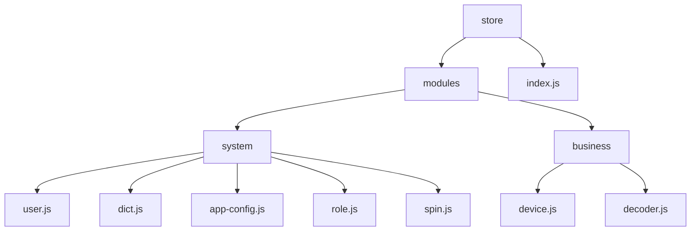

**Diagram sources**
- [index.js](file://smart-admin-web-javascript\src\store\index.js)
- [user.js](file://smart-admin-web-javascript\src\store\modules\system\user.js)
- [dict.js](file://smart-admin-web-javascript\src\store\modules\system\dict.js)
- [device.js](file://smart-admin-web-javascript\src\store\modules\business\device.js)
- [decoder.js](file://smart-admin-web-javascript\src\store\modules\business\decoder.js)

**Section sources**
- [index.js](file://smart-admin-web-javascript\src\store\index.js)

## 核心状态管理模块

项目采用Pinia作为状态管理解决方案，在`store/index.js`中创建了全局store实例。这种设计模式提供了集中式状态管理，确保应用状态的一致性和可预测性。

```javascript
import { createPinia } from 'pinia';
export const store = createPinia();
```

在应用入口`main.js`中，store被正确地挂载到Vue应用实例上，确保所有组件都能访问到全局状态。

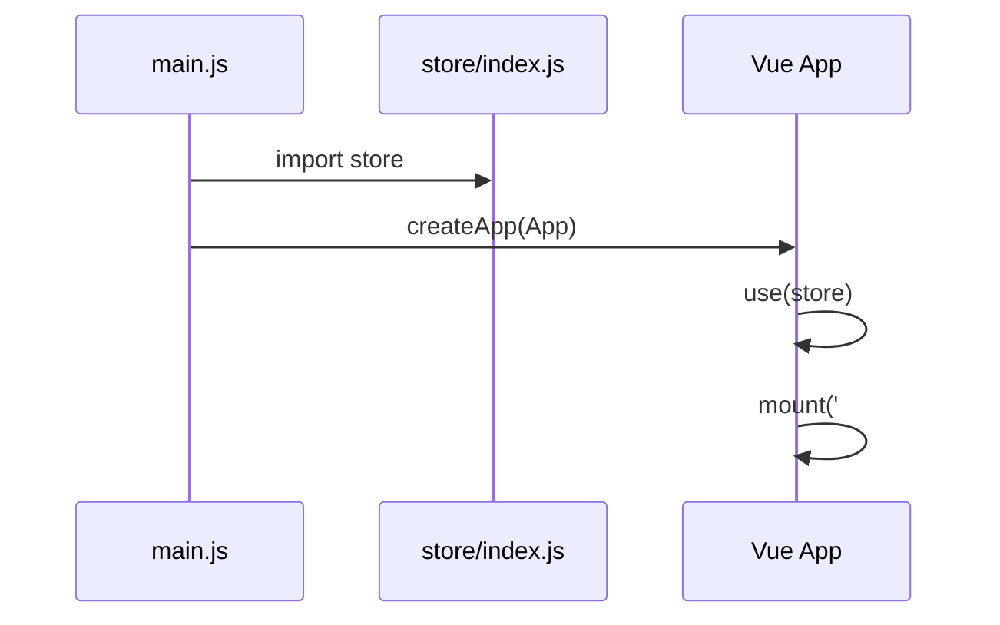

**Diagram sources**
- [index.js](file://smart-admin-web-javascript\src\store\index.js)
- [main.js](file://smart-admin-web-javascript\src\main.js)

**Section sources**
- [index.js](file://smart-admin-web-javascript\src\store\index.js)
- [main.js](file://smart-admin-web-javascript\src\main.js)

## 系统模块状态管理

系统模块(store/modules/system)包含多个核心状态管理store，负责管理用户、字典、应用配置等系统级状态。

### 用户状态管理

`user.js` store管理用户登录状态、权限信息和UI状态，是系统中最核心的状态管理模块之一。

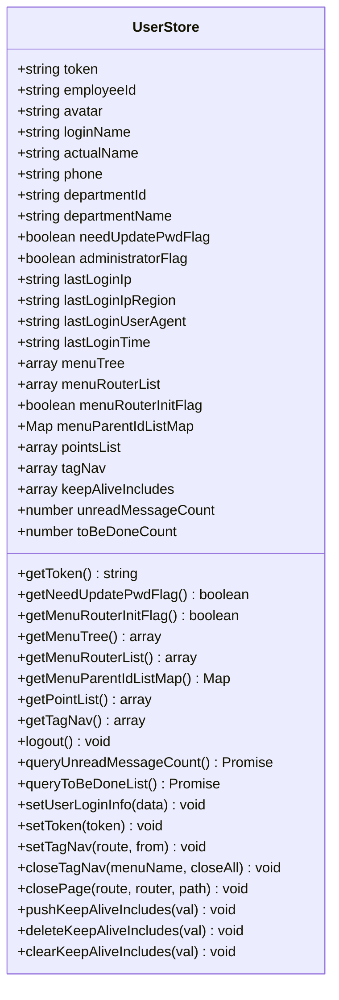

**Diagram sources**
- [user.js](file://smart-admin-web-javascript\src\store\modules\system\user.js)

**Section sources**
- [user.js](file://smart-admin-web-javascript\src\store\modules\system\user.js)

### 字典状态管理

`dict.js` store负责管理数据字典状态，提供字典数据的缓存和查询功能。

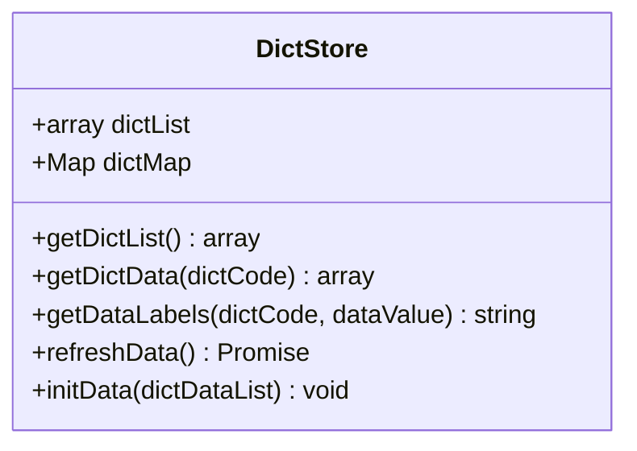

**Diagram sources**
- [dict.js](file://smart-admin-web-javascript\src\store\modules\system\dict.js)

**Section sources**
- [dict.js](file://smart-admin-web-javascript\src\store\modules\system\dict.js)

### 应用配置状态管理

`app-config.js` store管理应用的配置信息，包括布局、主题等UI相关设置。

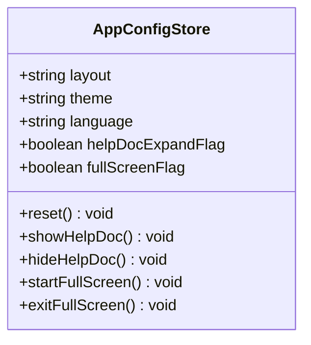

**Diagram sources**
- [app-config.js](file://smart-admin-web-javascript\src\store\modules\system\app-config.js)

**Section sources**
- [app-config.js](file://smart-admin-web-javascript\src\store\modules\system\app-config.js)

## 业务模块状态管理

业务模块(store/modules/business)包含特定业务领域的状态管理，如设备管理和解码器管理。

### 设备状态管理

`device.js` store管理智能视频设备的状态，包括设备列表、分组树和当前设备信息。

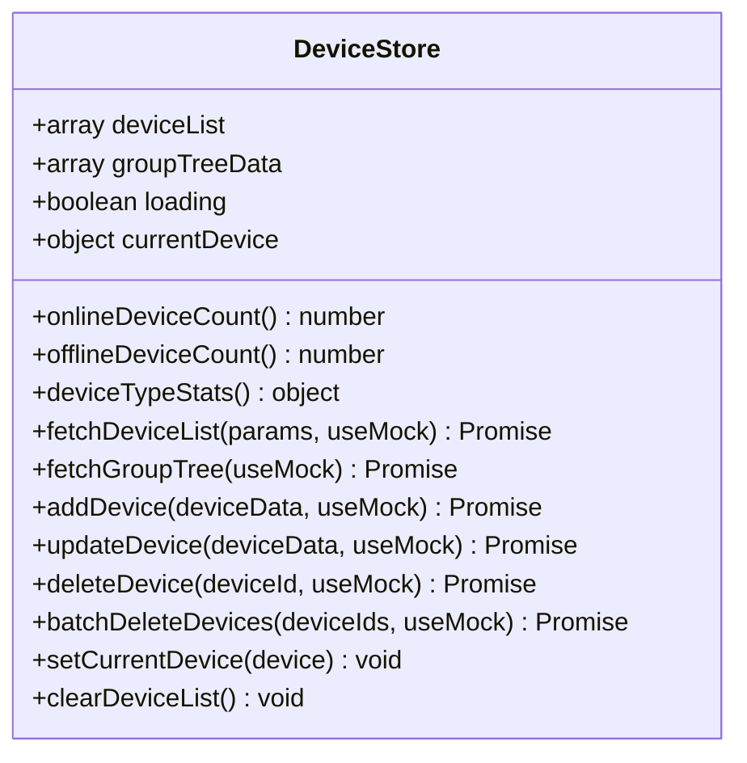

**Diagram sources**
- [device.js](file://smart-admin-web-javascript\src\store\modules\business\device.js)

**Section sources**
- [device.js](file://smart-admin-web-javascript\src\store\modules\business\device.js)

### 解码器状态管理

`decoder.js` store管理解码器的状态，包括解码器列表、统计信息和查询参数。

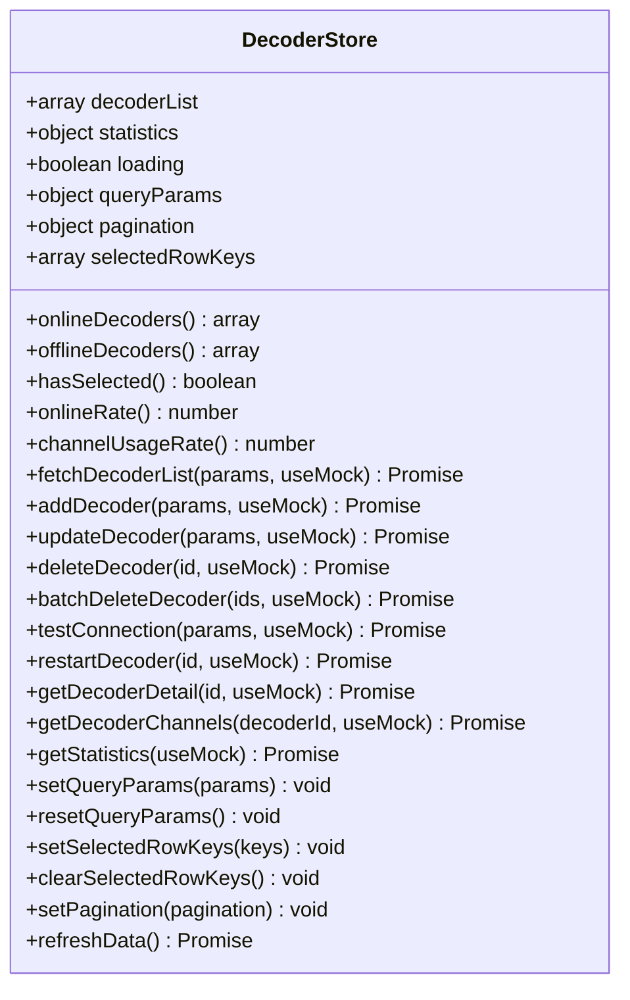

**Diagram sources**
- [decoder.js](file://smart-admin-web-javascript\src\store\modules\business\decoder.js)

**Section sources**
- [decoder.js](file://smart-admin-web-javascript\src\store\modules\business\decoder.js)

## 状态管理流程图

以下流程图展示了状态从store到组件的数据流传递过程：

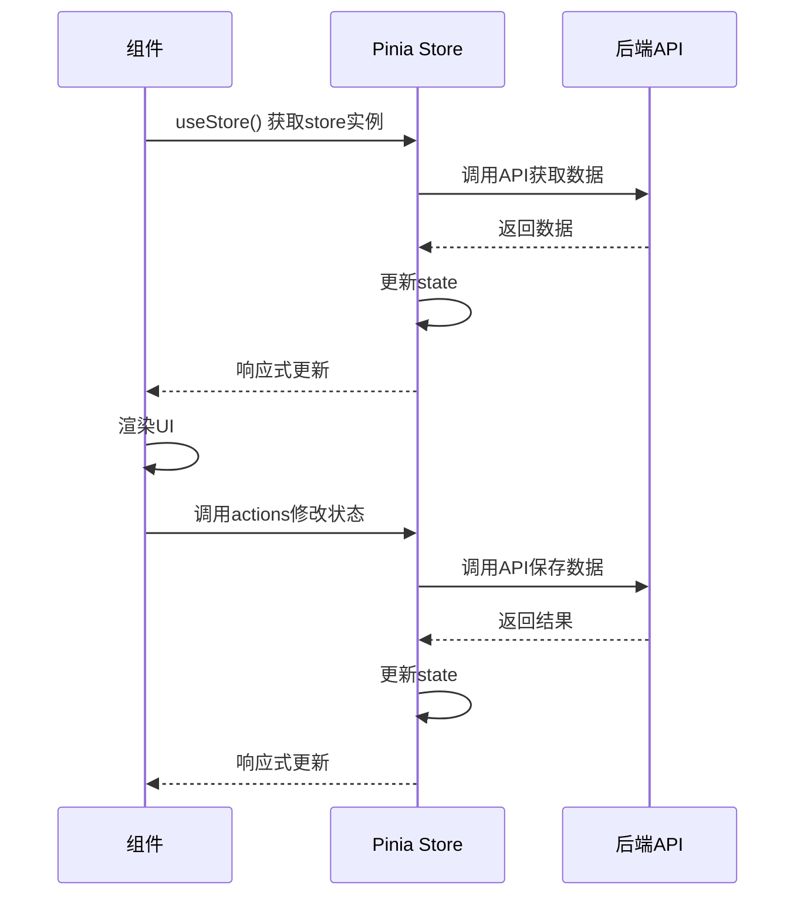

**Diagram sources**
- [user.js](file://smart-admin-web-javascript\src\store\modules\system\user.js)
- [dict.js](file://smart-admin-web-javascript\src\store\modules\system\dict.js)
- [device.js](file://smart-admin-web-javascript\src\store\modules\business\device.js)

**Section sources**
- [user.js](file://smart-admin-web-javascript\src\store\modules\system\user.js)
- [dict.js](file://smart-admin-web-javascript\src\store\modules\system\dict.js)
- [device.js](file://smart-admin-web-javascript\src\store\modules\business\device.js)

## 持久化存储实现

项目实现了完善的持久化存储策略，将关键状态数据保存在localStorage中，确保页面刷新后状态不丢失。

### 本地存储键定义

在`local-storage-key-const.js`中定义了所有本地存储的键名：

```javascript
const KEY_PREFIX = 'smart_admin_';
export default {
  USER_TOKEN: `${KEY_PREFIX}user_token`,
  USER_POINTS: `${KEY_PREFIX}user_points`,
  USER_TAG_NAV: `${KEY_PREFIX}user_tag_nav`,
  APP_CONFIG: `${KEY_PREFIX}app_config`,
  HOME_QUICK_ENTRY: `${KEY_PREFIX}home_quick_entry`,
  NOTICE_READ: `${KEY_PREFIX}notice_read`,
  TO_BE_DONE: `${KEY_PREFIX}to_be_done`,
};
```

### 本地存储工具

`local-util.js`提供了对localStorage的封装操作：

```javascript
export const localSave = (key, value) => {
  localStorage.setItem(key, value);
};

export const localRead = (key) => {
  return localStorage.getItem(key) || '';
};

export const localRemove = (key) => {
  localStorage.removeItem(key);
};
```

### 持久化策略

1. **用户信息持久化**：用户token、基本信息、菜单权限等在登录后保存到localStorage
2. **字典数据持久化**：系统字典数据在初始化时从API获取并缓存
3. **UI状态持久化**：标签页、应用配置等UI状态在用户操作时实时保存
4. **自动清理机制**：在用户登出时清除所有相关存储数据

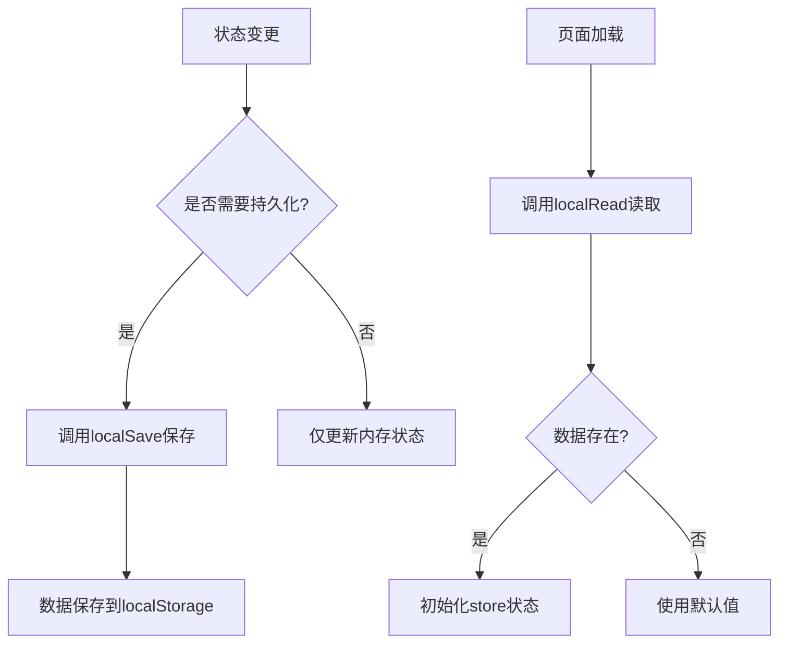

**Diagram sources**
- [local-storage-key-const.js](file://smart-admin-web-javascript\src\constants\local-storage-key-const.js)
- [local-util.js](file://smart-admin-web-javascript\src\utils\local-util.js)
- [user.js](file://smart-admin-web-javascript\src\store\modules\system\user.js)

**Section sources**
- [local-storage-key-const.js](file://smart-admin-web-javascript\src\constants\local-storage-key-const.js)
- [local-util.js](file://smart-admin-web-javascript\src\utils\local-util.js)

## Store间依赖与通信

项目中的store通过合理的依赖管理实现了模块间的通信，避免了循环依赖问题。

### 依赖关系分析

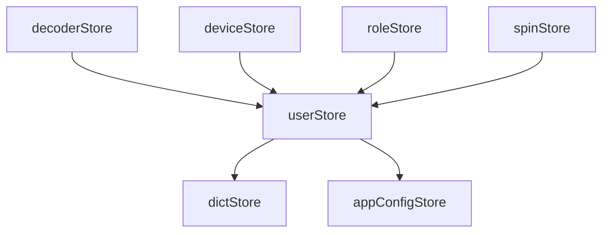

### 通信机制

1. **直接调用**：组件可以直接访问多个store实例
2. **事件驱动**：通过actions触发状态变更
3. **数据共享**：通过getter提供只读数据访问

### 避免循环依赖策略

1. **单向依赖**：确保依赖关系为有向无环图(DAG)
2. **接口隔离**：通过getter提供数据访问，避免直接修改其他store状态
3. **事件总线**：对于复杂的跨store通信，考虑使用事件总线模式

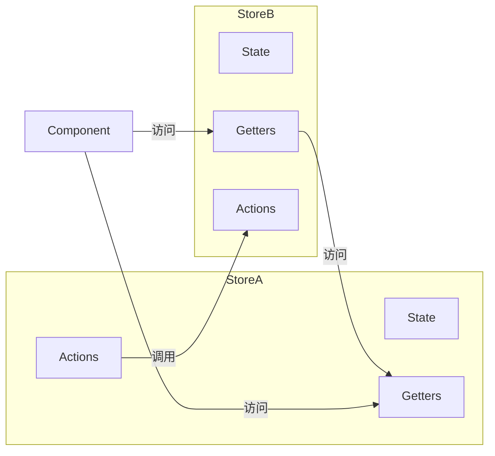

**Diagram sources**
- [user.js](file://smart-admin-web-javascript\src\store\modules\system\user.js)
- [dict.js](file://smart-admin-web-javascript\src\store\modules\system\dict.js)
- [app-config.js](file://smart-admin-web-javascript\src\store\modules\system\app-config.js)

**Section sources**
- [user.js](file://smart-admin-web-javascript\src\store\modules\system\user.js)
- [dict.js](file://smart-admin-web-javascript\src\store\modules\system\dict.js)
- [app-config.js](file://smart-admin-web-javascript\src\store\modules\system\app-config.js)

## 性能优化建议

### 避免过度使用getter

1. **计算属性缓存**：Pinia的getter具有自动缓存机制，避免重复计算
2. **复杂计算分离**：将复杂的计算逻辑移到actions中，只在需要时调用
3. **避免不必要的响应式**：对于不需要响应式更新的数据，使用普通函数处理

### 合理拆分大型store

1. **按功能拆分**：将大型store按功能模块拆分为多个小型store
2. **按数据类型拆分**：将不同类型的数据分离到不同的store中
3. **按生命周期拆分**：将长期存在和短期存在的状态分离

### 其他优化建议

1. **批量更新**：尽量减少频繁的状态更新，合并多个更新操作
2. **懒加载**：对于非关键数据，采用懒加载策略
3. **内存管理**：及时清理不再使用的状态数据
4. **错误处理**：在actions中添加适当的错误处理机制

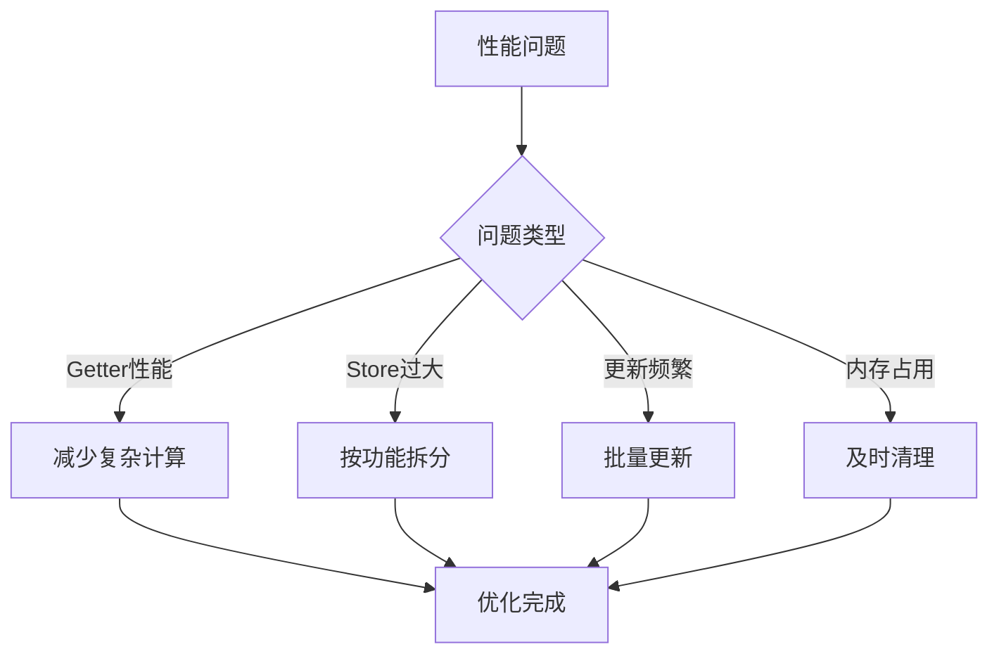

**Section sources**
- [user.js](file://smart-admin-web-javascript\src\store\modules\system\user.js)
- [dict.js](file://smart-admin-web-javascript\src\store\modules\system\dict.js)
- [device.js](file://smart-admin-web-javascript\src\store\modules\business\device.js)

## 具体实现示例

### 用户状态管理实现

用户状态管理涵盖了登录、权限、UI状态等多个方面：

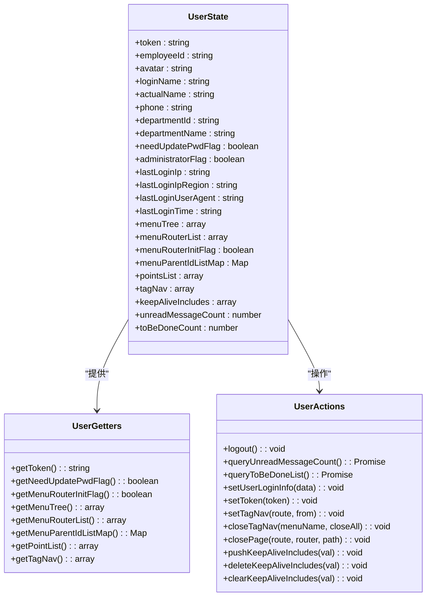

**Diagram sources**
- [user.js](file://smart-admin-web-javascript\src\store\modules\system\user.js)

**Section sources**
- [user.js](file://smart-admin-web-javascript\src\store\modules\system\user.js)

### 权限状态管理实现

权限状态管理主要通过角色store实现：

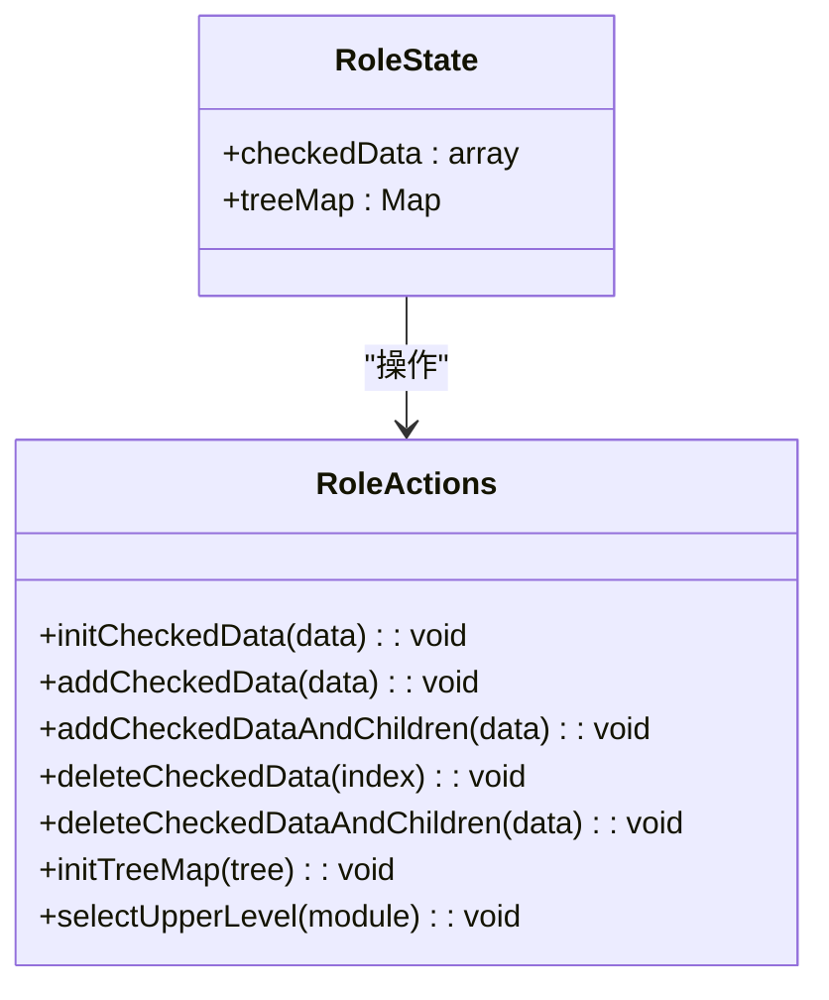

**Diagram sources**
- [role.js](file://smart-admin-web-javascript\src\store\modules\system\role.js)

**Section sources**
- [role.js](file://smart-admin-web-javascript\src\store\modules\system\role.js)

### 设备状态管理实现

设备状态管理涵盖了设备列表、分组树和当前设备信息：

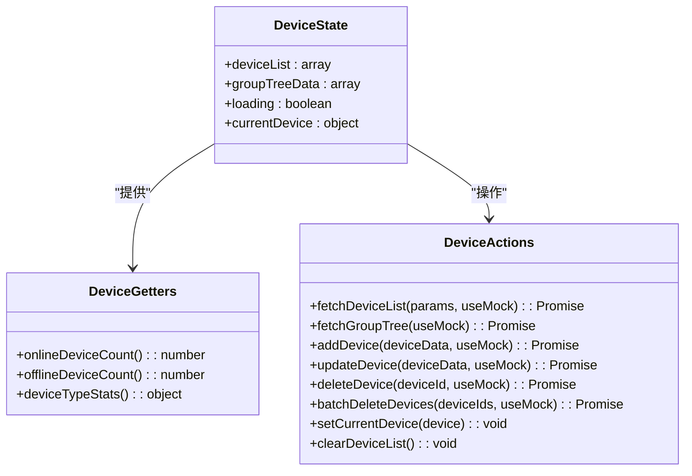

**Diagram sources**
- [device.js](file://smart-admin-web-javascript\src\store\modules\business\device.js)

**Section sources**
- [device.js](file://smart-admin-web-javascript\src\store\modules\business\device.js)

## 结论

本项目基于Pinia实现了完善的前端状态管理方案，具有以下特点：

1. **模块化设计**：清晰地划分为system和business模块，实现了关注点分离
2. **数据隔离**：每个store管理特定领域的状态，避免了状态污染
3. **持久化策略**：关键状态数据通过localStorage实现持久化
4. **合理的依赖管理**：通过单向依赖和接口隔离避免了循环依赖
5. **性能优化**：通过合理的store拆分和getter使用优化了性能

该状态管理方案为大型前端应用提供了稳定、可维护的状态管理基础，能够有效支持复杂业务场景的需求。